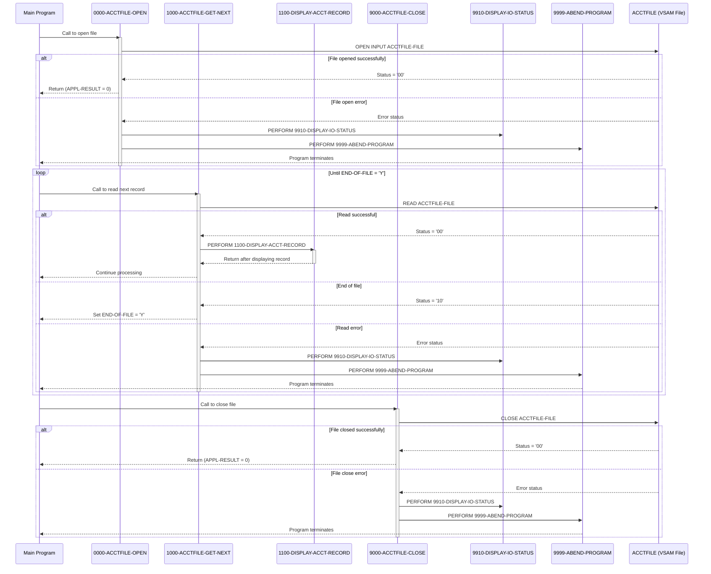

# CBACT01C

## Overview
This batch COBOL program (CBACT01C) reads and displays account data from an indexed VSAM file. It sequentially processes account records from the ACCTFILE, displaying detailed account information for each record including account ID, status, balance, credit limits, and dates. The program includes comprehensive error handling for file operations, with specific routines for opening, reading, and closing the file. If any file operation errors occur, the program displays the error status and terminates with an abend. The program is part of the CardDemo application, which demonstrates AWS and partner technologies for mainframe migration and modernization scenarios.

## Metadata
**Program ID**: `CBACT01C`

**Author**: `AWS`

## Sequence Diagram


## Referenced Copybooks
- [`CVACT01Y`](copybooks/CVACT01Y.md)

## Environment Division

### INPUT-OUTPUT SECTION
This environment section defines the file control parameters for ACCTFILE-FILE, which is the indexed VSAM file containing account records. The file is configured for sequential access mode, using FD-ACCT-ID as the record key. File operations status will be tracked through the ACCTFILE-STATUS field, allowing the program to implement error handling for file operations. The file is externally assigned to the ACCTFILE DD name, which would be defined in the JCL that executes this program.
<details><summary>Code</summary>
```cobol
FILE-CONTROL.                                                            
           SELECT ACCTFILE-FILE ASSIGN TO ACCTFILE                              
                  ORGANIZATION IS INDEXED                                       
                  ACCESS MODE  IS SEQUENTIAL                                    
                  RECORD KEY   IS FD-ACCT-ID                                    
                  FILE STATUS  IS ACCTFILE-STATUS.                              
      *
```
</details>


## Data Division

### FILE SECTION
This section defines the file structure for ACCTFILE-FILE, which contains account records being processed by the program. Each record consists of two fields: an 11-digit numeric account identifier (FD-ACCT-ID) and a 289-character data portion (FD-ACCT-DATA) that holds the remaining account information. This structure allows the program to access the account ID separately from the rest of the account data when reading records from the VSAM file.
<details><summary>Code</summary>
```cobol
FD  ACCTFILE-FILE.                                                       
       01  FD-ACCTFILE-REC.                                                     
           05 FD-ACCT-ID                        PIC 9(11).                      
           05 FD-ACCT-DATA                      PIC X(289).
```
</details>


### WORKING-STORAGE SECTION
This Working Storage Section defines the data structures used for file status tracking and error handling in the CBACT01C program. It includes the CVACT01Y copybook, file status fields for the ACCTFILE (ACCTFILE-STATUS), and general I/O status tracking variables. The section contains binary fields for status code conversion, application result codes with condition names for success (APPL-AOK) and end-of-file (APPL-EOF) states, an END-OF-FILE flag, and fields for storing abend codes and timing information. These variables support the program's file operations and error handling capabilities when processing account records.
<details><summary>Code</summary>
```cobol
*****************************************************************         
       COPY CVACT01Y.                                                           
       01  ACCTFILE-STATUS.                                                     
           05  ACCTFILE-STAT1      PIC X.                                       
           05  ACCTFILE-STAT2      PIC X.                                       
                                                                                
       01  IO-STATUS.                                                           
           05  IO-STAT1            PIC X.                                       
           05  IO-STAT2            PIC X.                                       
       01  TWO-BYTES-BINARY        PIC 9(4) BINARY.                             
       01  TWO-BYTES-ALPHA         REDEFINES TWO-BYTES-BINARY.                  
           05  TWO-BYTES-LEFT      PIC X.                                       
           05  TWO-BYTES-RIGHT     PIC X.                                       
       01  IO-STATUS-04.                                                        
           05  IO-STATUS-0401      PIC 9   VALUE 0.                             
           05  IO-STATUS-0403      PIC 999 VALUE 0.                             
                                                                                
       01  APPL-RESULT             PIC S9(9)   COMP.                            
           88  APPL-AOK            VALUE 0.                                     
           88  APPL-EOF            VALUE 16.                                    
                                                                                
       01  END-OF-FILE             PIC X(01)    VALUE 'N'.                      
       01  ABCODE                  PIC S9(9) BINARY.                            
       01  TIMING                  PIC S9(9) BINARY.                            
                                                                                
      *****************************************************************
```
</details>


## Procedure Division

### 1000-ACCTFILE-GET-NEXT
This paragraph handles the sequential reading of account records from the ACCTFILE. It reads the next record into the ACCOUNT-RECORD structure and processes the result based on the file status. If the read is successful (status '00'), it sets APPL-RESULT to 0 and displays the account record by calling the 1100-DISPLAY-ACCT-RECORD paragraph. If the end of file is reached (status '10'), it sets APPL-RESULT to 16. For any other file status, it sets APPL-RESULT to 12, indicating an error. The paragraph then evaluates APPL-RESULT: if processing is successful, it continues; if end-of-file is detected, it sets the END-OF-FILE flag to 'Y'; for any other error, it displays an error message, shows the file status via 9910-DISPLAY-IO-STATUS, and terminates the program by calling 9999-ABEND-PROGRAM.
<details><summary>Code</summary>
```cobol
READ ACCTFILE-FILE INTO ACCOUNT-RECORD.                              
           IF  ACCTFILE-STATUS = '00'                                           
               MOVE 0 TO APPL-RESULT                                            
               PERFORM 1100-DISPLAY-ACCT-RECORD                                 
           ELSE                                                                 
               IF  ACCTFILE-STATUS = '10'                                       
                   MOVE 16 TO APPL-RESULT                                       
               ELSE                                                             
                   MOVE 12 TO APPL-RESULT                                       
               END-IF                                                           
           END-IF                                                               
           IF  APPL-AOK                                                         
               CONTINUE                                                         
           ELSE                                                                 
               IF  APPL-EOF                                                     
                   MOVE 'Y' TO END-OF-FILE                                      
               ELSE                                                             
                   DISPLAY 'ERROR READING ACCOUNT FILE'                         
                   MOVE ACCTFILE-STATUS TO IO-STATUS                            
                   PERFORM 9910-DISPLAY-IO-STATUS                               
                   PERFORM 9999-ABEND-PROGRAM                                   
               END-IF                                                           
           END-IF                                                               
           EXIT.                                                                
      *---------------------------------------------------------------*
```
</details>


### 1100-DISPLAY-ACCT-RECORD
This paragraph displays the details of an account record to the console output. It formats and prints all key account information including the account ID, active status, current balance, credit limits (both regular and cash), important dates (open date, expiration date, reissue date), current cycle credit and debit amounts, and the account group ID. After displaying all fields, it prints a separator line of dashes and exits the paragraph. This routine is used for data verification and debugging purposes when processing account records.
<details><summary>Code</summary>
```cobol
DISPLAY 'ACCT-ID                 :'   ACCT-ID                        
           DISPLAY 'ACCT-ACTIVE-STATUS      :'   ACCT-ACTIVE-STATUS             
           DISPLAY 'ACCT-CURR-BAL           :'   ACCT-CURR-BAL                  
           DISPLAY 'ACCT-CREDIT-LIMIT       :'   ACCT-CREDIT-LIMIT              
           DISPLAY 'ACCT-CASH-CREDIT-LIMIT  :'   ACCT-CASH-CREDIT-LIMIT         
           DISPLAY 'ACCT-OPEN-DATE          :'   ACCT-OPEN-DATE                 
           DISPLAY 'ACCT-EXPIRAION-DATE     :'   ACCT-EXPIRAION-DATE            
           DISPLAY 'ACCT-REISSUE-DATE       :'   ACCT-REISSUE-DATE              
           DISPLAY 'ACCT-CURR-CYC-CREDIT    :'   ACCT-CURR-CYC-CREDIT           
           DISPLAY 'ACCT-CURR-CYC-DEBIT     :'   ACCT-CURR-CYC-DEBIT            
           DISPLAY 'ACCT-GROUP-ID           :'   ACCT-GROUP-ID                  
           DISPLAY '-------------------------------------------------'          
           EXIT.                                                                
      *---------------------------------------------------------------*
```
</details>


### 0000-ACCTFILE-OPEN
This paragraph handles the opening of the ACCTFILE-FILE for input processing. It initializes APPL-RESULT to 8, attempts to open the file, and then sets APPL-RESULT to 0 if successful or 12 if unsuccessful. If the operation fails (APPL-AOK is not true), it displays an error message, captures the file status code, calls a routine to display the I/O status details, and then terminates the program with an abend. The paragraph includes proper error handling to ensure file access issues are clearly reported before program termination.
<details><summary>Code</summary>
```cobol
MOVE 8 TO APPL-RESULT.                                               
           OPEN INPUT ACCTFILE-FILE                                             
           IF  ACCTFILE-STATUS = '00'                                           
               MOVE 0 TO APPL-RESULT                                            
           ELSE                                                                 
               MOVE 12 TO APPL-RESULT                                           
           END-IF                                                               
           IF  APPL-AOK                                                         
               CONTINUE                                                         
           ELSE                                                                 
               DISPLAY 'ERROR OPENING ACCTFILE'                                 
               MOVE ACCTFILE-STATUS TO IO-STATUS                                
               PERFORM 9910-DISPLAY-IO-STATUS                                   
               PERFORM 9999-ABEND-PROGRAM                                       
           END-IF                                                               
           EXIT.                                                                
      *---------------------------------------------------------------*
```
</details>


### 9000-ACCTFILE-CLOSE
This paragraph handles the closing of the ACCTFILE-FILE and includes error handling logic. It first sets APPL-RESULT to 8, then attempts to close the file. If the operation is successful (status code '00'), it resets APPL-RESULT to zero; otherwise, it sets APPL-RESULT to 12 to indicate an error. When an error occurs, the paragraph displays an error message, captures the file status code, calls a routine to display the I/O status details, and then terminates the program with an abend. This ensures proper resource cleanup and provides meaningful error information when file closing operations fail.
<details><summary>Code</summary>
```cobol
ADD 8 TO ZERO GIVING APPL-RESULT.                                    
           CLOSE ACCTFILE-FILE                                                  
           IF  ACCTFILE-STATUS = '00'                                           
               SUBTRACT APPL-RESULT FROM APPL-RESULT                            
           ELSE                                                                 
               ADD 12 TO ZERO GIVING APPL-RESULT                                
           END-IF                                                               
           IF  APPL-AOK                                                         
               CONTINUE                                                         
           ELSE                                                                 
               DISPLAY 'ERROR CLOSING ACCOUNT FILE'                             
               MOVE ACCTFILE-STATUS TO IO-STATUS                                
               PERFORM 9910-DISPLAY-IO-STATUS                                   
               PERFORM 9999-ABEND-PROGRAM                                       
           END-IF                                                               
           EXIT.
```
</details>


### 9999-ABEND-PROGRAM
This paragraph handles program termination when a critical error occurs. It displays an "ABENDING PROGRAM" message, resets the TIMING variable to zero, sets the abend code to 999, and then calls the Language Environment service 'CEE3ABD' to abnormally terminate the program. This provides a controlled way to end execution when unrecoverable errors are encountered, ensuring the program doesn't continue processing with invalid data or states.
<details><summary>Code</summary>
```cobol
DISPLAY 'ABENDING PROGRAM'                                           
           MOVE 0 TO TIMING                                                     
           MOVE 999 TO ABCODE                                                   
           CALL 'CEE3ABD'.                                                      
                                                                                
      *****************************************************************
```
</details>


### 9910-DISPLAY-IO-STATUS
This paragraph handles the formatting and display of file I/O status codes for error reporting. When an I/O error occurs, it processes the status code differently based on whether it's numeric or if the first digit is '9' (indicating a serious error). For these special cases, it preserves the first digit and converts the second digit to a 4-digit display format. For standard numeric status codes, it formats them as a 4-digit code with leading zeros. The formatted status code is then displayed with a descriptive message to help with troubleshooting file operations. This standardized error reporting ensures consistent and clear communication of file operation issues.
<details><summary>Code</summary>
```cobol
IF  IO-STATUS NOT NUMERIC                                            
           OR  IO-STAT1 = '9'                                                   
               MOVE IO-STAT1 TO IO-STATUS-04(1:1)                               
               MOVE 0        TO TWO-BYTES-BINARY                                
               MOVE IO-STAT2 TO TWO-BYTES-RIGHT                                 
               MOVE TWO-BYTES-BINARY TO IO-STATUS-0403                          
               DISPLAY 'FILE STATUS IS: NNNN' IO-STATUS-04                      
           ELSE                                                                 
               MOVE '0000' TO IO-STATUS-04                                      
               MOVE IO-STATUS TO IO-STATUS-04(3:2)                              
               DISPLAY 'FILE STATUS IS: NNNN' IO-STATUS-04                      
           END-IF                                                               
           EXIT.                                                                
                                                                                
      *
      * Ver: CardDemo_v1.0-15-g27d6c6f-68 Date: 2022-07-19 23:12:31 CDT
      *
```
</details>
