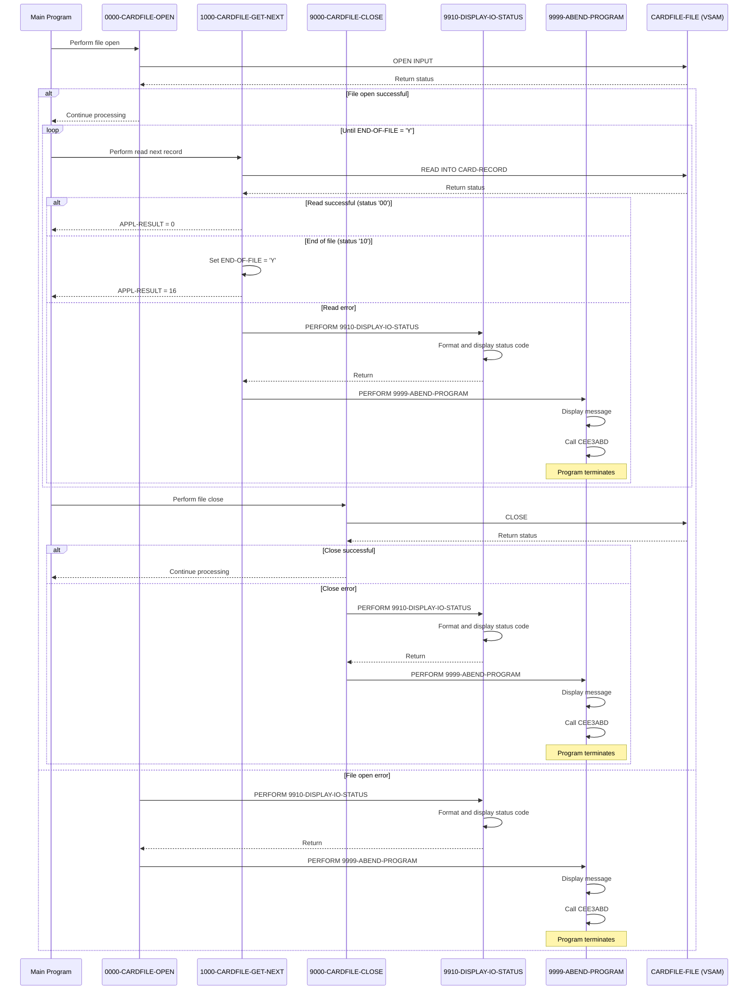

# CBACT02C

## Overview
This batch program reads card data from an indexed VSAM file and displays each record. It sequentially processes the CARDFILE, which contains credit card information, and prints the contents to standard output. The program includes comprehensive error handling for file operations (open, read, close) with detailed status code reporting. It incorporates standard file processing patterns with status checking after each operation and will terminate with a controlled abend if any errors occur. The program is part of the CardDemo application suite designed to showcase AWS mainframe migration capabilities.

## Metadata
**Program ID**: `CBACT02C`

**Author**: `AWS`

## Sequence Diagram


## Referenced Copybooks
- [`CVACT02Y`](copybooks/CVACT02Y.md)

## Environment Division

### INPUT-OUTPUT SECTION
This section configures the CARDFILE-FILE as an indexed VSAM file with sequential access mode. It assigns the file to the external name CARDFILE, defines FD-CARD-NUM as the primary key field, and establishes CARDFILE-STATUS as the file status variable for error handling. The file will be processed sequentially, allowing the program to read through all card records in order.
<details><summary>Code</summary>
```cobol
FILE-CONTROL.                                                            
           SELECT CARDFILE-FILE ASSIGN TO   CARDFILE                            
                  ORGANIZATION IS INDEXED                                       
                  ACCESS MODE  IS SEQUENTIAL                                    
                  RECORD KEY   IS FD-CARD-NUM                                   
                  FILE STATUS  IS CARDFILE-STATUS.                              
      *
```
</details>


## Data Division

### FILE SECTION
This section defines the file structure for CARDFILE-FILE, which contains credit card records. The record layout consists of two fields: a 16-character card number field (FD-CARD-NUM) and a 134-character field for additional card data (FD-CARD-DATA). This structure is used to read credit card information from the indexed VSAM file that the program processes.
<details><summary>Code</summary>
```cobol
FD  CARDFILE-FILE.                                                       
       01  FD-CARDFILE-REC.                                                     
           05 FD-CARD-NUM                       PIC X(16).                      
           05 FD-CARD-DATA                      PIC X(134).
```
</details>


### WORKING-STORAGE SECTION
This Working Storage section defines the data structures used for file status tracking and error handling in the CBACT02C program. It includes file status variables for CARDFILE operations, binary-to-character conversion fields, and program control flags. The section incorporates the CVACT02Y copybook and defines status codes for tracking file operations with detailed error reporting capabilities. Key elements include the APPL-RESULT field with condition names for normal processing and end-of-file conditions, an END-OF-FILE flag, and fields for storing abend codes and timing information. These structures support the program's primary function of reading and displaying card data while providing robust error handling.
<details><summary>Code</summary>
```cobol
*****************************************************************         
       COPY CVACT02Y.                                                           
       01  CARDFILE-STATUS.                                                     
           05  CARDFILE-STAT1      PIC X.                                       
           05  CARDFILE-STAT2      PIC X.                                       
                                                                                
       01  IO-STATUS.                                                           
           05  IO-STAT1            PIC X.                                       
           05  IO-STAT2            PIC X.                                       
       01  TWO-BYTES-BINARY        PIC 9(4) BINARY.                             
       01  TWO-BYTES-ALPHA         REDEFINES TWO-BYTES-BINARY.                  
           05  TWO-BYTES-LEFT      PIC X.                                       
           05  TWO-BYTES-RIGHT     PIC X.                                       
       01  IO-STATUS-04.                                                        
           05  IO-STATUS-0401      PIC 9   VALUE 0.                             
           05  IO-STATUS-0403      PIC 999 VALUE 0.                             
                                                                                
       01  APPL-RESULT             PIC S9(9)   COMP.                            
           88  APPL-AOK            VALUE 0.                                     
           88  APPL-EOF            VALUE 16.                                    
                                                                                
       01  END-OF-FILE             PIC X(01)    VALUE 'N'.                      
       01  ABCODE                  PIC S9(9) BINARY.                            
       01  TIMING                  PIC S9(9) BINARY.                            
                                                                                
      *****************************************************************
```
</details>


## Procedure Division

### 1000-CARDFILE-GET-NEXT
This paragraph handles the sequential reading of records from the CARDFILE-FILE and processes the result based on file status codes. It reads a record into CARD-RECORD and sets APPL-RESULT to 0 for successful reads (status '00'), 16 for end-of-file conditions (status '10'), or 12 for other errors. When a record is successfully read, processing continues. When end-of-file is reached, it sets END-OF-FILE to 'Y'. For any other file errors, it displays an error message, captures the file status code, calls procedures to display the status details (9910-DISPLAY-IO-STATUS) and terminates the program with a controlled abend (9999-ABEND-PROGRAM). This paragraph implements standard error handling for sequential file reading operations within the CardDemo application.
<details><summary>Code</summary>
```cobol
READ CARDFILE-FILE INTO CARD-RECORD.                                 
           IF  CARDFILE-STATUS = '00'                                           
               MOVE 0 TO APPL-RESULT                                            
      *        DISPLAY CARD-RECORD                                              
           ELSE                                                                 
               IF  CARDFILE-STATUS = '10'                                       
                   MOVE 16 TO APPL-RESULT                                       
               ELSE                                                             
                   MOVE 12 TO APPL-RESULT                                       
               END-IF                                                           
           END-IF                                                               
           IF  APPL-AOK                                                         
               CONTINUE                                                         
           ELSE                                                                 
               IF  APPL-EOF                                                     
                   MOVE 'Y' TO END-OF-FILE                                      
               ELSE                                                             
                   DISPLAY 'ERROR READING CARDFILE'                             
                   MOVE CARDFILE-STATUS TO IO-STATUS                            
                   PERFORM 9910-DISPLAY-IO-STATUS                               
                   PERFORM 9999-ABEND-PROGRAM                                   
               END-IF                                                           
           END-IF                                                               
           EXIT.                                                                
      *---------------------------------------------------------------*
```
</details>


### 0000-CARDFILE-OPEN
This paragraph handles the opening of the CARDFILE-FILE for input processing. It initializes APPL-RESULT to 8, attempts to open the file, and then sets APPL-RESULT to 0 if successful or 12 if unsuccessful based on the CARDFILE-STATUS. If the operation fails (when APPL-AOK is not true), it displays an error message, captures the file status code, calls a routine to display the I/O status details, and then terminates the program with a controlled abend. The paragraph implements standard error handling for file opening operations with appropriate status reporting.
<details><summary>Code</summary>
```cobol
MOVE 8 TO APPL-RESULT.                                               
           OPEN INPUT CARDFILE-FILE                                             
           IF  CARDFILE-STATUS = '00'                                           
               MOVE 0 TO APPL-RESULT                                            
           ELSE                                                                 
               MOVE 12 TO APPL-RESULT                                           
           END-IF                                                               
           IF  APPL-AOK                                                         
               CONTINUE                                                         
           ELSE                                                                 
               DISPLAY 'ERROR OPENING CARDFILE'                                 
               MOVE CARDFILE-STATUS TO IO-STATUS                                
               PERFORM 9910-DISPLAY-IO-STATUS                                   
               PERFORM 9999-ABEND-PROGRAM                                       
           END-IF                                                               
           EXIT.                                                                
      *---------------------------------------------------------------*
```
</details>


### 9000-CARDFILE-CLOSE
This paragraph handles the closing of the CARDFILE-FILE and implements error handling for the operation. It first sets APPL-RESULT to 8, then attempts to close the file. If the operation is successful (status code '00'), it resets APPL-RESULT to zero, indicating normal processing. If the close operation fails, it sets APPL-RESULT to 12, indicating an error. When an error occurs, the paragraph displays an error message, captures the file status code, calls a routine to display the I/O status details, and then terminates the program with a controlled abend. This ensures proper resource cleanup and provides diagnostic information when file closing operations fail.
<details><summary>Code</summary>
```cobol
ADD 8 TO ZERO GIVING APPL-RESULT.                                    
           CLOSE CARDFILE-FILE                                                  
           IF  CARDFILE-STATUS = '00'                                           
               SUBTRACT APPL-RESULT FROM APPL-RESULT                            
           ELSE                                                                 
               ADD 12 TO ZERO GIVING APPL-RESULT                                
           END-IF                                                               
           IF  APPL-AOK                                                         
               CONTINUE                                                         
           ELSE                                                                 
               DISPLAY 'ERROR CLOSING CARDFILE'                                 
               MOVE CARDFILE-STATUS TO IO-STATUS                                
               PERFORM 9910-DISPLAY-IO-STATUS                                   
               PERFORM 9999-ABEND-PROGRAM                                       
           END-IF                                                               
           EXIT.
```
</details>


### 9999-ABEND-PROGRAM
This paragraph handles program termination with a controlled abend. When called, it displays an "ABENDING PROGRAM" message, resets the TIMING variable to zero, sets the abend code to 999, and then invokes the Language Environment service 'CEE3ABD' to abnormally terminate the program. This is likely used as part of the error handling strategy when unrecoverable errors are encountered during file processing.
<details><summary>Code</summary>
```cobol
DISPLAY 'ABENDING PROGRAM'                                           
           MOVE 0 TO TIMING                                                     
           MOVE 999 TO ABCODE                                                   
           CALL 'CEE3ABD'.                                                      
                                                                                
      *****************************************************************
```
</details>


### 9910-DISPLAY-IO-STATUS
This paragraph handles the formatting and display of file I/O status codes for error reporting. It performs special processing for extended file status codes (when the first byte is '9' or the status is non-numeric), converting the second byte to a proper display format. For standard status codes, it formats them with leading zeros. In both cases, it displays the formatted status code with a descriptive message. This standardized error handling routine ensures consistent reporting of file operation results throughout the program, which aids in troubleshooting file access issues.
<details><summary>Code</summary>
```cobol
IF  IO-STATUS NOT NUMERIC                                            
           OR  IO-STAT1 = '9'                                                   
               MOVE IO-STAT1 TO IO-STATUS-04(1:1)                               
               MOVE 0        TO TWO-BYTES-BINARY                                
               MOVE IO-STAT2 TO TWO-BYTES-RIGHT                                 
               MOVE TWO-BYTES-BINARY TO IO-STATUS-0403                          
               DISPLAY 'FILE STATUS IS: NNNN' IO-STATUS-04                      
           ELSE                                                                 
               MOVE '0000' TO IO-STATUS-04                                      
               MOVE IO-STATUS TO IO-STATUS-04(3:2)                              
               DISPLAY 'FILE STATUS IS: NNNN' IO-STATUS-04                      
           END-IF                                                               
           EXIT.                                                                
                                                                                
      *
      * Ver: CardDemo_v1.0-15-g27d6c6f-68 Date: 2022-07-19 23:12:31 CDT
      *
```
</details>
