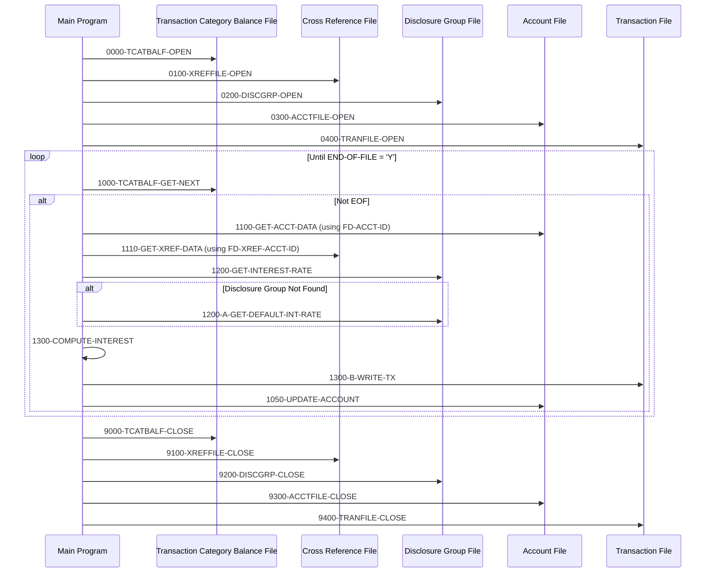

# CBACT04C

## Overview
This program, CBACT04C, is a batch COBOL application that calculates interest for credit card accounts. It processes transaction category balances and applies appropriate interest rates based on account groups and transaction types. The program reads account balances from an indexed file, retrieves interest rates from a disclosure group file, calculates monthly interest, updates account balances, and generates interest transaction records.

The program works by sequentially reading transaction category balance records, looking up the associated account and card information, determining the applicable interest rate from a disclosure group file, calculating interest based on that rate, and then writing transaction records for the interest charges. It also updates the account master records with the new balances that include the calculated interest.

Key features include the ability to fall back to default interest rates when specific rates aren't found, handling of multiple transaction categories per account, and proper maintenance of running totals for interest calculations. The program includes comprehensive error handling for file operations and maintains transaction audit trails by generating detailed transaction records for all interest charges.

## Metadata
**Program ID**: `CBACT04C`

**Author**: `AWS`

## Sequence Diagram


## Referenced Copybooks
- [`CVACT01Y`](copybooks/CVACT01Y.md)
- [`CVTRA05Y`](copybooks/CVTRA05Y.md)
- [`CVTRA01Y`](copybooks/CVTRA01Y.md)
- [`CVACT03Y`](copybooks/CVACT03Y.md)
- [`CVTRA02Y`](copybooks/CVTRA02Y.md)

## Environment Division

### INPUT-OUTPUT SECTION
This INPUT-OUTPUT SECTION defines the five key files used by the interest calculation program. It includes: 1) TCATBAL-FILE, an indexed file accessed sequentially that contains transaction category balances; 2) XREF-FILE, an indexed file accessed randomly by card number or account ID to cross-reference cards to accounts; 3) ACCOUNT-FILE, an indexed file accessed randomly by account ID to retrieve account information; 4) DISCGRP-FILE, an indexed file accessed randomly to retrieve disclosure group information containing interest rates; and 5) TRANSACT-FILE, a sequential output file where interest transaction records are written. Each file definition includes its organization, access mode, key fields, and associated file status variables for error handling.
<details><summary>Code</summary>
```cobol
FILE-CONTROL.                                                            
           SELECT TCATBAL-FILE ASSIGN TO TCATBALF                               
                  ORGANIZATION IS INDEXED                                       
                  ACCESS MODE  IS SEQUENTIAL                                    
                  RECORD KEY   IS FD-TRAN-CAT-KEY                               
                  FILE STATUS  IS TCATBALF-STATUS.                              
                                                                                
           SELECT XREF-FILE ASSIGN TO   XREFFILE                                
                  ORGANIZATION IS INDEXED                                       
                  ACCESS MODE  IS RANDOM                                        
                  RECORD KEY   IS FD-XREF-CARD-NUM                              
                  ALTERNATE RECORD KEY IS FD-XREF-ACCT-ID                       
                  FILE STATUS  IS XREFFILE-STATUS.                              
                                                                                
           SELECT ACCOUNT-FILE ASSIGN TO ACCTFILE                               
                  ORGANIZATION IS INDEXED                                       
                  ACCESS MODE  IS RANDOM                                        
                  RECORD KEY   IS FD-ACCT-ID                                    
                  FILE STATUS  IS ACCTFILE-STATUS.                              
                                                                                
           SELECT DISCGRP-FILE ASSIGN TO DISCGRP                                
                  ORGANIZATION IS INDEXED                                       
                  ACCESS MODE  IS RANDOM                                        
                  RECORD KEY   IS FD-DISCGRP-KEY                                
                  FILE STATUS  IS DISCGRP-STATUS.                               
                                                                                
           SELECT TRANSACT-FILE ASSIGN TO TRANSACT                              
                  ORGANIZATION IS SEQUENTIAL                                    
                  ACCESS MODE  IS SEQUENTIAL                                    
                  FILE STATUS  IS TRANFILE-STATUS.                              
                                                                                
      *
```
</details>


## Data Division

### FILE SECTION
This File Section defines the file structures used by the CBACT04C program for interest calculation processing. It includes five key files:

1. TCATBAL-FILE: Contains transaction category balance records with a composite key consisting of account ID, transaction type code, and transaction category code, followed by transaction category data.

2. XREF-FILE: A cross-reference file that maps credit card numbers to customer numbers and account IDs, allowing the program to link transactions to the appropriate accounts.

3. DISCGRP-FILE: Stores disclosure group information with interest rates, keyed by account group ID, transaction type code, and transaction category code. This file provides the interest rates used in calculations.

4. ACCOUNT-FILE: Contains account master records identified by account ID, storing account details and balances that will be updated with calculated interest.

5. TRANSACT-FILE: Used to write interest transaction records generated by the program, with each record containing a transaction ID and associated account data.

These file structures support the program's core functionality of retrieving account balances, looking up applicable interest rates, calculating interest, and recording the resulting transactions.
<details><summary>Code</summary>
```cobol
FD  TCATBAL-FILE.                                                        
       01  FD-TRAN-CAT-BAL-RECORD.                                              
           05 FD-TRAN-CAT-KEY.                                                  
              10 FD-TRANCAT-ACCT-ID             PIC 9(11).                      
              10 FD-TRANCAT-TYPE-CD             PIC X(02).                      
              10 FD-TRANCAT-CD                  PIC 9(04).                      
           05 FD-FD-TRAN-CAT-DATA               PIC X(33).                      
                                                                                
       FD  XREF-FILE.                                                           
       01  FD-XREFFILE-REC.                                                     
           05 FD-XREF-CARD-NUM                  PIC X(16).                      
           05 FD-XREF-CUST-NUM                  PIC 9(09).                      
           05 FD-XREF-ACCT-ID                   PIC 9(11).                      
           05 FD-XREF-FILLER                    PIC X(14).                      
                                                                                
       FD  DISCGRP-FILE.                                                        
       01  FD-DISCGRP-REC.                                                      
           05 FD-DISCGRP-KEY.                                                   
              10 FD-DIS-ACCT-GROUP-ID           PIC X(10).                      
              10 FD-DIS-TRAN-TYPE-CD            PIC X(02).                      
              10 FD-DIS-TRAN-CAT-CD             PIC 9(04).                      
           05 FD-DISCGRP-DATA                   PIC X(34).                      
                                                                                
       FD  ACCOUNT-FILE.                                                        
       01  FD-ACCTFILE-REC.                                                     
           05 FD-ACCT-ID                        PIC 9(11).                      
           05 FD-ACCT-DATA                      PIC X(289).                     
                                                                                
       FD  TRANSACT-FILE.                                                       
       01  FD-TRANFILE-REC.                                                     
           05 FD-TRANS-ID                       PIC X(16).                      
           05 FD-ACCT-DATA                      PIC X(334).
```
</details>


### WORKING-STORAGE SECTION
This Working Storage Section defines the data structures used by the CBACT04C program for interest calculation processing. It includes file status variables for all input/output files (transaction category balances, cross-reference, disclosure group, account master, and transaction files), each with two-byte status fields for error handling. The section incorporates several copybooks (CVTRA01Y, CVACT03Y, CVTRA02Y, CVACT01Y, CVTRA05Y) that likely contain record layouts for the various files processed.

The section also defines utility fields for binary-decimal conversion, application result codes with condition names for normal and end-of-file conditions, timestamp handling structures (with both COBOL and DB2 format representations), and program-specific working variables. These working variables include fields to track the last account number processed, monthly and total interest amounts, a first-time processing indicator, record counters, and a transaction ID suffix generator. These elements support the program's core functionality of calculating and recording interest charges for credit card accounts.
<details><summary>Code</summary>
```cobol
*****************************************************************         
       COPY CVTRA01Y.                                                           
       01  TCATBALF-STATUS.                                                     
           05  TCATBALF-STAT1      PIC X.                                       
           05  TCATBALF-STAT2      PIC X.                                       
                                                                                
       COPY CVACT03Y.                                                           
       01  XREFFILE-STATUS.                                                     
           05  XREFFILE-STAT1      PIC X.                                       
           05  XREFFILE-STAT2      PIC X.                                       
                                                                                
       COPY CVTRA02Y.                                                           
       01  DISCGRP-STATUS.                                                      
           05 DISCGRP-STAT1        PIC X.                                       
           05 DISCGRP-STAT2        PIC X.                                       
                                                                                
       COPY CVACT01Y.                                                           
       01  ACCTFILE-STATUS.                                                     
           05  ACCTFILE-STAT1      PIC X.                                       
           05  ACCTFILE-STAT2      PIC X.                                       
                                                                                
       COPY CVTRA05Y.                                                           
       01  TRANFILE-STATUS.                                                     
           05  TRANFILE-STAT1      PIC X.                                       
           05  TRANFILE-STAT2      PIC X.                                       
                                                                                
       01  IO-STATUS.                                                           
           05  IO-STAT1            PIC X.                                       
           05  IO-STAT2            PIC X.                                       
       01  TWO-BYTES-BINARY        PIC 9(4) BINARY.                             
       01  TWO-BYTES-ALPHA         REDEFINES TWO-BYTES-BINARY.                  
           05  TWO-BYTES-LEFT      PIC X.                                       
           05  TWO-BYTES-RIGHT     PIC X.                                       
       01  IO-STATUS-04.                                                        
           05  IO-STATUS-0401      PIC 9   VALUE 0.                             
           05  IO-STATUS-0403      PIC 999 VALUE 0.                             
                                                                                
       01  APPL-RESULT             PIC S9(9)   COMP.                            
           88  APPL-AOK            VALUE 0.                                     
           88  APPL-EOF            VALUE 16.                                    
                                                                                
       01  END-OF-FILE             PIC X(01)    VALUE 'N'.                      
       01  ABCODE                  PIC S9(9) BINARY.                            
       01  TIMING                  PIC S9(9) BINARY.                            
      * T I M E S T A M P   D B 2  X(26)     EEEE-MM-DD-UU.MM.SS.HH0000         
       01  COBOL-TS.                                                            
           05 COB-YYYY                  PIC X(04).                              
           05 COB-MM                    PIC X(02).                              
           05 COB-DD                    PIC X(02).                              
           05 COB-HH                    PIC X(02).                              
           05 COB-MIN                   PIC X(02).                              
           05 COB-SS                    PIC X(02).                              
           05 COB-MIL                   PIC X(02).                              
           05 COB-REST                  PIC X(05).                              
       01  DB2-FORMAT-TS                PIC X(26).                              
       01  FILLER REDEFINES DB2-FORMAT-TS.                                      
           06 DB2-YYYY                  PIC X(004).                      E      
           06 DB2-STREEP-1              PIC X.                           -      
           06 DB2-MM                    PIC X(002).                      M      
           06 DB2-STREEP-2              PIC X.                           -      
           06 DB2-DD                    PIC X(002).                      D      
           06 DB2-STREEP-3              PIC X.                           -      
           06 DB2-HH                    PIC X(002).                      U      
           06 DB2-DOT-1                 PIC X.                                  
           06 DB2-MIN                   PIC X(002).                             
           06 DB2-DOT-2                 PIC X.                                  
           06 DB2-SS                    PIC X(002).                             
           06 DB2-DOT-3                 PIC X.                                  
           06 DB2-MIL                   PIC 9(002).                             
           06 DB2-REST                  PIC X(04).                              
       01 WS-MISC-VARS.                                                         
           05 WS-LAST-ACCT-NUM          PIC X(11) VALUE SPACES.                 
           05 WS-MONTHLY-INT            PIC S9(09)V99.                          
           05 WS-TOTAL-INT              PIC S9(09)V99.                          
           05 WS-FIRST-TIME             PIC X(01) VALUE 'Y'.                    
       01 WS-COUNTERS.                                                          
           05 WS-RECORD-COUNT           PIC 9(09) VALUE 0.                      
           05 WS-TRANID-SUFFIX          PIC 9(06) VALUE 0.
```
</details>


### LINKAGE SECTION
This linkage section defines the external parameters passed to the program. It contains a structure named EXTERNAL-PARMS with two fields: PARM-LENGTH, a 4-digit signed computational field that stores the length of the parameter data, and PARM-DATE, a 10-character field that likely contains the processing date for interest calculations. These parameters allow the calling program to specify the date for which interest should be calculated.
<details><summary>Code</summary>
```cobol
01  EXTERNAL-PARMS.                                                      
           05  PARM-LENGTH         PIC S9(04) COMP.                             
           05  PARM-DATE           PIC X(10).                                   
      *****************************************************************
```
</details>


## Procedure Division

### 0000-TCATBALF-OPEN
This paragraph handles the opening of the Transaction Category Balance file for input processing. It sets an initial result code of 8, attempts to open the file, and then sets the result code to 0 if successful or 12 if unsuccessful. If the file opens successfully (APPL-AOK condition), processing continues. Otherwise, the paragraph displays an error message about the failed file open operation, calls a routine to display the specific I/O status code, and then aborts the program execution by calling the program termination routine. This ensures proper error handling when the critical transaction category balance file cannot be accessed.
<details><summary>Code</summary>
```cobol
MOVE 8 TO APPL-RESULT.                                               
           OPEN INPUT TCATBAL-FILE                                              
           IF  TCATBALF-STATUS = '00'                                           
               MOVE 0 TO APPL-RESULT                                            
           ELSE                                                                 
               MOVE 12 TO APPL-RESULT                                           
           END-IF                                                               
           IF  APPL-AOK                                                         
               CONTINUE                                                         
           ELSE                                                                 
               DISPLAY 'ERROR OPENING TRANSACTION CATEGORY BALANCE'             
               MOVE TCATBALF-STATUS TO IO-STATUS                                
               PERFORM 9910-DISPLAY-IO-STATUS                                   
               PERFORM 9999-ABEND-PROGRAM                                       
           END-IF                                                               
           EXIT.                                                                
      *---------------------------------------------------------------*
```
</details>


### 0100-XREFFILE-OPEN
This paragraph handles the opening of the cross-reference file (XREF-FILE) used in the interest calculation process. It initializes the application result code to 8, attempts to open the file in input mode, and then sets the result code to 0 if successful or 12 if unsuccessful. If the file fails to open (indicated by APPL-AOK being false), the paragraph displays an error message showing the file status, calls a routine to display detailed I/O status information, and then aborts the program execution. This ensures that the program cannot proceed without proper access to the cross-reference data needed for interest calculations.
<details><summary>Code</summary>
```cobol
MOVE 8 TO APPL-RESULT.                                               
           OPEN INPUT XREF-FILE                                                 
           IF  XREFFILE-STATUS = '00'                                           
               MOVE 0 TO APPL-RESULT                                            
           ELSE                                                                 
               MOVE 12 TO APPL-RESULT                                           
           END-IF                                                               
           IF  APPL-AOK                                                         
               CONTINUE                                                         
           ELSE                                                                 
               DISPLAY 'ERROR OPENING CROSS REF FILE'   XREFFILE-STATUS         
               MOVE XREFFILE-STATUS TO IO-STATUS                                
               PERFORM 9910-DISPLAY-IO-STATUS                                   
               PERFORM 9999-ABEND-PROGRAM                                       
           END-IF                                                               
           EXIT.                                                                
      *---------------------------------------------------------------*
```
</details>


### 0200-DISCGRP-OPEN
This paragraph handles the opening of the disclosure group file (DISCGRP-FILE) which contains interest rate information. It initializes the application result code to 8, attempts to open the file in INPUT mode, and then sets the result code to 0 if successful or 12 if unsuccessful. If the operation fails (APPL-AOK is false), it displays an error message (though incorrectly referencing "DALY REJECTS FILE" instead of the disclosure group file), logs the file status code, and abends the program. This is a critical initialization step as the disclosure group file provides the interest rates needed for the program's core interest calculation functionality.
<details><summary>Code</summary>
```cobol
MOVE 8 TO APPL-RESULT.                                               
           OPEN INPUT DISCGRP-FILE                                              
           IF  DISCGRP-STATUS = '00'                                            
               MOVE 0 TO APPL-RESULT                                            
           ELSE                                                                 
               MOVE 12 TO APPL-RESULT                                           
           END-IF                                                               
           IF  APPL-AOK                                                         
               CONTINUE                                                         
           ELSE                                                                 
               DISPLAY 'ERROR OPENING DALY REJECTS FILE'                        
               MOVE DISCGRP-STATUS TO IO-STATUS                                 
               PERFORM 9910-DISPLAY-IO-STATUS                                   
               PERFORM 9999-ABEND-PROGRAM                                       
           END-IF                                                               
           EXIT.                                                                
                                                                                
      *---------------------------------------------------------------*
```
</details>


### 0300-ACCTFILE-OPEN
This paragraph handles the opening of the Account Master File in I-O (input-output) mode. It sets an initial result code of 8, attempts to open the file, and then sets the result code to 0 if successful or 12 if unsuccessful. If the operation fails (APPL-AOK is false), it displays an error message, calls a routine to display the specific I/O status code, and then abends the program. This is a critical error-handling routine since the Account Master File is essential for the interest calculation process.
<details><summary>Code</summary>
```cobol
MOVE 8 TO APPL-RESULT.                                               
           OPEN I-O ACCOUNT-FILE                                                
           IF  ACCTFILE-STATUS = '00'                                           
               MOVE 0 TO APPL-RESULT                                            
           ELSE                                                                 
               MOVE 12 TO APPL-RESULT                                           
           END-IF                                                               
           IF  APPL-AOK                                                         
               CONTINUE                                                         
           ELSE                                                                 
               DISPLAY 'ERROR OPENING ACCOUNT MASTER FILE'                      
               MOVE ACCTFILE-STATUS TO IO-STATUS                                
               PERFORM 9910-DISPLAY-IO-STATUS                                   
               PERFORM 9999-ABEND-PROGRAM                                       
           END-IF                                                               
           EXIT.                                                                
      *---------------------------------------------------------------*
```
</details>


### 0400-TRANFILE-OPEN
This paragraph handles the opening of the transaction output file. It initializes the application result code to 8, attempts to open the transaction file in output mode, and then sets the result code to 0 if successful or 12 if unsuccessful. If the operation fails (APPL-AOK is false), it displays an error message, retrieves the file status code, calls procedures to display the I/O status details and abnormally terminate the program. This is part of the program's initialization process and includes error handling to ensure the transaction file is properly available before proceeding with interest calculations.
<details><summary>Code</summary>
```cobol
MOVE 8 TO APPL-RESULT.                                               
           OPEN OUTPUT TRANSACT-FILE                                            
           IF  TRANFILE-STATUS = '00'                                           
               MOVE 0 TO APPL-RESULT                                            
           ELSE                                                                 
               MOVE 12 TO APPL-RESULT                                           
           END-IF                                                               
           IF  APPL-AOK                                                         
               CONTINUE                                                         
           ELSE                                                                 
               DISPLAY 'ERROR OPENING TRANSACTION FILE'                         
               MOVE TRANFILE-STATUS TO IO-STATUS                                
               PERFORM 9910-DISPLAY-IO-STATUS                                   
               PERFORM 9999-ABEND-PROGRAM                                       
           END-IF                                                               
           EXIT.                                                                
      *---------------------------------------------------------------*
```
</details>


### 1000-TCATBALF-GET-NEXT
This paragraph reads the next record from the Transaction Category Balance file (TCATBAL-FILE) into the TRAN-CAT-BAL-RECORD structure. It handles three possible outcomes: successful read (status '00'), end-of-file condition (status '10'), or a read error (any other status). For successful reads, processing continues normally. When end-of-file is reached, it sets the END-OF-FILE flag to 'Y'. For any other file status, it displays an error message, calls routines to display the I/O status details, and abends the program. This paragraph is a critical part of the main processing loop that retrieves transaction category balances for interest calculation.
<details><summary>Code</summary>
```cobol
READ TCATBAL-FILE INTO TRAN-CAT-BAL-RECORD.                          
           IF  TCATBALF-STATUS  = '00'                                          
               MOVE 0 TO APPL-RESULT                                            
           ELSE                                                                 
               IF  TCATBALF-STATUS  = '10'                                      
                   MOVE 16 TO APPL-RESULT                                       
               ELSE                                                             
                   MOVE 12 TO APPL-RESULT                                       
               END-IF                                                           
           END-IF                                                               
           IF  APPL-AOK                                                         
               CONTINUE                                                         
           ELSE                                                                 
               IF  APPL-EOF                                                     
                   MOVE 'Y' TO END-OF-FILE                                      
               ELSE                                                             
                   DISPLAY 'ERROR READING TRANSACTION CATEGORY FILE'            
                   MOVE TCATBALF-STATUS TO IO-STATUS                            
                   PERFORM 9910-DISPLAY-IO-STATUS                               
                   PERFORM 9999-ABEND-PROGRAM                                   
               END-IF                                                           
           END-IF                                                               
           EXIT.                                                                
      *---------------------------------------------------------------*
```
</details>


### 1050-UPDATE-ACCOUNT
This paragraph updates the account record with the calculated interest charges. It adds the total interest amount (WS-TOTAL-INT) to the current account balance (ACCT-CURR-BAL) and resets the current cycle credit and debit amounts to zero. The updated account record is then rewritten to the account file. If the rewrite operation is successful (status '00'), processing continues normally. Otherwise, the program displays an error message, shows the I/O status code, and terminates abnormally. This paragraph is crucial for maintaining accurate account balances after interest calculations have been applied.
<details><summary>Code</summary>
```cobol
* Update the balances in account record to reflect posted trans.          
           ADD WS-TOTAL-INT  TO ACCT-CURR-BAL                                   
           MOVE 0 TO ACCT-CURR-CYC-CREDIT                                       
           MOVE 0 TO ACCT-CURR-CYC-DEBIT                                        
                                                                                
           REWRITE FD-ACCTFILE-REC FROM  ACCOUNT-RECORD                         
           IF  ACCTFILE-STATUS  = '00'                                          
               MOVE 0 TO APPL-RESULT                                            
           ELSE                                                                 
               MOVE 12 TO APPL-RESULT                                           
           END-IF                                                               
           IF  APPL-AOK                                                         
               CONTINUE                                                         
           ELSE                                                                 
               DISPLAY 'ERROR RE-WRITING ACCOUNT FILE'                          
               MOVE ACCTFILE-STATUS  TO IO-STATUS                               
               PERFORM 9910-DISPLAY-IO-STATUS                                   
               PERFORM 9999-ABEND-PROGRAM                                       
           END-IF                                                               
           EXIT.                                                                
      *---------------------------------------------------------------*
```
</details>


### 1100-GET-ACCT-DATA
This paragraph retrieves account data from the ACCOUNT-FILE using the account ID stored in FD-ACCT-ID. It performs error handling by checking the file status after the read operation. If the account is successfully read (status '00'), processing continues normally. If the account is not found or another error occurs, the paragraph displays an error message, logs the file status, and terminates the program through the 9999-ABEND-PROGRAM routine. This is a critical data retrieval step that ensures the program has valid account information before proceeding with interest calculations.
<details><summary>Code</summary>
```cobol
READ ACCOUNT-FILE INTO ACCOUNT-RECORD                                
               INVALID KEY                                                      
                  DISPLAY 'ACCOUNT NOT FOUND: ' FD-ACCT-ID                      
           END-READ                                                             
                                                                                
           IF  ACCTFILE-STATUS  = '00'                                          
               MOVE 0 TO APPL-RESULT                                            
           ELSE                                                                 
               MOVE 12 TO APPL-RESULT                                           
           END-IF                                                               
           IF  APPL-AOK                                                         
               CONTINUE                                                         
           ELSE                                                                 
               DISPLAY 'ERROR READING ACCOUNT FILE'                             
               MOVE ACCTFILE-STATUS  TO IO-STATUS                               
               PERFORM 9910-DISPLAY-IO-STATUS                                   
               PERFORM 9999-ABEND-PROGRAM                                       
           END-IF                                                               
           EXIT.                                                                
      *---------------------------------------------------------------*
```
</details>


### 1110-GET-XREF-DATA
This paragraph retrieves cross-reference data for a credit card account from the XREF-FILE using the account ID as the key. It reads a record into CARD-XREF-RECORD and handles the case when an account is not found by displaying an error message. The paragraph sets APPL-RESULT to 0 for successful reads or 12 for failures. If the read operation fails, it displays an error message, captures the file status code, calls a routine to display the I/O status details, and then aborts the program execution. This cross-reference data is essential for linking account information with the appropriate card details during the interest calculation process.
<details><summary>Code</summary>
```cobol
READ XREF-FILE INTO CARD-XREF-RECORD                                 
            KEY IS FD-XREF-ACCT-ID                                              
               INVALID KEY                                                      
                  DISPLAY 'ACCOUNT NOT FOUND: ' FD-XREF-ACCT-ID                 
           END-READ                                                             
                                                                                
           IF  XREFFILE-STATUS   = '00'                                         
               MOVE 0 TO APPL-RESULT                                            
           ELSE                                                                 
               MOVE 12 TO APPL-RESULT                                           
           END-IF                                                               
           IF  APPL-AOK                                                         
               CONTINUE                                                         
           ELSE                                                                 
               DISPLAY 'ERROR READING XREF FILE'                                
               MOVE XREFFILE-STATUS  TO IO-STATUS                               
               PERFORM 9910-DISPLAY-IO-STATUS                                   
               PERFORM 9999-ABEND-PROGRAM                                       
           END-IF                                                               
           EXIT.                                                                
      *---------------------------------------------------------------*
```
</details>


### 1200-GET-INTEREST-RATE
This paragraph retrieves the interest rate from the disclosure group file based on the account group ID. It first attempts to read the record from the DISCGRP-FILE. If the record is found (status '00') or not found (status '23'), it sets APPL-RESULT to 0 indicating normal processing. For any other file status, it sets APPL-RESULT to 12, displays an error message, and abends the program after showing the I/O status. When a specific disclosure group record is not found (status '23'), the paragraph switches to using a default group code by setting FD-DIS-ACCT-GROUP-ID to 'DEFAULT' and calling the 1200-A-GET-DEFAULT-INT-RATE paragraph to retrieve the default interest rate. This ensures the program can continue processing even when specific interest rate information is unavailable.
<details><summary>Code</summary>
```cobol
READ DISCGRP-FILE INTO DIS-GROUP-RECORD                              
                INVALID KEY                                                     
                   DISPLAY 'DISCLOSURE GROUP RECORD MISSING'                    
                   DISPLAY 'TRY WITH DEFAULT GROUP CODE'                        
           END-READ.                                                            
                                                                                
           IF  DISCGRP-STATUS  = '00'  OR '23'                                  
               MOVE 0 TO APPL-RESULT                                            
           ELSE                                                                 
               MOVE 12 TO APPL-RESULT                                           
           END-IF                                                               
                                                                                
           IF  APPL-AOK                                                         
               CONTINUE                                                         
           ELSE                                                                 
               DISPLAY 'ERROR READING DISCLOSURE GROUP FILE'                    
               MOVE DISCGRP-STATUS  TO IO-STATUS                                
               PERFORM 9910-DISPLAY-IO-STATUS                                   
               PERFORM 9999-ABEND-PROGRAM                                       
           END-IF                                                               
           IF  DISCGRP-STATUS  = '23'                                           
               MOVE 'DEFAULT' TO FD-DIS-ACCT-GROUP-ID                           
               PERFORM 1200-A-GET-DEFAULT-INT-RATE                              
           END-IF                                                               
           EXIT.                                                                
                                                                                
      *---------------------------------------------------------------*
```
</details>


### 1200-A-GET-DEFAULT-INT-RATE
This paragraph retrieves the default interest rate from the disclosure group file. It attempts to read a record from the DISCGRP-FILE into the DIS-GROUP-RECORD structure. If the read operation is successful (status '00'), it sets APPL-RESULT to 0 indicating success. If the read fails, it sets APPL-RESULT to 12 indicating an error. When an error occurs, the paragraph displays an error message about failing to read the default disclosure group, calls a routine to display the I/O status code, and then abends the program. This functionality serves as a fallback mechanism when specific interest rates cannot be found for an account.
<details><summary>Code</summary>
```cobol
READ DISCGRP-FILE INTO DIS-GROUP-RECORD                              
                                                                                
           IF  DISCGRP-STATUS  = '00'                                           
               MOVE 0 TO APPL-RESULT                                            
           ELSE                                                                 
               MOVE 12 TO APPL-RESULT                                           
           END-IF                                                               
                                                                                
           IF  APPL-AOK                                                         
               CONTINUE                                                         
           ELSE                                                                 
               DISPLAY 'ERROR READING DEFAULT DISCLOSURE GROUP'                 
               MOVE DISCGRP-STATUS  TO IO-STATUS                                
               PERFORM 9910-DISPLAY-IO-STATUS                                   
               PERFORM 9999-ABEND-PROGRAM                                       
           END-IF                                                               
           EXIT.                                                                
      *---------------------------------------------------------------*
```
</details>


### 1300-COMPUTE-INTEREST
This paragraph calculates the monthly interest for a credit card account based on the transaction category balance and the applicable interest rate. It divides the interest rate by 1200 (converting the annual percentage rate to a monthly decimal rate) and multiplies it by the balance to determine the interest amount. The calculated interest is then added to a running total (WS-TOTAL-INT) to track the cumulative interest across all processed transactions. After calculation, it calls the 1300-B-WRITE-TX paragraph to generate a transaction record for the interest charge.
<details><summary>Code</summary>
```cobol
COMPUTE WS-MONTHLY-INT                                               
            = ( TRAN-CAT-BAL * DIS-INT-RATE) / 1200                             
                                                                                
           ADD WS-MONTHLY-INT  TO WS-TOTAL-INT                                  
           PERFORM 1300-B-WRITE-TX.                                             
                                                                                
           EXIT.                                                                
                                                                                
      *---------------------------------------------------------------*
```
</details>


### 1300-B-WRITE-TX
This paragraph generates and writes interest transaction records to the transaction file. It first creates a unique transaction ID by concatenating the parameter date with an incremented suffix counter. The paragraph then populates the transaction record with specific values for an interest charge, including setting the transaction type code to '01', category code to '05', and source to 'System'. It constructs a description that includes the account ID, assigns the calculated monthly interest amount, sets the card number from cross-reference data, and obtains a timestamp for both the original and processing timestamps. After writing the record to the transaction file, it performs error handling to verify the write operation was successful, displaying an error message and aborting the program if the write fails. This ensures each interest calculation is properly recorded as a transaction in the system with appropriate audit information.
<details><summary>Code</summary>
```cobol
ADD 1 TO WS-TRANID-SUFFIX                                            
                                                                                
           STRING PARM-DATE,                                                    
                  WS-TRANID-SUFFIX                                              
             DELIMITED BY SIZE                                                  
             INTO TRAN-ID                                                       
           END-STRING.                                                          
                                                                                
           MOVE '01'                 TO TRAN-TYPE-CD                            
           MOVE '05'                 TO TRAN-CAT-CD                             
           MOVE 'System'             TO TRAN-SOURCE                             
           STRING 'Int. for a/c ' ,                                             
                  ACCT-ID                                                       
                  DELIMITED BY SIZE                                             
            INTO TRAN-DESC                                                      
           END-STRING                                                           
           MOVE WS-MONTHLY-INT       TO TRAN-AMT                                
           MOVE 0                    TO TRAN-MERCHANT-ID                        
           MOVE SPACES               TO TRAN-MERCHANT-NAME                      
           MOVE SPACES               TO TRAN-MERCHANT-CITY                      
           MOVE SPACES               TO TRAN-MERCHANT-ZIP                       
           MOVE XREF-CARD-NUM        TO TRAN-CARD-NUM                           
           PERFORM Z-GET-DB2-FORMAT-TIMESTAMP                                   
           MOVE DB2-FORMAT-TS        TO TRAN-ORIG-TS                            
           MOVE DB2-FORMAT-TS        TO TRAN-PROC-TS                            
                                                                                
           WRITE FD-TRANFILE-REC FROM TRAN-RECORD                               
           IF  TRANFILE-STATUS   = '00'                                         
               MOVE 0 TO APPL-RESULT                                            
           ELSE                                                                 
               MOVE 12 TO APPL-RESULT                                           
           END-IF                                                               
                                                                                
           IF  APPL-AOK                                                         
               CONTINUE                                                         
           ELSE                                                                 
               DISPLAY 'ERROR WRITING TRANSACTION RECORD'                       
               MOVE TRANFILE-STATUS   TO IO-STATUS                              
               PERFORM 9910-DISPLAY-IO-STATUS                                   
               PERFORM 9999-ABEND-PROGRAM                                       
           END-IF                                                               
           EXIT.                                                                
                                                                                
      *---------------------------------------------------------------*
```
</details>


### 1400-COMPUTE-FEES
This paragraph is a placeholder for future functionality related to fee computation. It currently contains only an EXIT statement with a comment indicating that the fee calculation logic is yet to be implemented. This suggests that while the program currently handles interest calculations, the capability to compute additional fees has been identified as a requirement but not yet developed.
<details><summary>Code</summary>
```cobol
* To be implemented                                                       
           EXIT.                                                                
      *---------------------------------------------------------------*
```
</details>


### 9000-TCATBALF-CLOSE
This paragraph handles the closing of the Transaction Category Balance file (TCATBAL-FILE). It sets an initial result code of 8, attempts to close the file, and then checks the status. If the file closes successfully (status '00'), it sets the result code to 0. If the close operation fails, it sets the result code to 12. When an error occurs, the paragraph displays an error message, captures the file status code, displays the I/O status details, and aborts the program execution. This is part of the program's cleanup and error handling mechanism to ensure proper file closure before program termination.
<details><summary>Code</summary>
```cobol
MOVE 8 TO  APPL-RESULT.                                              
           CLOSE TCATBAL-FILE                                                   
           IF  TCATBALF-STATUS = '00'                                           
               MOVE 0 TO  APPL-RESULT                                           
           ELSE                                                                 
               MOVE 12 TO APPL-RESULT                                           
           END-IF                                                               
           IF  APPL-AOK                                                         
               CONTINUE                                                         
           ELSE                                                                 
               DISPLAY 'ERROR CLOSING TRANSACTION BALANCE FILE'                 
               MOVE TCATBALF-STATUS  TO IO-STATUS                               
               PERFORM 9910-DISPLAY-IO-STATUS                                   
               PERFORM 9999-ABEND-PROGRAM                                       
           END-IF                                                               
           EXIT.                                                                
                                                                                
      *---------------------------------------------------------------*
```
</details>


### 9100-XREFFILE-CLOSE
This paragraph handles the closing of the cross-reference file (XREF-FILE) with error handling. It sets an initial result code of 8, attempts to close the file, and then sets the result code to 0 if successful or 12 if unsuccessful. If the close operation fails, the paragraph displays an error message, retrieves the file status code, calls a routine to display the I/O status details, and then aborts the program execution. This ensures proper file closure and appropriate error handling for maintaining data integrity.
<details><summary>Code</summary>
```cobol
MOVE 8 TO APPL-RESULT.                                               
           CLOSE XREF-FILE                                                      
           IF  XREFFILE-STATUS = '00'                                           
               MOVE 0 TO APPL-RESULT                                            
           ELSE                                                                 
               MOVE 12 TO APPL-RESULT                                           
           END-IF                                                               
           IF  APPL-AOK                                                         
               CONTINUE                                                         
           ELSE                                                                 
               DISPLAY 'ERROR CLOSING CROSS REF FILE'                           
               MOVE XREFFILE-STATUS TO IO-STATUS                                
               PERFORM 9910-DISPLAY-IO-STATUS                                   
               PERFORM 9999-ABEND-PROGRAM                                       
           END-IF                                                               
           EXIT.                                                                
      *---------------------------------------------------------------*
```
</details>


### 9200-DISCGRP-CLOSE
This paragraph handles the closing of the Disclosure Group file, which contains interest rate information used in the credit card interest calculation process. It sets an initial result code of 8, attempts to close the file, and then updates the result code based on the operation's success (0) or failure (12). If the file closes successfully, processing continues; otherwise, the paragraph displays an error message about the Disclosure Group file closure failure, calls a routine to display the specific I/O status code, and then aborts the program execution by calling the program termination routine. This error handling ensures that any file closure issues are properly identified and logged before program termination.
<details><summary>Code</summary>
```cobol
MOVE 8 TO APPL-RESULT.                                               
           CLOSE DISCGRP-FILE                                                   
           IF  DISCGRP-STATUS = '00'                                            
               MOVE 0 TO APPL-RESULT                                            
           ELSE                                                                 
               MOVE 12 TO APPL-RESULT                                           
           END-IF                                                               
           IF  APPL-AOK                                                         
               CONTINUE                                                         
           ELSE                                                                 
               DISPLAY 'ERROR CLOSING DISCLOSURE GROUP FILE'                    
               MOVE DISCGRP-STATUS TO IO-STATUS                                 
               PERFORM 9910-DISPLAY-IO-STATUS                                   
               PERFORM 9999-ABEND-PROGRAM                                       
           END-IF                                                               
           EXIT.                                                                
      *---------------------------------------------------------------*
```
</details>


### 9300-ACCTFILE-CLOSE
This paragraph handles the closing of the Account File with error handling. It initially sets a result code of 8, attempts to close the file, and then sets the result to 0 if successful or 12 if unsuccessful. If the close operation fails, the paragraph displays an error message, retrieves the file status code, calls a routine to display the I/O status details, and then abends the program. This ensures proper file closure and provides meaningful error information if the operation fails.
<details><summary>Code</summary>
```cobol
MOVE 8 TO APPL-RESULT.                                               
           CLOSE ACCOUNT-FILE                                                   
           IF  ACCTFILE-STATUS  = '00'                                          
               MOVE 0 TO APPL-RESULT                                            
           ELSE                                                                 
               MOVE 12 TO APPL-RESULT                                           
           END-IF                                                               
           IF  APPL-AOK                                                         
               CONTINUE                                                         
           ELSE                                                                 
               DISPLAY 'ERROR CLOSING ACCOUNT FILE'                             
               MOVE ACCTFILE-STATUS  TO IO-STATUS                               
               PERFORM 9910-DISPLAY-IO-STATUS                                   
               PERFORM 9999-ABEND-PROGRAM                                       
           END-IF                                                               
           EXIT.
```
</details>


### 9400-TRANFILE-CLOSE
This paragraph handles the closing of the transaction file and performs error handling. It sets an initial result code of 8, attempts to close the TRANSACT-FILE, and then sets the result code to 0 if successful or 12 if unsuccessful. If the close operation fails (APPL-AOK is false), it displays an error message, captures the file status code, displays the I/O status details, and aborts the program execution. The paragraph ensures proper file closure and appropriate error handling for transaction file operations.
<details><summary>Code</summary>
```cobol
MOVE 8 TO APPL-RESULT.                                               
           CLOSE TRANSACT-FILE                                                  
           IF  TRANFILE-STATUS  = '00'                                          
               MOVE 0 TO APPL-RESULT                                            
           ELSE                                                                 
               MOVE 12 TO APPL-RESULT                                           
           END-IF                                                               
           IF  APPL-AOK                                                         
               CONTINUE                                                         
           ELSE                                                                 
               DISPLAY 'ERROR CLOSING TRANSACTION FILE'                         
               MOVE TRANFILE-STATUS  TO IO-STATUS                               
               PERFORM 9910-DISPLAY-IO-STATUS                                   
               PERFORM 9999-ABEND-PROGRAM                                       
           END-IF                                                               
           EXIT.
```
</details>


### Z-GET-DB2-FORMAT-TIMESTAMP
This paragraph retrieves the current system date and time and formats it into a DB2-compatible timestamp format. It first obtains the current date using the FUNCTION CURRENT-DATE intrinsic function, then maps individual components (year, month, day, hour, minute, second, millisecond) from the COBOL timestamp structure to the corresponding DB2 timestamp fields. The paragraph adds necessary formatting characters like hyphens and decimal points to create a properly formatted DB2 timestamp, and sets the microsecond portion to zeros. This formatted timestamp is likely used for transaction logging or database operations within the credit card interest calculation process.
<details><summary>Code</summary>
```cobol
MOVE FUNCTION CURRENT-DATE TO COBOL-TS                               
           MOVE COB-YYYY TO DB2-YYYY                                            
           MOVE COB-MM   TO DB2-MM                                              
           MOVE COB-DD   TO DB2-DD                                              
           MOVE COB-HH   TO DB2-HH                                              
           MOVE COB-MIN  TO DB2-MIN                                             
           MOVE COB-SS   TO DB2-SS                                              
           MOVE COB-MIL  TO DB2-MIL                                             
           MOVE '0000'   TO DB2-REST                                            
           MOVE '-' TO DB2-STREEP-1 DB2-STREEP-2 DB2-STREEP-3                   
           MOVE '.' TO DB2-DOT-1 DB2-DOT-2 DB2-DOT-3                            
      *    DISPLAY 'DB2-TIMESTAMP = ' DB2-FORMAT-TS                             
           EXIT.
```
</details>


### 9999-ABEND-PROGRAM
This paragraph handles abnormal program termination by displaying an "ABENDING PROGRAM" message, resetting the timing variable to zero, setting an abend code of 999, and then calling the Language Environment service 'CEE3ABD' to force an immediate program abort. This is likely used as a last resort error handling mechanism when the program encounters a critical error that prevents further processing.
<details><summary>Code</summary>
```cobol
DISPLAY 'ABENDING PROGRAM'                                           
           MOVE 0 TO TIMING                                                     
           MOVE 999 TO ABCODE                                                   
           CALL 'CEE3ABD'.                                                      
                                                                                
      *****************************************************************
```
</details>


### 9910-DISPLAY-IO-STATUS
This paragraph handles the formatting and display of file I/O status codes for error reporting. When an I/O operation encounters an issue, this routine formats the status code for consistent display. It has special handling for extended file status codes (where the first digit is '9'), converting the second byte to a binary value for proper representation. For standard file status codes, it formats them within a 4-character field. In both cases, the formatted status code is displayed with a descriptive prefix. This routine helps with troubleshooting by providing standardized error reporting for file operations throughout the program.
<details><summary>Code</summary>
```cobol
IF  IO-STATUS NOT NUMERIC                                            
           OR  IO-STAT1 = '9'                                                   
               MOVE IO-STAT1 TO IO-STATUS-04(1:1)                               
               MOVE 0        TO TWO-BYTES-BINARY                                
               MOVE IO-STAT2 TO TWO-BYTES-RIGHT                                 
               MOVE TWO-BYTES-BINARY TO IO-STATUS-0403                          
               DISPLAY 'FILE STATUS IS: NNNN' IO-STATUS-04                      
           ELSE                                                                 
               MOVE '0000' TO IO-STATUS-04                                      
               MOVE IO-STATUS TO IO-STATUS-04(3:2)                              
               DISPLAY 'FILE STATUS IS: NNNN' IO-STATUS-04                      
           END-IF                                                               
           EXIT.                                                                
                                                                                
      *
      * Ver: CardDemo_v1.0-15-g27d6c6f-68 Date: 2022-07-19 23:12:31 CDT
      *
```
</details>
