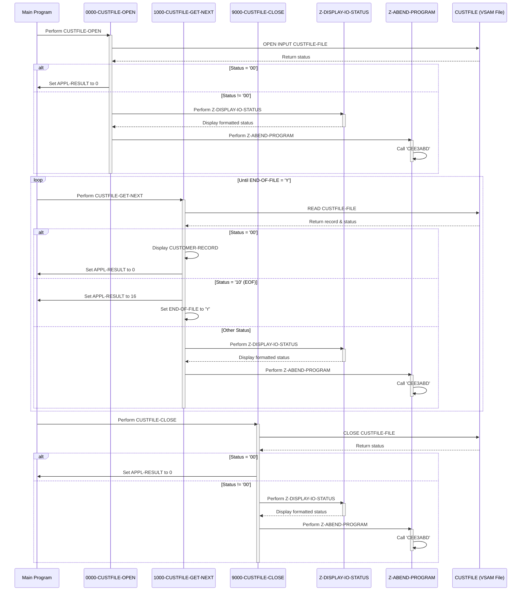

# CBCUS01C

## Overview
This batch COBOL program (CBCUS01C) reads and displays customer data from an indexed VSAM file. It sequentially processes customer records from the CUSTFILE, displaying each record until the end of file is reached. The program includes comprehensive error handling for file operations, with specific routines for opening, reading, and closing the customer file. If any file operation errors occur, the program displays detailed status information and terminates with an abend. The program is part of the CardDemo application, which demonstrates AWS and partner technologies for mainframe migration and modernization use-cases.

## Metadata
**Program ID**: `CBCUS01C`

**Author**: `AWS`

## Sequence Diagram


## Referenced Copybooks
- [`CVCUS01Y`](copybooks/CVCUS01Y.md)

## Environment Division

### INPUT-OUTPUT SECTION
This section defines the file control parameters for the CUSTFILE-FILE, which is the indexed VSAM customer file used by the program. It specifies that the file will be accessed sequentially, uses FD-CUST-ID as the primary key field, and assigns CUSTFILE-STATUS as the file status field for error handling. The file is externally referenced by the CUSTFILE assignment name, allowing the actual file to be defined outside the program.
<details><summary>Code</summary>
```cobol
FILE-CONTROL.
           SELECT CUSTFILE-FILE ASSIGN TO   CUSTFILE
                  ORGANIZATION IS INDEXED
                  ACCESS MODE  IS SEQUENTIAL
                  RECORD KEY   IS FD-CUST-ID
                  FILE STATUS  IS CUSTFILE-STATUS.
      *
```
</details>


## Data Division

### FILE SECTION
This section defines the file structure for the CUSTFILE-FILE, which contains customer records. Each record consists of a 9-digit numeric customer ID field (FD-CUST-ID) followed by a 491-character data field (FD-CUST-DATA) that holds the remaining customer information. This structure allows the program to access the customer ID separately from the rest of the customer data when processing records from the indexed VSAM file.
<details><summary>Code</summary>
```cobol
FD  CUSTFILE-FILE.
       01  FD-CUSTFILE-REC.
           05 FD-CUST-ID                        PIC 9(09).
           05 FD-CUST-DATA                      PIC X(491).
```
</details>


### WORKING-STORAGE SECTION
This Working-Storage Section defines the data structures used for file status tracking and error handling in the CBCUS01C program. It includes the CVCUS01Y copybook and defines several status fields for monitoring VSAM file operations, including CUSTFILE-STATUS and IO-STATUS. The section contains binary fields for conversion purposes, condition codes for application processing results (with level-88 items for success and end-of-file conditions), and control variables for program flow and error handling. The END-OF-FILE flag tracks file processing completion, while ABCODE stores any abend code if errors occur. These structures support the program's comprehensive error handling capabilities when processing the customer file.
<details><summary>Code</summary>
```cobol
*****************************************************************
       COPY CVCUS01Y.
       01  CUSTFILE-STATUS.
           05  CUSTFILE-STAT1      PIC X.
           05  CUSTFILE-STAT2      PIC X.

       01  IO-STATUS.
           05  IO-STAT1            PIC X.
           05  IO-STAT2            PIC X.
       01  TWO-BYTES-BINARY        PIC 9(4) BINARY.
       01  TWO-BYTES-ALPHA         REDEFINES TWO-BYTES-BINARY.
           05  TWO-BYTES-LEFT      PIC X.
           05  TWO-BYTES-RIGHT     PIC X.
       01  IO-STATUS-04.
           05  IO-STATUS-0401      PIC 9   VALUE 0.
           05  IO-STATUS-0403      PIC 999 VALUE 0.

       01  APPL-RESULT             PIC S9(9)   COMP.
           88  APPL-AOK            VALUE 0.
           88  APPL-EOF            VALUE 16.

       01  END-OF-FILE             PIC X(01)    VALUE 'N'.
       01  ABCODE                  PIC S9(9) BINARY.
       01  TIMING                  PIC S9(9) BINARY. 

      *****************************************************************
```
</details>


## Procedure Division

### 1000-CUSTFILE-GET-NEXT
This paragraph handles the sequential reading of customer records from the CUSTFILE. It attempts to read the next record into the CUSTOMER-RECORD structure and processes the result based on the file status. When successful (status '00'), it sets APPL-RESULT to 0 and displays the customer record. If end-of-file is reached (status '10'), it sets APPL-RESULT to 16. For any other status, it sets APPL-RESULT to 12, indicating an error. The paragraph then evaluates APPL-RESULT: if successful, processing continues; if end-of-file is detected, it sets the END-OF-FILE flag to 'Y'; for any other error, it displays an error message, captures the file status, displays the I/O status details, and abends the program.
<details><summary>Code</summary>
```cobol
READ CUSTFILE-FILE INTO CUSTOMER-RECORD.
           IF  CUSTFILE-STATUS = '00'
               MOVE 0 TO APPL-RESULT
               DISPLAY CUSTOMER-RECORD 
           ELSE
               IF  CUSTFILE-STATUS = '10'
                   MOVE 16 TO APPL-RESULT
               ELSE
                   MOVE 12 TO APPL-RESULT
               END-IF
           END-IF
           IF  APPL-AOK
               CONTINUE
           ELSE
               IF  APPL-EOF
                   MOVE 'Y' TO END-OF-FILE
               ELSE
                   DISPLAY 'ERROR READING CUSTOMER FILE'
                   MOVE CUSTFILE-STATUS TO IO-STATUS
                   PERFORM Z-DISPLAY-IO-STATUS
                   PERFORM Z-ABEND-PROGRAM
               END-IF
           END-IF
           EXIT.
      *---------------------------------------------------------------*
```
</details>


### 0000-CUSTFILE-OPEN
This paragraph handles the opening of the CUSTFILE-FILE for input processing. It initializes APPL-RESULT to 8, attempts to open the customer file, and then sets APPL-RESULT to 0 if successful or 12 if unsuccessful. If the operation fails (APPL-AOK is false), it displays an error message, captures the file status code, displays the I/O status details through the Z-DISPLAY-IO-STATUS paragraph, and terminates the program abnormally via the Z-ABEND-PROGRAM paragraph. This robust error handling ensures that file access issues are properly identified and reported before proceeding with customer data processing.
<details><summary>Code</summary>
```cobol
MOVE 8 TO APPL-RESULT.
           OPEN INPUT CUSTFILE-FILE
           IF  CUSTFILE-STATUS = '00'
               MOVE 0 TO APPL-RESULT
           ELSE
               MOVE 12 TO APPL-RESULT
           END-IF
           IF  APPL-AOK
               CONTINUE
           ELSE
               DISPLAY 'ERROR OPENING CUSTFILE'
               MOVE CUSTFILE-STATUS TO IO-STATUS
               PERFORM Z-DISPLAY-IO-STATUS
               PERFORM Z-ABEND-PROGRAM
           END-IF
           EXIT.
      *---------------------------------------------------------------*
```
</details>


### 9000-CUSTFILE-CLOSE
This paragraph handles the closing of the customer file (CUSTFILE-FILE) with comprehensive error handling. It initially sets APPL-RESULT to 8, then attempts to close the file. If the operation is successful (status code '00'), it resets APPL-RESULT to zero; otherwise, it sets APPL-RESULT to 12 indicating an error. When an error occurs, the paragraph displays an error message, captures the file status code, displays the I/O status details through the Z-DISPLAY-IO-STATUS paragraph, and terminates the program abnormally via the Z-ABEND-PROGRAM paragraph. This structured approach ensures proper resource cleanup and clear error reporting when closing the customer file.
<details><summary>Code</summary>
```cobol
ADD 8 TO ZERO GIVING APPL-RESULT.
           CLOSE CUSTFILE-FILE
           IF  CUSTFILE-STATUS = '00'
               SUBTRACT APPL-RESULT FROM APPL-RESULT
           ELSE
               ADD 12 TO ZERO GIVING APPL-RESULT
           END-IF
           IF  APPL-AOK
               CONTINUE
           ELSE
               DISPLAY 'ERROR CLOSING CUSTOMER FILE'
               MOVE CUSTFILE-STATUS TO IO-STATUS
               PERFORM Z-DISPLAY-IO-STATUS
               PERFORM Z-ABEND-PROGRAM
           END-IF
           EXIT.
```
</details>


### Z-ABEND-PROGRAM
This paragraph handles program termination by forcing an abnormal end (abend) when critical errors occur. It displays an "ABENDING PROGRAM" message, resets the timing variable to zero, sets the abend code to 999, and then calls the Language Environment service 'CEE3ABD' to terminate the program. This provides a controlled way to halt execution when unrecoverable errors are encountered.
<details><summary>Code</summary>
```cobol
DISPLAY 'ABENDING PROGRAM'
           MOVE 0 TO TIMING
           MOVE 999 TO ABCODE
           CALL 'CEE3ABD'.

      *****************************************************************
```
</details>


### Z-DISPLAY-IO-STATUS
This paragraph handles the formatting and display of file I/O status codes for error reporting. It checks if the I/O status code is non-numeric or has a first digit of '9' (indicating a serious error). For these cases, it preserves the first digit and converts the second digit to a 4-digit display format. For standard numeric status codes, it formats them as a 4-digit code with leading zeros. The formatted status code is then displayed with a descriptive message. This routine provides consistent error reporting for file operations throughout the program, helping with troubleshooting file access issues.
<details><summary>Code</summary>
```cobol
IF  IO-STATUS NOT NUMERIC
           OR  IO-STAT1 = '9'
               MOVE IO-STAT1 TO IO-STATUS-04(1:1)
               MOVE 0        TO TWO-BYTES-BINARY
               MOVE IO-STAT2 TO TWO-BYTES-RIGHT
               MOVE TWO-BYTES-BINARY TO IO-STATUS-0403
               DISPLAY 'FILE STATUS IS: NNNN' IO-STATUS-04 
           ELSE
               MOVE '0000' TO IO-STATUS-04
               MOVE IO-STATUS TO IO-STATUS-04(3:2)
               DISPLAY 'FILE STATUS IS: NNNN' IO-STATUS-04 
           END-IF
           EXIT.

      *
      * Ver: CardDemo_v1.0-15-g27d6c6f-68 Date: 2022-07-19 23:12:31 CDT
      *
```
</details>
