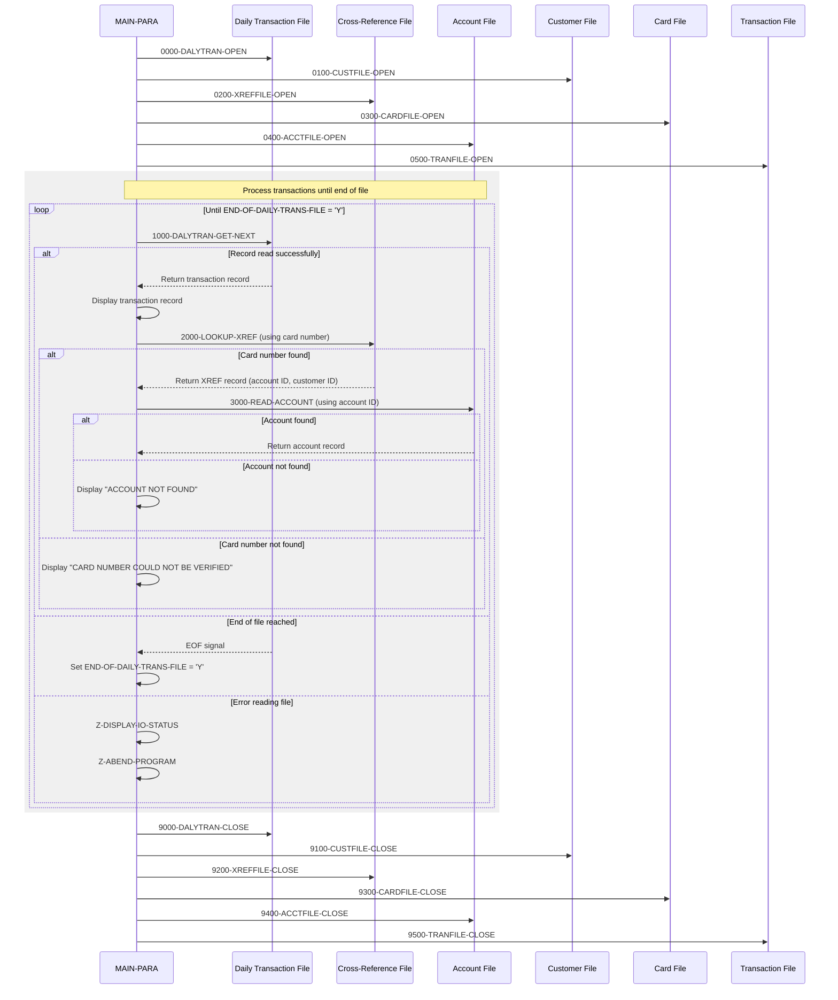

# CBTRN01C

## Overview
This batch COBOL program (CBTRN01C) processes daily credit card transactions by reading records from a daily transaction file and validating them against various reference files. The program verifies card numbers by looking them up in a cross-reference file, which maps card numbers to account IDs and customer IDs. It then attempts to read the corresponding account record to further validate the transaction. The program handles file operations for six different files (daily transaction, customer, cross-reference, card, account, and transaction files), with comprehensive error handling for file operations. Each transaction record is displayed along with validation information, and any validation failures (such as invalid card numbers or missing accounts) are reported. The program is part of the CardDemo application, which showcases AWS and partner technology for mainframe migration and modernization use-cases.

## Metadata
**Program ID**: `CBTRN01C`

**Author**: `AWS`

## Sequence Diagram


## Referenced Copybooks
- [`CVACT01Y`](copybooks/CVACT01Y.md)
- [`CVCUS01Y`](copybooks/CVCUS01Y.md)
- [`CVTRA05Y`](copybooks/CVTRA05Y.md)
- [`CVACT03Y`](copybooks/CVACT03Y.md)
- [`CVACT02Y`](copybooks/CVACT02Y.md)
- [`CVTRA06Y`](copybooks/CVTRA06Y.md)

## Environment Division

### INPUT-OUTPUT SECTION
This INPUT-OUTPUT SECTION defines six files used by the CBTRN01C program for processing credit card transactions. It includes a sequential DALYTRAN-FILE for daily transactions, and five indexed files accessed in random mode: CUSTOMER-FILE (keyed by customer ID), XREF-FILE (keyed by card number), CARD-FILE (keyed by card number), ACCOUNT-FILE (keyed by account ID), and TRANSACT-FILE (keyed by transaction ID). Each file has an associated file status variable for error handling. The configuration supports the program's core functionality of reading transaction records and validating them against various reference files.
<details><summary>Code</summary>
```cobol
FILE-CONTROL.
           SELECT DALYTRAN-FILE ASSIGN TO DALYTRAN
                  ORGANIZATION IS SEQUENTIAL
                  ACCESS MODE  IS SEQUENTIAL
                  FILE STATUS  IS DALYTRAN-STATUS.

           SELECT CUSTOMER-FILE ASSIGN TO   CUSTFILE
                  ORGANIZATION IS INDEXED
                  ACCESS MODE  IS RANDOM
                  RECORD KEY   IS FD-CUST-ID
                  FILE STATUS  IS CUSTFILE-STATUS.

           SELECT XREF-FILE ASSIGN TO   XREFFILE
                  ORGANIZATION IS INDEXED
                  ACCESS MODE  IS RANDOM
                  RECORD KEY   IS FD-XREF-CARD-NUM
                  FILE STATUS  IS XREFFILE-STATUS.

           SELECT CARD-FILE ASSIGN TO   CARDFILE
                  ORGANIZATION IS INDEXED
                  ACCESS MODE  IS RANDOM
                  RECORD KEY   IS FD-CARD-NUM
                  FILE STATUS  IS CARDFILE-STATUS.

           SELECT ACCOUNT-FILE ASSIGN TO   ACCTFILE
                  ORGANIZATION IS INDEXED
                  ACCESS MODE  IS RANDOM
                  RECORD KEY   IS FD-ACCT-ID
                  FILE STATUS  IS ACCTFILE-STATUS.

           SELECT TRANSACT-FILE ASSIGN TO   TRANFILE
                  ORGANIZATION IS INDEXED
                  ACCESS MODE  IS RANDOM
                  RECORD KEY   IS FD-TRANS-ID
                  FILE STATUS  IS TRANFILE-STATUS.
      *
```
</details>


## Data Division

### FILE SECTION
This File Section defines the file structures used in the CBTRN01C program for processing credit card transactions. It includes six file descriptors (FD) for the various files the program interacts with: DALYTRAN-FILE (daily transaction file), CUSTOMER-FILE (customer records), XREF-FILE (card number cross-reference), CARD-FILE (card details), ACCOUNT-FILE (account information), and TRANSACT-FILE (transaction records). Each file has a defined record structure with key identifier fields (such as card numbers, customer IDs, account IDs, or transaction IDs) followed by data fields that contain the remaining record information. The structure allows the program to read transaction records, validate them against reference data, and process them accordingly.
<details><summary>Code</summary>
```cobol
FD  DALYTRAN-FILE.
       01  FD-TRAN-RECORD.
           05 FD-TRAN-ID                        PIC X(16).
           05 FD-CUST-DATA                      PIC X(334).

       FD  CUSTOMER-FILE.
       01  FD-CUSTFILE-REC.
           05 FD-CUST-ID                        PIC 9(09).
           05 FD-CUST-DATA                      PIC X(491).

       FD  XREF-FILE.
       01  FD-XREFFILE-REC.
           05 FD-XREF-CARD-NUM                  PIC X(16).
           05 FD-XREF-DATA                      PIC X(34).

       FD  CARD-FILE.
       01  FD-CARDFILE-REC.
           05 FD-CARD-NUM                       PIC X(16).
           05 FD-CARD-DATA                      PIC X(134).

       FD  ACCOUNT-FILE.
       01  FD-ACCTFILE-REC.
           05 FD-ACCT-ID                        PIC 9(11).
           05 FD-ACCT-DATA                      PIC X(289).

       FD  TRANSACT-FILE.
       01  FD-TRANFILE-REC.
           05 FD-TRANS-ID                       PIC X(16).
           05 FD-ACCT-DATA                      PIC X(334).
```
</details>


### WORKING-STORAGE SECTION
This Working Storage Section defines the data structures used by the CBTRN01C program for processing credit card transactions. It includes status fields for six different files: daily transaction (DALYTRAN), customer (CUSTFILE), cross-reference (XREFFILE), card (CARDFILE), account (ACCTFILE), and transaction (TRANFILE) files. Each file has a status field divided into two parts (STAT1 and STAT2) for detailed error reporting. The section also includes several utility fields for I/O operations, binary data handling, and application control. Key control variables include APPL-RESULT with condition names for normal processing (APPL-AOK) and end-of-file conditions (APPL-EOF), as well as END-OF-DAILY-TRANS-FILE to track file processing status. The section incorporates six copybooks (CVTRA06Y, CVCUS01Y, CVACT03Y, CVACT02Y, CVACT01Y, and CVTRA05Y) which likely contain the record layouts for the various files being processed.
<details><summary>Code</summary>
```cobol
*****************************************************************
       COPY CVTRA06Y.
       01  DALYTRAN-STATUS.
           05  DALYTRAN-STAT1      PIC X.
           05  DALYTRAN-STAT2      PIC X.

       COPY CVCUS01Y.
       01  CUSTFILE-STATUS.
           05  CUSTFILE-STAT1      PIC X.
           05  CUSTFILE-STAT2      PIC X.

       COPY CVACT03Y.
       01  XREFFILE-STATUS.
           05  XREFFILE-STAT1      PIC X.
           05  XREFFILE-STAT2      PIC X.

       COPY CVACT02Y.
       01  CARDFILE-STATUS.
           05  CARDFILE-STAT1      PIC X.
           05  CARDFILE-STAT2      PIC X.

       COPY CVACT01Y.
       01  ACCTFILE-STATUS.
           05  ACCTFILE-STAT1      PIC X.
           05  ACCTFILE-STAT2      PIC X.

       COPY CVTRA05Y.
       01  TRANFILE-STATUS.
           05  TRANFILE-STAT1      PIC X.
           05  TRANFILE-STAT2      PIC X.

       01  IO-STATUS.
           05  IO-STAT1            PIC X.
           05  IO-STAT2            PIC X.

       01  TWO-BYTES-BINARY        PIC 9(4) BINARY.
       01  TWO-BYTES-ALPHA         REDEFINES TWO-BYTES-BINARY.
           05  TWO-BYTES-LEFT      PIC X.
           05  TWO-BYTES-RIGHT     PIC X.

       01  IO-STATUS-04.
           05  IO-STATUS-0401      PIC 9   VALUE 0.
           05  IO-STATUS-0403      PIC 999 VALUE 0.

       01  APPL-RESULT             PIC S9(9)   COMP.
           88  APPL-AOK            VALUE 0.
           88  APPL-EOF            VALUE 16.

       01  END-OF-DAILY-TRANS-FILE             PIC X(01)    VALUE 'N'.
       01  ABCODE                  PIC S9(9) BINARY.
       01  TIMING                  PIC S9(9) BINARY.
       01  WS-MISC-VARIABLES.
           05 WS-XREF-READ-STATUS  PIC 9(04).
           05 WS-ACCT-READ-STATUS  PIC 9(04).

      *****************************************************************
```
</details>


## Procedure Division

### MAIN-PARA
This paragraph serves as the main control flow for the CBTRN01C program. It begins by opening all required files (daily transaction, customer, cross-reference, card, account, and transaction files) through separate procedures. The core processing occurs in a loop that continues until the end of the daily transaction file is reached. For each transaction record, the program displays the record, looks up the card number in the cross-reference file, and if found, attempts to read the corresponding account record. Error messages are displayed when a card number cannot be verified or when an account is not found. After processing all transactions, the program methodically closes all files in reverse order of opening and terminates execution. The paragraph effectively orchestrates the transaction validation workflow by coordinating the various file operations and lookup procedures.
<details><summary>Code</summary>
```cobol
DISPLAY 'START OF EXECUTION OF PROGRAM CBTRN01C'.
           PERFORM 0000-DALYTRAN-OPEN.
           PERFORM 0100-CUSTFILE-OPEN.
           PERFORM 0200-XREFFILE-OPEN.
           PERFORM 0300-CARDFILE-OPEN.
           PERFORM 0400-ACCTFILE-OPEN.
           PERFORM 0500-TRANFILE-OPEN.

           PERFORM UNTIL END-OF-DAILY-TRANS-FILE = 'Y'
               IF  END-OF-DAILY-TRANS-FILE = 'N'
                   PERFORM 1000-DALYTRAN-GET-NEXT
                   IF  END-OF-DAILY-TRANS-FILE = 'N'
                       DISPLAY DALYTRAN-RECORD
                   END-IF
                   MOVE 0                 TO WS-XREF-READ-STATUS
                   MOVE DALYTRAN-CARD-NUM TO XREF-CARD-NUM
                   PERFORM 2000-LOOKUP-XREF
                   IF WS-XREF-READ-STATUS = 0
                     MOVE 0            TO WS-ACCT-READ-STATUS
                     MOVE XREF-ACCT-ID TO ACCT-ID
                     PERFORM 3000-READ-ACCOUNT
                     IF WS-ACCT-READ-STATUS NOT = 0
                         DISPLAY 'ACCOUNT ' ACCT-ID ' NOT FOUND'
                     END-IF
                   ELSE
                     DISPLAY 'CARD NUMBER ' DALYTRAN-CARD-NUM
                     ' COULD NOT BE VERIFIED. SKIPPING TRANSACTION ID-'
                     DALYTRAN-ID
                   END-IF
               END-IF
           END-PERFORM.

           PERFORM 9000-DALYTRAN-CLOSE.
           PERFORM 9100-CUSTFILE-CLOSE.
           PERFORM 9200-XREFFILE-CLOSE.
           PERFORM 9300-CARDFILE-CLOSE.
           PERFORM 9400-ACCTFILE-CLOSE.
           PERFORM 9500-TRANFILE-CLOSE.

           DISPLAY 'END OF EXECUTION OF PROGRAM CBTRN01C'.

           GOBACK.

      *****************************************************************
      * READS FILE                                                    *
      *****************************************************************
```
</details>


### 1000-DALYTRAN-GET-NEXT
This paragraph handles the reading of records from the daily transaction file. It reads the next record into the DALYTRAN-RECORD structure and processes the file status. If the read is successful (status '00'), it sets APPL-RESULT to 0 indicating success. If end-of-file is reached (status '10'), it sets APPL-RESULT to 16. For any other status, it sets APPL-RESULT to 12 indicating an error. When successful, processing continues. When end-of-file is encountered, it sets the END-OF-DAILY-TRANS-FILE flag to 'Y'. For any other error, it displays an error message, captures the file status, displays the status details, and abends the program.
<details><summary>Code</summary>
```cobol
READ DALYTRAN-FILE INTO DALYTRAN-RECORD.
           IF  DALYTRAN-STATUS = '00'
               MOVE 0 TO APPL-RESULT
           ELSE
               IF  DALYTRAN-STATUS = '10'
                   MOVE 16 TO APPL-RESULT
               ELSE
                   MOVE 12 TO APPL-RESULT
               END-IF
           END-IF
           IF  APPL-AOK
               CONTINUE
           ELSE
               IF  APPL-EOF
                   MOVE 'Y' TO END-OF-DAILY-TRANS-FILE
               ELSE
                   DISPLAY 'ERROR READING DAILY TRANSACTION FILE'
                   MOVE DALYTRAN-STATUS TO IO-STATUS
                   PERFORM Z-DISPLAY-IO-STATUS
                   PERFORM Z-ABEND-PROGRAM
               END-IF
           END-IF
           EXIT.
      *---------------------------------------------------------------*
```
</details>


### 2000-LOOKUP-XREF
This paragraph performs a lookup operation in the cross-reference file (XREF-FILE) using the card number as the key. It first moves the card number from XREF-CARD-NUM to the file descriptor field FD-XREF-CARD-NUM, then attempts to read the corresponding record into CARD-XREF-RECORD. If the card number is not found (INVALID KEY condition), it displays an error message and sets the status code to 4. If the card number is valid, it displays a success message along with the retrieved card number, account ID, and customer ID from the cross-reference record. This lookup is a critical validation step that determines whether a transaction has a valid card number and retrieves the associated account and customer information needed for further processing.
<details><summary>Code</summary>
```cobol
MOVE XREF-CARD-NUM TO FD-XREF-CARD-NUM
           READ XREF-FILE  RECORD INTO CARD-XREF-RECORD
           KEY IS FD-XREF-CARD-NUM
                INVALID KEY
                  DISPLAY 'INVALID CARD NUMBER FOR XREF'
                  MOVE 4 TO WS-XREF-READ-STATUS
                NOT INVALID KEY
                  DISPLAY 'SUCCESSFUL READ OF XREF'
                  DISPLAY 'CARD NUMBER: ' XREF-CARD-NUM
                  DISPLAY 'ACCOUNT ID : ' XREF-ACCT-ID
                  DISPLAY 'CUSTOMER ID: ' XREF-CUST-ID
           END-READ.
      *---------------------------------------------------------------*
```
</details>


### 3000-READ-ACCOUNT
This paragraph reads an account record from the ACCOUNT-FILE using the ACCT-ID as the key. It attempts to retrieve the account information into the ACCOUNT-RECORD structure. If the account number is not found (INVALID KEY condition), it displays an error message and sets WS-ACCT-READ-STATUS to 4 to indicate a failed lookup. If the account is successfully found, it displays a confirmation message. This validation step is part of the transaction processing workflow to ensure that transactions are associated with valid accounts.
<details><summary>Code</summary>
```cobol
MOVE ACCT-ID TO FD-ACCT-ID
           READ ACCOUNT-FILE RECORD INTO ACCOUNT-RECORD
           KEY IS FD-ACCT-ID
                INVALID KEY
                  DISPLAY 'INVALID ACCOUNT NUMBER FOUND'
                  MOVE 4 TO WS-ACCT-READ-STATUS
                NOT INVALID KEY
                  DISPLAY 'SUCCESSFUL READ OF ACCOUNT FILE'
           END-READ.
      *---------------------------------------------------------------*
```
</details>


### 0000-DALYTRAN-OPEN
This paragraph handles the opening of the DALYTRAN-FILE (Daily Transaction File) with error handling. It initializes APPL-RESULT to 8, attempts to open the file in INPUT mode, and sets APPL-RESULT to 0 if successful or 12 if unsuccessful. If the operation fails (APPL-AOK is false), it displays an error message, retrieves the file status code, calls procedures to display the I/O status and abnormally terminate the program. This ensures the program doesn't proceed with processing if the critical transaction input file cannot be accessed.
<details><summary>Code</summary>
```cobol
MOVE 8 TO APPL-RESULT.
           OPEN INPUT DALYTRAN-FILE
           IF  DALYTRAN-STATUS = '00'
               MOVE 0 TO APPL-RESULT
           ELSE
               MOVE 12 TO APPL-RESULT
           END-IF
           IF  APPL-AOK
               CONTINUE
           ELSE
               DISPLAY 'ERROR OPENING DAILY TRANSACTION FILE'
               MOVE DALYTRAN-STATUS TO IO-STATUS
               PERFORM Z-DISPLAY-IO-STATUS
               PERFORM Z-ABEND-PROGRAM
           END-IF
           EXIT.

      *---------------------------------------------------------------*
```
</details>


### 0100-CUSTFILE-OPEN
This paragraph handles the opening of the CUSTOMER-FILE for input processing. It initializes the APPL-RESULT to 8, attempts to open the file, and then checks the operation's success by examining the CUSTFILE-STATUS. If the file opens successfully (status '00'), it sets APPL-RESULT to 0 indicating success. Otherwise, it sets APPL-RESULT to 12 indicating failure. When a failure occurs, the paragraph displays an error message, captures the file status code, calls Z-DISPLAY-IO-STATUS to show detailed error information, and then calls Z-ABEND-PROGRAM to terminate execution. This represents standard file handling with proper error detection and reporting for a critical reference file in the transaction processing workflow.
<details><summary>Code</summary>
```cobol
MOVE 8 TO APPL-RESULT.
           OPEN INPUT CUSTOMER-FILE
           IF  CUSTFILE-STATUS = '00'
               MOVE 0 TO APPL-RESULT
           ELSE
               MOVE 12 TO APPL-RESULT
           END-IF
           IF  APPL-AOK
               CONTINUE
           ELSE
               DISPLAY 'ERROR OPENING CUSTOMER FILE'
               MOVE CUSTFILE-STATUS TO IO-STATUS
               PERFORM Z-DISPLAY-IO-STATUS
               PERFORM Z-ABEND-PROGRAM
           END-IF
           EXIT.
      *---------------------------------------------------------------*
```
</details>


### 0200-XREFFILE-OPEN
This paragraph handles the opening of the cross-reference file (XREF-FILE) that maps card numbers to account and customer IDs. It initializes the application result code to 8, attempts to open the file in input mode, and sets the result code to 0 if successful or 12 if unsuccessful. If the file opens successfully (APPL-AOK condition), processing continues. Otherwise, it displays an error message, calls a routine to display the I/O status code, and then abends the program. This is part of the program's initialization process that ensures all required files are available before transaction processing begins.
<details><summary>Code</summary>
```cobol
MOVE 8 TO APPL-RESULT.
           OPEN INPUT XREF-FILE
           IF  XREFFILE-STATUS = '00'
               MOVE 0 TO APPL-RESULT
           ELSE
               MOVE 12 TO APPL-RESULT
           END-IF
           IF  APPL-AOK
               CONTINUE
           ELSE
               DISPLAY 'ERROR OPENING CROSS REF FILE'
               MOVE XREFFILE-STATUS TO IO-STATUS
               PERFORM Z-DISPLAY-IO-STATUS
               PERFORM Z-ABEND-PROGRAM
           END-IF
           EXIT.
      *---------------------------------------------------------------*
```
</details>


### 0300-CARDFILE-OPEN
This paragraph handles the opening of the CARD-FILE for input processing. It initializes APPL-RESULT to 8, attempts to open the file, and then checks the operation's success by examining CARDFILE-STATUS. If the file opens successfully (status '00'), APPL-RESULT is set to 0; otherwise, it's set to 12. When an error occurs, the paragraph displays an error message, captures the file status code, calls Z-DISPLAY-IO-STATUS to show detailed error information, and then calls Z-ABEND-PROGRAM to terminate execution. This represents standard file handling with comprehensive error management for a critical reference file in the transaction processing workflow.
<details><summary>Code</summary>
```cobol
MOVE 8 TO APPL-RESULT.
           OPEN INPUT CARD-FILE
           IF  CARDFILE-STATUS = '00'
               MOVE 0 TO APPL-RESULT
           ELSE
               MOVE 12 TO APPL-RESULT
           END-IF
           IF  APPL-AOK
               CONTINUE
           ELSE
               DISPLAY 'ERROR OPENING CARD FILE'
               MOVE CARDFILE-STATUS TO IO-STATUS
               PERFORM Z-DISPLAY-IO-STATUS
               PERFORM Z-ABEND-PROGRAM
           END-IF
           EXIT.
      *---------------------------------------------------------------*
```
</details>


### 0400-ACCTFILE-OPEN
This paragraph handles the opening of the Account File for input processing. It sets an initial result code of 8, then attempts to open the file. If the operation is successful (status '00'), it resets the result code to 0; otherwise, it sets a more severe error code of 12. When an error occurs, the paragraph displays an error message, retrieves the file status code, calls a routine to display the I/O status details, and then terminates the program abnormally. This robust error handling ensures that account data is available before proceeding with transaction processing.
<details><summary>Code</summary>
```cobol
MOVE 8 TO APPL-RESULT.
           OPEN INPUT ACCOUNT-FILE
           IF  ACCTFILE-STATUS = '00'
               MOVE 0 TO APPL-RESULT
           ELSE
               MOVE 12 TO APPL-RESULT
           END-IF
           IF  APPL-AOK
               CONTINUE
           ELSE
               DISPLAY 'ERROR OPENING ACCOUNT FILE'
               MOVE ACCTFILE-STATUS TO IO-STATUS
               PERFORM Z-DISPLAY-IO-STATUS
               PERFORM Z-ABEND-PROGRAM
           END-IF
           EXIT.
      *---------------------------------------------------------------*
```
</details>


### 0500-TRANFILE-OPEN
This paragraph handles the opening of the transaction input file (TRANSACT-FILE) with error handling. It sets an initial result code of 8, attempts to open the file, and then checks the status. If the file opens successfully (status '00'), it sets the result to 0 (success). If the open operation fails, it sets the result to 12 (error). When an error occurs, the paragraph displays an error message, retrieves the file status code, calls a routine to display the I/O status details, and then terminates the program abnormally by calling the Z-ABEND-PROGRAM paragraph. This robust error handling ensures that file access issues are properly detected and reported before transaction processing begins.
<details><summary>Code</summary>
```cobol
MOVE 8 TO APPL-RESULT.
           OPEN INPUT TRANSACT-FILE
           IF  TRANFILE-STATUS = '00'
               MOVE 0 TO APPL-RESULT
           ELSE
               MOVE 12 TO APPL-RESULT
           END-IF
           IF  APPL-AOK
               CONTINUE
           ELSE
               DISPLAY 'ERROR OPENING TRANSACTION FILE'
               MOVE TRANFILE-STATUS TO IO-STATUS
               PERFORM Z-DISPLAY-IO-STATUS
               PERFORM Z-ABEND-PROGRAM
           END-IF
           EXIT.
      *---------------------------------------------------------------*
```
</details>


### 9000-DALYTRAN-CLOSE
This paragraph handles the closing of the daily transaction file (DALYTRAN-FILE) with error handling. It initializes APPL-RESULT to 8, attempts to close the file, and then checks the status code. If the close operation is successful (status '00'), it sets APPL-RESULT to 0; otherwise, it sets it to 12. If the operation was not successful (APPL-AOK is false), it displays an error message, retrieves the file status code, calls routines to display the I/O status and abnormally terminate the program. The paragraph contains an inconsistency where it references CUSTOMER FILE in the error message despite closing the DALYTRAN-FILE, and similarly references CUSTFILE-STATUS instead of DALYTRAN-STATUS.
<details><summary>Code</summary>
```cobol
ADD 8 TO ZERO GIVING APPL-RESULT.
           CLOSE DALYTRAN-FILE
           IF  DALYTRAN-STATUS = '00'
               MOVE 0 TO APPL-RESULT
           ELSE
               MOVE 12 TO APPL-RESULT
           END-IF
           IF  APPL-AOK
               CONTINUE
           ELSE
               DISPLAY 'ERROR CLOSING CUSTOMER FILE'
               MOVE CUSTFILE-STATUS TO IO-STATUS
               PERFORM Z-DISPLAY-IO-STATUS
               PERFORM Z-ABEND-PROGRAM
           END-IF
           EXIT.
      *---------------------------------------------------------------*
```
</details>


### 9100-CUSTFILE-CLOSE
This paragraph handles the closing of the CUSTOMER-FILE with error handling. It initially sets APPL-RESULT to 8, then attempts to close the file. If the operation is successful (status code '00'), it resets APPL-RESULT to 0; otherwise, it sets it to 12. When an error occurs, the paragraph displays an error message, captures the file status code, calls Z-DISPLAY-IO-STATUS to show detailed error information, and then terminates the program abnormally via Z-ABEND-PROGRAM. This ensures proper resource cleanup and error reporting when closing the customer reference file.
<details><summary>Code</summary>
```cobol
ADD 8 TO ZERO GIVING APPL-RESULT.
           CLOSE CUSTOMER-FILE
           IF  CUSTFILE-STATUS = '00'
               MOVE 0 TO APPL-RESULT
           ELSE
               MOVE 12 TO APPL-RESULT
           END-IF
           IF  APPL-AOK
               CONTINUE
           ELSE
               DISPLAY 'ERROR CLOSING CUSTOMER FILE'
               MOVE CUSTFILE-STATUS TO IO-STATUS
               PERFORM Z-DISPLAY-IO-STATUS
               PERFORM Z-ABEND-PROGRAM
           END-IF
           EXIT.
      *---------------------------------------------------------------*
```
</details>


### 9200-XREFFILE-CLOSE
This paragraph handles the closing of the cross-reference file (XREF-FILE) with error handling. It initially sets APPL-RESULT to 8, then attempts to close the file. If the close operation is successful (status code '00'), it resets APPL-RESULT to 0; otherwise, it sets APPL-RESULT to 12 indicating an error. When an error occurs, the paragraph displays an error message, captures the file status code, calls routines to display the I/O status and abnormally terminate the program. This ensures proper resource cleanup and provides meaningful error information if the cross-reference file cannot be closed properly.
<details><summary>Code</summary>
```cobol
ADD 8 TO ZERO GIVING APPL-RESULT.
           CLOSE XREF-FILE
           IF  XREFFILE-STATUS = '00'
               MOVE 0 TO APPL-RESULT
           ELSE
               MOVE 12 TO APPL-RESULT
           END-IF
           IF  APPL-AOK
               CONTINUE
           ELSE
               DISPLAY 'ERROR CLOSING CROSS REF FILE'
               MOVE XREFFILE-STATUS TO IO-STATUS
               PERFORM Z-DISPLAY-IO-STATUS
               PERFORM Z-ABEND-PROGRAM
           END-IF
           EXIT.
      *---------------------------------------------------------------*
```
</details>


### 9300-CARDFILE-CLOSE
This paragraph handles the closing of the CARD-FILE with comprehensive error handling. It initially sets APPL-RESULT to 8, then attempts to close the file. If the operation is successful (status code '00'), it resets APPL-RESULT to 0; otherwise, it sets it to 12 indicating an error. When an error occurs, the paragraph displays an error message, captures the file status code, calls Z-DISPLAY-IO-STATUS to show detailed error information, and then terminates the program abnormally via Z-ABEND-PROGRAM. This ensures that any issues with closing the card reference file are properly detected and handled, maintaining data integrity.
<details><summary>Code</summary>
```cobol
ADD 8 TO ZERO GIVING APPL-RESULT.
           CLOSE CARD-FILE
           IF  CARDFILE-STATUS = '00'
               MOVE 0 TO APPL-RESULT
           ELSE
               MOVE 12 TO APPL-RESULT
           END-IF
           IF  APPL-AOK
               CONTINUE
           ELSE
               DISPLAY 'ERROR CLOSING CARD FILE'
               MOVE CARDFILE-STATUS TO IO-STATUS
               PERFORM Z-DISPLAY-IO-STATUS
               PERFORM Z-ABEND-PROGRAM
           END-IF
           EXIT.
      *---------------------------------------------------------------*
```
</details>


### 9400-ACCTFILE-CLOSE
This paragraph handles the closing of the ACCOUNT-FILE with comprehensive error handling. It initially sets APPL-RESULT to 8, then attempts to close the account file. If the operation is successful (status code '00'), it resets APPL-RESULT to 0; otherwise, it sets APPL-RESULT to 12 indicating an error. When an error occurs, the paragraph displays an error message, captures the file status code, calls a routine to display the I/O status details, and then terminates the program abnormally through the Z-ABEND-PROGRAM paragraph. This ensures that any file closure issues are properly detected and handled, preventing the program from continuing with potentially corrupted file states.
<details><summary>Code</summary>
```cobol
ADD 8 TO ZERO GIVING APPL-RESULT.
           CLOSE ACCOUNT-FILE
           IF  ACCTFILE-STATUS = '00'
               MOVE 0 TO APPL-RESULT
           ELSE
               MOVE 12 TO APPL-RESULT
           END-IF
           IF  APPL-AOK
               CONTINUE
           ELSE
               DISPLAY 'ERROR CLOSING ACCOUNT FILE'
               MOVE ACCTFILE-STATUS TO IO-STATUS
               PERFORM Z-DISPLAY-IO-STATUS
               PERFORM Z-ABEND-PROGRAM
           END-IF
           EXIT.
      *---------------------------------------------------------------*
```
</details>


### 9500-TRANFILE-CLOSE
This paragraph handles the closing of the transaction file with error handling. It first sets APPL-RESULT to 8, then attempts to close the TRANSACT-FILE. If the operation is successful (status code '00'), it resets APPL-RESULT to 0; otherwise, it sets it to 12 indicating an error. When an error occurs, the paragraph displays an error message, captures the file status code, calls routines to display the I/O status details and abnormally terminate the program. The paragraph is part of the program's comprehensive file operation error handling mechanism.
<details><summary>Code</summary>
```cobol
ADD 8 TO ZERO GIVING APPL-RESULT.
           CLOSE TRANSACT-FILE
           IF  TRANFILE-STATUS = '00'
               MOVE 0 TO APPL-RESULT
           ELSE
               MOVE 12 TO APPL-RESULT
           END-IF
           IF  APPL-AOK
               CONTINUE
           ELSE
               DISPLAY 'ERROR CLOSING TRANSACTION FILE'
               MOVE TRANFILE-STATUS TO IO-STATUS
               PERFORM Z-DISPLAY-IO-STATUS
               PERFORM Z-ABEND-PROGRAM
           END-IF
           EXIT.
```
</details>


### Z-ABEND-PROGRAM
This paragraph handles abnormal program termination by displaying an "ABENDING PROGRAM" message, resetting the TIMING variable to zero, setting an abort code (ABCODE) to 999, and then calling the Language Environment service 'CEE3ABD' to force an immediate program termination. This is used as a last resort error handling mechanism when the program encounters a critical error that prevents further processing.
<details><summary>Code</summary>
```cobol
DISPLAY 'ABENDING PROGRAM'
           MOVE 0 TO TIMING
           MOVE 999 TO ABCODE
           CALL 'CEE3ABD'.

      *****************************************************************
```
</details>


### Z-DISPLAY-IO-STATUS
This paragraph handles the display of file I/O status codes in a standardized format. It processes the IO-STATUS field differently based on whether it contains a numeric value or if the first byte indicates a severe error (IO-STAT1 = '9'). For non-numeric status codes or severe errors, it formats the first byte directly and converts the second byte through binary manipulation to create a four-character display format. For standard numeric status codes, it creates a four-character display with leading zeros. The formatted status code is then displayed with a descriptive message. This provides consistent error reporting for file operations throughout the program, helping with debugging and error identification.
<details><summary>Code</summary>
```cobol
IF  IO-STATUS NOT NUMERIC
           OR  IO-STAT1 = '9'
               MOVE IO-STAT1 TO IO-STATUS-04(1:1)
               MOVE 0        TO TWO-BYTES-BINARY
               MOVE IO-STAT2 TO TWO-BYTES-RIGHT
               MOVE TWO-BYTES-BINARY TO IO-STATUS-0403
               DISPLAY 'FILE STATUS IS: NNNN' IO-STATUS-04
           ELSE
               MOVE '0000' TO IO-STATUS-04
               MOVE IO-STATUS TO IO-STATUS-04(3:2)
               DISPLAY 'FILE STATUS IS: NNNN' IO-STATUS-04
           END-IF
           EXIT.
```
</details>
