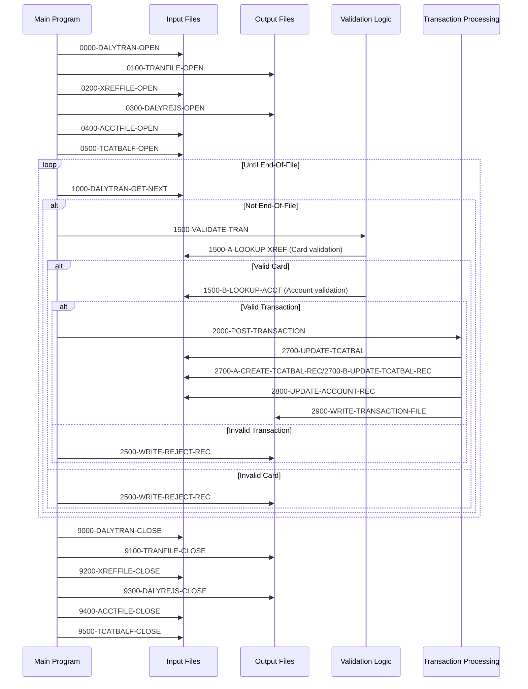

# CBTRN02C

## Overview
This batch COBOL program (CBTRN02C) processes daily credit card transactions from a sequential input file and posts them to various account and transaction files. The program reads each transaction record, validates it against account and card reference data, and then updates account balances and transaction category balances accordingly.

The program performs several key functions:
1. Validates transactions by checking card numbers against a cross-reference file
2. Verifies account existence, credit limits, and expiration dates
3. Updates account balances (current balance, cycle credits/debits)
4. Updates transaction category balances by account
5. Writes valid transactions to a transaction file
6. Writes rejected transactions to a rejection file with reason codes

The validation process includes checks for invalid card numbers, non-existent accounts, over-limit transactions, and expired accounts. For valid transactions, the program updates multiple files to reflect the transaction, including the account master file and a transaction category balance file.

The program maintains counters for processed and rejected transactions, and sets a non-zero return code if any transactions are rejected. It includes comprehensive error handling for file operations and displays detailed status information when errors occur.

## Metadata
**Program ID**: `CBTRN02C`

**Author**: `AWS`

## Sequence Diagram


## Referenced Copybooks
- [`CVACT01Y`](copybooks/CVACT01Y.md)
- [`CVTRA05Y`](copybooks/CVTRA05Y.md)
- [`CVTRA01Y`](copybooks/CVTRA01Y.md)
- [`CVACT03Y`](copybooks/CVACT03Y.md)
- [`CVTRA06Y`](copybooks/CVTRA06Y.md)

## Environment Division

### INPUT-OUTPUT SECTION
This section defines the file assignments and access methods for the transaction processing program. It specifies six files:

1. DALYTRAN-FILE: A sequential input file containing the daily credit card transactions to be processed.

2. TRANSACT-FILE: An indexed file accessed randomly by transaction ID (FD-TRANS-ID) where valid transactions are written.

3. XREF-FILE: An indexed file accessed randomly by card number (FD-XREF-CARD-NUM) used to validate credit card numbers.

4. DALYREJS-FILE: A sequential output file where rejected transactions are written.

5. ACCOUNT-FILE: An indexed file accessed randomly by account ID (FD-ACCT-ID) containing account master information.

6. TCATBAL-FILE: An indexed file accessed randomly by transaction category key (FD-TRAN-CAT-KEY) used to track transaction balances by category.

Each file definition includes its organization type, access method, key field (for indexed files), and a status field for error handling.
<details><summary>Code</summary>
```cobol
FILE-CONTROL.                                                            
           SELECT DALYTRAN-FILE ASSIGN TO DALYTRAN                              
                  ORGANIZATION IS SEQUENTIAL                                    
                  ACCESS MODE  IS SEQUENTIAL                                    
                  FILE STATUS  IS DALYTRAN-STATUS.                              
                                                                                
           SELECT TRANSACT-FILE ASSIGN TO TRANFILE                              
                  ORGANIZATION IS INDEXED                                       
                  ACCESS MODE  IS RANDOM                                        
                  RECORD KEY   IS FD-TRANS-ID                                   
                  FILE STATUS  IS TRANFILE-STATUS.                              
                                                                                
           SELECT XREF-FILE ASSIGN TO   XREFFILE                                
                  ORGANIZATION IS INDEXED                                       
                  ACCESS MODE  IS RANDOM                                        
                  RECORD KEY   IS FD-XREF-CARD-NUM                              
                  FILE STATUS  IS XREFFILE-STATUS.                              
                                                                                
           SELECT DALYREJS-FILE ASSIGN TO DALYREJS                              
                  ORGANIZATION IS SEQUENTIAL                                    
                  ACCESS MODE  IS SEQUENTIAL                                    
                  FILE STATUS  IS DALYREJS-STATUS.                              
                                                                                
           SELECT ACCOUNT-FILE ASSIGN TO ACCTFILE                               
                  ORGANIZATION IS INDEXED                                       
                  ACCESS MODE  IS RANDOM                                        
                  RECORD KEY   IS FD-ACCT-ID                                    
                  FILE STATUS  IS ACCTFILE-STATUS.                              
                                                                                
           SELECT TCATBAL-FILE ASSIGN TO TCATBALF                               
                  ORGANIZATION IS INDEXED                                       
                  ACCESS MODE  IS RANDOM                                        
                  RECORD KEY   IS FD-TRAN-CAT-KEY                               
                  FILE STATUS  IS TCATBALF-STATUS.                              
                                                                                
      *
```
</details>


## Data Division

### FILE SECTION
This File Section defines the structure of six key files used in the transaction processing program. It includes:

1. DALYTRAN-FILE: The input file containing daily credit card transactions with a 16-character transaction ID followed by customer data.

2. TRANSACT-FILE: The output file for valid processed transactions, maintaining a similar structure to the input file.

3. XREF-FILE: A cross-reference file used to validate card numbers against accounts, containing the card number and associated reference data.

4. DALYREJS-FILE: The output file for rejected transactions, which includes both the original transaction record and an 80-character validation message explaining the rejection reason.

5. ACCOUNT-FILE: The master account file containing account information with an 11-digit numeric account ID as the key field.

6. TCATBAL-FILE: A transaction category balance file that tracks balances by account ID, transaction type, and category code, used for categorizing and summarizing transaction activity.

These file definitions support the program's core functions of transaction validation, account updates, and transaction categorization.
<details><summary>Code</summary>
```cobol
FD  DALYTRAN-FILE.                                                       
       01  FD-TRAN-RECORD.                                                      
           05 FD-TRAN-ID                        PIC X(16).                      
           05 FD-CUST-DATA                      PIC X(334).                     
                                                                                
       FD  TRANSACT-FILE.                                                       
       01  FD-TRANFILE-REC.                                                     
           05 FD-TRANS-ID                       PIC X(16).                      
           05 FD-ACCT-DATA                      PIC X(334).                     
                                                                                
       FD  XREF-FILE.                                                           
       01  FD-XREFFILE-REC.                                                     
           05 FD-XREF-CARD-NUM                  PIC X(16).                      
           05 FD-XREF-DATA                      PIC X(34).                      
                                                                                
       FD  DALYREJS-FILE.                                                       
       01  FD-REJS-RECORD.                                                      
           05 FD-REJECT-RECORD                  PIC X(350).                     
           05 FD-VALIDATION-TRAILER             PIC X(80).                      
                                                                                
       FD  ACCOUNT-FILE.                                                        
       01  FD-ACCTFILE-REC.                                                     
           05 FD-ACCT-ID                        PIC 9(11).                      
           05 FD-ACCT-DATA                      PIC X(289).                     
                                                                                
       FD  TCATBAL-FILE.                                                        
       01  FD-TRAN-CAT-BAL-RECORD.                                              
           05 FD-TRAN-CAT-KEY.                                                  
              10 FD-TRANCAT-ACCT-ID             PIC 9(11).                      
              10 FD-TRANCAT-TYPE-CD             PIC X(02).                      
              10 FD-TRANCAT-CD                  PIC 9(04).                      
           05 FD-FD-TRAN-CAT-DATA               PIC X(33).
```
</details>


### WORKING-STORAGE SECTION
This Working Storage Section defines the data structures used by the CBTRN02C program for processing credit card transactions. It includes file status variables for all files used in the program (daily transactions, transaction file, cross-reference file, rejection file, account file, and transaction category balance file). The section also contains utility fields for I/O operations, binary conversions, and timestamp formatting.

Key components include error handling structures (IO-STATUS fields and APPL-RESULT), timestamp fields for formatting between COBOL and DB2 formats, a REJECT-RECORD structure for storing invalid transactions with their failure reasons, and program counters to track processed and rejected transactions. The WS-FLAGS area includes a flag to determine when transaction category records need to be created.

The section incorporates several copybooks (CVTRA06Y, CVTRA05Y, CVACT03Y, CVACT01Y, CVTRA01Y) which likely contain record layouts for the various files processed by the program.
<details><summary>Code</summary>
```cobol
*****************************************************************         
       COPY CVTRA06Y.                                                           
       01  DALYTRAN-STATUS.                                                     
           05  DALYTRAN-STAT1      PIC X.                                       
           05  DALYTRAN-STAT2      PIC X.                                       
                                                                                
       COPY CVTRA05Y.                                                           
       01  TRANFILE-STATUS.                                                     
           05  TRANFILE-STAT1      PIC X.                                       
           05  TRANFILE-STAT2      PIC X.                                       
                                                                                
       COPY CVACT03Y.                                                           
       01  XREFFILE-STATUS.                                                     
           05  XREFFILE-STAT1      PIC X.                                       
           05  XREFFILE-STAT2      PIC X.                                       
                                                                                
       01  DALYREJS-STATUS.                                                     
           05  DALYREJS-STAT1      PIC X.                                       
           05  DALYREJS-STAT2      PIC X.                                       
                                                                                
       COPY CVACT01Y.                                                           
       01  ACCTFILE-STATUS.                                                     
           05  ACCTFILE-STAT1      PIC X.                                       
           05  ACCTFILE-STAT2      PIC X.                                       
                                                                                
       COPY CVTRA01Y.                                                           
       01  TCATBALF-STATUS.                                                     
           05  TCATBALF-STAT1      PIC X.                                       
           05  TCATBALF-STAT2      PIC X.                                       
                                                                                
       01  IO-STATUS.                                                           
           05  IO-STAT1            PIC X.                                       
           05  IO-STAT2            PIC X.                                       
       01  TWO-BYTES-BINARY        PIC 9(4) BINARY.                             
       01  TWO-BYTES-ALPHA         REDEFINES TWO-BYTES-BINARY.                  
           05  TWO-BYTES-LEFT      PIC X.                                       
           05  TWO-BYTES-RIGHT     PIC X.                                       
       01  IO-STATUS-04.                                                        
           05  IO-STATUS-0401      PIC 9   VALUE 0.                             
           05  IO-STATUS-0403      PIC 999 VALUE 0.                             
                                                                                
       01  APPL-RESULT             PIC S9(9)   COMP.                            
           88  APPL-AOK            VALUE 0.                                     
           88  APPL-EOF            VALUE 16.                                    
                                                                                
       01  END-OF-FILE             PIC X(01)    VALUE 'N'.                      
       01  ABCODE                  PIC S9(9) BINARY.                            
       01  TIMING                  PIC S9(9) BINARY.                            
      * T I M E S T A M P   D B 2  X(26)     EEEE-MM-DD-UU.MM.SS.HH0000         
       01  COBOL-TS.                                                            
           05 COB-YYYY                  PIC X(04).                              
           05 COB-MM                    PIC X(02).                              
           05 COB-DD                    PIC X(02).                              
           05 COB-HH                    PIC X(02).                              
           05 COB-MIN                   PIC X(02).                              
           05 COB-SS                    PIC X(02).                              
           05 COB-MIL                   PIC X(02).                              
           05 COB-REST                  PIC X(05).                              
       01  DB2-FORMAT-TS                PIC X(26).                              
       01  FILLER REDEFINES DB2-FORMAT-TS.                                      
           06 DB2-YYYY                  PIC X(004).                      E      
           06 DB2-STREEP-1              PIC X.                           -      
           06 DB2-MM                    PIC X(002).                      M      
           06 DB2-STREEP-2              PIC X.                           -      
           06 DB2-DD                    PIC X(002).                      D      
           06 DB2-STREEP-3              PIC X.                           -      
           06 DB2-HH                    PIC X(002).                      U      
           06 DB2-DOT-1                 PIC X.                                  
           06 DB2-MIN                   PIC X(002).                             
           06 DB2-DOT-2                 PIC X.                                  
           06 DB2-SS                    PIC X(002).                             
           06 DB2-DOT-3                 PIC X.                                  
           06 DB2-MIL                   PIC 9(002).                             
           06 DB2-REST                  PIC X(04).                              
                                                                                
        01 REJECT-RECORD.                                                       
           05 REJECT-TRAN-DATA          PIC X(350).                             
           05 VALIDATION-TRAILER        PIC X(80).                              
                                                                                
        01 WS-VALIDATION-TRAILER.                                               
           05 WS-VALIDATION-FAIL-REASON      PIC 9(04).                         
           05 WS-VALIDATION-FAIL-REASON-DESC PIC X(76).                         
                                                                                
        01 WS-COUNTERS.                                                         
           05 WS-TRANSACTION-COUNT          PIC 9(09) VALUE 0.                  
           05 WS-REJECT-COUNT               PIC 9(09) VALUE 0.                  
           05 WS-TEMP-BAL                   PIC S9(09)V99.                      
                                                                                
        01 WS-FLAGS.                                                            
           05 WS-CREATE-TRANCAT-REC         PIC X(01) VALUE 'N'.                
                                                                                
      *****************************************************************
```
</details>


## Procedure Division

### 0000-DALYTRAN-OPEN
This paragraph handles the opening of the DALYTRAN-FILE, which contains the daily credit card transactions to be processed. It initializes APPL-RESULT to 8, attempts to open the input file, and then sets APPL-RESULT to 0 if successful or 12 if unsuccessful. If the file open operation fails (APPL-RESULT not equal to 0), the paragraph displays an error message, captures the file status code, calls a routine to display detailed I/O status information, and then terminates the program abnormally. This is a critical initialization step that ensures the primary input file is available before proceeding with transaction processing.
<details><summary>Code</summary>
```cobol
MOVE 8 TO APPL-RESULT.                                               
           OPEN INPUT DALYTRAN-FILE                                             
           IF  DALYTRAN-STATUS = '00'                                           
               MOVE 0 TO APPL-RESULT                                            
           ELSE                                                                 
               MOVE 12 TO APPL-RESULT                                           
           END-IF                                                               
           IF  APPL-AOK                                                         
               CONTINUE                                                         
           ELSE                                                                 
               DISPLAY 'ERROR OPENING DALYTRAN'                                 
               MOVE DALYTRAN-STATUS TO IO-STATUS                                
               PERFORM 9910-DISPLAY-IO-STATUS                                   
               PERFORM 9999-ABEND-PROGRAM                                       
           END-IF                                                               
           EXIT.                                                                
      *---------------------------------------------------------------*
```
</details>


### 0100-TRANFILE-OPEN
This paragraph handles the opening of the transaction output file. It attempts to open the TRANSACT-FILE in OUTPUT mode and then validates the operation's success. If the file opens successfully (status '00'), it sets APPL-RESULT to 0 indicating success. If the open operation fails, it sets APPL-RESULT to 12 indicating an error. When an error occurs, the paragraph displays an error message, captures the file status code, calls a routine to display detailed I/O status information, and then terminates the program abnormally. This is a critical initialization step that ensures the program can write transaction records to the output file before proceeding with transaction processing.
<details><summary>Code</summary>
```cobol
MOVE 8 TO APPL-RESULT.                                               
           OPEN OUTPUT TRANSACT-FILE                                            
           IF  TRANFILE-STATUS = '00'                                           
               MOVE 0 TO APPL-RESULT                                            
           ELSE                                                                 
               MOVE 12 TO APPL-RESULT                                           
           END-IF                                                               
           IF  APPL-AOK                                                         
               CONTINUE                                                         
           ELSE                                                                 
               DISPLAY 'ERROR OPENING TRANSACTION FILE'                         
               MOVE TRANFILE-STATUS TO IO-STATUS                                
               PERFORM 9910-DISPLAY-IO-STATUS                                   
               PERFORM 9999-ABEND-PROGRAM                                       
           END-IF                                                               
           EXIT.                                                                
                                                                                
      *---------------------------------------------------------------*
```
</details>


### 0200-XREFFILE-OPEN
This paragraph handles the opening of the cross-reference file (XREF-FILE) used to validate card numbers. It initializes the application result code to 8, attempts to open the file in INPUT mode, and then checks the operation's success. If the file opens successfully (status '00'), the result code is set to 0; otherwise, it's set to 12. When an error occurs, the paragraph displays an error message, captures the file status code, calls a routine to display detailed I/O status information, and then aborts the program execution. This is a critical initialization step as the cross-reference file is essential for transaction validation in the main processing logic.
<details><summary>Code</summary>
```cobol
MOVE 8 TO APPL-RESULT.                                               
           OPEN INPUT XREF-FILE                                                 
           IF  XREFFILE-STATUS = '00'                                           
               MOVE 0 TO APPL-RESULT                                            
           ELSE                                                                 
               MOVE 12 TO APPL-RESULT                                           
           END-IF                                                               
           IF  APPL-AOK                                                         
               CONTINUE                                                         
           ELSE                                                                 
               DISPLAY 'ERROR OPENING CROSS REF FILE'                           
               MOVE XREFFILE-STATUS TO IO-STATUS                                
               PERFORM 9910-DISPLAY-IO-STATUS                                   
               PERFORM 9999-ABEND-PROGRAM                                       
           END-IF                                                               
           EXIT.                                                                
      *---------------------------------------------------------------*
```
</details>


### 0300-DALYREJS-OPEN
This paragraph handles the opening of the daily rejects output file (DALYREJS-FILE). It initializes the application result code to 8, attempts to open the file, and then sets the result code to 0 if successful or 12 if unsuccessful. If the file open operation fails, the paragraph displays an error message, calls a routine to display the I/O status details, and then terminates the program abnormally. This is part of the program's error handling for file operations that ensures proper initialization of the rejection file where invalid transactions will be written.
<details><summary>Code</summary>
```cobol
MOVE 8 TO APPL-RESULT.                                               
           OPEN OUTPUT DALYREJS-FILE                                            
           IF  DALYREJS-STATUS = '00'                                           
               MOVE 0 TO APPL-RESULT                                            
           ELSE                                                                 
               MOVE 12 TO APPL-RESULT                                           
           END-IF                                                               
           IF  APPL-AOK                                                         
               CONTINUE                                                         
           ELSE                                                                 
               DISPLAY 'ERROR OPENING DALY REJECTS FILE'                        
               MOVE DALYREJS-STATUS TO IO-STATUS                                
               PERFORM 9910-DISPLAY-IO-STATUS                                   
               PERFORM 9999-ABEND-PROGRAM                                       
           END-IF                                                               
           EXIT.                                                                
      *---------------------------------------------------------------*
```
</details>


### 0400-ACCTFILE-OPEN
This paragraph handles the opening of the Account Master file in I-O (input-output) mode. It first sets a default error code of 8, then attempts to open the file. If the operation is successful (status code '00'), it resets the result code to 0; otherwise, it sets a more severe error code of 12. When an error occurs, the paragraph displays an error message, captures the file status code, calls a routine to display detailed I/O status information, and then terminates the program abnormally. This is a critical initialization step that ensures the program has proper access to the account data before proceeding with transaction processing.
<details><summary>Code</summary>
```cobol
MOVE 8 TO APPL-RESULT.                                               
           OPEN I-O  ACCOUNT-FILE                                               
           IF  ACCTFILE-STATUS = '00'                                           
               MOVE 0 TO APPL-RESULT                                            
           ELSE                                                                 
               MOVE 12 TO APPL-RESULT                                           
           END-IF                                                               
           IF  APPL-AOK                                                         
               CONTINUE                                                         
           ELSE                                                                 
               DISPLAY 'ERROR OPENING ACCOUNT MASTER FILE'                      
               MOVE ACCTFILE-STATUS TO IO-STATUS                                
               PERFORM 9910-DISPLAY-IO-STATUS                                   
               PERFORM 9999-ABEND-PROGRAM                                       
           END-IF                                                               
           EXIT.                                                                
      *---------------------------------------------------------------*
```
</details>


### 0500-TCATBALF-OPEN
This paragraph attempts to open the Transaction Category Balance file in I-O (input-output) mode. It sets an initial result code of 8, then attempts the file open operation. If the file opens successfully (status '00'), it resets the result code to 0; otherwise, it sets a more severe error code of 12. If the operation fails, the paragraph displays an error message, shows the specific file status code through the 9910-DISPLAY-IO-STATUS paragraph, and then terminates the program by calling the 9999-ABEND-PROGRAM paragraph. This is a critical file operation as the program needs to update transaction category balances for valid credit card transactions.
<details><summary>Code</summary>
```cobol
MOVE 8 TO APPL-RESULT.                                               
           OPEN I-O  TCATBAL-FILE                                               
           IF  TCATBALF-STATUS = '00'                                           
               MOVE 0 TO APPL-RESULT                                            
           ELSE                                                                 
               MOVE 12 TO APPL-RESULT                                           
           END-IF                                                               
           IF  APPL-AOK                                                         
               CONTINUE                                                         
           ELSE                                                                 
               DISPLAY 'ERROR OPENING TRANSACTION BALANCE FILE'                 
               MOVE TCATBALF-STATUS TO IO-STATUS                                
               PERFORM 9910-DISPLAY-IO-STATUS                                   
               PERFORM 9999-ABEND-PROGRAM                                       
           END-IF                                                               
           EXIT.                                                                
      *---------------------------------------------------------------*
```
</details>


### 1000-DALYTRAN-GET-NEXT
This paragraph reads the next record from the daily transaction file (DALYTRAN-FILE) and handles any file access errors. It sets APPL-RESULT to 0 for successful reads, 16 for end-of-file conditions, and 12 for other file errors. When a successful read occurs, processing continues normally. When end-of-file is reached, it sets the END-OF-FILE flag to 'Y'. For any other file errors, it displays an error message, captures the file status code, displays detailed I/O status information, and then terminates the program abnormally. This paragraph is a critical part of the transaction processing loop, controlling the sequential reading of input transactions.
<details><summary>Code</summary>
```cobol
READ DALYTRAN-FILE INTO DALYTRAN-RECORD.                             
           IF  DALYTRAN-STATUS = '00'                                           
               MOVE 0 TO APPL-RESULT                                            
      *        DISPLAY DALYTRAN-RECORD                                          
           ELSE                                                                 
               IF  DALYTRAN-STATUS = '10'                                       
                   MOVE 16 TO APPL-RESULT                                       
               ELSE                                                             
                   MOVE 12 TO APPL-RESULT                                       
               END-IF                                                           
           END-IF                                                               
           IF  APPL-AOK                                                         
               CONTINUE                                                         
           ELSE                                                                 
               IF  APPL-EOF                                                     
                   MOVE 'Y' TO END-OF-FILE                                      
               ELSE                                                             
                   DISPLAY 'ERROR READING DALYTRAN FILE'                        
                   MOVE DALYTRAN-STATUS TO IO-STATUS                            
                   PERFORM 9910-DISPLAY-IO-STATUS                               
                   PERFORM 9999-ABEND-PROGRAM                                   
               END-IF                                                           
           END-IF                                                               
           EXIT.
```
</details>


### 1500-VALIDATE-TRAN
This paragraph orchestrates the transaction validation process by first performing a cross-reference lookup (1500-A-LOOKUP-XREF) to validate the card number. If this initial validation passes (indicated by WS-VALIDATION-FAIL-REASON = 0), it proceeds to look up and validate the account details by calling the 1500-B-LOOKUP-ACCT paragraph. The code includes a comment indicating where additional validation steps could be added in the future. The paragraph serves as a control point for the sequential validation steps required before a transaction can be processed.
<details><summary>Code</summary>
```cobol
PERFORM 1500-A-LOOKUP-XREF.                                          
           IF WS-VALIDATION-FAIL-REASON = 0                                     
              PERFORM 1500-B-LOOKUP-ACCT                                        
           ELSE                                                                 
              CONTINUE                                                          
           END-IF                                                               
      * ADD MORE VALIDATIONS HERE                                               
           EXIT.
```
</details>


### 1500-A-LOOKUP-XREF
This paragraph performs a lookup in the card cross-reference file to validate the card number from the daily transaction record. It reads the XREF-FILE using the card number as the key. If the card number is not found (INVALID KEY), it sets the validation failure reason code to 100 and the description to "INVALID CARD NUMBER FOUND". If the card number is found, the program continues processing. This is a critical validation step that ensures transactions are only processed for valid card numbers that exist in the system.
<details><summary>Code</summary>
```cobol
*    DISPLAY 'CARD NUMBER: ' DALYTRAN-CARD-NUM                            
           MOVE DALYTRAN-CARD-NUM TO FD-XREF-CARD-NUM                           
           READ XREF-FILE INTO CARD-XREF-RECORD                                 
              INVALID KEY                                                       
                MOVE 100 TO WS-VALIDATION-FAIL-REASON                           
                MOVE 'INVALID CARD NUMBER FOUND'                                
                  TO WS-VALIDATION-FAIL-REASON-DESC                             
              NOT INVALID KEY                                                   
      *           DISPLAY 'ACCOUNT RECORD FOUND'                                
                  CONTINUE                                                      
           END-READ                                                             
           EXIT.
```
</details>


### 1500-B-LOOKUP-ACCT
This paragraph performs account validation for a credit card transaction. It reads the account record using the account ID from the cross-reference file and performs several validation checks. First, it verifies the account exists, setting error code 101 if not found. For valid accounts, it calculates a temporary balance by adding the transaction amount to the difference between current cycle credits and debits. It then checks if this new balance would exceed the account's credit limit (error code 102) and verifies the transaction date is not after the account's expiration date (error code 103). Each validation failure sets an appropriate reason code and description for later processing. The paragraph is a critical part of the transaction validation workflow, ensuring transactions are only processed for valid, active accounts with sufficient available credit.
<details><summary>Code</summary>
```cobol
MOVE XREF-ACCT-ID TO FD-ACCT-ID                                      
           READ ACCOUNT-FILE INTO ACCOUNT-RECORD                                
              INVALID KEY                                                       
                MOVE 101 TO WS-VALIDATION-FAIL-REASON                           
                MOVE 'ACCOUNT RECORD NOT FOUND'                                 
                  TO WS-VALIDATION-FAIL-REASON-DESC                             
              NOT INVALID KEY                                                   
      *         DISPLAY 'ACCT-CREDIT-LIMIT:' ACCT-CREDIT-LIMIT                  
      *         DISPLAY 'TRAN-AMT         :' DALYTRAN-AMT                       
                COMPUTE WS-TEMP-BAL = ACCT-CURR-CYC-CREDIT                      
                                    - ACCT-CURR-CYC-DEBIT                       
                                    + DALYTRAN-AMT                              
                                                                                
                IF ACCT-CREDIT-LIMIT >= WS-TEMP-BAL                             
                  CONTINUE                                                      
                ELSE                                                            
                  MOVE 102 TO WS-VALIDATION-FAIL-REASON                         
                  MOVE 'OVERLIMIT TRANSACTION'                                  
                    TO WS-VALIDATION-FAIL-REASON-DESC                           
                END-IF                                                          
                IF ACCT-EXPIRAION-DATE >= DALYTRAN-ORIG-TS (1:10)               
                  CONTINUE                                                      
                ELSE                                                            
                  MOVE 103 TO WS-VALIDATION-FAIL-REASON                         
                  MOVE 'TRANSACTION RECEIVED AFTER ACCT EXPIRATION'             
                    TO WS-VALIDATION-FAIL-REASON-DESC                           
                END-IF                                                          
           END-READ                                                             
           EXIT.                                                                
      *---------------------------------------------------------------*
```
</details>


### 2000-POST-TRANSACTION
This paragraph handles the posting of a valid credit card transaction. It first maps data from the daily transaction record (DALYTRAN) to the transaction record (TRAN) fields, including transaction ID, type code, category code, source, description, amount, merchant details, card number, and original timestamp. It then generates a current timestamp in DB2 format for the transaction processing time. After preparing the transaction record, the paragraph calls three sub-procedures: one to update transaction category balances (2700-UPDATE-TCATBAL), another to update the account record with the new transaction details (2800-UPDATE-ACCOUNT-REC), and finally a procedure to write the completed transaction to the transaction file (2900-WRITE-TRANSACTION-FILE).
<details><summary>Code</summary>
```cobol
MOVE  DALYTRAN-ID            TO    TRAN-ID                           
           MOVE  DALYTRAN-TYPE-CD       TO    TRAN-TYPE-CD                      
           MOVE  DALYTRAN-CAT-CD        TO    TRAN-CAT-CD                       
           MOVE  DALYTRAN-SOURCE        TO    TRAN-SOURCE                       
           MOVE  DALYTRAN-DESC          TO    TRAN-DESC                         
           MOVE  DALYTRAN-AMT           TO    TRAN-AMT                          
           MOVE  DALYTRAN-MERCHANT-ID   TO    TRAN-MERCHANT-ID                  
           MOVE  DALYTRAN-MERCHANT-NAME TO    TRAN-MERCHANT-NAME                
           MOVE  DALYTRAN-MERCHANT-CITY TO    TRAN-MERCHANT-CITY                
           MOVE  DALYTRAN-MERCHANT-ZIP  TO    TRAN-MERCHANT-ZIP                 
           MOVE  DALYTRAN-CARD-NUM      TO    TRAN-CARD-NUM                     
           MOVE  DALYTRAN-ORIG-TS       TO    TRAN-ORIG-TS                      
           PERFORM Z-GET-DB2-FORMAT-TIMESTAMP                                   
           MOVE  DB2-FORMAT-TS          TO    TRAN-PROC-TS                      
                                                                                
           PERFORM 2700-UPDATE-TCATBAL                                          
           PERFORM 2800-UPDATE-ACCOUNT-REC                                      
           PERFORM 2900-WRITE-TRANSACTION-FILE                                  
                                                                                
           EXIT.
```
</details>


### 2500-WRITE-REJECT-REC
This paragraph handles the writing of rejected transaction records to the rejection file. It copies the original transaction data to the rejection record structure, adds validation trailer information, and attempts to write the record to the rejection file. The paragraph sets a return code of 8 to indicate a rejected transaction. If the write operation fails (status not '00'), it sets a higher return code of 12, displays an error message, shows the I/O status details, and abends the program. This ensures that any file writing failures are properly handled and reported rather than allowing the program to continue with potentially corrupted data.
<details><summary>Code</summary>
```cobol
MOVE DALYTRAN-RECORD TO REJECT-TRAN-DATA                             
           MOVE WS-VALIDATION-TRAILER TO VALIDATION-TRAILER                     
      *     DISPLAY '***' REJECT-RECORD                                         
           MOVE 8 TO APPL-RESULT                                                
           WRITE FD-REJS-RECORD FROM REJECT-RECORD                              
           IF DALYREJS-STATUS = '00'                                            
               MOVE 0 TO  APPL-RESULT                                           
           ELSE                                                                 
               MOVE 12 TO APPL-RESULT                                           
           END-IF                                                               
           IF  APPL-AOK                                                         
               CONTINUE                                                         
           ELSE                                                                 
               DISPLAY 'ERROR WRITING TO REJECTS FILE'                          
               MOVE DALYREJS-STATUS  TO IO-STATUS                               
               PERFORM 9910-DISPLAY-IO-STATUS                                   
               PERFORM 9999-ABEND-PROGRAM                                       
           END-IF                                                               
           EXIT.                                                                
      *---------------------------------------------------------------*
```
</details>


### 2700-UPDATE-TCATBAL
This paragraph updates transaction category balances in the TCATBAL file based on the current transaction. It first attempts to read a record using the account ID, transaction type code, and category code as the key. If the record doesn't exist (indicated by an INVALID KEY condition), it sets a flag to create a new record. The paragraph includes error handling for file operations, displaying detailed status information and aborting the program if a read error occurs. Based on whether the record exists or not, it then calls either the 2700-A-CREATE-TCATBAL-REC paragraph to create a new transaction category balance record or the 2700-B-UPDATE-TCATBAL-REC paragraph to update an existing one.
<details><summary>Code</summary>
```cobol
* Update the balances in transaction balance file.                        
           MOVE XREF-ACCT-ID TO FD-TRANCAT-ACCT-ID                              
           MOVE DALYTRAN-TYPE-CD TO FD-TRANCAT-TYPE-CD                          
           MOVE DALYTRAN-CAT-CD TO FD-TRANCAT-CD                                
                                                                                
           MOVE 'N' TO WS-CREATE-TRANCAT-REC                                    
           READ TCATBAL-FILE INTO TRAN-CAT-BAL-RECORD                           
              INVALID KEY                                                       
                DISPLAY 'TCATBAL record not found for key : '                   
                   FD-TRAN-CAT-KEY '.. Creating.'                               
                MOVE 'Y' TO WS-CREATE-TRANCAT-REC                               
           END-READ.                                                            
                                                                                
           IF  TCATBALF-STATUS = '00'  OR '23'                                  
               MOVE 0 TO APPL-RESULT                                            
           ELSE                                                                 
               MOVE 12 TO APPL-RESULT                                           
           END-IF                                                               
           IF  APPL-AOK                                                         
               CONTINUE                                                         
           ELSE                                                                 
               DISPLAY 'ERROR READING TRANSACTION BALANCE FILE'                 
               MOVE TCATBALF-STATUS TO IO-STATUS                                
               PERFORM 9910-DISPLAY-IO-STATUS                                   
               PERFORM 9999-ABEND-PROGRAM                                       
           END-IF.                                                              
                                                                                
           IF WS-CREATE-TRANCAT-REC = 'Y'                                       
              PERFORM 2700-A-CREATE-TCATBAL-REC                                 
           ELSE                                                                 
              PERFORM 2700-B-UPDATE-TCATBAL-REC                                 
           END-IF                                                               
                                                                                
           EXIT.                                                                
      *---------------------------------------------------------------*
```
</details>


### 2700-A-CREATE-TCATBAL-REC
This paragraph creates and writes a new transaction category balance record. It initializes a new record structure, populates it with account ID from the cross-reference file, transaction type and category codes from the daily transaction record, and adds the transaction amount to the category balance. The record is then written to the transaction category balance file. If the write operation is successful (status '00'), processing continues normally. If the write fails, the program displays an error message, shows the I/O status details by calling the 9910-DISPLAY-IO-STATUS paragraph, and then terminates abnormally by calling the 9999-ABEND-PROGRAM paragraph. This paragraph is part of the transaction processing logic that maintains running balances by transaction category for each account.
<details><summary>Code</summary>
```cobol
INITIALIZE TRAN-CAT-BAL-RECORD                                       
           MOVE XREF-ACCT-ID TO TRANCAT-ACCT-ID                                 
           MOVE DALYTRAN-TYPE-CD TO TRANCAT-TYPE-CD                             
           MOVE DALYTRAN-CAT-CD TO TRANCAT-CD                                   
           ADD DALYTRAN-AMT TO TRAN-CAT-BAL                                     
                                                                                
           WRITE FD-TRAN-CAT-BAL-RECORD FROM TRAN-CAT-BAL-RECORD                
                                                                                
           IF  TCATBALF-STATUS = '00'                                           
               MOVE 0 TO APPL-RESULT                                            
           ELSE                                                                 
               MOVE 12 TO APPL-RESULT                                           
           END-IF                                                               
           IF  APPL-AOK                                                         
               CONTINUE                                                         
           ELSE                                                                 
               DISPLAY 'ERROR WRITING TRANSACTION BALANCE FILE'                 
               MOVE TCATBALF-STATUS TO IO-STATUS                                
               PERFORM 9910-DISPLAY-IO-STATUS                                   
               PERFORM 9999-ABEND-PROGRAM                                       
           END-IF.                                                              
      *---------------------------------------------------------------*
```
</details>


### 2700-B-UPDATE-TCATBAL-REC
This paragraph updates the transaction category balance record by adding the current transaction amount to the existing balance. It then rewrites the updated record back to the transaction category balance file. If the rewrite operation is successful (status code '00'), it sets APPL-RESULT to 0 indicating success. If the rewrite fails, it sets APPL-RESULT to 12, displays an error message, shows the I/O status, and abends the program. This ensures that transaction category balances are accurately maintained and that any file operation failures are immediately detected and handled.
<details><summary>Code</summary>
```cobol
ADD DALYTRAN-AMT TO TRAN-CAT-BAL                                     
           REWRITE FD-TRAN-CAT-BAL-RECORD FROM TRAN-CAT-BAL-RECORD              
                                                                                
           IF  TCATBALF-STATUS = '00'                                           
               MOVE 0 TO APPL-RESULT                                            
           ELSE                                                                 
               MOVE 12 TO APPL-RESULT                                           
           END-IF                                                               
           IF  APPL-AOK                                                         
               CONTINUE                                                         
           ELSE                                                                 
               DISPLAY 'ERROR REWRITING TRANSACTION BALANCE FILE'               
               MOVE TCATBALF-STATUS TO IO-STATUS                                
               PERFORM 9910-DISPLAY-IO-STATUS                                   
               PERFORM 9999-ABEND-PROGRAM                                       
           END-IF.                                                              
                                                                                
      *---------------------------------------------------------------*
```
</details>


### 2800-UPDATE-ACCOUNT-REC
This paragraph updates the account record balances to reflect a posted transaction. It adds the transaction amount to the current balance and then, based on whether the transaction is positive (credit) or negative (debit), updates either the current cycle credit or debit total accordingly. After updating the in-memory record, it attempts to rewrite the modified account record back to the account file. If the rewrite operation fails due to an invalid key (account record not found), it sets error code 109 with a descriptive message. This paragraph is a critical part of the transaction processing flow, ensuring account balances are properly maintained after a transaction is validated.
<details><summary>Code</summary>
```cobol
* Update the balances in account record to reflect posted trans.          
           ADD DALYTRAN-AMT  TO ACCT-CURR-BAL                                   
           IF DALYTRAN-AMT >= 0                                                 
              ADD DALYTRAN-AMT TO ACCT-CURR-CYC-CREDIT                          
           ELSE                                                                 
              ADD DALYTRAN-AMT TO ACCT-CURR-CYC-DEBIT                           
           END-IF                                                               
                                                                                
           REWRITE FD-ACCTFILE-REC FROM  ACCOUNT-RECORD                         
              INVALID KEY                                                       
                MOVE 109 TO WS-VALIDATION-FAIL-REASON                           
                MOVE 'ACCOUNT RECORD NOT FOUND'                                 
                  TO WS-VALIDATION-FAIL-REASON-DESC                             
           END-REWRITE.                                                         
           EXIT.                                                                
      *---------------------------------------------------------------*
```
</details>


### 2900-WRITE-TRANSACTION-FILE
This paragraph handles writing transaction records to the transaction file. It attempts to write the TRAN-RECORD to the file and then validates the operation's success. If the write operation is successful (status '00'), it sets APPL-RESULT to 0 indicating success. If the write fails, it sets APPL-RESULT to 12 indicating an error. When an error occurs, the paragraph displays an error message, captures the file status code, displays detailed I/O status information, and then abends the program. This ensures that transaction file write failures are properly handled and reported rather than allowing the program to continue with potentially corrupted data.
<details><summary>Code</summary>
```cobol
MOVE 8 TO  APPL-RESULT.                                              
           WRITE FD-TRANFILE-REC FROM TRAN-RECORD                               
                                                                                
           IF  TRANFILE-STATUS = '00'                                           
               MOVE 0 TO  APPL-RESULT                                           
           ELSE                                                                 
               MOVE 12 TO APPL-RESULT                                           
           END-IF                                                               
           IF  APPL-AOK                                                         
               CONTINUE                                                         
           ELSE                                                                 
               DISPLAY 'ERROR WRITING TO TRANSACTION FILE'                      
               MOVE TRANFILE-STATUS  TO IO-STATUS                               
               PERFORM 9910-DISPLAY-IO-STATUS                                   
               PERFORM 9999-ABEND-PROGRAM                                       
           END-IF                                                               
           EXIT.                                                                
                                                                                
      *---------------------------------------------------------------*
```
</details>


### 9000-DALYTRAN-CLOSE
This paragraph handles the closing of the DALYTRAN-FILE (daily transaction file) with error handling. It initially sets APPL-RESULT to 8, then attempts to close the file. If the close operation is successful (status '00'), it resets APPL-RESULT to 0; otherwise, it sets APPL-RESULT to 12 indicating an error. When an error occurs, the paragraph displays an error message, captures the file status code, calls a routine to display detailed I/O status information, and then abends the program. This ensures proper file closure and appropriate error handling for the daily transaction file processing.
<details><summary>Code</summary>
```cobol
MOVE 8 TO  APPL-RESULT.                                              
           CLOSE DALYTRAN-FILE                                                  
           IF  DALYTRAN-STATUS = '00'                                           
               MOVE 0 TO APPL-RESULT                                            
           ELSE                                                                 
               MOVE 12 TO APPL-RESULT                                           
           END-IF                                                               
           IF  APPL-AOK                                                         
               CONTINUE                                                         
           ELSE                                                                 
               DISPLAY 'ERROR CLOSING DALYTRAN FILE'                            
               MOVE DALYTRAN-STATUS TO IO-STATUS                                
               PERFORM 9910-DISPLAY-IO-STATUS                                   
               PERFORM 9999-ABEND-PROGRAM                                       
           END-IF                                                               
           EXIT.                                                                
      *---------------------------------------------------------------*
```
</details>


### 9100-TRANFILE-CLOSE
This paragraph handles the closing of the transaction file (TRANSACT-FILE) with error handling. It initially sets the application result code to 8, then attempts to close the file. If the close operation is successful (status '00'), it resets the result code to 0; otherwise, it sets it to 12. When an error occurs during file closing, the paragraph displays an error message, captures the file status code, calls a routine to display detailed I/O status information, and then abends the program. This ensures proper file handling and provides clear error reporting when transaction file closure fails.
<details><summary>Code</summary>
```cobol
MOVE 8 TO  APPL-RESULT.                                              
           CLOSE TRANSACT-FILE                                                  
           IF  TRANFILE-STATUS = '00'                                           
               MOVE 0 TO  APPL-RESULT                                           
           ELSE                                                                 
               MOVE 12 TO APPL-RESULT                                           
           END-IF                                                               
           IF  APPL-AOK                                                         
               CONTINUE                                                         
           ELSE                                                                 
               DISPLAY 'ERROR CLOSING TRANSACTION FILE'                         
               MOVE TRANFILE-STATUS  TO IO-STATUS                               
               PERFORM 9910-DISPLAY-IO-STATUS                                   
               PERFORM 9999-ABEND-PROGRAM                                       
           END-IF                                                               
           EXIT.                                                                
                                                                                
      *---------------------------------------------------------------*
```
</details>


### 9200-XREFFILE-CLOSE
This paragraph handles the closing of the cross-reference file (XREF-FILE) used to validate card numbers. It initially sets the application result code to 8, then attempts to close the file. If the close operation is successful (status '00'), it resets the result code to 0; otherwise, it sets it to 12. When an error occurs during file closing, the paragraph displays an error message, captures the file status code, calls a routine to display detailed I/O status information, and then abends the program. This ensures proper file handling and provides clear error reporting when file closure fails.
<details><summary>Code</summary>
```cobol
MOVE 8 TO APPL-RESULT.                                               
           CLOSE XREF-FILE                                                      
           IF  XREFFILE-STATUS = '00'                                           
               MOVE 0 TO APPL-RESULT                                            
           ELSE                                                                 
               MOVE 12 TO APPL-RESULT                                           
           END-IF                                                               
           IF  APPL-AOK                                                         
               CONTINUE                                                         
           ELSE                                                                 
               DISPLAY 'ERROR CLOSING CROSS REF FILE'                           
               MOVE XREFFILE-STATUS TO IO-STATUS                                
               PERFORM 9910-DISPLAY-IO-STATUS                                   
               PERFORM 9999-ABEND-PROGRAM                                       
           END-IF                                                               
           EXIT.                                                                
      *---------------------------------------------------------------*
```
</details>


### 9300-DALYREJS-CLOSE
This paragraph handles the closing of the daily rejects file (DALYREJS-FILE) and performs error handling. It initially sets APPL-RESULT to 8, then attempts to close the file. If the close operation is successful (status code '00'), it resets APPL-RESULT to 0; otherwise, it sets APPL-RESULT to 12 indicating an error. When an error occurs, the paragraph displays an error message, retrieves the file status code, calls a routine to display the I/O status details, and then aborts the program execution by calling the abend routine. This ensures proper file closure and appropriate error handling for the daily transaction rejection file.
<details><summary>Code</summary>
```cobol
MOVE 8 TO APPL-RESULT.                                               
           CLOSE DALYREJS-FILE                                                  
           IF  DALYREJS-STATUS = '00'                                           
               MOVE 0 TO APPL-RESULT                                            
           ELSE                                                                 
               MOVE 12 TO APPL-RESULT                                           
           END-IF                                                               
           IF  APPL-AOK                                                         
               CONTINUE                                                         
           ELSE                                                                 
               DISPLAY 'ERROR CLOSING DAILY REJECTS FILE'                       
               MOVE XREFFILE-STATUS TO IO-STATUS                                
               PERFORM 9910-DISPLAY-IO-STATUS                                   
               PERFORM 9999-ABEND-PROGRAM                                       
           END-IF                                                               
           EXIT.                                                                
      *---------------------------------------------------------------*
```
</details>


### 9400-ACCTFILE-CLOSE
This paragraph handles the closing of the Account File with error handling. It initially sets a default error code (8), then attempts to close the file. If the close operation is successful (status '00'), it resets the result code to 0; otherwise, it sets a more severe error code (12). When an error occurs, the paragraph displays an error message, captures the file status code, displays detailed I/O status information, and terminates the program abnormally. This ensures proper file closure and appropriate error handling during program termination.
<details><summary>Code</summary>
```cobol
MOVE 8 TO APPL-RESULT.                                               
           CLOSE ACCOUNT-FILE                                                   
           IF  ACCTFILE-STATUS  = '00'                                          
               MOVE 0 TO APPL-RESULT                                            
           ELSE                                                                 
               MOVE 12 TO APPL-RESULT                                           
           END-IF                                                               
           IF  APPL-AOK                                                         
               CONTINUE                                                         
           ELSE                                                                 
               DISPLAY 'ERROR CLOSING ACCOUNT FILE'                             
               MOVE ACCTFILE-STATUS  TO IO-STATUS                               
               PERFORM 9910-DISPLAY-IO-STATUS                                   
               PERFORM 9999-ABEND-PROGRAM                                       
           END-IF                                                               
           EXIT.                                                                
                                                                                
      *---------------------------------------------------------------*
```
</details>


### 9500-TCATBALF-CLOSE
This paragraph handles the closing of the Transaction Category Balance File (TCATBAL-FILE). It initially sets an error code (8) in APPL-RESULT, then attempts to close the file. If the close operation is successful (status '00'), it resets APPL-RESULT to 0 indicating success. If the close fails, it sets APPL-RESULT to 12 indicating a more severe error. When an error occurs, the paragraph displays an error message, retrieves the file status code, calls a routine to display the I/O status details, and then abends the program. This ensures proper file handling and provides clear error reporting when file closure problems occur.
<details><summary>Code</summary>
```cobol
MOVE 8 TO APPL-RESULT.                                               
           CLOSE TCATBAL-FILE                                                   
           IF  TCATBALF-STATUS  = '00'                                          
               MOVE 0 TO APPL-RESULT                                            
           ELSE                                                                 
               MOVE 12 TO APPL-RESULT                                           
           END-IF                                                               
           IF  APPL-AOK                                                         
               CONTINUE                                                         
           ELSE                                                                 
               DISPLAY 'ERROR CLOSING TRANSACTION BALANCE FILE'                 
               MOVE TCATBALF-STATUS  TO IO-STATUS                               
               PERFORM 9910-DISPLAY-IO-STATUS                                   
               PERFORM 9999-ABEND-PROGRAM                                       
           END-IF                                                               
           EXIT.
```
</details>


### Z-GET-DB2-FORMAT-TIMESTAMP
This paragraph retrieves the current system date and time and formats it into a DB2-compatible timestamp format. It uses the FUNCTION CURRENT-DATE to get the current timestamp, then maps individual components (year, month, day, hour, minute, second, millisecond) from the COBOL timestamp structure to a DB2 timestamp format. The paragraph adds necessary formatting characters like hyphens and decimal points to create a properly formatted DB2 timestamp (YYYY-MM-DD-HH.MI.SS.MMMMMM). This timestamp can be used for database operations that require timestamp values, such as recording when transactions were processed.
<details><summary>Code</summary>
```cobol
MOVE FUNCTION CURRENT-DATE TO COBOL-TS                               
           MOVE COB-YYYY TO DB2-YYYY                                            
           MOVE COB-MM   TO DB2-MM                                              
           MOVE COB-DD   TO DB2-DD                                              
           MOVE COB-HH   TO DB2-HH                                              
           MOVE COB-MIN  TO DB2-MIN                                             
           MOVE COB-SS   TO DB2-SS                                              
           MOVE COB-MIL  TO DB2-MIL                                             
           MOVE '0000'   TO DB2-REST                                            
           MOVE '-' TO DB2-STREEP-1 DB2-STREEP-2 DB2-STREEP-3                   
           MOVE '.' TO DB2-DOT-1 DB2-DOT-2 DB2-DOT-3                            
      *    DISPLAY 'DB2-TIMESTAMP = ' DB2-FORMAT-TS                             
           EXIT.
```
</details>


### 9999-ABEND-PROGRAM
This paragraph handles abnormal program termination by displaying an "ABENDING PROGRAM" message, resetting the timing variable to zero, setting an abort code of 999, and then calling the Language Environment service 'CEE3ABD' to force an immediate program abort. This is likely used in critical error situations where the program cannot continue execution and needs to terminate in a controlled manner.
<details><summary>Code</summary>
```cobol
DISPLAY 'ABENDING PROGRAM'                                           
           MOVE 0 TO TIMING                                                     
           MOVE 999 TO ABCODE                                                   
           CALL 'CEE3ABD'.                                                      
                                                                                
      *****************************************************************
```
</details>


### 9910-DISPLAY-IO-STATUS
This paragraph handles the display of file I/O status codes in a standardized format. When a file operation error occurs, it formats the status code for display, with special handling for extended file status codes (where the first digit is '9'). For extended status codes, it extracts the first digit and converts the second byte to a binary value for proper display. For standard status codes, it formats them as '00xx' where 'xx' is the two-digit status code. The paragraph ensures consistent error reporting by displaying all file status codes in a 'NNNN' format with the message "FILE STATUS IS: NNNN" regardless of whether they are standard or extended codes.
<details><summary>Code</summary>
```cobol
IF  IO-STATUS NOT NUMERIC                                            
           OR  IO-STAT1 = '9'                                                   
               MOVE IO-STAT1 TO IO-STATUS-04(1:1)                               
               MOVE 0        TO TWO-BYTES-BINARY                                
               MOVE IO-STAT2 TO TWO-BYTES-RIGHT                                 
               MOVE TWO-BYTES-BINARY TO IO-STATUS-0403                          
               DISPLAY 'FILE STATUS IS: NNNN' IO-STATUS-04                      
           ELSE                                                                 
               MOVE '0000' TO IO-STATUS-04                                      
               MOVE IO-STATUS TO IO-STATUS-04(3:2)                              
               DISPLAY 'FILE STATUS IS: NNNN' IO-STATUS-04                      
           END-IF                                                               
           EXIT.                                                                
                                                                                
      *
      * Ver: CardDemo_v1.0-15-g27d6c6f-68 Date: 2022-07-19 23:12:32 CDT
      *
```
</details>
