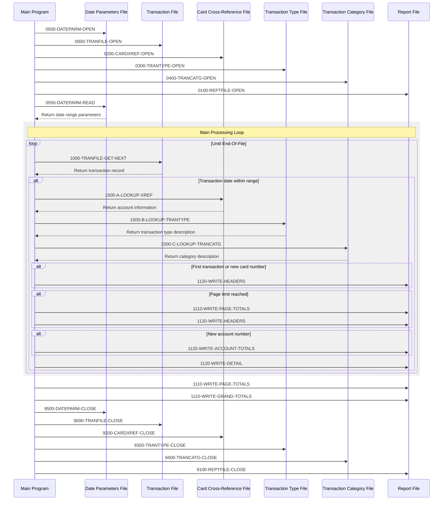

# CBTRN03C

## Overview
This batch COBOL program (CBTRN03C) generates a transaction detail report for the CardDemo application. The program reads transaction records from a sequential file and filters them based on a date range specified in a parameter file. For each transaction within the date range, it looks up additional information from three indexed files: a card cross-reference file to get account information, a transaction type file for transaction descriptions, and a transaction category file for category descriptions. The program organizes the report by card number, calculating and displaying page totals, account totals, and grand totals for transaction amounts. The report includes transaction details such as transaction ID, account ID, transaction type, category, source, and amount. Error handling is implemented throughout the program to manage file access issues and invalid data conditions.

## Metadata
**Program ID**: `CBTRN03C`

**Author**: `AWS`

## Sequence Diagram


## Referenced Copybooks
- [`CVTRA05Y`](copybooks/CVTRA05Y.md)
- [`CVTRA04Y`](copybooks/CVTRA04Y.md)
- [`CVTRA07Y`](copybooks/CVTRA07Y.md)
- [`CVACT03Y`](copybooks/CVACT03Y.md)
- [`CVTRA03Y`](copybooks/CVTRA03Y.md)

## Environment Division

### INPUT-OUTPUT SECTION
This section defines the file control entries for the transaction report program. It specifies five files: a sequential transaction file (TRANSACT-FILE) that contains the source transaction data, three indexed files accessed randomly - a card cross-reference file (XREF-FILE) for account lookups, a transaction type file (TRANTYPE-FILE) for transaction descriptions, and a transaction category file (TRANCATG-FILE) for category information. It also defines a sequential report output file (REPORT-FILE) and a sequential date parameters file (DATE-PARMS-FILE) that likely contains the date range criteria for filtering transactions. Each file has an associated file status variable for error handling.
<details><summary>Code</summary>
```cobol
FILE-CONTROL.                                                            
           SELECT TRANSACT-FILE ASSIGN TO TRANFILE                              
                  ORGANIZATION IS SEQUENTIAL                                    
                  FILE STATUS  IS TRANFILE-STATUS.                              
                                                                                
           SELECT XREF-FILE ASSIGN TO CARDXREF                                  
                  ORGANIZATION IS INDEXED                                       
                  ACCESS MODE  IS RANDOM                                        
                  RECORD KEY   IS FD-XREF-CARD-NUM                              
                  FILE STATUS  IS CARDXREF-STATUS.                              
                                                                                
           SELECT TRANTYPE-FILE ASSIGN TO TRANTYPE                              
                  ORGANIZATION IS INDEXED                                       
                  ACCESS MODE  IS RANDOM                                        
                  RECORD KEY   IS FD-TRAN-TYPE                                  
                  FILE STATUS  IS TRANTYPE-STATUS.                              
                                                                                
           SELECT TRANCATG-FILE ASSIGN TO TRANCATG                              
                  ORGANIZATION IS INDEXED                                       
                  ACCESS MODE  IS RANDOM                                        
                  RECORD KEY   IS FD-TRAN-CAT-KEY                               
                  FILE STATUS  IS TRANCATG-STATUS.                              
                                                                                
           SELECT REPORT-FILE ASSIGN TO TRANREPT                                
                  ORGANIZATION IS SEQUENTIAL                                    
                  FILE STATUS  IS TRANREPT-STATUS.                              
                                                                                
           SELECT DATE-PARMS-FILE ASSIGN TO DATEPARM                            
                  ORGANIZATION IS SEQUENTIAL                                    
                  FILE STATUS  IS DATEPARM-STATUS.                              
      *
```
</details>


## Data Division

### FILE SECTION
This File Section defines the file structures used in the CBTRN03C program for generating transaction reports. It includes six file definitions: TRANSACT-FILE for transaction records with a 350-byte structure containing transaction data and timestamp; XREF-FILE for card cross-reference records with card number and related data; TRANTYPE-FILE for transaction type lookup with type code and descriptive data; TRANCATG-FILE for transaction category information with composite keys (type code and category code); REPORT-FILE for the 133-byte output report records; and DATE-PARMS-FILE for reading the 80-byte date range parameters that control which transactions are included in the report.
<details><summary>Code</summary>
```cobol
FD  TRANSACT-FILE.                                                       
       01 FD-TRANFILE-REC.                                                      
          05 FD-TRANS-DATA      PIC X(304).                                     
          05 FD-TRAN-PROC-TS    PIC X(26).                                      
          05 FD-FILLER          PIC X(20).                                      
                                                                                
       FD  XREF-FILE.                                                           
       01  FD-CARDXREF-REC.                                                     
           05 FD-XREF-CARD-NUM                  PIC X(16).                      
           05 FD-XREF-DATA                      PIC X(34).                      
                                                                                
       FD  TRANTYPE-FILE.                                                       
       01 FD-TRANTYPE-REC.                                                      
          05 FD-TRAN-TYPE       PIC X(02).                                      
          05 FD-TRAN-DATA       PIC X(58).                                      
                                                                                
       FD  TRANCATG-FILE.                                                       
       01 FD-TRAN-CAT-RECORD.                                                   
           05  FD-TRAN-CAT-KEY.                                                 
              10  FD-TRAN-TYPE-CD                         PIC X(02).            
              10  FD-TRAN-CAT-CD                          PIC 9(04).            
           05  FD-TRAN-CAT-DATA                           PIC X(54).            
                                                                                
       FD  REPORT-FILE.                                                         
       01 FD-REPTFILE-REC       PIC X(133).                                     
                                                                                
       FD  DATE-PARMS-FILE.                                                     
       01 FD-DATEPARM-REC       PIC X(80).
```
</details>


### WORKING-STORAGE SECTION
This Working-Storage section defines the data structures used by the CBTRN03C transaction report program. It includes file status variables for all input and output files (transaction file, card cross-reference file, transaction type file, transaction category file, report file, and date parameter file). The section incorporates several copybooks (CVTRA05Y, CVACT03Y, CVTRA03Y, CVTRA04Y, CVTRA07Y) that likely contain record layouts for these files. It defines a structure for the date parameter record that stores the start and end dates for filtering transactions. Report-specific variables track page formatting (line counter, page size), financial totals (page total, account total, grand total), and the current card number being processed. Additional utility fields are defined for I/O status handling, binary data manipulation, and program flow control, including end-of-file indicators and application result codes.
<details><summary>Code</summary>
```cobol
*****************************************************************         
       COPY CVTRA05Y.                                                           
       01 TRANFILE-STATUS.                                                      
          05 TRANFILE-STAT1     PIC X.                                          
          05 TRANFILE-STAT2     PIC X.                                          
                                                                                
       COPY CVACT03Y.                                                           
       01  CARDXREF-STATUS.                                                     
           05  CARDXREF-STAT1      PIC X.                                       
           05  CARDXREF-STAT2      PIC X.                                       
                                                                                
       COPY CVTRA03Y.                                                           
       01  TRANTYPE-STATUS.                                                     
           05  TRANTYPE-STAT1      PIC X.                                       
           05  TRANTYPE-STAT2      PIC X.                                       
                                                                                
       COPY CVTRA04Y.                                                           
       01  TRANCATG-STATUS.                                                     
           05  TRANCATG-STAT1      PIC X.                                       
           05  TRANCATG-STAT2      PIC X.                                       
                                                                                
       COPY CVTRA07Y.                                                           
       01 TRANREPT-STATUS.                                                      
           05 REPTFILE-STAT1     PIC X.                                         
           05 REPTFILE-STAT2     PIC X.                                         
                                                                                
       01 DATEPARM-STATUS.                                                      
           05 DATEPARM-STAT1     PIC X.                                         
           05 DATEPARM-STAT2     PIC X.                                         
                                                                                
       01 WS-DATEPARM-RECORD.                                                   
           05 WS-START-DATE      PIC X(10).                                     
           05 FILLER             PIC X(01).                                     
           05 WS-END-DATE        PIC X(10).                                     
                                                                                
       01 WS-REPORT-VARS.                                                       
           05 WS-FIRST-TIME      PIC X      VALUE 'Y'.                          
           05 WS-LINE-COUNTER    PIC 9(09) COMP-3                               
                                            VALUE 0.                            
           05 WS-PAGE-SIZE       PIC 9(03) COMP-3                               
                                            VALUE 20.                           
           05 WS-BLANK-LINE      PIC X(133) VALUE SPACES.                       
           05 WS-PAGE-TOTAL      PIC S9(09)V99 VALUE 0.                         
           05 WS-ACCOUNT-TOTAL   PIC S9(09)V99 VALUE 0.                         
           05 WS-GRAND-TOTAL     PIC S9(09)V99 VALUE 0.                         
           05 WS-CURR-CARD-NUM   PIC X(16) VALUE SPACES.                        
                                                                                
       01 IO-STATUS.                                                            
          05 IO-STAT1           PIC X.                                          
          05 IO-STAT2           PIC X.                                          
       01 TWO-BYTES-BINARY      PIC 9(4) BINARY.                                
       01 TWO-BYTES-ALPHA REDEFINES TWO-BYTES-BINARY.                           
          05 TWO-BYTES-LEFT     PIC X.                                          
          05 TWO-BYTES-RIGHT    PIC X.                                          
       01 IO-STATUS-04.                                                         
          05 IO-STATUS-0401     PIC 9      VALUE 0.                             
          05 IO-STATUS-0403     PIC 999    VALUE 0.                             
                                                                                
       01 APPL-RESULT           PIC S9(9) COMP.                                 
          88 APPL-AOK                      VALUE 0.                             
          88 APPL-EOF                      VALUE 16.                            
                                                                                
       01 END-OF-FILE           PIC X(01)  VALUE 'N'.                           
       01 ABCODE                PIC S9(9) BINARY.                               
       01 TIMING                PIC S9(9) BINARY.                               
                                                                                
      *****************************************************************
```
</details>


## Procedure Division

### 0550-DATEPARM-READ
This paragraph reads a date parameter record from the DATE-PARMS-FILE into the WS-DATEPARM-RECORD work area. It evaluates the file status after the read operation: setting APPL-RESULT to 0 for successful reads, 16 for end-of-file conditions, and 12 for other errors. When the read is successful (APPL-AOK), it displays the date range (from WS-START-DATE to WS-END-DATE) that will be used for transaction filtering. If an end-of-file condition occurs, it sets the END-OF-FILE flag to 'Y'. For any other file errors, it displays an error message, captures the file status code, calls a routine to display the I/O status details, and then abends the program. This paragraph is crucial for establishing the date parameters that control which transactions will be included in the report.
<details><summary>Code</summary>
```cobol
READ DATE-PARMS-FILE INTO WS-DATEPARM-RECORD                         
           EVALUATE DATEPARM-STATUS                                             
             WHEN '00'                                                          
                 MOVE 0 TO APPL-RESULT                                          
             WHEN '10'                                                          
                 MOVE 16 TO APPL-RESULT                                         
             WHEN OTHER                                                         
                 MOVE 12 TO APPL-RESULT                                         
           END-EVALUATE                                                         
                                                                                
           IF APPL-AOK                                                          
              DISPLAY 'Reporting from ' WS-START-DATE                           
                 ' to ' WS-END-DATE                                             
           ELSE                                                                 
              IF APPL-EOF                                                       
                 MOVE 'Y' TO END-OF-FILE                                        
              ELSE                                                              
                 DISPLAY 'ERROR READING DATEPARM FILE'                          
                 MOVE DATEPARM-STATUS TO IO-STATUS                              
                 PERFORM 9910-DISPLAY-IO-STATUS                                 
                 PERFORM 9999-ABEND-PROGRAM                                     
              END-IF                                                            
           .                                                                    
                                                                                
      *****************************************************************         
      * I/O ROUTINES TO ACCESS A KSDS, VSAM DATA SET...               *         
      *****************************************************************
```
</details>


### 1000-TRANFILE-GET-NEXT
This paragraph handles the reading of transaction records from the TRANSACT-FILE. It evaluates the file status after each read operation and sets appropriate result codes: 0 for successful reads, 16 for end-of-file conditions, and 12 for other file errors. When a successful read occurs, processing continues normally. When end-of-file is reached, it sets the END-OF-FILE flag to 'Y'. For any other file errors, it displays an error message, captures the file status code, calls a routine to display the I/O status details, and then terminates the program abnormally. This paragraph implements standard file handling with proper error detection and handling to ensure data integrity during report generation.
<details><summary>Code</summary>
```cobol
READ TRANSACT-FILE INTO TRAN-RECORD.                                 
                                                                                
           EVALUATE TRANFILE-STATUS                                             
             WHEN '00'                                                          
                 MOVE 0 TO APPL-RESULT                                          
             WHEN '10'                                                          
                 MOVE 16 TO APPL-RESULT                                         
             WHEN OTHER                                                         
                 MOVE 12 TO APPL-RESULT                                         
           END-EVALUATE                                                         
                                                                                
           IF APPL-AOK                                                          
              CONTINUE                                                          
           ELSE                                                                 
              IF APPL-EOF                                                       
                 MOVE 'Y' TO END-OF-FILE                                        
              ELSE                                                              
                 DISPLAY 'ERROR READING TRANSACTION FILE'                       
                 MOVE TRANFILE-STATUS TO IO-STATUS                              
                 PERFORM 9910-DISPLAY-IO-STATUS                                 
                 PERFORM 9999-ABEND-PROGRAM                                     
              END-IF                                                            
           END-IF                                                               
           EXIT.                                                                
      *---------------------------------------------------------------*
```
</details>


### 1100-WRITE-TRANSACTION-REPORT
This paragraph handles the writing of transaction records to the report. It first checks if this is the initial execution (WS-FIRST-TIME = 'Y'), and if so, initializes the report by setting the date range headers and writing the report headers. It then manages pagination by checking if the current line count has reached the page size limit, and if so, writes page totals and new headers. For each transaction, it accumulates the transaction amount into both page and account total accumulators before writing the transaction detail line to the report. The paragraph maintains proper report formatting and running totals throughout the report generation process.
<details><summary>Code</summary>
```cobol
IF WS-FIRST-TIME = 'Y'                                               
              MOVE 'N' TO WS-FIRST-TIME                                         
              MOVE WS-START-DATE TO REPT-START-DATE                             
              MOVE WS-END-DATE TO REPT-END-DATE                                 
              PERFORM 1120-WRITE-HEADERS                                        
           END-IF                                                               
                                                                                
           IF FUNCTION MOD(WS-LINE-COUNTER, WS-PAGE-SIZE) = 0                   
              PERFORM 1110-WRITE-PAGE-TOTALS                                    
              PERFORM 1120-WRITE-HEADERS                                        
           END-IF                                                               
                                                                                
           ADD TRAN-AMT TO WS-PAGE-TOTAL                                        
                           WS-ACCOUNT-TOTAL                                     
           PERFORM 1120-WRITE-DETAIL                                            
           EXIT.                                                                
                                                                                
      *---------------------------------------------------------------*
```
</details>


### 1110-WRITE-PAGE-TOTALS
This paragraph handles the writing of page total information to the transaction detail report. It moves the accumulated page total to the report line, writes the page totals record to the report file, adds the page total to the running grand total, and then resets the page total to zero for the next page. After writing the page totals, it increments the line counter and writes a transaction header to start the next page of transaction details. The paragraph is part of the report formatting logic that maintains running totals at different levels of the report hierarchy.
<details><summary>Code</summary>
```cobol
MOVE WS-PAGE-TOTAL TO REPT-PAGE-TOTAL                                
           MOVE REPORT-PAGE-TOTALS TO FD-REPTFILE-REC                           
           PERFORM 1111-WRITE-REPORT-REC                                        
           ADD WS-PAGE-TOTAL TO WS-GRAND-TOTAL                                  
           MOVE 0 TO WS-PAGE-TOTAL                                              
           ADD 1 TO WS-LINE-COUNTER                                             
           MOVE TRANSACTION-HEADER-2 TO FD-REPTFILE-REC                         
           PERFORM 1111-WRITE-REPORT-REC                                        
           ADD 1 TO WS-LINE-COUNTER                                             
                                                                                
           EXIT.                                                                
      *---------------------------------------------------------------*
```
</details>


### 1120-WRITE-ACCOUNT-TOTALS
This paragraph writes account total information to the transaction detail report. It formats the current account total amount into the report line, writes it to the report file, and then resets the account total to zero for the next account. After writing the account total line, it increments the line counter and writes a secondary header line to the report to prepare for the next account's transactions. This ensures that each account's transactions are properly summarized and visually separated in the final report.
<details><summary>Code</summary>
```cobol
MOVE WS-ACCOUNT-TOTAL   TO REPT-ACCOUNT-TOTAL                        
           MOVE REPORT-ACCOUNT-TOTALS TO FD-REPTFILE-REC                        
           PERFORM 1111-WRITE-REPORT-REC                                        
           MOVE 0 TO WS-ACCOUNT-TOTAL                                           
           ADD 1 TO WS-LINE-COUNTER                                             
           MOVE TRANSACTION-HEADER-2 TO FD-REPTFILE-REC                         
           PERFORM 1111-WRITE-REPORT-REC                                        
           ADD 1 TO WS-LINE-COUNTER                                             
                                                                                
           EXIT.                                                                
      *---------------------------------------------------------------*
```
</details>


### 1110-WRITE-GRAND-TOTALS
This paragraph writes the grand total amount to the report. It moves the accumulated grand total from the working storage variable WS-GRAND-TOTAL to the report line field REPT-GRAND-TOTAL, then transfers the formatted grand totals line to the report file record area (FD-REPTFILE-REC). It then calls the 1111-WRITE-REPORT-REC paragraph to physically write the record to the report file before exiting.
<details><summary>Code</summary>
```cobol
MOVE WS-GRAND-TOTAL TO REPT-GRAND-TOTAL                              
           MOVE REPORT-GRAND-TOTALS TO FD-REPTFILE-REC                          
           PERFORM 1111-WRITE-REPORT-REC                                        
           EXIT.                                                                
      *---------------------------------------------------------------*
```
</details>


### 1120-WRITE-HEADERS
This paragraph handles the writing of report headers to the transaction detail report. It sequentially writes four lines to the report file: the report name header, a blank line for spacing, and two transaction header lines that likely contain column titles or report metadata. After writing each line, it increments the line counter to track the current position on the page. The paragraph uses the 1111-WRITE-REPORT-REC paragraph to perform the actual writing operation for each line.
<details><summary>Code</summary>
```cobol
MOVE REPORT-NAME-HEADER TO FD-REPTFILE-REC                           
           PERFORM 1111-WRITE-REPORT-REC                                        
           ADD 1 TO WS-LINE-COUNTER                                             
                                                                                
           MOVE WS-BLANK-LINE TO FD-REPTFILE-REC                                
           PERFORM 1111-WRITE-REPORT-REC                                        
           ADD 1 TO WS-LINE-COUNTER                                             
                                                                                
           MOVE TRANSACTION-HEADER-1 TO FD-REPTFILE-REC                         
           PERFORM 1111-WRITE-REPORT-REC                                        
           ADD 1 TO WS-LINE-COUNTER                                             
                                                                                
           MOVE TRANSACTION-HEADER-2 TO FD-REPTFILE-REC                         
           PERFORM 1111-WRITE-REPORT-REC                                        
           ADD 1 TO WS-LINE-COUNTER                                             
                                                                                
           EXIT.                                                                
      *---------------------------------------------------------------*
```
</details>


### 1111-WRITE-REPORT-REC
This paragraph handles the writing of records to the report file and implements error handling for the operation. After attempting to write a record to FD-REPTFILE-REC, it checks the status code. If the write operation is successful (status '00'), it sets APPL-RESULT to 0 indicating success. Otherwise, it sets APPL-RESULT to 12 indicating an error. If the application status is not OK (APPL-AOK), it displays an error message, captures the file status code, displays the I/O status details by calling the 9910-DISPLAY-IO-STATUS paragraph, and then terminates the program by calling the 9999-ABEND-PROGRAM paragraph. This ensures that any file writing errors are properly handled and reported before abnormal termination.
<details><summary>Code</summary>
```cobol
WRITE FD-REPTFILE-REC                                                
           IF TRANREPT-STATUS = '00'                                            
              MOVE 0 TO APPL-RESULT                                             
           ELSE                                                                 
              MOVE 12 TO APPL-RESULT                                            
           END-IF                                                               
           IF APPL-AOK                                                          
              CONTINUE                                                          
           ELSE                                                                 
              DISPLAY 'ERROR WRITING REPTFILE'                                  
              MOVE TRANREPT-STATUS TO IO-STATUS                                 
              PERFORM 9910-DISPLAY-IO-STATUS                                    
              PERFORM 9999-ABEND-PROGRAM                                        
           END-IF                                                               
           EXIT.
```
</details>


### 1120-WRITE-DETAIL
This paragraph formats and writes a single transaction detail line to the report. It initializes the report line structure, then populates it with transaction information including the transaction ID, account ID, type code and description, category code and description, source, and amount. The data is sourced from the transaction record and related lookup files (cross-reference, transaction type, and category files). After formatting the line, it calls the 1111-WRITE-REPORT-REC paragraph to physically write the record to the report file and increments the line counter to track pagination.
<details><summary>Code</summary>
```cobol
INITIALIZE TRANSACTION-DETAIL-REPORT                                 
           MOVE TRAN-ID TO TRAN-REPORT-TRANS-ID                                 
           MOVE XREF-ACCT-ID TO TRAN-REPORT-ACCOUNT-ID                          
           MOVE TRAN-TYPE-CD OF TRAN-RECORD TO TRAN-REPORT-TYPE-CD              
           MOVE TRAN-TYPE-DESC TO TRAN-REPORT-TYPE-DESC                         
           MOVE TRAN-CAT-CD OF TRAN-RECORD  TO TRAN-REPORT-CAT-CD               
           MOVE TRAN-CAT-TYPE-DESC TO TRAN-REPORT-CAT-DESC                      
           MOVE TRAN-SOURCE TO TRAN-REPORT-SOURCE                               
           MOVE TRAN-AMT TO TRAN-REPORT-AMT                                     
           MOVE TRANSACTION-DETAIL-REPORT TO FD-REPTFILE-REC                    
           PERFORM 1111-WRITE-REPORT-REC                                        
           ADD 1 TO WS-LINE-COUNTER                                             
           EXIT.                                                                
      *---------------------------------------------------------------*
```
</details>


### 0000-TRANFILE-OPEN
This paragraph handles the opening of the transaction input file (TRANSACT-FILE) and implements error handling for the operation. It initially sets APPL-RESULT to 8 (indicating a pending operation), then attempts to open the file in INPUT mode. If the operation succeeds (status code '00'), it sets APPL-RESULT to 0 indicating success; otherwise, it sets APPL-RESULT to 12 indicating failure. When the file opens successfully, processing continues. If the open operation fails, the paragraph displays an error message, retrieves the file status code, calls a routine to display the I/O status details (9910-DISPLAY-IO-STATUS), and then terminates the program by calling the 9999-ABEND-PROGRAM paragraph. This ensures the program doesn't proceed with invalid file access.
<details><summary>Code</summary>
```cobol
MOVE 8 TO APPL-RESULT.                                               
           OPEN INPUT TRANSACT-FILE                                             
           IF TRANFILE-STATUS = '00'                                            
              MOVE 0 TO APPL-RESULT                                             
           ELSE                                                                 
              MOVE 12 TO APPL-RESULT                                            
           END-IF                                                               
           IF APPL-AOK                                                          
              CONTINUE                                                          
           ELSE                                                                 
              DISPLAY 'ERROR OPENING TRANFILE'                                  
              MOVE TRANFILE-STATUS TO IO-STATUS                                 
              PERFORM 9910-DISPLAY-IO-STATUS                                    
              PERFORM 9999-ABEND-PROGRAM                                        
           END-IF                                                               
           EXIT.                                                                
      *---------------------------------------------------------------*
```
</details>


### 0100-REPTFILE-OPEN
This paragraph handles the opening of the output report file. It initializes APPL-RESULT to 8, then attempts to open the REPORT-FILE for output. If the operation is successful (status code '00'), it sets APPL-RESULT to 0; otherwise, it sets APPL-RESULT to 12. The code then checks if the operation was successful (APPL-AOK condition). If not, it displays an error message, captures the file status code, calls a routine to display the I/O status details, and then abends the program. This ensures proper error handling if the report file cannot be opened, preventing the program from continuing execution with an invalid output file.
<details><summary>Code</summary>
```cobol
MOVE 8 TO APPL-RESULT.                                               
           OPEN OUTPUT REPORT-FILE                                              
           IF TRANREPT-STATUS = '00'                                            
              MOVE 0 TO APPL-RESULT                                             
           ELSE                                                                 
              MOVE 12 TO APPL-RESULT                                            
           END-IF                                                               
           IF APPL-AOK                                                          
              CONTINUE                                                          
           ELSE                                                                 
              DISPLAY 'ERROR OPENING REPTFILE'                                  
              MOVE TRANREPT-STATUS TO IO-STATUS                                 
              PERFORM 9910-DISPLAY-IO-STATUS                                    
              PERFORM 9999-ABEND-PROGRAM                                        
           END-IF                                                               
           EXIT.                                                                
      *---------------------------------------------------------------*
```
</details>


### 0200-CARDXREF-OPEN
This paragraph handles the opening of the card cross-reference file (XREF-FILE) used to retrieve account information. It sets an initial result code of 8, attempts to open the file in INPUT mode, and then checks the operation's success. If the file opens successfully (status '00'), it sets APPL-RESULT to 0 indicating success. Otherwise, it sets APPL-RESULT to 12 indicating failure. When a failure occurs, the paragraph displays an error message, retrieves the file status code, calls a routine to display the I/O status details, and then terminates the program abnormally. This error handling ensures the program doesn't proceed without access to the critical cross-reference data needed for the transaction report.
<details><summary>Code</summary>
```cobol
MOVE 8 TO APPL-RESULT.                                               
           OPEN INPUT XREF-FILE                                                 
           IF  CARDXREF-STATUS = '00'                                           
               MOVE 0 TO APPL-RESULT                                            
           ELSE                                                                 
               MOVE 12 TO APPL-RESULT                                           
           END-IF                                                               
           IF  APPL-AOK                                                         
               CONTINUE                                                         
           ELSE                                                                 
               DISPLAY 'ERROR OPENING CROSS REF FILE'                           
               MOVE CARDXREF-STATUS TO IO-STATUS                                
               PERFORM 9910-DISPLAY-IO-STATUS                                   
               PERFORM 9999-ABEND-PROGRAM                                       
           END-IF                                                               
           EXIT.                                                                
      *---------------------------------------------------------------*
```
</details>


### 0300-TRANTYPE-OPEN
This paragraph handles the opening of the transaction type reference file. It sets an initial result code of 8, then attempts to open the TRANTYPE-FILE in INPUT mode. If the file opens successfully (status '00'), it sets the result code to 0; otherwise, it sets it to 12. If the operation is successful (APPL-AOK condition), processing continues. If there's an error, the paragraph displays an error message, captures the file status code, calls a routine to display the I/O status details, and then abends the program. This ensures the program terminates properly if it cannot access the transaction type reference data needed for report generation.
<details><summary>Code</summary>
```cobol
MOVE 8 TO APPL-RESULT.                                               
           OPEN INPUT TRANTYPE-FILE                                             
           IF  TRANTYPE-STATUS = '00'                                           
               MOVE 0 TO APPL-RESULT                                            
           ELSE                                                                 
               MOVE 12 TO APPL-RESULT                                           
           END-IF                                                               
           IF  APPL-AOK                                                         
               CONTINUE                                                         
           ELSE                                                                 
               DISPLAY 'ERROR OPENING TRANSACTION TYPE FILE'                    
               MOVE TRANTYPE-STATUS TO IO-STATUS                                
               PERFORM 9910-DISPLAY-IO-STATUS                                   
               PERFORM 9999-ABEND-PROGRAM                                       
           END-IF                                                               
           EXIT.                                                                
      *---------------------------------------------------------------*
```
</details>


### 0400-TRANCATG-OPEN
This paragraph handles the opening of the Transaction Category file (TRANCATG-FILE) in input mode. It sets an initial result code of 8, then attempts to open the file. If the operation is successful (status '00'), it sets the result code to 0; otherwise, it sets it to 12. If the result indicates success (APPL-AOK), processing continues; otherwise, it displays an error message about failing to open the Transaction Category file, calls a routine to display the I/O status code, and then abends the program. This ensures the program terminates properly if it cannot access the critical Transaction Category reference data needed for the report.
<details><summary>Code</summary>
```cobol
MOVE 8 TO APPL-RESULT.                                               
           OPEN INPUT TRANCATG-FILE                                             
           IF  TRANCATG-STATUS = '00'                                           
               MOVE 0 TO APPL-RESULT                                            
           ELSE                                                                 
               MOVE 12 TO APPL-RESULT                                           
           END-IF                                                               
           IF  APPL-AOK                                                         
               CONTINUE                                                         
           ELSE                                                                 
               DISPLAY 'ERROR OPENING TRANSACTION CATG FILE'                    
               MOVE TRANCATG-STATUS TO IO-STATUS                                
               PERFORM 9910-DISPLAY-IO-STATUS                                   
               PERFORM 9999-ABEND-PROGRAM                                       
           END-IF                                                               
           EXIT.                                                                
      *---------------------------------------------------------------*
```
</details>


### 0500-DATEPARM-OPEN
This paragraph handles the opening of the date parameters input file. It initializes the application result code to 8, then attempts to open the DATE-PARMS-FILE. If the file opens successfully (status '00'), it sets the result code to 0; otherwise, it sets it to 12. The paragraph then checks if the operation was successful (APPL-AOK condition). If not, it displays an error message about the date parameter file, calls a routine to display the I/O status code, and then executes the program termination routine. This ensures the program cannot proceed without successfully accessing the date parameters that define the transaction date range for the report.
<details><summary>Code</summary>
```cobol
MOVE 8 TO APPL-RESULT.                                               
           OPEN INPUT DATE-PARMS-FILE                                           
           IF  DATEPARM-STATUS = '00'                                           
               MOVE 0 TO APPL-RESULT                                            
           ELSE                                                                 
               MOVE 12 TO APPL-RESULT                                           
           END-IF                                                               
           IF  APPL-AOK                                                         
               CONTINUE                                                         
           ELSE                                                                 
               DISPLAY 'ERROR OPENING DATE PARM FILE'                           
               MOVE DATEPARM-STATUS TO IO-STATUS                                
               PERFORM 9910-DISPLAY-IO-STATUS                                   
               PERFORM 9999-ABEND-PROGRAM                                       
           END-IF                                                               
           EXIT.                                                                
      *---------------------------------------------------------------*
```
</details>


### 1500-A-LOOKUP-XREF
This paragraph performs a lookup operation in the card cross-reference file to retrieve account information based on a card number. It reads a record from the XREF-FILE into the CARD-XREF-RECORD structure. If the card number is not found (INVALID KEY condition), the paragraph displays an error message with the invalid card number, sets an error status code of 23, displays the I/O status details, and terminates the program abnormally. This validation ensures that only transactions with valid card numbers are processed in the report.
<details><summary>Code</summary>
```cobol
READ XREF-FILE INTO CARD-XREF-RECORD                                 
              INVALID KEY                                                       
                 DISPLAY 'INVALID CARD NUMBER : '  FD-XREF-CARD-NUM             
                 MOVE 23 TO IO-STATUS                                           
                 PERFORM 9910-DISPLAY-IO-STATUS                                 
                 PERFORM 9999-ABEND-PROGRAM                                     
           END-READ                                                             
           EXIT.                                                                
      *---------------------------------------------------------------*
```
</details>


### 1500-B-LOOKUP-TRANTYPE
This paragraph performs a lookup operation to retrieve transaction type information from the TRANTYPE-FILE using the transaction type code stored in FD-TRAN-TYPE. If the lookup fails (INVALID KEY condition), the program displays an error message showing the invalid transaction type, sets an error status code of 23, displays the I/O status details, and terminates the program through the abend routine. The paragraph is essential for obtaining descriptive information about transaction types to include in the transaction detail report.
<details><summary>Code</summary>
```cobol
READ TRANTYPE-FILE INTO TRAN-TYPE-RECORD                             
              INVALID KEY                                                       
                 DISPLAY 'INVALID TRANSACTION TYPE : '  FD-TRAN-TYPE            
                 MOVE 23 TO IO-STATUS                                           
                 PERFORM 9910-DISPLAY-IO-STATUS                                 
                 PERFORM 9999-ABEND-PROGRAM                                     
           END-READ                                                             
           EXIT.                                                                
      *---------------------------------------------------------------*
```
</details>


### 1500-C-LOOKUP-TRANCATG
This paragraph performs a lookup operation on the transaction category file (TRANCATG-FILE) using the current transaction category key (FD-TRAN-CAT-KEY). If the key is not found in the file, the program displays an error message with the invalid key value, sets an error status code of 23, displays the I/O status details, and then terminates the program through the abend routine. When successful, the transaction category record is read into the TRAN-CAT-RECORD structure for further processing.
<details><summary>Code</summary>
```cobol
READ TRANCATG-FILE INTO TRAN-CAT-RECORD                              
              INVALID KEY                                                       
                 DISPLAY 'INVALID TRAN CATG KEY : '  FD-TRAN-CAT-KEY            
                 MOVE 23 TO IO-STATUS                                           
                 PERFORM 9910-DISPLAY-IO-STATUS                                 
                 PERFORM 9999-ABEND-PROGRAM                                     
           END-READ                                                             
           EXIT.                                                                
      *---------------------------------------------------------------*
```
</details>


### 9000-TRANFILE-CLOSE
This paragraph handles the closing of the transaction file (TRANSACT-FILE) with error handling. It sets an initial result code of 8, then attempts to close the file. If the close operation is successful (status '00'), it resets the result code to 0. If unsuccessful, it sets the result code to 12. When an error occurs, the paragraph displays an error message, captures the file status code, calls a routine to display the I/O status details, and then terminates the program abnormally. This ensures proper resource cleanup and provides meaningful error information if the transaction file cannot be closed properly.
<details><summary>Code</summary>
```cobol
ADD 8 TO ZERO GIVING APPL-RESULT.                                    
           CLOSE TRANSACT-FILE                                                  
           IF TRANFILE-STATUS = '00'                                            
              SUBTRACT APPL-RESULT FROM APPL-RESULT                             
           ELSE                                                                 
              ADD 12 TO ZERO GIVING APPL-RESULT                                 
           END-IF                                                               
           IF APPL-AOK                                                          
              CONTINUE                                                          
           ELSE                                                                 
              DISPLAY 'ERROR CLOSING POSTED TRANSACTION FILE'                   
              MOVE TRANFILE-STATUS TO IO-STATUS                                 
              PERFORM 9910-DISPLAY-IO-STATUS                                    
              PERFORM 9999-ABEND-PROGRAM                                        
           END-IF                                                               
           EXIT.                                                                
      *---------------------------------------------------------------*
```
</details>


### 9100-REPTFILE-CLOSE
This paragraph handles the closing of the report output file in the transaction detail report program. It sets an initial result code of 8, then attempts to close the REPORT-FILE. If the close operation is successful (status '00'), it resets the result code to 0; otherwise, it sets the result code to 12. If the operation completes successfully (APPL-AOK condition), processing continues normally. If an error occurs, the paragraph displays an error message, captures the file status code, displays the I/O status details by calling the 9910-DISPLAY-IO-STATUS paragraph, and then terminates the program abnormally by calling the 9999-ABEND-PROGRAM paragraph. This ensures proper resource cleanup and error handling when closing the report file.
<details><summary>Code</summary>
```cobol
ADD 8 TO ZERO GIVING APPL-RESULT.                                    
           CLOSE REPORT-FILE                                                    
           IF TRANREPT-STATUS = '00'                                            
              SUBTRACT APPL-RESULT FROM APPL-RESULT                             
           ELSE                                                                 
              ADD 12 TO ZERO GIVING APPL-RESULT                                 
           END-IF                                                               
           IF APPL-AOK                                                          
              CONTINUE                                                          
           ELSE                                                                 
              DISPLAY 'ERROR CLOSING REPORT FILE'                               
              MOVE TRANREPT-STATUS TO IO-STATUS                                 
              PERFORM 9910-DISPLAY-IO-STATUS                                    
              PERFORM 9999-ABEND-PROGRAM                                        
           END-IF                                                               
           EXIT.                                                                
                                                                                
      *---------------------------------------------------------------*
```
</details>


### 9200-CARDXREF-CLOSE
This paragraph handles the closing of the card cross-reference file (XREF-FILE) with appropriate error handling. It initially sets APPL-RESULT to 8 (indicating a potential error), then attempts to close the file. If the close operation is successful (status code '00'), it resets APPL-RESULT to 0; otherwise, it sets APPL-RESULT to 12 to indicate a more severe error. When an error occurs, the paragraph displays an error message, captures the file status code, calls a routine to display the I/O status details, and then terminates the program abnormally. This ensures proper resource cleanup and provides diagnostic information when file closing operations fail.
<details><summary>Code</summary>
```cobol
MOVE 8 TO APPL-RESULT.                                               
           CLOSE XREF-FILE                                                      
           IF  CARDXREF-STATUS = '00'                                           
               MOVE 0 TO APPL-RESULT                                            
           ELSE                                                                 
               MOVE 12 TO APPL-RESULT                                           
           END-IF                                                               
           IF  APPL-AOK                                                         
               CONTINUE                                                         
           ELSE                                                                 
               DISPLAY 'ERROR CLOSING CROSS REF FILE'                           
               MOVE CARDXREF-STATUS TO IO-STATUS                                
               PERFORM 9910-DISPLAY-IO-STATUS                                   
               PERFORM 9999-ABEND-PROGRAM                                       
           END-IF                                                               
           EXIT.                                                                
      *---------------------------------------------------------------*
```
</details>


### 9300-TRANTYPE-CLOSE
This paragraph handles the closing of the transaction type file (TRANTYPE-FILE) with appropriate error handling. It initially sets the application result code to 8, then attempts to close the file. If the close operation is successful (status code '00'), it resets the result code to 0; otherwise, it sets it to 12. When the operation fails, the paragraph displays an error message, retrieves the I/O status code, calls a routine to display the status details, and then terminates the program abnormally. This ensures proper resource cleanup and provides meaningful error information if the file cannot be closed properly.
<details><summary>Code</summary>
```cobol
MOVE 8 TO APPL-RESULT.                                               
           CLOSE TRANTYPE-FILE                                                  
           IF  TRANTYPE-STATUS = '00'                                           
               MOVE 0 TO APPL-RESULT                                            
           ELSE                                                                 
               MOVE 12 TO APPL-RESULT                                           
           END-IF                                                               
           IF  APPL-AOK                                                         
               CONTINUE                                                         
           ELSE                                                                 
               DISPLAY 'ERROR CLOSING TRANSACTION TYPE FILE'                    
               MOVE TRANTYPE-STATUS TO IO-STATUS                                
               PERFORM 9910-DISPLAY-IO-STATUS                                   
               PERFORM 9999-ABEND-PROGRAM                                       
           END-IF                                                               
           EXIT.                                                                
      *---------------------------------------------------------------*
```
</details>


### 9400-TRANCATG-CLOSE
This paragraph handles the closing of the Transaction Category file (TRANCATG-FILE) with appropriate error handling. It initially sets APPL-RESULT to 8, then attempts to close the file. If the operation is successful (status code '00'), it resets APPL-RESULT to 0; otherwise, it sets APPL-RESULT to 12 indicating an error. When an error occurs, the paragraph displays an error message, captures the file status code, calls routines to display the I/O status details and abnormally terminate the program. This is part of the program's cleanup process that ensures proper file handling before program termination.
<details><summary>Code</summary>
```cobol
MOVE 8 TO APPL-RESULT.                                               
           CLOSE TRANCATG-FILE                                                  
           IF  TRANCATG-STATUS = '00'                                           
               MOVE 0 TO APPL-RESULT                                            
           ELSE                                                                 
               MOVE 12 TO APPL-RESULT                                           
           END-IF                                                               
           IF  APPL-AOK                                                         
               CONTINUE                                                         
           ELSE                                                                 
               DISPLAY 'ERROR CLOSING TRANSACTION CATG FILE'                    
               MOVE TRANCATG-STATUS TO IO-STATUS                                
               PERFORM 9910-DISPLAY-IO-STATUS                                   
               PERFORM 9999-ABEND-PROGRAM                                       
           END-IF                                                               
           EXIT.                                                                
      *---------------------------------------------------------------*
```
</details>


### 9500-DATEPARM-CLOSE
This paragraph handles the closing of the date parameters file and performs error handling. It initially sets a result code of 8, then attempts to close the DATE-PARMS-FILE. If the close operation is successful (status '00'), it resets the result code to 0; otherwise, it sets the result code to 12. If the operation was not successful, the paragraph displays an error message, retrieves the file status code, calls a routine to display the I/O status details, and then abends the program. This ensures proper resource cleanup and appropriate error handling when the program is finished with the date parameters file.
<details><summary>Code</summary>
```cobol
MOVE 8 TO APPL-RESULT.                                               
           CLOSE DATE-PARMS-FILE                                                
           IF  DATEPARM-STATUS = '00'                                           
               MOVE 0 TO APPL-RESULT                                            
           ELSE                                                                 
               MOVE 12 TO APPL-RESULT                                           
           END-IF                                                               
           IF  APPL-AOK                                                         
               CONTINUE                                                         
           ELSE                                                                 
               DISPLAY 'ERROR CLOSING DATE PARM FILE'                           
               MOVE DATEPARM-STATUS TO IO-STATUS                                
               PERFORM 9910-DISPLAY-IO-STATUS                                   
               PERFORM 9999-ABEND-PROGRAM                                       
           END-IF                                                               
           EXIT.
```
</details>


### 9999-ABEND-PROGRAM
This paragraph handles abnormal program termination by displaying an "ABENDING PROGRAM" message, resetting the TIMING variable to zero, setting an abort code (ABCODE) to 999, and then calling the Language Environment service 'CEE3ABD' to force an immediate program termination. This is likely used as a last resort error handling mechanism when the program encounters a critical error that prevents further processing.
<details><summary>Code</summary>
```cobol
DISPLAY 'ABENDING PROGRAM'                                           
           MOVE 0 TO TIMING                                                     
           MOVE 999 TO ABCODE                                                   
           CALL 'CEE3ABD'.                                                      
                                                                                
      *****************************************************************
```
</details>


### 9910-DISPLAY-IO-STATUS
This paragraph handles the display of file I/O status codes in a standardized format. When an I/O operation encounters an error, this routine formats the status code for consistent display. If the status code is non-numeric or indicates a serious error (first digit is '9'), it processes the two status bytes separately, converting the second byte to binary format before display. Otherwise, it formats standard status codes by padding with leading zeros. In both cases, it displays the formatted status code with a descriptive prefix. This error handling routine helps with debugging file operations by providing clear, consistent error reporting throughout the program.
<details><summary>Code</summary>
```cobol
IF IO-STATUS NOT NUMERIC                                             
              OR IO-STAT1 = '9'                                                 
              MOVE IO-STAT1 TO IO-STATUS-04(1:1)                                
              MOVE 0 TO TWO-BYTES-BINARY                                        
              MOVE IO-STAT2 TO TWO-BYTES-RIGHT                                  
              MOVE TWO-BYTES-BINARY TO IO-STATUS-0403                           
              DISPLAY 'FILE STATUS IS: NNNN' IO-STATUS-04                       
           ELSE                                                                 
              MOVE '0000' TO IO-STATUS-04                                       
              MOVE IO-STATUS TO IO-STATUS-04(3:2)                               
              DISPLAY 'FILE STATUS IS: NNNN' IO-STATUS-04                       
           END-IF                                                               
           EXIT.                                                                
      *
      * Ver: CardDemo_v1.0-15-g27d6c6f-68 Date: 2022-07-19 23:12:32 CDT
      *
```
</details>
