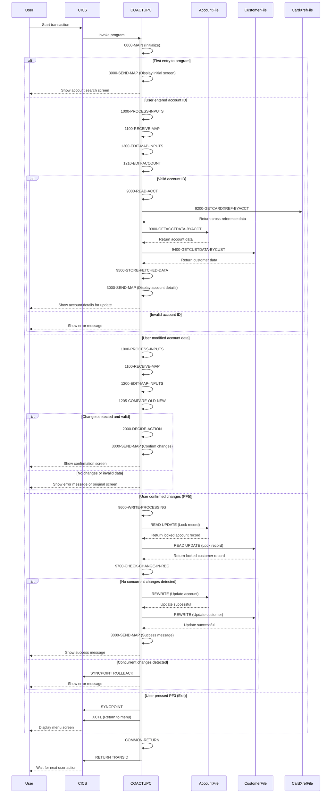

# COACTUPC

## Overview
This program, COACTUPC, is a business logic component of the CardDemo application that handles account updates. It allows users to view and modify account and customer information in a CICS environment. The program provides a comprehensive interface for updating various account details including credit limits, balances, dates, and customer information such as personal details, address, and contact information.

The program follows a structured workflow where it first receives and validates user input, then processes the data based on the current state of the transaction, and finally updates the relevant database records if changes are confirmed. It includes extensive validation logic for different data types including dates, currency amounts, phone numbers, SSNs, and address components.

Key features include:
- Account and customer data retrieval from multiple files (ACCTDAT, CUSTDAT, and card cross-reference files)
- Comprehensive field-level validation with specific error messages
- Change detection to prevent unnecessary updates
- Record locking and transaction management to ensure data integrity
- Support for various function keys to navigate the application workflow
- Formatted display of account and customer information

The program handles various states of the update process, from initial data entry to confirmation and completion, with appropriate user prompts and feedback at each stage. It also includes error handling for database operations and validation failures.

## Metadata
**Program ID**: `COACTUPC`

## Sequence Diagram


## Referenced Copybooks
- [`CVACT01Y`](copybooks/CVACT01Y.md)
- [`CVCUS01Y`](copybooks/CVCUS01Y.md)
- `replacing`
- `COACTUP`
- [`CSMSG02Y`](copybooks/CSMSG02Y.md)
- `DFHAID`
- [`CSUSR01Y`](copybooks/CSUSR01Y.md)
- [`CSUTLDWY`](copybooks/CSUTLDWY.md)
- [`CSUTLDPY`](copybooks/CSUTLDPY.md)
- [`CSSETATY`](copybooks/CSSETATY.md)
- [`CSDAT01Y`](copybooks/CSDAT01Y.md)
- [`CVCRD01Y`](copybooks/CVCRD01Y.md)
- [`COTTL01Y`](copybooks/COTTL01Y.md)
- [`CSMSG01Y`](copybooks/CSMSG01Y.md)
- [`CSLKPCDY`](copybooks/CSLKPCDY.md)
- [`COCOM01Y`](copybooks/COCOM01Y.md)
- [`CSSTRPFY`](copybooks/CSSTRPFY.md)
- `DFHBMSCA`
- [`CVACT03Y`](copybooks/CVACT03Y.md)

## Environment Division

### INPUT-OUTPUT SECTION
This section would typically contain the INPUT-OUTPUT SECTION of the COACTUPC program, which would define file control entries and file descriptions for the database files used in the account update process. However, the provided snippet is empty, suggesting that the INPUT-OUTPUT SECTION might be defined elsewhere in the program or inherited from included copybooks. In the CardDemo application context, this section would normally specify the CICS files for account data (ACCTDAT), customer data (CUSTDAT), and card cross-reference files that the program accesses for viewing and updating account information.
<details><summary>Code</summary>
```cobol

```
</details>


## Data Division

### WORKING-STORAGE SECTION
This data section defines the working storage variables for the COACTUPC program, which handles account updates in the CardDemo application. It contains several key components:

1. CICS processing variables for tracking response codes and transaction IDs
2. Extensive input validation structures for different data types including:
   - Signed numbers and currency amounts
   - Alphanumeric fields
   - US phone numbers with area code validation
   - Social Security Numbers with validity checks
   - Yes/No indicators
   - Mandatory field validation

3. Date validation structures for various date fields (account opening, expiration, reissue dates, and customer date of birth)

4. Status flags to track:
   - Data changes
   - Input validation status
   - Return conditions
   - Function key validity

5. Field-specific validation flags for all account and customer data elements

6. File handling variables for account, customer, and card cross-reference files

7. Message construction areas for user feedback, error messages, and informational displays

8. Record structures for account and customer data updates, including:
   - Account details (ID, status, balances, credit limits, dates)
   - Customer information (personal details, address, contact information)

9. Program communication area (COMMAREA) structures to maintain state between transactions, with both "old" and "new" versions of all data fields to track changes

The section also includes various copybooks for common functionality like date handling, screen layouts, and file record definitions used throughout the CardDemo application.
<details><summary>Code</summary>
```cobol
01  WS-MISC-STORAGE.
      ******************************************************************
      * General CICS related
      ******************************************************************
         05 WS-CICS-PROCESSNG-VARS.
            07 WS-RESP-CD                          PIC S9(09) COMP
                                                   VALUE ZEROS.
            07 WS-REAS-CD                          PIC S9(09) COMP
                                                   VALUE ZEROS.
            07 WS-TRANID                           PIC X(4)
                                                   VALUE SPACES.
            07 WS-UCTRANS                          PIC X(4)
                                                   VALUE SPACES.
      ******************************************************************
      *      Input edits
      ******************************************************************
      *  Generic Input Edits
         05  WS-GENERIC-EDITS.
           10 WS-EDIT-VARIABLE-NAME                PIC X(25).

           10 WS-EDIT-SIGNED-NUMBER-9V2-X          PIC X(15).
           10 WS-FLG-SIGNED-NUMBER-EDIT            PIC X(1).
              88  FLG-SIGNED-NUMBER-ISVALID        VALUE LOW-VALUES.
              88  FLG-SIGNED-NUMBER-NOT-OK         VALUE '0'.
              88  FLG-SIGNED-NUMBER-BLANK          VALUE 'B'.

           10 WS-EDIT-ALPHANUM-ONLY                PIC X(256).
           10 WS-EDIT-ALPHANUM-LENGTH              PIC S9(4) COMP-3.

           10 WS-EDIT-ALPHA-ONLY-FLAGS             PIC X(1).
              88  FLG-ALPHA-ISVALID                VALUE LOW-VALUES.
              88  FLG-ALPHA-NOT-OK                 VALUE '0'.
              88  FLG-ALPHA-BLANK                  VALUE 'B'.
           10 WS-EDIT-ALPHANUM-ONLY-FLAGS          PIC X(1).
              88  FLG-ALPHNANUM-ISVALID            VALUE LOW-VALUES.
              88  FLG-ALPHNANUM-NOT-OK             VALUE '0'.
              88  FLG-ALPHNANUM-BLANK              VALUE 'B'.
           10 WS-EDIT-MANDATORY-FLAGS              PIC X(1).
              88  FLG-MANDATORY-ISVALID            VALUE LOW-VALUES.
              88  FLG-MANDATORY-NOT-OK             VALUE '0'.
              88  FLG-MANDATORY-BLANK              VALUE 'B'.
           10 WS-EDIT-YES-NO                       PIC X(1)
                                                   VALUE 'N'.
              88 FLG-YES-NO-ISVALID                VALUES 'Y', 'N'.
              88 FLG-YES-NO-NOT-OK                 VALUE '0'.
              88 FLG-YES-NO-BLANK                  VALUE 'B'.

           10 WS-EDIT-US-PHONE-NUM                 PIC X(15).
           10 WS-EDIT-US-PHONE-NUM-X REDEFINES
              WS-EDIT-US-PHONE-NUM.
              20 FILLER                            PIC X(1).
      *                                            VALUE '('
              20 WS-EDIT-US-PHONE-NUMA             PIC X(3).
              20 WS-EDIT-US-PHONE-NUMA-N REDEFINES
                 WS-EDIT-US-PHONE-NUMA             PIC 9(3).
              20 FILLER                            PIC X(1).
      *                                            VALUE ')'
              20 WS-EDIT-US-PHONE-NUMB             PIC X(3).
              20 WS-EDIT-US-PHONE-NUMB-N REDEFINES
                 WS-EDIT-US-PHONE-NUMB             PIC 9(3).
              20 FILLER                            PIC X(1).
      *                                            VALUE '-'
              20 WS-EDIT-US-PHONE-NUMC             PIC X(4).
              20 WS-EDIT-US-PHONE-NUMC-N REDEFINES
                 WS-EDIT-US-PHONE-NUMC             PIC 9(4).
              20 FILLER                            PIC X(2).
           10 WS-EDIT-US-PHONE-NUM-FLGS.
               88 WS-EDIT-US-PHONE-IS-INVALID      VALUE '000'.
               88 WS-EDIT-US-PHONE-IS-VALID        VALUE LOW-VALUES.
               20 WS-EDIT-US-PHONEA-FLG            PIC X(01).
                  88 FLG-EDIT-US-PHONEA-ISVALID    VALUE LOW-VALUES.
                  88 FLG-EDIT-US-PHONEA-NOT-OK     VALUE '0'.
                  88 FLG-EDIT-US-PHONEA-BLANK      VALUE 'B'.
               20 WS-EDIT-EDIT-US-PHONEB           PIC X(01).
                  88 FLG-EDIT-US-PHONEB-ISVALID    VALUE LOW-VALUES.
                  88 FLG-EDIT-US-PHONEB-NOT-OK     VALUE '0'.
                  88 FLG-EDIT-US-PHONEB-BLANK      VALUE 'B'.
               20 WS-EDIT-EDIT-PHONEC              PIC X(01).
                  88 FLG-EDIT-US-PHONEC-ISVALID    VALUE LOW-VALUES.
                  88 FLG-EDIT-US-PHONEC-NOT-OK     VALUE '0'.
                  88 FLG-EDIT-US-PHONEC-BLANK      VALUE 'B'.

           10 WS-EDIT-US-SSN.
               20 WS-EDIT-US-SSN-PART1              PIC X(3).
               20 WS-EDIT-US-SSN-PART1-N REDEFINES
                  WS-EDIT-US-SSN-PART1              PIC 9(3).
                  88 INVALID-SSN-PART1  VALUES      0,
                                                    666,
                                                    900 THRU 999.
               20 WS-EDIT-US-SSN-PART2              PIC X(2).
               20 WS-EDIT-US-SSN-PART2-N REDEFINES
                  WS-EDIT-US-SSN-PART2              PIC 9(2).
               20 WS-EDIT-US-SSN-PART3              PIC X(4).
               20 WS-EDIT-US-SSN-PART3-N REDEFINES
                  WS-EDIT-US-SSN-PART3              PIC 9(4).
           10 WS-EDIT-US-SSN-N REDEFINES
              WS-EDIT-US-SSN                        PIC 9(09).
           10 WS-EDIT-US-SSN-FLGS.
               88 WS-EDIT-US-SSN-IS-INVALID         VALUE '000'.
               88 WS-EDIT-US-SSN-IS-VALID           VALUE LOW-VALUES.
               20 WS-EDIT-US-SSN-PART1-FLGS         PIC X(01).
                  88 FLG-EDIT-US-SSN-PART1-ISVALID  VALUE LOW-VALUES.
                  88 FLG-EDIT-US-SSN-PART1-NOT-OK   VALUE '0'.
                  88 FLG-EDIT-US-SSN-PART1-BLANK    VALUE 'B'.
               20 WS-EDIT-US-SSN-PART2-FLGS         PIC X(01).
                  88 FLG-EDIT-US-SSN-PART2-ISVALID  VALUE LOW-VALUES.
                  88 FLG-EDIT-US-SSN-PART2-NOT-OK   VALUE '0'.
                  88 FLG-EDIT-US-SSN-PART2-BLANK    VALUE 'B'.
               20 WS-EDIT-US-SSN-PART3-FLGS         PIC X(01).
                  88 FLG-EDIT-US-SSN-PART3-ISVALID  VALUE LOW-VALUES.
                  88 FLG-EDIT-US-SSN-PART3-NOT-OK   VALUE '0'.
                  88 FLG-EDIT-US-SSN-PART3-BLANK    VALUE 'B'.

      ******************************************************************
      *    Work variables
      ******************************************************************
         05 WS-CALCULATION-VARS.
          10 WS-DIV-BY                             PIC S9(4) COMP-3
                                                   VALUE 4.
          10 WS-DIVIDEND                           PIC S9(4) COMP-3
                                                   VALUE 0.

          10 WS-REMAINDER                          PIC S9(4) COMP-3
                                                   VALUE 0.
          10 WS-CURR-DATE                          PIC X(21)
                                                   VALUE SPACES.


      ******************************************************************
      *    Generic date edit variables CCYYMMDD
      ******************************************************************
           COPY 'CSUTLDWY'.
      ******************************************************************
         05  WS-DATACHANGED-FLAG                   PIC X(1).
           88  NO-CHANGES-FOUND                    VALUE '0'.
           88  CHANGE-HAS-OCCURRED                 VALUE '1'.
         05  WS-INPUT-FLAG                         PIC X(1).
           88  INPUT-OK                            VALUE '0'.
           88  INPUT-ERROR                         VALUE '1'.
           88  INPUT-PENDING                       VALUE LOW-VALUES.
         05  WS-RETURN-FLAG                        PIC X(1).
           88  WS-RETURN-FLAG-OFF                  VALUE LOW-VALUES.
           88  WS-RETURN-FLAG-ON                   VALUE '1'.
         05  WS-PFK-FLAG                           PIC X(1).
           88  PFK-VALID                           VALUE '0'.
           88  PFK-INVALID                         VALUE '1'.

      *  Program specific edits
         05  WS-EDIT-ACCT-FLAG                     PIC X(1).
           88  FLG-ACCTFILTER-ISVALID              VALUE '1'.
           88  FLG-ACCTFILTER-NOT-OK               VALUE '0'.
           88  FLG-ACCTFILTER-BLANK                VALUE ' '.
         05  WS-EDIT-CUST-FLAG                     PIC X(1).
           88  FLG-CUSTFILTER-ISVALID              VALUE '1'.
           88  FLG-CUSTFILTER-NOT-OK               VALUE '0'.
           88  FLG-CUSTFILTER-BLANK                VALUE ' '.
         05 WS-NON-KEY-FLAGS.
           10  WS-EDIT-ACCT-STATUS                 PIC  X(1).
               88  FLG-ACCT-STATUS-ISVALID         VALUES 'Y', 'N'.
               88  FLG-ACCT-STATUS-NOT-OK          VALUE '0'.
               88  FLG-ACCT-STATUS-BLANK           VALUE 'B'.
           10  WS-EDIT-CREDIT-LIMIT                PIC  X(1).
               88  FLG-CRED-LIMIT-ISVALID          VALUE LOW-VALUES.
               88  FLG-CRED-LIMIT-NOT-OK           VALUE '0'.
               88  FLG-CRED-LIMIT-BLANK            VALUE 'B'.
           10  WS-EDIT-CASH-CREDIT-LIMIT           PIC  X(1).
               88  FLG-CASH-CREDIT-LIMIT-ISVALID   VALUE LOW-VALUES.
               88  FLG-CASH-CREDIT-LIMIT-NOT-OK    VALUE '0'.
               88  FLG-CASH-CREDIT-LIMIT-BLANK     VALUE 'B'.
           10  WS-EDIT-CURR-BAL                    PIC  X(1).
               88  FLG-CURR-BAL-ISVALID            VALUE LOW-VALUES.
               88  FLG-CURR-BAL-NOT-OK             VALUE '0'.
               88  FLG-CURR-BAL-BLANK              VALUE 'B'.
           10  WS-EDIT-CURR-CYC-CREDIT             PIC  X(1).
               88  FLG-CURR-CYC-CREDIT-ISVALID     VALUE LOW-VALUES.
               88  FLG-CURR-CYC-CREDIT-NOT-OK      VALUE '0'.
               88  FLG-CURR-CYC-CREDIT-BLANK       VALUE 'B'.
           10  WS-EDIT-CURR-CYC-DEBIT              PIC  X(1).
               88  FLG-CURR-CYC-DEBIT-ISVALID      VALUE LOW-VALUES.
               88  FLG-CURR-CYC-DEBIT-NOT-OK       VALUE '0'.
               88  FLG-CURR-CYC-DEBIT-BLANK        VALUE 'B'.
           10 WS-EDIT-DT-OF-BIRTH-FLGS.
               88 WS-EDIT-DT-OF-BIRTH-INVALID      VALUE '000'.
               88 WS-EDIT-DT-OF-BIRTH-ISVALID      VALUE LOW-VALUES.
               20 WS-EDIT-DT-OF-BIRTH-YEAR-FLG     PIC X(01).
                  88 FLG-DT-OF-BIRTH-YEAR-ISVALID  VALUE LOW-VALUES.
                  88 FLG-DT-OF-BIRTH-YEAR-NOT-OK   VALUE '0'.
                  88 FLG-DT-OF-BIRTH-YEAR-BLANK    VALUE 'B'.
               20 WS-EDIT-DT-OF-BIRTH-MONTH        PIC X(01).
                  88 FLG-DT-OF-BIRTH-MONTH-ISVALID VALUE LOW-VALUES.
                  88 FLG-DT-OF-BIRTH-MONTH-NOT-OK  VALUE '0'.
                  88 FLG-DT-OF-BIRTH-MONTH-BLANK   VALUE 'B'.
               20 WS-EDIT-DT-OF-BIRTH-DAY          PIC X(01).
                  88 FLG-DT-OF-BIRTH-DAY-ISVALID   VALUE LOW-VALUES.
                  88 FLG-DT-OF-BIRTH-DAY-NOT-OK    VALUE '0'.
                  88 FLG-DT-OF-BIRTH-DAY-BLANK     VALUE 'B'.
           10  WS-EDIT-FICO-SCORE-FLGS             PIC  X(1).
               88  FLG-FICO-SCORE-ISVALID          VALUE LOW-VALUES.
               88  FLG-FICO-SCORE-NOT-OK           VALUE '0'.
               88  FLG-FICO-SCORE-BLANK            VALUE 'B'.
           10 WS-EDIT-OPEN-DATE-FLGS.
               88 WS-EDIT-OPEN-DATE-IS-INVALID     VALUE '000'.
               20 WS-EDIT-OPEN-YEAR-FLG            PIC X(01).
                  88 FLG-OPEN-YEAR-ISVALID         VALUE LOW-VALUES.
                  88 FLG-OPEN-YEAR-NOT-OK          VALUE '0'.
                  88 FLG-OPEN-YEAR-BLANK           VALUE 'B'.
               20 WS-EDIT-OPEN-MONTH               PIC X(01).
                  88 FLG-OPEN-MONTH-ISVALID        VALUE LOW-VALUES.
                  88 FLG-OPEN-MONTH-NOT-OK         VALUE '0'.
                  88 FLG-OPEN-MONTH-BLANK          VALUE 'B'.
               20 WS-EDIT-OPEN-DAY                 PIC X(01).
                  88 FLG-OPEN-DAY-ISVALID          VALUE LOW-VALUES.
                  88 FLG-OPEN-DAY-NOT-OK           VALUE '0'.
                  88 FLG-OPEN-DAY-BLANK            VALUE 'B'.
           10 WS-EXPIRY-DATE-FLGS.
               88 WS-EDIT-EXPIRY-IS-INVALID        VALUE '000'.
               20 WS-EDIT-EXPIRY-YEAR-FLG          PIC X(01).
                  88 FLG-EXPIRY-YEAR-ISVALID       VALUE LOW-VALUES.
                  88 FLG-EXPIRY-YEAR-NOT-OK        VALUE '0'.
                  88 FLG-EXPIRY-YEAR-BLANK         VALUE 'B'.
               20 WS-EDIT-EXPIRY-MONTH             PIC X(01).
                  88 FLG-EXPIRY-MONTH-ISVALID      VALUE LOW-VALUES.
                  88 FLG-EXPIRY-MONTH-NOT-OK       VALUE '0'.
                  88 FLG-EXPIRY-MONTH-BLANK        VALUE 'B'.
               20 WS-EDIT-EXPIRY-DAY               PIC X(01).
                  88 FLG-EXPIRY-DAY-ISVALID        VALUE LOW-VALUES.
                  88 FLG-EXPIRY-DAY-NOT-OK         VALUE '0'.
                  88 FLG-EXPIRY-DAY-BLANK          VALUE 'B'.
           10 WS-EDIT-REISSUE-DATE-FLGS.
               88 WS-EDIT-REISSUE-DATE-INVALID     VALUE '000'.
               20 WS-EDIT-REISSUE-YEAR-FLG         PIC X(01).
                  88 FLG-REISSUE-YEAR-ISVALID      VALUE LOW-VALUES.
                  88 FLG-REISSUE-YEAR-NOT-OK       VALUE '0'.
                  88 FLG-REISSUE-YEAR-BLANK        VALUE 'B'.
               20 WS-EDIT-REISSUE-MONTH            PIC X(01).
                  88 FLG-REISSUE-MONTH-ISVALID     VALUE LOW-VALUES.
                  88 FLG-REISSUE-MONTH-NOT-OK      VALUE '0'.
                  88 FLG-REISSUE-MONTH-BLANK       VALUE 'B'.
               20 WS-EDIT-REISSUE-DAY              PIC X(01).
                  88 FLG-REISSUE-DAY-ISVALID       VALUE LOW-VALUES.
                  88 FLG-REISSUE-DAY-NOT-OK        VALUE '0'.
                  88 FLG-REISSUE-DAY-BLANK         VALUE 'B'.
           10 WS-EDIT-NAME-FLAGS.
               20 WS-EDIT-FIRST-NAME-FLGS          PIC X(01).
                  88 FLG-FIRST-NAME-ISVALID        VALUE LOW-VALUES.
                  88 FLG-FIRST-NAME-NOT-OK         VALUE '0'.
                  88 FLG-FIRST-NAME-BLANK          VALUE 'B'.
               20 WS-EDIT-MIDDLE-NAME-FLGS         PIC X(01).
                  88 FLG-MIDDLE-NAME-ISVALID       VALUE LOW-VALUES.
                  88 FLG-MIDDLE-NAME-NOT-OK        VALUE '0'.
                  88 FLG-MIDDLE-NAME-BLANK         VALUE 'B'.
               20 WS-EDIT-LAST-NAME-FLGS           PIC X(01).
                  88 FLG-LAST-NAME-ISVALID         VALUE LOW-VALUES.
                  88 FLG-LAST-NAME-NOT-OK          VALUE '0'.
                  88 FLG-LAST-NAME-BLANK           VALUE 'B'.
           10 WS-EDIT-ADDRESS-FLAGS.
               20 WS-EDIT-ADDRESS-LINE-1-FLGS      PIC X(01).
                  88 FLG-ADDRESS-LINE-1-ISVALID    VALUE LOW-VALUES.
                  88 FLG-ADDRESS-LINE-1-NOT-OK     VALUE '0'.
                  88 FLG-ADDRESS-LINE-1-BLANK      VALUE 'B'.
               20 WS-EDIT-ADDRESS-LINE-2-FLGS      PIC X(01).
                  88 FLG-ADDRESS-LINE-2-ISVALID    VALUE LOW-VALUES.
                  88 FLG-ADDRESS-LINE-2-NOT-OK     VALUE '0'.
                  88 FLG-ADDRESS-LINE-2-BLANK      VALUE 'B'.
               20 WS-EDIT-CITY-FLGS                PIC X(01).
                  88 FLG-CITY-ISVALID              VALUE LOW-VALUES.
                  88 FLG-CITY-NOT-OK               VALUE '0'.
                  88 FLG-CITY-BLANK                VALUE 'B'.
               20 WS-EDIT-STATE-FLGS               PIC X(01).
                  88 FLG-STATE-ISVALID             VALUE LOW-VALUES.
                  88 FLG-STATE-NOT-OK              VALUE '0'.
                  88 FLG-STATE-BLANK               VALUE 'B'.
               20 WS-EDIT-ZIPCODE-FLGS             PIC X(01).
                  88 FLG-ZIPCODE-ISVALID           VALUE LOW-VALUES.
                  88 FLG-ZIPCODE-NOT-OK            VALUE '0'.
                  88 FLG-ZIPCODE-BLANK             VALUE 'B'.
               20 WS-EDIT-COUNTRY-FLGS             PIC X(01).
                  88 FLG-COUNTRY-ISVALID           VALUE LOW-VALUES.
                  88 FLG-COUNTRY-NOT-OK            VALUE '0'.
                  88 FLG-COUNTRY-BLANK             VALUE 'B'.
               20 WS-EDIT-PHONE-NUM-1-FLGS.
                  88 WS-EDIT-PHONE-NUM-1-IS-INVALID
                                                   VALUE '000'.
                  30 WS-EDIT-PHONE-NUM-1A-FLG      PIC X(01).
                     88 FLG-PHONE-NUM-1A-ISVALID   VALUE LOW-VALUES.
                     88 FLG-PHONE-NUM-1A-NOT-OK    VALUE '0'.
                     88 FLG-PHONE-NUM-1A-BLANK     VALUE 'B'.
                  30 WS-EDIT-PHONE-NUM-1B          PIC X(01).
                     88 FLG-PHONE-NUM-1B-ISVALID   VALUE LOW-VALUES.
                     88 FLG-PHONE-NUM-1B-NOT-OK    VALUE '0'.
                     88 FLG-PHONE-NUM-1B-BLANK     VALUE 'B'.
                  30 WS-EDIT-PHONE-NUM-1C          PIC X(01).
                     88 FLG-PHONE-NUM-1C-ISVALID   VALUE LOW-VALUES.
                     88 FLG-PHONE-NUM-1C-NOT-OK    VALUE '0'.
                     88 FLG-PHONE-NUM-1C-BLANK     VALUE 'B'.
               20 WS-EDIT-PHONE-NUM-2-FLGS.
                  88 WS-EDIT-PHONE-NUM-2-IS-INVALID
                                                   VALUE '000'.
                  30 WS-EDIT-PHONE-NUM-2A-FLG      PIC X(01).
                     88 FLG-PHONE-NUM-2A-ISVALID   VALUE LOW-VALUES.
                     88 FLG-PHONE-NUM-2A-NOT-OK    VALUE '0'.
                     88 FLG-PHONE-NUM-2A-BLANK     VALUE 'B'.
                  30 WS-EDIT-PHONE-NUM-2B          PIC X(01).
                     88 FLG-PHONE-NUM-2B-ISVALID   VALUE LOW-VALUES.
                     88 FLG-PHONE-NUM-2B-NOT-OK    VALUE '0'.
                     88 FLG-PHONE-NUM-2B-BLANK     VALUE 'B'.
                  30 WS-EDIT-PHONE-NUM-2C          PIC X(01).
                     88 FLG-PHONE-NUM-2C-ISVALID   VALUE LOW-VALUES.
                     88 FLG-PHONE-NUM-2C-NOT-OK    VALUE '0'.
                     88 FLG-PHONE-NUM-2C-BLANK     VALUE 'B'.
           10  WS-EFT-ACCOUNT-ID-FLGS              PIC X(01).
               88 FLG-EFT-ACCOUNT-ID-ISVALID       VALUE LOW-VALUES.
               88 FLG-EFT-ACCOUNT-ID-NOT-OK        VALUE '0'.
               88 FLG-EFT-ACCOUNT-ID-BLANK         VALUE 'B'.
           10  WS-EDIT-PRI-CARDHOLDER              PIC  X(1).
               88  FLG-PRI-CARDHOLDER-ISVALID      VALUES 'Y', 'N'.
               88  FLG-PRI-CARDHOLDER-NOT-OK       VALUE '0'.
               88  FLG-PRI-CARDHOLDER-BLANK        VALUE 'B'.

      ******************************************************************
      * Output edits
      ******************************************************************
         05 CICS-OUTPUT-EDIT-VARS.
           10  CUST-ACCT-ID-X                      PIC X(11).
           10  CUST-ACCT-ID-N REDEFINES CUST-ACCT-ID-X
                                                   PIC 9(11).
           10  WS-EDIT-DATE-X                      PIC X(10).
           10  FILLER REDEFINES WS-EDIT-DATE-X.
               20 WS-EDIT-DATE-X-YEAR              PIC X(4).
               20 FILLER                           PIC X(1).
               20 WS-EDIT-DATE-MONTH               PIC X(2).
               20 FILLER                           PIC X(1).
               20 WS-EDIT-DATE-DAY                 PIC X(2).
           10  WS-EDIT-DATE-X REDEFINES
               WS-EDIT-DATE-X                      PIC 9(10).
           10  WS-EDIT-CURRENCY-9-2                PIC X(15).
           10  WS-EDIT-CURRENCY-9-2-F              PIC +ZZZ,ZZZ,ZZZ.99.

      ******************************************************************
      *      File and data Handling
      ******************************************************************
         05 WS-XREF-RID.
           10  WS-CARD-RID-CARDNUM                 PIC X(16).
           10  WS-CARD-RID-CUST-ID                 PIC 9(09).
           10  WS-CARD-RID-CUST-ID-X REDEFINES
                  WS-CARD-RID-CUST-ID              PIC X(09).
           10  WS-CARD-RID-ACCT-ID                 PIC 9(11).
           10  WS-CARD-RID-ACCT-ID-X REDEFINES
                  WS-CARD-RID-ACCT-ID              PIC X(11).
         05  WS-FILE-READ-FLAGS.
           10 WS-ACCOUNT-MASTER-READ-FLAG          PIC X(1).
              88 FOUND-ACCT-IN-MASTER              VALUE '1'.
           10 WS-CUST-MASTER-READ-FLAG             PIC X(1).
              88 FOUND-CUST-IN-MASTER              VALUE '1'.
         05  WS-FILE-ERROR-MESSAGE.
           10  FILLER                         PIC X(12)
                                                   VALUE 'File Error: '.
           10  ERROR-OPNAME                        PIC X(8)
                                                   VALUE SPACES.
           10  FILLER                              PIC X(4)
                                                   VALUE ' on '.
           10  ERROR-FILE                          PIC X(9)
                                                   VALUE SPACES.
           10  FILLER                              PIC X(15)
                                                   VALUE
                                                   ' returned RESP '.
           10  ERROR-RESP                          PIC X(10)
                                                   VALUE SPACES.
           10  FILLER                              PIC X(7)
                                                   VALUE ',RESP2 '.
           10  ERROR-RESP2                         PIC X(10)
                                                   VALUE SPACES.
          10  FILLER                               PIC X(5)
                                                   VALUE SPACES.
      *  Alpha variables for editing numerics
      *
          05 ALPHA-VARS-FOR-DATA-EDITING.
             15 ACUP-NEW-CREDIT-LIMIT-X            PIC X(15).
             15 ACUP-NEW-CASH-CREDIT-LIMIT-X       PIC X(15).
             15 ACUP-NEW-CURR-BAL-X                PIC X(15).
             15 ACUP-NEW-CURR-CYC-CREDIT-X         PIC X(15).
             15 ACUP-NEW-CURR-CYC-DEBIT-X          PIC X(15).

          05 ACCT-UPDATE-RECORD.
      *****************************************************************
      *    Data-structure for  account entity (RECLN 300)
      *****************************************************************
               15  ACCT-UPDATE-ID                      PIC 9(11).
               15  ACCT-UPDATE-ACTIVE-STATUS           PIC X(01).
               15  ACCT-UPDATE-CURR-BAL                PIC S9(10)V99.
               15  ACCT-UPDATE-CREDIT-LIMIT            PIC S9(10)V99.
               15  ACCT-UPDATE-CASH-CREDIT-LIMIT       PIC S9(10)V99.
               15  ACCT-UPDATE-OPEN-DATE               PIC X(10).
               15  ACCT-UPDATE-EXPIRAION-DATE          PIC X(10).
               15  ACCT-UPDATE-REISSUE-DATE            PIC X(10).
               15  ACCT-UPDATE-CURR-CYC-CREDIT         PIC S9(10)V99.
               15  ACCT-UPDATE-CURR-CYC-DEBIT          PIC S9(10)V99.
               15  ACCT-UPDATE-GROUP-ID                PIC X(10).
               15  FILLER                              PIC X(188).
          05 CUST-UPDATE-RECORD.
      *****************************************************************
      *    Data-structure for  CUSTOMER entity (RECLN 300)
      *****************************************************************
               15  CUST-UPDATE-ID                      PIC 9(09).
               15  CUST-UPDATE-FIRST-NAME              PIC X(25).
               15  CUST-UPDATE-MIDDLE-NAME             PIC X(25).
               15  CUST-UPDATE-LAST-NAME               PIC X(25).
               15  CUST-UPDATE-ADDR-LINE-1             PIC X(50).
               15  CUST-UPDATE-ADDR-LINE-2             PIC X(50).
               15  CUST-UPDATE-ADDR-LINE-3             PIC X(50).
               15  CUST-UPDATE-ADDR-STATE-CD           PIC X(02).
               15  CUST-UPDATE-ADDR-COUNTRY-CD         PIC X(03).
               15  CUST-UPDATE-ADDR-ZIP                PIC X(10).
               15  CUST-UPDATE-PHONE-NUM-1             PIC X(15).
               15  CUST-UPDATE-PHONE-NUM-2             PIC X(15).
               15  CUST-UPDATE-SSN                     PIC 9(09).
               15  CUST-UPDATE-GOVT-ISSUED-ID          PIC X(20).
               15  CUST-UPDATE-DOB-YYYY-MM-DD          PIC X(10).
               15  CUST-UPDATE-EFT-ACCOUNT-ID          PIC X(10).
               15  CUST-UPDATE-PRI-CARD-IND            PIC X(01).
               15  CUST-UPDATE-FICO-CREDIT-SCORE       PIC 9(03).
               15  FILLER                              PIC X(168).


      ******************************************************************
      *      Output Message Construction
      ******************************************************************
         05  WS-LONG-MSG                           PIC X(500).
         05  WS-INFO-MSG                           PIC X(40).
           88  WS-NO-INFO-MESSAGE                 VALUES
                                                  SPACES LOW-VALUES.
           88  FOUND-ACCOUNT-DATA             VALUE
               'Details of selected account shown above'.
           88  PROMPT-FOR-SEARCH-KEYS              VALUE
               'Enter or update id of account to update'.
           88  PROMPT-FOR-CHANGES                  VALUE
               'Update account details presented above.'.
           88  PROMPT-FOR-CONFIRMATION             VALUE
               'Changes validated.Press F5 to save'.
           88  CONFIRM-UPDATE-SUCCESS              VALUE
               'Changes committed to database'.
           88  INFORM-FAILURE                      VALUE
               'Changes unsuccessful. Please try again'.

         05  WS-RETURN-MSG                         PIC X(75).
           88  WS-RETURN-MSG-OFF                   VALUE SPACES.
           88  WS-EXIT-MESSAGE                     VALUE
               'PF03 pressed.Exiting              '.
           88  WS-PROMPT-FOR-ACCT                  VALUE
               'Account number not provided'.
           88  WS-PROMPT-FOR-LASTNAME              VALUE
               'Last name not provided'.
           88  WS-NAME-MUST-BE-ALPHA               VALUE
               'Name can only contain alphabets and spaces'.
           88  NO-SEARCH-CRITERIA-RECEIVED         VALUE
               'No input received'.
           88  NO-CHANGES-DETECTED                 VALUE
               'No change detected with respect to values fetched.'.
           88  SEARCHED-ACCT-ZEROES                VALUE
               'Account number must be a non zero 11 digit number'.
           88  SEARCHED-ACCT-NOT-NUMERIC           VALUE
               'Account number must be a non zero 11 digit number'.
           88  DID-NOT-FIND-ACCT-IN-CARDXREF       VALUE
               'Did not find this account in account card xref file'.
           88  DID-NOT-FIND-ACCT-IN-ACCTDAT        VALUE
               'Did not find this account in account master file'.
           88  DID-NOT-FIND-CUST-IN-CUSTDAT        VALUE
               'Did not find associated customer in master file'.
           88  ACCT-STATUS-MUST-BE-YES-NO          VALUE
               'Account Active Status must be Y or N'.
           88  CRED-LIMIT-IS-BLANK                 VALUE
               'Credit Limit must be supplied'.
           88  CRED-LIMIT-IS-NOT-VALID             VALUE
               'Credit Limit is not valid'.
           88  THIS-MONTH-NOT-VALID                VALUE
               'Card expiry month must be between 1 and 12'.
           88  THIS-YEAR-NOT-VALID                 VALUE
               'Invalid card expiry year'.
           88  DID-NOT-FIND-ACCT-IN-CARDXREF       VALUE
               'Did not find this account in cards database'.
           88  DID-NOT-FIND-ACCTCARD-COMBO         VALUE
               'Did not find cards for this search condition'.
           88  COULD-NOT-LOCK-ACCT-FOR-UPDATE      VALUE
               'Could not lock account record for update'.
           88  COULD-NOT-LOCK-CUST-FOR-UPDATE      VALUE
               'Could not lock customer record for update'.
           88  DATA-WAS-CHANGED-BEFORE-UPDATE      VALUE
               'Record changed by some one else. Please review'.
           88  LOCKED-BUT-UPDATE-FAILED            VALUE
               'Update of record failed'.
           88  XREF-READ-ERROR                     VALUE
               'Error reading Card Data File'.
           88  CODING-TO-BE-DONE                   VALUE
               'Looks Good.... so far'.
      ******************************************************************
      *      Literals and Constants
      ******************************************************************
       01 WS-LITERALS.
          05 LIT-THISPGM                           PIC X(8)
                                                   VALUE 'COACTUPC'.
          05 LIT-THISTRANID                        PIC X(4)
                                                   VALUE 'CAUP'.
          05 LIT-THISMAPSET                        PIC X(8)
                                                   VALUE 'COACTUP '.
          05 LIT-THISMAP                           PIC X(7)
                                                   VALUE 'CACTUPA'.
          05 LIT-CARDUPDATE-PGM                    PIC X(8)
                                                   VALUE 'COCRDUPC'.
          05 LIT-CARDUPDATE-TRANID                 PIC X(4)
                                                   VALUE 'CCUP'.
          05 LIT-CARDUPDATE-MAPSET                 PIC X(8)
                                                   VALUE 'COCRDUP '.
          05 LIT-CARDUPDATE-MAP                    PIC X(7)
                                                   VALUE 'CCRDUPA'.
          05 LIT-CCLISTPGM                         PIC X(8)
                                                   VALUE 'COCRDLIC'.
          05 LIT-CCLISTTRANID                      PIC X(4)
                                                   VALUE 'CCLI'.
          05 LIT-CCLISTMAPSET                      PIC X(7)
                                                   VALUE 'COCRDLI'.
          05 LIT-CCLISTMAP                         PIC X(7)
                                                   VALUE 'CCRDSLA'.
          05 LIT-MENUPGM                           PIC X(8)
                                                   VALUE 'COMEN01C'.
          05 LIT-MENUTRANID                        PIC X(4)
                                                   VALUE 'CM00'.
          05 LIT-MENUMAPSET                        PIC X(7)
                                                   VALUE 'COMEN01'.
          05 LIT-MENUMAP                           PIC X(7)
                                                   VALUE 'COMEN1A'.
          05 LIT-CARDDTLPGM                        PIC X(8)
                                                   VALUE 'COCRDSLC'.
          05 LIT-CARDDTLTRANID                     PIC X(4)
                                                   VALUE 'CCDL'.
          05 LIT-CARDDTLMAPSET                     PIC X(7)
                                                   VALUE 'COCRDSL'.
          05 LIT-CARDDTLMAP                        PIC X(7)
                                                   VALUE 'CCRDSLA'.
          05 LIT-ACCTFILENAME                      PIC X(8)
                                                   VALUE 'ACCTDAT '.
          05 LIT-CUSTFILENAME                      PIC X(8)
                                                   VALUE 'CUSTDAT '.
          05 LIT-CARDFILENAME                      PIC X(8)
                                                   VALUE 'CARDDAT '.
          05 LIT-CARDFILENAME-ACCT-PATH            PIC X(8)
                                                   VALUE 'CARDAIX '.
          05 LIT-CARDXREFNAME-ACCT-PATH            PIC X(8)
                                                   VALUE 'CXACAIX '.
      ******************************************************************
      * Literals for use in INSPECT statements
      ******************************************************************
          05 LIT-ALL-ALPHANUM-FROM-X.
             10 LIT-ALL-ALPHA-FROM-X.
                15 LIT-UPPER                       PIC X(26)
                                 VALUE 'ABCDEFGHIJKLMNOPQRSTUVWXYZ'.
                15 LIT-LOWER                       PIC X(26)
                                 VALUE 'abcdefghijklmnopqrstuvwxyz'.
             10 LIT-NUMBERS                        PIC X(10)
                                 VALUE '0123456789'.             
      ******************************************************************
      *Other common working storage Variables
      ******************************************************************
       COPY CVCRD01Y.
      ******************************************************************
      *Lookups
      ******************************************************************
      *North America Phone Area codes
       COPY CSLKPCDY.

      ******************************************************************
      * Variables for use in INSPECT statements
      ******************************************************************
       01  LIT-ALL-ALPHA-FROM     PIC X(52) VALUE SPACES.
       01  LIT-ALL-ALPHANUM-FROM  PIC X(62) VALUE SPACES.
       01  LIT-ALL-NUM-FROM       PIC X(10) VALUE SPACES.
       77  LIT-ALPHA-SPACES-TO    PIC X(52) VALUE SPACES.
       77  LIT-ALPHANUM-SPACES-TO PIC X(62) VALUE SPACES.
       77  LIT-NUM-SPACES-TO      PIC X(10) VALUE SPACES.

      *IBM SUPPLIED COPYBOOKS
       COPY DFHBMSCA.
       COPY DFHAID.

      *COMMON COPYBOOKS
      *Screen Titles
       COPY COTTL01Y.

      *Account Update Screen Layout
       COPY COACTUP.

      *Current Date
       COPY CSDAT01Y.

      *Common Messages
       COPY CSMSG01Y.

      *Abend Variables
       COPY CSMSG02Y.

      *Signed on user data
       COPY CSUSR01Y.

      *Dataset layouts

      *ACCT RECORD LAYOUT
       COPY CVACT01Y.

      *CARD XREF LAYOUT
       COPY CVACT03Y.

      *CUSTOMER LAYOUT
       COPY CVCUS01Y.

      ******************************************************************
      *Application Commmarea Copybook
       COPY COCOM01Y.

       01 WS-THIS-PROGCOMMAREA.
          05 ACCT-UPDATE-SCREEN-DATA.
             10 ACUP-CHANGE-ACTION                     PIC X(1)
                                                       VALUE LOW-VALUES.
                88 ACUP-DETAILS-NOT-FETCHED            VALUES
                                                       LOW-VALUES,
                                                       SPACES.
                88 ACUP-SHOW-DETAILS                   VALUE 'S'.
                88 ACUP-CHANGES-MADE                   VALUES 'E', 'N'
                                                            , 'C', 'L'
                                                            , 'F'.
                88 ACUP-CHANGES-NOT-OK                 VALUE 'E'.
                88 ACUP-CHANGES-OK-NOT-CONFIRMED       VALUE 'N'.
                88 ACUP-CHANGES-OKAYED-AND-DONE        VALUE 'C'.
                88 ACUP-CHANGES-FAILED                 VALUES 'L', 'F'.
                88 ACUP-CHANGES-OKAYED-LOCK-ERROR      VALUE 'L'.
                88 ACUP-CHANGES-OKAYED-BUT-FAILED      VALUE 'F'.
          05 ACUP-OLD-DETAILS.
             10 ACUP-OLD-ACCT-DATA.
                15  ACUP-OLD-ACCT-ID-X                 PIC X(11).
                15  ACUP-OLD-ACCT-ID                   REDEFINES
                    ACUP-OLD-ACCT-ID-X                 PIC 9(11).
                15  ACUP-OLD-ACTIVE-STATUS             PIC X(01).
                15  ACUP-OLD-CURR-BAL                  PIC X(12).
                15  ACUP-OLD-CURR-BAL-N REDEFINES
                    ACUP-OLD-CURR-BAL                  PIC S9(10)V99.
                15  ACUP-OLD-CREDIT-LIMIT              PIC X(12).
                15  ACUP-OLD-CREDIT-LIMIT-N            REDEFINES
                    ACUP-OLD-CREDIT-LIMIT              PIC S9(10)V99.
                15  ACUP-OLD-CASH-CREDIT-LIMIT         PIC X(12).
                15  ACUP-OLD-CASH-CREDIT-LIMIT-N       REDEFINES
                    ACUP-OLD-CASH-CREDIT-LIMIT         PIC S9(10)V99.
                15  ACUP-OLD-OPEN-DATE                 PIC X(08).
                15  ACUP-OLD-OPEN-DATE-PARTS           REDEFINES
                    ACUP-OLD-OPEN-DATE.
                    20 ACUP-OLD-OPEN-YEAR              PIC X(4).
                    20 ACUP-OLD-OPEN-MON               PIC X(2).
                    20 ACUP-OLD-OPEN-DAY               PIC X(2).
                15  ACUP-OLD-EXPIRAION-DATE            PIC X(08).
                15  ACUP-OLD-EXPIRAION-DATE-PARTS      REDEFINES
                    ACUP-OLD-EXPIRAION-DATE.
                    20 ACUP-OLD-EXP-YEAR                PIC X(4).
                    20 ACUP-OLD-EXP-MON                 PIC X(2).
                    20 ACUP-OLD-EXP-DAY                 PIC X(2).
                15  ACUP-OLD-REISSUE-DATE              PIC X(08).
                15  ACUP-OLD-REISSUE-DATE-PARTS        REDEFINES
                    ACUP-OLD-REISSUE-DATE.
                    20 ACUP-OLD-REISSUE-YEAR           PIC X(4).
                    20 ACUP-OLD-REISSUE-MON            PIC X(2).
                    20 ACUP-OLD-REISSUE-DAY            PIC X(2).
                15  ACUP-OLD-CURR-CYC-CREDIT           PIC X(12).
                15  ACUP-OLD-CURR-CYC-CREDIT-N         REDEFINES
                    ACUP-OLD-CURR-CYC-CREDIT           PIC S9(10)V99.
                15  ACUP-OLD-CURR-CYC-DEBIT            PIC X(12).
                15  ACUP-OLD-CURR-CYC-DEBIT-N          REDEFINES
                    ACUP-OLD-CURR-CYC-DEBIT            PIC S9(10)V99.
                15  ACUP-OLD-GROUP-ID                  PIC X(10).
             10 ACUP-OLD-CUST-DATA.
                15  ACUP-OLD-CUST-ID-X                 PIC X(09).
                15  ACUP-OLD-CUST-ID                   REDEFINES
                    ACUP-OLD-CUST-ID-X                 PIC 9(09).
                15  ACUP-OLD-CUST-FIRST-NAME           PIC X(25).
                15  ACUP-OLD-CUST-MIDDLE-NAME          PIC X(25).
                15  ACUP-OLD-CUST-LAST-NAME            PIC X(25).
                15  ACUP-OLD-CUST-ADDR-LINE-1          PIC X(50).
                15  ACUP-OLD-CUST-ADDR-LINE-2          PIC X(50).
                15  ACUP-OLD-CUST-ADDR-LINE-3          PIC X(50).
                15  ACUP-OLD-CUST-ADDR-STATE-CD        PIC X(02).
                15  ACUP-OLD-CUST-ADDR-COUNTRY-CD      PIC X(03).
                15  ACUP-OLD-CUST-ADDR-ZIP             PIC X(10).
                15  ACUP-OLD-CUST-PHONE-NUM-1          PIC X(15).
                15  ACUP-OLD-CUST-PHONE-NUM-1-X REDEFINES
                    ACUP-OLD-CUST-PHONE-NUM-1.
                    20 FILLER                          PIC X(1).
                    20 ACUP-OLD-CUST-PHONE-NUM-1A      PIC X(3).
                    20 FILLER                          PIC X(1).
                    20 ACUP-OLD-CUST-PHONE-NUM-1B      PIC X(3).
                    20 FILLER                          PIC X(1).
                    20 ACUP-OLD-CUST-PHONE-NUM-1C      PIC X(4).
                    20 FILLER                          PIC X(2).
                15  ACUP-OLD-CUST-PHONE-NUM-2          PIC X(15).
                15  ACUP-OLD-CUST-PHONE-NUM-2-X REDEFINES
                    ACUP-OLD-CUST-PHONE-NUM-2.
                    20 FILLER                          PIC X(1).
                    20 ACUP-OLD-CUST-PHONE-NUM-2A      PIC X(3).
                    20 FILLER                          PIC X(1).
                    20 ACUP-OLD-CUST-PHONE-NUM-2B      PIC X(3).
                    20 FILLER                          PIC X(1).
                    20 ACUP-OLD-CUST-PHONE-NUM-2C      PIC X(4).
                    20 FILLER                          PIC X(2).
                15  ACUP-OLD-CUST-SSN-X                PIC X(09).
                15  ACUP-OLD-CUST-SSN                  REDEFINES
                    ACUP-OLD-CUST-SSN-X                PIC 9(09).
                15  ACUP-OLD-CUST-GOVT-ISSUED-ID       PIC X(20).
                15  ACUP-OLD-CUST-DOB-YYYY-MM-DD       PIC X(08).
                15  ACUP-OLD-CUST-DOB-PARTS            REDEFINES
                    ACUP-OLD-CUST-DOB-YYYY-MM-DD.
                    20 ACUP-OLD-CUST-DOB-YEAR          PIC X(4).
                    20 ACUP-OLD-CUST-DOB-MON           PIC X(2).
                    20 ACUP-OLD-CUST-DOB-DAY           PIC X(2).
                15  ACUP-OLD-CUST-EFT-ACCOUNT-ID       PIC X(10).
                15  ACUP-OLD-CUST-PRI-HOLDER-IND       PIC X(01).
                15  ACUP-OLD-CUST-FICO-SCORE-X         PIC X(03).
                15  ACUP-OLD-CUST-FICO-SCORE           REDEFINES
                    ACUP-OLD-CUST-FICO-SCORE-X         PIC 9(03).
          05 ACUP-NEW-DETAILS.
             10 ACUP-NEW-ACCT-DATA.
                15  ACUP-NEW-ACCT-ID-X                 PIC X(11).
                15  ACUP-NEW-ACCT-ID                   REDEFINES
                    ACUP-NEW-ACCT-ID-X                 PIC 9(11).
                15  ACUP-NEW-ACTIVE-STATUS             PIC X(01).
                15  ACUP-NEW-CURR-BAL                  PIC X(12).
                15  ACUP-NEW-CURR-BAL-N                REDEFINES
                    ACUP-NEW-CURR-BAL                  PIC S9(10)V99.
                15  ACUP-NEW-CREDIT-LIMIT              PIC X(12).
                15  ACUP-NEW-CREDIT-LIMIT-N            REDEFINES
                    ACUP-NEW-CREDIT-LIMIT              PIC S9(10)V99.
                15  ACUP-NEW-CASH-CREDIT-LIMIT         PIC X(12).
                15  ACUP-NEW-CASH-CREDIT-LIMIT-N       REDEFINES
                    ACUP-NEW-CASH-CREDIT-LIMIT         PIC S9(10)V99.
                15  ACUP-NEW-OPEN-DATE                 PIC X(08).
                15  ACUP-NEW-OPEN-DATE-PARTS           REDEFINES
                    ACUP-NEW-OPEN-DATE.
                    20 ACUP-NEW-OPEN-YEAR              PIC X(4).
                    20 ACUP-NEW-OPEN-MON               PIC X(2).
                    20 ACUP-NEW-OPEN-DAY               PIC X(2).
                15  ACUP-NEW-EXPIRAION-DATE            PIC X(08).
                15  ACUP-NEW-EXPIRAION-DATE-PARTS      REDEFINES
                    ACUP-NEW-EXPIRAION-DATE.
                    20 ACUP-NEW-EXP-YEAR                PIC X(4).
                    20 ACUP-NEW-EXP-MON                 PIC X(2).
                    20 ACUP-NEW-EXP-DAY                 PIC X(2).
                15  ACUP-NEW-REISSUE-DATE              PIC X(08).
                15  ACUP-NEW-REISSUE-DATE-PARTS        REDEFINES
                    ACUP-NEW-REISSUE-DATE.
                    20 ACUP-NEW-REISSUE-YEAR           PIC X(4).
                    20 ACUP-NEW-REISSUE-MON            PIC X(2).
                    20 ACUP-NEW-REISSUE-DAY            PIC X(2).
                15  ACUP-NEW-CURR-CYC-CREDIT           PIC X(12).
                15  ACUP-NEW-CURR-CYC-CREDIT-N         REDEFINES
                    ACUP-NEW-CURR-CYC-CREDIT           PIC S9(10)V99.
                15  ACUP-NEW-CURR-CYC-DEBIT            PIC X(12).
                15  ACUP-NEW-CURR-CYC-DEBIT-N          REDEFINES
                    ACUP-NEW-CURR-CYC-DEBIT            PIC S9(10)V99.
                15  ACUP-NEW-GROUP-ID                  PIC X(10).
             10 ACUP-NEW-CUST-DATA.
                15  ACUP-NEW-CUST-ID-X                 PIC X(09).
                15  ACUP-NEW-CUST-ID                   REDEFINES
                    ACUP-NEW-CUST-ID-X                 PIC 9(09).
                15  ACUP-NEW-CUST-FIRST-NAME           PIC X(25).
                15  ACUP-NEW-CUST-MIDDLE-NAME          PIC X(25).
                15  ACUP-NEW-CUST-LAST-NAME            PIC X(25).
                15  ACUP-NEW-CUST-ADDR-LINE-1          PIC X(50).
                15  ACUP-NEW-CUST-ADDR-LINE-2          PIC X(50).
                15  ACUP-NEW-CUST-ADDR-LINE-3          PIC X(50).
                15  ACUP-NEW-CUST-ADDR-STATE-CD        PIC X(02).
                15  ACUP-NEW-CUST-ADDR-COUNTRY-CD      PIC X(03).
                15  ACUP-NEW-CUST-ADDR-ZIP             PIC X(10).
                15  ACUP-NEW-CUST-PHONE-NUM-1          PIC X(15).
                15  ACUP-NEW-CUST-PHONE-NUM-1-X REDEFINES
                    ACUP-NEW-CUST-PHONE-NUM-1.
                    20 FILLER                          PIC X(1).
                    20 ACUP-NEW-CUST-PHONE-NUM-1A      PIC X(3).
                    20 FILLER                          PIC X(1).
                    20 ACUP-NEW-CUST-PHONE-NUM-1B      PIC X(3).
                    20 FILLER                          PIC X(1).
                    20 ACUP-NEW-CUST-PHONE-NUM-1C      PIC X(4).
                    20 FILLER                          PIC X(2).
                15  ACUP-NEW-CUST-PHONE-NUM-2          PIC X(15).
                15  ACUP-NEW-CUST-PHONE-NUM-2-X REDEFINES
                    ACUP-NEW-CUST-PHONE-NUM-2.
                    20 FILLER                          PIC X(1).
                    20 ACUP-NEW-CUST-PHONE-NUM-2A      PIC X(3).
                    20 FILLER                          PIC X(1).
                    20 ACUP-NEW-CUST-PHONE-NUM-2B      PIC X(3).
                    20 FILLER                          PIC X(1).
                    20 ACUP-NEW-CUST-PHONE-NUM-2C      PIC X(4).
                    20 FILLER                          PIC X(2).
                15  ACUP-NEW-CUST-SSN-X.
                    20 ACUP-NEW-CUST-SSN-1             PIC X(03).
                    20 ACUP-NEW-CUST-SSN-2             PIC X(02).
                    20 ACUP-NEW-CUST-SSN-3             PIC X(04).
                15  ACUP-NEW-CUST-SSN                  REDEFINES
                    ACUP-NEW-CUST-SSN-X                PIC 9(09).
                15  ACUP-NEW-CUST-GOVT-ISSUED-ID       PIC X(20).
                15  ACUP-NEW-CUST-DOB-YYYY-MM-DD       PIC X(08).
                15  ACUP-NEW-CUST-DOB-PARTS            REDEFINES
                    ACUP-NEW-CUST-DOB-YYYY-MM-DD.
                    20 ACUP-NEW-CUST-DOB-YEAR          PIC X(4).
                    20 ACUP-NEW-CUST-DOB-MON           PIC X(2).
                    20 ACUP-NEW-CUST-DOB-DAY           PIC X(2).
                15  ACUP-NEW-CUST-EFT-ACCOUNT-ID       PIC X(10).
                15  ACUP-NEW-CUST-PRI-HOLDER-IND       PIC X(01).
                15  ACUP-NEW-CUST-FICO-SCORE-X         PIC X(03).
                15  ACUP-NEW-CUST-FICO-SCORE           REDEFINES
                    ACUP-NEW-CUST-FICO-SCORE-X         PIC 9(03).
                    88 FICO-RANGE-IS-VALID             VALUES 300
                                                       THROUGH 850.
       01  WS-COMMAREA                                 PIC X(2000).
```
</details>


### LINKAGE SECTION
This section defines the DFHCOMMAREA structure in the Linkage Section, which serves as the communication area for data passing between CICS programs. It contains a single field defined as a variable-length array of characters that can expand from 1 to 32,767 bytes depending on the actual length passed in EIBCALEN (CICS Executive Interface Block Communication Area Length). This flexible structure allows the program to receive data of varying sizes from calling programs without needing to know the exact structure in advance.
<details><summary>Code</summary>
```cobol
01  DFHCOMMAREA.
         05  FILLER                                PIC X(1)
             OCCURS 1 TO 32767 TIMES DEPENDING ON EIBCALEN.
```
</details>


## Procedure Division

### 0000-MAIN
This paragraph serves as the main control flow for the COACTUPC program, handling the program initialization, user input processing, and navigation logic. It begins by setting up error handling and initializing work areas, then processes the communication area to maintain state between program invocations. The paragraph validates function key inputs and contains a central EVALUATE statement that directs program flow based on the current transaction state and user actions. Key functions include: handling program exit (PF3), processing initial program entry, managing the completion of account updates (both successful and failed), and orchestrating the standard processing flow through three main routines (process inputs, decide action, and send map). The code maintains transaction context throughout the process and includes proper CICS synchronization points when exiting to other programs.
<details><summary>Code</summary>
```cobol
EXEC CICS HANDLE ABEND
                     LABEL(ABEND-ROUTINE)
           END-EXEC

           INITIALIZE CC-WORK-AREA
                      WS-MISC-STORAGE
                      WS-COMMAREA
      *****************************************************************
      * Store our context
      *****************************************************************
           MOVE LIT-THISTRANID       TO WS-TRANID
      *****************************************************************
      * Ensure error message is cleared                               *
      *****************************************************************
           SET WS-RETURN-MSG-OFF  TO TRUE
      *****************************************************************
      * Store passed data if  any                *
      *****************************************************************
           IF EIBCALEN IS EQUAL TO 0
               OR (CDEMO-FROM-PROGRAM = LIT-MENUPGM
               AND NOT CDEMO-PGM-REENTER)
              INITIALIZE CARDDEMO-COMMAREA
                         WS-THIS-PROGCOMMAREA
              SET CDEMO-PGM-ENTER TO TRUE
              SET ACUP-DETAILS-NOT-FETCHED TO TRUE
           ELSE
              MOVE DFHCOMMAREA (1:LENGTH OF CARDDEMO-COMMAREA)  TO
                                CARDDEMO-COMMAREA
              MOVE DFHCOMMAREA(LENGTH OF CARDDEMO-COMMAREA + 1:
                               LENGTH OF WS-THIS-PROGCOMMAREA ) TO
                                WS-THIS-PROGCOMMAREA
           END-IF
      *****************************************************************
      * Remap PFkeys as needed.
      * Store the Mapped PF Key
      *****************************************************************
           PERFORM YYYY-STORE-PFKEY
              THRU YYYY-STORE-PFKEY-EXIT
      *****************************************************************
      * Check the AID to see if its valid at this point               *
      * F3 - Exit
      * Enter show screen again
      *****************************************************************
           SET PFK-INVALID TO TRUE
           IF CCARD-AID-ENTER OR
              CCARD-AID-PFK03 OR
              (CCARD-AID-PFK05 AND ACUP-CHANGES-OK-NOT-CONFIRMED)
                              OR
              (CCARD-AID-PFK12 AND NOT ACUP-DETAILS-NOT-FETCHED)
              SET PFK-VALID TO TRUE
           END-IF

           IF PFK-INVALID
              SET CCARD-AID-ENTER TO TRUE
           END-IF

      *****************************************************************
      * Decide what to do based on inputs received
      *****************************************************************
           EVALUATE TRUE
      ******************************************************************
      *       USER PRESSES PF03 TO EXIT
      *  OR   USER IS DONE WITH UPDATE
      *            XCTL TO CALLING PROGRAM OR MAIN MENU
      ******************************************************************
              WHEN CCARD-AID-PFK03
                   SET CCARD-AID-PFK03     TO TRUE

                   IF CDEMO-FROM-TRANID    EQUAL LOW-VALUES
                   OR CDEMO-FROM-TRANID    EQUAL SPACES
                      MOVE LIT-MENUTRANID  TO CDEMO-TO-TRANID
                   ELSE
                      MOVE CDEMO-FROM-TRANID  TO CDEMO-TO-TRANID
                   END-IF

                   IF CDEMO-FROM-PROGRAM   EQUAL LOW-VALUES
                   OR CDEMO-FROM-PROGRAM   EQUAL SPACES
                      MOVE LIT-MENUPGM     TO CDEMO-TO-PROGRAM
                   ELSE
                      MOVE CDEMO-FROM-PROGRAM TO CDEMO-TO-PROGRAM
                   END-IF

                   MOVE LIT-THISTRANID     TO CDEMO-FROM-TRANID
                   MOVE LIT-THISPGM        TO CDEMO-FROM-PROGRAM

                   SET  CDEMO-USRTYP-USER  TO TRUE
                   SET  CDEMO-PGM-ENTER    TO TRUE
                   MOVE LIT-THISMAPSET     TO CDEMO-LAST-MAPSET
                   MOVE LIT-THISMAP        TO CDEMO-LAST-MAP

                   EXEC CICS
                        SYNCPOINT
                   END-EXEC
      *
                   EXEC CICS XCTL
                        PROGRAM (CDEMO-TO-PROGRAM)
                        COMMAREA(CARDDEMO-COMMAREA)
                   END-EXEC
      ******************************************************************
      *       FRESH ENTRY INTO PROGRAM
      *            ASK THE USER FOR THE KEYS TO FETCH CARD TO BE UPDATED
      ******************************************************************
              WHEN ACUP-DETAILS-NOT-FETCHED
               AND CDEMO-PGM-ENTER
              WHEN CDEMO-FROM-PROGRAM   EQUAL LIT-MENUPGM
               AND NOT CDEMO-PGM-REENTER
                   INITIALIZE WS-THIS-PROGCOMMAREA
                   PERFORM 3000-SEND-MAP THRU
                           3000-SEND-MAP-EXIT
                   SET CDEMO-PGM-REENTER        TO TRUE
                   SET ACUP-DETAILS-NOT-FETCHED TO TRUE
                   GO TO COMMON-RETURN
      ******************************************************************
      *       ACCT DATA CHANGES REVIEWED, OKAYED AND DONE SUCESSFULLY
      *            RESET THE SEARCH KEYS
      *            ASK THE USER FOR FRESH SEARCH CRITERIA
      ******************************************************************
              WHEN ACUP-CHANGES-OKAYED-AND-DONE
              WHEN ACUP-CHANGES-FAILED
                   INITIALIZE WS-THIS-PROGCOMMAREA
                              WS-MISC-STORAGE
                              CDEMO-ACCT-ID
                   SET CDEMO-PGM-ENTER            TO TRUE
                   PERFORM 3000-SEND-MAP THRU
                           3000-SEND-MAP-EXIT
                   SET CDEMO-PGM-REENTER          TO TRUE
                   SET ACUP-DETAILS-NOT-FETCHED   TO TRUE
                   GO TO COMMON-RETURN
      ******************************************************************
      *      ACCT DATA HAS BEEN PRESENTED TO USER
      *            CHECK THE USER INPUTS
      *            DECIDE WHAT TO DO
      *            PRESENT NEXT STEPS TO USER
      ******************************************************************
              WHEN OTHER
                   PERFORM 1000-PROCESS-INPUTS
                      THRU 1000-PROCESS-INPUTS-EXIT
                   PERFORM 2000-DECIDE-ACTION
                      THRU 2000-DECIDE-ACTION-EXIT
                   PERFORM 3000-SEND-MAP
                      THRU 3000-SEND-MAP-EXIT
                   GO TO COMMON-RETURN
           END-EVALUATE
           .
```
</details>


### COMMON-RETURN
This paragraph handles the common return logic for the COACTUPC program. It first transfers any error or status message to the communication area's error message field. Then it constructs a composite communication area by combining the standard CardDemo communication area with this program's specific communication area data. Finally, it executes a CICS RETURN command that maintains the current transaction ID and passes the constructed communication area back to CICS, allowing the program to maintain state between interactions. This is a critical component for preserving transaction context in the account update process.
<details><summary>Code</summary>
```cobol
MOVE WS-RETURN-MSG     TO CCARD-ERROR-MSG

           MOVE  CARDDEMO-COMMAREA    TO WS-COMMAREA
           MOVE  WS-THIS-PROGCOMMAREA TO
                  WS-COMMAREA(LENGTH OF CARDDEMO-COMMAREA + 1:
                               LENGTH OF WS-THIS-PROGCOMMAREA )

           EXEC CICS RETURN
                TRANSID (LIT-THISTRANID)
                COMMAREA (WS-COMMAREA)
                LENGTH(LENGTH OF WS-COMMAREA)
           END-EXEC
           .
```
</details>


### 0000-MAIN-EXIT
This paragraph serves as a standard exit point for the program or a section within COACTUPC. It provides a clean termination point that can be referenced by PERFORM statements throughout the program when processing needs to return to the calling routine.
<details><summary>Code</summary>
```cobol
EXIT
           .
```
</details>


### 1000-PROCESS-INPUTS
This paragraph handles the initial processing of user inputs in the account update workflow. It first receives data from the user interface by calling the 1100-RECEIVE-MAP paragraph, then validates the received data through the 1200-EDIT-MAP-INPUTS paragraph. After processing the inputs, it sets up the response by assigning any validation messages to CCARD-ERROR-MSG and configuring the application to return to the same program and map for the next interaction. This establishes the foundation for the account update process by ensuring valid data is available before proceeding with business logic operations.
<details><summary>Code</summary>
```cobol
PERFORM 1100-RECEIVE-MAP
              THRU 1100-RECEIVE-MAP-EXIT
           PERFORM 1200-EDIT-MAP-INPUTS
              THRU 1200-EDIT-MAP-INPUTS-EXIT
           MOVE WS-RETURN-MSG  TO CCARD-ERROR-MSG
           MOVE LIT-THISPGM    TO CCARD-NEXT-PROG
           MOVE LIT-THISMAPSET TO CCARD-NEXT-MAPSET
           MOVE LIT-THISMAP    TO CCARD-NEXT-MAP
           .
      *
```
</details>


### 1000-PROCESS-INPUTS-EXIT
This paragraph serves as an exit point for the 1000-PROCESS-INPUTS section of the COACTUPC program. It provides a clean termination point for the input processing logic, allowing the program to return control to the calling routine after completing the validation and processing of user inputs related to account updates.
<details><summary>Code</summary>
```cobol
EXIT
           .
```
</details>


### 1100-RECEIVE-MAP
This paragraph handles the reception and processing of user input from a CICS map in the account update program. It first receives data from the screen into the CACTUPAI structure, then initializes the ACUP-NEW-DETAILS work area before systematically processing each input field. The paragraph performs extensive data validation and conversion for various account and customer fields.

For each input field, the code checks if it contains asterisks or spaces (indicating no entry) and either sets the corresponding field to LOW-VALUES or captures the entered value. For numeric fields like credit limits and balances, it uses the FUNCTION TEST-NUMVAL-C and FUNCTION NUMVAL-C to validate and convert string inputs to numeric values.

The paragraph processes multiple categories of data including account information (status, limits, balances), date fields (open, expiry, reissue dates), and customer details (personal information, address, contact numbers). Each field is carefully handled with appropriate data type validation to ensure data integrity before proceeding with account updates.
<details><summary>Code</summary>
```cobol
EXEC CICS RECEIVE MAP(LIT-THISMAP)
                     MAPSET(LIT-THISMAPSET)
                     INTO(CACTUPAI)
                     RESP(WS-RESP-CD)
                     RESP2(WS-REAS-CD)
           END-EXEC
      *
           INITIALIZE ACUP-NEW-DETAILS
      ******************************************************************
      *    Account Master data
      ******************************************************************
           IF  ACCTSIDI OF CACTUPAI = '*'
           OR  ACCTSIDI OF CACTUPAI = SPACES
               MOVE LOW-VALUES           TO CC-ACCT-ID
                                            ACUP-NEW-ACCT-ID-X
           ELSE
               MOVE ACCTSIDI OF CACTUPAI TO CC-ACCT-ID
                                            ACUP-NEW-ACCT-ID-X
           END-IF

           IF ACUP-DETAILS-NOT-FETCHED
              GO TO 1100-RECEIVE-MAP-EXIT
           END-IF

      * Active Status
           IF  ACSTTUSI OF CACTUPAI = '*'
           OR  ACSTTUSI OF CACTUPAI = SPACES
               MOVE LOW-VALUES           TO ACUP-NEW-ACTIVE-STATUS
           ELSE
               MOVE ACSTTUSI OF CACTUPAI TO ACUP-NEW-ACTIVE-STATUS
           END-IF

      * Credit Limit
           IF  ACRDLIMI OF CACTUPAI = '*'
           OR  ACRDLIMI OF CACTUPAI = SPACES
               MOVE LOW-VALUES           TO ACUP-NEW-CREDIT-LIMIT-X
           ELSE
               MOVE ACRDLIMI OF CACTUPAI TO ACUP-NEW-CREDIT-LIMIT-X
               IF FUNCTION TEST-NUMVAL-C(ACUP-NEW-CREDIT-LIMIT-X) = 0
                  COMPUTE ACUP-NEW-CREDIT-LIMIT-N =
                     FUNCTION NUMVAL-C(ACRDLIMI OF CACTUPAI)
               ELSE
                  CONTINUE
               END-IF
           END-IF

      * Cash Limit
           IF  ACSHLIMI OF CACTUPAI = '*'
           OR  ACSHLIMI OF CACTUPAI = SPACES
             MOVE LOW-VALUES           TO ACUP-NEW-CASH-CREDIT-LIMIT-X
           ELSE
             MOVE ACSHLIMI OF CACTUPAI TO ACUP-NEW-CASH-CREDIT-LIMIT-X
             IF FUNCTION TEST-NUMVAL-C(ACUP-NEW-CASH-CREDIT-LIMIT-X) = 0
                COMPUTE ACUP-NEW-CASH-CREDIT-LIMIT-N =
                     FUNCTION NUMVAL-C(ACSHLIMI OF CACTUPAI)
             ELSE
                CONTINUE
             END-IF
           END-IF

      * Current Balance
           IF  ACURBALI OF CACTUPAI = '*'
           OR  ACURBALI OF CACTUPAI = SPACES
               MOVE LOW-VALUES           TO ACUP-NEW-CURR-BAL-X
           ELSE
               MOVE ACURBALI OF CACTUPAI TO ACUP-NEW-CURR-BAL-X
               IF  FUNCTION TEST-NUMVAL-C(ACUP-NEW-CURR-BAL-X) = 0
                   COMPUTE ACUP-NEW-CURR-BAL-N =
                     FUNCTION NUMVAL-C(ACUP-NEW-CURR-BAL-X)
               ELSE
                   CONTINUE
               END-IF
           END-IF

      *Current Cycle Credit
           IF  ACRCYCRI OF CACTUPAI = '*'
           OR  ACRCYCRI OF CACTUPAI = SPACES
               MOVE LOW-VALUES           TO ACUP-NEW-CURR-CYC-CREDIT-X
           ELSE
               MOVE ACRCYCRI OF CACTUPAI TO ACUP-NEW-CURR-CYC-CREDIT-X
               IF FUNCTION TEST-NUMVAL-C(ACUP-NEW-CURR-CYC-CREDIT-X) = 0
                   COMPUTE ACUP-NEW-CURR-CYC-CREDIT-N =
                     FUNCTION NUMVAL-C(ACRCYCRI OF CACTUPAI)
               ELSE
                   CONTINUE
               END-IF
           END-IF

      *Current Cycle Debit
           IF  ACRCYDBI OF CACTUPAI = '*'
           OR  ACRCYDBI OF CACTUPAI = SPACES
               MOVE LOW-VALUES           TO ACUP-NEW-CURR-CYC-DEBIT-X
           ELSE
               MOVE ACRCYDBI OF CACTUPAI TO ACUP-NEW-CURR-CYC-DEBIT-X
               IF  FUNCTION TEST-NUMVAL-C(ACUP-NEW-CURR-CYC-DEBIT-X) = 0
                   COMPUTE ACUP-NEW-CURR-CYC-DEBIT-N =
                     FUNCTION NUMVAL-C(ACRCYDBI OF CACTUPAI)
               ELSE
                   CONTINUE
               END-IF
           END-IF

      *Open date
      *
           IF  OPNYEARI OF CACTUPAI = '*'
           OR  OPNYEARI OF CACTUPAI = SPACES
               MOVE LOW-VALUES           TO ACUP-NEW-OPEN-YEAR
           ELSE
               MOVE OPNYEARI OF CACTUPAI TO ACUP-NEW-OPEN-YEAR
           END-IF

           IF  OPNMONI OF CACTUPAI = '*'
           OR  OPNMONI OF CACTUPAI = SPACES
               MOVE LOW-VALUES           TO ACUP-NEW-OPEN-MON
           ELSE
               MOVE OPNMONI OF CACTUPAI TO  ACUP-NEW-OPEN-MON
           END-IF

           IF  OPNDAYI OF CACTUPAI = '*'
           OR  OPNDAYI OF CACTUPAI = SPACES
               MOVE LOW-VALUES           TO ACUP-NEW-OPEN-DAY
           ELSE
               MOVE OPNDAYI OF CACTUPAI TO  ACUP-NEW-OPEN-DAY
           END-IF

      *Expiry date
      *
           IF  EXPYEARI OF CACTUPAI = '*'
           OR  EXPYEARI OF CACTUPAI = SPACES
               MOVE LOW-VALUES           TO ACUP-NEW-EXP-YEAR
           ELSE
               MOVE EXPYEARI OF CACTUPAI TO ACUP-NEW-EXP-YEAR
           END-IF

           IF  EXPMONI OF CACTUPAI = '*'
           OR  EXPMONI OF CACTUPAI = SPACES
               MOVE LOW-VALUES           TO ACUP-NEW-EXP-MON
           ELSE
               MOVE EXPMONI OF CACTUPAI TO  ACUP-NEW-EXP-MON
           END-IF

           IF  EXPDAYI OF CACTUPAI = '*'
           OR  EXPDAYI OF CACTUPAI = SPACES
               MOVE LOW-VALUES           TO ACUP-NEW-EXP-DAY
           ELSE
               MOVE EXPDAYI OF CACTUPAI TO  ACUP-NEW-EXP-DAY
           END-IF

      *Reissue date
      *
           IF  RISYEARI OF CACTUPAI = '*'
           OR  RISYEARI OF CACTUPAI = SPACES
               MOVE LOW-VALUES           TO ACUP-NEW-REISSUE-YEAR
           ELSE
               MOVE RISYEARI OF CACTUPAI TO ACUP-NEW-REISSUE-YEAR
           END-IF

           IF  RISMONI OF CACTUPAI = '*'
           OR  RISMONI OF CACTUPAI = SPACES
               MOVE LOW-VALUES           TO ACUP-NEW-REISSUE-MON
           ELSE
               MOVE RISMONI OF CACTUPAI TO  ACUP-NEW-REISSUE-MON
           END-IF

           IF  RISDAYI OF CACTUPAI = '*'
           OR  RISDAYI OF CACTUPAI = SPACES
               MOVE LOW-VALUES           TO ACUP-NEW-REISSUE-DAY
           ELSE
               MOVE RISDAYI OF CACTUPAI TO  ACUP-NEW-REISSUE-DAY
           END-IF

      *Account Group
      *
           IF  AADDGRPI OF CACTUPAI = '*'
           OR  AADDGRPI OF CACTUPAI = SPACES
               MOVE LOW-VALUES           TO ACUP-NEW-GROUP-ID
           ELSE
               MOVE AADDGRPI OF CACTUPAI TO ACUP-NEW-GROUP-ID
           END-IF
      ******************************************************************
      *    Customer Master data
      ******************************************************************
      *Customer Id (actually not editable)
      *
           IF  ACSTNUMI OF CACTUPAI = '*'
           OR  ACSTNUMI OF CACTUPAI = SPACES
               MOVE LOW-VALUES           TO ACUP-NEW-CUST-ID-X
           ELSE
               MOVE ACSTNUMI OF CACTUPAI TO ACUP-NEW-CUST-ID-X
           END-IF

      *Social Security Number
      *
           IF  ACTSSN1I OF CACTUPAI = '*'
           OR  ACTSSN1I OF CACTUPAI = SPACES
               MOVE LOW-VALUES           TO ACUP-NEW-CUST-SSN-1
           ELSE
               MOVE ACTSSN1I OF CACTUPAI TO ACUP-NEW-CUST-SSN-1
           END-IF

           IF  ACTSSN2I OF CACTUPAI = '*'
           OR  ACTSSN2I OF CACTUPAI = SPACES
               MOVE LOW-VALUES           TO ACUP-NEW-CUST-SSN-2
           ELSE
               MOVE ACTSSN2I OF CACTUPAI TO ACUP-NEW-CUST-SSN-2
           END-IF

           IF  ACTSSN3I OF CACTUPAI = '*'
           OR  ACTSSN3I OF CACTUPAI = SPACES
               MOVE LOW-VALUES           TO ACUP-NEW-CUST-SSN-3
           ELSE
               MOVE ACTSSN3I OF CACTUPAI TO ACUP-NEW-CUST-SSN-3
           END-IF
      *
      *Date of birth
      *
           IF  DOBYEARI OF CACTUPAI = '*'
           OR  DOBYEARI OF CACTUPAI = SPACES
               MOVE LOW-VALUES           TO ACUP-NEW-CUST-DOB-YEAR
           ELSE
               MOVE DOBYEARI OF CACTUPAI TO ACUP-NEW-CUST-DOB-YEAR
           END-IF

           IF  DOBMONI OF CACTUPAI = '*'
           OR  DOBMONI OF CACTUPAI = SPACES
               MOVE LOW-VALUES           TO ACUP-NEW-CUST-DOB-MON
           ELSE
               MOVE DOBMONI OF CACTUPAI  TO ACUP-NEW-CUST-DOB-MON
           END-IF

           IF  DOBDAYI OF CACTUPAI = '*'
           OR  DOBDAYI OF CACTUPAI = SPACES
               MOVE LOW-VALUES           TO ACUP-NEW-CUST-DOB-DAY
           ELSE
               MOVE DOBDAYI OF CACTUPAI  TO ACUP-NEW-CUST-DOB-DAY
           END-IF
      *
      *FICO
      *
           IF  ACSTFCOI OF CACTUPAI = '*'
           OR  ACSTFCOI OF CACTUPAI = SPACES
               MOVE LOW-VALUES           TO ACUP-NEW-CUST-FICO-SCORE-X
           ELSE
               MOVE ACSTFCOI OF CACTUPAI TO ACUP-NEW-CUST-FICO-SCORE-X
           END-IF
      *
      *First Name
      *
           IF  ACSFNAMI OF CACTUPAI = '*'
           OR  ACSFNAMI OF CACTUPAI = SPACES
               MOVE LOW-VALUES           TO ACUP-NEW-CUST-FIRST-NAME
           ELSE
               MOVE ACSFNAMI OF CACTUPAI TO ACUP-NEW-CUST-FIRST-NAME
           END-IF
      *
      *Middle Name
      *
           IF  ACSMNAMI OF CACTUPAI = '*'
           OR  ACSMNAMI OF CACTUPAI = SPACES
               MOVE LOW-VALUES           TO ACUP-NEW-CUST-MIDDLE-NAME
           ELSE
               MOVE ACSMNAMI OF CACTUPAI TO ACUP-NEW-CUST-MIDDLE-NAME
           END-IF
      *
      *Last Name
      *
           IF  ACSLNAMI OF CACTUPAI = '*'
           OR  ACSLNAMI OF CACTUPAI = SPACES
               MOVE LOW-VALUES           TO ACUP-NEW-CUST-LAST-NAME
           ELSE
               MOVE ACSLNAMI OF CACTUPAI TO ACUP-NEW-CUST-LAST-NAME
           END-IF
      *
      *Address
      *
           IF  ACSADL1I OF CACTUPAI = '*'
           OR  ACSADL1I OF CACTUPAI = SPACES
               MOVE LOW-VALUES           TO ACUP-NEW-CUST-ADDR-LINE-1
           ELSE
               MOVE ACSADL1I OF CACTUPAI TO ACUP-NEW-CUST-ADDR-LINE-1
           END-IF

           IF  ACSADL2I OF CACTUPAI = '*'
           OR  ACSADL2I OF CACTUPAI = SPACES
               MOVE LOW-VALUES           TO ACUP-NEW-CUST-ADDR-LINE-2
           ELSE
               MOVE ACSADL2I OF CACTUPAI TO ACUP-NEW-CUST-ADDR-LINE-2
           END-IF

           IF  ACSCITYI OF CACTUPAI = '*'
           OR  ACSCITYI OF CACTUPAI = SPACES
               MOVE LOW-VALUES           TO ACUP-NEW-CUST-ADDR-LINE-3
           ELSE
               MOVE ACSCITYI OF CACTUPAI TO ACUP-NEW-CUST-ADDR-LINE-3
           END-IF

           IF  ACSSTTEI OF CACTUPAI = '*'
           OR  ACSSTTEI OF CACTUPAI = SPACES
               MOVE LOW-VALUES           TO ACUP-NEW-CUST-ADDR-STATE-CD
           ELSE
               MOVE ACSSTTEI OF CACTUPAI TO ACUP-NEW-CUST-ADDR-STATE-CD
           END-IF

           IF  ACSCTRYI OF CACTUPAI = '*'
           OR  ACSCTRYI OF CACTUPAI = SPACES
              MOVE LOW-VALUES           TO ACUP-NEW-CUST-ADDR-COUNTRY-CD
           ELSE
              MOVE ACSCTRYI OF CACTUPAI TO ACUP-NEW-CUST-ADDR-COUNTRY-CD
           END-IF

           IF  ACSZIPCI OF CACTUPAI = '*'
           OR  ACSZIPCI OF CACTUPAI = SPACES
               MOVE LOW-VALUES           TO ACUP-NEW-CUST-ADDR-ZIP
           ELSE
               MOVE ACSZIPCI OF CACTUPAI TO ACUP-NEW-CUST-ADDR-ZIP
           END-IF

           IF  ACSPH1AI OF CACTUPAI = '*'
           OR  ACSPH1AI OF CACTUPAI = SPACES
               MOVE LOW-VALUES           TO ACUP-NEW-CUST-PHONE-NUM-1A
           ELSE
               MOVE ACSPH1AI OF CACTUPAI TO ACUP-NEW-CUST-PHONE-NUM-1A
           END-IF

           IF  ACSPH1BI OF CACTUPAI = '*'
           OR  ACSPH1BI OF CACTUPAI = SPACES
               MOVE LOW-VALUES           TO ACUP-NEW-CUST-PHONE-NUM-1B
           ELSE
               MOVE ACSPH1BI OF CACTUPAI TO ACUP-NEW-CUST-PHONE-NUM-1B
           END-IF

           IF  ACSPH1CI OF CACTUPAI = '*'
           OR  ACSPH1CI OF CACTUPAI = SPACES
               MOVE LOW-VALUES           TO ACUP-NEW-CUST-PHONE-NUM-1C
           ELSE
               MOVE ACSPH1CI OF CACTUPAI TO ACUP-NEW-CUST-PHONE-NUM-1C
           END-IF

           IF  ACSPH2AI OF CACTUPAI = '*'
           OR  ACSPH2AI OF CACTUPAI = SPACES
               MOVE LOW-VALUES           TO ACUP-NEW-CUST-PHONE-NUM-2A
           ELSE
               MOVE ACSPH2AI OF CACTUPAI TO ACUP-NEW-CUST-PHONE-NUM-2A
           END-IF

           IF  ACSPH2BI OF CACTUPAI = '*'
           OR  ACSPH2BI OF CACTUPAI = SPACES
               MOVE LOW-VALUES           TO ACUP-NEW-CUST-PHONE-NUM-2B
           ELSE
               MOVE ACSPH2BI OF CACTUPAI TO ACUP-NEW-CUST-PHONE-NUM-2B
           END-IF

           IF  ACSPH2CI OF CACTUPAI = '*'
           OR  ACSPH2CI OF CACTUPAI = SPACES
               MOVE LOW-VALUES           TO ACUP-NEW-CUST-PHONE-NUM-2C
           ELSE
               MOVE ACSPH2CI OF CACTUPAI TO ACUP-NEW-CUST-PHONE-NUM-2C
           END-IF
      *
      *Government Id
      *
           IF  ACSGOVTI OF CACTUPAI = '*'
           OR  ACSGOVTI OF CACTUPAI = SPACES
               MOVE LOW-VALUES           TO ACUP-NEW-CUST-GOVT-ISSUED-ID
           ELSE
               MOVE ACSGOVTI OF CACTUPAI TO ACUP-NEW-CUST-GOVT-ISSUED-ID
           END-IF
      *
      *EFT Code
      *
           IF  ACSEFTCI OF CACTUPAI = '*'
           OR  ACSEFTCI OF CACTUPAI = SPACES
               MOVE LOW-VALUES           TO ACUP-NEW-CUST-EFT-ACCOUNT-ID
           ELSE
               MOVE ACSEFTCI OF CACTUPAI TO ACUP-NEW-CUST-EFT-ACCOUNT-ID
           END-IF
      *
      *Primary Holder Indicator
      *
           IF  ACSPFLGI OF CACTUPAI = '*'
           OR  ACSPFLGI OF CACTUPAI = SPACES
              MOVE LOW-VALUES            TO ACUP-NEW-CUST-PRI-HOLDER-IND
           ELSE
              MOVE ACSPFLGI OF CACTUPAI  TO ACUP-NEW-CUST-PRI-HOLDER-IND
           END-IF
           .
```
</details>


### 1100-RECEIVE-MAP-EXIT
This paragraph serves as an exit point for the 1100-RECEIVE-MAP routine in the COACTUPC program. It provides a clean termination point for the routine that handles receiving user input from the account update interface. The paragraph contains only the EXIT statement followed by a period, marking the end of the logical processing block.
<details><summary>Code</summary>
```cobol
EXIT
           .
```
</details>


### 1200-EDIT-MAP-INPUTS
This paragraph handles the validation of user inputs for account and customer information updates. It first checks if account details have been fetched - if not, it validates only the search keys and exits. When account data has already been retrieved, it compares old and new values to detect changes.

If changes are found and not yet confirmed, the paragraph performs extensive field-level validation on all modified fields using specialized validation routines for different data types. The validation includes:

- Account status (Y/N format)
- Dates (open date, expiry date, reissue date, date of birth)
- Currency amounts (credit limits, balances) with signed decimal validation
- Personal information (SSN, FICO score)
- Name fields with required/optional alpha validation
- Address components (with special validation for US state codes)
- ZIP code numeric validation
- Phone numbers with US format validation
- EFT account ID
- Primary cardholder indicator

The paragraph also performs cross-field validation between state and ZIP code when both are valid. If any validation errors are found, the input is marked as having errors; otherwise, the changes are marked as valid but not yet confirmed, requiring user confirmation before proceeding with updates.
<details><summary>Code</summary>
```cobol
SET INPUT-OK                  TO TRUE

           IF  ACUP-DETAILS-NOT-FETCHED
      *        VALIDATE THE SEARCH KEYS
               PERFORM 1210-EDIT-ACCOUNT
                  THRU 1210-EDIT-ACCOUNT-EXIT

               MOVE LOW-VALUES           TO ACUP-OLD-ACCT-DATA

      *       IF THE SEARCH CONDITIONS HAVE PROBLEMS FLAG THEM
              IF  FLG-ACCTFILTER-BLANK
                  SET NO-SEARCH-CRITERIA-RECEIVED TO TRUE
              END-IF

      *       AT THIS STAGE. NO DETAILS FETCHED. NOTHING MORE TO EDIT.
              GO TO 1200-EDIT-MAP-INPUTS-EXIT
           ELSE
               CONTINUE
           END-IF
      *
      *    SEARCH KEYS ALREADY VALIDATED AND DATA FETCHED
           SET FOUND-ACCOUNT-DATA        TO TRUE
           SET FOUND-ACCT-IN-MASTER      TO TRUE
           SET FLG-ACCTFILTER-ISVALID    TO TRUE

           SET FOUND-CUST-IN-MASTER      TO TRUE
           SET FLG-CUSTFILTER-ISVALID    TO TRUE

      *
           PERFORM 1205-COMPARE-OLD-NEW
              THRU 1205-COMPARE-OLD-NEW-EXIT

           IF  NO-CHANGES-FOUND
           OR  ACUP-CHANGES-OK-NOT-CONFIRMED
           OR  ACUP-CHANGES-OKAYED-AND-DONE
               MOVE LOW-VALUES           TO WS-NON-KEY-FLAGS
               GO TO 1200-EDIT-MAP-INPUTS-EXIT
           END-IF

           SET ACUP-CHANGES-NOT-OK       TO TRUE

           MOVE 'Account Status'          TO WS-EDIT-VARIABLE-NAME
           MOVE ACUP-NEW-ACTIVE-STATUS    TO WS-EDIT-YES-NO
           PERFORM 1220-EDIT-YESNO
              THRU 1220-EDIT-YESNO-EXIT
           MOVE WS-EDIT-YES-NO            TO WS-EDIT-ACCT-STATUS

           MOVE 'Open Date'              TO WS-EDIT-VARIABLE-NAME
           MOVE ACUP-NEW-OPEN-DATE       TO WS-EDIT-DATE-CCYYMMDD
           PERFORM EDIT-DATE-CCYYMMDD
              THRU EDIT-DATE-CCYYMMDD-EXIT
           MOVE WS-EDIT-DATE-FLGS        TO WS-EDIT-OPEN-DATE-FLGS

           MOVE 'Credit Limit'           TO WS-EDIT-VARIABLE-NAME
           MOVE ACUP-NEW-CREDIT-LIMIT-X  TO WS-EDIT-SIGNED-NUMBER-9V2-X
           PERFORM 1250-EDIT-SIGNED-9V2
              THRU 1250-EDIT-SIGNED-9V2-EXIT
           MOVE WS-FLG-SIGNED-NUMBER-EDIT  TO WS-EDIT-CREDIT-LIMIT

           MOVE 'Expiry Date'            TO WS-EDIT-VARIABLE-NAME
           MOVE ACUP-NEW-EXPIRAION-DATE  TO WS-EDIT-DATE-CCYYMMDD
           PERFORM EDIT-DATE-CCYYMMDD
              THRU EDIT-DATE-CCYYMMDD-EXIT
           MOVE WS-EDIT-DATE-FLGS        TO WS-EXPIRY-DATE-FLGS

           MOVE 'Cash Credit Limit'      TO WS-EDIT-VARIABLE-NAME
           MOVE ACUP-NEW-CASH-CREDIT-LIMIT-X
                                         TO WS-EDIT-SIGNED-NUMBER-9V2-X
           PERFORM 1250-EDIT-SIGNED-9V2
              THRU 1250-EDIT-SIGNED-9V2-EXIT
           MOVE WS-FLG-SIGNED-NUMBER-EDIT TO WS-EDIT-CASH-CREDIT-LIMIT

           MOVE 'Reissue Date'           TO WS-EDIT-VARIABLE-NAME
           MOVE ACUP-NEW-REISSUE-DATE    TO WS-EDIT-DATE-CCYYMMDD
           PERFORM EDIT-DATE-CCYYMMDD
              THRU EDIT-DATE-CCYYMMDD-EXIT
           MOVE WS-EDIT-DATE-FLGS        TO WS-EDIT-REISSUE-DATE-FLGS

           MOVE 'Current Balance'        TO WS-EDIT-VARIABLE-NAME
           MOVE ACUP-NEW-CURR-BAL-X      TO WS-EDIT-SIGNED-NUMBER-9V2-X
           PERFORM 1250-EDIT-SIGNED-9V2
              THRU 1250-EDIT-SIGNED-9V2-EXIT
           MOVE WS-FLG-SIGNED-NUMBER-EDIT   TO WS-EDIT-CURR-BAL

           MOVE 'Current Cycle Credit Limit' TO WS-EDIT-VARIABLE-NAME
           MOVE ACUP-NEW-CURR-CYC-CREDIT-X
                                         TO WS-EDIT-SIGNED-NUMBER-9V2-X
           PERFORM 1250-EDIT-SIGNED-9V2
              THRU 1250-EDIT-SIGNED-9V2-EXIT
           MOVE WS-FLG-SIGNED-NUMBER-EDIT   TO WS-EDIT-CURR-CYC-CREDIT

           MOVE 'Current Cycle Debit Limit' TO WS-EDIT-VARIABLE-NAME
           MOVE ACUP-NEW-CURR-CYC-DEBIT-X
                                         TO WS-EDIT-SIGNED-NUMBER-9V2-X
           PERFORM 1250-EDIT-SIGNED-9V2
              THRU 1250-EDIT-SIGNED-9V2-EXIT
           MOVE WS-FLG-SIGNED-NUMBER-EDIT   TO WS-EDIT-CURR-CYC-DEBIT

           MOVE 'SSN'                    TO WS-EDIT-VARIABLE-NAME
           PERFORM 1265-EDIT-US-SSN
              THRU 1265-EDIT-US-SSN-EXIT

           MOVE 'Date of Birth'          TO WS-EDIT-VARIABLE-NAME
           MOVE   ACUP-NEW-CUST-DOB-YYYY-MM-DD
                                         TO WS-EDIT-DATE-CCYYMMDD
           PERFORM EDIT-DATE-CCYYMMDD
              THRU EDIT-DATE-CCYYMMDD-EXIT
           MOVE WS-EDIT-DATE-FLGS        TO WS-EDIT-DT-OF-BIRTH-FLGS
           IF WS-EDIT-DT-OF-BIRTH-ISVALID
              PERFORM  EDIT-DATE-OF-BIRTH
                 THRU  EDIT-DATE-OF-BIRTH-EXIT
              MOVE WS-EDIT-DATE-FLGS    TO WS-EDIT-DT-OF-BIRTH-FLGS
           END-IF

           MOVE 'FICO Score'             TO WS-EDIT-VARIABLE-NAME
           MOVE ACUP-NEW-CUST-FICO-SCORE-X
                                         TO WS-EDIT-ALPHANUM-ONLY
           MOVE 3                        TO WS-EDIT-ALPHANUM-LENGTH
           PERFORM 1245-EDIT-NUM-REQD
              THRU 1245-EDIT-NUM-REQD-EXIT
           MOVE WS-EDIT-ALPHANUM-ONLY-FLAGS
                                         TO WS-EDIT-FICO-SCORE-FLGS
           IF FLG-FICO-SCORE-ISVALID
              PERFORM  1275-EDIT-FICO-SCORE
                 THRU  1275-EDIT-FICO-SCORE-EXIT
           END-IF
      ******************************************************************
      *    Edit names
      ******************************************************************
           MOVE 'First Name'             TO WS-EDIT-VARIABLE-NAME
           MOVE ACUP-NEW-CUST-FIRST-NAME TO WS-EDIT-ALPHANUM-ONLY
           MOVE 25                       TO WS-EDIT-ALPHANUM-LENGTH
           PERFORM 1225-EDIT-ALPHA-REQD
              THRU 1225-EDIT-ALPHA-REQD-EXIT
           MOVE WS-EDIT-ALPHA-ONLY-FLAGS
                                         TO WS-EDIT-FIRST-NAME-FLGS

           MOVE 'Middle Name'            TO WS-EDIT-VARIABLE-NAME
           MOVE ACUP-NEW-CUST-MIDDLE-NAME TO WS-EDIT-ALPHANUM-ONLY
           MOVE 25                       TO WS-EDIT-ALPHANUM-LENGTH
           PERFORM 1235-EDIT-ALPHA-OPT
              THRU 1235-EDIT-ALPHA-OPT-EXIT
           MOVE WS-EDIT-ALPHA-ONLY-FLAGS
                                         TO WS-EDIT-MIDDLE-NAME-FLGS

           MOVE 'Last Name'              TO WS-EDIT-VARIABLE-NAME
           MOVE ACUP-NEW-CUST-LAST-NAME  TO WS-EDIT-ALPHANUM-ONLY
           MOVE 25                       TO WS-EDIT-ALPHANUM-LENGTH
           PERFORM 1225-EDIT-ALPHA-REQD
              THRU 1225-EDIT-ALPHA-REQD-EXIT
           MOVE WS-EDIT-ALPHA-ONLY-FLAGS
                                        TO WS-EDIT-LAST-NAME-FLGS

           MOVE 'Address Line 1'         TO WS-EDIT-VARIABLE-NAME
           MOVE ACUP-NEW-CUST-ADDR-LINE-1 TO WS-EDIT-ALPHANUM-ONLY
           MOVE 50                       TO WS-EDIT-ALPHANUM-LENGTH
           PERFORM 1215-EDIT-MANDATORY
              THRU 1215-EDIT-MANDATORY-EXIT
           MOVE WS-EDIT-MANDATORY-FLAGS
                                         TO WS-EDIT-ADDRESS-LINE-1-FLGS

           MOVE 'State'                  TO WS-EDIT-VARIABLE-NAME
           MOVE ACUP-NEW-CUST-ADDR-STATE-CD TO WS-EDIT-ALPHANUM-ONLY
           MOVE 2                       TO WS-EDIT-ALPHANUM-LENGTH
           PERFORM 1225-EDIT-ALPHA-REQD
              THRU 1225-EDIT-ALPHA-REQD-EXIT
           MOVE WS-EDIT-ALPHA-ONLY-FLAGS
                                         TO WS-EDIT-STATE-FLGS
           IF FLG-ALPHA-ISVALID
           PERFORM 1270-EDIT-US-STATE-CD
              THRU 1270-EDIT-US-STATE-CD-EXIT
           END-IF


           MOVE 'Zip'                    TO WS-EDIT-VARIABLE-NAME
           MOVE ACUP-NEW-CUST-ADDR-ZIP   TO WS-EDIT-ALPHANUM-ONLY
           MOVE 5                        TO WS-EDIT-ALPHANUM-LENGTH
           PERFORM 1245-EDIT-NUM-REQD
              THRU 1245-EDIT-NUM-REQD-EXIT
           MOVE WS-EDIT-ALPHANUM-ONLY-FLAGS
                                         TO WS-EDIT-ZIPCODE-FLGS

      *    Address Line 2 is optional
      *    MOVE 'Address Line 2'         TO WS-EDIT-VARIABLE-NAME
           MOVE 'City'                   TO WS-EDIT-VARIABLE-NAME
           MOVE ACUP-NEW-CUST-ADDR-LINE-3 TO WS-EDIT-ALPHANUM-ONLY
           MOVE 50                       TO WS-EDIT-ALPHANUM-LENGTH
           PERFORM 1225-EDIT-ALPHA-REQD
              THRU 1225-EDIT-ALPHA-REQD-EXIT
           MOVE WS-EDIT-ALPHA-ONLY-FLAGS
                                         TO WS-EDIT-CITY-FLGS

           MOVE 'Country'                TO WS-EDIT-VARIABLE-NAME
           MOVE ACUP-NEW-CUST-ADDR-COUNTRY-CD
                                        TO WS-EDIT-ALPHANUM-ONLY
           MOVE 3                       TO WS-EDIT-ALPHANUM-LENGTH
           PERFORM 1225-EDIT-ALPHA-REQD
              THRU 1225-EDIT-ALPHA-REQD-EXIT
           MOVE WS-EDIT-ALPHA-ONLY-FLAGS
                                         TO WS-EDIT-COUNTRY-FLGS

           MOVE 'Phone Number 1'         TO WS-EDIT-VARIABLE-NAME
           MOVE ACUP-NEW-CUST-PHONE-NUM-1
                                         TO WS-EDIT-US-PHONE-NUM
           PERFORM 1260-EDIT-US-PHONE-NUM
              THRU 1260-EDIT-US-PHONE-NUM-EXIT
           MOVE WS-EDIT-US-PHONE-NUM-FLGS
                                         TO  WS-EDIT-PHONE-NUM-1-FLGS

           MOVE 'Phone Number 2'         TO WS-EDIT-VARIABLE-NAME
           MOVE ACUP-NEW-CUST-PHONE-NUM-2
                                         TO WS-EDIT-US-PHONE-NUM
           PERFORM 1260-EDIT-US-PHONE-NUM
              THRU 1260-EDIT-US-PHONE-NUM-EXIT
           MOVE WS-EDIT-US-PHONE-NUM-FLGS
                                         TO WS-EDIT-PHONE-NUM-2-FLGS

           MOVE 'EFT Account Id'         TO WS-EDIT-VARIABLE-NAME
           MOVE ACUP-NEW-CUST-EFT-ACCOUNT-ID
                                         TO WS-EDIT-ALPHANUM-ONLY
           MOVE 10                       TO WS-EDIT-ALPHANUM-LENGTH
           PERFORM 1245-EDIT-NUM-REQD
              THRU 1245-EDIT-NUM-REQD-EXIT
           MOVE WS-EDIT-ALPHANUM-ONLY-FLAGS
                                         TO WS-EFT-ACCOUNT-ID-FLGS

           MOVE 'Primary Card Holder'    TO WS-EDIT-VARIABLE-NAME
           MOVE ACUP-NEW-CUST-PRI-HOLDER-IND
                                         TO WS-EDIT-YES-NO
           PERFORM 1220-EDIT-YESNO
              THRU 1220-EDIT-YESNO-EXIT
           MOVE WS-EDIT-YES-NO           TO WS-EDIT-PRI-CARDHOLDER

      *    Cross field edits begin here
           IF  FLG-STATE-ISVALID
           AND FLG-ZIPCODE-ISVALID
               PERFORM 1280-EDIT-US-STATE-ZIP-CD
                  THRU 1280-EDIT-US-STATE-ZIP-CD-EXIT
           END-IF

           IF INPUT-ERROR
              CONTINUE
           ELSE
              SET ACUP-CHANGES-OK-NOT-CONFIRMED TO TRUE
           END-IF
           .
```
</details>


### 1200-EDIT-MAP-INPUTS-EXIT
This paragraph serves as an exit point for the 1200-EDIT-MAP-INPUTS section of the COACTUPC program. It provides a clean termination point for the input validation logic, allowing the program to return control to the calling section after completing the validation of user-entered account and customer information.
<details><summary>Code</summary>
```cobol
EXIT
           .
```
</details>


### 1205-COMPARE-OLD-NEW
This paragraph compares the original account and customer data with the newly entered values to determine if any changes have been made. It performs an exhaustive field-by-field comparison between the old and new values, using FUNCTION UPPER-CASE and FUNCTION TRIM to ensure case-insensitive and whitespace-normalized comparisons for text fields. The comparison covers all account details (account ID, status, balances, credit limits, dates, cycle information) and customer information (personal details, address, phone numbers, SSN, government ID, date of birth, EFT account, primary holder indicator, and FICO score). If any field differs between the old and new values, the CHANGE-HAS-OCCURRED flag is set to TRUE and processing exits the paragraph. If all fields match, NO-CHANGES-DETECTED is set to TRUE, preventing unnecessary database updates.
<details><summary>Code</summary>
```cobol
SET NO-CHANGES-FOUND           TO TRUE

           IF  ACUP-NEW-ACCT-ID-X         = ACUP-OLD-ACCT-ID-X
           AND FUNCTION UPPER-CASE (
               ACUP-NEW-ACTIVE-STATUS)    =
               FUNCTION UPPER-CASE (
               ACUP-OLD-ACTIVE-STATUS)
           AND ACUP-NEW-CURR-BAL          = ACUP-OLD-CURR-BAL
           AND ACUP-NEW-CREDIT-LIMIT      = ACUP-OLD-CREDIT-LIMIT
           AND ACUP-NEW-CASH-CREDIT-LIMIT = ACUP-OLD-CASH-CREDIT-LIMIT
           AND ACUP-NEW-OPEN-DATE         = ACUP-OLD-OPEN-DATE
           AND ACUP-NEW-EXPIRAION-DATE    = ACUP-OLD-EXPIRAION-DATE
           AND ACUP-NEW-REISSUE-DATE      = ACUP-OLD-REISSUE-DATE
           AND ACUP-NEW-CURR-CYC-CREDIT   = ACUP-OLD-CURR-CYC-CREDIT
           AND ACUP-NEW-CURR-CYC-DEBIT    = ACUP-OLD-CURR-CYC-DEBIT
           AND FUNCTION UPPER-CASE (
               FUNCTION TRIM (ACUP-NEW-GROUP-ID))=
               FUNCTION UPPER-CASE (
               FUNCTION TRIM (ACUP-OLD-GROUP-ID))
               CONTINUE
           ELSE
               SET CHANGE-HAS-OCCURRED   TO TRUE
               GO TO 1205-COMPARE-OLD-NEW-EXIT
           END-IF


           IF  FUNCTION UPPER-CASE (
               FUNCTION TRIM (ACUP-NEW-CUST-ID-X))=
               FUNCTION UPPER-CASE (
               FUNCTION TRIM (ACUP-OLD-CUST-ID-X))
           AND FUNCTION UPPER-CASE (
               FUNCTION TRIM (ACUP-NEW-CUST-FIRST-NAME))=
               FUNCTION UPPER-CASE (
               FUNCTION TRIM (ACUP-OLD-CUST-FIRST-NAME))
           AND FUNCTION UPPER-CASE (
               FUNCTION TRIM (ACUP-NEW-CUST-MIDDLE-NAME))=
               FUNCTION UPPER-CASE (
               FUNCTION TRIM (ACUP-OLD-CUST-MIDDLE-NAME))
           AND FUNCTION UPPER-CASE (
               FUNCTION TRIM (ACUP-NEW-CUST-LAST-NAME))=
               FUNCTION UPPER-CASE (
               FUNCTION TRIM (ACUP-OLD-CUST-LAST-NAME))
           AND FUNCTION UPPER-CASE (
               FUNCTION TRIM (ACUP-NEW-CUST-ADDR-LINE-1))=
               FUNCTION UPPER-CASE (
               FUNCTION TRIM (ACUP-OLD-CUST-ADDR-LINE-1))
           AND FUNCTION UPPER-CASE (
               FUNCTION TRIM (ACUP-NEW-CUST-ADDR-LINE-2))=
               FUNCTION UPPER-CASE (
               FUNCTION TRIM (ACUP-OLD-CUST-ADDR-LINE-2))
           AND FUNCTION UPPER-CASE (
               FUNCTION TRIM (ACUP-NEW-CUST-ADDR-LINE-3))=
               FUNCTION UPPER-CASE (
               FUNCTION TRIM (ACUP-OLD-CUST-ADDR-LINE-3))
           AND FUNCTION UPPER-CASE (
               FUNCTION TRIM (ACUP-NEW-CUST-ADDR-STATE-CD))=
               FUNCTION UPPER-CASE (
               FUNCTION TRIM (ACUP-OLD-CUST-ADDR-STATE-CD))
           AND FUNCTION UPPER-CASE (
               FUNCTION TRIM (ACUP-NEW-CUST-ADDR-COUNTRY-CD))=
               FUNCTION UPPER-CASE (
               FUNCTION TRIM (ACUP-OLD-CUST-ADDR-COUNTRY-CD))
           AND FUNCTION UPPER-CASE (
               FUNCTION TRIM (ACUP-NEW-CUST-ADDR-ZIP))=
               FUNCTION UPPER-CASE (
               FUNCTION TRIM (ACUP-OLD-CUST-ADDR-ZIP))
           AND ACUP-NEW-CUST-PHONE-NUM-1A = ACUP-OLD-CUST-PHONE-NUM-1A
           AND ACUP-NEW-CUST-PHONE-NUM-1B = ACUP-OLD-CUST-PHONE-NUM-1B
           AND ACUP-NEW-CUST-PHONE-NUM-1C = ACUP-OLD-CUST-PHONE-NUM-1C
           AND ACUP-NEW-CUST-PHONE-NUM-2A = ACUP-OLD-CUST-PHONE-NUM-2A
           AND ACUP-NEW-CUST-PHONE-NUM-2B = ACUP-OLD-CUST-PHONE-NUM-2B
           AND ACUP-NEW-CUST-PHONE-NUM-2C = ACUP-OLD-CUST-PHONE-NUM-2C
           AND ACUP-NEW-CUST-SSN-X       = ACUP-OLD-CUST-SSN-X
           AND FUNCTION UPPER-CASE (
               FUNCTION TRIM (ACUP-NEW-CUST-GOVT-ISSUED-ID ))=
               FUNCTION UPPER-CASE (
               FUNCTION TRIM (ACUP-OLD-CUST-GOVT-ISSUED-ID))
           AND ACUP-NEW-CUST-DOB-YYYY-MM-DD
                                     = ACUP-OLD-CUST-DOB-YYYY-MM-DD
           AND ACUP-NEW-CUST-EFT-ACCOUNT-ID
                                     = ACUP-OLD-CUST-EFT-ACCOUNT-ID
           AND FUNCTION UPPER-CASE (
               FUNCTION TRIM (ACUP-NEW-CUST-PRI-HOLDER-IND))=
               FUNCTION UPPER-CASE (
               FUNCTION TRIM (ACUP-OLD-CUST-PRI-HOLDER-IND))
           AND ACUP-NEW-CUST-FICO-SCORE-X
                                     = ACUP-OLD-CUST-FICO-SCORE-X
               SET NO-CHANGES-DETECTED   TO TRUE
           ELSE
               SET CHANGE-HAS-OCCURRED   TO TRUE
               GO TO 1205-COMPARE-OLD-NEW-EXIT
           END-IF

           .
```
</details>


### 1205-COMPARE-OLD-NEW-EXIT
This paragraph serves as an exit point for the COMPARE-OLD-NEW routine in the account update process. It's a simple exit paragraph that marks the end of the comparison logic between old and new account/customer data values, allowing the program to return control to the calling routine.
<details><summary>Code</summary>
```cobol
EXIT
           .


      *
```
</details>


### 1210-EDIT-ACCOUNT
This paragraph validates the account ID input field (CC-ACCT-ID) during the account update process. It performs several validation checks:

1. First, it checks if the account ID is empty or blank. If so, it sets appropriate error flags, prompts the user for an account number if messaging is enabled, and exits the validation routine.

2. If an account ID is provided, it checks whether the value is numeric and non-zero. If the validation fails, it sets an error flag and generates a specific error message explaining that the account number must be an 11-digit non-zero number.

3. When the account ID passes all validation checks, it copies the value to CDEMO-ACCT-ID and sets a flag indicating the account filter is valid.

The paragraph handles data validation while providing appropriate user feedback, ensuring only valid account numbers proceed to further processing.
<details><summary>Code</summary>
```cobol
SET FLG-ACCTFILTER-NOT-OK    TO TRUE

      *    Not supplied
           IF CC-ACCT-ID   EQUAL LOW-VALUES
           OR CC-ACCT-ID   EQUAL SPACES
              SET INPUT-ERROR           TO TRUE
              SET FLG-ACCTFILTER-BLANK  TO TRUE
              IF WS-RETURN-MSG-OFF
                 SET WS-PROMPT-FOR-ACCT TO TRUE
              END-IF
              MOVE ZEROES               TO CDEMO-ACCT-ID
                                           ACUP-NEW-ACCT-ID
              GO TO  1210-EDIT-ACCOUNT-EXIT
           END-IF

      *    Not numeric
      *    Not 11 characters
           MOVE CC-ACCT-ID              TO ACUP-NEW-ACCT-ID
           IF CC-ACCT-ID   IS NOT NUMERIC
           OR CC-ACCT-ID-N EQUAL ZEROS
              SET INPUT-ERROR TO TRUE
              IF WS-RETURN-MSG-OFF
                STRING
                 'Account Number if supplied must be a 11 digit'
                 ' Non-Zero Number'
                DELIMITED BY SIZE
                INTO WS-RETURN-MSG
              END-IF
              MOVE ZEROES               TO CDEMO-ACCT-ID
              GO TO 1210-EDIT-ACCOUNT-EXIT
           ELSE
              MOVE CC-ACCT-ID TO CDEMO-ACCT-ID
              SET FLG-ACCTFILTER-ISVALID TO TRUE
           END-IF
           .
```
</details>


### 1210-EDIT-ACCOUNT-EXIT
This paragraph serves as an exit point for the account editing process in the COACTUPC program. It provides a structured way to terminate the account validation and editing logic, allowing the program flow to return to the calling routine after account data has been processed and validated.
<details><summary>Code</summary>
```cobol
EXIT
           .
```
</details>


### 1215-EDIT-MANDATORY
This paragraph validates mandatory fields in the account update process. It checks if the input field (stored in WS-EDIT-ALPHANUM-ONLY) is empty, contains only spaces, or has zero length after trimming. If the field is empty, it sets error flags (INPUT-ERROR and FLG-MANDATORY-BLANK) and constructs an error message indicating that the field must be supplied, using the field name stored in WS-EDIT-VARIABLE-NAME. If the field contains valid data, it sets the FLG-MANDATORY-ISVALID flag. This validation ensures that required information is provided before proceeding with account updates.
<details><summary>Code</summary>
```cobol
*    Initialize
           SET FLG-MANDATORY-NOT-OK    TO TRUE

      *    Not supplied
           IF WS-EDIT-ALPHANUM-ONLY(1:WS-EDIT-ALPHANUM-LENGTH)
                                       EQUAL LOW-VALUES
           OR WS-EDIT-ALPHANUM-ONLY(1:WS-EDIT-ALPHANUM-LENGTH)
                                       EQUAL SPACES
           OR FUNCTION LENGTH(FUNCTION TRIM(
              WS-EDIT-ALPHANUM-ONLY(1:WS-EDIT-ALPHANUM-LENGTH))) = 0

              SET INPUT-ERROR          TO TRUE
              SET FLG-MANDATORY-BLANK  TO TRUE
              IF WS-RETURN-MSG-OFF
                 STRING
                   FUNCTION TRIM(WS-EDIT-VARIABLE-NAME)
                   ' must be supplied.'
                   DELIMITED BY SIZE
                   INTO WS-RETURN-MSG
                 END-STRING
              END-IF

              GO TO  1215-EDIT-MANDATORY-EXIT
           END-IF

           SET FLG-MANDATORY-ISVALID   TO TRUE
           .
```
</details>


### 1215-EDIT-MANDATORY-EXIT
This paragraph serves as an exit point for the mandatory field validation routine in the account update process. It marks the end of the validation logic for required fields, allowing the program to return control to the calling section after completing the validation checks.
<details><summary>Code</summary>
```cobol
EXIT
           .
```
</details>


### 1220-EDIT-YESNO
This paragraph validates a Yes/No input field. It first checks if the input is empty (spaces, low-values, or zeros) and sets an error flag with an appropriate message if the field is required but not supplied. If the input is provided, it then verifies that the value is valid (presumably checking elsewhere if it's 'Y' or 'N') and sets an error flag with a message if the value is invalid. The validation uses a flag system to track error states and constructs user-friendly error messages that include the name of the field being validated. The paragraph is designed to be reusable across different Yes/No fields in the program by using a variable field name in the error messages.
<details><summary>Code</summary>
```cobol
*    Must be Y or N
      *    SET FLG-YES-NO-NOT-OK         TO TRUE
      *
      *    Not supplied
           IF WS-EDIT-YES-NO             EQUAL LOW-VALUES
           OR WS-EDIT-YES-NO             EQUAL SPACES
           OR WS-EDIT-YES-NO             EQUAL ZEROS
              SET INPUT-ERROR            TO TRUE
              SET FLG-YES-NO-BLANK       TO TRUE
              IF WS-RETURN-MSG-OFF
                 STRING
                   FUNCTION TRIM(WS-EDIT-VARIABLE-NAME)
                   ' must be supplied.'
                   DELIMITED BY SIZE
                   INTO WS-RETURN-MSG
                 END-STRING
              END-IF
              GO TO  1220-EDIT-YESNO-EXIT
           END-IF


           IF FLG-YES-NO-ISVALID
              CONTINUE
           ELSE
              SET INPUT-ERROR             TO TRUE
              SET FLG-YES-NO-NOT-OK       TO TRUE
              IF WS-RETURN-MSG-OFF
                 STRING
                   FUNCTION TRIM(WS-EDIT-VARIABLE-NAME)
                   ' must be Y or N.'
                   DELIMITED BY SIZE
                   INTO WS-RETURN-MSG
                 END-STRING
              END-IF
              GO TO  1220-EDIT-YESNO-EXIT
           END-IF
           .
```
</details>


### 1220-EDIT-YESNO-EXIT
This paragraph serves as an exit point for the EDIT-YESNO routine in the account update process. It provides a standard return point when the yes/no validation is complete, allowing the program to continue with its normal flow after validating user confirmation responses.
<details><summary>Code</summary>
```cobol
EXIT
           .
```
</details>


### 1225-EDIT-ALPHA-REQD
This paragraph validates required alphabetic input fields. It first checks if the field is empty or contains only spaces, setting an error flag and generating a message that the field must be supplied if empty. If the field has content, it then verifies that only alphabetic characters and spaces are present by using character conversion and checking if any non-alphabetic characters remain. If invalid characters are found, it sets an error flag and generates a message indicating that only alphabets are allowed. The paragraph uses function TRIM and LENGTH to properly handle spaces in the validation process, and sets appropriate status flags to indicate the validation result for use by the calling routine.
<details><summary>Code</summary>
```cobol
*    Initialize
           SET FLG-ALPHA-NOT-OK              TO TRUE

      *    Not supplied
           IF WS-EDIT-ALPHANUM-ONLY(1:WS-EDIT-ALPHANUM-LENGTH)
                                             EQUAL LOW-VALUES
           OR WS-EDIT-ALPHANUM-ONLY(1:WS-EDIT-ALPHANUM-LENGTH)
               EQUAL SPACES
           OR FUNCTION LENGTH(FUNCTION TRIM(
              WS-EDIT-ALPHANUM-ONLY(1:WS-EDIT-ALPHANUM-LENGTH))) = 0

              SET INPUT-ERROR                TO TRUE
              SET FLG-ALPHA-BLANK            TO TRUE
              IF WS-RETURN-MSG-OFF
                 STRING
                   FUNCTION TRIM(WS-EDIT-VARIABLE-NAME)
                   ' must be supplied.'
                   DELIMITED BY SIZE
                   INTO WS-RETURN-MSG
                 END-STRING
              END-IF

              GO TO  1225-EDIT-ALPHA-REQD-EXIT
           END-IF

      *    Only Alphabets and space allowed
           MOVE LIT-ALL-ALPHA-FROM-X   TO LIT-ALL-ALPHA-FROM
           INSPECT WS-EDIT-ALPHANUM-ONLY(1:WS-EDIT-ALPHANUM-LENGTH)
             CONVERTING LIT-ALL-ALPHA-FROM
                     TO LIT-ALPHA-SPACES-TO

           IF FUNCTION LENGTH(
                   FUNCTION TRIM(
                   WS-EDIT-ALPHANUM-ONLY(1:WS-EDIT-ALPHANUM-LENGTH)
                                  )) = 0
              CONTINUE
           ELSE
              SET INPUT-ERROR           TO TRUE
              SET FLG-ALPHA-NOT-OK      TO TRUE
              IF WS-RETURN-MSG-OFF
                 STRING
                   FUNCTION TRIM(WS-EDIT-VARIABLE-NAME)
                   ' can have alphabets only.'
                   DELIMITED BY SIZE
                   INTO WS-RETURN-MSG
                 END-STRING
              END-IF
              GO TO  1225-EDIT-ALPHA-REQD-EXIT
           END-IF

           SET FLG-ALPHA-ISVALID        TO TRUE
           .
```
</details>


### 1225-EDIT-ALPHA-REQD-EXIT
This paragraph serves as an exit point for the EDIT-ALPHA-REQD routine in the account update process. It provides a standard control flow mechanism to return to the calling routine after completing the validation of required alphabetic fields.
<details><summary>Code</summary>
```cobol
EXIT
           .
```
</details>


### 1230-EDIT-ALPHANUM-REQD
This paragraph validates required alphanumeric input fields. It first checks if the field is empty (contains spaces, low-values, or has zero length after trimming), and if so, sets an error flag and creates an error message indicating the field must be supplied. If the field is not empty, it then validates that the field contains only alphabetic characters, numbers, and spaces by using a character conversion technique that replaces valid characters with spaces and then checks if anything remains after trimming. If invalid characters are found, it sets an error flag and creates an appropriate error message. The paragraph uses several flags to track the validation state and supports conditional message generation based on the WS-RETURN-MSG-OFF flag. When validation passes, it sets the FLG-ALPHNANUM-ISVALID flag to TRUE.
<details><summary>Code</summary>
```cobol
*    Initialize
           SET FLG-ALPHNANUM-NOT-OK          TO TRUE

      *    Not supplied
           IF WS-EDIT-ALPHANUM-ONLY(1:WS-EDIT-ALPHANUM-LENGTH)
                                             EQUAL LOW-VALUES
           OR WS-EDIT-ALPHANUM-ONLY(1:WS-EDIT-ALPHANUM-LENGTH)
               EQUAL SPACES
           OR FUNCTION LENGTH(FUNCTION TRIM(
              WS-EDIT-ALPHANUM-ONLY(1:WS-EDIT-ALPHANUM-LENGTH))) = 0

              SET INPUT-ERROR                TO TRUE
              SET FLG-ALPHNANUM-BLANK        TO TRUE
              IF WS-RETURN-MSG-OFF
                 STRING
                   FUNCTION TRIM(WS-EDIT-VARIABLE-NAME)
                   ' must be supplied.'
                   DELIMITED BY SIZE
                   INTO WS-RETURN-MSG
                 END-STRING
              END-IF

              GO TO  1230-EDIT-ALPHANUM-REQD-EXIT
           END-IF

      *    Only Alphabets,numbers and space allowed
           MOVE LIT-ALL-ALPHANUM-FROM-X TO LIT-ALL-ALPHANUM-FROM

           INSPECT WS-EDIT-ALPHANUM-ONLY(1:WS-EDIT-ALPHANUM-LENGTH)
             CONVERTING LIT-ALL-ALPHANUM-FROM
                     TO LIT-ALPHANUM-SPACES-TO

           IF FUNCTION LENGTH(
                   FUNCTION TRIM(
                   WS-EDIT-ALPHANUM-ONLY(1:WS-EDIT-ALPHANUM-LENGTH)
                                  )) = 0
              CONTINUE
           ELSE
              SET INPUT-ERROR           TO TRUE
              SET FLG-ALPHNANUM-NOT-OK  TO TRUE
              IF WS-RETURN-MSG-OFF
                 STRING
                   FUNCTION TRIM(WS-EDIT-VARIABLE-NAME)
                   ' can have numbers or alphabets only.'
                   DELIMITED BY SIZE
                   INTO WS-RETURN-MSG
                 END-STRING
              END-IF
              GO TO  1230-EDIT-ALPHANUM-REQD-EXIT
           END-IF

           SET FLG-ALPHNANUM-ISVALID    TO TRUE
           .
```
</details>


### 1230-EDIT-ALPHANUM-REQD-EXIT
This paragraph serves as an exit point for the EDIT-ALPHANUM-REQD routine in the account update process. It marks the end of the alphanumeric field validation logic that requires user input, allowing the program to return to the calling routine after validation is complete.
<details><summary>Code</summary>
```cobol
EXIT
           .
```
</details>


### 1235-EDIT-ALPHA-OPT
This paragraph validates that an input field contains only alphabetic characters or is empty. It first checks if the field is empty or contains only spaces, in which case it's considered valid. If the field has content, it performs a character conversion that replaces all alphabetic characters with spaces, then checks if anything remains after trimming. If non-alphabetic characters are detected, it sets an error flag and generates an appropriate error message. The validation is optional, as indicated by the "OPT" in the paragraph name, allowing empty values to pass validation. The result of the validation is stored in flags that can be checked by the calling routine.
<details><summary>Code</summary>
```cobol
*    Initialize
           SET FLG-ALPHA-NOT-OK              TO TRUE

      *    Not supplied
           IF WS-EDIT-ALPHANUM-ONLY(1:WS-EDIT-ALPHANUM-LENGTH)
                                             EQUAL LOW-VALUES
           OR WS-EDIT-ALPHANUM-ONLY(1:WS-EDIT-ALPHANUM-LENGTH)
               EQUAL SPACES
           OR FUNCTION LENGTH(FUNCTION TRIM(
              WS-EDIT-ALPHANUM-ONLY(1:WS-EDIT-ALPHANUM-LENGTH))) = 0

              SET FLG-ALPHA-ISVALID          TO TRUE
              GO TO  1235-EDIT-ALPHA-OPT-EXIT
           ELSE
              CONTINUE
           END-IF

      *    Only Alphabets and space allowed
           MOVE LIT-ALL-ALPHA-FROM-X    TO LIT-ALL-ALPHA-FROM
           INSPECT WS-EDIT-ALPHANUM-ONLY(1:WS-EDIT-ALPHANUM-LENGTH)
             CONVERTING LIT-ALL-ALPHA-FROM
                     TO LIT-ALPHA-SPACES-TO

           IF FUNCTION LENGTH(
                   FUNCTION TRIM(
                   WS-EDIT-ALPHANUM-ONLY(1:WS-EDIT-ALPHANUM-LENGTH)
                                  )) = 0
              CONTINUE
           ELSE
              SET INPUT-ERROR           TO TRUE
              SET FLG-ALPHA-NOT-OK      TO TRUE
              IF WS-RETURN-MSG-OFF
                 STRING
                   FUNCTION TRIM(WS-EDIT-VARIABLE-NAME)
                   ' can have alphabets only.'
                   DELIMITED BY SIZE
                   INTO WS-RETURN-MSG
                 END-STRING
              END-IF
              GO TO  1235-EDIT-ALPHA-OPT-EXIT
           END-IF

           SET FLG-ALPHA-ISVALID        TO TRUE
           .
```
</details>


### 1235-EDIT-ALPHA-OPT-EXIT
This paragraph serves as a simple exit point for the EDIT-ALPHA-OPT routine in the account update process. It provides a clean termination point for the alpha field validation logic, allowing the program to return control to the calling routine after completing optional alpha field validation.
<details><summary>Code</summary>
```cobol
EXIT
           .
```
</details>


### 1240-EDIT-ALPHANUM-OPT
This paragraph validates an optional alphanumeric input field. It first checks if the field is empty (contains spaces, low-values, or trims to zero length), in which case it's considered valid since the field is optional. If the field contains data, it performs validation by converting all valid alphanumeric characters to spaces and then checking if anything remains after trimming. If non-alphanumeric characters are found, it sets an error flag and generates an appropriate error message indicating that only numbers and alphabets are allowed. The validation result is stored in a flag variable that can be checked by the calling routine.
<details><summary>Code</summary>
```cobol
*    Initialize
           SET FLG-ALPHNANUM-NOT-OK          TO TRUE

      *    Not supplied, but ok as optional
           IF WS-EDIT-ALPHANUM-ONLY(1:WS-EDIT-ALPHANUM-LENGTH)
                                             EQUAL LOW-VALUES
           OR WS-EDIT-ALPHANUM-ONLY(1:WS-EDIT-ALPHANUM-LENGTH)
               EQUAL SPACES
           OR FUNCTION LENGTH(FUNCTION TRIM(
              WS-EDIT-ALPHANUM-ONLY(1:WS-EDIT-ALPHANUM-LENGTH))) = 0
              SET FLG-ALPHNANUM-ISVALID     TO TRUE
              GO TO  1240-EDIT-ALPHANUM-OPT-EXIT
           ELSE
              CONTINUE
           END-IF

      *    Only Alphabets and space allowed
           MOVE LIT-ALL-ALPHANUM-FROM-X TO LIT-ALL-ALPHANUM-FROM
           INSPECT WS-EDIT-ALPHANUM-ONLY(1:WS-EDIT-ALPHANUM-LENGTH)
             CONVERTING LIT-ALL-ALPHANUM-FROM
                     TO LIT-ALPHANUM-SPACES-TO

           IF FUNCTION LENGTH(
                   FUNCTION TRIM(
                   WS-EDIT-ALPHANUM-ONLY(1:WS-EDIT-ALPHANUM-LENGTH)
                                  )) = 0
              CONTINUE
           ELSE
              SET INPUT-ERROR           TO TRUE
              SET FLG-ALPHNANUM-NOT-OK  TO TRUE
              IF WS-RETURN-MSG-OFF
                 STRING
                   FUNCTION TRIM(WS-EDIT-VARIABLE-NAME)
                   ' can have numbers or alphabets only.'
                   DELIMITED BY SIZE
                   INTO WS-RETURN-MSG
                 END-STRING
              END-IF
              GO TO  1240-EDIT-ALPHANUM-OPT-EXIT
           END-IF

           SET FLG-ALPHNANUM-ISVALID    TO TRUE
           .
```
</details>


### 1240-EDIT-ALPHANUM-OPT-EXIT
This paragraph serves as an exit point for the EDIT-ALPHANUM-OPT routine in the account update process. It provides a structured way to return control to the calling routine after optional alphanumeric field validation has been completed.
<details><summary>Code</summary>
```cobol
EXIT
           .
```
</details>


### 1245-EDIT-NUM-REQD
This paragraph performs validation for required numeric input fields. It checks that the input field is not empty, contains only numeric characters, and is not zero. If any validation fails, it sets appropriate error flags and constructs a specific error message that includes the name of the field being validated. The validation process first checks for blank/empty values, then verifies the input contains only numeric characters, and finally ensures the numeric value is not zero. When validation passes, it sets a flag indicating the input is valid. The error messages are only generated if the message buffer is available (WS-RETURN-MSG-OFF condition).
<details><summary>Code</summary>
```cobol
*    Initialize
           SET FLG-ALPHNANUM-NOT-OK          TO TRUE

      *    Not supplied
           IF WS-EDIT-ALPHANUM-ONLY(1:WS-EDIT-ALPHANUM-LENGTH)
                                             EQUAL LOW-VALUES
           OR WS-EDIT-ALPHANUM-ONLY(1:WS-EDIT-ALPHANUM-LENGTH)
               EQUAL SPACES
           OR FUNCTION LENGTH(FUNCTION TRIM(
              WS-EDIT-ALPHANUM-ONLY(1:WS-EDIT-ALPHANUM-LENGTH))) = 0

              SET INPUT-ERROR                TO TRUE
              SET FLG-ALPHNANUM-BLANK        TO TRUE
              IF WS-RETURN-MSG-OFF
                 STRING
                   FUNCTION TRIM(WS-EDIT-VARIABLE-NAME)
                   ' must be supplied.'
                   DELIMITED BY SIZE
                   INTO WS-RETURN-MSG
                 END-STRING
              END-IF

              GO TO  1245-EDIT-NUM-REQD-EXIT
           END-IF

      *    Only all numeric allowed

           IF WS-EDIT-ALPHANUM-ONLY(1:WS-EDIT-ALPHANUM-LENGTH)
                  IS NUMERIC
              CONTINUE
           ELSE
              SET INPUT-ERROR           TO TRUE
              SET FLG-ALPHNANUM-NOT-OK  TO TRUE
              IF WS-RETURN-MSG-OFF
                 STRING
                   FUNCTION TRIM(WS-EDIT-VARIABLE-NAME)
                   ' must be all numeric.'
                   DELIMITED BY SIZE
                   INTO WS-RETURN-MSG
                 END-STRING
              END-IF
              GO TO  1245-EDIT-NUM-REQD-EXIT
           END-IF

      *    Must not be zero

           IF FUNCTION NUMVAL(WS-EDIT-ALPHANUM-ONLY(1:
                              WS-EDIT-ALPHANUM-LENGTH)) = 0
              SET INPUT-ERROR           TO TRUE
              SET FLG-ALPHNANUM-NOT-OK  TO TRUE
              IF WS-RETURN-MSG-OFF
                 STRING
                   FUNCTION TRIM(WS-EDIT-VARIABLE-NAME)
                   ' must not be zero.'
                   DELIMITED BY SIZE
                   INTO WS-RETURN-MSG
                 END-STRING
              END-IF
              GO TO  1245-EDIT-NUM-REQD-EXIT
           ELSE
              CONTINUE
           END-IF


           SET FLG-ALPHNANUM-ISVALID    TO TRUE
           .
```
</details>


### 1245-EDIT-NUM-REQD-EXIT
This paragraph serves as an exit point for the numeric field validation routine in the account update process. It marks the end of the validation logic for required numeric fields, allowing the program to return to the calling routine after completing the validation checks.
<details><summary>Code</summary>
```cobol
EXIT
           .
```
</details>


### 1250-EDIT-SIGNED-9V2
This paragraph validates a signed numeric field with 2 decimal places. It first checks if the field is empty (spaces or low-values), setting appropriate error flags and generating a message that the field must be supplied if empty. If the field contains data, it uses the FUNCTION TEST-NUMVAL-C intrinsic function to verify the value is a valid numeric value. When validation fails, it sets error flags and generates an appropriate error message. If all validations pass, it sets a flag indicating the signed number is valid. The paragraph uses a parameter-driven approach where the field name is passed in WS-EDIT-VARIABLE-NAME to create context-specific error messages.
<details><summary>Code</summary>
```cobol
SET FLG-SIGNED-NUMBER-NOT-OK    TO TRUE

      *    Not supplied
           IF WS-EDIT-SIGNED-NUMBER-9V2-X  EQUAL LOW-VALUES
           OR WS-EDIT-SIGNED-NUMBER-9V2-X  EQUAL SPACES
              SET INPUT-ERROR              TO TRUE
              SET FLG-SIGNED-NUMBER-BLANK  TO TRUE
              IF WS-RETURN-MSG-OFF
                 STRING
                   FUNCTION TRIM(WS-EDIT-VARIABLE-NAME)
                   ' must be supplied.'
                   DELIMITED BY SIZE
                   INTO WS-RETURN-MSG
                 END-STRING
              END-IF
              GO TO  1250-EDIT-SIGNED-9V2-EXIT
           ELSE
              CONTINUE
           END-IF

           IF FUNCTION TEST-NUMVAL-C(WS-EDIT-SIGNED-NUMBER-9V2-X) = 0
              CONTINUE
           ELSE
              SET INPUT-ERROR             TO TRUE
              SET FLG-SIGNED-NUMBER-NOT-OK   TO TRUE
              IF WS-RETURN-MSG-OFF
                 STRING
                   FUNCTION TRIM(WS-EDIT-VARIABLE-NAME)
                   ' is not valid'
                   DELIMITED BY SIZE
                   INTO WS-RETURN-MSG
              END-IF
              GO TO  1250-EDIT-SIGNED-9V2-EXIT

           END-IF

      *    If we got here all edits were cleared
           SET FLG-SIGNED-NUMBER-ISVALID  TO TRUE
           .
```
</details>


### 1250-EDIT-SIGNED-9V2-EXIT
This paragraph serves as an exit point for the 1250-EDIT-SIGNED-9V2 validation routine. It marks the end of the validation logic for signed numeric fields with two decimal places, allowing the program to return to the calling section after processing is complete.
<details><summary>Code</summary>
```cobol
EXIT
           .
```
</details>


### 1260-EDIT-US-PHONE-NUM
This paragraph validates US phone number input by checking if the phone number fields are empty. It sets the phone number validation flag to invalid by default, then checks if all three parts of the phone number (area code, prefix, and line number) are either spaces or low-values (nulls). If all parts are empty, it marks the phone number as valid and exits the validation routine, as phone numbers are not mandatory fields. If any part contains data, the validation continues to subsequent logic not shown in this snippet. The paragraph handles the special case where no phone number is provided, treating empty phone numbers as valid input.
<details><summary>Code</summary>
```cobol
*    The database stores date in X(15) format (999)999-9999
      *                                             1234567890123
      *    So we take the X(15) input into WS-EDIT-US-PHONE-NUM
      *    and edit it

           SET WS-EDIT-US-PHONE-IS-INVALID TO TRUE
      *    Not mandatory to enter a phone number
           IF  (WS-EDIT-US-PHONE-NUMA EQUAL SPACES
           OR   WS-EDIT-US-PHONE-NUMA EQUAL LOW-VALUES)
           AND (WS-EDIT-US-PHONE-NUMB EQUAL SPACES
           OR   WS-EDIT-US-PHONE-NUMB EQUAL LOW-VALUES)
           AND (WS-EDIT-US-PHONE-NUMA EQUAL SPACES
           OR   WS-EDIT-US-PHONE-NUMC EQUAL LOW-VALUES)
                SET WS-EDIT-US-PHONE-IS-VALID TO TRUE
                GO TO EDIT-US-PHONE-EXIT
           ELSE
                CONTINUE
           END-IF
           .
```
</details>


### EDIT-AREA-CODE
This paragraph validates the area code portion of a US phone number. It performs several checks: ensuring the area code is not blank, verifying it contains only numeric characters, confirming it's not zero, and validating it against a list of valid North American area codes. For each validation failure, it sets appropriate error flags and constructs a specific error message that includes the field name being validated. If all validations pass, it sets a flag indicating the area code is valid before proceeding to validate the phone number prefix. The validation logic supports the account update process by ensuring phone number data meets formatting and validity requirements before database updates occur.
<details><summary>Code</summary>
```cobol
IF WS-EDIT-US-PHONE-NUMA EQUAL SPACES
           OR WS-EDIT-US-PHONE-NUMA EQUAL LOW-VALUES
              SET INPUT-ERROR              TO TRUE
              SET FLG-EDIT-US-PHONEA-BLANK    TO TRUE
              IF WS-RETURN-MSG-OFF
                 STRING
                   FUNCTION TRIM(WS-EDIT-VARIABLE-NAME)
                   ': Area code must be supplied.'
                   DELIMITED BY SIZE
                   INTO WS-RETURN-MSG
                 END-STRING
              END-IF
              GO TO  EDIT-US-PHONE-PREFIX
           ELSE
              CONTINUE
           END-IF

           IF  WS-EDIT-US-PHONE-NUMA       IS NUMERIC
              CONTINUE
           ELSE
              SET INPUT-ERROR                 TO TRUE
              SET  FLG-EDIT-US-PHONEA-NOT-OK  TO TRUE
              IF WS-RETURN-MSG-OFF
                 STRING
                   FUNCTION TRIM(WS-EDIT-VARIABLE-NAME)
                   ': Area code must be A 3 digit number.'
                   DELIMITED BY SIZE
                   INTO WS-RETURN-MSG
                 END-STRING
              END-IF
              GO TO  EDIT-US-PHONE-PREFIX
           END-IF

           IF  WS-EDIT-US-PHONE-NUMA-N = 0
              SET INPUT-ERROR              TO TRUE
              SET  FLG-EDIT-US-PHONEA-NOT-OK  TO TRUE
              IF WS-RETURN-MSG-OFF
                 STRING
                   FUNCTION TRIM(WS-EDIT-VARIABLE-NAME)
                   ': Area code cannot be zero'
                   DELIMITED BY SIZE
                   INTO WS-RETURN-MSG
                 END-STRING
              END-IF
              GO TO  EDIT-US-PHONE-PREFIX
           ELSE
              CONTINUE
           END-IF

           MOVE FUNCTION TRIM (WS-EDIT-US-PHONE-NUMA)
             TO WS-US-PHONE-AREA-CODE-TO-EDIT
           IF VALID-GENERAL-PURP-CODE
               CONTINUE
           ELSE
              SET INPUT-ERROR              TO TRUE
              SET  FLG-EDIT-US-PHONEA-NOT-OK  TO TRUE
              IF WS-RETURN-MSG-OFF
                 STRING
                   FUNCTION TRIM(WS-EDIT-VARIABLE-NAME)
                   ': Not valid North America general purpose area code'
                   DELIMITED BY SIZE
                   INTO WS-RETURN-MSG
                 END-STRING
              END-IF
              GO TO  EDIT-US-PHONE-PREFIX
           END-IF

           SET FLG-EDIT-US-PHONEA-ISVALID    TO TRUE
           .
```
</details>


### EDIT-US-PHONE-PREFIX
This paragraph validates the US phone number prefix (area code) portion of a phone number. It performs three key validation checks: first ensuring the prefix is not blank or spaces, then verifying it contains only numeric characters, and finally confirming the prefix is not zero. If any validation fails, it sets appropriate error flags and constructs a specific error message that includes the field name being validated. The error message is stored in WS-RETURN-MSG if no message has been set previously (WS-RETURN-MSG-OFF condition). When validation passes, it sets a flag indicating the phone prefix is valid. Each validation check includes a conditional branch to EDIT-US-PHONE-LINENUM when errors are detected.
<details><summary>Code</summary>
```cobol
IF WS-EDIT-US-PHONE-NUMB EQUAL SPACES
           OR WS-EDIT-US-PHONE-NUMB EQUAL LOW-VALUES
              SET INPUT-ERROR              TO TRUE
              SET FLG-EDIT-US-PHONEB-BLANK    TO TRUE
              IF WS-RETURN-MSG-OFF
                 STRING
                   FUNCTION TRIM(WS-EDIT-VARIABLE-NAME)
                   ': Prefix code must be supplied.'
                   DELIMITED BY SIZE
                   INTO WS-RETURN-MSG
                 END-STRING
              END-IF
              GO TO  EDIT-US-PHONE-LINENUM
           ELSE
              CONTINUE
           END-IF

           IF  WS-EDIT-US-PHONE-NUMB          IS NUMERIC
              CONTINUE
           ELSE
              SET INPUT-ERROR                 TO TRUE
              SET  FLG-EDIT-US-PHONEB-NOT-OK  TO TRUE
              IF WS-RETURN-MSG-OFF
                 STRING
                   FUNCTION TRIM(WS-EDIT-VARIABLE-NAME)
                   ': Prefix code must be A 3 digit number.'
                   DELIMITED BY SIZE
                   INTO WS-RETURN-MSG
                 END-STRING
              END-IF
              GO TO  EDIT-US-PHONE-LINENUM
           END-IF

           IF  WS-EDIT-US-PHONE-NUMB-N = 0
              SET INPUT-ERROR              TO TRUE
              SET  FLG-EDIT-US-PHONEB-NOT-OK  TO TRUE
              IF WS-RETURN-MSG-OFF
                 STRING
                   FUNCTION TRIM(WS-EDIT-VARIABLE-NAME)
                   ': Prefix code cannot be zero'
                   DELIMITED BY SIZE
                   INTO WS-RETURN-MSG
                 END-STRING
              END-IF
              GO TO  EDIT-US-PHONE-LINENUM
           ELSE
              CONTINUE
           END-IF

           SET FLG-EDIT-US-PHONEB-ISVALID    TO TRUE
           .
```
</details>


### EDIT-US-PHONE-LINENUM
This paragraph validates the line number portion of a US phone number. It performs three key validation checks: first ensuring the field is not blank or empty, then verifying the value is numeric, and finally confirming the value is not zero. For each validation failure, it sets appropriate error flags and constructs a specific error message that includes the field name from WS-EDIT-VARIABLE-NAME. If all validations pass, it sets a flag indicating the phone line number is valid. The validation process terminates immediately upon encountering any error condition, with control returning to the calling routine via EDIT-US-PHONE-EXIT.
<details><summary>Code</summary>
```cobol
IF WS-EDIT-US-PHONE-NUMC EQUAL SPACES
           OR WS-EDIT-US-PHONE-NUMC EQUAL LOW-VALUES
              SET INPUT-ERROR              TO TRUE
              SET FLG-EDIT-US-PHONEC-BLANK    TO TRUE
              IF WS-RETURN-MSG-OFF
                 STRING
                   FUNCTION TRIM(WS-EDIT-VARIABLE-NAME)
                   ': Line number code must be supplied.'
                   DELIMITED BY SIZE
                   INTO WS-RETURN-MSG
                 END-STRING
              END-IF
              GO TO EDIT-US-PHONE-EXIT
           ELSE
              CONTINUE
           END-IF

           IF  WS-EDIT-US-PHONE-NUMC          IS NUMERIC
              CONTINUE
           ELSE
              SET INPUT-ERROR                 TO TRUE
              SET  FLG-EDIT-US-PHONEC-NOT-OK  TO TRUE
              IF WS-RETURN-MSG-OFF
                 STRING
                   FUNCTION TRIM(WS-EDIT-VARIABLE-NAME)
                   ': Line number code must be A 4 digit number.'
                   DELIMITED BY SIZE
                   INTO WS-RETURN-MSG
                 END-STRING
              END-IF
              GO TO  EDIT-US-PHONE-EXIT
           END-IF

           IF  WS-EDIT-US-PHONE-NUMC-N = 0
              SET INPUT-ERROR              TO TRUE
              SET  FLG-EDIT-US-PHONEC-NOT-OK  TO TRUE
              IF WS-RETURN-MSG-OFF
                 STRING
                   FUNCTION TRIM(WS-EDIT-VARIABLE-NAME)
                   ': Line number code cannot be zero'
                   DELIMITED BY SIZE
                   INTO WS-RETURN-MSG
                 END-STRING
              END-IF
              GO TO  EDIT-US-PHONE-EXIT
           ELSE
               CONTINUE
           END-IF


           SET FLG-EDIT-US-PHONEC-ISVALID    TO TRUE
           .
```
</details>


### EDIT-US-PHONE-EXIT
This paragraph serves as an exit point for the US phone number validation routine in the account update process. It marks the end of the phone number validation logic, allowing the program to return to the calling section after completing the validation checks.
<details><summary>Code</summary>
```cobol
EXIT
           .
```
</details>


### 1260-EDIT-US-PHONE-NUM-EXIT
This paragraph serves as an exit point for the US phone number validation routine. It marks the end of the phone number validation logic, allowing the program to return to the calling process after completing the validation checks.
<details><summary>Code</summary>
```cobol
EXIT
           .
```
</details>


### 1265-EDIT-US-SSN
This paragraph validates a US Social Security Number (SSN) in the format xxx-xx-xxxx by checking each part separately. It first validates that the first part contains exactly 3 numeric digits and is not an invalid value (000, 666, or 900-999). Then it validates the second part contains exactly 2 numeric digits. Finally, it validates the third part contains exactly 4 numeric digits. For each part, it sets appropriate flags to indicate validation status and generates specific error messages when validation fails. The validation leverages a common numeric validation routine (1245-EDIT-NUM-REQD) and maintains detailed status flags to track the validity of each SSN component.
<details><summary>Code</summary>
```cobol
*Format xxx-xx-xxxx
      *Part1 :should have 3 digits
      *Part2 :should have 2 digits and it should be from 01 to 99
      *Part3 should have 4 digits from 0001 to 9999.
      ******************************************************************
      *    Edit SSN Part 1
      ******************************************************************
           MOVE 'SSN: First 3 chars'     TO WS-EDIT-VARIABLE-NAME
           MOVE ACUP-NEW-CUST-SSN-1      TO WS-EDIT-ALPHANUM-ONLY
           MOVE 3                        TO WS-EDIT-ALPHANUM-LENGTH
           PERFORM 1245-EDIT-NUM-REQD
              THRU 1245-EDIT-NUM-REQD-EXIT
           MOVE WS-EDIT-ALPHANUM-ONLY-FLAGS
                                         TO WS-EDIT-US-SSN-PART1-FLGS

      *Part1 :should not be 000, 666, or between 900 and 999
           IF FLG-EDIT-US-SSN-PART1-ISVALID
              MOVE ACUP-NEW-CUST-SSN-1   TO WS-EDIT-US-SSN-PART1
              IF INVALID-SSN-PART1
              SET INPUT-ERROR            TO TRUE
              SET FLG-EDIT-US-SSN-PART1-NOT-OK
                                 TO TRUE
              IF WS-RETURN-MSG-OFF
                 STRING
                   FUNCTION TRIM(WS-EDIT-VARIABLE-NAME)
                   ': should not be 000, 666, or between 900 and 999'
                   DELIMITED BY SIZE
                   INTO WS-RETURN-MSG
                 END-STRING
              ELSE
                CONTINUE
              END-IF
           END-IF

      ******************************************************************
      *    Edit SSN Part 2
      ******************************************************************
           MOVE 'SSN 4th & 5th chars'    TO WS-EDIT-VARIABLE-NAME
           MOVE ACUP-NEW-CUST-SSN-2      TO WS-EDIT-ALPHANUM-ONLY
           MOVE 2                        TO WS-EDIT-ALPHANUM-LENGTH
           PERFORM 1245-EDIT-NUM-REQD
              THRU 1245-EDIT-NUM-REQD-EXIT
           MOVE WS-EDIT-ALPHANUM-ONLY-FLAGS
                                         TO WS-EDIT-US-SSN-PART2-FLGS


      ******************************************************************
      *    Edit SSN Part 3
      ******************************************************************
           MOVE 'SSN Last 4 chars'       TO WS-EDIT-VARIABLE-NAME
           MOVE ACUP-NEW-CUST-SSN-3      TO WS-EDIT-ALPHANUM-ONLY
           MOVE 4                        TO WS-EDIT-ALPHANUM-LENGTH
           PERFORM 1245-EDIT-NUM-REQD
              THRU 1245-EDIT-NUM-REQD-EXIT
           MOVE WS-EDIT-ALPHANUM-ONLY-FLAGS
                                         TO WS-EDIT-US-SSN-PART3-FLGS
           .
```
</details>


### 1265-EDIT-US-SSN-EXIT
This paragraph serves as an exit point for the US Social Security Number (SSN) validation routine. It marks the end of the SSN validation logic, allowing the program to return to the calling section after completing the validation process.
<details><summary>Code</summary>
```cobol
EXIT
           .
```
</details>


### 1270-EDIT-US-STATE-CD
This paragraph validates the US state code entered by the user during account updates. It takes the state code from the ACUP-NEW-CUST-ADDR-STATE-CD field and checks if it's valid using the VALID-US-STATE-CODE condition (likely defined elsewhere). If the state code is valid, processing continues normally. If invalid, it sets error flags (INPUT-ERROR and FLG-STATE-NOT-OK) and constructs an error message indicating the state code is invalid, but only if message display is enabled (WS-RETURN-MSG-OFF). The error message includes the field name from WS-EDIT-VARIABLE-NAME. After validation, regardless of outcome, control passes to the paragraph exit point.
<details><summary>Code</summary>
```cobol
MOVE ACUP-NEW-CUST-ADDR-STATE-CD TO US-STATE-CODE-TO-EDIT
           IF VALID-US-STATE-CODE
               CONTINUE
           ELSE
              SET INPUT-ERROR              TO TRUE
              SET FLG-STATE-NOT-OK         TO TRUE
              IF WS-RETURN-MSG-OFF
                 STRING
                   FUNCTION TRIM(WS-EDIT-VARIABLE-NAME)
                   ': is not a valid state code'
                   DELIMITED BY SIZE
                   INTO WS-RETURN-MSG
                 END-STRING
              END-IF
              GO TO  1270-EDIT-US-STATE-CD-EXIT
           END-IF
           .
```
</details>


### 1270-EDIT-US-STATE-CD-EXIT
This paragraph serves as an exit point for the US state code validation routine. It marks the end of the state code validation logic, allowing the program to return to the calling process after completing the validation checks for US state codes.
<details><summary>Code</summary>
```cobol
EXIT
           .
```
</details>


### 1275-EDIT-FICO-SCORE
This paragraph validates if a FICO credit score falls within the acceptable range (300-850). If the score is valid, processing continues. If invalid, it sets error flags (INPUT-ERROR and FLG-FICO-SCORE-NOT-OK) and constructs an appropriate error message when message display is enabled. The error message includes the field name and the valid range requirement. After validation, control passes to the paragraph exit point regardless of the outcome.
<details><summary>Code</summary>
```cobol
IF FICO-RANGE-IS-VALID
               CONTINUE
           ELSE
              SET INPUT-ERROR              TO TRUE
              SET FLG-FICO-SCORE-NOT-OK    TO TRUE
              IF WS-RETURN-MSG-OFF
                 STRING
                   FUNCTION TRIM(WS-EDIT-VARIABLE-NAME)
                   ': should be between 300 and 850'
                   DELIMITED BY SIZE
                   INTO WS-RETURN-MSG
                 END-STRING
              END-IF
              GO TO  1275-EDIT-FICO-SCORE-EXIT
           END-IF
           .
```
</details>


### 1275-EDIT-FICO-SCORE-EXIT
This paragraph serves as an exit point for the FICO score validation routine in the account update process. The comment indicates that the program also includes a basic ZIP code validation mechanism based on data from the United States Postal Service website, though the actual validation logic is not shown in this snippet.
<details><summary>Code</summary>
```cobol
EXIT
           .

      *A crude zip code edit based on data from USPS web site
```
</details>


### 1280-EDIT-US-STATE-ZIP-CD
This paragraph validates the relationship between the US state code and ZIP code entered by the user. It combines the state code with the first two digits of the ZIP code into a single field and checks if this combination is valid according to US postal standards. If the combination is invalid, it sets error flags for both the state and ZIP code fields and generates an error message indicating that the ZIP code is not valid for the specified state. This validation ensures that customer address information is geographically consistent before allowing updates to proceed.
<details><summary>Code</summary>
```cobol
STRING ACUP-NEW-CUST-ADDR-STATE-CD
                  ACUP-NEW-CUST-ADDR-ZIP(1:2)
             DELIMITED BY SIZE
             INTO US-STATE-AND-FIRST-ZIP2

           IF VALID-US-STATE-ZIP-CD2-COMBO
               CONTINUE
           ELSE
              SET INPUT-ERROR              TO TRUE
              SET FLG-STATE-NOT-OK         TO TRUE
              SET FLG-ZIPCODE-NOT-OK       TO TRUE
              IF WS-RETURN-MSG-OFF
                 STRING
                   'Invalid zip code for state'
                   DELIMITED BY SIZE
                   INTO WS-RETURN-MSG
                 END-STRING
              END-IF
              GO TO  1280-EDIT-US-STATE-ZIP-CD-EXIT
           END-IF
           .
```
</details>


### 1280-EDIT-US-STATE-ZIP-CD-EXIT
This paragraph serves as an exit point for the US state and ZIP code validation routine. It marks the end of the validation logic for these fields, allowing the program to return to the calling section after completing the state and ZIP code validation checks.
<details><summary>Code</summary>
```cobol
EXIT
           .
```
</details>


### 2000-DECIDE-ACTION
This paragraph handles the decision logic for different states of the account update process. It evaluates the current transaction state and user actions to determine the next processing step. The logic includes handling scenarios such as: initial data retrieval, user cancellation of changes, validation of input data, confirmation of changes, processing database updates, and handling various error conditions. The paragraph implements a state machine approach where each condition triggers appropriate actions based on the current state flag and user input. It includes error handling for unexpected scenarios, record locking issues, and update failures. The code also manages the return to previous screens or reset of the process based on transaction completion status.
<details><summary>Code</summary>
```cobol
EVALUATE TRUE
      ******************************************************************
      *       NO DETAILS SHOWN.
      *       SO GET THEM AND SETUP DETAIL EDIT SCREEN
      ******************************************************************
              WHEN ACUP-DETAILS-NOT-FETCHED
      ******************************************************************
      *       CHANGES MADE. BUT USER CANCELS
      ******************************************************************
              WHEN CCARD-AID-PFK12
                 IF  FLG-ACCTFILTER-ISVALID
                     SET WS-RETURN-MSG-OFF       TO TRUE
                     PERFORM 9000-READ-ACCT
                        THRU 9000-READ-ACCT-EXIT
                     IF FOUND-CUST-IN-MASTER
                        SET ACUP-SHOW-DETAILS    TO TRUE
                     END-IF
                 END-IF
      ******************************************************************
      *       DETAILS SHOWN
      *       CHECK CHANGES AND ASK CONFIRMATION IF GOOD
      ******************************************************************
              WHEN ACUP-SHOW-DETAILS
                 IF INPUT-ERROR
                 OR NO-CHANGES-DETECTED
                    CONTINUE
                 ELSE
                    SET ACUP-CHANGES-OK-NOT-CONFIRMED TO TRUE
                 END-IF
      ******************************************************************
      *       DETAILS SHOWN
      *       BUT INPUT EDIT ERRORS FOUND
      ******************************************************************
              WHEN ACUP-CHANGES-NOT-OK
                  CONTINUE
      ******************************************************************
      *       DETAILS EDITED , FOUND OK, CONFIRM SAVE REQUESTED
      *       CONFIRMATION GIVEN.SO SAVE THE CHANGES
      ******************************************************************
              WHEN ACUP-CHANGES-OK-NOT-CONFIRMED
               AND CCARD-AID-PFK05
                 PERFORM 9600-WRITE-PROCESSING
                    THRU 9600-WRITE-PROCESSING-EXIT
                 EVALUATE TRUE
                    WHEN COULD-NOT-LOCK-ACCT-FOR-UPDATE
                         SET ACUP-CHANGES-OKAYED-LOCK-ERROR TO TRUE
                    WHEN LOCKED-BUT-UPDATE-FAILED
                       SET ACUP-CHANGES-OKAYED-BUT-FAILED TO TRUE
                    WHEN DATA-WAS-CHANGED-BEFORE-UPDATE
                        SET ACUP-SHOW-DETAILS            TO TRUE
                    WHEN OTHER
                       SET ACUP-CHANGES-OKAYED-AND-DONE   TO TRUE
                 END-EVALUATE
      ******************************************************************
      *       DETAILS EDITED , FOUND OK, CONFIRM SAVE REQUESTED
      *       CONFIRMATION NOT GIVEN. SO SHOW DETAILS AGAIN
      ******************************************************************
              WHEN ACUP-CHANGES-OK-NOT-CONFIRMED
                  CONTINUE
      ******************************************************************
      *       SHOW CONFIRMATION. GO BACK TO SQUARE 1
      ******************************************************************
              WHEN ACUP-CHANGES-OKAYED-AND-DONE
                  SET ACUP-SHOW-DETAILS TO TRUE
                  IF CDEMO-FROM-TRANID    EQUAL LOW-VALUES
                  OR CDEMO-FROM-TRANID    EQUAL SPACES
                     MOVE ZEROES       TO CDEMO-ACCT-ID
                                          CDEMO-CARD-NUM
                     MOVE LOW-VALUES   TO CDEMO-ACCT-STATUS
                  END-IF
              WHEN OTHER
                   MOVE LIT-THISPGM    TO ABEND-CULPRIT
                   MOVE '0001'         TO ABEND-CODE
                   MOVE SPACES         TO ABEND-REASON
                   MOVE 'UNEXPECTED DATA SCENARIO'
                                       TO ABEND-MSG
                   PERFORM ABEND-ROUTINE
                      THRU ABEND-ROUTINE-EXIT
           END-EVALUATE
           .
```
</details>


### 2000-DECIDE-ACTION-EXIT
This is a simple exit paragraph that serves as the termination point for the 2000-DECIDE-ACTION section. It provides a clean exit point when the decision logic in that section has completed processing, allowing the program to continue with the next sequential instruction after the section call.
<details><summary>Code</summary>
```cobol
EXIT
           .
```
</details>


### 3000-SEND-MAP
This paragraph orchestrates the preparation and display of the account update screen. It follows a sequential process by first initializing the screen, setting up screen variables with appropriate values, preparing informational messages for the user, configuring screen attributes (such as field highlighting, protection status, and colors), setting attributes for information messages, and finally sending the completed screen to the terminal. This structured approach ensures the user interface is properly prepared with all necessary data and formatting before being presented to the user.
<details><summary>Code</summary>
```cobol
PERFORM 3100-SCREEN-INIT
              THRU 3100-SCREEN-INIT-EXIT
           PERFORM 3200-SETUP-SCREEN-VARS
              THRU 3200-SETUP-SCREEN-VARS-EXIT
           PERFORM 3250-SETUP-INFOMSG
              THRU 3250-SETUP-INFOMSG-EXIT
           PERFORM 3300-SETUP-SCREEN-ATTRS
              THRU 3300-SETUP-SCREEN-ATTRS-EXIT
           PERFORM 3390-SETUP-INFOMSG-ATTRS
              THRU 3390-SETUP-INFOMSG-ATTRS-EXIT
           PERFORM 3400-SEND-SCREEN
              THRU 3400-SEND-SCREEN-EXIT
           .
```
</details>


### 3000-SEND-MAP-EXIT
This paragraph serves as an exit point for the SEND-MAP routine in the COACTUPC program. It provides a clean termination point for the routine that handles displaying account update information to the user interface in the CICS environment.
<details><summary>Code</summary>
```cobol
EXIT
           .
```
</details>


### 3100-SCREEN-INIT
This paragraph initializes the account update screen by clearing the output area (CACTUPAO) and populating standard header information. It retrieves the current date and time using the FUNCTION CURRENT-DATE intrinsic function, then formats this information into display format. The paragraph sets up the screen with title information from constants, transaction and program identifiers, and properly formatted date (MM/DD/YY) and time (HH:MM:SS) values. This initialization ensures the screen displays consistent header information before any account-specific data is presented to the user.
<details><summary>Code</summary>
```cobol
MOVE LOW-VALUES TO CACTUPAO

           MOVE FUNCTION CURRENT-DATE     TO WS-CURDATE-DATA

           MOVE CCDA-TITLE01              TO TITLE01O OF CACTUPAO
           MOVE CCDA-TITLE02              TO TITLE02O OF CACTUPAO
           MOVE LIT-THISTRANID            TO TRNNAMEO OF CACTUPAO
           MOVE LIT-THISPGM               TO PGMNAMEO OF CACTUPAO

           MOVE FUNCTION CURRENT-DATE     TO WS-CURDATE-DATA

           MOVE WS-CURDATE-MONTH          TO WS-CURDATE-MM
           MOVE WS-CURDATE-DAY            TO WS-CURDATE-DD
           MOVE WS-CURDATE-YEAR(3:2)      TO WS-CURDATE-YY

           MOVE WS-CURDATE-MM-DD-YY       TO CURDATEO OF CACTUPAO

           MOVE WS-CURTIME-HOURS          TO WS-CURTIME-HH
           MOVE WS-CURTIME-MINUTE         TO WS-CURTIME-MM
           MOVE WS-CURTIME-SECOND         TO WS-CURTIME-SS

           MOVE WS-CURTIME-HH-MM-SS       TO CURTIMEO OF CACTUPAO

           .
```
</details>


### 3100-SCREEN-INIT-EXIT
This paragraph serves as an exit point for the screen initialization process in the COACTUPC program. It's a simple exit paragraph that marks the end of the screen initialization logic, allowing the program to return control to the calling routine after completing the setup of the account update screen.
<details><summary>Code</summary>
```cobol
EXIT
           .
```
</details>


### 3200-SETUP-SCREEN-VARS
This paragraph handles the setup of screen variables for the account update interface based on the current state of the transaction. It first checks if this is an initial program entry or a subsequent interaction. For non-initial entries, it manages the account ID display field, either clearing it or populating it with the current account ID depending on validation status. The paragraph then uses an EVALUATE statement to determine which values should be displayed on the screen based on the current transaction state: showing initial default values when no details have been fetched yet, displaying the original account values when details are available, or showing updated values when changes have been made. Each state triggers a specific paragraph to populate the appropriate screen fields.
<details><summary>Code</summary>
```cobol
*    INITIALIZE SEARCH CRITERIA
           IF CDEMO-PGM-ENTER
              CONTINUE
           ELSE
              IF CC-ACCT-ID-N = 0
              AND FLG-ACCTFILTER-ISVALID
                 MOVE LOW-VALUES                TO ACCTSIDO OF CACTUPAO
              ELSE
                 MOVE CC-ACCT-ID                TO ACCTSIDO OF CACTUPAO
              END-IF

              EVALUATE TRUE
                WHEN ACUP-DETAILS-NOT-FETCHED
                WHEN CC-ACCT-ID-N =  0
                  PERFORM 3201-SHOW-INITIAL-VALUES
                     THRU 3201-SHOW-INITIAL-VALUES-EXIT
               WHEN ACUP-SHOW-DETAILS
                  PERFORM 3202-SHOW-ORIGINAL-VALUES
                     THRU 3202-SHOW-ORIGINAL-VALUES-EXIT
               WHEN ACUP-CHANGES-MADE
                  PERFORM 3203-SHOW-UPDATED-VALUES
                     THRU 3203-SHOW-UPDATED-VALUES-EXIT
               WHEN OTHER
                  PERFORM 3202-SHOW-ORIGINAL-VALUES
                     THRU 3202-SHOW-ORIGINAL-VALUES-EXIT
              END-EVALUATE
            END-IF
           .
```
</details>


### 3200-SETUP-SCREEN-VARS-EXIT
This paragraph serves as an exit point for the 3200-SETUP-SCREEN-VARS routine. It provides a clean termination point for the routine that prepares screen variables for display, allowing the program to return control to the calling section after screen setup operations are complete.
<details><summary>Code</summary>
```cobol
EXIT
           .
```
</details>


### 3201-SHOW-INITIAL-VALUES
This paragraph initializes the account update screen (CACTUPAO) by clearing all input fields with LOW-VALUES. The code systematically clears several groups of fields: account status and limits, account dates, customer identification data, personal information, address and contact details, and customer flags. This preparation step ensures the screen is ready for new data entry or for displaying existing account information without any residual values from previous operations. The fields are organized in logical groups that correspond to the different sections of customer and account information managed by the program.
<details><summary>Code</summary>
```cobol
MOVE LOW-VALUES                     TO  ACSTTUSO OF CACTUPAO
                                                   ACRDLIMO OF CACTUPAO
      *Account Limits
                                                   ACURBALO OF CACTUPAO
                                                   ACSHLIMO OF CACTUPAO
                                                   ACRCYCRO OF CACTUPAO
                                                   ACRCYDBO OF CACTUPAO
      *Account Dates
                                                   OPNYEARO OF CACTUPAO
                                                   OPNMONO  OF CACTUPAO
                                                   OPNDAYO  OF CACTUPAO
                                                   EXPYEARO OF CACTUPAO
                                                   EXPMONO  OF CACTUPAO
                                                   EXPDAYO  OF CACTUPAO
                                                   RISYEARO OF CACTUPAO
                                                   RISMONO  OF CACTUPAO
                                                   RISDAYO  OF CACTUPAO
                                                   AADDGRPO OF CACTUPAO
      *Customer data
                                                   ACSTNUMO OF CACTUPAO
                                                   ACTSSN1O OF CACTUPAO
                                                   ACTSSN2O OF CACTUPAO
                                                   ACTSSN3O OF CACTUPAO
                                                   ACSTFCOO OF CACTUPAO
                                                   DOBYEARO OF CACTUPAO
                                                   DOBMONO  OF CACTUPAO
                                                   DOBDAYO  OF CACTUPAO
                                                   ACSFNAMO OF CACTUPAO
                                                   ACSMNAMO OF CACTUPAO
                                                   ACSLNAMO OF CACTUPAO
      *Customer address and contact info
                                                   ACSADL1O OF CACTUPAO
                                                   ACSADL2O OF CACTUPAO
                                                   ACSCITYO OF CACTUPAO
                                                   ACSSTTEO OF CACTUPAO
                                                   ACSZIPCO OF CACTUPAO
                                                   ACSCTRYO OF CACTUPAO

                                                   ACSPH1AO OF CACTUPAO
                                                   ACSPH1BO OF CACTUPAO
                                                   ACSPH1CO OF CACTUPAO
                                                   ACSPH2AO OF CACTUPAO
                                                   ACSPH2BO OF CACTUPAO
                                                   ACSPH2CO OF CACTUPAO

      *Customer other good stuff
                                                   ACSGOVTO OF CACTUPAO
                                                   ACSEFTCO OF CACTUPAO
                                                   ACSPFLGO OF CACTUPAO
           .
```
</details>


### 3201-SHOW-INITIAL-VALUES-EXIT
This paragraph serves as an exit point for the 3201-SHOW-INITIAL-VALUES routine. It provides a clean termination point for the routine that displays the initial account and customer values to the user before they make any modifications.
<details><summary>Code</summary>
```cobol
EXIT
           .
```
</details>


### 3202-SHOW-ORIGINAL-VALUES
This paragraph populates the display screen with original account and customer values from the database records. It first initializes flags and sets the transaction state to prompt for changes. When account or customer records are found, it formats and transfers data from internal working storage fields to the corresponding output screen fields. For account information, it handles financial data (converting numeric values to formatted currency), account status, balance information, credit limits, cycle credits/debits, and various dates (open, expiration, reissue). For customer information, it populates personal details including SSN (split into three parts), FICO score, date of birth, name fields, complete address information, phone numbers (formatted into area code, exchange, and line number components), government ID, EFT account information, and primary holder indicator. This paragraph essentially prepares the screen to show the user what data currently exists before they make any modifications.
<details><summary>Code</summary>
```cobol
MOVE LOW-VALUES                     TO WS-NON-KEY-FLAGS

           SET PROMPT-FOR-CHANGES              TO TRUE

           IF FOUND-ACCT-IN-MASTER
           OR FOUND-CUST-IN-MASTER
              MOVE ACUP-OLD-ACTIVE-STATUS      TO ACSTTUSO OF CACTUPAO

              MOVE ACUP-OLD-CURR-BAL-N         TO WS-EDIT-CURRENCY-9-2-F
              MOVE WS-EDIT-CURRENCY-9-2-F      TO ACURBALO OF CACTUPAO

              MOVE ACUP-OLD-CREDIT-LIMIT-N     TO WS-EDIT-CURRENCY-9-2-F
              MOVE WS-EDIT-CURRENCY-9-2-F      TO ACRDLIMO OF CACTUPAO

              MOVE ACUP-OLD-CASH-CREDIT-LIMIT-N
                                               TO WS-EDIT-CURRENCY-9-2-F
              MOVE WS-EDIT-CURRENCY-9-2-F      TO ACSHLIMO OF CACTUPAO

              MOVE ACUP-OLD-CURR-CYC-CREDIT-N  TO WS-EDIT-CURRENCY-9-2-F
              MOVE WS-EDIT-CURRENCY-9-2-F      TO ACRCYCRO OF CACTUPAO

              MOVE ACUP-OLD-CURR-CYC-DEBIT-N   TO WS-EDIT-CURRENCY-9-2-F
              MOVE WS-EDIT-CURRENCY-9-2-F      TO ACRCYDBO OF CACTUPAO

              MOVE ACUP-OLD-OPEN-YEAR          TO OPNYEARO OF CACTUPAO
              MOVE ACUP-OLD-OPEN-MON           TO OPNMONO  OF CACTUPAO
              MOVE ACUP-OLD-OPEN-DAY           TO OPNDAYO  OF CACTUPAO

              MOVE ACUP-OLD-EXP-YEAR           TO EXPYEARO OF CACTUPAO
              MOVE ACUP-OLD-EXP-MON            TO EXPMONO  OF CACTUPAO
              MOVE ACUP-OLD-EXP-DAY            TO EXPDAYO  OF CACTUPAO

              MOVE ACUP-OLD-REISSUE-YEAR       TO RISYEARO OF CACTUPAO
              MOVE ACUP-OLD-REISSUE-MON        TO RISMONO  OF CACTUPAO
              MOVE ACUP-OLD-REISSUE-DAY        TO RISDAYO  OF CACTUPAO
              MOVE ACUP-OLD-GROUP-ID           TO AADDGRPO OF CACTUPAO
           END-IF

           IF FOUND-CUST-IN-MASTER
              MOVE ACUP-OLD-CUST-ID-X          TO ACSTNUMO OF CACTUPAO
              MOVE ACUP-OLD-CUST-SSN-X(1:3)    TO ACTSSN1O OF CACTUPAO
              MOVE ACUP-OLD-CUST-SSN-X(4:2)    TO ACTSSN2O OF CACTUPAO
              MOVE ACUP-OLD-CUST-SSN-X(6:4)    TO ACTSSN3O OF CACTUPAO
              MOVE ACUP-OLD-CUST-FICO-SCORE-X  TO ACSTFCOO OF CACTUPAO
              MOVE ACUP-OLD-CUST-DOB-YEAR      TO DOBYEARO OF CACTUPAO
              MOVE ACUP-OLD-CUST-DOB-MON       TO DOBMONO  OF CACTUPAO
              MOVE ACUP-OLD-CUST-DOB-DAY       TO DOBDAYO  OF CACTUPAO
              MOVE ACUP-OLD-CUST-FIRST-NAME    TO ACSFNAMO OF CACTUPAO
              MOVE ACUP-OLD-CUST-MIDDLE-NAME   TO ACSMNAMO OF CACTUPAO
              MOVE ACUP-OLD-CUST-LAST-NAME     TO ACSLNAMO OF CACTUPAO
              MOVE ACUP-OLD-CUST-ADDR-LINE-1   TO ACSADL1O OF CACTUPAO
              MOVE ACUP-OLD-CUST-ADDR-LINE-2   TO ACSADL2O OF CACTUPAO
              MOVE ACUP-OLD-CUST-ADDR-LINE-3   TO ACSCITYO OF CACTUPAO
              MOVE ACUP-OLD-CUST-ADDR-STATE-CD TO ACSSTTEO OF CACTUPAO
              MOVE ACUP-OLD-CUST-ADDR-ZIP      TO ACSZIPCO OF CACTUPAO
              MOVE ACUP-OLD-CUST-ADDR-COUNTRY-CD
                                               TO ACSCTRYO OF CACTUPAO
              MOVE ACUP-OLD-CUST-PHONE-NUM-1(2:3)
                                               TO ACSPH1AO OF CACTUPAO
              MOVE ACUP-OLD-CUST-PHONE-NUM-1(6:3)
                                               TO ACSPH1BO OF CACTUPAO
              MOVE ACUP-OLD-CUST-PHONE-NUM-1(10:4)
                                               TO ACSPH1CO OF CACTUPAO
              MOVE ACUP-OLD-CUST-PHONE-NUM-2(2:3)
                                               TO ACSPH2AO OF CACTUPAO
              MOVE ACUP-OLD-CUST-PHONE-NUM-2(6:3)
                                               TO ACSPH2BO OF CACTUPAO
              MOVE ACUP-OLD-CUST-PHONE-NUM-2(10:4)
                                               TO ACSPH2CO OF CACTUPAO
              MOVE ACUP-OLD-CUST-GOVT-ISSUED-ID
                                               TO ACSGOVTO OF CACTUPAO
              MOVE ACUP-OLD-CUST-EFT-ACCOUNT-ID
                                               TO ACSEFTCO OF CACTUPAO
              MOVE ACUP-OLD-CUST-PRI-HOLDER-IND
                                               TO ACSPFLGO OF CACTUPAO
           END-IF
           .
```
</details>


### 3202-SHOW-ORIGINAL-VALUES-EXIT
This paragraph serves as an exit point for the 3202-SHOW-ORIGINAL-VALUES routine. It provides a clean termination point for the routine that displays the original account and customer values to the user before modifications are made.
<details><summary>Code</summary>
```cobol
EXIT
           .
```
</details>


### 3203-SHOW-UPDATED-VALUES
This paragraph populates the account update display screen (CACTUPAO) with the new values that have been entered or modified by the user. It transfers data from the working storage fields (ACUP-NEW-*) to the corresponding screen fields. The paragraph handles different data types appropriately:

For monetary values (credit limits, balances), it checks validation flags first and either formats the numeric values using a currency editing field (WS-EDIT-CURRENCY-9-2-F) or displays the raw input if validation failed. This ensures proper display formatting while preserving invalid entries for correction.

The paragraph populates all account information including status, credit limits, balances, cycle credits/debits, and important dates (open date, expiration date, reissue date). It also transfers all customer information including identification details (customer ID, SSN, FICO score), personal information (name, date of birth), address information (multiple address lines, city, state, zip, country), contact information (phone numbers), and account relationship data (government ID, EFT account, primary holder indicator).
<details><summary>Code</summary>
```cobol
MOVE ACUP-NEW-ACTIVE-STATUS         TO ACSTTUSO OF CACTUPAO

           IF FLG-CRED-LIMIT-ISVALID
              MOVE ACUP-NEW-CREDIT-LIMIT-N     TO WS-EDIT-CURRENCY-9-2-F
              MOVE WS-EDIT-CURRENCY-9-2-F      TO ACRDLIMO OF CACTUPAO
           ELSE
              MOVE ACUP-NEW-CREDIT-LIMIT-X     TO ACRDLIMO OF CACTUPAO
           END-IF

           IF FLG-CASH-CREDIT-LIMIT-ISVALID
              MOVE ACUP-NEW-CASH-CREDIT-LIMIT-N
                                               TO WS-EDIT-CURRENCY-9-2-F
              MOVE WS-EDIT-CURRENCY-9-2-F      TO ACSHLIMO OF CACTUPAO
           ELSE
              MOVE ACUP-NEW-CASH-CREDIT-LIMIT-X
                                               TO ACSHLIMO OF CACTUPAO
           END-IF

           IF FLG-CURR-BAL-ISVALID
              MOVE ACUP-NEW-CURR-BAL-N         TO WS-EDIT-CURRENCY-9-2-F
              MOVE WS-EDIT-CURRENCY-9-2-F      TO ACURBALO OF CACTUPAO
           ELSE
              MOVE ACUP-NEW-CURR-BAL-X         TO ACURBALO OF CACTUPAO
           END-IF

           IF FLG-CURR-CYC-CREDIT-ISVALID
              MOVE ACUP-NEW-CURR-CYC-CREDIT-N  TO WS-EDIT-CURRENCY-9-2-F
              MOVE WS-EDIT-CURRENCY-9-2-F      TO ACRCYCRO OF CACTUPAO
           ELSE
              MOVE ACUP-NEW-CURR-CYC-CREDIT-X  TO ACRCYCRO OF CACTUPAO
           END-IF

           IF FLG-CURR-CYC-DEBIT-ISVALID
              MOVE ACUP-NEW-CURR-CYC-DEBIT-N   TO WS-EDIT-CURRENCY-9-2-F
              MOVE WS-EDIT-CURRENCY-9-2-F      TO ACRCYDBO OF CACTUPAO
           ELSE
              MOVE ACUP-NEW-CURR-CYC-DEBIT-X   TO ACRCYDBO OF CACTUPAO
           END-IF

           MOVE ACUP-NEW-OPEN-YEAR             TO OPNYEARO OF CACTUPAO
           MOVE ACUP-NEW-OPEN-MON              TO OPNMONO  OF CACTUPAO
           MOVE ACUP-NEW-OPEN-DAY              TO OPNDAYO  OF CACTUPAO

           MOVE ACUP-NEW-EXP-YEAR              TO EXPYEARO OF CACTUPAO
           MOVE ACUP-NEW-EXP-MON               TO EXPMONO  OF CACTUPAO
           MOVE ACUP-NEW-EXP-DAY               TO EXPDAYO  OF CACTUPAO
           MOVE ACUP-NEW-REISSUE-YEAR          TO RISYEARO OF CACTUPAO
           MOVE ACUP-NEW-REISSUE-MON           TO RISMONO  OF CACTUPAO
           MOVE ACUP-NEW-REISSUE-DAY           TO RISDAYO  OF CACTUPAO
           MOVE ACUP-NEW-GROUP-ID              TO AADDGRPO OF CACTUPAO
           MOVE ACUP-NEW-CUST-ID-X             TO ACSTNUMO OF CACTUPAO
           MOVE ACUP-NEW-CUST-SSN-1            TO ACTSSN1O OF CACTUPAO
           MOVE ACUP-NEW-CUST-SSN-2            TO ACTSSN2O OF CACTUPAO
           MOVE ACUP-NEW-CUST-SSN-3            TO ACTSSN3O OF CACTUPAO
           MOVE ACUP-NEW-CUST-FICO-SCORE-X     TO ACSTFCOO OF CACTUPAO
           MOVE ACUP-NEW-CUST-DOB-YEAR         TO DOBYEARO OF CACTUPAO
           MOVE ACUP-NEW-CUST-DOB-MON          TO DOBMONO  OF CACTUPAO
           MOVE ACUP-NEW-CUST-DOB-DAY          TO DOBDAYO  OF CACTUPAO
           MOVE ACUP-NEW-CUST-FIRST-NAME       TO ACSFNAMO OF CACTUPAO
           MOVE ACUP-NEW-CUST-MIDDLE-NAME      TO ACSMNAMO OF CACTUPAO
           MOVE ACUP-NEW-CUST-LAST-NAME        TO ACSLNAMO OF CACTUPAO
           MOVE ACUP-NEW-CUST-ADDR-LINE-1      TO ACSADL1O OF CACTUPAO
           MOVE ACUP-NEW-CUST-ADDR-LINE-2      TO ACSADL2O OF CACTUPAO
           MOVE ACUP-NEW-CUST-ADDR-LINE-3      TO ACSCITYO OF CACTUPAO
           MOVE ACUP-NEW-CUST-ADDR-STATE-CD    TO ACSSTTEO OF CACTUPAO
           MOVE ACUP-NEW-CUST-ADDR-ZIP         TO ACSZIPCO OF CACTUPAO
           MOVE ACUP-NEW-CUST-ADDR-COUNTRY-CD  TO ACSCTRYO OF CACTUPAO
           MOVE ACUP-NEW-CUST-PHONE-NUM-1A     TO ACSPH1AO OF CACTUPAO
           MOVE ACUP-NEW-CUST-PHONE-NUM-1B     TO ACSPH1BO OF CACTUPAO
           MOVE ACUP-NEW-CUST-PHONE-NUM-1C     TO ACSPH1CO OF CACTUPAO
           MOVE ACUP-NEW-CUST-PHONE-NUM-2A     TO ACSPH2AO OF CACTUPAO
           MOVE ACUP-NEW-CUST-PHONE-NUM-2B     TO ACSPH2BO OF CACTUPAO
           MOVE ACUP-NEW-CUST-PHONE-NUM-2C     TO ACSPH2CO OF CACTUPAO
           MOVE ACUP-NEW-CUST-GOVT-ISSUED-ID   TO ACSGOVTO OF CACTUPAO
           MOVE ACUP-NEW-CUST-EFT-ACCOUNT-ID   TO ACSEFTCO OF CACTUPAO
           MOVE ACUP-NEW-CUST-PRI-HOLDER-IND   TO ACSPFLGO OF CACTUPAO

           .
```
</details>


### 3203-SHOW-UPDATED-VALUES-EXIT
This paragraph serves as an exit point for the 3203-SHOW-UPDATED-VALUES routine. It provides a clean termination point for the routine that displays updated account and customer values to the user after modifications have been made but before they are committed to the database.
<details><summary>Code</summary>
```cobol
EXIT
           .
```
</details>


### 3250-SETUP-INFOMSG
This paragraph sets up the appropriate information message to display to the user based on the current state of the account update process. It uses an EVALUATE statement to determine which message to display according to where the user is in the workflow - whether they need to enter search criteria, make changes to account details, confirm changes, or receive feedback about the success or failure of an update operation. After determining the appropriate message type, it moves the selected message to the output fields on the CACTUPAO screen. The paragraph handles all possible states of the transaction flow, ensuring the user receives relevant guidance or feedback at each step of the process.
<details><summary>Code</summary>
```cobol
*    SETUP INFORMATION MESSAGE
           EVALUATE TRUE
               WHEN CDEMO-PGM-ENTER
                    SET  PROMPT-FOR-SEARCH-KEYS TO TRUE
               WHEN ACUP-DETAILS-NOT-FETCHED
                   SET PROMPT-FOR-SEARCH-KEYS      TO TRUE
               WHEN ACUP-SHOW-DETAILS
                    SET PROMPT-FOR-CHANGES         TO TRUE
               WHEN ACUP-CHANGES-NOT-OK
                    SET PROMPT-FOR-CHANGES         TO TRUE
               WHEN ACUP-CHANGES-OK-NOT-CONFIRMED
                    SET PROMPT-FOR-CONFIRMATION    TO TRUE
               WHEN ACUP-CHANGES-OKAYED-AND-DONE
                    SET CONFIRM-UPDATE-SUCCESS     TO TRUE

               WHEN ACUP-CHANGES-OKAYED-LOCK-ERROR
                    SET INFORM-FAILURE             TO TRUE
               WHEN ACUP-CHANGES-OKAYED-BUT-FAILED
                    SET INFORM-FAILURE             TO TRUE
               WHEN WS-NO-INFO-MESSAGE
                   SET PROMPT-FOR-SEARCH-KEYS      TO TRUE
           END-EVALUATE

           MOVE WS-INFO-MSG                    TO INFOMSGO OF CACTUPAO

           MOVE WS-RETURN-MSG                  TO ERRMSGO OF CACTUPAO
           .
```
</details>


### 3250-SETUP-INFOMSG-EXIT
This paragraph serves as an exit point for the SETUP-INFOMSG routine in the account update process. It provides a structured way to return control to the calling routine after information messages have been prepared for display to the user.
<details><summary>Code</summary>
```cobol
EXIT
           .
```
</details>


### 3300-SETUP-SCREEN-ATTRS
This paragraph manages the screen attributes for the account update interface based on the current transaction state. It first protects all fields, then selectively unprotects fields depending on the context (whether account details have been fetched, changes are pending, etc.). The bulk of the code handles cursor positioning logic, which determines where the cursor should be placed on the screen based on validation errors or the current field being edited. The cursor is positioned on the first field with an error, following a top-to-bottom, left-to-right screen order.

The paragraph also handles visual feedback by setting color attributes for fields - highlighting invalid entries in red and marking required fields with an asterisk when they're blank. It uses a reusable copybook (CSSETATY) with the REPLACING option to efficiently apply consistent attribute handling across numerous fields including dates, monetary amounts, personal information, and contact details. This approach ensures consistent user experience while reducing code duplication across the many editable fields in the account update screen.
<details><summary>Code</summary>
```cobol
*    PROTECT ALL FIELDS
           PERFORM 3310-PROTECT-ALL-ATTRS
              THRU 3310-PROTECT-ALL-ATTRS-EXIT

      *    UNPROTECT BASED ON CONTEXT
           EVALUATE TRUE
              WHEN ACUP-DETAILS-NOT-FETCHED
      *            Make Account Id editable
                   MOVE DFHBMFSE      TO ACCTSIDA OF CACTUPAI
              WHEN  ACUP-SHOW-DETAILS
              WHEN  ACUP-CHANGES-NOT-OK
                   PERFORM 3320-UNPROTECT-FEW-ATTRS
                      THRU 3320-UNPROTECT-FEW-ATTRS-EXIT
              WHEN ACUP-CHANGES-OK-NOT-CONFIRMED
              WHEN ACUP-CHANGES-OKAYED-AND-DONE
                   CONTINUE
              WHEN OTHER
                   MOVE DFHBMFSE      TO ACCTSIDA OF CACTUPAI
           END-EVALUATE

      *    POSITION CURSOR - ORDER BASED ON SCREEN LOCATION
           EVALUATE TRUE
              WHEN FOUND-ACCOUNT-DATA
              WHEN NO-CHANGES-DETECTED
                  MOVE -1              TO ACSTTUSL OF CACTUPAI
              WHEN FLG-ACCTFILTER-NOT-OK
              WHEN FLG-ACCTFILTER-BLANK
                   MOVE -1             TO ACCTSIDL OF CACTUPAI
      *    Account Status
              WHEN FLG-ACCT-STATUS-NOT-OK
              WHEN FLG-ACCT-STATUS-BLANK
                  MOVE -1              TO ACSTTUSL OF CACTUPAI
      *    Open Year
              WHEN FLG-OPEN-YEAR-NOT-OK
              WHEN FLG-OPEN-YEAR-BLANK
                  MOVE -1              TO OPNYEARL OF CACTUPAI
      *    Open Month
              WHEN FLG-OPEN-MONTH-NOT-OK
              WHEN FLG-OPEN-MONTH-BLANK
                  MOVE -1              TO OPNMONL  OF CACTUPAI
      *    Open Day
              WHEN FLG-OPEN-DAY-NOT-OK
              WHEN FLG-OPEN-DAY-BLANK
                  MOVE -1              TO OPNDAYL  OF CACTUPAI
      *    Credit Limit
              WHEN FLG-CRED-LIMIT-NOT-OK
              WHEN FLG-CRED-LIMIT-BLANK
                  MOVE -1              TO ACRDLIML OF CACTUPAI
      *    Expiry Year
              WHEN FLG-EXPIRY-YEAR-NOT-OK
              WHEN FLG-EXPIRY-YEAR-BLANK
                  MOVE -1              TO EXPYEARL OF CACTUPAI
      *    Expiry Month
              WHEN FLG-EXPIRY-MONTH-NOT-OK
              WHEN FLG-EXPIRY-MONTH-BLANK
                  MOVE -1              TO EXPMONL  OF CACTUPAI
      *    Expiry Day
              WHEN FLG-EXPIRY-DAY-NOT-OK
              WHEN FLG-EXPIRY-DAY-BLANK
                  MOVE -1              TO EXPDAYL  OF CACTUPAI
      *    Cash credit limit
              WHEN FLG-CASH-CREDIT-LIMIT-NOT-OK
              WHEN FLG-CASH-CREDIT-LIMIT-BLANK
                  MOVE -1              TO ACSHLIML OF CACTUPAI
      *    Reissue Year
              WHEN FLG-REISSUE-YEAR-NOT-OK
              WHEN FLG-REISSUE-YEAR-BLANK
                  MOVE -1              TO RISYEARL OF CACTUPAI
      *    Expiry Month
              WHEN FLG-REISSUE-MONTH-NOT-OK
              WHEN FLG-REISSUE-MONTH-BLANK
                  MOVE -1              TO RISMONL  OF CACTUPAI
      *    Expiry Day
              WHEN FLG-REISSUE-DAY-NOT-OK
              WHEN FLG-REISSUE-DAY-BLANK
                  MOVE -1              TO RISDAYL  OF CACTUPAI

      *    Current Balance
              WHEN FLG-CURR-BAL-NOT-OK
              WHEN FLG-CURR-BAL-BLANK
                  MOVE -1              TO ACURBALL OF CACTUPAI
      *    Current Cycle Credit
              WHEN FLG-CURR-CYC-CREDIT-NOT-OK
              WHEN FLG-CURR-CYC-CREDIT-BLANK
                  MOVE -1              TO ACRCYCRL OF CACTUPAI
      *    Current Cycle Debit
              WHEN FLG-CURR-CYC-DEBIT-NOT-OK
              WHEN FLG-CURR-CYC-DEBIT-BLANK
                  MOVE -1              TO ACRCYDBL OF CACTUPAI
      *    SSN Part 1
              WHEN FLG-EDIT-US-SSN-PART1-NOT-OK
              WHEN FLG-EDIT-US-SSN-PART1-BLANK
                  MOVE -1              TO ACTSSN1L OF CACTUPAI
      *    SSN Part 2
              WHEN FLG-EDIT-US-SSN-PART2-NOT-OK
              WHEN FLG-EDIT-US-SSN-PART2-BLANK
                  MOVE -1              TO ACTSSN2L  OF CACTUPAI
      *    SSN Part 3
              WHEN FLG-EDIT-US-SSN-PART3-NOT-OK
              WHEN FLG-EDIT-US-SSN-PART3-BLANK
                  MOVE -1              TO ACTSSN3L  OF CACTUPAI
      *    Date of Birth Year
              WHEN FLG-DT-OF-BIRTH-YEAR-NOT-OK
              WHEN FLG-DT-OF-BIRTH-YEAR-BLANK
                  MOVE -1              TO DOBYEARL OF CACTUPAI
      *    Date of Birth Month
              WHEN FLG-DT-OF-BIRTH-MONTH-NOT-OK
              WHEN FLG-DT-OF-BIRTH-MONTH-BLANK
                  MOVE -1              TO DOBMONL  OF CACTUPAI
      *    Date of Birth Day
              WHEN FLG-DT-OF-BIRTH-DAY-NOT-OK
              WHEN FLG-DT-OF-BIRTH-DAY-BLANK
                  MOVE -1              TO DOBDAYL  OF CACTUPAI
      *    FICO Score
              WHEN FLG-FICO-SCORE-NOT-OK
              WHEN FLG-FICO-SCORE-BLANK
                  MOVE -1              TO ACSTFCOL OF CACTUPAI
      *    First Name
              WHEN FLG-FIRST-NAME-NOT-OK
              WHEN FLG-FIRST-NAME-BLANK
                  MOVE -1              TO ACSFNAML OF CACTUPAI
      *    Middle Name
              WHEN FLG-MIDDLE-NAME-NOT-OK
                  MOVE -1              TO ACSMNAML OF CACTUPAI
      *    Last Name
              WHEN FLG-LAST-NAME-NOT-OK
              WHEN FLG-LAST-NAME-BLANK
                  MOVE -1              TO ACSLNAML OF CACTUPAI
      *    Address Line 1
              WHEN FLG-ADDRESS-LINE-1-NOT-OK
              WHEN FLG-ADDRESS-LINE-1-BLANK
                  MOVE -1              TO ACSADL1L OF CACTUPAI
      *    State (appears next to Line 2 on screen before city)
              WHEN FLG-STATE-NOT-OK
              WHEN FLG-STATE-BLANK
                  MOVE -1              TO ACSSTTEL OF CACTUPAI
      *    Address Line 2 has no edits
      *    Zip code
              WHEN FLG-ZIPCODE-NOT-OK
              WHEN FLG-ZIPCODE-BLANK
                  MOVE -1              TO ACSZIPCL OF CACTUPAI
      *    Address Line 3 (City)
              WHEN FLG-CITY-NOT-OK
              WHEN FLG-CITY-BLANK
                  MOVE -1              TO ACSCITYL OF CACTUPAI
      *    Country edits.
              WHEN FLG-COUNTRY-NOT-OK
              WHEN FLG-COUNTRY-BLANK
                  MOVE -1              TO ACSCTRYL OF CACTUPAI
      *    Phone 1
              WHEN FLG-PHONE-NUM-1A-NOT-OK
              WHEN FLG-PHONE-NUM-1A-BLANK
                  MOVE -1              TO ACSPH1AL OF CACTUPAI
              WHEN FLG-PHONE-NUM-1B-NOT-OK
              WHEN FLG-PHONE-NUM-1B-BLANK
                  MOVE -1              TO ACSPH1BL OF CACTUPAI
              WHEN FLG-PHONE-NUM-1C-NOT-OK
              WHEN FLG-PHONE-NUM-1C-BLANK
                  MOVE -1              TO ACSPH1CL OF CACTUPAI
      *    Phone 2
              WHEN FLG-PHONE-NUM-2A-NOT-OK
              WHEN FLG-PHONE-NUM-2A-BLANK
                  MOVE -1              TO ACSPH2AL OF CACTUPAI
              WHEN FLG-PHONE-NUM-2B-NOT-OK
              WHEN FLG-PHONE-NUM-2B-BLANK
                  MOVE -1              TO ACSPH2BL OF CACTUPAI
              WHEN FLG-PHONE-NUM-2C-NOT-OK
              WHEN FLG-PHONE-NUM-2C-BLANK
                  MOVE -1              TO ACSPH2CL OF CACTUPAI
      *    EFT Account Id
              WHEN FLG-EFT-ACCOUNT-ID-NOT-OK
              WHEN FLG-EFT-ACCOUNT-ID-BLANK
                  MOVE -1              TO ACSEFTCL OF CACTUPAI
      *    Primary Card Holder
              WHEN FLG-PRI-CARDHOLDER-NOT-OK
              WHEN FLG-PRI-CARDHOLDER-BLANK
                  MOVE -1              TO ACSPFLGL OF CACTUPAI
              WHEN OTHER
                  MOVE -1              TO ACCTSIDL OF CACTUPAI
            END-EVALUATE


      *    SETUP COLOR
           IF CDEMO-LAST-MAPSET   EQUAL LIT-CCLISTMAPSET
              MOVE DFHDFCOL            TO ACCTSIDC OF CACTUPAO
           END-IF

      *    Account Filter
           IF FLG-ACCTFILTER-NOT-OK
              MOVE DFHRED              TO ACCTSIDC OF CACTUPAO
           END-IF

           IF  FLG-ACCTFILTER-BLANK
           AND CDEMO-PGM-REENTER
               MOVE '*'                TO ACCTSIDO OF CACTUPAO
               MOVE DFHRED             TO ACCTSIDC OF CACTUPAO
           END-IF

           IF ACUP-DETAILS-NOT-FETCHED
           OR FLG-ACCTFILTER-BLANK
           OR FLG-ACCTFILTER-NOT-OK
              GO TO 3300-SETUP-SCREEN-ATTRS-EXIT
           ELSE
              CONTINUE
           END-IF

      ******************************************************************
      *    Using Copy replacing to set attribs for remaining vars
      *    Write specific code only if rules differ
      ******************************************************************
      *    IF (FLG-ACCT-STATUS-NOT-OK
      *    OR  FLG-ACCT-STATUS-BLANK)
      *    AND CDEMO-PGM-REENTER
      *        MOVE DFHRED             TO ACSTTUSC OF CACTUPAO
      *        IF  FLG-ACCT-STATUS-BLANK
      *            MOVE '*'            TO ACSTTUSO OF CACTUPAO
      *        END-IF
      *    END-IF

      *    Account Status
           COPY CSSETATY REPLACING
             ==(TESTVAR1)== BY ==ACCT-STATUS==
             ==(SCRNVAR2)== BY ==ACSTTUS==
             ==(MAPNAME3)== BY ==CACTUPA== .

      *    Open Year
           COPY CSSETATY REPLACING
             ==(TESTVAR1)== BY ==OPEN-YEAR==
             ==(SCRNVAR2)== BY ==OPNYEAR==
             ==(MAPNAME3)== BY ==CACTUPA== .

      *    Open Month
           COPY CSSETATY REPLACING
             ==(TESTVAR1)== BY ==OPEN-MONTH==
             ==(SCRNVAR2)== BY ==OPNMON==
             ==(MAPNAME3)== BY ==CACTUPA== .

      *    Open Day
           COPY CSSETATY REPLACING
             ==(TESTVAR1)== BY ==OPEN-DAY==
             ==(SCRNVAR2)== BY ==OPNDAY==
             ==(MAPNAME3)== BY ==CACTUPA== .

      *    Credit Limit
           COPY CSSETATY REPLACING
             ==(TESTVAR1)== BY ==CRED-LIMIT==
             ==(SCRNVAR2)== BY ==ACRDLIM==
             ==(MAPNAME3)== BY ==CACTUPA== .

      *    Expiry Year
           COPY CSSETATY REPLACING
             ==(TESTVAR1)== BY ==EXPIRY-YEAR==
             ==(SCRNVAR2)== BY ==EXPYEAR==
             ==(MAPNAME3)== BY ==CACTUPA== .

      *    Expiry Month
           COPY CSSETATY REPLACING
             ==(TESTVAR1)== BY ==EXPIRY-MONTH==
             ==(SCRNVAR2)== BY ==EXPMON==
             ==(MAPNAME3)== BY ==CACTUPA== .

      *    Expiry Day
           COPY CSSETATY REPLACING
             ==(TESTVAR1)== BY ==EXPIRY-DAY==
             ==(SCRNVAR2)== BY ==EXPDAY==
             ==(MAPNAME3)== BY ==CACTUPA== .

      *    Cash Credit Limit
           COPY CSSETATY REPLACING
             ==(TESTVAR1)== BY ==CASH-CREDIT-LIMIT==
             ==(SCRNVAR2)== BY ==ACSHLIM==
             ==(MAPNAME3)== BY ==CACTUPA== .

      *    Reissue Year
           COPY CSSETATY REPLACING
             ==(TESTVAR1)== BY ==REISSUE-YEAR==
             ==(SCRNVAR2)== BY ==RISYEAR==
             ==(MAPNAME3)== BY ==CACTUPA== .

      *    Reissue Month
           COPY CSSETATY REPLACING
             ==(TESTVAR1)== BY ==REISSUE-MONTH==
             ==(SCRNVAR2)== BY ==RISMON==
             ==(MAPNAME3)== BY ==CACTUPA== .

      *    Reissue Day
           COPY CSSETATY REPLACING
             ==(TESTVAR1)== BY ==REISSUE-DAY==
             ==(SCRNVAR2)== BY ==RISDAY==
             ==(MAPNAME3)== BY ==CACTUPA== .

      *    Current Balance
           COPY CSSETATY REPLACING
             ==(TESTVAR1)== BY ==CURR-BAL==
             ==(SCRNVAR2)== BY ==ACURBAL==
             ==(MAPNAME3)== BY ==CACTUPA== .

      *    Current Cycle Credit
           COPY CSSETATY REPLACING
             ==(TESTVAR1)== BY ==CURR-CYC-CREDIT==
             ==(SCRNVAR2)== BY ==ACRCYCR==
             ==(MAPNAME3)== BY ==CACTUPA== .

      *    Current Cycle Debit
           COPY CSSETATY REPLACING
             ==(TESTVAR1)== BY ==CURR-CYC-DEBIT==
             ==(SCRNVAR2)== BY ==ACRCYDB==
             ==(MAPNAME3)== BY ==CACTUPA== .

      *    SSN Part 1
           COPY CSSETATY REPLACING
             ==(TESTVAR1)== BY ==EDIT-US-SSN-PART1==
             ==(SCRNVAR2)== BY ==ACTSSN1==
             ==(MAPNAME3)== BY ==CACTUPA== .

      *    SSN Part 2
           COPY CSSETATY REPLACING
             ==(TESTVAR1)== BY ==EDIT-US-SSN-PART2==
             ==(SCRNVAR2)== BY ==ACTSSN2==
             ==(MAPNAME3)== BY ==CACTUPA== .

      *    SSN Part 3
           COPY CSSETATY REPLACING
             ==(TESTVAR1)== BY ==EDIT-US-SSN-PART3==
             ==(SCRNVAR2)== BY ==ACTSSN3==
             ==(MAPNAME3)== BY ==CACTUPA== .

      *    Date of Birth Year
           COPY CSSETATY REPLACING
             ==(TESTVAR1)== BY ==DT-OF-BIRTH-YEAR==
             ==(SCRNVAR2)== BY ==DOBYEAR==
             ==(MAPNAME3)== BY ==CACTUPA== .

      *    Date of Birth Month
           COPY CSSETATY REPLACING
             ==(TESTVAR1)== BY ==DT-OF-BIRTH-MONTH==
             ==(SCRNVAR2)== BY ==DOBMON==
             ==(MAPNAME3)== BY ==CACTUPA== .

      *    Date of Birth Day
           COPY CSSETATY REPLACING
             ==(TESTVAR1)== BY ==DT-OF-BIRTH-DAY==
             ==(SCRNVAR2)== BY ==DOBDAY==
             ==(MAPNAME3)== BY ==CACTUPA== .

      *    FICO Score
           COPY CSSETATY REPLACING
             ==(TESTVAR1)== BY ==FICO-SCORE==
             ==(SCRNVAR2)== BY ==ACSTFCO==
             ==(MAPNAME3)== BY ==CACTUPA== .

      *    First Name
           COPY CSSETATY REPLACING
             ==(TESTVAR1)== BY ==FIRST-NAME==
             ==(SCRNVAR2)== BY ==ACSFNAM==
             ==(MAPNAME3)== BY ==CACTUPA== .

      *    Middle Name (no edits coded)
           COPY CSSETATY REPLACING
             ==(TESTVAR1)== BY ==MIDDLE-NAME==
             ==(SCRNVAR2)== BY ==ACSMNAM==
             ==(MAPNAME3)== BY ==CACTUPA== .

      *    Last Name
           COPY CSSETATY REPLACING
             ==(TESTVAR1)== BY ==LAST-NAME==
             ==(SCRNVAR2)== BY ==ACSLNAM==
             ==(MAPNAME3)== BY ==CACTUPA== .

      *    Address Line 1
           COPY CSSETATY REPLACING
             ==(TESTVAR1)== BY ==ADDRESS-LINE-1==
             ==(SCRNVAR2)== BY ==ACSADL1==
             ==(MAPNAME3)== BY ==CACTUPA== .

      *    State
           COPY CSSETATY REPLACING
             ==(TESTVAR1)== BY ==STATE==
             ==(SCRNVAR2)== BY ==ACSSTTE==
             ==(MAPNAME3)== BY ==CACTUPA== .

      *    Address Line 2 (NO EDITS CODED AS YET)
           COPY CSSETATY REPLACING
             ==(TESTVAR1)== BY ==ADDRESS-LINE-2==
             ==(SCRNVAR2)== BY ==ACSADL2==
             ==(MAPNAME3)== BY ==CACTUPA== .

      *    State
           COPY CSSETATY REPLACING
             ==(TESTVAR1)== BY ==ZIPCODE==
             ==(SCRNVAR2)== BY ==ACSZIPC==
             ==(MAPNAME3)== BY ==CACTUPA== .

      *    City
           COPY CSSETATY REPLACING
             ==(TESTVAR1)== BY ==CITY==
             ==(SCRNVAR2)== BY ==ACSCITY==
             ==(MAPNAME3)== BY ==CACTUPA== .

      *    Country
           COPY CSSETATY REPLACING
             ==(TESTVAR1)== BY ==COUNTRY==
             ==(SCRNVAR2)== BY ==ACSCTRY==
             ==(MAPNAME3)== BY ==CACTUPA== .

      *    Phone 1 Area Code
           COPY CSSETATY REPLACING
             ==(TESTVAR1)== BY ==PHONE-NUM-1A==
             ==(SCRNVAR2)== BY ==ACSPH1A==
             ==(MAPNAME3)== BY ==CACTUPA== .

      *    Phone 1 Prefix
           COPY CSSETATY REPLACING
             ==(TESTVAR1)== BY ==PHONE-NUM-1B==
             ==(SCRNVAR2)== BY ==ACSPH1B==
             ==(MAPNAME3)== BY ==CACTUPA== .
      *    Phone 1 Line number
           COPY CSSETATY REPLACING
             ==(TESTVAR1)== BY ==PHONE-NUM-1C==
             ==(SCRNVAR2)== BY ==ACSPH1C==
             ==(MAPNAME3)== BY ==CACTUPA== .

      *    Phone 2 Area Code
           COPY CSSETATY REPLACING
             ==(TESTVAR1)== BY ==PHONE-NUM-2A==
             ==(SCRNVAR2)== BY ==ACSPH2A==
             ==(MAPNAME3)== BY ==CACTUPA== .

      *    Phone 2 Prefix
           COPY CSSETATY REPLACING
             ==(TESTVAR1)== BY ==PHONE-NUM-2B==
             ==(SCRNVAR2)== BY ==ACSPH2B==
             ==(MAPNAME3)== BY ==CACTUPA== .
      *    Phone 2 Line number
           COPY CSSETATY REPLACING
             ==(TESTVAR1)== BY ==PHONE-NUM-2C==
             ==(SCRNVAR2)== BY ==ACSPH2C==
             ==(MAPNAME3)== BY ==CACTUPA== .
      *    EFT Account Id
           COPY CSSETATY REPLACING
             ==(TESTVAR1)== BY ==PRI-CARDHOLDER==
             ==(SCRNVAR2)== BY ==ACSPFLG==
             ==(MAPNAME3)== BY ==CACTUPA== .
      *    Primary Card Holder
           COPY CSSETATY REPLACING
             ==(TESTVAR1)== BY ==EFT-ACCOUNT-ID==
             ==(SCRNVAR2)== BY ==ACSEFTC==
             ==(MAPNAME3)== BY ==CACTUPA== .
           .
```
</details>


### 3300-SETUP-SCREEN-ATTRS-EXIT
This paragraph serves as an exit point for the 3300-SETUP-SCREEN-ATTRS routine. It simply contains the EXIT statement followed by a period, which returns control to the calling routine after the screen attributes setup process has completed.
<details><summary>Code</summary>
```cobol
EXIT
           .
```
</details>


### 3310-PROTECT-ALL-ATTRS
This paragraph sets all input fields on the account update screen (CACTUPAI) to protected status by applying the DFHBMPRF attribute. This prevents users from modifying any data fields on the screen, effectively making the entire form read-only. The fields being protected include account identification, status, financial limits, balance information, various dates (opening, expiration, risk assessment), customer personal information (SSN, name components), address details (street, city, state, zip), phone numbers, and various flags and indicators. This paragraph is likely called when the system needs to display account information without allowing modifications, such as during a view-only mode or after a transaction has been completed.
<details><summary>Code</summary>
```cobol
MOVE DFHBMPRF              TO ACCTSIDA OF CACTUPAI
                                         ACSTTUSA OF CACTUPAI
      *Account Limits
                                         ACRDLIMA OF CACTUPAI
                                         ACSHLIMA OF CACTUPAI
                                         ACURBALA OF CACTUPAI
                                         ACRCYCRA OF CACTUPAI
                                         ACRCYDBA OF CACTUPAI
      *Account dates
                                         OPNYEARA OF CACTUPAI
                                         OPNMONA  OF CACTUPAI
                                         OPNDAYA  OF CACTUPAI
                                         EXPYEARA OF CACTUPAI
                                         EXPMONA  OF CACTUPAI
                                         EXPDAYA  OF CACTUPAI
                                         RISYEARA OF CACTUPAI
                                         RISMONA  OF CACTUPAI
                                         RISDAYA  OF CACTUPAI

                                         AADDGRPA OF CACTUPAI
      *Customer data
                                         ACSTNUMA OF CACTUPAI
                                         ACTSSN1A OF CACTUPAI
                                         ACTSSN2A OF CACTUPAI
                                         ACTSSN3A OF CACTUPAI
                                         ACSTFCOA OF CACTUPAI
      *Date of Birth
                                         DOBYEARA OF CACTUPAI
                                         DOBMONA  OF CACTUPAI
                                         DOBDAYA  OF CACTUPAI

                                         ACSFNAMA OF CACTUPAI
                                         ACSMNAMA OF CACTUPAI
                                         ACSLNAMA OF CACTUPAI
      *Address
                                         ACSADL1A OF CACTUPAI
                                         ACSADL2A OF CACTUPAI
                                         ACSCITYA OF CACTUPAI
                                         ACSSTTEA OF CACTUPAI
                                         ACSZIPCA OF CACTUPAI
                                         ACSCTRYA OF CACTUPAI

                                         ACSPH1AA OF CACTUPAI
                                         ACSPH1BA OF CACTUPAI
                                         ACSPH1CA OF CACTUPAI
                                         ACSPH2AA OF CACTUPAI
                                         ACSPH2BA OF CACTUPAI
                                         ACSPH2CA OF CACTUPAI

                                         ACSGOVTA OF CACTUPAI
                                         ACSEFTCA OF CACTUPAI
                                         ACSPFLGA OF CACTUPAI
                                         INFOMSGA OF CACTUPAI
           .
```
</details>


### 3310-PROTECT-ALL-ATTRS-EXIT
This paragraph serves as an exit point for the PROTECT-ALL-ATTRS routine in the account update program. It provides a clean termination point for the routine that handles attribute protection for screen fields, allowing the program flow to return to the calling section after the protection logic has been applied.
<details><summary>Code</summary>
```cobol
EXIT
           .
```
</details>


### 3320-UNPROTECT-FEW-ATTRS
This paragraph configures the input fields on the account update screen by setting specific attribute properties. It makes certain fields modifiable by applying the DFHBMFSE attribute (Field Selection, Extended highlighting) to various account and customer data fields. The paragraph enables user editing for account status, financial limits, balance fields, various date components (open date, expiry date, reissue date, date of birth), and customer information including SSN, name fields, address components, and phone numbers. It also protects certain fields from modification by applying the DFHBMPRF attribute (Protected Field) to the account number, country code (which is fixed as USA due to USA-specific validation logic), and the information message field. This paragraph essentially prepares the screen for user input by controlling which fields can be modified during the account update process.
<details><summary>Code</summary>
```cobol
MOVE DFHBMFSE              TO ACSTTUSA OF CACTUPAI
      *Account Limits
                                         ACRDLIMA OF CACTUPAI
                                         ACSHLIMA OF CACTUPAI
                                         ACURBALA OF CACTUPAI
                                         ACRCYCRA OF CACTUPAI
                                         ACRCYDBA OF CACTUPAI
      *Account dates
      *Open Date
                                         OPNYEARA OF CACTUPAI
                                         OPNMONA  OF CACTUPAI
                                         OPNDAYA  OF CACTUPAI
      *Expiry date
                                         EXPYEARA OF CACTUPAI
                                         EXPMONA  OF CACTUPAI
                                         EXPDAYA  OF CACTUPAI
      *Reissue date
                                         RISYEARA OF CACTUPAI
                                         RISMONA  OF CACTUPAI
                                         RISDAYA  OF CACTUPAI
      *Date of Birth
                                         DOBYEARA OF CACTUPAI
                                         DOBMONA  OF CACTUPAI
                                         DOBDAYA  OF CACTUPAI


                                         AADDGRPA OF CACTUPAI
      *Customer data
            MOVE DFHBMPRF            TO  ACSTNUMA OF CACTUPAI
            MOVE DFHBMFSE            TO  ACTSSN1A OF CACTUPAI         
                                         ACTSSN2A OF CACTUPAI
                                         ACTSSN3A OF CACTUPAI
                                         ACSTFCOA OF CACTUPAI

                                         ACSFNAMA OF CACTUPAI
                                         ACSMNAMA OF CACTUPAI
                                         ACSLNAMA OF CACTUPAI
      *Address
                                         ACSADL1A OF CACTUPAI
                                         ACSADL2A OF CACTUPAI
                                         ACSCITYA OF CACTUPAI
                                         ACSSTTEA OF CACTUPAI
                                         ACSZIPCA OF CACTUPAI
      *Since most of the edits are USA specific protected country
           MOVE DFHBMPRF              TO ACSCTRYA OF CACTUPAI

           MOVE DFHBMFSE              TO ACSPH1AA OF CACTUPAI
                                         ACSPH1BA OF CACTUPAI
                                         ACSPH1CA OF CACTUPAI

           MOVE DFHBMFSE              TO ACSPH2AA OF CACTUPAI
                                         ACSPH2BA OF CACTUPAI
                                         ACSPH2CA OF CACTUPAI

                                         ACSGOVTA OF CACTUPAI
                                         ACSEFTCA OF CACTUPAI
                                         ACSPFLGA OF CACTUPAI
           MOVE DFHBMPRF              TO INFOMSGA OF CACTUPAI
           .
```
</details>


### 3320-UNPROTECT-FEW-ATTRS-EXIT
This paragraph serves as an exit point for the 3320-UNPROTECT-FEW-ATTRS routine in the account update process. It provides a clean termination point for the routine that selectively enables specific fields for user modification on the account update screen.
<details><summary>Code</summary>
```cobol
EXIT
           .
```
</details>


### 3390-SETUP-INFOMSG-ATTRS
This paragraph sets the visual attributes for various fields on the account update screen (CACTUPAI). It controls the display characteristics of the information message area based on whether a message needs to be shown, highlighting it when a message is present. Additionally, it manages the visibility of function key prompts based on the current state of the transaction - specifically highlighting PF12 when changes have been made but not yet confirmed, and highlighting both PF5 and PF12 when user confirmation is required. These visual cues help guide the user through the account update workflow by drawing attention to relevant action options at each step.
<details><summary>Code</summary>
```cobol
IF  WS-NO-INFO-MESSAGE
               MOVE DFHBMDAR           TO INFOMSGA OF CACTUPAI
           ELSE
               MOVE DFHBMASB           TO INFOMSGA OF CACTUPAI
           END-IF

           IF ACUP-CHANGES-MADE
           AND NOT ACUP-CHANGES-OKAYED-AND-DONE
               MOVE DFHBMASB           TO FKEY12A  OF CACTUPAI
           END-IF

           IF PROMPT-FOR-CONFIRMATION
               MOVE DFHBMASB           TO FKEY05A  OF CACTUPAI
               MOVE DFHBMASB           TO FKEY12A  OF CACTUPAI
           END-IF

           .
```
</details>


### 3390-SETUP-INFOMSG-ATTRS-EXIT
This paragraph serves as an exit point for the 3390-SETUP-INFOMSG-ATTRS routine in the account update program. It provides a clean termination point for the routine that sets up information message attributes, allowing the program flow to return to the calling section after the attribute setup is complete.
<details><summary>Code</summary>
```cobol
EXIT
           .
```
</details>


### 3400-SEND-SCREEN
This paragraph handles the display of the account update screen in the CICS environment. It first sets up the next map and mapset names using literal values, then issues a CICS SEND MAP command to display the screen to the user. The command sends the map defined in CCARD-NEXT-MAP from the CACTUPAO data area, positions the cursor appropriately, clears the screen (ERASE), and enables keyboard input (FREEKB). The response code from this operation is captured in WS-RESP-CD for error handling purposes.
<details><summary>Code</summary>
```cobol
MOVE LIT-THISMAPSET         TO CCARD-NEXT-MAPSET
           MOVE LIT-THISMAP            TO CCARD-NEXT-MAP

           EXEC CICS SEND MAP(CCARD-NEXT-MAP)
                          MAPSET(CCARD-NEXT-MAPSET)
                          FROM(CACTUPAO)
                          CURSOR
                          ERASE
                          FREEKB
                          RESP(WS-RESP-CD)
           END-EXEC
           .
```
</details>


### 3400-SEND-SCREEN-EXIT
This paragraph serves as an exit point for the 3400-SEND-SCREEN routine in the account update program. It provides a clean termination point for the routine that handles screen display operations, allowing control to return to the calling section after the screen has been sent to the user.
<details><summary>Code</summary>
```cobol
EXIT
           .
```
</details>


### 9000-READ-ACCT
This paragraph retrieves and prepares account and customer data for the update process. It first initializes the old details structure and clears any information messages. Using the account ID from the communication area, it performs a series of data retrieval operations: first checking the card cross-reference file (9200-GETCARDXREF-BYACCT), then retrieving account data (9300-GETACCTDATA-BYACCT), and finally fetching the associated customer information (9400-GETCUSTDATA-BYCUST). The process exits early if any of these lookups fail. When all data is successfully retrieved, it stores the fetched information in working storage (9500-STORE-FETCHED-DATA) for subsequent processing in the update workflow.
<details><summary>Code</summary>
```cobol
INITIALIZE ACUP-OLD-DETAILS

           SET  WS-NO-INFO-MESSAGE      TO TRUE

           MOVE CC-ACCT-ID              TO ACUP-OLD-ACCT-ID
                                           WS-CARD-RID-ACCT-ID

           PERFORM 9200-GETCARDXREF-BYACCT
              THRU 9200-GETCARDXREF-BYACCT-EXIT

           IF FLG-ACCTFILTER-NOT-OK
              GO TO 9000-READ-ACCT-EXIT
           END-IF

           PERFORM 9300-GETACCTDATA-BYACCT
              THRU 9300-GETACCTDATA-BYACCT-EXIT

           IF DID-NOT-FIND-ACCT-IN-ACCTDAT
              GO TO 9000-READ-ACCT-EXIT
           END-IF

           MOVE CDEMO-CUST-ID TO WS-CARD-RID-CUST-ID

           PERFORM 9400-GETCUSTDATA-BYCUST
              THRU 9400-GETCUSTDATA-BYCUST-EXIT

           IF DID-NOT-FIND-CUST-IN-CUSTDAT
              GO TO 9000-READ-ACCT-EXIT
           END-IF


           PERFORM 9500-STORE-FETCHED-DATA
              THRU 9500-STORE-FETCHED-DATA-EXIT
           .
```
</details>


### 9000-READ-ACCT-EXIT
This paragraph serves as an exit point for the account reading process in the COACTUPC program. It's a simple exit routine that provides a structured way to return control to the calling section after account data has been read from the database. This follows standard structured programming practices in COBOL where dedicated exit paragraphs are used to maintain clear control flow.
<details><summary>Code</summary>
```cobol
EXIT
           .
```
</details>


### 9200-GETCARDXREF-BYACCT
This paragraph retrieves a card cross-reference record using the account ID as the key. It reads from the card cross-reference file through its alternate index path (ACCTID) and processes the result based on the response code. When successful, it extracts the customer ID and card number from the retrieved record. If the record is not found, it sets appropriate error flags and constructs a detailed error message indicating the account was not found in the cross-reference file. For other errors, it captures file operation details and sets a generic file error message. The paragraph is essential for linking account information to customer and card data during the account update process.
<details><summary>Code</summary>
```cobol
*    Read the Card file. Access via alternate index ACCTID
      *
           EXEC CICS READ
                DATASET   (LIT-CARDXREFNAME-ACCT-PATH)
                RIDFLD    (WS-CARD-RID-ACCT-ID-X)
                KEYLENGTH (LENGTH OF WS-CARD-RID-ACCT-ID-X)
                INTO      (CARD-XREF-RECORD)
                LENGTH    (LENGTH OF CARD-XREF-RECORD)
                RESP      (WS-RESP-CD)
                RESP2     (WS-REAS-CD)
           END-EXEC

           EVALUATE WS-RESP-CD
               WHEN DFHRESP(NORMAL)
                  MOVE XREF-CUST-ID               TO CDEMO-CUST-ID
                  MOVE XREF-CARD-NUM              TO CDEMO-CARD-NUM
               WHEN DFHRESP(NOTFND)
                  SET INPUT-ERROR                 TO TRUE
                  SET FLG-ACCTFILTER-NOT-OK       TO TRUE
                  IF WS-RETURN-MSG-OFF
                    MOVE WS-RESP-CD               TO ERROR-RESP
                    MOVE WS-REAS-CD               TO ERROR-RESP2
                    STRING
                    'Account:'
                     WS-CARD-RID-ACCT-ID-X
                    ' not found in'
                    ' Cross ref file.  Resp:'
                    ERROR-RESP
                    ' Reas:'
                    ERROR-RESP2
                    DELIMITED BY SIZE
                    INTO WS-RETURN-MSG
                    END-STRING
                  END-IF
               WHEN OTHER
                  SET INPUT-ERROR                 TO TRUE
                  SET FLG-ACCTFILTER-NOT-OK                TO TRUE
                  MOVE 'READ'                     TO ERROR-OPNAME
                  MOVE LIT-CARDXREFNAME-ACCT-PATH TO ERROR-FILE
                  MOVE WS-RESP-CD                 TO ERROR-RESP
                  MOVE WS-REAS-CD                 TO ERROR-RESP2
                  MOVE WS-FILE-ERROR-MESSAGE      TO WS-RETURN-MSG
      *                                              WS-LONG-MSG
      *          PERFORM SEND-LONG-TEXT
           END-EVALUATE
           .
```
</details>


### 9200-GETCARDXREF-BYACCT-EXIT
This paragraph serves as an exit point for the GETCARDXREF-BYACCT routine. It provides a standard control flow marker that allows the program to return to the calling routine after completing the card cross-reference lookup by account number. This is a simple control structure element that helps maintain the program's organized flow when retrieving card cross-reference information.
<details><summary>Code</summary>
```cobol
EXIT
           .
```
</details>


### 9300-GETACCTDATA-BYACCT
This paragraph retrieves account data from the account master file using the account ID as the key. It performs a CICS READ operation on the account file and handles three possible outcomes: successful retrieval, record not found, or other errors. When successful, it sets a flag indicating the account was found. If the account is not found, it sets appropriate error flags and constructs a detailed error message including the account ID and response codes. For other errors, it captures file operation details and generates a standard file error message. The paragraph is essential for validating account existence before proceeding with account updates in the main program flow.
<details><summary>Code</summary>
```cobol
EXEC CICS READ
                DATASET   (LIT-ACCTFILENAME)
                RIDFLD    (WS-CARD-RID-ACCT-ID-X)
                KEYLENGTH (LENGTH OF WS-CARD-RID-ACCT-ID-X)
                INTO      (ACCOUNT-RECORD)
                LENGTH    (LENGTH OF ACCOUNT-RECORD)
                RESP      (WS-RESP-CD)
                RESP2     (WS-REAS-CD)
           END-EXEC

           EVALUATE WS-RESP-CD
               WHEN DFHRESP(NORMAL)
                  SET FOUND-ACCT-IN-MASTER        TO TRUE
               WHEN DFHRESP(NOTFND)
                  SET INPUT-ERROR                 TO TRUE
                  SET FLG-ACCTFILTER-NOT-OK       TO TRUE
      *           SET DID-NOT-FIND-ACCT-IN-ACCTDAT TO TRUE
                  IF WS-RETURN-MSG-OFF
                    MOVE WS-RESP-CD               TO ERROR-RESP
                    MOVE WS-REAS-CD               TO ERROR-RESP2
                    STRING
                    'Account:'
                     WS-CARD-RID-ACCT-ID-X
                    ' not found in'
                    ' Acct Master file.Resp:'
                    ERROR-RESP
                    ' Reas:'
                    ERROR-RESP2
                    DELIMITED BY SIZE
                    INTO WS-RETURN-MSG
                    END-STRING
                  END-IF
      *
               WHEN OTHER
                  SET INPUT-ERROR                 TO TRUE
                  SET FLG-ACCTFILTER-NOT-OK                TO TRUE
                  MOVE 'READ'                     TO ERROR-OPNAME
                  MOVE LIT-ACCTFILENAME           TO ERROR-FILE
                  MOVE WS-RESP-CD                 TO ERROR-RESP
                  MOVE WS-REAS-CD                 TO ERROR-RESP2
                  MOVE WS-FILE-ERROR-MESSAGE      TO WS-RETURN-MSG
      *                                              WS-LONG-MSG
      *           PERFORM SEND-LONG-TEXT
           END-EVALUATE
           .
```
</details>


### 9300-GETACCTDATA-BYACCT-EXIT
This paragraph serves as an exit point for the 9300-GETACCTDATA-BYACCT routine. It provides a structured way to return control to the calling routine after the account data retrieval process has completed, whether successfully or with errors. This follows standard COBOL structured programming practices for paragraph termination.
<details><summary>Code</summary>
```cobol
EXIT
           .
```
</details>


### 9400-GETCUSTDATA-BYCUST
This paragraph retrieves customer data from the customer master file using the customer ID as the key. It performs a CICS READ operation on the customer file and evaluates the response code to determine the outcome. If the read is successful, it sets a flag indicating the customer was found. If the customer is not found, it sets error flags and constructs an error message containing the customer ID and response codes. For any other response code, it sets error flags and prepares a file error message. The paragraph handles all possible outcomes of the database read operation, ensuring proper error handling and user feedback when retrieving customer information.
<details><summary>Code</summary>
```cobol
EXEC CICS READ
                DATASET   (LIT-CUSTFILENAME)
                RIDFLD    (WS-CARD-RID-CUST-ID-X)
                KEYLENGTH (LENGTH OF WS-CARD-RID-CUST-ID-X)
                INTO      (CUSTOMER-RECORD)
                LENGTH    (LENGTH OF CUSTOMER-RECORD)
                RESP      (WS-RESP-CD)
                RESP2     (WS-REAS-CD)
           END-EXEC

           EVALUATE WS-RESP-CD
               WHEN DFHRESP(NORMAL)
                  SET FOUND-CUST-IN-MASTER        TO TRUE
               WHEN DFHRESP(NOTFND)
                  SET INPUT-ERROR                 TO TRUE
                  SET FLG-CUSTFILTER-NOT-OK       TO TRUE
      *           SET DID-NOT-FIND-CUST-IN-CUSTDAT TO TRUE
                  MOVE WS-RESP-CD               TO ERROR-RESP
                  MOVE WS-REAS-CD               TO ERROR-RESP2
                  IF WS-RETURN-MSG-OFF
                    STRING
                    'CustId:'
                     WS-CARD-RID-CUST-ID-X
                    ' not found'
                    ' in customer master.Resp: '
                    ERROR-RESP
                    ' REAS:'
                    ERROR-RESP2
                    DELIMITED BY SIZE
                    INTO WS-RETURN-MSG
                    END-STRING
                  END-IF
               WHEN OTHER
                  SET INPUT-ERROR                 TO TRUE
                  SET FLG-CUSTFILTER-NOT-OK                TO TRUE
                  MOVE 'READ'                     TO ERROR-OPNAME
                  MOVE LIT-CUSTFILENAME           TO ERROR-FILE
                  MOVE WS-RESP-CD                 TO ERROR-RESP
                  MOVE WS-REAS-CD                 TO ERROR-RESP2
                  MOVE WS-FILE-ERROR-MESSAGE      TO WS-RETURN-MSG
      *                                              WS-LONG-MSG
      *           PERFORM SEND-LONG-TEXT
           END-EVALUATE
           .
```
</details>


### 9400-GETCUSTDATA-BYCUST-EXIT
This paragraph serves as an exit point for the 9400-GETCUSTDATA-BYCUST routine, which retrieves customer data by customer identifier. It provides a clean termination point for the routine, allowing control to return to the calling section after customer data retrieval operations are complete.
<details><summary>Code</summary>
```cobol
EXIT
           .
```
</details>


### 9500-STORE-FETCHED-DATA
This paragraph stores retrieved account and customer data into two main areas: the communication area (CDEMO fields) for context preservation between program calls, and a structured backup area (ACUP-OLD-DETAILS). The backup area captures the original state of all account and customer fields before any modifications are made. The paragraph handles various data types including account identifiers, financial information (balances, credit limits), dates (which are split into separate year, month, and day components), and customer personal information (name, address, contact details, identification numbers). This stored data serves as both the initial display values for the update screen and as a baseline for detecting which fields have been changed when processing updates.
<details><summary>Code</summary>
```cobol
*    Store Context in Commarea
      *
           MOVE ACCT-ID                   TO CDEMO-ACCT-ID
           MOVE CUST-ID                   TO CDEMO-CUST-ID
           MOVE CUST-FIRST-NAME           TO CDEMO-CUST-FNAME
           MOVE CUST-MIDDLE-NAME          TO CDEMO-CUST-MNAME
           MOVE CUST-LAST-NAME            TO CDEMO-CUST-LNAME
           MOVE ACCT-ACTIVE-STATUS        TO CDEMO-ACCT-STATUS
           MOVE XREF-CARD-NUM             TO CDEMO-CARD-NUM

           INITIALIZE ACUP-OLD-DETAILS
      ******************************************************************
      *    Account Master data
      ******************************************************************
           MOVE ACCT-ID                  TO ACUP-OLD-ACCT-ID
      * Active Status
           MOVE ACCT-ACTIVE-STATUS       TO ACUP-OLD-ACTIVE-STATUS
      * Current Balance
           MOVE ACCT-CURR-BAL            TO ACUP-OLD-CURR-BAL-N
      * Credit Limit
           MOVE ACCT-CREDIT-LIMIT        TO ACUP-OLD-CREDIT-LIMIT-N
      * Cash Limit
           MOVE ACCT-CASH-CREDIT-LIMIT   TO ACUP-OLD-CASH-CREDIT-LIMIT-N
      * Current Cycle Credit
           MOVE ACCT-CURR-CYC-CREDIT     TO ACUP-OLD-CURR-CYC-CREDIT-N
      * Current Cycle Debit
           MOVE ACCT-CURR-CYC-DEBIT      TO ACUP-OLD-CURR-CYC-DEBIT-N
      * Open date
      *    MOVE ACCT-OPEN-DATE           TO ACUP-OLD-OPEN-DATE
           MOVE ACCT-OPEN-DATE(1:4)      TO ACUP-OLD-OPEN-YEAR
           MOVE ACCT-OPEN-DATE(6:2)      TO ACUP-OLD-OPEN-MON
           MOVE ACCT-OPEN-DATE(9:2)      TO ACUP-OLD-OPEN-DAY
      * Expiry date
      *    MOVE ACCT-EXPIRAION-DATE      TO ACUP-OLD-EXPIRAION-DATE
           MOVE ACCT-EXPIRAION-DATE(1:4) TO ACUP-OLD-EXP-YEAR
           MOVE ACCT-EXPIRAION-DATE(6:2) TO ACUP-OLD-EXP-MON
           MOVE ACCT-EXPIRAION-DATE(9:2) TO ACUP-OLD-EXP-DAY

      * Reissue date
      *    MOVE ACCT-REISSUE-DATE        TO ACUP-OLD-REISSUE-DATE
           MOVE ACCT-REISSUE-DATE(1:4)   TO ACUP-OLD-REISSUE-YEAR
           MOVE ACCT-REISSUE-DATE(6:2)   TO ACUP-OLD-REISSUE-MON
           MOVE ACCT-REISSUE-DATE(9:2)   TO ACUP-OLD-REISSUE-DAY
      * Account Group
           MOVE ACCT-GROUP-ID            TO ACUP-OLD-GROUP-ID
      ******************************************************************
      *    Customer Master data
      ******************************************************************
      *Customer Id (actually not editable)
           MOVE CUST-ID                  TO ACUP-OLD-CUST-ID
      *Social Security Number
           MOVE CUST-SSN                 TO ACUP-OLD-CUST-SSN
      *Date of birth
      *    MOVE CUST-DOB-YYYY-MM-DD      TO ACUP-OLD-CUST-DOB-YYYY-MM-DD
           MOVE CUST-DOB-YYYY-MM-DD(1:4) TO ACUP-OLD-CUST-DOB-YEAR
           MOVE CUST-DOB-YYYY-MM-DD(6:2) TO ACUP-OLD-CUST-DOB-MON
           MOVE CUST-DOB-YYYY-MM-DD(9:2) TO ACUP-OLD-CUST-DOB-DAY
      *FICO
           MOVE CUST-FICO-CREDIT-SCORE   TO ACUP-OLD-CUST-FICO-SCORE
      *First Name
           MOVE CUST-FIRST-NAME          TO ACUP-OLD-CUST-FIRST-NAME
      *Middle Name
           MOVE CUST-MIDDLE-NAME         TO ACUP-OLD-CUST-MIDDLE-NAME
      *Last Name
           MOVE CUST-LAST-NAME           TO ACUP-OLD-CUST-LAST-NAME
      *Address
           MOVE CUST-ADDR-LINE-1         TO ACUP-OLD-CUST-ADDR-LINE-1
           MOVE CUST-ADDR-LINE-2         TO ACUP-OLD-CUST-ADDR-LINE-2
           MOVE CUST-ADDR-LINE-3         TO ACUP-OLD-CUST-ADDR-LINE-3
           MOVE CUST-ADDR-STATE-CD       TO ACUP-OLD-CUST-ADDR-STATE-CD
           MOVE CUST-ADDR-COUNTRY-CD     TO
                                          ACUP-OLD-CUST-ADDR-COUNTRY-CD
           MOVE CUST-ADDR-ZIP            TO ACUP-OLD-CUST-ADDR-ZIP
           MOVE CUST-PHONE-NUM-1         TO ACUP-OLD-CUST-PHONE-NUM-1
           MOVE CUST-PHONE-NUM-2         TO ACUP-OLD-CUST-PHONE-NUM-2
      *Government Id
           MOVE CUST-GOVT-ISSUED-ID      TO ACUP-OLD-CUST-GOVT-ISSUED-ID
      *EFT Code
           MOVE CUST-EFT-ACCOUNT-ID      TO ACUP-OLD-CUST-EFT-ACCOUNT-ID
      *Primary Holder Indicator
           MOVE CUST-PRI-CARD-HOLDER-IND TO ACUP-OLD-CUST-PRI-HOLDER-IND
           .
```
</details>


### 9500-STORE-FETCHED-DATA-EXIT
This paragraph serves as an exit point for the 9500-STORE-FETCHED-DATA routine in the account update program. It provides a clean termination point for the routine that stores retrieved account and customer data from the database into program variables for processing.
<details><summary>Code</summary>
```cobol
EXIT
           .
```
</details>


### 9600-WRITE-PROCESSING
This paragraph handles the database update process for account and customer information in the CardDemo application. It first attempts to lock both the account and customer records for update by performing READ UPDATE operations on the respective files. If either record cannot be locked, it sets appropriate error flags and exits.

After successfully locking the records, it checks if the data has changed since it was initially retrieved (via the 9700-CHECK-CHANGE-IN-REC paragraph) to prevent overwriting concurrent changes. If no conflicts are detected, it prepares the update records by transferring the modified data from the screen fields to the database record structures.

The paragraph carefully formats various fields including dates (open date, expiry date, reissue date, date of birth) and phone numbers with proper formatting. It then performs the actual database updates by executing CICS REWRITE commands for both the account and customer records. If either update fails, it sets an error flag and performs a SYNCPOINT ROLLBACK to ensure data integrity. The comprehensive error handling throughout the paragraph ensures that database operations maintain transactional integrity.
<details><summary>Code</summary>
```cobol
*    Read the account file for update

           MOVE CC-ACCT-ID              TO WS-CARD-RID-ACCT-ID

           EXEC CICS READ
                FILE      (LIT-ACCTFILENAME)
                UPDATE
                RIDFLD    (WS-CARD-RID-ACCT-ID-X)
                KEYLENGTH (LENGTH OF WS-CARD-RID-ACCT-ID-X)
                INTO      (ACCOUNT-RECORD)
                LENGTH    (LENGTH OF ACCOUNT-RECORD)
                RESP      (WS-RESP-CD)
                RESP2     (WS-REAS-CD)
           END-EXEC
      *****************************************************************
      *    Could we lock the account record ?
      *****************************************************************
           IF WS-RESP-CD EQUAL TO DFHRESP(NORMAL)
              CONTINUE
           ELSE
              SET INPUT-ERROR                    TO TRUE
              IF  WS-RETURN-MSG-OFF
                  SET COULD-NOT-LOCK-ACCT-FOR-UPDATE  TO TRUE
              END-IF
              GO TO 9600-WRITE-PROCESSING-EXIT
           END-IF

      *    Read the customer file for update

           MOVE CDEMO-CUST-ID                   TO WS-CARD-RID-CUST-ID

           EXEC CICS READ
                FILE      (LIT-CUSTFILENAME)
                UPDATE
                RIDFLD    (WS-CARD-RID-CUST-ID-X)
                KEYLENGTH (LENGTH OF WS-CARD-RID-CUST-ID-X)
                INTO      (CUSTOMER-RECORD)
                LENGTH    (LENGTH OF CUSTOMER-RECORD)
                RESP      (WS-RESP-CD)
                RESP2     (WS-REAS-CD)
           END-EXEC
      *****************************************************************
      *    Could we lock the customer record ?
      *****************************************************************
           IF WS-RESP-CD EQUAL TO DFHRESP(NORMAL)
              CONTINUE
           ELSE
              SET INPUT-ERROR                    TO TRUE
              IF  WS-RETURN-MSG-OFF
                  SET COULD-NOT-LOCK-CUST-FOR-UPDATE  TO TRUE
              END-IF
              GO TO 9600-WRITE-PROCESSING-EXIT
           END-IF

      *****************************************************************
      *    Did someone change the record while we were out ?
      *****************************************************************
           PERFORM 9700-CHECK-CHANGE-IN-REC
              THRU 9700-CHECK-CHANGE-IN-REC-EXIT

           IF DATA-WAS-CHANGED-BEFORE-UPDATE
              GO TO 9600-WRITE-PROCESSING-EXIT
           END-IF
      *****************************************************************
      * Prepare the update
      *****************************************************************
           INITIALIZE ACCT-UPDATE-RECORD
      ******************************************************************
      *    Account Master data
      ******************************************************************
           MOVE ACUP-NEW-ACCT-ID         TO ACCT-UPDATE-ID
      * Active Status
           MOVE ACUP-NEW-ACTIVE-STATUS   TO ACCT-UPDATE-ACTIVE-STATUS
      * Current Balance
           MOVE ACUP-NEW-CURR-BAL-N      TO ACCT-UPDATE-CURR-BAL
      * Credit Limit
           MOVE ACUP-NEW-CREDIT-LIMIT-N  TO ACCT-UPDATE-CREDIT-LIMIT
      * Cash Limit
           MOVE ACUP-NEW-CASH-CREDIT-LIMIT-N
                                      TO ACCT-UPDATE-CASH-CREDIT-LIMIT
      * Current Cycle Credit
           MOVE ACUP-NEW-CURR-CYC-CREDIT-N
                                          TO ACCT-UPDATE-CURR-CYC-CREDIT
      * Current Cycle Debit
           MOVE ACUP-NEW-CURR-CYC-DEBIT-N TO ACCT-UPDATE-CURR-CYC-DEBIT
      * Open date
           STRING ACUP-NEW-OPEN-YEAR
                  '-'
                  ACUP-NEW-OPEN-MON
                  '-'
                  ACUP-NEW-OPEN-DAY
           DELIMITED BY SIZE
                                       INTO ACCT-UPDATE-OPEN-DATE
      * Expiry date
           STRING ACUP-NEW-EXP-YEAR
                  '-'
                  ACUP-NEW-EXP-MON
                  '-'
                  ACUP-NEW-EXP-DAY
           DELIMITED BY SIZE
                                       INTO ACCT-UPDATE-EXPIRAION-DATE

      * Reissue date
           MOVE ACCT-REISSUE-DATE        TO ACCT-UPDATE-REISSUE-DATE
           STRING ACUP-NEW-REISSUE-YEAR
                  '-'
                  ACUP-NEW-REISSUE-MON
                  '-'
                  ACUP-NEW-REISSUE-DAY
           DELIMITED BY SIZE
                                       INTO ACCT-UPDATE-REISSUE-DATE
      * Account Group
           MOVE ACUP-NEW-GROUP-ID        TO ACCT-UPDATE-GROUP-ID

      ******************************************************************
      *    Customer data
      ******************************************************************
           INITIALIZE CUST-UPDATE-RECORD

           MOVE  ACUP-NEW-CUST-ID        TO CUST-UPDATE-ID
           MOVE  ACUP-NEW-CUST-FIRST-NAME
                                   TO CUST-UPDATE-FIRST-NAME
           MOVE  ACUP-NEW-CUST-MIDDLE-NAME
                                   TO CUST-UPDATE-MIDDLE-NAME
           MOVE  ACUP-NEW-CUST-LAST-NAME TO CUST-UPDATE-LAST-NAME
           MOVE  ACUP-NEW-CUST-ADDR-LINE-1
                                   TO CUST-UPDATE-ADDR-LINE-1
           MOVE  ACUP-NEW-CUST-ADDR-LINE-2
                                   TO CUST-UPDATE-ADDR-LINE-2
           MOVE  ACUP-NEW-CUST-ADDR-LINE-3
                                   TO CUST-UPDATE-ADDR-LINE-3
           MOVE  ACUP-NEW-CUST-ADDR-STATE-CD
                                   TO CUST-UPDATE-ADDR-STATE-CD
           MOVE  ACUP-NEW-CUST-ADDR-COUNTRY-CD
                                   TO CUST-UPDATE-ADDR-COUNTRY-CD
           MOVE  ACUP-NEW-CUST-ADDR-ZIP  TO CUST-UPDATE-ADDR-ZIP

           STRING '(',
                  ACUP-NEW-CUST-PHONE-NUM-1A,
                  ')',
                  ACUP-NEW-CUST-PHONE-NUM-1B,
                  '-',
                  ACUP-NEW-CUST-PHONE-NUM-1C
           DELIMITED BY SIZE    INTO CUST-UPDATE-PHONE-NUM-1

           STRING '(',
                  ACUP-NEW-CUST-PHONE-NUM-2A,
                  ')',
                  ACUP-NEW-CUST-PHONE-NUM-2B,
                  '-',
                  ACUP-NEW-CUST-PHONE-NUM-2C
           DELIMITED BY SIZE    INTO CUST-UPDATE-PHONE-NUM-2


           MOVE  ACUP-NEW-CUST-SSN       TO CUST-UPDATE-SSN
           MOVE  ACUP-NEW-CUST-GOVT-ISSUED-ID
                                   TO CUST-UPDATE-GOVT-ISSUED-ID
           STRING ACUP-NEW-CUST-DOB-YEAR
                  '-'
                  ACUP-NEW-CUST-DOB-MON
                  '-'
                  ACUP-NEW-CUST-DOB-DAY
           DELIMITED BY SIZE           INTO CUST-UPDATE-DOB-YYYY-MM-DD

           MOVE ACUP-NEW-CUST-EFT-ACCOUNT-ID
                                         TO CUST-UPDATE-EFT-ACCOUNT-ID
           MOVE ACUP-NEW-CUST-PRI-HOLDER-IND
                                         TO CUST-UPDATE-PRI-CARD-IND
           MOVE ACUP-NEW-CUST-FICO-SCORE TO
                                   CUST-UPDATE-FICO-CREDIT-SCORE
      *****************************************************************
      * Update account *
      *****************************************************************


           EXEC CICS
                REWRITE FILE(LIT-ACCTFILENAME)
                        FROM(ACCT-UPDATE-RECORD)
                        LENGTH(LENGTH OF ACCT-UPDATE-RECORD)
                        RESP      (WS-RESP-CD)
                        RESP2     (WS-REAS-CD)
           END-EXEC.
      *
      *****************************************************************
      * Did account update succeed ?  *
      *****************************************************************
           IF WS-RESP-CD EQUAL TO DFHRESP(NORMAL)
             CONTINUE
           ELSE
             SET LOCKED-BUT-UPDATE-FAILED    TO TRUE
             GO TO 9600-WRITE-PROCESSING-EXIT
           END-IF
      *****************************************************************
      * Update customer *
      *****************************************************************
           EXEC CICS
                        REWRITE FILE(LIT-CUSTFILENAME)
                        FROM(CUST-UPDATE-RECORD)
                        LENGTH(LENGTH OF CUST-UPDATE-RECORD)
                        RESP      (WS-RESP-CD)
                        RESP2     (WS-REAS-CD)
           END-EXEC.
      *****************************************************************
      * Did customer update succeed ? *
      *****************************************************************
           IF WS-RESP-CD EQUAL TO DFHRESP(NORMAL)
             CONTINUE
           ELSE
             SET LOCKED-BUT-UPDATE-FAILED    TO TRUE
             EXEC CICS
                SYNCPOINT ROLLBACK
             END-EXEC
             GO TO 9600-WRITE-PROCESSING-EXIT
           END-IF
           .
```
</details>


### 9600-WRITE-PROCESSING-EXIT
This paragraph serves as an exit point for the write processing routine in the COACTUPC program. It's a simple exit paragraph that marks the end of a processing section, allowing the program to return control to the calling routine after completing write operations related to account updates.
<details><summary>Code</summary>
```cobol
EXIT
           .
```
</details>


### 9700-CHECK-CHANGE-IN-REC
This paragraph performs a comprehensive comparison between the current account and customer data values and their original values stored in the program's working storage. It checks if any changes have been made to the data before proceeding with an update operation. The comparison includes account details (active status, balances, credit limits, and various dates) and customer information (personal details, address, contact information, and identification data). If any field has been modified from its original value, it sets a flag indicating data was changed and exits the current processing flow. This validation ensures that unnecessary updates are avoided when no actual changes have been made to the data, improving efficiency and preventing unintended modifications to the database records.
<details><summary>Code</summary>
```cobol
******************************************************************
      *    Account Master data
      ******************************************************************
           IF  ACCT-ACTIVE-STATUS      EQUAL ACUP-OLD-ACTIVE-STATUS
      * Current Balance
           AND ACCT-CURR-BAL           EQUAL ACUP-OLD-CURR-BAL-N
      * Credit Limit
           AND ACCT-CREDIT-LIMIT       EQUAL ACUP-OLD-CREDIT-LIMIT-N
      * Cash Limit
           AND ACCT-CASH-CREDIT-LIMIT EQUAL ACUP-OLD-CASH-CREDIT-LIMIT-N
      * Current Cycle Credit
           AND ACCT-CURR-CYC-CREDIT    EQUAL ACUP-OLD-CURR-CYC-CREDIT-N
      * Current Cycle Debit
           AND ACCT-CURR-CYC-DEBIT     EQUAL ACUP-OLD-CURR-CYC-DEBIT-N
      * Open date
           AND ACCT-OPEN-DATE(1:4)     EQUAL ACUP-OLD-OPEN-YEAR
           AND ACCT-OPEN-DATE(6:2)     EQUAL ACUP-OLD-OPEN-MON
           AND ACCT-OPEN-DATE(9:2)     EQUAL ACUP-OLD-OPEN-DAY
      * Expiry date
           AND ACCT-EXPIRAION-DATE(1:4)EQUAL ACUP-OLD-EXP-YEAR
           AND ACCT-EXPIRAION-DATE(6:2)EQUAL ACUP-OLD-EXP-MON
           AND ACCT-EXPIRAION-DATE(9:2)EQUAL ACUP-OLD-EXP-DAY
      * Reissue date
           AND ACCT-REISSUE-DATE(1:4)  EQUAL ACUP-OLD-REISSUE-YEAR
           AND ACCT-REISSUE-DATE(6:2)  EQUAL ACUP-OLD-REISSUE-MON
           AND ACCT-REISSUE-DATE(9:2)  EQUAL ACUP-OLD-REISSUE-DAY
      * Account Group
           AND FUNCTION LOWER-CASE (ACCT-GROUP-ID)           EQUAL
               FUNCTION LOWER-CASE (ACUP-OLD-GROUP-ID)
               CONTINUE
           ELSE
              SET DATA-WAS-CHANGED-BEFORE-UPDATE TO TRUE
              GO TO 9600-WRITE-PROCESSING-EXIT
           END-IF

      ******************************************************************
      *    Customer  data - Split into 2 IFs for easier reading
      *    And maybe put logic to update only 1 file if only date
      *    pertaining to one of them is updated
      ******************************************************************
           IF  FUNCTION UPPER-CASE (CUST-FIRST-NAME          ) EQUAL
               FUNCTION UPPER-CASE (ACUP-OLD-CUST-FIRST-NAME )
           AND FUNCTION UPPER-CASE (CUST-MIDDLE-NAME         ) EQUAL
               FUNCTION UPPER-CASE (ACUP-OLD-CUST-MIDDLE-NAME)
           AND FUNCTION UPPER-CASE (CUST-LAST-NAME           ) EQUAL
               FUNCTION UPPER-CASE (ACUP-OLD-CUST-LAST-NAME  )
           AND FUNCTION UPPER-CASE (CUST-ADDR-LINE-1         ) EQUAL
               FUNCTION UPPER-CASE (ACUP-OLD-CUST-ADDR-LINE-1)
           AND FUNCTION UPPER-CASE (CUST-ADDR-LINE-2         ) EQUAL
               FUNCTION UPPER-CASE (ACUP-OLD-CUST-ADDR-LINE-2)
           AND FUNCTION UPPER-CASE (CUST-ADDR-LINE-3         ) EQUAL
               FUNCTION UPPER-CASE (ACUP-OLD-CUST-ADDR-LINE-3)
           AND FUNCTION UPPER-CASE (CUST-ADDR-STATE-CD       ) EQUAL
               FUNCTION UPPER-CASE (ACUP-OLD-CUST-ADDR-STATE-CD)
           AND FUNCTION UPPER-CASE (CUST-ADDR-COUNTRY-CD     ) EQUAL
               FUNCTION UPPER-CASE (ACUP-OLD-CUST-ADDR-COUNTRY-CD )
           AND CUST-ADDR-ZIP           EQUAL ACUP-OLD-CUST-ADDR-ZIP
           AND CUST-PHONE-NUM-1        EQUAL ACUP-OLD-CUST-PHONE-NUM-1
           AND CUST-PHONE-NUM-2        EQUAL ACUP-OLD-CUST-PHONE-NUM-2
           AND CUST-SSN                EQUAL ACUP-OLD-CUST-SSN
           AND FUNCTION UPPER-CASE (CUST-GOVT-ISSUED-ID      ) EQUAL
               FUNCTION UPPER-CASE (ACUP-OLD-CUST-GOVT-ISSUED-ID )
           AND CUST-DOB-YYYY-MM-DD (1:4)                       EQUAL
               ACUP-OLD-CUST-DOB-YYYY-MM-DD (1:4)
           AND CUST-DOB-YYYY-MM-DD (6:2)                       EQUAL
               ACUP-OLD-CUST-DOB-YYYY-MM-DD (5:2)
           AND CUST-DOB-YYYY-MM-DD (9:2)                       EQUAL
               ACUP-OLD-CUST-DOB-YYYY-MM-DD (7:2)

           AND CUST-EFT-ACCOUNT-ID     EQUAL
                                            ACUP-OLD-CUST-EFT-ACCOUNT-ID
           AND CUST-PRI-CARD-HOLDER-IND
                                       EQUAL
                                            ACUP-OLD-CUST-PRI-HOLDER-IND
           AND CUST-FICO-CREDIT-SCORE  EQUAL ACUP-OLD-CUST-FICO-SCORE
               CONTINUE
           ELSE
              SET DATA-WAS-CHANGED-BEFORE-UPDATE TO TRUE
              GO TO 9600-WRITE-PROCESSING-EXIT
           END-IF
           .
```
</details>


### 9700-CHECK-CHANGE-IN-REC-EXIT
This paragraph serves as an exit point for the change detection routine in the account update process. It includes a reference to the 'CSSTRPFY' copybook, which contains common code for storing function key (PFKey) information. This is part of the program's user interface handling, allowing it to track which function keys the user presses during the account update workflow.
<details><summary>Code</summary>
```cobol
EXIT
           .
      ******************************************************************
      *Common code to store PFKey
      ******************************************************************
       COPY 'CSSTRPFY'
           .
```
</details>


### ABEND-ROUTINE
This paragraph handles abnormal termination (ABEND) processing for the account update program. It ensures a meaningful error message is displayed to the user before terminating the transaction. If no specific error message has been set (ABEND-MSG contains LOW-VALUES), it displays a generic "UNEXPECTED ABEND OCCURRED" message. The routine identifies the current program as the source of the error, sends the error information to the terminal with screen clearing, cancels any existing abend handlers to prevent recursive handling, and finally terminates the transaction with abend code '9999'. This provides a controlled shutdown path when unrecoverable errors occur during account update processing.
<details><summary>Code</summary>
```cobol
IF ABEND-MSG EQUAL LOW-VALUES
              MOVE 'UNEXPECTED ABEND OCCURRED.' TO ABEND-MSG
           END-IF

           MOVE LIT-THISPGM       TO ABEND-CULPRIT

           EXEC CICS SEND
                            FROM (ABEND-DATA)
                            LENGTH(LENGTH OF ABEND-DATA)
                            NOHANDLE
                            ERASE
           END-EXEC

           EXEC CICS HANDLE ABEND
                CANCEL
           END-EXEC

           EXEC CICS ABEND
                ABCODE('9999')
           END-EXEC
           .
```
</details>


### ABEND-ROUTINE-EXIT
This paragraph serves as the exit point for the ABEND-ROUTINE section in the COACTUPC program. After executing the ABEND handling logic, control flows to this EXIT statement which marks the end of the routine. Following this exit point, the program incorporates the CSUTLDPY copybook which contains common date manipulation routines used throughout the application. These shared date utilities likely support the program's extensive date validation and formatting requirements when processing account updates. The final comment line indicates the version control information for the program, showing it's based on CardDemo version 1.0 with specific commit details and a timestamp from July 19, 2022.
<details><summary>Code</summary>
```cobol
EXIT
           .
      ******************************************************************
      * Common Date Routines
      ******************************************************************
       COPY CSUTLDPY
           .
      *
      * Ver: CardDemo_v1.0-15-g27d6c6f-68 Date: 2022-07-19 23:12:32 CDT
      *
```
</details>
