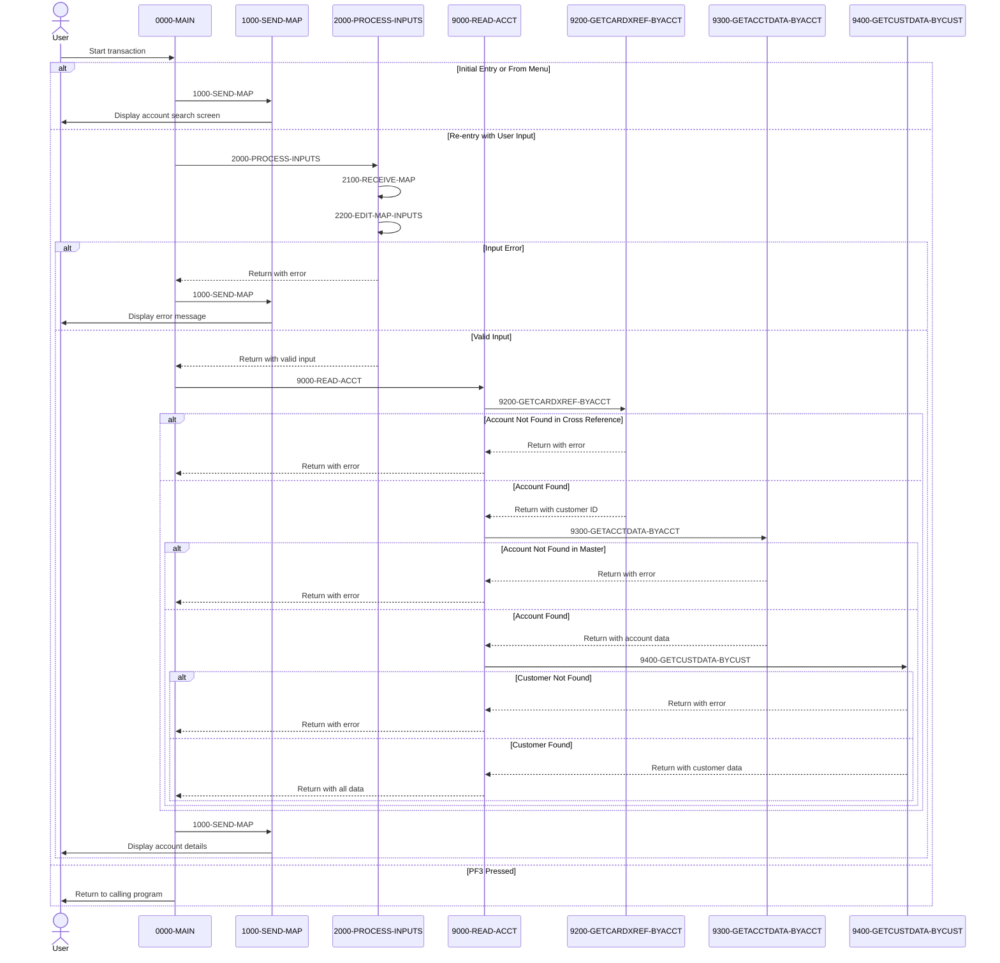

# COACTVWC

## Overview
This program, COACTVWC, is a CICS business logic component that handles account view requests in the CardDemo application. It allows users to search for and display detailed account information by entering an account number. The program retrieves account data from multiple files, including account master records, customer information, and card cross-reference data.

When executed, the program displays a screen where users can enter an account ID. Upon submission, it validates the input, retrieves the corresponding account information from the database files, and displays comprehensive account details including balance, credit limits, customer information, and address data. The program performs thorough error handling for scenarios such as invalid account numbers, missing records, or file access errors.

The application follows a structured flow with clear separation between screen handling, input validation, and data retrieval functions. It integrates with other components of the CardDemo system through a common communication area and provides navigation capabilities to related functions through PF keys.

## Metadata
**Program ID**: `COACTVWC`

## Sequence Diagram


## Referenced Copybooks
- [`CSDAT01Y`](copybooks/CSDAT01Y.md)
- `DFHAID`
- [`CVCUS01Y`](copybooks/CVCUS01Y.md)
- [`CVACT01Y`](copybooks/CVACT01Y.md)
- [`CSUSR01Y`](copybooks/CSUSR01Y.md)
- [`COCOM01Y`](copybooks/COCOM01Y.md)
- [`CVCRD01Y`](copybooks/CVCRD01Y.md)
- [`CSSTRPFY`](copybooks/CSSTRPFY.md)
- `DFHBMSCA`
- [`CVACT03Y`](copybooks/CVACT03Y.md)
- [`CVACT02Y`](copybooks/CVACT02Y.md)
- [`COTTL01Y`](copybooks/COTTL01Y.md)
- [`CSMSG02Y`](copybooks/CSMSG02Y.md)
- [`CSMSG01Y`](copybooks/CSMSG01Y.md)
- `COACTVW`

## Environment Division

### INPUT-OUTPUT SECTION
This section would typically contain the file declarations and I/O configurations for the COACTVWC program, but appears to be empty in the provided snippet. In a complete program, this section would define the files used for retrieving account information, customer data, and card cross-references that the program needs to display account details. The absence of this section suggests that file access may be handled through CICS commands rather than traditional COBOL file handling.
<details><summary>Code</summary>
```cobol

```
</details>


## Data Division

### WORKING-STORAGE SECTION
This Working Storage Section defines the data structures used in the COACTVWC program for account view functionality in the CardDemo application. It contains several key components:

1. CICS processing variables for handling response codes and transaction IDs
2. Input validation flags for tracking the status of user inputs, particularly for account and customer filtering
3. File handling structures including record identifiers for card cross-reference data and flags to track successful record retrieval from account and customer master files
4. Comprehensive error handling structures for file operations with detailed message formatting
5. Information and status message fields with predefined values for various user interactions and error conditions
6. Program constants including transaction IDs, program names, mapsets, and file names for navigation between different components of the CardDemo system
7. Character conversion tables for case manipulation

The section incorporates multiple copybooks for common structures including card data (CVCRD01Y), communication area (COCOM01Y), screen titles (COTTL01Y), BMS screen definition (COACTVW), date handling (CSDAT01Y), messaging (CSMSG01Y, CSMSG02Y), user data (CSUSR01Y), and various record layouts for accounts (CVACT01Y), customers (CVACT02Y, CVCUS01Y), and card cross-references (CVACT03Y).

This comprehensive data structure supports the program's main functions of account lookup, data validation, and information display while facilitating integration with other CardDemo components.
<details><summary>Code</summary>
```cobol
01  WS-MISC-STORAGE.                                                     
      ******************************************************************        
      * General CICS related                                                    
      ******************************************************************        
         05 WS-CICS-PROCESSNG-VARS.                                             
            07 WS-RESP-CD                          PIC S9(09) COMP              
                                                   VALUE ZEROS.                 
            07 WS-REAS-CD                          PIC S9(09) COMP              
                                                   VALUE ZEROS.                 
            07 WS-TRANID                           PIC X(4)                     
                                                   VALUE SPACES.                
      ******************************************************************        
      *      Input edits                                                        
      ******************************************************************        
                                                                                
         05  WS-INPUT-FLAG                         PIC X(1).                    
           88  INPUT-OK                            VALUE '0'.                   
           88  INPUT-ERROR                         VALUE '1'.                   
           88  INPUT-PENDING                       VALUE LOW-VALUES.            
         05  WS-PFK-FLAG                           PIC X(1).                    
           88  PFK-VALID                           VALUE '0'.                   
           88  PFK-INVALID                         VALUE '1'.                   
           88  INPUT-PENDING                       VALUE LOW-VALUES.            
         05  WS-EDIT-ACCT-FLAG                     PIC X(1).                    
           88  FLG-ACCTFILTER-NOT-OK               VALUE '0'.                   
           88  FLG-ACCTFILTER-ISVALID              VALUE '1'.                   
           88  FLG-ACCTFILTER-BLANK                VALUE ' '.                   
         05  WS-EDIT-CUST-FLAG                     PIC X(1).                    
           88  FLG-CUSTFILTER-NOT-OK               VALUE '0'.                   
           88  FLG-CUSTFILTER-ISVALID              VALUE '1'.                   
           88  FLG-CUSTFILTER-BLANK                VALUE ' '.                   
      ******************************************************************        
      * Output edits                                                            
      ******************************************************************        
      *  05  EDIT-FIELD-9-2                PIC +ZZZ,ZZZ,ZZZ.99.                 
      ******************************************************************        
      *      File and data Handling                                             
      ******************************************************************        
         05  WS-XREF-RID.                                                       
           10  WS-CARD-RID-CARDNUM                 PIC X(16).                   
           10  WS-CARD-RID-CUST-ID                 PIC 9(09).                   
           10  WS-CARD-RID-CUST-ID-X REDEFINES                                  
                  WS-CARD-RID-CUST-ID              PIC X(09).                   
           10  WS-CARD-RID-ACCT-ID                 PIC 9(11).                   
           10  WS-CARD-RID-ACCT-ID-X REDEFINES                                  
                  WS-CARD-RID-ACCT-ID              PIC X(11).                   
         05  WS-FILE-READ-FLAGS. 
           10 WS-ACCOUNT-MASTER-READ-FLAG          PIC X(1).
              88 FOUND-ACCT-IN-MASTER              VALUE '1'.
           10 WS-CUST-MASTER-READ-FLAG             PIC X(1).
              88 FOUND-CUST-IN-MASTER              VALUE '1'.                   
         05  WS-FILE-ERROR-MESSAGE.                                             
           10  FILLER                              PIC X(12)                    
                                                   VALUE 'File Error: '.        
           10  ERROR-OPNAME                        PIC X(8)                     
                                                   VALUE SPACES.                
           10  FILLER                              PIC X(4)                     
                                                   VALUE ' on '.                
           10  ERROR-FILE                          PIC X(9)                     
                                                   VALUE SPACES.                
           10  FILLER                              PIC X(15)                    
                                                   VALUE                        
                                                   ' returned RESP '.           
           10  ERROR-RESP                          PIC X(10)                    
                                                   VALUE SPACES.                
           10  FILLER                              PIC X(7)                     
                                                   VALUE ',RESP2 '.             
           10  ERROR-RESP2                         PIC X(10)                    
                                                   VALUE SPACES.                
          10  FILLER                               PIC X(5)                     
                                                   VALUE SPACES.                
      ******************************************************************        
      *      Output Message Construction                                        
      ******************************************************************        
         05  WS-LONG-MSG                           PIC X(500).                  
         05  WS-INFO-MSG                           PIC X(40).                   
           88  WS-NO-INFO-MESSAGE                 VALUES                        
                                                  SPACES LOW-VALUES.            
           88  WS-PROMPT-FOR-INPUT                 VALUE                        
               'Enter or update id of account to display'.
           88  WS-INFORM-OUTPUT                    VALUE
               'Displaying details of given Account'.                           
         05  WS-RETURN-MSG                         PIC X(75).                   
           88  WS-RETURN-MSG-OFF                   VALUE SPACES.                
           88  WS-EXIT-MESSAGE                     VALUE                        
               'PF03 pressed.Exiting              '.                            
           88  WS-PROMPT-FOR-ACCT                  VALUE                        
               'Account number not provided'.                                   
           88  NO-SEARCH-CRITERIA-RECEIVED         VALUE                        
               'No input received'.                                             
           88  SEARCHED-ACCT-ZEROES                VALUE                        
               'Account number must be a non zero 11 digit number'.             
           88  SEARCHED-ACCT-NOT-NUMERIC           VALUE                        
               'Account number must be a non zero 11 digit number'.             
           88  DID-NOT-FIND-ACCT-IN-CARDXREF       VALUE                        
               'Did not find this account in account card xref file'.           
           88  DID-NOT-FIND-ACCT-IN-ACCTDAT        VALUE                        
               'Did not find this account in account master file'.              
           88  DID-NOT-FIND-CUST-IN-CUSTDAT        VALUE                        
               'Did not find associated customer in master file'.               
           88  XREF-READ-ERROR                     VALUE                        
               'Error reading account card xref File'.                          
           88  CODING-TO-BE-DONE                   VALUE                        
               'Looks Good.... so far'.                                         
      *****************************************************************         
      *      Literals and Constants                                             
      ******************************************************************        
       01 WS-LITERALS.                                                          
          05 LIT-THISPGM                           PIC X(8)                     
                                                   VALUE 'COACTVWC'.            
          05 LIT-THISTRANID                        PIC X(4)                     
                                                   VALUE 'CAVW'.                
          05 LIT-THISMAPSET                        PIC X(8)                     
                                                   VALUE 'COACTVW '.            
          05 LIT-THISMAP                           PIC X(7)                     
                                                   VALUE 'CACTVWA'.             
          05 LIT-CCLISTPGM                         PIC X(8)                     
                                                   VALUE 'COCRDLIC'.            
          05 LIT-CCLISTTRANID                      PIC X(4)                     
                                                   VALUE 'CCLI'.                
          05 LIT-CCLISTMAPSET                      PIC X(7)                     
                                                   VALUE 'COCRDLI'.             
          05 LIT-CCLISTMAP                         PIC X(7)                     
                                                   VALUE 'CCRDSLA'.             
          05 LIT-CARDUPDATEPGM                           PIC X(8)               
                                                   VALUE 'COCRDUPC'.            
          05 LIT-CARDUDPATETRANID                        PIC X(4)               
                                                   VALUE 'CCUP'.                
          05 LIT-CARDUPDATEMAPSET                        PIC X(8)               
                                                   VALUE 'COCRDUP '.            
          05 LIT-CARDUPDATEMAP                           PIC X(7)               
                                                   VALUE 'CCRDUPA'.             
                                                                                
          05 LIT-MENUPGM                           PIC X(8)                     
                                                   VALUE 'COMEN01C'.            
          05 LIT-MENUTRANID                        PIC X(4)                     
                                                   VALUE 'CM00'.                
          05 LIT-MENUMAPSET                        PIC X(7)                     
                                                   VALUE 'COMEN01'.             
          05 LIT-MENUMAP                           PIC X(7)                     
                                                   VALUE 'COMEN1A'.             
          05  LIT-CARDDTLPGM                       PIC X(8)                     
                                                   VALUE 'COCRDSLC'.            
          05  LIT-CARDDTLTRANID                    PIC X(4)                     
                                                   VALUE 'CCDL'.                
          05  LIT-CARDDTLMAPSET                    PIC X(7)                     
                                                   VALUE 'COCRDSL'.             
          05  LIT-CARDDTLMAP                       PIC X(7)                     
                                                   VALUE 'CCRDSLA'.             
          05 LIT-ACCTFILENAME                      PIC X(8)                     
                                                   VALUE 'ACCTDAT '.            
          05 LIT-CARDFILENAME                      PIC X(8)                     
                                                   VALUE 'CARDDAT '.            
          05 LIT-CUSTFILENAME                      PIC X(8)                     
                                                   VALUE 'CUSTDAT '.            
          05 LIT-CARDFILENAME-ACCT-PATH            PIC X(8)                     
                                                   VALUE 'CARDAIX '.            
          05 LIT-CARDXREFNAME-ACCT-PATH            PIC X(8)                     
                                                   VALUE 'CXACAIX '.            
          05 LIT-ALL-ALPHA-FROM                    PIC X(52)                    
             VALUE                                                              
             'ABCDEFGHIJKLMNOPQRSTUVWXYZabcdefghijklmnopqrstuvwxyz'.            
          05 LIT-ALL-SPACES-TO                     PIC X(52)                    
                                                   VALUE SPACES.                
          05 LIT-UPPER                             PIC X(26)                    
                                 VALUE 'ABCDEFGHIJKLMNOPQRSTUVWXYZ'.            
          05 LIT-LOWER                             PIC X(26)                    
                                 VALUE 'abcdefghijklmnopqrstuvwxyz'.            
                                                                                
      ******************************************************************        
      *Other common working storage Variables                                   
      ******************************************************************        
       COPY CVCRD01Y.                                                           
                                                                                
      ******************************************************************        
      *Application Commmarea Copybook                                           
       COPY COCOM01Y.                                                           
                                                                                
       01 WS-THIS-PROGCOMMAREA.                                                 
          05 CA-CALL-CONTEXT.                                                   
             10 CA-FROM-PROGRAM                    PIC X(08).                   
             10 CA-FROM-TRANID                     PIC X(04).                   
                                                                                
       01  WS-COMMAREA                             PIC X(2000).                 
                                                                                
      *IBM SUPPLIED COPYBOOKS                                                   
       COPY DFHBMSCA.                                                           
       COPY DFHAID.                                                             
                                                                                
      *COMMON COPYBOOKS                                                         
      *Screen Titles                                                            
       COPY COTTL01Y.                                                           
                                                                                
      *BMS Copybook                                                             
       COPY COACTVW.                                                            
                                                                                
      *Current Date                                                             
       COPY CSDAT01Y.                                                           
                                                                                
      *Common Messages                                                          
       COPY CSMSG01Y.                                                           
                                                                                
      *Abend Variables                                                          
       COPY CSMSG02Y.                                                           
                                                                                
      *Signed on user data                                                      
       COPY CSUSR01Y.                                                           
                                                                                
      *ACCOUNT RECORD LAYOUT                                                    
       COPY CVACT01Y.                                                           
                                                                                
                                                                                
      *CUSTOMER RECORD LAYOUT                                                   
       COPY CVACT02Y.                                                           
                                                                                
      *CARD XREF LAYOUT                                                         
       COPY CVACT03Y.                                                           
                                                                                
      *CUSTOMER LAYOUT                                                          
       COPY CVCUS01Y.
```
</details>


### LINKAGE SECTION
This section defines the DFHCOMMAREA structure in the Linkage Section, which serves as the communication area for data exchange between CICS programs. It contains a single field defined as a variable-length array of 1-byte elements that can expand from 1 to 32,767 bytes depending on the actual length passed in EIBCALEN (CICS Executive Interface Block Communication Area Length). This flexible structure allows the program to receive and process variable-sized data from calling programs within the CardDemo application.
<details><summary>Code</summary>
```cobol
01  DFHCOMMAREA.                                                         
         05  FILLER                                PIC X(1)                     
             OCCURS 1 TO 32767 TIMES DEPENDING ON EIBCALEN.
```
</details>


## Procedure Division

### 0000-MAIN
This paragraph serves as the main control flow for the COACTVWC program, handling initialization, user input processing, and navigation. It begins by setting up error handling and initializing work areas, then processes the communication area to maintain context between program calls. The paragraph evaluates user actions based on PF keys pressed, with specific handling for PF3 (exit) and different program entry states. When a user enters the program initially, it displays the account search screen. Upon re-entry with user input, it validates the input, retrieves account information if valid, and redisplays the screen with results or error messages. The code includes thorough error handling throughout and maintains program context for proper navigation within the CardDemo application flow.
<details><summary>Code</summary>
```cobol
EXEC CICS HANDLE ABEND                                               
                     LABEL(ABEND-ROUTINE)                                       
           END-EXEC                                                             
                                                                                
           INITIALIZE CC-WORK-AREA                                              
                      WS-MISC-STORAGE                                           
                      WS-COMMAREA                                               
      *****************************************************************         
      * Store our context                                                       
      *****************************************************************         
           MOVE LIT-THISTRANID       TO WS-TRANID                               
      *****************************************************************         
      * Ensure error message is cleared                               *         
      *****************************************************************         
           SET WS-RETURN-MSG-OFF  TO TRUE                                       
      *****************************************************************         
      * Store passed data if  any                *                              
      *****************************************************************         
           IF EIBCALEN IS EQUAL TO 0                                            
               OR (CDEMO-FROM-PROGRAM = LIT-MENUPGM                             
               AND NOT CDEMO-PGM-REENTER)                                       
              INITIALIZE CARDDEMO-COMMAREA                                      
                         WS-THIS-PROGCOMMAREA                                   
           ELSE                                                                 
              MOVE DFHCOMMAREA (1:LENGTH OF CARDDEMO-COMMAREA)  TO              
                                CARDDEMO-COMMAREA                               
              MOVE DFHCOMMAREA(LENGTH OF CARDDEMO-COMMAREA + 1:                 
                               LENGTH OF WS-THIS-PROGCOMMAREA ) TO              
                                WS-THIS-PROGCOMMAREA                            
           END-IF                                                               
                                                                                
      *****************************************************************         
      * Remap PFkeys as needed.                                                 
      * Store the Mapped PF Key                                                 
      *****************************************************************         
           PERFORM YYYY-STORE-PFKEY                                             
              THRU YYYY-STORE-PFKEY-EXIT                                        
      *****************************************************************         
      * Check the AID to see if its valid at this point               *         
      * F3 - Exit                                                               
      * Enter show screen again                                                 
      *****************************************************************         
           SET PFK-INVALID TO TRUE                                              
           IF CCARD-AID-ENTER OR                                                
              CCARD-AID-PFK03                                                   
              SET PFK-VALID TO TRUE                                             
           END-IF                                                               
                                                                                
           IF PFK-INVALID                                                       
              SET CCARD-AID-ENTER TO TRUE                                       
           END-IF                                                               
                                                                                
      *****************************************************************         
      * Decide what to do based on inputs received                              
      *****************************************************************         
      *****************************************************************         
      *****************************************************************         
      * Decide what to do based on inputs received                              
      *****************************************************************         
           EVALUATE TRUE                                                        
              WHEN CCARD-AID-PFK03                                              
      ******************************************************************        
      *            XCTL TO CALLING PROGRAM OR MAIN MENU                         
      ******************************************************************        
                   IF CDEMO-FROM-TRANID    EQUAL LOW-VALUES                     
                   OR CDEMO-FROM-TRANID    EQUAL SPACES                         
                      MOVE LIT-MENUTRANID  TO CDEMO-TO-TRANID                   
                   ELSE                                                         
                      MOVE CDEMO-FROM-TRANID  TO CDEMO-TO-TRANID                
                   END-IF                                                       
                   IF CDEMO-FROM-PROGRAM   EQUAL LOW-VALUES                     
                   OR CDEMO-FROM-PROGRAM   EQUAL SPACES                         
                      MOVE LIT-MENUPGM     TO CDEMO-TO-PROGRAM                  
                   ELSE                                                         
                      MOVE CDEMO-FROM-PROGRAM TO CDEMO-TO-PROGRAM               
                   END-IF                                                       
                                                                                
                   MOVE LIT-THISTRANID     TO CDEMO-FROM-TRANID                 
                   MOVE LIT-THISPGM        TO CDEMO-FROM-PROGRAM                
                                                                                
                   SET  CDEMO-USRTYP-USER  TO TRUE                              
                   SET  CDEMO-PGM-ENTER    TO TRUE                              
                   MOVE LIT-THISMAPSET     TO CDEMO-LAST-MAPSET                 
                   MOVE LIT-THISMAP        TO CDEMO-LAST-MAP                    
      *                                                                         
                   EXEC CICS XCTL                                               
                             PROGRAM (CDEMO-TO-PROGRAM)                         
                             COMMAREA(CARDDEMO-COMMAREA)                        
                   END-EXEC                                                     
              WHEN CDEMO-PGM-ENTER                                              
      ******************************************************************        
      *            COMING FROM SOME OTHER CONTEXT                               
      *            SELECTION CRITERIA TO BE GATHERED                            
      ******************************************************************        
                   PERFORM 1000-SEND-MAP THRU                                   
                           1000-SEND-MAP-EXIT                                   
                   GO TO COMMON-RETURN                                          
              WHEN CDEMO-PGM-REENTER                                            
                   PERFORM 2000-PROCESS-INPUTS                                  
                      THRU 2000-PROCESS-INPUTS-EXIT                             
                   IF INPUT-ERROR                                               
                      PERFORM 1000-SEND-MAP                                     
                         THRU 1000-SEND-MAP-EXIT                                
                      GO TO COMMON-RETURN                                       
                   ELSE                                                         
                      PERFORM 9000-READ-ACCT                                    
                         THRU 9000-READ-ACCT-EXIT                               
                      PERFORM 1000-SEND-MAP                                     
                         THRU 1000-SEND-MAP-EXIT                                
                      GO TO COMMON-RETURN                                       
                   END-IF                                                       
             WHEN OTHER                                                         
                   MOVE LIT-THISPGM    TO ABEND-CULPRIT                         
                   MOVE '0001'         TO ABEND-CODE                            
                   MOVE SPACES         TO ABEND-REASON                          
                   MOVE 'UNEXPECTED DATA SCENARIO'                              
                                       TO WS-RETURN-MSG                         
                   PERFORM SEND-PLAIN-TEXT                                      
                      THRU SEND-PLAIN-TEXT-EXIT                                 
           END-EVALUATE                                                         
                                                                                
      * If we had an error setup error message that slipped through             
      * Display and return                                                      
           IF INPUT-ERROR                                                       
              MOVE WS-RETURN-MSG  TO CCARD-ERROR-MSG                            
              PERFORM 1000-SEND-MAP                                             
                 THRU 1000-SEND-MAP-EXIT                                        
              GO TO COMMON-RETURN                                               
           END-IF                                                               
           .
```
</details>


### COMMON-RETURN
This paragraph handles the return logic for the COACTVWC program. It first transfers any error or status message to the communication area's error message field. Then it prepares the return communication area by combining the standard CardDemo communication area with this program's specific data. Finally, it executes a CICS RETURN command that maintains the same transaction ID and passes back the combined communication area to the calling program. This standardized return mechanism ensures proper state preservation and error reporting when control is returned to the caller.
<details><summary>Code</summary>
```cobol
MOVE WS-RETURN-MSG     TO CCARD-ERROR-MSG                            
                                                                                
           MOVE  CARDDEMO-COMMAREA    TO WS-COMMAREA                            
           MOVE  WS-THIS-PROGCOMMAREA TO                                        
                  WS-COMMAREA(LENGTH OF CARDDEMO-COMMAREA + 1:                  
                               LENGTH OF WS-THIS-PROGCOMMAREA )                 
                                                                                
           EXEC CICS RETURN                                                     
                TRANSID (LIT-THISTRANID)                                        
                COMMAREA (WS-COMMAREA)                                          
                LENGTH(LENGTH OF WS-COMMAREA)                                   
           END-EXEC                                                             
           .
```
</details>


### 0000-MAIN-EXIT
This paragraph serves as the exit point for the program, marking the end of processing. It's a simple control structure that allows the program to return control to the calling module or terminate execution after completing its account view operations.
<details><summary>Code</summary>
```cobol
EXIT                                                                 
           .
```
</details>


### 0000-MAIN-EXIT
This paragraph serves as the exit point for the program, marking the end of processing. It's a simple control structure that allows the program to return control to the calling module or terminate execution after completing its account view operations.
<details><summary>Code</summary>
```cobol
EXIT                                                                 
           .
```
</details>


### 1000-SEND-MAP
This paragraph orchestrates the preparation and display of the account view screen. It follows a sequential process by first initializing the screen (1100-SCREEN-INIT), then setting up the screen variables with appropriate values (1200-SETUP-SCREEN-VARS), configuring the screen attributes for proper display formatting (1300-SETUP-SCREEN-ATTRS), and finally sending the completed screen to the user terminal (1400-SEND-SCREEN). This structured approach separates the different aspects of screen handling into distinct steps, making the code more maintainable and easier to troubleshoot.
<details><summary>Code</summary>
```cobol
PERFORM 1100-SCREEN-INIT                                             
              THRU 1100-SCREEN-INIT-EXIT                                        
           PERFORM 1200-SETUP-SCREEN-VARS                                       
              THRU 1200-SETUP-SCREEN-VARS-EXIT                                  
           PERFORM 1300-SETUP-SCREEN-ATTRS                                      
              THRU 1300-SETUP-SCREEN-ATTRS-EXIT                                 
           PERFORM 1400-SEND-SCREEN                                             
              THRU 1400-SEND-SCREEN-EXIT                                        
           .
```
</details>


### 1000-SEND-MAP-EXIT
This paragraph serves as a simple exit point for the 1000-SEND-MAP routine in the COACTVWC program. It marks the end of the routine that handles displaying the account view screen to the user, providing a clean control flow structure within the program.
<details><summary>Code</summary>
```cobol
EXIT                                                                 
           .
```
</details>


### 1100-SCREEN-INIT
This paragraph initializes the account view screen by clearing the output area and populating standard header information. It retrieves the current system date and time using the FUNCTION CURRENT-DATE, formats these values into display format (MM/DD/YY and HH:MM:SS), and places them on the screen. The paragraph also sets up common screen elements including title information and program identification details. This initialization routine prepares the screen before any account-specific data is retrieved or displayed.
<details><summary>Code</summary>
```cobol
MOVE LOW-VALUES             TO CACTVWAO                              
                                                                                
           MOVE FUNCTION CURRENT-DATE  TO WS-CURDATE-DATA                       
                                                                                
           MOVE CCDA-TITLE01           TO TITLE01O OF CACTVWAO                  
           MOVE CCDA-TITLE02           TO TITLE02O OF CACTVWAO                  
           MOVE LIT-THISTRANID         TO TRNNAMEO OF CACTVWAO                  
           MOVE LIT-THISPGM            TO PGMNAMEO OF CACTVWAO                  
                                                                                
           MOVE FUNCTION CURRENT-DATE  TO WS-CURDATE-DATA                       
                                                                                
           MOVE WS-CURDATE-MONTH       TO WS-CURDATE-MM                         
           MOVE WS-CURDATE-DAY         TO WS-CURDATE-DD                         
           MOVE WS-CURDATE-YEAR(3:2)   TO WS-CURDATE-YY                         
                                                                                
           MOVE WS-CURDATE-MM-DD-YY    TO CURDATEO OF CACTVWAO                  
                                                                                
           MOVE WS-CURTIME-HOURS       TO WS-CURTIME-HH                         
           MOVE WS-CURTIME-MINUTE      TO WS-CURTIME-MM                         
           MOVE WS-CURTIME-SECOND      TO WS-CURTIME-SS                         
                                                                                
           MOVE WS-CURTIME-HH-MM-SS    TO CURTIMEO OF CACTVWAO                  
                                                                                
           .
```
</details>


### 1100-SCREEN-INIT-EXIT
This paragraph serves as an exit point for the screen initialization routine in the COACTVWC program. It marks the end of the screen initialization process, allowing the program to return control to the calling section after the account view screen has been properly set up for display to the user.
<details><summary>Code</summary>
```cobol
EXIT                                                                 
           .
```
</details>


### 1200-SETUP-SCREEN-VARS
This paragraph populates the account view screen with data based on the program's state. It first checks if this is an initial call (EIBCALEN = 0) or a subsequent interaction. For subsequent interactions, it handles the account ID field display based on whether a filter was provided. When account or customer records have been found, it populates numerous screen fields with account information (status, balance, credit limits, dates) and customer details (name, address, contact information, identification numbers). The paragraph formats the Social Security Number with hyphens for display purposes. It also manages informational and error messages to be displayed on the screen. This logic serves as the data preparation step before rendering the account view interface to the user.
<details><summary>Code</summary>
```cobol
*    INITIALIZE SEARCH CRITERIA                                           
           IF EIBCALEN = 0                                                      
              SET  WS-PROMPT-FOR-INPUT TO TRUE                                  
           ELSE
              IF FLG-ACCTFILTER-BLANK  
                 MOVE LOW-VALUES   TO ACCTSIDO OF CACTVWAO                      
              ELSE                                                              
                 MOVE CC-ACCT-ID   TO ACCTSIDO OF CACTVWAO                      
              END-IF                                                            
                                                                                
              IF FOUND-ACCT-IN-MASTER                                           
              OR FOUND-CUST-IN-MASTER                                           
                 MOVE ACCT-ACTIVE-STATUS  TO ACSTTUSO OF CACTVWAO               
                                                                                
                 MOVE ACCT-CURR-BAL       TO ACURBALO OF CACTVWAO               
                                                                                
                 MOVE ACCT-CREDIT-LIMIT   TO ACRDLIMO OF CACTVWAO               
                                                                                
                 MOVE ACCT-CASH-CREDIT-LIMIT
                                          TO ACSHLIMO OF CACTVWAO               
                                                                                
                 MOVE ACCT-CURR-CYC-CREDIT          
                                          TO ACRCYCRO OF CACTVWAO               
                                                                                
                 MOVE ACCT-CURR-CYC-DEBIT TO ACRCYDBO OF CACTVWAO               
                                                                                
                 MOVE ACCT-OPEN-DATE      TO ADTOPENO OF CACTVWAO               
                 MOVE ACCT-EXPIRAION-DATE TO AEXPDTO  OF CACTVWAO               
                 MOVE ACCT-REISSUE-DATE   TO AREISDTO OF CACTVWAO               
                 MOVE ACCT-GROUP-ID       TO AADDGRPO OF CACTVWAO               
              END-IF                                                            
                                                                                
              IF FOUND-CUST-IN-MASTER                                           
                MOVE CUST-ID              TO ACSTNUMO OF CACTVWAO               
      *         MOVE CUST-SSN             TO ACSTSSNO OF CACTVWAO       
                STRING 
                    CUST-SSN(1:3)
                    '-'                 
                    CUST-SSN(4:2)
                    '-'
                    CUST-SSN(6:4)
                    DELIMITED BY SIZE
                    INTO ACSTSSNO OF CACTVWAO
                END-STRING                                                      
                MOVE CUST-FICO-CREDIT-SCORE                                     
                                          TO ACSTFCOO OF CACTVWAO               
                MOVE CUST-DOB-YYYY-MM-DD  TO ACSTDOBO OF CACTVWAO               
                MOVE CUST-FIRST-NAME      TO ACSFNAMO OF CACTVWAO               
                MOVE CUST-MIDDLE-NAME     TO ACSMNAMO OF CACTVWAO               
                MOVE CUST-LAST-NAME       TO ACSLNAMO OF CACTVWAO               
                MOVE CUST-ADDR-LINE-1     TO ACSADL1O OF CACTVWAO               
                MOVE CUST-ADDR-LINE-2     TO ACSADL2O OF CACTVWAO               
                MOVE CUST-ADDR-LINE-3     TO ACSCITYO OF CACTVWAO               
                MOVE CUST-ADDR-STATE-CD   TO ACSSTTEO OF CACTVWAO               
                MOVE CUST-ADDR-ZIP        TO ACSZIPCO OF CACTVWAO               
                MOVE CUST-ADDR-COUNTRY-CD TO ACSCTRYO OF CACTVWAO               
                MOVE CUST-PHONE-NUM-1     TO ACSPHN1O OF CACTVWAO               
                MOVE CUST-PHONE-NUM-2     TO ACSPHN2O OF CACTVWAO               
                MOVE CUST-GOVT-ISSUED-ID  TO ACSGOVTO OF CACTVWAO               
                MOVE CUST-EFT-ACCOUNT-ID  TO ACSEFTCO OF CACTVWAO               
                MOVE CUST-PRI-CARD-HOLDER-IND                                   
                                          TO ACSPFLGO OF CACTVWAO               
              END-IF                                                            
                                                                                
            END-IF                                                              
                                                                                
      *    SETUP MESSAGE                                                        
           IF WS-NO-INFO-MESSAGE                                                
             SET WS-PROMPT-FOR-INPUT TO TRUE                                    
           END-IF                                                               
                                                                                
           MOVE WS-RETURN-MSG          TO ERRMSGO OF CACTVWAO                   
                                                                                
           MOVE WS-INFO-MSG            TO INFOMSGO OF CACTVWAO                  
           .
```
</details>


### 1200-SETUP-SCREEN-VARS-EXIT
This paragraph serves as an exit point for the 1200-SETUP-SCREEN-VARS routine. It provides a clean termination point for the screen variable setup process, allowing the program to return control to the calling routine after completing the initialization of screen display variables.
<details><summary>Code</summary>
```cobol
EXIT                                                                 
           .
```
</details>


### 1300-SETUP-SCREEN-ATTRS
This paragraph configures the screen attributes for the account view interface. It sets up field protection, cursor positioning, and color coding based on the current state of the application. The paragraph first protects the account ID field using DFHBMFSE attribute, then positions the cursor at the account ID field regardless of the current condition. It applies color attributes to the account ID field, using red to highlight validation errors (when the account filter is invalid) or when a blank account ID is submitted on a re-entry. The paragraph also handles the display attributes for information messages, making them dark if no message is present or neutral color if a message needs to be displayed. These visual cues help guide the user through the account search process by clearly indicating input errors and required fields.
<details><summary>Code</summary>
```cobol
*    PROTECT OR UNPROTECT BASED ON CONTEXT                                
           MOVE DFHBMFSE               TO ACCTSIDA OF CACTVWAI                  
                                                                                
      *    POSITION CURSOR                                                      
           EVALUATE TRUE                                                        
              WHEN FLG-ACCTFILTER-NOT-OK                                        
              WHEN FLG-ACCTFILTER-BLANK                                         
                   MOVE -1             TO ACCTSIDL OF CACTVWAI                  
              WHEN OTHER                                                        
                   MOVE -1             TO ACCTSIDL OF CACTVWAI                  
           END-EVALUATE                                                         
                                                                                
      *    SETUP COLOR                                                          
           MOVE DFHDFCOL               TO ACCTSIDC OF CACTVWAO                  
                                                                                
           IF FLG-ACCTFILTER-NOT-OK                                             
              MOVE DFHRED              TO ACCTSIDC OF CACTVWAO                  
           END-IF                                                               
                                                                                
           IF  FLG-ACCTFILTER-BLANK                                             
           AND CDEMO-PGM-REENTER                                                
               MOVE '*'                TO ACCTSIDO OF CACTVWAO                  
               MOVE DFHRED             TO ACCTSIDC OF CACTVWAO                  
           END-IF                                                               
                                                                                
           IF  WS-NO-INFO-MESSAGE                                               
               MOVE DFHBMDAR           TO INFOMSGC OF CACTVWAO                  
           ELSE                                                                 
               MOVE DFHNEUTR           TO INFOMSGC OF CACTVWAO                  
           END-IF                                                               
           .
```
</details>


### 1300-SETUP-SCREEN-ATTRS-EXIT
This paragraph serves as an exit point for the screen attributes setup routine in the COACTVWC program. It marks the end of the 1300-SETUP-SCREEN-ATTRS section, allowing the program to return control to the calling routine after screen attribute initialization has been completed.
<details><summary>Code</summary>
```cobol
EXIT                                                                 
           .
```
</details>


### 1400-SEND-SCREEN
This paragraph handles the screen display functionality for the account view component. It sets up the next map and mapset values in the common communication area, indicating that the program should be re-entered after the screen is displayed. The paragraph then executes a CICS SEND MAP command to display the account view screen (CACTVWAO) to the user, positioning the cursor appropriately. The ERASE option clears the screen before displaying the new content, while FREEKB unlocks the keyboard for user input. The response code from this operation is captured in WS-RESP-CD for error handling purposes.
<details><summary>Code</summary>
```cobol
MOVE LIT-THISMAPSET         TO CCARD-NEXT-MAPSET                     
           MOVE LIT-THISMAP            TO CCARD-NEXT-MAP                        
           SET  CDEMO-PGM-REENTER TO TRUE                                       
                                                                                
           EXEC CICS SEND MAP(CCARD-NEXT-MAP)                                   
                          MAPSET(CCARD-NEXT-MAPSET)                             
                          FROM(CACTVWAO)                                        
                          CURSOR                                                
                          ERASE                                                 
                          FREEKB                                                
                          RESP(WS-RESP-CD)                                      
           END-EXEC                                                             
           .
```
</details>


### 1400-SEND-SCREEN-EXIT
This paragraph serves as an exit point for the screen sending routine in the COACTVWC program. It marks the end of the 1400-SEND-SCREEN section, allowing the program to return control to the calling section after the account view screen has been sent to the user.
<details><summary>Code</summary>
```cobol
EXIT                                                                 
           .
```
</details>


### 2000-PROCESS-INPUTS
This paragraph handles the initial processing of user inputs for the account view function. It first receives the map data from the user interface, then validates the input data through the edit map inputs routine. After processing, it sets up the error message (if any) and prepares for the next program flow by setting the program, mapset, and map names in the communication area. This establishes the foundation for subsequent processing by ensuring valid input before attempting to retrieve account information.
<details><summary>Code</summary>
```cobol
PERFORM 2100-RECEIVE-MAP                                             
              THRU 2100-RECEIVE-MAP-EXIT                                        
           PERFORM 2200-EDIT-MAP-INPUTS                                         
              THRU 2200-EDIT-MAP-INPUTS-EXIT                                    
           MOVE WS-RETURN-MSG  TO CCARD-ERROR-MSG                               
           MOVE LIT-THISPGM    TO CCARD-NEXT-PROG                               
           MOVE LIT-THISMAPSET TO CCARD-NEXT-MAPSET                             
           MOVE LIT-THISMAP    TO CCARD-NEXT-MAP                                
           .
```
</details>


### 2000-PROCESS-INPUTS-EXIT
This paragraph serves as an exit point for the 2000-PROCESS-INPUTS section of the COACTVWC program. It provides a clean termination point for the input processing logic, allowing the program flow to return to the calling section after input validation and processing has been completed.
<details><summary>Code</summary>
```cobol
EXIT                                                                 
           .
```
</details>


### 2100-RECEIVE-MAP
This paragraph receives user input from the screen map named in LIT-THISMAP within the mapset LIT-THISMAPSET. It stores the received data into the CACTVWAI structure, which likely contains the account search criteria entered by the user. The paragraph captures both response and reason codes in WS-RESP-CD and WS-REAS-CD variables, which will be used for error handling if the receive operation encounters any issues.
<details><summary>Code</summary>
```cobol
EXEC CICS RECEIVE MAP(LIT-THISMAP)                                   
                     MAPSET(LIT-THISMAPSET)                                     
                     INTO(CACTVWAI)                                             
                     RESP(WS-RESP-CD)                                           
                     RESP2(WS-REAS-CD)                                          
           END-EXEC                                                             
           .
```
</details>


### 2100-RECEIVE-MAP-EXIT
This paragraph serves as an exit point for the 2100-RECEIVE-MAP routine in the COACTVWC program. It provides a clean termination point for the routine that handles receiving user input from the account view screen. The paragraph contains only the EXIT statement, marking the end of the logical processing block without performing any additional operations.
<details><summary>Code</summary>
```cobol
EXIT                                                                 
           .
```
</details>


### 2200-EDIT-MAP-INPUTS
This paragraph handles the validation and processing of user input from the account search screen. It first sets flags to indicate valid input status, then processes the account ID field by either converting asterisks or spaces to low-values (which likely indicates a wildcard search) or capturing the specific account ID entered by the user. The code then performs detailed validation of the account field through the 2210-EDIT-ACCOUNT paragraph and checks if no search criteria were provided (blank account filter). The processing results are tracked through status flags that will determine subsequent program flow and error handling.
<details><summary>Code</summary>
```cobol
SET INPUT-OK                  TO TRUE                                
           SET FLG-ACCTFILTER-ISVALID    TO TRUE                                
                                                                                
      *    REPLACE * WITH LOW-VALUES                                            
           IF  ACCTSIDI OF CACTVWAI = '*'                                       
           OR  ACCTSIDI OF CACTVWAI = SPACES                                    
               MOVE LOW-VALUES           TO  CC-ACCT-ID                         
           ELSE                                                                 
               MOVE ACCTSIDI OF CACTVWAI TO  CC-ACCT-ID                         
           END-IF                                                               
                                                                                
      *    INDIVIDUAL FIELD EDITS                                               
           PERFORM 2210-EDIT-ACCOUNT                                            
              THRU 2210-EDIT-ACCOUNT-EXIT                                       
                                                                                
      *    CROSS FIELD EDITS                                                    
           IF  FLG-ACCTFILTER-BLANK                                             
               SET NO-SEARCH-CRITERIA-RECEIVED TO TRUE                          
           END-IF                                                               
           .
```
</details>


### 2200-EDIT-MAP-INPUTS-EXIT
This paragraph serves as an exit point for the 2200-EDIT-MAP-INPUTS routine. It marks the end of the input validation logic for the account view screen, allowing the program flow to return to the calling section after input processing is complete.
<details><summary>Code</summary>
```cobol
EXIT                                                                 
           .
```
</details>


### 2210-EDIT-ACCOUNT
This paragraph validates the account ID input provided by the user. It first checks if the account ID is empty (spaces or low-values) and sets appropriate error flags if so, prompting the user to enter an account number. Next, it verifies that the account ID is numeric, non-zero, and properly formatted. If validation fails, it sets error flags and provides a specific error message indicating that the account filter must be a non-zero 11-digit number. When validation succeeds, it moves the account ID to the demo account ID field and sets a flag indicating the account filter is valid. The paragraph includes conditional message handling based on the return message settings.
<details><summary>Code</summary>
```cobol
SET FLG-ACCTFILTER-NOT-OK TO TRUE                                    
                                                                                
      *    Not supplied                                                         
           IF CC-ACCT-ID   EQUAL LOW-VALUES                                     
           OR CC-ACCT-ID   EQUAL SPACES                                         
              SET INPUT-ERROR           TO TRUE                                 
              SET FLG-ACCTFILTER-BLANK  TO TRUE                                 
              IF WS-RETURN-MSG-OFF                                              
                 SET WS-PROMPT-FOR-ACCT TO TRUE                                 
              END-IF                                                            
              MOVE ZEROES       TO CDEMO-ACCT-ID                                
              GO TO  2210-EDIT-ACCOUNT-EXIT                                     
           END-IF                                                               
      *                                                                         
      *    Not numeric                                                          
      *    Not 11 characters                                                    
           IF CC-ACCT-ID  IS NOT NUMERIC 
           OR CC-ACCT-ID  EQUAL ZEROES                                          
              SET INPUT-ERROR TO TRUE                                           
              SET FLG-ACCTFILTER-NOT-OK TO TRUE                                 
              IF WS-RETURN-MSG-OFF                                              
                MOVE                                                            
              'Account Filter must  be a non-zero 11 digit number'      00
                              TO WS-RETURN-MSG                                  
              END-IF                                                            
              MOVE ZERO       TO CDEMO-ACCT-ID                                  
              GO TO 2210-EDIT-ACCOUNT-EXIT                                      
           ELSE                                                                 
              MOVE CC-ACCT-ID TO CDEMO-ACCT-ID                                  
              SET FLG-ACCTFILTER-ISVALID TO TRUE                                
           END-IF                                                               
           .
```
</details>


### 2210-EDIT-ACCOUNT-EXIT
This paragraph serves as an exit point for the account editing process in the COACTVWC program. It provides a clean termination point for the 2210-EDIT-ACCOUNT routine, allowing the program flow to return to the calling section after account validation and processing is complete.
<details><summary>Code</summary>
```cobol
EXIT                                                                 
           .
```
</details>


### 9000-READ-ACCT
This paragraph retrieves and validates account information across multiple data sources. It first sets a flag indicating no information message is needed, then uses the provided account ID to search for related records. The process follows a sequential validation flow: first checking the card cross-reference file, then retrieving account data, and finally fetching customer information using the customer ID obtained from the account record. At each step, the paragraph verifies successful record retrieval and exits if any lookup fails. This ensures that complete and valid account information is available before proceeding with further processing in the main program flow.
<details><summary>Code</summary>
```cobol
SET  WS-NO-INFO-MESSAGE  TO TRUE
           
           MOVE CDEMO-ACCT-ID TO WS-CARD-RID-ACCT-ID                            
                                                                                
           PERFORM 9200-GETCARDXREF-BYACCT                                      
              THRU 9200-GETCARDXREF-BYACCT-EXIT                                 
                                                                                
      *    IF DID-NOT-FIND-ACCT-IN-CARDXREF                                     
           IF FLG-ACCTFILTER-NOT-OK                                             
              GO TO 9000-READ-ACCT-EXIT                                         
           END-IF                                                               
                                                                                
           PERFORM 9300-GETACCTDATA-BYACCT                                      
              THRU 9300-GETACCTDATA-BYACCT-EXIT                                 
                                                                                
           IF DID-NOT-FIND-ACCT-IN-ACCTDAT                                      
              GO TO 9000-READ-ACCT-EXIT                                         
           END-IF                                                               
                                                                                
           MOVE CDEMO-CUST-ID TO WS-CARD-RID-CUST-ID                            
                                                                                
           PERFORM 9400-GETCUSTDATA-BYCUST                                      
              THRU 9400-GETCUSTDATA-BYCUST-EXIT                                 
                                                                                
           IF DID-NOT-FIND-CUST-IN-CUSTDAT                                      
              GO TO 9000-READ-ACCT-EXIT                                         
           END-IF                                                               
                                                                                
                                                                                
           .
```
</details>


### 9000-READ-ACCT-EXIT
This paragraph serves as an exit point for the account reading process in the COACTVWC program. It provides a structured way to terminate the account reading routine and return control to the calling section. This simple exit point helps maintain the program's modular structure and control flow when processing account information.
<details><summary>Code</summary>
```cobol
EXIT                                                                 
           .
```
</details>


### 9200-GETCARDXREF-BYACCT
This paragraph retrieves card cross-reference information by account ID from the card cross-reference file using an alternate index. It performs a CICS READ operation on the CARDXREF file using the account ID as the key. Upon successful retrieval, it extracts the customer ID and card number from the record and stores them in the communication area fields. The paragraph includes comprehensive error handling for different scenarios: when the record is found (normal case), when no matching record exists (generating a specific "Account not found" error message), and for other unexpected errors (generating a generic file error message). The error handling logic sets appropriate flags to indicate the failure condition and constructs detailed error messages that include the response codes for troubleshooting purposes.
<details><summary>Code</summary>
```cobol
*    Read the Card file. Access via alternate index ACCTID                
      *                                                                         
           EXEC CICS READ                                                       
                DATASET   (LIT-CARDXREFNAME-ACCT-PATH)                          
                RIDFLD    (WS-CARD-RID-ACCT-ID-X)                               
                KEYLENGTH (LENGTH OF WS-CARD-RID-ACCT-ID-X)                     
                INTO      (CARD-XREF-RECORD)                                    
                LENGTH    (LENGTH OF CARD-XREF-RECORD)                          
                RESP      (WS-RESP-CD)                                          
                RESP2     (WS-REAS-CD)                                          
           END-EXEC                                                             
                                                                                
           EVALUATE WS-RESP-CD                                                  
               WHEN DFHRESP(NORMAL)                                             
                  MOVE XREF-CUST-ID               TO CDEMO-CUST-ID              
                  MOVE XREF-CARD-NUM              TO CDEMO-CARD-NUM             
               WHEN DFHRESP(NOTFND)                                             
                  SET INPUT-ERROR                 TO TRUE                       
                  SET FLG-ACCTFILTER-NOT-OK       TO TRUE                       
                  IF WS-RETURN-MSG-OFF                                          
                    MOVE WS-RESP-CD               TO ERROR-RESP                 
                    MOVE WS-REAS-CD               TO ERROR-RESP2                
                    STRING                                                      
                    'Account:'                                                  
                     WS-CARD-RID-ACCT-ID-X                                      
                    ' not found in'                                             
                    ' Cross ref file.  Resp:'                                   
                    ERROR-RESP                                                  
                    ' Reas:'                                                    
                    ERROR-RESP2                                                 
                    DELIMITED BY SIZE                                           
                    INTO WS-RETURN-MSG                                          
                    END-STRING                                                  
                  END-IF                                                        
               WHEN OTHER                                                       
                  SET INPUT-ERROR                 TO TRUE                       
                  SET FLG-ACCTFILTER-NOT-OK                TO TRUE              
                  MOVE 'READ'                     TO ERROR-OPNAME               
                  MOVE LIT-CARDXREFNAME-ACCT-PATH TO ERROR-FILE                 
                  MOVE WS-RESP-CD                 TO ERROR-RESP                 
                  MOVE WS-REAS-CD                 TO ERROR-RESP2                
                  MOVE WS-FILE-ERROR-MESSAGE      TO WS-RETURN-MSG              
      *                                              WS-LONG-MSG                
      *          PERFORM SEND-LONG-TEXT                                         
           END-EVALUATE                                                         
           .
```
</details>


### 9200-GETCARDXREF-BYACCT-EXIT
This paragraph serves as an exit point for the GETCARDXREF-BYACCT routine, marking the end of the process that retrieves card cross-reference data by account number. It provides a clean termination point for the routine, allowing control to return to the calling section after the card cross-reference data has been successfully retrieved or after handling any error conditions.
<details><summary>Code</summary>
```cobol
EXIT                                                                 
           .
```
</details>


### 9300-GETACCTDATA-BYACCT
This paragraph retrieves account data from the account master file using the provided account ID. It performs a CICS READ operation on the account file using the account ID as the key. The paragraph handles three possible outcomes: successful retrieval (setting the FOUND-ACCT-IN-MASTER flag), record not found (setting appropriate error flags and constructing a user-friendly error message indicating the account wasn't found), or other file access errors (setting error flags and generating a technical error message with response codes). The error handling includes detailed information about the nature of the failure, which helps with troubleshooting. This is a critical component of the account lookup functionality, as it performs the primary data retrieval that drives subsequent processing in the program.
<details><summary>Code</summary>
```cobol
EXEC CICS READ                                                       
                DATASET   (LIT-ACCTFILENAME)                                    
                RIDFLD    (WS-CARD-RID-ACCT-ID-X)                               
                KEYLENGTH (LENGTH OF WS-CARD-RID-ACCT-ID-X)                     
                INTO      (ACCOUNT-RECORD)                                      
                LENGTH    (LENGTH OF ACCOUNT-RECORD)                            
                RESP      (WS-RESP-CD)                                          
                RESP2     (WS-REAS-CD)                                          
           END-EXEC                                                             
                                                                                
           EVALUATE WS-RESP-CD                                                  
               WHEN DFHRESP(NORMAL)                                             
                  SET FOUND-ACCT-IN-MASTER        TO TRUE                       
               WHEN DFHRESP(NOTFND)                                             
                  SET INPUT-ERROR                 TO TRUE                       
                  SET FLG-ACCTFILTER-NOT-OK       TO TRUE                       
      *           SET DID-NOT-FIND-ACCT-IN-ACCTDAT TO TRUE                      
                  IF WS-RETURN-MSG-OFF                                          
                    MOVE WS-RESP-CD               TO ERROR-RESP                 
                    MOVE WS-REAS-CD               TO ERROR-RESP2                
                    STRING                                                      
                    'Account:'                                                  
                     WS-CARD-RID-ACCT-ID-X                                      
                    ' not found in'                                             
                    ' Acct Master file.Resp:'                                   
                    ERROR-RESP                                                  
                    ' Reas:'                                                    
                    ERROR-RESP2                                                 
                    DELIMITED BY SIZE                                           
                    INTO WS-RETURN-MSG                                          
                    END-STRING                                                  
                  END-IF                                                        
      *                                                                         
               WHEN OTHER                                                       
                  SET INPUT-ERROR                 TO TRUE                       
                  SET FLG-ACCTFILTER-NOT-OK                TO TRUE              
                  MOVE 'READ'                     TO ERROR-OPNAME               
                  MOVE LIT-ACCTFILENAME           TO ERROR-FILE                 
                  MOVE WS-RESP-CD                 TO ERROR-RESP                 
                  MOVE WS-REAS-CD                 TO ERROR-RESP2                
                  MOVE WS-FILE-ERROR-MESSAGE      TO WS-RETURN-MSG              
      *                                              WS-LONG-MSG                
      *           PERFORM SEND-LONG-TEXT                                        
           END-EVALUATE                                                         
           .
```
</details>


### 9300-GETACCTDATA-BYACCT-EXIT
This paragraph serves as an exit point for the GETACCTDATA-BYACCT routine. It marks the end of the account data retrieval process when searching by account number, allowing the program to return control to the calling section after completing the account lookup operation.
<details><summary>Code</summary>
```cobol
EXIT                                                                 
           .
```
</details>


### 9400-GETCUSTDATA-BYCUST
This paragraph retrieves customer data from the customer master file using the customer ID as the key. It executes a CICS READ command against the customer file (LIT-CUSTFILENAME) using the customer ID stored in WS-CARD-RID-CUST-ID-X as the record key. The retrieved data is stored in the CUSTOMER-RECORD structure.

The paragraph includes comprehensive error handling through an EVALUATE statement that processes three possible outcomes:
1. When the read is successful (DFHRESP(NORMAL)), it sets the FOUND-CUST-IN-MASTER flag to TRUE.
2. When the customer record is not found (DFHRESP(NOTFND)), it sets error flags (INPUT-ERROR and FLG-CUSTFILTER-NOT-OK) and constructs a detailed error message indicating the customer ID was not found in the master file.
3. For any other response code, it sets error flags, captures the file operation details (READ operation on the customer file), and prepares a general file error message.

This functionality is a critical part of the account view process, as it retrieves the customer information needed to display complete account details.
<details><summary>Code</summary>
```cobol
EXEC CICS READ                                                       
                DATASET   (LIT-CUSTFILENAME)                                    
                RIDFLD    (WS-CARD-RID-CUST-ID-X)                               
                KEYLENGTH (LENGTH OF WS-CARD-RID-CUST-ID-X)                     
                INTO      (CUSTOMER-RECORD)                                     
                LENGTH    (LENGTH OF CUSTOMER-RECORD)                           
                RESP      (WS-RESP-CD)                                          
                RESP2     (WS-REAS-CD)                                          
           END-EXEC                                                             
                                                                                
           EVALUATE WS-RESP-CD                                                  
               WHEN DFHRESP(NORMAL)                                             
                  SET FOUND-CUST-IN-MASTER        TO TRUE                       
               WHEN DFHRESP(NOTFND)                                             
                  SET INPUT-ERROR                 TO TRUE                       
                  SET FLG-CUSTFILTER-NOT-OK       TO TRUE                       
      *           SET DID-NOT-FIND-CUST-IN-CUSTDAT TO TRUE                      
                  MOVE WS-RESP-CD               TO ERROR-RESP                   
                  MOVE WS-REAS-CD               TO ERROR-RESP2                  
                  IF WS-RETURN-MSG-OFF                                          
                    STRING                                                      
                    'CustId:'                                                   
                     WS-CARD-RID-CUST-ID-X                                      
                    ' not found'                                                
                    ' in customer master.Resp: '                                
                    ERROR-RESP                                                  
                    ' REAS:'                                                    
                    ERROR-RESP2                                                 
                    DELIMITED BY SIZE                                           
                    INTO WS-RETURN-MSG                                          
                    END-STRING                                                  
                  END-IF                                                        
               WHEN OTHER                                                       
                  SET INPUT-ERROR                 TO TRUE                       
                  SET FLG-CUSTFILTER-NOT-OK                TO TRUE              
                  MOVE 'READ'                     TO ERROR-OPNAME               
                  MOVE LIT-CUSTFILENAME           TO ERROR-FILE                 
                  MOVE WS-RESP-CD                 TO ERROR-RESP                 
                  MOVE WS-REAS-CD                 TO ERROR-RESP2                
                  MOVE WS-FILE-ERROR-MESSAGE      TO WS-RETURN-MSG              
      *                                              WS-LONG-MSG                
      *           PERFORM SEND-LONG-TEXT                                        
           END-EVALUATE                                                         
           .
```
</details>


### 9400-GETCUSTDATA-BYCUST-EXIT
This paragraph serves as an exit point for the GETCUSTDATA-BYCUST routine, which retrieves customer data based on customer identification. The comment warns that this is a plain text exit that should not be used in production environments, suggesting it may be a simplified or unsecured implementation intended only for development or testing purposes within the CardDemo application.
<details><summary>Code</summary>
```cobol
EXIT                                                                 
           .                                                                    
                                                                                
      *****************************************************************         
      * Plain text exit - Dont use in production                      *         
      *****************************************************************
```
</details>


### SEND-PLAIN-TEXT
This paragraph sends a plain text message to the user's terminal in the CardDemo account view component. It uses the CICS SEND TEXT command to display the content stored in WS-RETURN-MSG, specifying the length dynamically. The ERASE option clears the screen before displaying the message, while FREEKB unlocks the keyboard for user input. After sending the message, the paragraph executes a CICS RETURN command to end the current task and return control to CICS. This functionality is typically used for displaying error messages or informational text when standard screen formatting isn't required.
<details><summary>Code</summary>
```cobol
EXEC CICS SEND TEXT                                                  
                     FROM(WS-RETURN-MSG)                                        
                     LENGTH(LENGTH OF WS-RETURN-MSG)                            
                     ERASE                                                      
                     FREEKB                                                     
           END-EXEC                                                             
                                                                                
           EXEC CICS RETURN                                                     
           END-EXEC                                                             
           .
```
</details>


### SEND-PLAIN-TEXT-EXIT
This paragraph serves as an exit point for displaying long text messages, primarily intended for debugging purposes. It's specifically designed not to be used during normal program operation, but rather as a diagnostic tool for developers when troubleshooting issues in the account view functionality.
<details><summary>Code</summary>
```cobol
EXIT                                                                 
           .                                                                    
      *****************************************************************         
      * Display Long text and exit                                    *         
      * This is primarily for debugging and should not be used in     *         
      * regular course                                                *         
      *****************************************************************
```
</details>


### SEND-LONG-TEXT
This paragraph sends a long message to the user's terminal screen using CICS SEND TEXT command. It displays the contents of the WS-LONG-MSG field, clears the screen (ERASE), and unlocks the keyboard (FREEKB). After sending the message, it returns control to CICS, effectively ending the transaction. This is typically used for displaying error messages or informational text that requires the full screen.
<details><summary>Code</summary>
```cobol
EXEC CICS SEND TEXT                                                  
                     FROM(WS-LONG-MSG)                                          
                     LENGTH(LENGTH OF WS-LONG-MSG)                              
                     ERASE                                                      
                     FREEKB                                                     
           END-EXEC                                                             
                                                                                
           EXEC CICS RETURN                                                     
           END-EXEC                                                             
           .
```
</details>


### SEND-LONG-TEXT-EXIT
This paragraph serves as an exit point for the SEND-LONG-TEXT routine in the account view component. It includes a reference to the 'CSSTRPFY' copybook, which contains common code for storing and handling PF key information. This structure allows the program to maintain consistent PF key processing across different parts of the CardDemo application while providing a clean exit from the text display functionality.
<details><summary>Code</summary>
```cobol
EXIT                                                                 
           . 
      *****************************************************************         
      *Common code to store PFKey
      ******************************************************************
       COPY 'CSSTRPFY'
           .
```
</details>


### ABEND-ROUTINE
This paragraph handles abnormal termination (ABEND) processing in the COACTVWC program. When an error occurs that requires program termination, this routine ensures proper error messaging before ending execution. If no specific error message has been set (ABEND-MSG contains LOW-VALUES), it sets a default "UNEXPECTED ABEND OCCURRED" message. It identifies the current program as the source of the error by storing the program name in ABEND-CULPRIT. The routine then displays the error information to the user via a CICS SEND command, cancels any existing abend handlers to prevent recursive error handling, and finally terminates the program with abend code '9999'. This provides a controlled shutdown mechanism that communicates failure information to both users and system administrators.
<details><summary>Code</summary>
```cobol
IF ABEND-MSG EQUAL LOW-VALUES                                        
              MOVE 'UNEXPECTED ABEND OCCURRED.' TO ABEND-MSG                    
           END-IF                                                               
                                                                                
           MOVE LIT-THISPGM       TO ABEND-CULPRIT                              
                                                                                
           EXEC CICS SEND                                                       
                            FROM (ABEND-DATA)                                   
                            LENGTH(LENGTH OF ABEND-DATA)                        
                            NOHANDLE                                            
           END-EXEC                                                             
                                                                                
           EXEC CICS HANDLE ABEND                                               
                CANCEL                                                          
           END-EXEC                                                             
                                                                                
           EXEC CICS ABEND                                                      
                ABCODE('9999')                                                  
           END-EXEC                                                             
           .                                                                    
                                                                                
      *
      * Ver: CardDemo_v1.0-15-g27d6c6f-68 Date: 2022-07-19 23:12:32 CDT
      *
```
</details>
