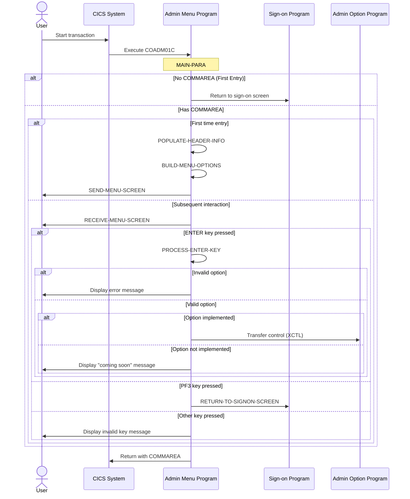

# COADM01C

## Overview
This program serves as the administrative menu interface for the CardDemo application, providing a centralized access point for administrative functions. It displays a menu of options available to admin users and handles navigation to the selected administrative functions. The program manages user input validation, ensuring only valid menu options are processed, and provides appropriate error messages for invalid selections. It maintains session context through a commarea and includes navigation capabilities to return to the sign-on screen. The interface displays current date and time information in the header along with program and transaction identifiers, creating a complete administrative console experience for authorized users.

## Metadata
**Program ID**: `COADM01C`

**Author**: `AWS`

## Sequence Diagram


## Referenced Copybooks
- [`CSDAT01Y`](copybooks/CSDAT01Y.md)
- `DFHAID`
- [`COCOM01Y`](copybooks/COCOM01Y.md)
- [`CSUSR01Y`](copybooks/CSUSR01Y.md)
- `DFHBMSCA`
- [`COTTL01Y`](copybooks/COTTL01Y.md)
- [`COADM02Y`](copybooks/COADM02Y.md)
- [`CSMSG01Y`](copybooks/CSMSG01Y.md)
- `COADM01`

## Environment Division

### CONFIGURATION SECTION
This environment section appears to be empty or not provided in the snippet. In a complete COBOL program, the CONFIGURATION SECTION would typically contain specifications for special names, file assignments, and other environmental settings needed for the CardDemo administrative menu interface program (COADM01C). This section would normally define how the program interacts with the system environment, including any special device assignments or system-specific configurations required for the administrative functions.
<details><summary>Code</summary>
```cobol

```
</details>


## Data Division

### WORKING-STORAGE SECTION
This data section defines the working storage variables for the administrative menu program COADM01C. It includes program identification variables (program name and transaction ID), message handling fields, file references for user security, error flags with condition names, response codes, and menu option processing variables. The section incorporates several copybooks that likely contain common data structures, screen layouts, date/time formatting, message handling, user information, and standard CICS definitions. These variables support the program's function as an administrative interface, providing storage for menu selection processing, error handling, and display formatting needed to present and navigate the administrative console.
<details><summary>Code</summary>
```cobol
01 WS-VARIABLES.
         05 WS-PGMNAME                 PIC X(08) VALUE 'COADM01C'.
         05 WS-TRANID                  PIC X(04) VALUE 'CA00'.
         05 WS-MESSAGE                 PIC X(80) VALUE SPACES.
         05 WS-USRSEC-FILE             PIC X(08) VALUE 'USRSEC  '.
         05 WS-ERR-FLG                 PIC X(01) VALUE 'N'.
           88 ERR-FLG-ON                         VALUE 'Y'.
           88 ERR-FLG-OFF                        VALUE 'N'.
         05 WS-RESP-CD                 PIC S9(09) COMP VALUE ZEROS.
         05 WS-REAS-CD                 PIC S9(09) COMP VALUE ZEROS.
         05 WS-OPTION-X                PIC X(02) JUST RIGHT.
         05 WS-OPTION                  PIC 9(02) VALUE 0.
         05 WS-IDX                     PIC S9(04) COMP VALUE ZEROS.
         05 WS-ADMIN-OPT-TXT           PIC X(40) VALUE SPACES.

       COPY COCOM01Y.
       COPY COADM02Y.

       COPY COADM01.

       COPY COTTL01Y.
       COPY CSDAT01Y.
       COPY CSMSG01Y.
       COPY CSUSR01Y.

       COPY DFHAID.
       COPY DFHBMSCA.

      *----------------------------------------------------------------*
      *                        LINKAGE SECTION
      *----------------------------------------------------------------*
```
</details>


### LINKAGE SECTION
This section defines the linkage area for communication with other programs. It uses the standard DFHCOMMAREA structure with a variable-length field (LK-COMMAREA) that can expand from 1 to 32,767 bytes depending on the actual communication area length (EIBCALEN). This flexible structure allows the program to receive and pass data of different sizes when interacting with other components of the CardDemo administrative system.
<details><summary>Code</summary>
```cobol
01  DFHCOMMAREA.
         05  LK-COMMAREA                           PIC X(01)
             OCCURS 1 TO 32767 TIMES DEPENDING ON EIBCALEN.

      *----------------------------------------------------------------*
      *
```
</details>


## Procedure Division

### MAIN-PARA
This paragraph serves as the main control flow for the administrative menu interface. It first clears any error flags and message fields, then checks if the program was called with a communication area. If not, it returns to the sign-on screen. Otherwise, it processes the existing communication area and either displays the menu for first-time entry or handles user input for subsequent interactions. The paragraph evaluates function key inputs, specifically processing ENTER key actions, returning to the sign-on screen when PF3 is pressed, or displaying an error message for invalid keys. After processing, it returns control to CICS with the transaction ID and updated communication area, maintaining the program's state between interactions.
<details><summary>Code</summary>
```cobol
SET ERR-FLG-OFF TO TRUE

           MOVE SPACES TO WS-MESSAGE
                          ERRMSGO OF COADM1AO

           IF EIBCALEN = 0
               MOVE 'COSGN00C' TO CDEMO-FROM-PROGRAM
               PERFORM RETURN-TO-SIGNON-SCREEN
           ELSE
               MOVE DFHCOMMAREA(1:EIBCALEN) TO CARDDEMO-COMMAREA
               IF NOT CDEMO-PGM-REENTER
                   SET CDEMO-PGM-REENTER    TO TRUE
                   MOVE LOW-VALUES          TO COADM1AO
                   PERFORM SEND-MENU-SCREEN
               ELSE
                   PERFORM RECEIVE-MENU-SCREEN
                   EVALUATE EIBAID
                       WHEN DFHENTER
                           PERFORM PROCESS-ENTER-KEY
                       WHEN DFHPF3
                           MOVE 'COSGN00C' TO CDEMO-TO-PROGRAM
                           PERFORM RETURN-TO-SIGNON-SCREEN
                       WHEN OTHER
                           MOVE 'Y'                       TO WS-ERR-FLG
                           MOVE CCDA-MSG-INVALID-KEY      TO WS-MESSAGE
                           PERFORM SEND-MENU-SCREEN
                   END-EVALUATE
               END-IF
           END-IF

           EXEC CICS RETURN
                     TRANSID (WS-TRANID)
                     COMMAREA (CARDDEMO-COMMAREA)
           END-EXEC.

      *----------------------------------------------------------------*
      *                      PROCESS-ENTER-KEY
      *----------------------------------------------------------------*
```
</details>


### PROCESS-ENTER-KEY
This paragraph processes the user's menu selection when the Enter key is pressed in the CardDemo administrative interface. It first trims trailing spaces from the input option and converts it to a numeric value, handling any blank input by replacing spaces with zeros. The code validates that the option is numeric, within the valid range of menu options, and not zero. If validation fails, it sets an error flag and displays an appropriate message. For valid selections, the code checks if the target program is available (not marked as "DUMMY") and if so, transfers control to that program while passing the commarea to maintain session context. If the selected option is not yet implemented (has a "DUMMY" program name), it displays a "coming soon" message to the user. The paragraph maintains user interface consistency by redisplaying the menu screen with appropriate status messages after processing.
<details><summary>Code</summary>
```cobol
PERFORM VARYING WS-IDX
                   FROM LENGTH OF OPTIONI OF COADM1AI BY -1 UNTIL
                   OPTIONI OF COADM1AI(WS-IDX:1) NOT = SPACES OR
                   WS-IDX = 1
           END-PERFORM
           MOVE OPTIONI OF COADM1AI(1:WS-IDX) TO WS-OPTION-X
           INSPECT WS-OPTION-X REPLACING ALL ' ' BY '0'
           MOVE WS-OPTION-X              TO WS-OPTION
           MOVE WS-OPTION                TO OPTIONO OF COADM1AO

           IF WS-OPTION IS NOT NUMERIC OR
              WS-OPTION > CDEMO-ADMIN-OPT-COUNT OR
              WS-OPTION = ZEROS
               MOVE 'Y'     TO WS-ERR-FLG
               MOVE 'Please enter a valid option number...' TO
                                       WS-MESSAGE
               PERFORM SEND-MENU-SCREEN
           END-IF


           IF NOT ERR-FLG-ON
               IF CDEMO-ADMIN-OPT-PGMNAME(WS-OPTION)(1:5) NOT = 'DUMMY'
                   MOVE WS-TRANID    TO CDEMO-FROM-TRANID
                   MOVE WS-PGMNAME   TO CDEMO-FROM-PROGRAM
                   MOVE ZEROS        TO CDEMO-PGM-CONTEXT
                   EXEC CICS
                       XCTL PROGRAM(CDEMO-ADMIN-OPT-PGMNAME(WS-OPTION))
                       COMMAREA(CARDDEMO-COMMAREA)
                   END-EXEC
               END-IF
               MOVE SPACES             TO WS-MESSAGE
               MOVE DFHGREEN           TO ERRMSGC  OF COADM1AO
               STRING 'This option '       DELIMITED BY SIZE
      *                CDEMO-ADMIN-OPT-NAME(WS-OPTION)
      *                                DELIMITED BY SIZE
                       'is coming soon ...'   DELIMITED BY SIZE
                  INTO WS-MESSAGE
               PERFORM SEND-MENU-SCREEN
           END-IF.

      *----------------------------------------------------------------*
      *                      RETURN-TO-SIGNON-SCREEN
      *----------------------------------------------------------------*
```
</details>


### RETURN-TO-SIGNON-SCREEN
This paragraph handles the return navigation to the sign-on screen from the administrative menu. It first checks if the target program variable (CDEMO-TO-PROGRAM) is empty or contains spaces, and if so, sets it to the sign-on program 'COSGN00C' as the default destination. It then executes a CICS XCTL command to transfer control to the specified program, effectively ending the current program's execution and transferring control to the sign-on screen or another designated program. This ensures users can properly exit the administrative functions and return to the application's entry point.
<details><summary>Code</summary>
```cobol
IF CDEMO-TO-PROGRAM = LOW-VALUES OR SPACES
               MOVE 'COSGN00C' TO CDEMO-TO-PROGRAM
           END-IF
           EXEC CICS
               XCTL PROGRAM(CDEMO-TO-PROGRAM)
           END-EXEC.

      *----------------------------------------------------------------*
      *                      SEND-MENU-SCREEN
      *----------------------------------------------------------------*
```
</details>


### SEND-MENU-SCREEN
This paragraph handles the display of the administrative menu screen. It first calls two supporting paragraphs to populate the header information and build the menu options. It then transfers any system messages to the output map's error message field. Finally, it uses the CICS SEND command to display the COADM1A map from the COADM01 mapset, using the COADM1AO data structure as the source of the display data, and clears the screen before displaying the new content.
<details><summary>Code</summary>
```cobol
PERFORM POPULATE-HEADER-INFO
           PERFORM BUILD-MENU-OPTIONS

           MOVE WS-MESSAGE TO ERRMSGO OF COADM1AO

           EXEC CICS SEND
                     MAP('COADM1A')
                     MAPSET('COADM01')
                     FROM(COADM1AO)
                     ERASE
           END-EXEC.

      *----------------------------------------------------------------*
      *                      RECEIVE-MENU-SCREEN
      *----------------------------------------------------------------*
```
</details>


### RECEIVE-MENU-SCREEN
This paragraph handles the reception of user input from the administrative menu screen. It uses the CICS RECEIVE command to capture data entered by the user on the 'COADM1A' map within the 'COADM01' mapset, storing the input in the COADM1AI structure. The operation's response codes are captured in WS-RESP-CD and WS-REAS-CD variables for subsequent error handling. This is a standard input processing step that occurs after displaying the menu and before processing the user's selection.
<details><summary>Code</summary>
```cobol
EXEC CICS RECEIVE
                     MAP('COADM1A')
                     MAPSET('COADM01')
                     INTO(COADM1AI)
                     RESP(WS-RESP-CD)
                     RESP2(WS-REAS-CD)
           END-EXEC.

      *----------------------------------------------------------------*
      *                      POPULATE-HEADER-INFO
      *----------------------------------------------------------------*
```
</details>


### POPULATE-HEADER-INFO
This paragraph populates the header information for the administrative menu screen. It retrieves the current system date and time using the CURRENT-DATE function, then formats and displays this information on the screen. The paragraph sets the title fields, transaction ID, and program name in the output map (COADM1AO). It also formats the current date into MM/DD/YY format and the current time into HH:MM:SS format before placing these values in their respective output fields. This creates a consistent header that provides context to the user about when they're accessing the system and which program they're currently using.
<details><summary>Code</summary>
```cobol
MOVE FUNCTION CURRENT-DATE  TO WS-CURDATE-DATA

           MOVE CCDA-TITLE01           TO TITLE01O OF COADM1AO
           MOVE CCDA-TITLE02           TO TITLE02O OF COADM1AO
           MOVE WS-TRANID              TO TRNNAMEO OF COADM1AO
           MOVE WS-PGMNAME             TO PGMNAMEO OF COADM1AO

           MOVE WS-CURDATE-MONTH       TO WS-CURDATE-MM
           MOVE WS-CURDATE-DAY         TO WS-CURDATE-DD
           MOVE WS-CURDATE-YEAR(3:2)   TO WS-CURDATE-YY

           MOVE WS-CURDATE-MM-DD-YY    TO CURDATEO OF COADM1AO

           MOVE WS-CURTIME-HOURS       TO WS-CURTIME-HH
           MOVE WS-CURTIME-MINUTE      TO WS-CURTIME-MM
           MOVE WS-CURTIME-SECOND      TO WS-CURTIME-SS

           MOVE WS-CURTIME-HH-MM-SS    TO CURTIMEO OF COADM1AO.

      *----------------------------------------------------------------*
      *                      BUILD-MENU-OPTIONS
      *----------------------------------------------------------------*
```
</details>


### BUILD-MENU-OPTIONS
This paragraph constructs and populates the administrative menu options displayed to users. It iterates through available admin options (up to the count stored in CDEMO-ADMIN-OPT-COUNT), formatting each option by combining its number and name into a formatted string with proper delimiters. The formatted text for each option is then assigned to the appropriate screen field (OPTN001O through OPTN010O) based on its position in the menu. The paragraph supports up to 10 menu options, with any additional options being ignored. This dynamic menu construction allows the administrative interface to display a variable number of options without requiring code changes when menu items are added or removed.
<details><summary>Code</summary>
```cobol
PERFORM VARYING WS-IDX FROM 1 BY 1 UNTIL
                           WS-IDX > CDEMO-ADMIN-OPT-COUNT

               MOVE SPACES             TO WS-ADMIN-OPT-TXT

               STRING CDEMO-ADMIN-OPT-NUM(WS-IDX)  DELIMITED BY SIZE
                      '. '                         DELIMITED BY SIZE
                      CDEMO-ADMIN-OPT-NAME(WS-IDX) DELIMITED BY SIZE
                 INTO WS-ADMIN-OPT-TXT

               EVALUATE WS-IDX
                   WHEN 1
                       MOVE WS-ADMIN-OPT-TXT TO OPTN001O
                   WHEN 2
                       MOVE WS-ADMIN-OPT-TXT TO OPTN002O
                   WHEN 3
                       MOVE WS-ADMIN-OPT-TXT TO OPTN003O
                   WHEN 4
                       MOVE WS-ADMIN-OPT-TXT TO OPTN004O
                   WHEN 5
                       MOVE WS-ADMIN-OPT-TXT TO OPTN005O
                   WHEN 6
                       MOVE WS-ADMIN-OPT-TXT TO OPTN006O
                   WHEN 7
                       MOVE WS-ADMIN-OPT-TXT TO OPTN007O
                   WHEN 8
                       MOVE WS-ADMIN-OPT-TXT TO OPTN008O
                   WHEN 9
                       MOVE WS-ADMIN-OPT-TXT TO OPTN009O
                   WHEN 10
                       MOVE WS-ADMIN-OPT-TXT TO OPTN010O
                   WHEN OTHER
                       CONTINUE
               END-EVALUATE

           END-PERFORM.


      *
      * Ver: CardDemo_v1.0-15-g27d6c6f-68 Date: 2022-07-19 23:12:32 CDT
      *
```
</details>
