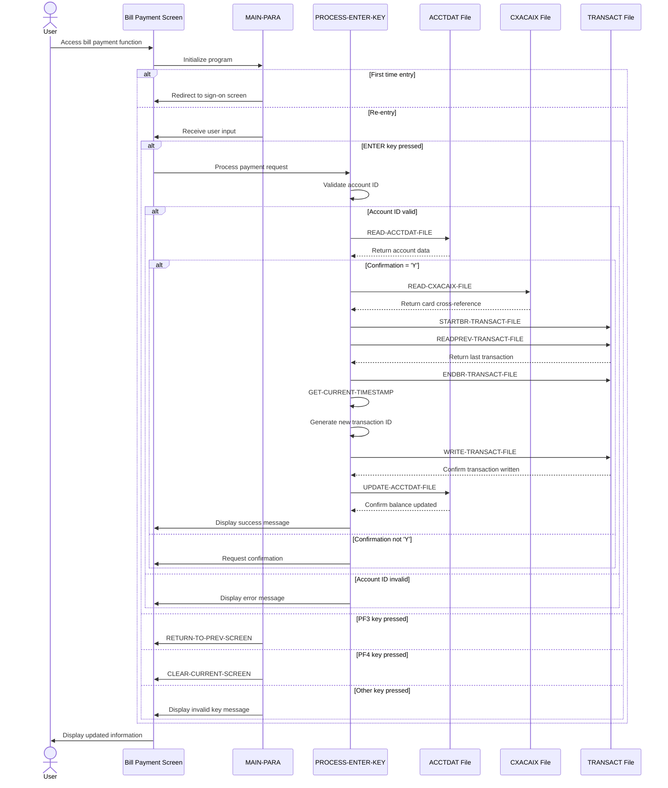

# COBIL00C

## Overview
This CICS COBOL program (COBIL00C) handles online bill payment functionality for the CardDemo application. It allows users to pay their credit card account balance in full and records the transaction. The program reads the account information, verifies the current balance, and if confirmed by the user, creates a payment transaction record and updates the account balance. Key features include:

1. Account validation to ensure the account exists and has a balance to pay
2. Confirmation process requiring user approval before processing payment
3. Transaction recording with unique transaction ID generation
4. Account balance update after successful payment
5. Integration with multiple files: TRANSACT (transaction records), ACCTDAT (account data), and CXACAIX (account cross-reference)

The program includes comprehensive error handling for various scenarios such as account not found, invalid input values, and transaction processing failures. It also provides clear feedback messages to the user about the payment status, including the transaction ID upon successful completion.

## Metadata
**Program ID**: `COBIL00C`

**Author**: `AWS`

## Sequence Diagram


## Referenced Copybooks
- [`CSDAT01Y`](copybooks/CSDAT01Y.md)
- `DFHAID`
- [`CVACT01Y`](copybooks/CVACT01Y.md)
- [`CVTRA05Y`](copybooks/CVTRA05Y.md)
- [`COCOM01Y`](copybooks/COCOM01Y.md)
- `DFHBMSCA`
- [`CVACT03Y`](copybooks/CVACT03Y.md)
- `COBIL00`
- [`COTTL01Y`](copybooks/COTTL01Y.md)
- [`CSMSG01Y`](copybooks/CSMSG01Y.md)

## Environment Division

### CONFIGURATION SECTION
This section would typically contain configuration details for the COBIL00C program, including file assignments, special names, and system dependencies. However, the provided snippet is empty, indicating that the CONFIGURATION SECTION in this program doesn't contain any explicit configuration entries. This suggests that the program likely relies on standard CICS environment settings and doesn't require special configuration parameters for its bill payment functionality.
<details><summary>Code</summary>
```cobol

```
</details>


## Data Division

### WORKING-STORAGE SECTION
This Working-Storage section defines the key variables and data structures used in the COBIL00C bill payment program. It includes program identifiers, file names for transaction and account data, status flags for error handling and payment confirmation, and financial fields for tracking transaction amounts and account balances. The section contains several important control flags that manage the program flow, including error flags and user modification indicators. It also defines fields for transaction identification, date/time processing, and balance management. The section incorporates multiple copybooks that likely contain screen layouts, message definitions, account and transaction record structures, and CICS interface definitions. These variables collectively support the program's core functionality of validating accounts, processing bill payments, recording transactions, and updating account balances.
<details><summary>Code</summary>
```cobol
01 WS-VARIABLES.
         05 WS-PGMNAME                 PIC X(08) VALUE 'COBIL00C'.
         05 WS-TRANID                  PIC X(04) VALUE 'CB00'.
         05 WS-MESSAGE                 PIC X(80) VALUE SPACES.
         05 WS-TRANSACT-FILE           PIC X(08) VALUE 'TRANSACT'.
         05 WS-ACCTDAT-FILE            PIC X(08) VALUE 'ACCTDAT '.
         05 WS-CXACAIX-FILE            PIC X(08) VALUE 'CXACAIX '.
         05 WS-ERR-FLG                 PIC X(01) VALUE 'N'.
           88 ERR-FLG-ON                         VALUE 'Y'.
           88 ERR-FLG-OFF                        VALUE 'N'.
         05 WS-RESP-CD                 PIC S9(09) COMP VALUE ZEROS.
         05 WS-REAS-CD                 PIC S9(09) COMP VALUE ZEROS.
         05 WS-USR-MODIFIED            PIC X(01) VALUE 'N'.
           88 USR-MODIFIED-YES                   VALUE 'Y'.
           88 USR-MODIFIED-NO                    VALUE 'N'.
         05 WS-CONF-PAY-FLG            PIC X(01) VALUE 'N'.
           88 CONF-PAY-YES                       VALUE 'Y'.
           88 CONF-PAY-NO                        VALUE 'N'.

         05 WS-TRAN-AMT                PIC +99999999.99.
         05 WS-CURR-BAL                PIC +9999999999.99.
         05 WS-TRAN-ID-NUM             PIC 9(16) VALUE ZEROS.
         05 WS-TRAN-DATE               PIC X(08) VALUE '00/00/00'.
         05 WS-ABS-TIME                PIC S9(15) COMP-3 VALUE 0.
         05 WS-CUR-DATE-X10            PIC X(10) VALUE SPACES.
         05 WS-CUR-TIME-X08            PIC X(08) VALUE SPACES.

       COPY COCOM01Y.
          05 CDEMO-CB00-INFO.
             10 CDEMO-CB00-TRNID-FIRST     PIC X(16).
             10 CDEMO-CB00-TRNID-LAST      PIC X(16).
             10 CDEMO-CB00-PAGE-NUM        PIC 9(08).
             10 CDEMO-CB00-NEXT-PAGE-FLG   PIC X(01) VALUE 'N'.
                88 NEXT-PAGE-YES                     VALUE 'Y'.
                88 NEXT-PAGE-NO                      VALUE 'N'.
             10 CDEMO-CB00-TRN-SEL-FLG     PIC X(01).
             10 CDEMO-CB00-TRN-SELECTED    PIC X(16).

       COPY COBIL00.

       COPY COTTL01Y.
       COPY CSDAT01Y.
       COPY CSMSG01Y.

       COPY CVACT01Y.
       COPY CVACT03Y.
       COPY CVTRA05Y.

       COPY DFHAID.
       COPY DFHBMSCA.

      *----------------------------------------------------------------*
      *                        LINKAGE SECTION
      *----------------------------------------------------------------*
```
</details>


### LINKAGE SECTION
This section defines the DFHCOMMAREA in the Linkage Section, which is the standard CICS communication area used to pass data between program calls. It contains a single field, LK-COMMAREA, defined as a variable-length array of characters that can expand from 1 to 32,767 bytes depending on the actual length passed to the program (EIBCALEN). This structure allows the bill payment program to receive and maintain state information across multiple interactions with the user interface.
<details><summary>Code</summary>
```cobol
01  DFHCOMMAREA.
         05  LK-COMMAREA                           PIC X(01)
             OCCURS 1 TO 32767 TIMES DEPENDING ON EIBCALEN.

      *----------------------------------------------------------------*
      *
```
</details>


## Procedure Division

### MAIN-PARA
This paragraph serves as the main control flow for the bill payment screen in the CardDemo application. It handles initial screen setup, user navigation, and input processing. The paragraph first initializes error flags and message fields, then checks if the program is being entered for the first time (EIBCALEN = 0) or returning from another screen. 

For first-time entry, it redirects to the sign-on screen. For re-entry, it either initializes the bill payment screen with any pre-selected account information or processes user input based on the function key pressed. The paragraph handles several navigation options: ENTER to process payment information, PF3 to return to the previous screen, and PF4 to clear the current screen. Invalid key presses trigger an error message. After processing, it returns control to CICS with the transaction ID and updated communication area to maintain program state between interactions.
<details><summary>Code</summary>
```cobol
SET ERR-FLG-OFF     TO TRUE
           SET USR-MODIFIED-NO TO TRUE

           MOVE SPACES TO WS-MESSAGE
                          ERRMSGO OF COBIL0AO

           IF EIBCALEN = 0
               MOVE 'COSGN00C' TO CDEMO-TO-PROGRAM
               PERFORM RETURN-TO-PREV-SCREEN
           ELSE
               MOVE DFHCOMMAREA(1:EIBCALEN) TO CARDDEMO-COMMAREA
               IF NOT CDEMO-PGM-REENTER
                   SET CDEMO-PGM-REENTER    TO TRUE
                   MOVE LOW-VALUES          TO COBIL0AO
                   MOVE -1       TO ACTIDINL OF COBIL0AI
                   IF CDEMO-CB00-TRN-SELECTED NOT =
                                              SPACES AND LOW-VALUES
                       MOVE CDEMO-CB00-TRN-SELECTED TO
                            ACTIDINI OF COBIL0AI
                       PERFORM PROCESS-ENTER-KEY
                   END-IF
                   PERFORM SEND-BILLPAY-SCREEN
               ELSE
                   PERFORM RECEIVE-BILLPAY-SCREEN
                   EVALUATE EIBAID
                       WHEN DFHENTER
                           PERFORM PROCESS-ENTER-KEY
                       WHEN DFHPF3
                           IF CDEMO-FROM-PROGRAM = SPACES OR LOW-VALUES
                               MOVE 'COMEN01C' TO CDEMO-TO-PROGRAM
                           ELSE
                               MOVE CDEMO-FROM-PROGRAM TO
                               CDEMO-TO-PROGRAM
                           END-IF
                           PERFORM RETURN-TO-PREV-SCREEN
                       WHEN DFHPF4
                           PERFORM CLEAR-CURRENT-SCREEN
                       WHEN OTHER
                           MOVE 'Y'                       TO WS-ERR-FLG
                           MOVE CCDA-MSG-INVALID-KEY      TO WS-MESSAGE
                           PERFORM SEND-BILLPAY-SCREEN
                   END-EVALUATE
               END-IF
           END-IF

           EXEC CICS RETURN
                     TRANSID (WS-TRANID)
                     COMMAREA (CARDDEMO-COMMAREA)
           END-EXEC.

      *----------------------------------------------------------------*
      *                      PROCESS-ENTER-KEY
      *----------------------------------------------------------------*
```
</details>


### PROCESS-ENTER-KEY
This paragraph processes the user's input when the Enter key is pressed on the bill payment screen. It validates the account ID, checks the confirmation flag, and executes the payment transaction if confirmed. The logic includes:

1. Initial validation to ensure the account ID is not empty
2. Processing of the confirmation field (Y/N) to determine if payment should proceed
3. Verification that the account has a positive balance to pay
4. For confirmed payments:
   - Retrieving the account cross-reference information
   - Generating a unique transaction ID by reading the last transaction record
   - Creating a new transaction record with payment details
   - Updating the account balance by subtracting the payment amount
   - Recording the transaction with timestamp information

If validation fails at any point, appropriate error messages are displayed to the user. The paragraph includes comprehensive error handling and maintains the screen cursor position for user convenience.
<details><summary>Code</summary>
```cobol
SET CONF-PAY-NO TO TRUE

           EVALUATE TRUE
               WHEN ACTIDINI OF COBIL0AI = SPACES OR LOW-VALUES
                   MOVE 'Y'     TO WS-ERR-FLG
                   MOVE 'Acct ID can NOT be empty...' TO
                                   WS-MESSAGE
                   MOVE -1       TO ACTIDINL OF COBIL0AI
                   PERFORM SEND-BILLPAY-SCREEN
               WHEN OTHER
                   CONTINUE
           END-EVALUATE

           IF NOT ERR-FLG-ON
               MOVE ACTIDINI  OF COBIL0AI TO ACCT-ID
                                             XREF-ACCT-ID

               EVALUATE CONFIRMI OF COBIL0AI
                   WHEN 'Y'
                   WHEN 'y'
                       SET CONF-PAY-YES TO TRUE
                       PERFORM READ-ACCTDAT-FILE
                   WHEN 'N'
                   WHEN 'n'
                       PERFORM CLEAR-CURRENT-SCREEN
                       MOVE 'Y'     TO WS-ERR-FLG
                   WHEN SPACES
                   WHEN LOW-VALUES
                       PERFORM READ-ACCTDAT-FILE
                   WHEN OTHER
                       MOVE 'Y'     TO WS-ERR-FLG
                       MOVE 'Invalid value. Valid values are (Y/N)...'
                                    TO WS-MESSAGE
                       MOVE -1      TO CONFIRML OF COBIL0AI
                       PERFORM SEND-BILLPAY-SCREEN
               END-EVALUATE

               MOVE ACCT-CURR-BAL TO WS-CURR-BAL
               MOVE WS-CURR-BAL   TO CURBALI    OF COBIL0AI
           END-IF

           IF NOT ERR-FLG-ON
               IF ACCT-CURR-BAL <= ZEROS AND
                  ACTIDINI OF COBIL0AI NOT = SPACES AND LOW-VALUES
                   MOVE 'Y'     TO WS-ERR-FLG
                   MOVE 'You have nothing to pay...' TO
                                   WS-MESSAGE
                   MOVE -1       TO ACTIDINL OF COBIL0AI
                   PERFORM SEND-BILLPAY-SCREEN
               END-IF
           END-IF

           IF NOT ERR-FLG-ON

               IF CONF-PAY-YES
                   PERFORM READ-CXACAIX-FILE
                   MOVE HIGH-VALUES TO TRAN-ID
                   PERFORM STARTBR-TRANSACT-FILE
                   PERFORM READPREV-TRANSACT-FILE
                   PERFORM ENDBR-TRANSACT-FILE
                   MOVE TRAN-ID     TO WS-TRAN-ID-NUM
                   ADD 1 TO WS-TRAN-ID-NUM
                   INITIALIZE TRAN-RECORD
                   MOVE WS-TRAN-ID-NUM       TO TRAN-ID
                   MOVE '02'                 TO TRAN-TYPE-CD
                   MOVE 2                    TO TRAN-CAT-CD
                   MOVE 'POS TERM'           TO TRAN-SOURCE
                   MOVE 'BILL PAYMENT - ONLINE' TO TRAN-DESC
                   MOVE ACCT-CURR-BAL        TO TRAN-AMT
                   MOVE XREF-CARD-NUM        TO TRAN-CARD-NUM
                   MOVE 999999999            TO TRAN-MERCHANT-ID
                   MOVE 'BILL PAYMENT'       TO TRAN-MERCHANT-NAME
                   MOVE 'N/A'                TO TRAN-MERCHANT-CITY
                   MOVE 'N/A'                TO TRAN-MERCHANT-ZIP
                   PERFORM GET-CURRENT-TIMESTAMP
                   MOVE WS-TIMESTAMP         TO TRAN-ORIG-TS
                                                TRAN-PROC-TS
                   PERFORM WRITE-TRANSACT-FILE
                   COMPUTE ACCT-CURR-BAL = ACCT-CURR-BAL - TRAN-AMT
                   PERFORM UPDATE-ACCTDAT-FILE
               ELSE
                   MOVE 'Confirm to make a bill payment...' TO
                                   WS-MESSAGE
                   MOVE -1       TO CONFIRML OF COBIL0AI
               END-IF

               PERFORM SEND-BILLPAY-SCREEN

           END-IF.

      *----------------------------------------------------------------*
      *                      GET-CURRENT-TIMESTAMP
      *----------------------------------------------------------------*
```
</details>


### GET-CURRENT-TIMESTAMP
This paragraph retrieves and formats the current system timestamp for use in transaction processing. It uses CICS ASKTIME to get the absolute time, then FORMATTIME to convert it into a readable date (YYYY-MM-DD) and time (HH:MM:SS) format with appropriate separators. The formatted date and time values are then combined into a single timestamp field (WS-TIMESTAMP), with the millisecond portion initialized to zeros. This timestamp is likely used for recording when bill payment transactions occur in the system.
<details><summary>Code</summary>
```cobol
EXEC CICS ASKTIME
             ABSTIME(WS-ABS-TIME)
           END-EXEC

           EXEC CICS FORMATTIME
             ABSTIME(WS-ABS-TIME)
             YYYYMMDD(WS-CUR-DATE-X10)
             DATESEP('-')
             TIME(WS-CUR-TIME-X08)
             TIMESEP(':')
           END-EXEC

           INITIALIZE WS-TIMESTAMP
           MOVE WS-CUR-DATE-X10 TO WS-TIMESTAMP(01:10)
           MOVE WS-CUR-TIME-X08 TO WS-TIMESTAMP(12:08)
           MOVE ZEROS           TO WS-TIMESTAMP-TM-MS6
           .


      *----------------------------------------------------------------*
      *                      RETURN-TO-PREV-SCREEN
      *----------------------------------------------------------------*
```
</details>


### RETURN-TO-PREV-SCREEN
This paragraph handles the navigation back to a previous screen in the CardDemo application. It first checks if the target program is specified in the communication area, and if not, defaults to the sign-on program 'COSGN00C'. It then sets up the communication area with the current transaction ID and program name before transferring control to the target program using the CICS XCTL command. This functionality provides a consistent way to return to previous screens while maintaining context information between program calls.
<details><summary>Code</summary>
```cobol
IF CDEMO-TO-PROGRAM = LOW-VALUES OR SPACES
               MOVE 'COSGN00C' TO CDEMO-TO-PROGRAM
           END-IF
           MOVE WS-TRANID    TO CDEMO-FROM-TRANID
           MOVE WS-PGMNAME   TO CDEMO-FROM-PROGRAM
           MOVE ZEROS        TO CDEMO-PGM-CONTEXT
           EXEC CICS
               XCTL PROGRAM(CDEMO-TO-PROGRAM)
               COMMAREA(CARDDEMO-COMMAREA)
           END-EXEC.

      *----------------------------------------------------------------*
      *                      SEND-BILLPAY-SCREEN
      *----------------------------------------------------------------*
```
</details>


### SEND-BILLPAY-SCREEN
This paragraph displays the bill payment screen to the user. It first calls the POPULATE-HEADER-INFO paragraph to set up common header information, then moves any system message to the error message field on the screen. It then uses the CICS SEND command to display the COBIL0A map from the COBIL00 mapset, clearing the screen (ERASE) and positioning the cursor. This is a standard screen display routine that presents the bill payment interface to the user.
<details><summary>Code</summary>
```cobol
PERFORM POPULATE-HEADER-INFO

           MOVE WS-MESSAGE TO ERRMSGO OF COBIL0AO

           EXEC CICS SEND
                     MAP('COBIL0A')
                     MAPSET('COBIL00')
                     FROM(COBIL0AO)
                     ERASE
                     CURSOR
           END-EXEC.

      *----------------------------------------------------------------*
      *                      RECEIVE-BILLPAY-SCREEN
      *----------------------------------------------------------------*
```
</details>


### RECEIVE-BILLPAY-SCREEN
This paragraph receives user input from the bill payment screen using the CICS RECEIVE command. It captures data entered by the user from the 'COBIL0A' map within the 'COBIL00' mapset and stores it in the COBIL0AI structure. The response codes are captured in WS-RESP-CD and WS-REAS-CD variables for subsequent error handling. This is the initial step in the bill payment process where the program obtains the user's payment information before processing.
<details><summary>Code</summary>
```cobol
EXEC CICS RECEIVE
                     MAP('COBIL0A')
                     MAPSET('COBIL00')
                     INTO(COBIL0AI)
                     RESP(WS-RESP-CD)
                     RESP2(WS-REAS-CD)
           END-EXEC.

      *----------------------------------------------------------------*
      *                      POPULATE-HEADER-INFO
      *----------------------------------------------------------------*
```
</details>


### POPULATE-HEADER-INFO
This paragraph populates the header information for the bill payment screen. It retrieves the current system date and time using the CURRENT-DATE function, then formats and displays this information along with program identification details on the screen. The paragraph sets the title fields from constant data, displays the transaction ID and program name, and formats the current date (MM/DD/YY) and time (HH:MM:SS) for display. This creates a consistent header that provides context to users about which program they're using and when the transaction is taking place.
<details><summary>Code</summary>
```cobol
MOVE FUNCTION CURRENT-DATE  TO WS-CURDATE-DATA

           MOVE CCDA-TITLE01           TO TITLE01O OF COBIL0AO
           MOVE CCDA-TITLE02           TO TITLE02O OF COBIL0AO
           MOVE WS-TRANID              TO TRNNAMEO OF COBIL0AO
           MOVE WS-PGMNAME             TO PGMNAMEO OF COBIL0AO

           MOVE WS-CURDATE-MONTH       TO WS-CURDATE-MM
           MOVE WS-CURDATE-DAY         TO WS-CURDATE-DD
           MOVE WS-CURDATE-YEAR(3:2)   TO WS-CURDATE-YY

           MOVE WS-CURDATE-MM-DD-YY    TO CURDATEO OF COBIL0AO

           MOVE WS-CURTIME-HOURS       TO WS-CURTIME-HH
           MOVE WS-CURTIME-MINUTE      TO WS-CURTIME-MM
           MOVE WS-CURTIME-SECOND      TO WS-CURTIME-SS

           MOVE WS-CURTIME-HH-MM-SS    TO CURTIMEO OF COBIL0AO.

      *----------------------------------------------------------------*
      *                      READ-ACCTDAT-FILE
      *----------------------------------------------------------------*
```
</details>


### READ-ACCTDAT-FILE
This paragraph reads an account record from the ACCTDAT file using the account ID as the key. It performs the read with UPDATE intent, allowing the record to be modified later. The paragraph handles three possible outcomes: if the read is successful, processing continues; if the account is not found, an error message is displayed to the user and the bill payment screen is redisplayed with the cursor positioned at the account ID field; for any other errors, diagnostic information is displayed, an error message is shown to the user, and the bill payment screen is redisplayed. This validation ensures that bill payments can only be processed for existing accounts.
<details><summary>Code</summary>
```cobol
EXEC CICS READ
                DATASET   (WS-ACCTDAT-FILE)
                INTO      (ACCOUNT-RECORD)
                LENGTH    (LENGTH OF ACCOUNT-RECORD)
                RIDFLD    (ACCT-ID)
                KEYLENGTH (LENGTH OF ACCT-ID)
                UPDATE
                RESP      (WS-RESP-CD)
                RESP2     (WS-REAS-CD)
           END-EXEC

           EVALUATE WS-RESP-CD
               WHEN DFHRESP(NORMAL)
                   CONTINUE
               WHEN DFHRESP(NOTFND)
                   MOVE 'Y'     TO WS-ERR-FLG
                   MOVE 'Account ID NOT found...' TO
                                   WS-MESSAGE
                   MOVE -1       TO ACTIDINL OF COBIL0AI
                   PERFORM SEND-BILLPAY-SCREEN
               WHEN OTHER
                   DISPLAY 'RESP:' WS-RESP-CD 'REAS:' WS-REAS-CD
                   MOVE 'Y'     TO WS-ERR-FLG
                   MOVE 'Unable to lookup Account...' TO
                                   WS-MESSAGE
                   MOVE -1       TO ACTIDINL OF COBIL0AI
                   PERFORM SEND-BILLPAY-SCREEN
           END-EVALUATE.

      *----------------------------------------------------------------*
      *                      UPDATE-ACCTDAT-FILE
      *----------------------------------------------------------------*
```
</details>


### UPDATE-ACCTDAT-FILE
This paragraph updates the account record in the ACCTDAT file after a bill payment has been processed. It uses a CICS REWRITE command to replace the existing account record with the updated version that reflects the new balance. The paragraph includes error handling logic that checks the response code from the CICS operation and takes appropriate action: continuing if successful, displaying an error message if the account is not found, or showing a generic update error message for other failures. If an error occurs, the paragraph sets an error flag and positions the cursor at the account ID field before redisplaying the bill payment screen to the user.
<details><summary>Code</summary>
```cobol
EXEC CICS REWRITE
                DATASET   (WS-ACCTDAT-FILE)
                FROM      (ACCOUNT-RECORD)
                LENGTH    (LENGTH OF ACCOUNT-RECORD)
                RESP      (WS-RESP-CD)
                RESP2     (WS-REAS-CD)
           END-EXEC

           EVALUATE WS-RESP-CD
               WHEN DFHRESP(NORMAL)
                   CONTINUE
               WHEN DFHRESP(NOTFND)
                   MOVE 'Y'     TO WS-ERR-FLG
                   MOVE 'Account ID NOT found...' TO
                                   WS-MESSAGE
                   MOVE -1       TO ACTIDINL OF COBIL0AI
                   PERFORM SEND-BILLPAY-SCREEN
               WHEN OTHER
                   DISPLAY 'RESP:' WS-RESP-CD 'REAS:' WS-REAS-CD
                   MOVE 'Y'     TO WS-ERR-FLG
                   MOVE 'Unable to Update Account...' TO
                                   WS-MESSAGE
                   MOVE -1       TO ACTIDINL OF COBIL0AI
                   PERFORM SEND-BILLPAY-SCREEN
           END-EVALUATE.

      *----------------------------------------------------------------*
      *                      READ-CXACAIX-FILE
      *----------------------------------------------------------------*
```
</details>


### READ-CXACAIX-FILE
This paragraph performs a read operation on the CXACAIX cross-reference file to validate the account ID entered by the user. It attempts to retrieve the card cross-reference record using the account ID as the key. The paragraph handles three possible outcomes: successful retrieval (processing continues), account not found (displays an error message and returns to the bill payment screen with cursor positioned at the account ID field), or other errors (displays technical response codes, shows a generic error message, and returns to the bill payment screen). This validation step is critical to ensure the bill payment operation is only attempted for valid accounts in the system.
<details><summary>Code</summary>
```cobol
EXEC CICS READ
                DATASET   (WS-CXACAIX-FILE)
                INTO      (CARD-XREF-RECORD)
                LENGTH    (LENGTH OF CARD-XREF-RECORD)
                RIDFLD    (XREF-ACCT-ID)
                KEYLENGTH (LENGTH OF XREF-ACCT-ID)
                RESP      (WS-RESP-CD)
                RESP2     (WS-REAS-CD)
           END-EXEC

           EVALUATE WS-RESP-CD
               WHEN DFHRESP(NORMAL)
                   CONTINUE
               WHEN DFHRESP(NOTFND)
                   MOVE 'Y'     TO WS-ERR-FLG
                   MOVE 'Account ID NOT found...' TO
                                   WS-MESSAGE
                   MOVE -1       TO ACTIDINL OF COBIL0AI
                   PERFORM SEND-BILLPAY-SCREEN
               WHEN OTHER
                   DISPLAY 'RESP:' WS-RESP-CD 'REAS:' WS-REAS-CD
                   MOVE 'Y'     TO WS-ERR-FLG
                   MOVE 'Unable to lookup XREF AIX file...' TO
                                   WS-MESSAGE
                   MOVE -1       TO ACTIDINL OF COBIL0AI
                   PERFORM SEND-BILLPAY-SCREEN
           END-EVALUATE.

      *----------------------------------------------------------------*
      *                      STARTBR-TRANSACT-FILE
      *----------------------------------------------------------------*
```
</details>


### STARTBR-TRANSACT-FILE
This paragraph initiates a browse operation on the TRANSACT file to locate a specific transaction record using the transaction ID as the key. It evaluates the response code from the CICS STARTBR command and handles three possible outcomes: 1) if the operation is successful, processing continues normally; 2) if the transaction ID is not found, it sets an error flag, displays a "Transaction ID NOT found" message, and returns to the bill payment screen; 3) for any other response code, it displays the specific response and reason codes, sets an error flag, shows a generic error message, and returns to the bill payment screen. This paragraph is part of the transaction validation process in the bill payment workflow.
<details><summary>Code</summary>
```cobol
EXEC CICS STARTBR
                DATASET   (WS-TRANSACT-FILE)
                RIDFLD    (TRAN-ID)
                KEYLENGTH (LENGTH OF TRAN-ID)
                RESP      (WS-RESP-CD)
                RESP2     (WS-REAS-CD)
           END-EXEC

           EVALUATE WS-RESP-CD
               WHEN DFHRESP(NORMAL)
                   CONTINUE
               WHEN DFHRESP(NOTFND)
                   MOVE 'Y'     TO WS-ERR-FLG
                   MOVE 'Transaction ID NOT found...' TO
                                   WS-MESSAGE
                   MOVE -1       TO ACTIDINL OF COBIL0AI
                   PERFORM SEND-BILLPAY-SCREEN
               WHEN OTHER
                   DISPLAY 'RESP:' WS-RESP-CD 'REAS:' WS-REAS-CD
                   MOVE 'Y'     TO WS-ERR-FLG
                   MOVE 'Unable to lookup Transaction...' TO
                                   WS-MESSAGE
                   MOVE -1       TO ACTIDINL OF COBIL0AI
                   PERFORM SEND-BILLPAY-SCREEN
           END-EVALUATE.

      *----------------------------------------------------------------*
      *                      READPREV-TRANSACT-FILE
      *----------------------------------------------------------------*
```
</details>


### READPREV-TRANSACT-FILE
This paragraph performs a "read previous" operation on the transaction file to retrieve the previous transaction record based on the current transaction ID. It reads the record into the TRAN-RECORD structure and handles three possible response scenarios: 1) successful read (continues processing), 2) end-of-file condition (sets the transaction ID to zeros), or 3) any other response (displays error information, sets an error flag, prepares an error message, positions the cursor at the account ID field, and displays the bill payment screen). This functionality is likely used to find the most recent transaction or to navigate backward through transaction history when processing bill payments.
<details><summary>Code</summary>
```cobol
EXEC CICS READPREV
                DATASET   (WS-TRANSACT-FILE)
                INTO      (TRAN-RECORD)
                LENGTH    (LENGTH OF TRAN-RECORD)
                RIDFLD    (TRAN-ID)
                KEYLENGTH (LENGTH OF TRAN-ID)
                RESP      (WS-RESP-CD)
                RESP2     (WS-REAS-CD)
           END-EXEC

           EVALUATE WS-RESP-CD
               WHEN DFHRESP(NORMAL)
                   CONTINUE
               WHEN DFHRESP(ENDFILE)
                   MOVE ZEROS TO TRAN-ID
               WHEN OTHER
                   DISPLAY 'RESP:' WS-RESP-CD 'REAS:' WS-REAS-CD
                   MOVE 'Y'     TO WS-ERR-FLG
                   MOVE 'Unable to lookup Transaction...' TO
                                   WS-MESSAGE
                   MOVE -1       TO ACTIDINL OF COBIL0AI
                   PERFORM SEND-BILLPAY-SCREEN
           END-EVALUATE.

      *----------------------------------------------------------------*
      *                      ENDBR-TRANSACT-FILE
      *----------------------------------------------------------------*
```
</details>


### ENDBR-TRANSACT-FILE
This paragraph terminates a browse operation on the TRANSACT file (referenced by the working storage variable WS-TRANSACT-FILE) using the CICS ENDBR command. It's executed after the program has finished browsing through transaction records, properly releasing the resources associated with the browse operation.
<details><summary>Code</summary>
```cobol
EXEC CICS ENDBR
                DATASET   (WS-TRANSACT-FILE)
           END-EXEC.

      *----------------------------------------------------------------*
      *                      WRITE-TRANSACT-FILE
      *----------------------------------------------------------------*
```
</details>


### WRITE-TRANSACT-FILE
This paragraph handles the writing of a transaction record to the TRANSACT file and processes the response. After attempting to write the transaction record, it evaluates the CICS response code and takes appropriate action. For successful transactions, it initializes fields, constructs a confirmation message including the transaction ID, and displays the bill payment screen with a green success message. If a duplicate key or record is detected, it sets an error flag and displays an appropriate error message. For any other response codes, it logs the response and reason codes, sets an error flag, and displays a generic error message. In all cases, the paragraph concludes by redisplaying the bill payment screen with the appropriate feedback to the user.
<details><summary>Code</summary>
```cobol
EXEC CICS WRITE
                DATASET   (WS-TRANSACT-FILE)
                FROM      (TRAN-RECORD)
                LENGTH    (LENGTH OF TRAN-RECORD)
                RIDFLD    (TRAN-ID)
                KEYLENGTH (LENGTH OF TRAN-ID)
                RESP      (WS-RESP-CD)
                RESP2     (WS-REAS-CD)
           END-EXEC

           EVALUATE WS-RESP-CD
               WHEN DFHRESP(NORMAL)
                   PERFORM INITIALIZE-ALL-FIELDS
                   MOVE SPACES             TO WS-MESSAGE
                   MOVE DFHGREEN           TO ERRMSGC  OF COBIL0AO
                   STRING 'Payment successful. '     DELIMITED BY SIZE
                     ' Your Transaction ID is ' DELIMITED BY SIZE
                          TRAN-ID  DELIMITED BY SPACE
                          '.' DELIMITED BY SIZE
                     INTO WS-MESSAGE
                   PERFORM SEND-BILLPAY-SCREEN
               WHEN DFHRESP(DUPKEY)
               WHEN DFHRESP(DUPREC)
                   MOVE 'Y'     TO WS-ERR-FLG
                   MOVE 'Tran ID already exist...' TO
                                   WS-MESSAGE
                   MOVE -1       TO ACTIDINL OF COBIL0AI
                   PERFORM SEND-BILLPAY-SCREEN
               WHEN OTHER
                   DISPLAY 'RESP:' WS-RESP-CD 'REAS:' WS-REAS-CD
                   MOVE 'Y'     TO WS-ERR-FLG
                   MOVE 'Unable to Add Bill pay Transaction...' TO
                                   WS-MESSAGE
                   MOVE -1       TO ACTIDINL OF COBIL0AI
                   PERFORM SEND-BILLPAY-SCREEN
           END-EVALUATE.

      *----------------------------------------------------------------*
      *                      CLEAR-CURRENT-SCREEN
      *----------------------------------------------------------------*
```
</details>


### CLEAR-CURRENT-SCREEN
This paragraph clears the current bill payment screen by first initializing all fields to their default values and then redisplaying the bill payment screen to the user. It provides a way to reset the interface when needed, such as after an error or when starting a new payment process.
<details><summary>Code</summary>
```cobol
PERFORM INITIALIZE-ALL-FIELDS
           PERFORM SEND-BILLPAY-SCREEN.

      *----------------------------------------------------------------*
      *                      INITIALIZE-ALL-FIELDS
      *----------------------------------------------------------------*
```
</details>


### INITIALIZE-ALL-FIELDS
This paragraph initializes the input fields on the bill payment screen. It sets the cursor position to the account ID field by setting its length to -1, and clears the account ID input field, current balance field, and confirmation field by filling them with spaces. This is typically executed when the screen is first displayed or needs to be reset.
<details><summary>Code</summary>
```cobol
MOVE -1              TO ACTIDINL OF COBIL0AI
           MOVE SPACES          TO ACTIDINI OF COBIL0AI
                                   CURBALI  OF COBIL0AI
                                   CONFIRMI OF COBIL0AI
```
</details>


### WS-MESSAGE
This paragraph contains version control information for the COBIL00C program, indicating it is part of the CardDemo application version 1.0-15-g27d6c6f-68, with a timestamp of July 19, 2022, at 23:12:32 CDT. This helps track which version of the code is deployed and when it was last updated.
<details><summary>Code</summary>
```cobol
*
      * Ver: CardDemo_v1.0-15-g27d6c6f-68 Date: 2022-07-19 23:12:32 CDT
      *
```
</details>
