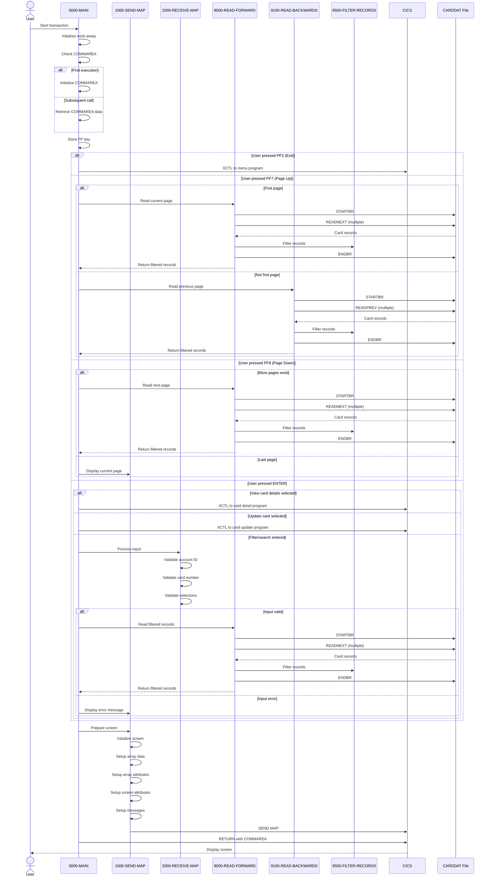

# COCRDLIC

## Overview
This program, COCRDLIC, is a business logic component of the CardDemo application that manages the display and navigation of credit card listings. It provides a user interface for viewing credit cards with filtering capabilities and access to detailed card information.

The program implements role-based access control, showing either all cards for admin users or only cards associated with a specific account for regular users. It supports pagination through card records with forward and backward navigation using PF7/PF8 keys.

Key functionality includes:
- Filtering card records by account ID and/or card number
- Displaying up to 7 card records per screen with pagination
- Allowing users to select individual cards for detailed view or update operations
- Input validation for account and card number filters
- Navigation between related screens in the application

The program interacts with the CARDDAT file to retrieve card information and handles various user actions including entering search criteria, selecting records for viewing or updating, and navigating between pages of results. Error handling is implemented throughout the program to provide appropriate feedback to users when invalid inputs are detected or when system errors occur.

## Metadata
**Program ID**: `COCRDLIC`

## Sequence Diagram


## Referenced Copybooks
- [`CSDAT01Y`](copybooks/CSDAT01Y.md)
- `COCRDSL`
- `DFHAID`
- [`CSUSR01Y`](copybooks/CSUSR01Y.md)
- [`COCOM01Y`](copybooks/COCOM01Y.md)
- [`CVCRD01Y`](copybooks/CVCRD01Y.md)
- [`CSSTRPFY`](copybooks/CSSTRPFY.md)
- `DFHBMSCA`
- [`CVACT02Y`](copybooks/CVACT02Y.md)
- `COCRDLI`
- [`COTTL01Y`](copybooks/COTTL01Y.md)
- [`CSMSG02Y`](copybooks/CSMSG02Y.md)
- [`CSMSG01Y`](copybooks/CSMSG01Y.md)

## Environment Division

### INPUT-OUTPUT SECTION
This section would typically contain the file definitions and I/O configurations for the COCRDLIC program, but appears to be empty in the provided snippet. In a complete program, the INPUT-OUTPUT SECTION would define the file control entries for files used by the program, such as the CARDDAT file mentioned in the program description. This section would specify file names, access methods, organization types, and record keys for the data files that the program reads from or writes to.
<details><summary>Code</summary>
```cobol

```
</details>


## Data Division

### WORKING-STORAGE SECTION
This Working Storage Section defines the data structures used in the COCRDLIC program for managing credit card listings. It contains several key components:

1. CICS processing variables for handling responses and transaction IDs
2. Input validation flags and fields for filtering by account ID and card number
3. Selection handling variables that track user selections on the card listing screen
4. Output formatting and message construction fields for user feedback
5. File handling variables for CARDDAT file access and record filtering
6. Program constants including screen limits (7 lines per page) and program/transaction IDs for navigation
7. A commarea structure that maintains state between program invocations, particularly for pagination
8. Screen data arrays to store and display up to 7 card records per screen

The section includes flags for role-based access control, pagination tracking (first/last page indicators), and error handling. It incorporates several copybooks for common structures like card records (CVACT02Y), user information (CSUSR01Y), and screen layouts (COCRDLI). The structure supports the program's core functionality of displaying filtered card listings with pagination and allowing users to select records for detailed viewing or updates.
<details><summary>Code</summary>
```cobol
01  WS-MISC-STORAGE.                                                     
      ******************************************************************        
      * General CICS related                                                    
      ******************************************************************        
                                                                                
         05 WS-CICS-PROCESSNG-VARS.                                             
            07 WS-RESP-CD                          PIC S9(09) COMP              
                                                   VALUE ZEROS.                 
            07 WS-REAS-CD                          PIC S9(09) COMP              
                                                   VALUE ZEROS.                 
            07 WS-TRANID                           PIC X(4)                     
                                                   VALUE SPACES.                
      ******************************************************************        
      * Input edits                                                             
      ******************************************************************        
         05 WS-INPUT-FLAG                          PIC X(1).                    
           88  INPUT-OK                            VALUES '0'                   
                                                          ' '                   
                                                   LOW-VALUES.                  
           88  INPUT-ERROR                         VALUE '1'.                   
         05  WS-EDIT-ACCT-FLAG                     PIC X(1).                    
           88  FLG-ACCTFILTER-NOT-OK               VALUE '0'.                   
           88  FLG-ACCTFILTER-ISVALID             VALUE '1'.                    
           88  FLG-ACCTFILTER-BLANK                VALUE ' '.                   
         05  WS-EDIT-CARD-FLAG                     PIC X(1).                    
           88  FLG-CARDFILTER-NOT-OK               VALUE '0'.                   
           88  FLG-CARDFILTER-ISVALID             VALUE '1'.                    
           88  FLG-CARDFILTER-BLANK                VALUE ' '.                   
         05 WS-EDIT-SELECT-COUNTER                PIC S9(04)                    
                                                  USAGE COMP-3                  
                                                  VALUE 0.                      
         05 WS-EDIT-SELECT-FLAGS                  PIC X(7)                      
                                                  VALUE LOW-VALUES.             
         05 WS-EDIT-SELECT-ARRAY REDEFINES  WS-EDIT-SELECT-FLAGS.               
            10 WS-EDIT-SELECT                      PIC X(1)                     
                                                  OCCURS 7 TIMES.               
               88 SELECT-OK                        VALUES 'S', 'U'.             
               88 VIEW-REQUESTED-ON                VALUE 'S'.                   
               88 UPDATE-REQUESTED-ON              VALUE 'U'.                   
               88 SELECT-BLANK                     VALUES                       
                                                   ' ',                         
                                                   LOW-VALUES.                  
         05 WS-EDIT-SELECT-ERROR-FLAGS             PIC X(7).                    
         05 WS-EDIT-SELECT-ERROR-FLAGX     REDEFINES                            
            WS-EDIT-SELECT-ERROR-FLAGS.                                         
            10 WS-EDIT-SELECT-ERRORS OCCURS 7 TIMES.                            
               20 WS-ROW-CRDSELECT-ERROR          PIC X(1).                     
                  88 WS-ROW-SELECT-ERROR          VALUE '1'.                    
         05 WS-SUBSCRIPT-VARS.                                                  
            10 I                                  PIC S9(4) COMP                
                                                  VALUE 0.                      
            10 I-SELECTED                         PIC S9(4) COMP                
                                                  VALUE 0.                      
               88 DETAIL-WAS-REQUESTED            VALUES 1 THRU 7.              
      ******************************************************************        
      * Output edits                                                            
      ******************************************************************        
         05 CICS-OUTPUT-EDIT-VARS.                                              
           10  CARD-ACCT-ID-X                      PIC X(11).                   
           10  CARD-ACCT-ID-N REDEFINES CARD-ACCT-ID-X                          
                                                   PIC 9(11).                   
           10  CARD-CVV-CD-X                       PIC X(03).                   
           10  CARD-CVV-CD-N REDEFINES  CARD-CVV-CD-X                           
                                                   PIC 9(03).                   
           10  FLG-PROTECT-SELECT-ROWS             PIC X(1).                    
           88  FLG-PROTECT-SELECT-ROWS-NO          VALUE '0'.                   
           88  FLG-PROTECT-SELECT-ROWS-YES         VALUE '1'.                   
      ******************************************************************        
      * Output Message Construction                                             
      ******************************************************************        
         05  WS-LONG-MSG                           PIC X(500).                  
         05  WS-INFO-MSG                           PIC X(45).                   
           88  WS-NO-INFO-MESSAGE                 VALUES                        
                                                  SPACES LOW-VALUES.            
           88  WS-INFORM-REC-ACTIONS          VALUE                             
               'TYPE S FOR DETAIL, U TO UPDATE ANY RECORD'.                     
         05  WS-ERROR-MSG                         PIC X(75).                    
           88  WS-ERROR-MSG-OFF                   VALUE SPACES.                 
           88  WS-EXIT-MESSAGE                     VALUE                        
               'PF03 PRESSED.EXITING'.                                          
           88  WS-NO-RECORDS-FOUND                 VALUE                        
               'NO RECORDS FOUND FOR THIS SEARCH CONDITION.'.                   
           88  WS-MORE-THAN-1-ACTION              VALUE                         
               'PLEASE SELECT ONLY ONE RECORD TO VIEW OR UPDATE'.               
           88  WS-INVALID-ACTION-CODE              VALUE                        
               'INVALID ACTION CODE'.                                           
         05  WS-PFK-FLAG                           PIC X(1).                    
           88  PFK-VALID                           VALUE '0'.                   
           88  PFK-INVALID                         VALUE '1'.                   
         05  WS-CONTEXT-FLAG                       PIC X(1).                    
           88  WS-CONTEXT-FRESH-START              VALUE '0'.                   
           88  WS-CONTEXT-FRESH-START-NO           VALUE '1'.                   
      ******************************************************************        
      * File and data Handling                                                  
      ******************************************************************        
         05 WS-FILE-HANDLING-VARS.                                              
            10  WS-CARD-RID.                                                    
                20  WS-CARD-RID-CARDNUM            PIC X(16).                   
                20  WS-CARD-RID-ACCT-ID            PIC 9(11).                   
                20  WS-CARD-RID-ACCT-ID-X          REDEFINES                    
                    WS-CARD-RID-ACCT-ID            PIC X(11).                   
                                                                                
                                                                                
                                                                                
         05  WS-SCRN-COUNTER               PIC S9(4) COMP VALUE 0.              
                                                                                
         05  WS-FILTER-RECORD-FLAG                 PIC X(1).                    
           88  WS-EXCLUDE-THIS-RECORD               VALUE '0'.                  
           88  WS-DONOT-EXCLUDE-THIS-RECORD         VALUE '1'.                  
         05  WS-RECORDS-TO-PROCESS-FLAG            PIC X(1).                    
           88  READ-LOOP-EXIT                      VALUE '0'.                   
           88  MORE-RECORDS-TO-READ                VALUE '1'.                   
         05  WS-FILE-ERROR-MESSAGE.                                             
           10  FILLER                              PIC X(12)                    
                                                   VALUE 'File Error:'.         
           10  ERROR-OPNAME                        PIC X(8)                     
                                                   VALUE SPACES.                
           10  FILLER                              PIC X(4)                     
                                                   VALUE ' on '.                
           10  ERROR-FILE                          PIC X(9)                     
                                                   VALUE SPACES.                
           10  FILLER                              PIC X(15)                    
                                                   VALUE                        
                                                   ' returned RESP '.           
           10  ERROR-RESP                          PIC X(10)                    
                                                   VALUE SPACES.                
           10  FILLER                              PIC X(7)                     
                                                   VALUE ',RESP2 '.             
           10  ERROR-RESP2                         PIC X(10)                    
                                                   VALUE SPACES.                
          10  FILLER                               PIC X(5).                    
                                                                                
      ******************************************************************
      * Literals and Constants                                                  
      ******************************************************************        
       01 WS-CONSTANTS.                                                         
         05  WS-MAX-SCREEN-LINES                    PIC S9(4) COMP              
                                                    VALUE 7.                    
         05  LIT-THISPGM                            PIC X(8)                    
             VALUE 'COCRDLIC'.                                                  
         05  LIT-THISTRANID                         PIC X(4)                    
             VALUE 'CCLI'.                                                      
         05  LIT-THISMAPSET                         PIC X(7)                    
             VALUE 'COCRDLI'.                                                   
         05  LIT-THISMAP                            PIC X(7)                    
             VALUE 'CCRDLIA'.                                                   
         05  LIT-MENUPGM                            PIC X(8)                    
             VALUE 'COMEN01C'.                                                  
         05  LIT-MENUTRANID                         PIC X(4)                    
             VALUE 'CM00'.                                                      
         05  LIT-MENUMAPSET                         PIC X(7)                    
             VALUE 'COMEN01'.                                                   
         05  LIT-MENUMAP                            PIC X(7)                    
             VALUE 'COMEN1A'.                                                   
         05  LIT-CARDDTLPGM                         PIC X(8)                    
             VALUE 'COCRDSLC'.                                                  
         05  LIT-CARDDTLTRANID                      PIC X(4)                    
             VALUE 'CCDL'.                                                      
         05  LIT-CARDDTLMAPSET                      PIC X(7)                    
             VALUE 'COCRDSL'.                                                   
         05  LIT-CARDDTLMAP                         PIC X(7)                    
             VALUE 'CCRDSLA'.                                                   
         05  LIT-CARDUPDPGM                         PIC X(8)                    
             VALUE 'COCRDUPC'.                                                  
         05  LIT-CARDUPDTRANID                      PIC X(4)                    
             VALUE 'CCUP'.                                                      
         05  LIT-CARDUPDMAPSET                      PIC X(7)                    
             VALUE 'COCRDUP'.                                                   
         05  LIT-CARDUPDMAP                         PIC X(7)                    
             VALUE 'CCRDUPA'.                                                   
                                                                                
                                                                                
         05  LIT-CARD-FILE                          PIC X(8)                    
                                                   VALUE 'CARDDAT '.            
         05  LIT-CARD-FILE-ACCT-PATH                PIC X(8)                    
                                                                                
                                                   VALUE 'CARDAIX '.            
      ******************************************************************        
      *Other common working storage Variables                                   
      ******************************************************************        
       COPY CVCRD01Y.                                                           
                                                                                
      ******************************************************************        
      *  Commarea manipulations                                                 
      ******************************************************************        
      *Application Commmarea Copybook                                           
       COPY COCOM01Y.                                                           
                                                                                
       01 WS-THIS-PROGCOMMAREA.                                                 
            10 WS-CA-LAST-CARDKEY.                                              
               15  WS-CA-LAST-CARD-NUM                PIC X(16).                
               15  WS-CA-LAST-CARD-ACCT-ID            PIC 9(11).                
            10 WS-CA-FIRST-CARDKEY.                                             
               15  WS-CA-FIRST-CARD-NUM               PIC X(16).                
               15  WS-CA-FIRST-CARD-ACCT-ID           PIC 9(11).                
                                                                                
            10 WS-CA-SCREEN-NUM                       PIC 9(1).                 
               88 CA-FIRST-PAGE                          VALUE 1.               
            10 WS-CA-LAST-PAGE-DISPLAYED              PIC 9(1).                 
               88 CA-LAST-PAGE-SHOWN                     VALUE 0.               
               88 CA-LAST-PAGE-NOT-SHOWN                 VALUE 9.               
            10 WS-CA-NEXT-PAGE-IND                    PIC X(1).                 
               88 CA-NEXT-PAGE-NOT-EXISTS             VALUE LOW-VALUES.         
               88 CA-NEXT-PAGE-EXISTS                 VALUE 'Y'.                
                                                                                
            10 WS-RETURN-FLAG                        PIC X(1).                  
           88  WS-RETURN-FLAG-OFF                  VALUE LOW-VALUES.            
           88  WS-RETURN-FLAG-ON                   VALUE '1'.                   
      ******************************************************************        
      *  File Data Array         28 CHARS X 7 ROWS = 196                        
      ******************************************************************        
         05 WS-SCREEN-DATA.                                                     
            10 WS-ALL-ROWS                         PIC X(196).                  
            10 FILLER REDEFINES WS-ALL-ROWS.                                    
               15 WS-SCREEN-ROWS OCCURS  7 TIMES.                               
                  20 WS-EACH-ROW.                                               
                     25 WS-EACH-CARD.                                           
                        30 WS-ROW-ACCTNO           PIC X(11).                   
                        30 WS-ROW-CARD-NUM         PIC X(16).                   
                        30 WS-ROW-CARD-STATUS      PIC X(1).                    
                                                                                
       01  WS-COMMAREA                             PIC X(2000).                 
                                                                                
                                                                                
                                                                                
      *IBM SUPPLIED COPYBOOKS                                                   
       COPY DFHBMSCA.                                                           
       COPY DFHAID.                                                             
                                                                                
      *COMMON COPYBOOKS                                                         
      *Screen Titles                                                            
       COPY COTTL01Y.                                                           
      *Credit Card Search Screen Layout                                         
      *COPY COCRDSL.                                                            
      *Credit Card List Screen Layout                                           
       COPY COCRDLI.                                                            
                                                                                
      *Current Date                                                             
       COPY CSDAT01Y.                                                           
      *Common Messages                                                          
       COPY CSMSG01Y.                                                           
      *Abend Variables                                                          
      *COPY CSMSG02Y.                                                           
      *Signed on user data                                                      
       COPY CSUSR01Y.                                                           
                                                                                
      *Dataset layouts                                                          
                                                                                
      *CARD RECORD LAYOUT                                                       
       COPY CVACT02Y.
```
</details>


### LINKAGE SECTION
This section defines the DFHCOMMAREA structure in the Linkage Section, which serves as the communication area for passing data between CICS programs. It contains a single field defined as a variable-length array of 1-byte elements (PIC X(1)) that can occur from 1 to 32,767 times, with the actual length determined by the EIBCALEN special register. This flexible structure allows the program to receive and process communication data of varying lengths from calling programs within the CardDemo application.
<details><summary>Code</summary>
```cobol
01  DFHCOMMAREA.                                                         
         05  FILLER                                PIC X(1)                     
             OCCURS 1 TO 32767 TIMES DEPENDING ON EIBCALEN.
```
</details>


## Procedure Division

### 0000-MAIN
This paragraph serves as the main control flow for the COCRDLIC program, handling initialization, user input processing, and navigation between screens. It begins by initializing work areas and setting up the program context, then processes the communication area to determine if this is the first execution or a subsequent call.

The paragraph implements key navigation logic, handling various function keys (PF3 for exit, PF7 for page up, PF8 for page down) and the ENTER key. It contains extensive conditional logic to evaluate user actions and determine the appropriate response, including:

1. Validating user input and displaying error messages when needed
2. Implementing pagination through card records with first/last page boundary checks
3. Processing user selections for viewing or updating specific card details
4. Transferring control to other programs when a card is selected for detailed view or update

The code uses an EVALUATE statement to handle different scenarios based on user actions and program state, directing the flow to appropriate sections for reading records forward or backward, sending maps to display, or transferring to other programs in the application workflow. Throughout the paragraph, the program maintains context information in the communication area to support navigation between related screens.
<details><summary>Code</summary>
```cobol
INITIALIZE CC-WORK-AREA                                              
                      WS-MISC-STORAGE                                           
                      WS-COMMAREA                                               
                                                                                
      *****************************************************************         
      * Store our context                                                       
      *****************************************************************         
           MOVE LIT-THISTRANID       TO WS-TRANID                               
      *****************************************************************         
      * Ensure error message is cleared                               *         
      *****************************************************************         
           SET WS-ERROR-MSG-OFF  TO TRUE                                        
      *****************************************************************         
      * Retrived passed data if  any. Initialize them if first run.             
      *****************************************************************         
           IF EIBCALEN = 0
              INITIALIZE CARDDEMO-COMMAREA
                         WS-THIS-PROGCOMMAREA 
              MOVE LIT-THISTRANID        TO CDEMO-FROM-TRANID                   
              MOVE LIT-THISPGM           TO CDEMO-FROM-PROGRAM                  
              SET CDEMO-USRTYP-USER      TO TRUE                                
              SET CDEMO-PGM-ENTER        TO TRUE                                
              MOVE LIT-THISMAP           TO CDEMO-LAST-MAP                      
              MOVE LIT-THISMAPSET        TO CDEMO-LAST-MAPSET                   
              SET CA-FIRST-PAGE          TO TRUE                                
              SET CA-LAST-PAGE-NOT-SHOWN TO TRUE                                
           ELSE
              MOVE DFHCOMMAREA (1:LENGTH OF CARDDEMO-COMMAREA) TO               
                                CARDDEMO-COMMAREA                               
              MOVE DFHCOMMAREA(LENGTH OF CARDDEMO-COMMAREA + 1:                 
                               LENGTH OF WS-THIS-PROGCOMMAREA )TO               
                                WS-THIS-PROGCOMMAREA                            
           END-IF                                                               
      *****************************************************************         
      * If coming in from menu. Lets forget the past and start afresh *         
      *****************************************************************         
           IF (CDEMO-PGM-ENTER                                                  
           AND CDEMO-FROM-PROGRAM NOT EQUAL LIT-THISPGM)                        
               INITIALIZE WS-THIS-PROGCOMMAREA
               SET CDEMO-PGM-ENTER      TO TRUE                                 
               MOVE LIT-THISMAP         TO CDEMO-LAST-MAP                       
               SET CA-FIRST-PAGE        TO TRUE                                 
               SET CA-LAST-PAGE-NOT-SHOWN TO TRUE                               
           END-IF 
                                                                                
      ******************************************************************        
      * Remap PFkeys as needed.                                                 
      * Store the Mapped PF Key                                                 
      *****************************************************************         
           PERFORM YYYY-STORE-PFKEY                                             
              THRU YYYY-STORE-PFKEY-EXIT                                        
                                                                                
      ******************************************************************        
      * If something is present in commarea                                     
      * and the from program is this program itself,                            
      * read and edit the inputs given                                          
      *****************************************************************         
           IF  EIBCALEN > 0                                                     
           AND CDEMO-FROM-PROGRAM  EQUAL LIT-THISPGM                            
               PERFORM 2000-RECEIVE-MAP                                         
               THRU    2000-RECEIVE-MAP-EXIT                                    
                                                                                
           END-IF                                                               
      *****************************************************************         
      * Check the mapped key  to see if its valid at this point       *         
      * F3    - Exit                                                            
      * Enter - List of cards for current start key                             
      * F8    - Page down                                                       
      * F7    - Page up                                                         
      *****************************************************************         
           SET PFK-INVALID TO TRUE                                              
           IF CCARD-AID-ENTER OR                                                
              CCARD-AID-PFK03 OR                                                
              CCARD-AID-PFK07 OR                                                
              CCARD-AID-PFK08                                                   
               SET PFK-VALID TO TRUE                                            
           END-IF                                                               
                                                                                
           IF PFK-INVALID                                                       
              SET CCARD-AID-ENTER TO TRUE                                       
           END-IF                                                               
      *****************************************************************         
      * If the user pressed PF3 go back to main menu                            
      *****************************************************************         
           IF  (CCARD-AID-PFK03                                                 
           AND CDEMO-FROM-PROGRAM  EQUAL LIT-THISPGM)                           
              MOVE LIT-THISTRANID   TO CDEMO-FROM-TRANID                        
              MOVE LIT-THISPGM      TO CDEMO-FROM-PROGRAM                       
              SET  CDEMO-USRTYP-USER TO TRUE                                    
              SET  CDEMO-PGM-ENTER  TO TRUE                                     
              MOVE LIT-THISMAPSET   TO CDEMO-LAST-MAPSET                        
              MOVE LIT-THISMAP      TO CDEMO-LAST-MAP                           
              MOVE LIT-MENUPGM      TO CDEMO-TO-PROGRAM                         
                                                                                
              MOVE LIT-MENUMAPSET   TO CCARD-NEXT-MAPSET                        
              MOVE LIT-THISMAP      TO CCARD-NEXT-MAP                           
              SET WS-EXIT-MESSAGE            TO TRUE                            
                                                                                
      *       CALL MENU PROGRAM                                                 
      *                                                                         
              SET CDEMO-PGM-ENTER   TO TRUE                                     
      *                                                                         
              EXEC CICS XCTL                                                    
                        PROGRAM (LIT-MENUPGM)                                   
                        COMMAREA(CARDDEMO-COMMAREA)                             
              END-EXEC                                                          
           END-IF                                                               
      *****************************************************************         
      * If the user did not press PF8, lets reset the last page flag            
      *****************************************************************         
           IF CCARD-AID-PFK08                                                   
              CONTINUE                                                          
           ELSE                                                                 
              SET CA-LAST-PAGE-NOT-SHOWN   TO TRUE                              
           END-IF                                                               
      *****************************************************************         
      * Now we decide what to do                                                
      *****************************************************************         
           EVALUATE TRUE                                                        
               WHEN INPUT-ERROR                                                 
      *****************************************************************         
      *        ASK FOR CORRECTIONS TO INPUTS                                    
      *****************************************************************         
                    MOVE WS-ERROR-MSG    TO CCARD-ERROR-MSG                     
                    MOVE LIT-THISPGM     TO CDEMO-FROM-PROGRAM                  
                    MOVE LIT-THISMAPSET  TO CDEMO-LAST-MAPSET                   
                    MOVE LIT-THISMAP     TO CDEMO-LAST-MAP                      
                                                                                
                    MOVE LIT-THISPGM     TO CCARD-NEXT-PROG                     
                    MOVE LIT-THISMAPSET  TO CCARD-NEXT-MAPSET                   
                    MOVE LIT-THISMAP     TO CCARD-NEXT-MAP                      
                    IF  NOT FLG-ACCTFILTER-NOT-OK                               
                    AND NOT FLG-CARDFILTER-NOT-OK                               
                       PERFORM 9000-READ-FORWARD                                
                          THRU 9000-READ-FORWARD-EXIT                           
                    END-IF                                                      
                    PERFORM 1000-SEND-MAP                                       
                       THRU 1000-SEND-MAP                                       
                    GO TO COMMON-RETURN                                         
               WHEN CCARD-AID-PFK07                                             
                    AND CA-FIRST-PAGE                                           
      *****************************************************************         
      *        PAGE UP - PF7 - BUT ALREADY ON FIRST PAGE                        
      *****************************************************************         
               WHEN CCARD-AID-PFK07                                             
                    AND CA-FIRST-PAGE                                           
                    MOVE WS-CA-FIRST-CARD-NUM                                   
                                  TO WS-CARD-RID-CARDNUM                        
      *             MOVE WS-CA-FIRST-CARD-ACCT-ID                               
      *                           TO WS-CARD-RID-ACCT-ID                        
                    PERFORM 9000-READ-FORWARD                                   
                       THRU 9000-READ-FORWARD-EXIT                              
                    PERFORM 1000-SEND-MAP                                       
                       THRU 1000-SEND-MAP                                       
                    GO TO COMMON-RETURN                                         
      *****************************************************************         
      *        BACK - PF3 IF WE CAME FROM SOME OTHER PROGRAM                    
      *****************************************************************         
               WHEN CCARD-AID-PFK03                                             
               WHEN CDEMO-PGM-REENTER AND                                       
                    CDEMO-FROM-PROGRAM NOT EQUAL LIT-THISPGM                    
                                                                                
                    INITIALIZE CARDDEMO-COMMAREA                                
                               WS-THIS-PROGCOMMAREA                             
                    MOVE LIT-THISTRANID      TO CDEMO-FROM-TRANID               
                    MOVE LIT-THISPGM         TO CDEMO-FROM-PROGRAM              
                    SET CDEMO-USRTYP-USER    TO TRUE                            
                    SET CDEMO-PGM-ENTER      TO TRUE                            
                    MOVE LIT-THISMAP         TO CDEMO-LAST-MAP                  
                    MOVE LIT-THISMAPSET      TO CDEMO-LAST-MAPSET               
                    SET CA-FIRST-PAGE        TO TRUE                            
                    SET CA-LAST-PAGE-NOT-SHOWN TO TRUE                          
                                                                                
                    MOVE WS-CA-FIRST-CARD-NUM                                   
                                  TO WS-CARD-RID-CARDNUM                        
      *             MOVE WS-CA-FIRST-CARD-ACCT-ID                               
      *                           TO WS-CARD-RID-ACCT-ID                        
                                                                                
                    PERFORM 9000-READ-FORWARD                                   
                       THRU 9000-READ-FORWARD-EXIT                              
                    PERFORM 1000-SEND-MAP                                       
                       THRU 1000-SEND-MAP                                       
                    GO TO COMMON-RETURN                                         
      *****************************************************************         
      *        PAGE DOWN                                                        
      *****************************************************************         
               WHEN CCARD-AID-PFK08                                             
                    AND CA-NEXT-PAGE-EXISTS                                     
                    MOVE WS-CA-LAST-CARD-NUM                                    
                                  TO WS-CARD-RID-CARDNUM                        
      *             MOVE WS-CA-LAST-CARD-ACCT-ID                                
      *                           TO WS-CARD-RID-ACCT-ID                        
                    ADD   +1       TO WS-CA-SCREEN-NUM                          
                    PERFORM 9000-READ-FORWARD                                   
                       THRU 9000-READ-FORWARD-EXIT                              
                    PERFORM 1000-SEND-MAP                                       
                       THRU 1000-SEND-MAP-EXIT                                  
                    GO TO COMMON-RETURN                                         
      *****************************************************************         
      *        PAGE UP                                                          
      *****************************************************************         
               WHEN CCARD-AID-PFK07                                             
                    AND NOT CA-FIRST-PAGE                                       
                                                                                
                    MOVE WS-CA-FIRST-CARD-NUM                                   
                                  TO WS-CARD-RID-CARDNUM                        
      *             MOVE WS-CA-FIRST-CARD-ACCT-ID                               
      *                           TO WS-CARD-RID-ACCT-ID                        
                    SUBTRACT 1    FROM WS-CA-SCREEN-NUM                         
                    PERFORM 9100-READ-BACKWARDS                                 
                       THRU 9100-READ-BACKWARDS-EXIT                            
                    PERFORM 1000-SEND-MAP                                       
                       THRU 1000-SEND-MAP-EXIT                                  
                    GO TO COMMON-RETURN                                         
      *****************************************************************         
      *        TRANSFER TO CARD DETAIL VIEW                                     
      *****************************************************************         
               WHEN CCARD-AID-ENTER                                             
                AND VIEW-REQUESTED-ON(I-SELECTED)                               
                AND CDEMO-FROM-PROGRAM  EQUAL LIT-THISPGM                       
                   MOVE LIT-THISTRANID    TO CDEMO-FROM-TRANID                  
                   MOVE LIT-THISPGM       TO CDEMO-FROM-PROGRAM                 
                   SET  CDEMO-USRTYP-USER TO TRUE                               
                   SET  CDEMO-PGM-ENTER   TO TRUE                               
                   MOVE LIT-THISMAPSET    TO CDEMO-LAST-MAPSET                  
                   MOVE LIT-THISMAP       TO CDEMO-LAST-MAP                     
                   MOVE LIT-CARDDTLPGM    TO CCARD-NEXT-PROG                    
                                                                                
                   MOVE LIT-CARDDTLMAPSET TO CCARD-NEXT-MAPSET                  
                   MOVE LIT-CARDDTLMAP    TO CCARD-NEXT-MAP                     
                                                                                
                   MOVE WS-ROW-ACCTNO (I-SELECTED)                              
                                          TO CDEMO-ACCT-ID                      
                   MOVE WS-ROW-CARD-NUM (I-SELECTED)                            
                                          TO CDEMO-CARD-NUM                     
                                                                                
      *            CALL CARD DETAIL PROGRAM                                     
      *                                                                         
                   EXEC CICS XCTL                                               
                        PROGRAM (CCARD-NEXT-PROG)                               
                        COMMAREA(CARDDEMO-COMMAREA)                             
                   END-EXEC                                                     
      *****************************************************************         
      *        TRANSFER TO CARD UPDATED PROGRAM                                 
      *****************************************************************         
               WHEN CCARD-AID-ENTER                                             
                AND UPDATE-REQUESTED-ON(I-SELECTED)                             
                AND CDEMO-FROM-PROGRAM  EQUAL LIT-THISPGM                       
                   MOVE LIT-THISTRANID    TO CDEMO-FROM-TRANID                  
                   MOVE LIT-THISPGM       TO CDEMO-FROM-PROGRAM                 
                   SET  CDEMO-USRTYP-USER TO TRUE                               
                   SET  CDEMO-PGM-ENTER   TO TRUE                               
                   MOVE LIT-THISMAPSET    TO CDEMO-LAST-MAPSET                  
                   MOVE LIT-THISMAP       TO CDEMO-LAST-MAP                     
                   MOVE LIT-CARDUPDPGM    TO CCARD-NEXT-PROG                    
                                                                                
                   MOVE LIT-CARDUPDMAPSET TO CCARD-NEXT-MAPSET                  
                   MOVE LIT-CARDUPDMAP    TO CCARD-NEXT-MAP                     
                                                                                
                   MOVE WS-ROW-ACCTNO (I-SELECTED)                              
                                          TO CDEMO-ACCT-ID                      
                   MOVE WS-ROW-CARD-NUM (I-SELECTED)                            
                                          TO CDEMO-CARD-NUM                     
                                                                                
      *            CALL CARD UPDATE PROGRAM                                     
      *                                                                         
                   EXEC CICS XCTL                                               
                        PROGRAM (CCARD-NEXT-PROG)                               
                        COMMAREA(CARDDEMO-COMMAREA)                             
                   END-EXEC                                                     
                                                                                
      *****************************************************************         
               WHEN OTHER                                                       
      *****************************************************************         
                    MOVE WS-CA-FIRST-CARD-NUM                                   
                                  TO WS-CARD-RID-CARDNUM                        
      *             MOVE WS-CA-FIRST-CARD-ACCT-ID                               
      *                           TO WS-CARD-RID-ACCT-ID                        
                    PERFORM 9000-READ-FORWARD                                   
                       THRU 9000-READ-FORWARD-EXIT                              
                    PERFORM 1000-SEND-MAP                                       
                       THRU 1000-SEND-MAP                                       
                    GO TO COMMON-RETURN                                         
           END-EVALUATE                                                         
                                                                                
      * If we had an error setup error message to display and return            
           IF INPUT-ERROR                                                       
              MOVE WS-ERROR-MSG   TO CCARD-ERROR-MSG                            
              MOVE LIT-THISPGM     TO CDEMO-FROM-PROGRAM                        
              MOVE LIT-THISMAPSET  TO CDEMO-LAST-MAPSET                         
              MOVE LIT-THISMAP     TO CDEMO-LAST-MAP                            
                                                                                
              MOVE LIT-THISPGM     TO CCARD-NEXT-PROG                           
              MOVE LIT-THISMAPSET  TO CCARD-NEXT-MAPSET                         
              MOVE LIT-THISMAP     TO CCARD-NEXT-MAP                            
      *       PERFORM 1000-SEND-MAP                                             
      *          THRU 1000-SEND-MAP                                             
              GO TO COMMON-RETURN                                               
           END-IF                                                               
                                                                                
           MOVE LIT-THISPGM        TO CCARD-NEXT-PROG                           
           GO TO COMMON-RETURN                                                  
           .
```
</details>


### COMMON-RETURN
This paragraph handles the program's return logic, preparing the communication area (COMMAREA) before returning control to CICS. It stores transaction context information including the current transaction ID, program name, mapset, and map in the common communication area. The paragraph then combines the standard CardDemo communication area with this program's specific communication area into a single working storage area (WS-COMMAREA). Finally, it executes a CICS RETURN command that specifies the transaction ID to maintain program control and passes the prepared communication area to preserve state information between transactions.
<details><summary>Code</summary>
```cobol
MOVE  LIT-THISTRANID TO CDEMO-FROM-TRANID                            
           MOVE  LIT-THISPGM     TO CDEMO-FROM-PROGRAM                          
           MOVE  LIT-THISMAPSET  TO CDEMO-LAST-MAPSET                           
           MOVE  LIT-THISMAP     TO CDEMO-LAST-MAP                              
           MOVE  CARDDEMO-COMMAREA    TO WS-COMMAREA                            
           MOVE  WS-THIS-PROGCOMMAREA TO                                        
                  WS-COMMAREA(LENGTH OF CARDDEMO-COMMAREA + 1:                  
                               LENGTH OF WS-THIS-PROGCOMMAREA )                 
                                                                                
                                                                                
           EXEC CICS RETURN                                                     
                TRANSID (LIT-THISTRANID)                                        
                COMMAREA (WS-COMMAREA)                                          
                LENGTH(LENGTH OF WS-COMMAREA)                                   
           END-EXEC                                                             
           .
```
</details>


### 0000-MAIN-EXIT
This paragraph serves as a standard exit point for the program, providing a clean termination point that can be called from various parts of the program when processing needs to end. It contains only the EXIT statement followed by a period, which marks the end of the paragraph. This is a common COBOL programming pattern used to centralize program termination logic.
<details><summary>Code</summary>
```cobol
EXIT                                                                 
           .
```
</details>


### 1000-SEND-MAP
This paragraph orchestrates the initialization and display of the card listing screen. It follows a sequential process by first initializing the screen, setting up the array elements for displaying multiple card records, configuring the visual attributes for the array elements, establishing screen-level attributes, preparing any user messages, and finally sending the completed screen to the terminal. This structured approach ensures the screen is properly formatted with appropriate visual cues and populated with the correct data before being presented to the user.
<details><summary>Code</summary>
```cobol
PERFORM 1100-SCREEN-INIT                                             
              THRU 1100-SCREEN-INIT-EXIT                                        
           PERFORM 1200-SCREEN-ARRAY-INIT                                       
              THRU 1200-SCREEN-ARRAY-INIT-EXIT                                  
           PERFORM 1250-SETUP-ARRAY-ATTRIBS                                     
              THRU 1250-SETUP-ARRAY-ATTRIBS-EXIT                                
           PERFORM 1300-SETUP-SCREEN-ATTRS                                      
              THRU 1300-SETUP-SCREEN-ATTRS-EXIT                                 
           PERFORM 1400-SETUP-MESSAGE                                           
              THRU 1400-SETUP-MESSAGE-EXIT                                      
           PERFORM 1500-SEND-SCREEN                                             
              THRU 1500-SEND-SCREEN-EXIT                                        
           .
```
</details>


### 1000-SEND-MAP-EXIT
This paragraph serves as an exit point for the 1000-SEND-MAP routine in the COCRDLIC program. It provides a clean termination point for the routine that handles displaying the credit card listing interface to users.
<details><summary>Code</summary>
```cobol
EXIT                                                                 
           .
```
</details>


### 1100-SCREEN-INIT
This paragraph initializes the screen display for the credit card listing interface. It clears the output area, retrieves the current date and time, and populates standard header information including titles, transaction ID, program name, current date (in MM/DD/YY format), and current time (in HH:MM:SS format). It also sets the page number from a working storage variable and initializes the information message area with no message and highlighted display attributes. This setup creates a consistent user interface header before specific card listing data is displayed.
<details><summary>Code</summary>
```cobol
MOVE LOW-VALUES             TO CCRDLIAO                              
                                                                                
           MOVE FUNCTION CURRENT-DATE  TO WS-CURDATE-DATA                       
                                                                                
           MOVE CCDA-TITLE01           TO TITLE01O OF CCRDLIAO                  
           MOVE CCDA-TITLE02           TO TITLE02O OF CCRDLIAO                  
           MOVE LIT-THISTRANID         TO TRNNAMEO OF CCRDLIAO                  
           MOVE LIT-THISPGM            TO PGMNAMEO OF CCRDLIAO                  
                                                                                
           MOVE FUNCTION CURRENT-DATE  TO WS-CURDATE-DATA                       
                                                                                
           MOVE WS-CURDATE-MONTH       TO WS-CURDATE-MM                         
           MOVE WS-CURDATE-DAY         TO WS-CURDATE-DD                         
           MOVE WS-CURDATE-YEAR(3:2)   TO WS-CURDATE-YY                         
                                                                                
           MOVE WS-CURDATE-MM-DD-YY    TO CURDATEO OF CCRDLIAO                  
                                                                                
           MOVE WS-CURTIME-HOURS       TO WS-CURTIME-HH                         
           MOVE WS-CURTIME-MINUTE      TO WS-CURTIME-MM                         
           MOVE WS-CURTIME-SECOND      TO WS-CURTIME-SS                         
                                                                                
           MOVE WS-CURTIME-HH-MM-SS    TO CURTIMEO OF CCRDLIAO                  
      *    PAGE NUMBER                                                          
      *                                                                         
           MOVE WS-CA-SCREEN-NUM       TO PAGENOO  OF CCRDLIAO                  
                                                                                
           SET WS-NO-INFO-MESSAGE      TO TRUE                                  
           MOVE WS-INFO-MSG            TO INFOMSGO OF CCRDLIAO                  
           MOVE DFHBMDAR               TO INFOMSGC OF CCRDLIAO                  
           .
```
</details>


### 1100-SCREEN-INIT-EXIT
This paragraph serves as an exit point for the screen initialization routine in the COCRDLIC program. It provides a clean termination point for the 1100-SCREEN-INIT section, allowing the program to return control to the calling routine after completing the screen initialization process.
<details><summary>Code</summary>
```cobol
EXIT                                                                 
           .
```
</details>


### 1200-SCREEN-ARRAY-INIT
This paragraph populates the credit card listing display screen with data from working storage arrays. For each of the seven possible card entries on the screen, it checks if the corresponding array element contains data (not LOW-VALUES). When data exists, it transfers the selection field, account number, card number, and card status from working storage arrays to their corresponding screen output fields. The code follows a repetitive pattern for each of the seven possible display rows, with a comment at the top suggesting that this repetitive structure could be improved through the use of REDEFINES. This paragraph is responsible for formatting the paginated display of credit card information that users see when browsing cards in the system.
<details><summary>Code</summary>
```cobol
*    USE REDEFINES AND CLEAN UP REPETITIVE CODE !!                        
           IF   WS-EACH-CARD(1)            EQUAL LOW-VALUES                     
              CONTINUE                                                          
           ELSE                                                                 
              MOVE WS-EDIT-SELECT(1)       TO CRDSEL1O OF CCRDLIAO              
              MOVE WS-ROW-ACCTNO(1)        TO ACCTNO1O OF CCRDLIAO              
              MOVE WS-ROW-CARD-NUM(1)      TO CRDNUM1O OF CCRDLIAO              
              MOVE WS-ROW-CARD-STATUS(1)   TO CRDSTS1O OF CCRDLIAO              
           END-IF                                                               
                                                                                
           IF   WS-EACH-CARD(2)        EQUAL LOW-VALUES                         
              CONTINUE                                                          
           ELSE                                                                 
              MOVE WS-EDIT-SELECT(2)       TO CRDSEL2O OF CCRDLIAO              
              MOVE WS-ROW-ACCTNO(2)        TO ACCTNO2O OF CCRDLIAO              
              MOVE WS-ROW-CARD-NUM(2)      TO CRDNUM2O OF CCRDLIAO              
              MOVE WS-ROW-CARD-STATUS(2)   TO CRDSTS2O OF CCRDLIAO              
           END-IF                                                               
                                                                                
           IF   WS-EACH-CARD(3)        EQUAL LOW-VALUES                         
              CONTINUE                                                          
           ELSE                                                                 
              MOVE WS-EDIT-SELECT(3)       TO CRDSEL3O OF CCRDLIAO              
              MOVE WS-ROW-ACCTNO(3)        TO ACCTNO3O OF CCRDLIAO              
              MOVE WS-ROW-CARD-NUM(3)      TO CRDNUM3O OF CCRDLIAO              
              MOVE WS-ROW-CARD-STATUS(3)   TO CRDSTS3O OF CCRDLIAO              
           END-IF                                                               
                                                                                
           IF   WS-EACH-CARD(4)        EQUAL LOW-VALUES                         
              CONTINUE                                                          
           ELSE                                                                 
              MOVE WS-EDIT-SELECT(4)       TO CRDSEL4O OF CCRDLIAO              
              MOVE WS-ROW-ACCTNO(4)        TO ACCTNO4O OF CCRDLIAO              
              MOVE WS-ROW-CARD-NUM(4)      TO CRDNUM4O OF CCRDLIAO              
              MOVE WS-ROW-CARD-STATUS(4)   TO CRDSTS4O OF CCRDLIAO              
           END-IF                                                               
                                                                                
           IF   WS-EACH-CARD(5)        EQUAL LOW-VALUES                         
              CONTINUE                                                          
           ELSE                                                                 
              MOVE WS-EDIT-SELECT(5)       TO CRDSEL5O OF CCRDLIAO              
              MOVE WS-ROW-ACCTNO(5)        TO ACCTNO5O OF CCRDLIAO              
              MOVE WS-ROW-CARD-NUM(5)      TO CRDNUM5O OF CCRDLIAO              
              MOVE WS-ROW-CARD-STATUS(5)   TO CRDSTS5O OF CCRDLIAO              
           END-IF                                                               
                                                                                
                                                                                
           IF   WS-EACH-CARD(6)        EQUAL LOW-VALUES                         
              CONTINUE                                                          
           ELSE                                                                 
              MOVE WS-EDIT-SELECT(6)       TO CRDSEL6O OF CCRDLIAO              
              MOVE WS-ROW-ACCTNO(6)        TO ACCTNO6O OF CCRDLIAO              
              MOVE WS-ROW-CARD-NUM(6)      TO CRDNUM6O OF CCRDLIAO              
              MOVE WS-ROW-CARD-STATUS(6)   TO CRDSTS6O OF CCRDLIAO              
           END-IF                                                               
                                                                                
           IF   WS-EACH-CARD(7)        EQUAL LOW-VALUES                         
              CONTINUE                                                          
           ELSE                                                                 
              MOVE WS-EDIT-SELECT(7)       TO CRDSEL7O OF CCRDLIAO              
              MOVE WS-ROW-ACCTNO(7)        TO ACCTNO7O OF CCRDLIAO              
              MOVE WS-ROW-CARD-NUM(7)      TO CRDNUM7O OF CCRDLIAO              
              MOVE WS-ROW-CARD-STATUS(7)   TO CRDSTS7O OF CCRDLIAO              
           END-IF                                                               
           .
```
</details>


### 1200-SCREEN-ARRAY-INIT-EXIT
This paragraph serves as an exit point for the 1200-SCREEN-ARRAY-INIT routine. It simply marks the end of the routine with no additional processing, allowing the program to return control to the calling section after the screen array initialization is complete.
<details><summary>Code</summary>
```cobol
EXIT                                                                 
           .
```
</details>


### 1250-SETUP-ARRAY-ATTRIBS
This paragraph configures the display attributes for the card selection fields in the card listing screen. For each of the seven possible card rows on the screen, it determines whether the selection field should be protected or unprotected based on data availability and application state. When a row contains card data and selection is allowed, the field is made input-capable (DFHBMFSE). Otherwise, it's protected (DFHBMPRO/DFHBMPRF). The paragraph also handles error highlighting by setting fields to red (DFHRED) when validation errors occur and positions the cursor at the first error field. The code includes a comment suggesting that this repetitive logic could be improved through the use of REDEFINES. There's also a stray "I" character in the fourth row's logic that appears to be a typo.
<details><summary>Code</summary>
```cobol
*    USE REDEFINES AND CLEAN UP REPETITIVE CODE !!                        
                                                                                
           IF   WS-EACH-CARD(1)            EQUAL LOW-VALUES                     
           OR   FLG-PROTECT-SELECT-ROWS-YES                                     
              MOVE DFHBMPRF                TO CRDSEL1A OF CCRDLIAI              
           ELSE                                                                 
              IF WS-ROW-CRDSELECT-ERROR(1) = '1'                                
                 MOVE DFHRED               TO CRDSEL1C OF CCRDLIAO              
                 IF WS-EDIT-SELECT(1) = SPACE OR LOW-VALUES                     
                    MOVE '*'               TO CRDSEL1O OF CCRDLIAO              
                 END-IF                                                         
              END-IF                                                            
              MOVE DFHBMFSE                TO CRDSEL1A OF CCRDLIAI              
           END-IF                                                               
                                                                                
           IF   WS-EACH-CARD(2)            EQUAL LOW-VALUES                     
           OR   FLG-PROTECT-SELECT-ROWS-YES                                     
              MOVE DFHBMPRO                TO CRDSEL2A OF CCRDLIAI              
           ELSE                                                                 
              IF WS-ROW-CRDSELECT-ERROR(2) = '1'                                
                 MOVE DFHRED               TO CRDSEL2C OF CCRDLIAO              
                 MOVE -1                   TO CRDSEL2L OF CCRDLIAI              
              END-IF                                                            
              MOVE DFHBMFSE                TO CRDSEL2A OF CCRDLIAI              
           END-IF                                                               
                                                                                
           IF   WS-EACH-CARD(3)            EQUAL LOW-VALUES                     
           OR   FLG-PROTECT-SELECT-ROWS-YES                                     
              MOVE DFHBMPRO                TO CRDSEL3A OF CCRDLIAI              
                                                                                
           ELSE                                                                 
              IF WS-ROW-CRDSELECT-ERROR(3) = '1'                                
                 MOVE DFHRED               TO CRDSEL3C OF CCRDLIAO              
                 MOVE -1                   TO CRDSEL3L OF CCRDLIAI              
              END-IF                                                            
              MOVE DFHBMFSE                TO CRDSEL3A OF CCRDLIAI              
           END-IF                                                               
                                                                                
           IF   WS-EACH-CARD(4)            EQUAL LOW-VALUES                     
           OR   FLG-PROTECT-SELECT-ROWS-YES                                     
              MOVE DFHBMPRO                TO CRDSEL4A OF CCRDLIAI              
              I                                                                 
           ELSE                                                                 
              IF WS-ROW-CRDSELECT-ERROR(4) = '1'                                
                 MOVE DFHRED               TO CRDSEL4C OF CCRDLIAO              
                 MOVE -1                   TO CRDSEL4L OF CCRDLIAI              
              END-IF                                                            
              MOVE DFHBMFSE                TO CRDSEL4A OF CCRDLIAI              
           END-IF                                                               
                                                                                
           IF   WS-EACH-CARD(5)            EQUAL LOW-VALUES                     
           OR   FLG-PROTECT-SELECT-ROWS-YES                                     
              MOVE DFHBMPRO                TO CRDSEL5A OF CCRDLIAI              
           ELSE                                                                 
              IF WS-ROW-CRDSELECT-ERROR(5) = '1'                                
                 MOVE DFHRED               TO CRDSEL5C OF CCRDLIAO              
                 MOVE -1                   TO CRDSEL5L OF CCRDLIAI              
              END-IF                                                            
              MOVE DFHBMFSE                TO CRDSEL5A OF CCRDLIAI              
           END-IF                                                               
                                                                                
           IF   WS-EACH-CARD(6)            EQUAL LOW-VALUES                     
           OR   FLG-PROTECT-SELECT-ROWS-YES                                     
              MOVE DFHBMPRO                TO CRDSEL6A OF CCRDLIAI              
                                                                                
           ELSE                                                                 
              IF WS-ROW-CRDSELECT-ERROR(6) = '1'                                
                 MOVE DFHRED               TO CRDSEL6C OF CCRDLIAO              
                 MOVE -1                   TO CRDSEL6L OF CCRDLIAI              
              END-IF                                                            
              MOVE DFHBMFSE                TO CRDSEL6A OF CCRDLIAI              
           END-IF                                                               
                                                                                
           IF   WS-EACH-CARD(7)            EQUAL LOW-VALUES                     
           OR   FLG-PROTECT-SELECT-ROWS-YES                                     
              MOVE DFHBMPRO                TO CRDSEL7A OF CCRDLIAI              
           ELSE                                                                 
              IF WS-ROW-CRDSELECT-ERROR(7) = '1'                                
                 MOVE DFHRED               TO CRDSEL7C OF CCRDLIAO              
                 MOVE -1                   TO CRDSEL7L OF CCRDLIAI              
              END-IF                                                            
              MOVE DFHBMFSE                TO CRDSEL7A OF CCRDLIAI              
           END-IF                                                               
           .
```
</details>


### 1250-SETUP-ARRAY-ATTRIBS-EXIT
This paragraph serves as an exit point for the 1250-SETUP-ARRAY-ATTRIBS routine. It provides a clean termination point for the routine that sets up display attributes for the card listing array, allowing the program to return control to the calling routine after attribute setup is complete.
<details><summary>Code</summary>
```cobol
EXIT                                                                 
           .
```
</details>


### 1300-SETUP-SCREEN-ATTRS
This paragraph initializes and configures the screen attributes for the credit card listing interface. It handles the setup of search criteria fields (account ID and card number) based on various conditions including previous user input, validation status, and navigation context. The paragraph performs three main functions:

1. Initializes search criteria fields by evaluating the current state of filters and preserving valid user inputs. It determines whether to display previously entered values or clear the fields based on validation flags and program flow.

2. Sets cursor positioning and highlighting for error conditions by applying red color attributes to invalid input fields (account ID or card number) that failed validation.

3. Establishes default cursor positioning at the account ID field when no errors are present, improving user experience by placing the cursor at the logical starting point for new searches.

The code uses CICS screen attribute bytes (like DFHBMFSE for field selection and DFHRED for error highlighting) to control the visual presentation of the interface elements based on the current application state.
<details><summary>Code</summary>
```cobol
*    INITIALIZE SEARCH CRITERIA                                           
           IF EIBCALEN = 0                                                      
           OR (CDEMO-PGM-ENTER                                                  
           AND CDEMO-FROM-PROGRAM = LIT-MENUPGM)                                
              CONTINUE                                                          
           ELSE                                                                 
              EVALUATE TRUE                                                     
                  WHEN FLG-ACCTFILTER-ISVALID                                   
                  WHEN FLG-ACCTFILTER-NOT-OK                                    
                     MOVE CC-ACCT-ID   TO ACCTSIDO OF CCRDLIAO                  
                     MOVE DFHBMFSE     TO ACCTSIDA OF CCRDLIAI                  
                  WHEN CDEMO-ACCT-ID = 0                                        
                     MOVE LOW-VALUES   TO ACCTSIDO OF CCRDLIAO                  
                  WHEN OTHER                                                    
                    MOVE CDEMO-ACCT-ID TO ACCTSIDO OF CCRDLIAO                  
                    MOVE DFHBMFSE      TO ACCTSIDA OF CCRDLIAI                  
              END-EVALUATE                                                      
                                                                                
              EVALUATE TRUE                                                     
                  WHEN FLG-CARDFILTER-ISVALID                                   
                  WHEN FLG-CARDFILTER-NOT-OK                                    
                     MOVE CC-CARD-NUM  TO CARDSIDO OF CCRDLIAO                  
                     MOVE DFHBMFSE     TO CARDSIDA OF CCRDLIAI                  
                  WHEN CDEMO-CARD-NUM = 0                                       
                     MOVE LOW-VALUES   TO CARDSIDO OF CCRDLIAO                  
                  WHEN OTHER                                                    
                    MOVE CDEMO-CARD-NUM                                         
                                       TO CARDSIDO OF CCRDLIAO                  
                    MOVE DFHBMFSE      TO CARDSIDA OF CCRDLIAI                  
              END-EVALUATE                                                      
           END-IF                                                               
                                                                                
      *    POSITION CURSOR                                                      
                                                                                
           IF FLG-ACCTFILTER-NOT-OK                                             
              MOVE  DFHRED             TO ACCTSIDC OF CCRDLIAO                  
              MOVE  -1                 TO ACCTSIDL OF CCRDLIAI                  
           END-IF                                                               
                                                                                
           IF FLG-CARDFILTER-NOT-OK                                             
              MOVE  DFHRED             TO CARDSIDC OF CCRDLIAO                  
              MOVE  -1                 TO CARDSIDL OF CCRDLIAI                  
           END-IF                                                               
                                                                                
      *    IF NO ERRORS POSITION CURSOR AT ACCTID                               
                                                                                
           IF INPUT-OK                                                          
             MOVE   -1                 TO ACCTSIDL OF CCRDLIAI                  
           END-IF                                                               
                                                                                
                                                                                
           .
```
</details>


### 1300-SETUP-SCREEN-ATTRS-EXIT
This paragraph serves as an exit point for the 1300-SETUP-SCREEN-ATTRS routine. It's a simple exit paragraph that marks the end of the screen attributes setup process, allowing the program to return control to the calling routine.
<details><summary>Code</summary>
```cobol
EXIT                                                                 
           .
```
</details>


### 1400-SETUP-MESSAGE
This paragraph handles the setup and display of appropriate messages to the user based on various navigation and filtering conditions in the card listing screen. It evaluates multiple scenarios to determine what message should be displayed:

1. When filter validation has failed (account or card number), it continues without changing the existing error message
2. When the user presses PF7 (backward) but is already on the first page, it displays "NO PREVIOUS PAGES TO DISPLAY"
3. When the user presses PF8 (forward) but there are no more pages and the last page is already shown, it displays "NO MORE PAGES TO DISPLAY"
4. When the user presses PF8 and there are no more pages but the last page flag isn't set, it sets the last page indicator and displays record action information
5. When there are more pages available, it displays information about record actions

The paragraph then moves the appropriate message to the screen fields, handling both error messages and informational messages with proper formatting. This logic ensures users receive clear feedback about pagination limits and available actions while browsing card records.
<details><summary>Code</summary>
```cobol
*    SETUP MESSAGE                                                        
           EVALUATE TRUE                                                        
                WHEN FLG-ACCTFILTER-NOT-OK                                      
                WHEN FLG-CARDFILTER-NOT-OK                                      
                  CONTINUE                                                      
                WHEN CCARD-AID-PFK07                                            
                    AND CA-FIRST-PAGE                                           
                  MOVE 'NO PREVIOUS PAGES TO DISPLAY'                           
                  TO WS-ERROR-MSG                                               
                WHEN CCARD-AID-PFK08                                            
                 AND CA-NEXT-PAGE-NOT-EXISTS                                    
                 AND CA-LAST-PAGE-SHOWN                                         
                  MOVE 'NO MORE PAGES TO DISPLAY'                               
                  TO WS-ERROR-MSG                                               
                WHEN CCARD-AID-PFK08                                            
                 AND CA-NEXT-PAGE-NOT-EXISTS                                    
                  SET WS-INFORM-REC-ACTIONS TO TRUE                             
                  IF  CA-LAST-PAGE-NOT-SHOWN                                    
                  AND CA-NEXT-PAGE-NOT-EXISTS                                   
                      SET CA-LAST-PAGE-SHOWN TO TRUE                            
                  END-IF                                                        
                WHEN WS-NO-INFO-MESSAGE                                         
                WHEN CA-NEXT-PAGE-EXISTS                                        
                  SET WS-INFORM-REC-ACTIONS TO TRUE                             
                WHEN OTHER                                                      
                   SET WS-NO-INFO-MESSAGE TO TRUE                               
           END-EVALUATE                                                         
                                                                                
           MOVE WS-ERROR-MSG          TO ERRMSGO OF CCRDLIAO                    
                                                                                
           IF  NOT WS-NO-INFO-MESSAGE                                           
           AND NOT WS-NO-RECORDS-FOUND                                          
              MOVE WS-INFO-MSG        TO INFOMSGO OF CCRDLIAO                   
              MOVE DFHNEUTR           TO INFOMSGC OF CCRDLIAO                   
           END-IF                                                               
                                                                                
           .
```
</details>


### 1400-SETUP-MESSAGE-EXIT
This paragraph serves as an exit point for the message setup routine in the COCRDLIC program. It provides a clean termination point for the message handling logic, allowing the program to return control to the calling routine after message processing has been completed.
<details><summary>Code</summary>
```cobol
EXIT                                                                 
           .
```
</details>


### 1500-SEND-SCREEN
This paragraph sends the credit card listing screen to the terminal using CICS SEND MAP command. It displays the screen defined by LIT-THISMAP within the LIT-THISMAPSET mapset, populating it with data from the CCRDLIAO structure. The CURSOR parameter positions the cursor at a predefined location, while ERASE clears the screen before displaying the new content. The FREEKB option unlocks the keyboard for user input, and the operation's response code is captured in WS-RESP-CD for error handling.
<details><summary>Code</summary>
```cobol
EXEC CICS SEND MAP(LIT-THISMAP)                                      
                          MAPSET(LIT-THISMAPSET)                                
                          FROM(CCRDLIAO)                                        
                          CURSOR                                                
                          ERASE                                                 
                          RESP(WS-RESP-CD)                                      
                          FREEKB                                                
           END-EXEC                                                             
           .
```
</details>


### 1500-SEND-SCREEN-EXIT
This paragraph serves as an exit point for the 1500-SEND-SCREEN routine in the COCRDLIC program. It provides a clean termination point for the screen sending process, allowing control to return to the calling routine after the card listing screen has been prepared and sent to the user interface.
<details><summary>Code</summary>
```cobol
EXIT                                                                 
           .
```
</details>


### 2000-RECEIVE-MAP
This paragraph handles the initial processing of user input from the screen. It first calls the 2100-RECEIVE-SCREEN paragraph to capture the data entered by the user, then passes that data to the 2200-EDIT-INPUTS paragraph which validates the input values. This two-step process separates the concerns of data collection and data validation, ensuring all user inputs are properly received and checked before further processing occurs.
<details><summary>Code</summary>
```cobol
PERFORM 2100-RECEIVE-SCREEN                                          
              THRU 2100-RECEIVE-SCREEN-EXIT                                     
                                                                                
           PERFORM 2200-EDIT-INPUTS                                             
            THRU   2200-EDIT-INPUTS-EXIT                                        
           .
```
</details>


### 2000-RECEIVE-MAP-EXIT
This paragraph serves as an exit point for the 2000-RECEIVE-MAP section of the COCRDLIC program. It provides a clean termination point for the section that handles receiving user input from the screen map, allowing control to return to the calling routine after map processing is complete.
<details><summary>Code</summary>
```cobol
EXIT                                                                 
           .
```
</details>


### 2100-RECEIVE-SCREEN
This paragraph receives user input from the screen using CICS RECEIVE MAP command and processes the data entered by the user. It captures the account ID and card number filters entered by the user and stores them in the CC-ACCT-ID and CC-CARD-NUM fields respectively. Additionally, it retrieves the selection indicators (likely checkboxes or action codes) for up to 7 card records displayed on the screen, storing them in the WS-EDIT-SELECT array for subsequent processing. This paragraph is a key part of the program's user interaction handling, collecting the input that will determine which filtering or selection actions to perform.
<details><summary>Code</summary>
```cobol
EXEC CICS RECEIVE MAP(LIT-THISMAP)                                   
                          MAPSET(LIT-THISMAPSET)                                
                          INTO(CCRDLIAI)                                        
                          RESP(WS-RESP-CD)                                      
           END-EXEC                                                             
                                                                                
           MOVE ACCTSIDI OF CCRDLIAI  TO CC-ACCT-ID                             
           MOVE CARDSIDI OF CCRDLIAI  TO CC-CARD-NUM                            
                                                                                
           MOVE CRDSEL1I OF CCRDLIAI  TO WS-EDIT-SELECT(1)                      
           MOVE CRDSEL2I OF CCRDLIAI  TO WS-EDIT-SELECT(2)                      
           MOVE CRDSEL3I OF CCRDLIAI  TO WS-EDIT-SELECT(3)                      
           MOVE CRDSEL4I OF CCRDLIAI  TO WS-EDIT-SELECT(4)                      
           MOVE CRDSEL5I OF CCRDLIAI  TO WS-EDIT-SELECT(5)                      
           MOVE CRDSEL6I OF CCRDLIAI  TO WS-EDIT-SELECT(6)                      
           MOVE CRDSEL7I OF CCRDLIAI  TO WS-EDIT-SELECT(7)                      
           .
```
</details>


### 2100-RECEIVE-SCREEN-EXIT
This paragraph serves as an exit point for the 2100-RECEIVE-SCREEN routine in the COCRDLIC program. It provides a clean termination point for the screen receiving process, allowing control to return to the calling routine after the screen input has been processed.
<details><summary>Code</summary>
```cobol
EXIT                                                                 
           .
```
</details>


### 2200-EDIT-INPUTS
This paragraph validates user inputs for the card listing screen. It first sets the input status to valid and allows row selection. Then it performs three validation routines in sequence: account number validation (2210), card number validation (2220), and validation of the array of selectable card records (2250). This ensures all user inputs are properly validated before processing continues, maintaining data integrity and preventing invalid operations.
<details><summary>Code</summary>
```cobol
SET INPUT-OK                   TO TRUE                               
           SET FLG-PROTECT-SELECT-ROWS-NO TO TRUE                               
                                                                                
           PERFORM 2210-EDIT-ACCOUNT                                            
              THRU 2210-EDIT-ACCOUNT-EXIT                                       
                                                                                
           PERFORM 2220-EDIT-CARD                                               
              THRU 2220-EDIT-CARD-EXIT                                          
                                                                                
           PERFORM 2250-EDIT-ARRAY                                              
              THRU 2250-EDIT-ARRAY-EXIT                                         
           .
```
</details>


### 2200-EDIT-INPUTS-EXIT
This paragraph serves as an exit point for the input validation routine in the COCRDLIC program. It marks the end of the 2200-EDIT-INPUTS section, which validates user inputs for account ID and card number filters before processing card listing requests.
<details><summary>Code</summary>
```cobol
EXIT                                                                 
           .
```
</details>


### 2210-EDIT-ACCOUNT
This paragraph validates the account ID filter input for the card listing screen. It first checks if the account ID is blank or empty, setting a flag to indicate no account filter is being applied. If an account ID is provided, it validates that the input is numeric and properly formatted (must be an 11-digit number). When validation fails, it sets error flags, displays an appropriate error message, and clears the account ID field. For valid account IDs, it moves the value to the CDEMO-ACCT-ID field and sets a flag indicating a valid account filter is in place. This validation ensures proper filtering of card records by account ID and prevents processing with invalid filter criteria.
<details><summary>Code</summary>
```cobol
SET FLG-ACCTFILTER-BLANK TO TRUE                                     
                                                                                
      *    Not supplied                                                         
           IF CC-ACCT-ID   EQUAL LOW-VALUES                                     
           OR CC-ACCT-ID   EQUAL SPACES                                         
           OR CC-ACCT-ID-N EQUAL ZEROS                                          
              SET FLG-ACCTFILTER-BLANK  TO TRUE                                 
              MOVE ZEROES       TO CDEMO-ACCT-ID                                
              GO TO  2210-EDIT-ACCOUNT-EXIT                                     
           END-IF                                                               
      *                                                                         
      *    Not numeric                                                          
      *    Not 11 characters                                                    
           IF CC-ACCT-ID  IS NOT NUMERIC                                        
              SET INPUT-ERROR TO TRUE                                           
              SET FLG-ACCTFILTER-NOT-OK TO TRUE                                 
              SET FLG-PROTECT-SELECT-ROWS-YES TO TRUE                           
              MOVE                                                              
              'ACCOUNT FILTER,IF SUPPLIED MUST BE A 11 DIGIT NUMBER'            
                              TO WS-ERROR-MSG                                   
              MOVE ZERO       TO CDEMO-ACCT-ID                                  
              GO TO 2210-EDIT-ACCOUNT-EXIT                                      
           ELSE                                                                 
              MOVE CC-ACCT-ID TO CDEMO-ACCT-ID                                  
              SET FLG-ACCTFILTER-ISVALID TO TRUE                                
           END-IF                                                               
           .
```
</details>


### 2210-EDIT-ACCOUNT-EXIT
This paragraph serves as an exit point for the account validation routine. It marks the end of the account number editing process, allowing the program to return control to the calling paragraph after account validation is complete.
<details><summary>Code</summary>
```cobol
EXIT                                                                 
           .
```
</details>


### 2220-EDIT-CARD
This paragraph validates the card number filter input provided by the user. It first checks if the card number is blank, empty, or zero, in which case it sets a flag indicating no card filter is being applied and clears the card number field. If a card number is provided, it verifies that the input is numeric and 16 digits long. When the input fails validation, it sets error flags, displays an appropriate error message to the user, clears the card number field, and prevents row selection. If the card number passes validation, it stores the numeric value in the CDEMO-CARD-NUM field and sets a flag indicating the card filter is valid. This validation ensures that only properly formatted card numbers are used for filtering the displayed records.
<details><summary>Code</summary>
```cobol
*    Not numeric                                                          
      *    Not 16 characters                                                    
           SET FLG-CARDFILTER-BLANK TO TRUE                                     
                                                                                
      *    Not supplied                                                         
           IF CC-CARD-NUM   EQUAL LOW-VALUES                                    
           OR CC-CARD-NUM   EQUAL SPACES                                        
           OR CC-CARD-NUM-N EQUAL ZEROS                                         
              SET FLG-CARDFILTER-BLANK  TO TRUE                                 
              MOVE ZEROES       TO CDEMO-CARD-NUM                               
              GO TO  2220-EDIT-CARD-EXIT                                        
           END-IF                                                               
      *                                                                         
      *    Not numeric                                                          
      *    Not 16 characters                                                    
           IF CC-CARD-NUM  IS NOT NUMERIC                                       
              SET INPUT-ERROR TO TRUE                                           
              SET FLG-CARDFILTER-NOT-OK TO TRUE                                 
              SET FLG-PROTECT-SELECT-ROWS-YES TO TRUE                           
              IF WS-ERROR-MSG-OFF                                               
                 MOVE                                                           
              'CARD ID FILTER,IF SUPPLIED MUST BE A 16 DIGIT NUMBER'            
                              TO WS-ERROR-MSG                                   
              END-IF                                                            
              MOVE ZERO       TO CDEMO-CARD-NUM                                 
              GO TO 2220-EDIT-CARD-EXIT                                         
           ELSE                                                                 
              MOVE CC-CARD-NUM-N TO CDEMO-CARD-NUM                              
              SET FLG-CARDFILTER-ISVALID TO TRUE                                
           END-IF                                                               
           .
```
</details>


### 2220-EDIT-CARD-EXIT
This paragraph serves as an exit point for the EDIT-CARD routine in the COCRDLIC program. It provides a clean termination point for the card editing process, allowing the program flow to return to the calling routine after card validation and processing has been completed.
<details><summary>Code</summary>
```cobol
EXIT                                                                 
           .
```
</details>


### 2250-EDIT-ARRAY
This paragraph validates user selections in the card listing screen. It first checks if there are any existing input errors before proceeding. It then counts how many cards have been selected with either 'S' (select) or 'U' (update) actions. If more than one card is selected, it flags this as an error and marks the selected rows in an error tracking array. The code then processes each of the 7 possible card rows on the screen, validating that any selection codes are valid ('S' or 'U' or blank) and tracking which row was selected. For any invalid selection codes, it sets appropriate error flags and error messages. This ensures users can only select one card at a time for further processing and that they use valid selection codes.
<details><summary>Code</summary>
```cobol
IF INPUT-ERROR                                                       
              GO TO 2250-EDIT-ARRAY-EXIT                                        
           END-IF                                                               
                                                                                
           INSPECT  WS-EDIT-SELECT-FLAGS                                        
           TALLYING I                                                           
           FOR ALL 'S'                                                          
               ALL 'U'                                                          
                                                                                
           IF I > +1                                                            
               SET INPUT-ERROR      TO TRUE                                     
               SET WS-MORE-THAN-1-ACTION TO TRUE                                
                                                                                
               MOVE WS-EDIT-SELECT-FLAGS                                        
                                   TO WS-EDIT-SELECT-ERROR-FLAGS                
               INSPECT WS-EDIT-SELECT-ERROR-FLAGS                               
                 REPLACING ALL 'S' BY '1'                                       
                           ALL 'U' BY '1'                                       
                 CHARACTERS        BY '0'                                       
                                                                                
           END-IF                                                               
                                                                                
           MOVE ZERO TO I-SELECTED                                              
                                                                                
           PERFORM VARYING I FROM 1 BY 1 UNTIL I > 7                            
               EVALUATE TRUE                                                    
                 WHEN SELECT-OK(I)                                              
                   MOVE I TO I-SELECTED                                         
                   IF WS-MORE-THAN-1-ACTION                                     
                      MOVE '1' TO WS-ROW-CRDSELECT-ERROR(I)                     
                   END-IF                                                       
                 WHEN SELECT-BLANK(I)                                           
                   CONTINUE                                                     
                 WHEN OTHER                                                     
                   SET INPUT-ERROR TO TRUE                                      
                   MOVE '1' TO WS-ROW-CRDSELECT-ERROR(I)                        
                   IF WS-ERROR-MSG-OFF                                          
                      SET WS-INVALID-ACTION-CODE TO TRUE                        
                   END-IF                                                       
              END-EVALUATE                                                      
           END-PERFORM                                                          
                                                                                
           .
```
</details>


### 2250-EDIT-ARRAY-EXIT
This paragraph serves as an exit point for the EDIT-ARRAY routine in the COCRDLIC program. It marks the end of the array editing logic that likely handles the filtering and preparation of credit card records for display. The paragraph contains only the EXIT statement, which returns control to the calling routine after the array processing is complete.
<details><summary>Code</summary>
```cobol
EXIT                                                                 
           .
```
</details>


### 9000-READ-FORWARD
This paragraph implements forward pagination through credit card records in the CardDemo application. It starts a browse operation on the card file using the current card number as a key, then reads records sequentially forward, populating a screen buffer with up to 7 card records (the maximum screen lines). 

The routine filters records based on criteria defined elsewhere in the program, tracking the first and last card displayed on the current page. It also performs a look-ahead read after filling the screen to determine if more pages exist, setting appropriate flags for navigation controls.

The paragraph handles various response conditions including normal processing, end-of-file conditions, and error scenarios. When the end of file is reached, it sets appropriate status flags and displays a "NO MORE RECORDS TO SHOW" message. For empty result sets, it sets a special flag indicating no records were found. Any unexpected errors during file operations are captured with detailed information for error reporting.
<details><summary>Code</summary>
```cobol
MOVE LOW-VALUES           TO WS-ALL-ROWS                             
                                                                                
      *****************************************************************         
      *    Start Browse                                                         
      *****************************************************************         
           EXEC CICS STARTBR                                                    
                DATASET(LIT-CARD-FILE)                                          
                RIDFLD(WS-CARD-RID-CARDNUM)                                     
                KEYLENGTH(LENGTH OF WS-CARD-RID-CARDNUM)                        
                GTEQ                                                            
                RESP(WS-RESP-CD)                                                
                RESP2(WS-REAS-CD)                                               
           END-EXEC                                                             
      *****************************************************************         
      *    Loop through records and fetch max screen records                    
      *****************************************************************         
           MOVE ZEROES TO WS-SCRN-COUNTER                                       
           SET CA-NEXT-PAGE-EXISTS    TO TRUE                                   
           SET MORE-RECORDS-TO-READ   TO TRUE                                   
                                                                                
           PERFORM UNTIL READ-LOOP-EXIT                                         
                                                                                
           EXEC CICS READNEXT                                                   
                DATASET(LIT-CARD-FILE)                                          
                INTO (CARD-RECORD)                                              
                LENGTH(LENGTH OF CARD-RECORD)                                   
                RIDFLD(WS-CARD-RID-CARDNUM)                                     
                KEYLENGTH(LENGTH OF WS-CARD-RID-CARDNUM)                        
                RESP(WS-RESP-CD)                                                
                RESP2(WS-REAS-CD)                                               
           END-EXEC                                                             
                                                                                
           EVALUATE WS-RESP-CD                                                  
               WHEN DFHRESP(NORMAL)                                             
               WHEN DFHRESP(DUPREC)                                             
                   PERFORM 9500-FILTER-RECORDS                                  
                      THRU 9500-FILTER-RECORDS-EXIT                             
                                                                                
                   IF WS-DONOT-EXCLUDE-THIS-RECORD                              
                      ADD 1             TO WS-SCRN-COUNTER                      
                                                                                
                      MOVE CARD-NUM     TO WS-ROW-CARD-NUM(                     
                      WS-SCRN-COUNTER)                                          
                      MOVE CARD-ACCT-ID TO                                      
                      WS-ROW-ACCTNO(WS-SCRN-COUNTER)                            
                      MOVE CARD-ACTIVE-STATUS                                   
                                        TO WS-ROW-CARD-STATUS(                  
                                        WS-SCRN-COUNTER)                        
                                                                                
                      IF WS-SCRN-COUNTER = 1                                    
                         MOVE CARD-ACCT-ID                                      
                                        TO WS-CA-FIRST-CARD-ACCT-ID             
                         MOVE CARD-NUM  TO WS-CA-FIRST-CARD-NUM                 
                         IF   WS-CA-SCREEN-NUM = 0                              
                           ADD   +1     TO WS-CA-SCREEN-NUM                     
                         ELSE                                                   
                           CONTINUE                                             
                         END-IF                                                 
                      ELSE                                                      
                         CONTINUE                                               
                      END-IF                                                    
                   ELSE                                                         
                       CONTINUE                                                 
                   END-IF                                                       
      ******************************************************************        
      *            Max Screen size                                              
      ******************************************************************        
                   IF WS-SCRN-COUNTER = WS-MAX-SCREEN-LINES                     
                      SET READ-LOOP-EXIT  TO TRUE                               
                                                                                
                      MOVE CARD-ACCT-ID     TO WS-CA-LAST-CARD-ACCT-ID          
                      MOVE CARD-NUM         TO WS-CA-LAST-CARD-NUM              
                                                                                
                      EXEC CICS READNEXT                                        
                        DATASET(LIT-CARD-FILE)                                  
                        INTO (CARD-RECORD)                                      
                        LENGTH(LENGTH OF CARD-RECORD)                           
                        RIDFLD(WS-CARD-RID-CARDNUM)                             
                        KEYLENGTH(LENGTH OF WS-CARD-RID-CARDNUM)                
                        RESP(WS-RESP-CD)                                        
                        RESP2(WS-REAS-CD)                                       
                      END-EXEC                                                  
                                                                                
                      EVALUATE WS-RESP-CD                                       
                         WHEN DFHRESP(NORMAL)                                   
                         WHEN DFHRESP(DUPREC)                                   
                              SET CA-NEXT-PAGE-EXISTS                           
                                                TO TRUE                         
                              MOVE CARD-ACCT-ID TO                              
                                   WS-CA-LAST-CARD-ACCT-ID                      
                              MOVE CARD-NUM     TO WS-CA-LAST-CARD-NUM          
                        WHEN DFHRESP(ENDFILE)                                   
                            SET CA-NEXT-PAGE-NOT-EXISTS     TO TRUE             
                                                                                
                            IF WS-ERROR-MSG-OFF                                 
                                MOVE 'NO MORE RECORDS TO SHOW'                  
                                                TO WS-ERROR-MSG                 
                            END-IF                                              
                            WHEN OTHER                                          
      *                     This is some kind of error. Change to END BR        
      *                     And exit                                            
                            SET READ-LOOP-EXIT      TO TRUE                     
                            MOVE 'READ'              TO ERROR-OPNAME            
                            MOVE LIT-CARD-FILE       TO ERROR-FILE              
                            MOVE WS-RESP-CD          TO ERROR-RESP              
                            MOVE WS-REAS-CD          TO ERROR-RESP2             
                          MOVE WS-FILE-ERROR-MESSAGE TO WS-ERROR-MSG            
                      END-EVALUATE                                              
                  END-IF                                                        
               WHEN DFHRESP(ENDFILE)                                            
                  SET READ-LOOP-EXIT              TO TRUE                       
                  SET CA-NEXT-PAGE-NOT-EXISTS     TO TRUE                       
                  MOVE CARD-ACCT-ID     TO WS-CA-LAST-CARD-ACCT-ID              
                  MOVE CARD-NUM         TO WS-CA-LAST-CARD-NUM                  
                  IF WS-ERROR-MSG-OFF                                           
                     MOVE 'NO MORE RECORDS TO SHOW'  TO WS-ERROR-MSG            
                  END-IF                                                        
                  IF WS-CA-SCREEN-NUM = 1                                       
                  AND WS-SCRN-COUNTER = 0                                       
      *               MOVE 'NO RECORDS TO SHOW'  TO WS-ERROR-MSG                
                      SET WS-NO-RECORDS-FOUND    TO TRUE                        
                  END-IF                                                        
               WHEN OTHER                                                       
      *           This is some kind of error. Change to END BR                  
      *           And exit                                                      
                  SET READ-LOOP-EXIT             TO TRUE                        
                  MOVE 'READ'                     TO ERROR-OPNAME               
                  MOVE LIT-CARD-FILE              TO ERROR-FILE                 
                  MOVE WS-RESP-CD                 TO ERROR-RESP                 
                  MOVE WS-REAS-CD                 TO ERROR-RESP2                
                  MOVE WS-FILE-ERROR-MESSAGE      TO WS-ERROR-MSG               
           END-EVALUATE                                                         
           END-PERFORM                                                          
                                                                                
           EXEC CICS ENDBR FILE(LIT-CARD-FILE)                                  
           END-EXEC                                                             
           .
```
</details>


### 9000-READ-FORWARD-EXIT
This paragraph serves as an exit point for the forward reading process in the card listing functionality. It's a simple exit paragraph that marks the end of the forward reading logic, allowing the program to return control to the calling section after completing the forward navigation through card records.
<details><summary>Code</summary>
```cobol
EXIT                                                                 
           .
```
</details>


### 9100-READ-BACKWARDS
This paragraph implements backward pagination functionality for the card listing screen. It reads records in reverse order from the CARDDAT file to populate the previous page of card records. The process starts by initializing variables and beginning a browse operation at the current first record position. It then reads records in reverse sequence (using READPREV) to fill the screen from bottom to top, applying any active filters to determine which records to display. The paragraph maintains tracking of the first record on the new page for future navigation purposes. Error handling is implemented throughout the process to catch and report any file access issues. The maximum number of records displayed is controlled by WS-MAX-SCREEN-LINES, and the routine stops reading when this limit is reached or when no more records are available.
<details><summary>Code</summary>
```cobol
MOVE LOW-VALUES           TO WS-ALL-ROWS                             
                                                                                
           MOVE WS-CA-FIRST-CARDKEY  TO WS-CA-LAST-CARDKEY                      
                                                                                
      *****************************************************************         
      *    Start Browse                                                         
      *****************************************************************         
           EXEC CICS STARTBR                                                    
                DATASET(LIT-CARD-FILE)                                          
                RIDFLD(WS-CARD-RID-CARDNUM)                                     
                KEYLENGTH(LENGTH OF WS-CARD-RID-CARDNUM)                        
                GTEQ                                                            
                RESP(WS-RESP-CD)                                                
                RESP2(WS-REAS-CD)                                               
           END-EXEC                                                             
      *****************************************************************         
      *    Loop through records and fetch max screen records                    
      *****************************************************************         
           COMPUTE WS-SCRN-COUNTER =                                            
                                   WS-MAX-SCREEN-LINES + 1                      
           END-COMPUTE                                                          
           SET CA-NEXT-PAGE-EXISTS    TO TRUE                                   
           SET MORE-RECORDS-TO-READ   TO TRUE                                   
                                                                                
      *****************************************************************         
      *    Now we show the records from previous set.                           
      *****************************************************************         
                                                                                
           EXEC CICS READPREV                                                   
                DATASET(LIT-CARD-FILE)                                          
                INTO (CARD-RECORD)                                              
                LENGTH(LENGTH OF CARD-RECORD)                                   
                RIDFLD(WS-CARD-RID-CARDNUM)                                     
                KEYLENGTH(LENGTH OF WS-CARD-RID-CARDNUM)                        
                RESP(WS-RESP-CD)                                                
                RESP2(WS-REAS-CD)                                               
           END-EXEC                                                             
                                                                                
           EVALUATE WS-RESP-CD                                                  
               WHEN DFHRESP(NORMAL)                                             
               WHEN DFHRESP(DUPREC)                                             
                   SUBTRACT 1          FROM WS-SCRN-COUNTER                     
               WHEN OTHER                                                       
      *           This is some kind of error. Change to END BR                  
      *           And exit                                                      
                  SET READ-LOOP-EXIT             TO TRUE                        
                  MOVE 'READ'                     TO ERROR-OPNAME               
                  MOVE LIT-CARD-FILE              TO ERROR-FILE                 
                  MOVE WS-RESP-CD                 TO ERROR-RESP                 
                  MOVE WS-REAS-CD                 TO ERROR-RESP2                
                  MOVE WS-FILE-ERROR-MESSAGE      TO WS-ERROR-MSG               
                  GO TO 9100-READ-BACKWARDS-EXIT                                
           END-EVALUATE                                                         
                                                                                
           PERFORM UNTIL READ-LOOP-EXIT                                         
                                                                                
           EXEC CICS READPREV                                                   
                DATASET(LIT-CARD-FILE)                                          
                INTO (CARD-RECORD)                                              
                LENGTH(LENGTH OF CARD-RECORD)                                   
                RIDFLD(WS-CARD-RID-CARDNUM)                                     
                KEYLENGTH(LENGTH OF WS-CARD-RID-CARDNUM)                        
                RESP(WS-RESP-CD)                                                
                RESP2(WS-REAS-CD)                                               
           END-EXEC                                                             
                                                                                
           EVALUATE WS-RESP-CD                                                  
               WHEN DFHRESP(NORMAL)                                             
               WHEN DFHRESP(DUPREC)                                             
                   PERFORM 9500-FILTER-RECORDS                                  
                      THRU 9500-FILTER-RECORDS-EXIT                             
                   IF WS-DONOT-EXCLUDE-THIS-RECORD                              
                      MOVE CARD-NUM                                             
                                  TO WS-ROW-CARD-NUM(WS-SCRN-COUNTER)           
                      MOVE CARD-ACCT-ID                                         
                                  TO WS-ROW-ACCTNO(WS-SCRN-COUNTER)             
                      MOVE CARD-ACTIVE-STATUS                                   
                                  TO                                            
                                  WS-ROW-CARD-STATUS(WS-SCRN-COUNTER)           
                                                                                
                      SUBTRACT 1  FROM WS-SCRN-COUNTER                          
                      IF WS-SCRN-COUNTER = 0                                    
                         SET READ-LOOP-EXIT  TO TRUE                            
                                                                                
                         MOVE CARD-ACCT-ID                                      
                                  TO WS-CA-FIRST-CARD-ACCT-ID                   
                         MOVE CARD-NUM                                          
                                  TO WS-CA-FIRST-CARD-NUM                       
                      ELSE                                                      
                         CONTINUE                                               
                      END-IF                                                    
                   ELSE                                                         
                       CONTINUE                                                 
                   END-IF                                                       
                                                                                
               WHEN OTHER                                                       
      *           This is some kind of error. Change to END BR                  
      *           And exit                                                      
                  SET READ-LOOP-EXIT             TO TRUE                        
                  MOVE 'READ'                     TO ERROR-OPNAME               
                  MOVE LIT-CARD-FILE              TO ERROR-FILE                 
                  MOVE WS-RESP-CD                 TO ERROR-RESP                 
                  MOVE WS-REAS-CD                 TO ERROR-RESP2                
                  MOVE WS-FILE-ERROR-MESSAGE      TO WS-ERROR-MSG               
           END-EVALUATE                                                         
           END-PERFORM                                                          
           .
```
</details>


### 9100-READ-BACKWARDS-EXIT
This paragraph terminates a backward browsing operation on the card file. It issues an ENDBR (End Browse) CICS command to release resources associated with the browse operation on the LIT-CARD-FILE, then exits the paragraph. This is typically called after completing a backward navigation through card records to ensure proper cleanup of CICS resources.
<details><summary>Code</summary>
```cobol
EXEC CICS                                                            
                ENDBR FILE(LIT-CARD-FILE)                                       
           END-EXEC                                                             
                                                                                
           EXIT                                                                 
           .
```
</details>


### 9500-FILTER-RECORDS
This paragraph filters credit card records based on user-specified criteria. It first sets a flag indicating the record should be included by default. Then it performs two separate filter checks: first by account ID (if an account filter is active) and then by card number (if a card number filter is active). If either filter is active and the current record doesn't match the filter criteria, the record is marked for exclusion and processing exits the paragraph. If no filters are active or if the record matches all active filter criteria, the record remains included for display in the card listing.
<details><summary>Code</summary>
```cobol
SET WS-DONOT-EXCLUDE-THIS-RECORD TO TRUE                             
                                                                                
           IF FLG-ACCTFILTER-ISVALID                                            
              IF  CARD-ACCT-ID = CC-ACCT-ID                                     
                  CONTINUE                                                      
              ELSE                                                              
                  SET WS-EXCLUDE-THIS-RECORD  TO TRUE                           
                  GO TO 9500-FILTER-RECORDS-EXIT                                
              END-IF                                                            
           ELSE                                                                 
             CONTINUE                                                           
           END-IF                                                               
                                                                                
           IF FLG-CARDFILTER-ISVALID                                            
              IF  CARD-NUM = CC-CARD-NUM-N                                      
                  CONTINUE                                                      
              ELSE                                                              
                  SET WS-EXCLUDE-THIS-RECORD TO TRUE                            
                  GO TO 9500-FILTER-RECORDS-EXIT                                
              END-IF                                                            
           ELSE                                                                 
             CONTINUE                                                           
           END-IF                                                               
                                                                                
           .
```
</details>


### 9500-FILTER-RECORDS-EXIT
This paragraph serves as an exit point for the record filtering process in the COCRDLIC program. It includes a copybook 'CSSTRPFY' which contains common code for storing PF key information when the user exits this section of the program. The comment at the end warns that this is a plain text exit that should not be used in production environments, suggesting it may lack proper security measures or error handling needed for production code.
<details><summary>Code</summary>
```cobol
EXIT                                                                 
           .                                                                    
                                                                                
      *****************************************************************
      *Common code to store PFKey                                      
      *****************************************************************
       COPY 'CSSTRPFY'
           .

      *****************************************************************         
      * Plain text exit - Dont use in production                      *         
      *****************************************************************
```
</details>


### SEND-PLAIN-TEXT
This paragraph sends an error message to the user's terminal screen using CICS commands. It displays the contents of WS-ERROR-MSG field, erases the current screen content, frees the keyboard for user input, and then returns control to CICS. This is a standard error handling routine used to communicate issues to the user before terminating the current transaction.
<details><summary>Code</summary>
```cobol
EXEC CICS SEND TEXT                                                  
                     FROM(WS-ERROR-MSG)                                         
                     LENGTH(LENGTH OF WS-ERROR-MSG)                             
                     ERASE                                                      
                     FREEKB                                                     
           END-EXEC                                                             
                                                                                
           EXEC CICS RETURN                                                     
           END-EXEC                                                             
           .
```
</details>


### SEND-PLAIN-TEXT-EXIT
This paragraph serves as an exit point for displaying long text messages, primarily intended for debugging purposes. It is not meant to be used during normal program operation but rather as a diagnostic tool for developers. The comment block clearly indicates this is a specialized function that should be avoided in regular program execution.
<details><summary>Code</summary>
```cobol
EXIT                                                                 
           .                                                                    
      *****************************************************************         
      * Display Long text and exit                                    *         
      * This is primarily for debugging and should not be used in     *         
      * regular course                                                *         
      *****************************************************************
```
</details>


### SEND-LONG-TEXT
This paragraph sends an error or information message to the user interface and terminates the transaction. It uses the CICS SEND TEXT command to display the contents of the WS-LONG-MSG field, clearing the screen (ERASE) and unlocking the keyboard (FREEKB). After displaying the message, it immediately returns control to CICS, effectively ending the current transaction. This is typically used for displaying error messages or important notifications that require the user to acknowledge before continuing with another operation.
<details><summary>Code</summary>
```cobol
EXEC CICS SEND TEXT                                                  
                     FROM(WS-LONG-MSG)                                          
                     LENGTH(LENGTH OF WS-LONG-MSG)                              
                     ERASE                                                      
                     FREEKB                                                     
           END-EXEC                                                             
                                                                                
           EXEC CICS RETURN                                                     
           END-EXEC                                                             
           .
```
</details>


### SEND-LONG-TEXT-EXIT
This paragraph serves as an exit point for the SEND-LONG-TEXT routine in the COCRDLIC program. It provides a clean termination point for the routine that handles displaying extended text information in the credit card listing interface. The paragraph includes version control information showing this code is part of CardDemo version 1.0-15-g27d6c6f-68, dated July 19, 2022.
<details><summary>Code</summary>
```cobol
EXIT                                                                 
           .                                                                    
                                                                                
                                                                                
      *
      * Ver: CardDemo_v1.0-15-g27d6c6f-68 Date: 2022-07-19 23:12:33 CDT
      *
```
</details>
