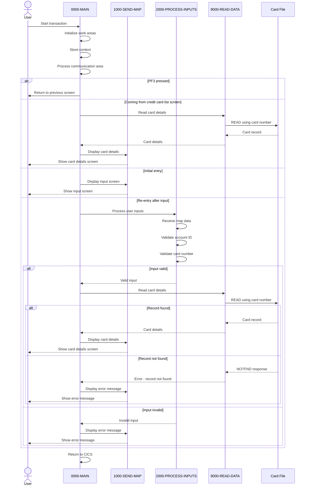

# COCRDSLC

## Overview
This program, COCRDSLC, is a CICS-based business logic component of the CardDemo application that handles credit card detail requests. It allows users to view detailed information about a specific credit card by accepting account and card number inputs. The program retrieves card information from a card data file using the provided identifiers and displays details such as the embossed name, expiration date, and card status.

The program supports navigation from other screens in the application, particularly from the credit card list screen (COCRDLIC), and provides appropriate validation of input parameters. It performs field-level validations to ensure account numbers are 11-digit numeric values and card numbers are 16-digit numeric values. The program handles various error conditions, including invalid inputs and record not found scenarios, displaying appropriate error messages to guide the user.

The application follows a structured approach with clear separation between screen handling, input processing, data retrieval, and error management functions. It integrates with the broader CardDemo application through a common communication area structure and supports standard PF key navigation, including PF3 for returning to the previous screen or main menu.

## Metadata
**Program ID**: `COCRDSLC`

## Sequence Diagram


## Referenced Copybooks
- [`CSDAT01Y`](copybooks/CSDAT01Y.md)
- `COCRDSL`
- [`CVCUS01Y`](copybooks/CVCUS01Y.md)
- `DFHAID`
- [`CVACT01Y`](copybooks/CVACT01Y.md)
- [`CSUSR01Y`](copybooks/CSUSR01Y.md)
- [`COCOM01Y`](copybooks/COCOM01Y.md)
- [`CVCRD01Y`](copybooks/CVCRD01Y.md)
- [`CSSTRPFY`](copybooks/CSSTRPFY.md)
- `DFHBMSCA`
- [`CVACT03Y`](copybooks/CVACT03Y.md)
- [`CVACT02Y`](copybooks/CVACT02Y.md)
- [`COTTL01Y`](copybooks/COTTL01Y.md)
- [`CSMSG02Y`](copybooks/CSMSG02Y.md)
- [`CSMSG01Y`](copybooks/CSMSG01Y.md)

## Environment Division

### INPUT-OUTPUT SECTION
This section would typically contain file-related configuration details for the COCRDSLC program, including file assignments, record descriptions, and access methods for the card data files used in the credit card detail request processing. However, the provided snippet is empty, suggesting that the program may handle all its data access through CICS commands rather than direct file access statements, or that the INPUT-OUTPUT SECTION might be defined elsewhere in the program structure.
<details><summary>Code</summary>
```cobol

```
</details>


## Data Division

### WORKING-STORAGE SECTION
This Working Storage Section defines the data structures used in the COCRDSLC program for handling credit card detail requests. It contains several key components:

1. CICS processing variables for handling responses and transaction IDs
2. Input validation flags for tracking the status of account and card number validations
3. Output edit variables for formatting and processing card details including account ID, card number, CVV code, embossed name, status, and expiration date
4. File handling structures including record identifiers and error message formatting
5. Message construction fields for user feedback, including informational messages and error conditions
6. Program constants and literals defining program names, transaction IDs, mapsets, and file names
7. References to several copybooks that provide additional data structures:
   - CVCRD01Y for card-related data
   - COCOM01Y for application communication area
   - Standard IBM copybooks for CICS functionality
   - Screen layout definitions (COCRDSL)
   - Date handling (CSDAT01Y)
   - Message formatting (CSMSG01Y, CSMSG02Y)
   - User data (CSUSR01Y)
   - Record layouts for cards (CVACT02Y) and customers (CVCUS01Y)

The section includes comprehensive status flags and condition names to track validation states and error conditions throughout the card detail retrieval process.
<details><summary>Code</summary>
```cobol
01  WS-MISC-STORAGE.                                                     
      ******************************************************************        
      * General CICS related                                                    
      ******************************************************************        
         05 WS-CICS-PROCESSNG-VARS.                                             
            07 WS-RESP-CD                          PIC S9(09) COMP              
                                                   VALUE ZEROS.                 
            07 WS-REAS-CD                          PIC S9(09) COMP              
                                                   VALUE ZEROS.                 
            07 WS-TRANID                           PIC X(4)                     
                                                   VALUE SPACES.                
      ******************************************************************        
      *      Input edits                                                        
      ******************************************************************        
                                                                                
         05  WS-INPUT-FLAG                         PIC X(1).                    
           88  INPUT-OK                            VALUE '0'.                   
           88  INPUT-ERROR                         VALUE '1'.                   
           88  INPUT-PENDING                       VALUE LOW-VALUES.            
         05  WS-EDIT-ACCT-FLAG                     PIC X(1).                    
           88  FLG-ACCTFILTER-NOT-OK               VALUE '0'.                   
           88  FLG-ACCTFILTER-ISVALID              VALUE '1'.                   
           88  FLG-ACCTFILTER-BLANK                VALUE ' '.                   
         05  WS-EDIT-CARD-FLAG                     PIC X(1).                    
           88  FLG-CARDFILTER-NOT-OK               VALUE '0'.                   
           88  FLG-CARDFILTER-ISVALID             VALUE '1'.                    
           88  FLG-CARDFILTER-BLANK                VALUE ' '.                   
         05  WS-RETURN-FLAG                        PIC X(1).                    
           88  WS-RETURN-FLAG-OFF                  VALUE LOW-VALUES.            
           88  WS-RETURN-FLAG-ON                   VALUE '1'.                   
         05  WS-PFK-FLAG                           PIC X(1).                    
           88  PFK-VALID                           VALUE '0'.                   
           88  PFK-INVALID                         VALUE '1'.                   
      ******************************************************************        
      * Output edits                                                            
      ******************************************************************        
         05 CICS-OUTPUT-EDIT-VARS.                                              
           10  CARD-ACCT-ID-X                      PIC X(11).                   
           10  CARD-ACCT-ID-N REDEFINES CARD-ACCT-ID-X                          
                                                   PIC 9(11).                   
           10  CARD-CVV-CD-X                       PIC X(03).                   
           10  CARD-CVV-CD-N REDEFINES  CARD-CVV-CD-X                           
                                                   PIC 9(03).                   
           10  CARD-CARD-NUM-X                     PIC X(16).                   
           10  CARD-CARD-NUM-N REDEFINES  CARD-CARD-NUM-X                       
                                                   PIC 9(16).                   
           10  CARD-NAME-EMBOSSED-X                PIC X(50).                   
           10  CARD-STATUS-X                       PIC X.                       
           10  CARD-EXPIRAION-DATE-X               PIC X(10).                   
           10  FILLER REDEFINES CARD-EXPIRAION-DATE-X.                          
               20 CARD-EXPIRY-YEAR                 PIC X(4).                    
               20 FILLER                           PIC X(1).                    
               20 CARD-EXPIRY-MONTH                PIC X(2).                    
               20 FILLER                           PIC X(1).                    
               20 CARD-EXPIRY-DAY                  PIC X(2).                    
           10  CARD-EXPIRAION-DATE-N REDEFINES                                  
               CARD-EXPIRAION-DATE-X               PIC 9(10).                   
                                                                                
      ******************************************************************        
      *      File and data Handling                                             
      ******************************************************************        
         05  WS-CARD-RID.                                                       
           10  WS-CARD-RID-CARDNUM                 PIC X(16).                   
           10  WS-CARD-RID-ACCT-ID                 PIC 9(11).                   
           10  WS-CARD-RID-ACCT-ID-X REDEFINES                                  
                  WS-CARD-RID-ACCT-ID              PIC X(11).                   
         05  WS-FILE-ERROR-MESSAGE.                                             
           10  FILLER                              PIC X(12)                    
                                                   VALUE 'File Error: '.        
           10  ERROR-OPNAME                        PIC X(8)                     
                                                   VALUE SPACES.                
           10  FILLER                              PIC X(4)                     
                                                   VALUE ' on '.                
           10  ERROR-FILE                          PIC X(9)                     
                                                   VALUE SPACES.                
           10  FILLER                              PIC X(15)                    
                                                   VALUE                        
                                                   ' returned RESP '.           
           10  ERROR-RESP                          PIC X(10)                    
                                                   VALUE SPACES.                
           10  FILLER                              PIC X(7)                     
                                                   VALUE ',RESP2 '.             
           10  ERROR-RESP2                         PIC X(10)                    
                                                   VALUE SPACES.                
          10  FILLER                               PIC X(5)                     
                                                   VALUE SPACES.                
      ******************************************************************        
      *      Output Message Construction                                        
      ******************************************************************        
         05  WS-LONG-MSG                           PIC X(500).                  
         05  WS-INFO-MSG                           PIC X(40).                   
           88  WS-NO-INFO-MESSAGE                 VALUES                        
                                                  SPACES LOW-VALUES.            
           88  FOUND-CARDS-FOR-ACCOUNT             VALUE                        
               '   Displaying requested details'.                               
           88  WS-PROMPT-FOR-INPUT                 VALUE                        
               'Please enter Account and Card Number'.                          
                                                                                
         05  WS-RETURN-MSG                         PIC X(75).                   
           88  WS-RETURN-MSG-OFF                   VALUE SPACES.                
           88  WS-EXIT-MESSAGE                     VALUE                        
               'PF03 pressed.Exiting              '.                            
           88  WS-PROMPT-FOR-ACCT                  VALUE                        
               'Account number not provided'.                                   
           88  WS-PROMPT-FOR-CARD                  VALUE                        
               'Card number not provided'.                                      
           88  NO-SEARCH-CRITERIA-RECEIVED         VALUE                        
               'No input received'.                                             
           88  SEARCHED-ACCT-ZEROES                VALUE                        
               'Account number must be a non zero 11 digit number'.             
           88  SEARCHED-ACCT-NOT-NUMERIC           VALUE                        
               'Account number must be a non zero 11 digit number'.             
           88  SEARCHED-CARD-NOT-NUMERIC           VALUE                        
               'Card number if supplied must be a 16 digit number'.             
                                                                                
           88  DID-NOT-FIND-ACCT-IN-CARDXREF       VALUE                        
               'Did not find this account in cards database'.                   
           88  DID-NOT-FIND-ACCTCARD-COMBO         VALUE                        
               'Did not find cards for this search condition'.                  
           88  XREF-READ-ERROR                     VALUE                        
               'Error reading Card Data File'.                                  
           88  CODING-TO-BE-DONE                   VALUE                        
               'Looks Good.... so far'.                                         
      ******************************************************************        
      *      Literals and Constants                                             
      ******************************************************************        
       01 WS-LITERALS.                                                          
          05 LIT-THISPGM                           PIC X(8)                     
                                                   VALUE 'COCRDSLC'.            
          05 LIT-THISTRANID                        PIC X(4)                     
                                                   VALUE 'CCDL'.                
          05 LIT-THISMAPSET                        PIC X(8)                     
                                                   VALUE 'COCRDSL '.            
          05 LIT-THISMAP                           PIC X(7)                     
                                                   VALUE 'CCRDSLA'.             
          05 LIT-CCLISTPGM                         PIC X(8)                     
                                                   VALUE 'COCRDLIC'.            
          05 LIT-CCLISTTRANID                      PIC X(4)                     
                                                   VALUE 'CCLI'.                
          05 LIT-CCLISTMAPSET                      PIC X(7)                     
                                                   VALUE 'COCRDLI'.             
          05 LIT-CCLISTMAP                         PIC X(7)                     
                                                   VALUE 'CCRDSLA'.             
          05 LIT-MENUPGM                           PIC X(8)                     
                                                   VALUE 'COMEN01C'.            
          05 LIT-MENUTRANID                        PIC X(4)                     
                                                   VALUE 'CM00'.                
          05 LIT-MENUMAPSET                        PIC X(7)                     
                                                   VALUE 'COMEN01'.             
          05 LIT-MENUMAP                           PIC X(7)                     
                                                   VALUE 'COMEN1A'.             
          05 LIT-CARDFILENAME                      PIC X(8)                     
                                                   VALUE 'CARDDAT '.            
          05 LIT-CARDFILENAME-ACCT-PATH            PIC X(8)                     
                                                   VALUE 'CARDAIX '.            
      ******************************************************************        
      *Other common working storage Variables                                   
      ******************************************************************        
       COPY CVCRD01Y.                                                           
                                                                                
      ******************************************************************        
      *Application Commmarea Copybook                                           
       COPY COCOM01Y.                                                           
                                                                                
       01 WS-THIS-PROGCOMMAREA.                                                 
          05 CA-CALL-CONTEXT.                                                   
             10 CA-FROM-PROGRAM                    PIC X(08).                   
             10 CA-FROM-TRANID                     PIC X(04).                   
                                                                                
       01  WS-COMMAREA                             PIC X(2000).                 
                                                                                
      *IBM SUPPLIED COPYBOOKS                                                   
       COPY DFHBMSCA.                                                           
       COPY DFHAID.                                                             
                                                                                
      *COMMON COPYBOOKS                                                         
      *Screen Titles                                                            
       COPY COTTL01Y.                                                           
      *Credit Card Search Screen Layout                                         
       COPY COCRDSL.                                                            
                                                                                
      *Current Date                                                             
       COPY CSDAT01Y.                                                           
                                                                                
      *Common Messages                                                          
       COPY CSMSG01Y.                                                           
                                                                                
      *Abend Variables                                                          
       COPY CSMSG02Y.                                                           
                                                                                
      *Signed on user data                                                      
       COPY CSUSR01Y.                                                           
                                                                                
      *Dataset layouts                                                          
      *ACCOUNT RECORD LAYOUT                                                    
      *COPY CVACT01Y.                                                           
                                                                                
      *CARD RECORD LAYOUT                                                       
       COPY CVACT02Y.                                                           
                                                                                
      *CARD XREF LAYOUT                                                         
      *COPY CVACT03Y.                                                           
                                                                                
      *CUSTOMER LAYOUT                                                          
       COPY CVCUS01Y.
```
</details>


### LINKAGE SECTION
This section defines the DFHCOMMAREA in the Linkage Section, which is the standard CICS communication area used to pass data between programs. It contains a single field defined as a variable-length array of characters that can expand from 1 to 32,767 bytes depending on the actual length passed (EIBCALEN). This flexible structure allows the program to receive communication data of varying sizes from calling programs within the CardDemo application.
<details><summary>Code</summary>
```cobol
01  DFHCOMMAREA.                                                         
         05  FILLER                                PIC X(1)                     
             OCCURS 1 TO 32767 TIMES DEPENDING ON EIBCALEN.
```
</details>


## Procedure Division

### 0000-MAIN
This paragraph serves as the main control flow for the COCRDSLC program, handling program initialization, navigation, and processing logic. It begins by setting up error handling through CICS HANDLE ABEND and initializing work areas. The code then preserves program context, processes any passed communication area data, and validates function key inputs (accepting only ENTER and PF3).

The core of the paragraph is an EVALUATE statement that directs program flow based on user actions:
- When PF3 is pressed, it transfers control back to the calling program or main menu
- When entering from the credit card list screen (COCRDLIC), it processes the already validated account and card numbers
- When entering from other contexts, it displays the initial input screen
- When re-entering after input, it validates the data, reads card details if valid, and redisplays the screen

The paragraph implements navigation logic between screens in the CardDemo application, maintaining context through the communication area. It also includes error handling to ensure appropriate messages are displayed when validation fails or unexpected conditions occur.
<details><summary>Code</summary>
```cobol
EXEC CICS HANDLE ABEND                                               
                     LABEL(ABEND-ROUTINE)                                       
           END-EXEC                                                             
                                                                                
           INITIALIZE CC-WORK-AREA                                              
                      WS-MISC-STORAGE                                           
                      WS-COMMAREA                                               
      *****************************************************************         
      * Store our context                                                       
      *****************************************************************         
           MOVE LIT-THISTRANID       TO WS-TRANID                               
      *****************************************************************         
      * Ensure error message is cleared                               *         
      *****************************************************************         
           SET WS-RETURN-MSG-OFF  TO TRUE                                       
      *****************************************************************         
      * Store passed data if  any                *                              
      *****************************************************************         
           IF EIBCALEN IS EQUAL TO 0                                            
               OR (CDEMO-FROM-PROGRAM = LIT-MENUPGM
               AND NOT CDEMO-PGM-REENTER)                               
              INITIALIZE CARDDEMO-COMMAREA                                      
                         WS-THIS-PROGCOMMAREA                                   
           ELSE                                                                 
              MOVE DFHCOMMAREA (1:LENGTH OF CARDDEMO-COMMAREA)  TO              
                                CARDDEMO-COMMAREA                               
              MOVE DFHCOMMAREA(LENGTH OF CARDDEMO-COMMAREA + 1:                 
                               LENGTH OF WS-THIS-PROGCOMMAREA ) TO              
                                WS-THIS-PROGCOMMAREA                            
           END-IF                                                               
      *****************************************************************         
      * Remap PFkeys as needed.                                                 
      * Store the Mapped PF Key                                                 
      *****************************************************************         
           PERFORM YYYY-STORE-PFKEY                                             
              THRU YYYY-STORE-PFKEY-EXIT                                        
      *****************************************************************         
      * Check the AID to see if its valid at this point               *         
      * F3 - Exit                                                               
      * Enter show screen again                                                 
      *****************************************************************         
           SET PFK-INVALID TO TRUE                                              
           IF CCARD-AID-ENTER OR                                                
              CCARD-AID-PFK03                                                   
              SET PFK-VALID TO TRUE                                             
           END-IF                                                               
                                                                                
           IF PFK-INVALID                                                       
              SET CCARD-AID-ENTER TO TRUE                                       
           END-IF                                                               
                                                                                
      *****************************************************************         
      * Decide what to do based on inputs received                              
      *****************************************************************         
           EVALUATE TRUE                                                        
              WHEN CCARD-AID-PFK03                                              
      ******************************************************************        
      *            XCTL TO CALLING PROGRAM OR MAIN MENU                         
      ******************************************************************        
                   IF CDEMO-FROM-TRANID    EQUAL LOW-VALUES                     
                   OR CDEMO-FROM-TRANID    EQUAL SPACES                         
                      MOVE LIT-MENUTRANID  TO CDEMO-TO-TRANID                   
                   ELSE                                                         
                      MOVE CDEMO-FROM-TRANID  TO CDEMO-TO-TRANID                
                   END-IF                                                       
                                                                                
                   IF CDEMO-FROM-PROGRAM   EQUAL LOW-VALUES                     
                   OR CDEMO-FROM-PROGRAM   EQUAL SPACES                         
                      MOVE LIT-MENUPGM     TO CDEMO-TO-PROGRAM                  
                   ELSE                                                         
                      MOVE CDEMO-FROM-PROGRAM TO CDEMO-TO-PROGRAM               
                   END-IF                                                       
                                                                                
                   MOVE LIT-THISTRANID     TO CDEMO-FROM-TRANID                 
                   MOVE LIT-THISPGM        TO CDEMO-FROM-PROGRAM                
                                                                                
                   SET  CDEMO-USRTYP-USER  TO TRUE                              
                   SET  CDEMO-PGM-ENTER    TO TRUE                              
                   MOVE LIT-THISMAPSET     TO CDEMO-LAST-MAPSET                 
                   MOVE LIT-THISMAP        TO CDEMO-LAST-MAP                    
      *                                                                         
                   EXEC CICS XCTL                                               
                             PROGRAM (CDEMO-TO-PROGRAM)                         
                             COMMAREA(CARDDEMO-COMMAREA)                        
                   END-EXEC                                                     
      ******************************************************************        
      *            COMING FROM CREDIT CARD LIST SCREEN                          
      *            SELECTION CRITERIA ALREADY VALIDATED                         
      ******************************************************************        
              WHEN CDEMO-PGM-ENTER                                              
               AND CDEMO-FROM-PROGRAM  EQUAL LIT-CCLISTPGM                      
                   SET INPUT-OK TO TRUE                                         
                   MOVE CDEMO-ACCT-ID       TO CC-ACCT-ID-N                     
                   MOVE CDEMO-CARD-NUM      TO CC-CARD-NUM-N                    
                   PERFORM 9000-READ-DATA                                       
                      THRU 9000-READ-DATA-EXIT                                  
                   PERFORM 1000-SEND-MAP                                        
                     THRU 1000-SEND-MAP-EXIT                                    
                   GO TO COMMON-RETURN                                          
              WHEN CDEMO-PGM-ENTER                                              
      ******************************************************************        
      *            COMING FROM SOME OTHER CONTEXT                               
      *            SELECTION CRITERIA TO BE GATHERED                            
      ******************************************************************        
                   PERFORM 1000-SEND-MAP THRU                                   
                           1000-SEND-MAP-EXIT                                   
                   GO TO COMMON-RETURN                                          
              WHEN CDEMO-PGM-REENTER                                            
                   PERFORM 2000-PROCESS-INPUTS                                  
                      THRU 2000-PROCESS-INPUTS-EXIT                             
                   IF INPUT-ERROR                                               
                      PERFORM 1000-SEND-MAP                                     
                         THRU 1000-SEND-MAP-EXIT                                
                      GO TO COMMON-RETURN                                       
                   ELSE                                                         
                      PERFORM 9000-READ-DATA                                    
                         THRU 9000-READ-DATA-EXIT                               
                      PERFORM 1000-SEND-MAP                                     
                         THRU 1000-SEND-MAP-EXIT                                
                      GO TO COMMON-RETURN                                       
                                                                                
                   END-IF                                                       
                                                                                
              WHEN OTHER                                                        
                   MOVE LIT-THISPGM    TO ABEND-CULPRIT                         
                   MOVE '0001'         TO ABEND-CODE                            
                   MOVE SPACES         TO ABEND-REASON                          
                   MOVE 'UNEXPECTED DATA SCENARIO'                              
                                       TO WS-RETURN-MSG                         
                   PERFORM SEND-PLAIN-TEXT                                      
                      THRU SEND-PLAIN-TEXT-EXIT                                 
           END-EVALUATE                                                         
                                                                                
                                                                                
      * If we had an error setup error message that slipped through             
      * Display and return                                                      
           IF INPUT-ERROR                                                       
              MOVE WS-RETURN-MSG  TO CCARD-ERROR-MSG                            
              PERFORM 1000-SEND-MAP                                             
                 THRU 1000-SEND-MAP-EXIT                                        
              GO TO COMMON-RETURN                                               
           END-IF                                                               
           .
```
</details>


### COMMON-RETURN
This paragraph handles the common return logic for the program, preparing the communication area before returning control to CICS. It first moves any return message to the error message field in the card data structure. Then it constructs a composite communication area by copying the standard CardDemo communication area to the working storage area, followed by appending this program's specific communication area data. Finally, it executes a CICS RETURN command that specifies the same transaction ID for continuation, passes the constructed communication area, and specifies its length. This ensures that both application-wide and program-specific context is preserved when control returns to the user or when the transaction is restarted.
<details><summary>Code</summary>
```cobol
MOVE WS-RETURN-MSG     TO CCARD-ERROR-MSG                            
                                                                                
           MOVE  CARDDEMO-COMMAREA    TO WS-COMMAREA                            
           MOVE  WS-THIS-PROGCOMMAREA TO                                        
                  WS-COMMAREA(LENGTH OF CARDDEMO-COMMAREA + 1:                  
                               LENGTH OF WS-THIS-PROGCOMMAREA )                 
                                                                                
           EXEC CICS RETURN                                                     
                TRANSID (LIT-THISTRANID)                                        
                COMMAREA (WS-COMMAREA)                                          
                LENGTH(LENGTH OF WS-COMMAREA)                                   
           END-EXEC                                                             
           .
```
</details>


### 0000-MAIN-EXIT
This paragraph serves as the exit point for the program, marking the end of a logical processing block. It's a standard COBOL construct used to terminate the current paragraph's execution and return control to the calling routine.
<details><summary>Code</summary>
```cobol
EXIT                                                                 
           .
```
</details>


### 1000-SEND-MAP
This paragraph orchestrates the process of preparing and sending the credit card detail screen to the user. It follows a structured sequence by first initializing the screen (1100-SCREEN-INIT), then setting up the screen variables with appropriate data values (1200-SETUP-SCREEN-VARS), configuring the screen attributes for proper display formatting (1300-SETUP-SCREEN-ATTRS), and finally sending the completed screen to the terminal (1400-SEND-SCREEN). This modular approach separates the different aspects of screen preparation and display into distinct, reusable components.
<details><summary>Code</summary>
```cobol
PERFORM 1100-SCREEN-INIT                                             
              THRU 1100-SCREEN-INIT-EXIT                                        
           PERFORM 1200-SETUP-SCREEN-VARS                                       
              THRU 1200-SETUP-SCREEN-VARS-EXIT                                  
           PERFORM 1300-SETUP-SCREEN-ATTRS                                      
              THRU 1300-SETUP-SCREEN-ATTRS-EXIT                                 
           PERFORM 1400-SEND-SCREEN                                             
              THRU 1400-SEND-SCREEN-EXIT                                        
           .
```
</details>


### 1000-SEND-MAP-EXIT
This paragraph serves as an exit point for the SEND-MAP routine in the COCRDSLC program. It marks the end of the map sending process and provides a clean return point for control flow when the program has completed displaying the credit card details screen to the user.
<details><summary>Code</summary>
```cobol
EXIT                                                                 
           .
```
</details>


### 1100-SCREEN-INIT
This paragraph initializes the screen display for the credit card detail screen. It clears the output area by setting it to LOW-VALUES, then retrieves the current date and time. The paragraph populates the screen header with application titles from the communication area, sets the transaction ID and program name, and formats the current date (MM/DD/YY) and time (HH:MM:SS) for display in the screen header. This establishes the standard header information that appears at the top of the screen before any card-specific data is displayed.
<details><summary>Code</summary>
```cobol
MOVE LOW-VALUES TO CCRDSLAO                                          
                                                                                
           MOVE FUNCTION CURRENT-DATE  TO WS-CURDATE-DATA                       
                                                                                
           MOVE CCDA-TITLE01           TO TITLE01O OF CCRDSLAO                  
           MOVE CCDA-TITLE02           TO TITLE02O OF CCRDSLAO                  
           MOVE LIT-THISTRANID         TO TRNNAMEO OF CCRDSLAO                  
           MOVE LIT-THISPGM            TO PGMNAMEO OF CCRDSLAO                  
                                                                                
           MOVE FUNCTION CURRENT-DATE  TO WS-CURDATE-DATA                       
                                                                                
           MOVE WS-CURDATE-MONTH       TO WS-CURDATE-MM                         
           MOVE WS-CURDATE-DAY         TO WS-CURDATE-DD                         
           MOVE WS-CURDATE-YEAR(3:2)   TO WS-CURDATE-YY                         
                                                                                
           MOVE WS-CURDATE-MM-DD-YY    TO CURDATEO OF CCRDSLAO                  
                                                                                
           MOVE WS-CURTIME-HOURS       TO WS-CURTIME-HH                         
           MOVE WS-CURTIME-MINUTE      TO WS-CURTIME-MM                         
           MOVE WS-CURTIME-SECOND      TO WS-CURTIME-SS                         
                                                                                
           MOVE WS-CURTIME-HH-MM-SS    TO CURTIMEO OF CCRDSLAO                  
                                                                                
           .
```
</details>


### 1100-SCREEN-INIT-EXIT
This paragraph serves as an exit point for the screen initialization routine in the COCRDSLC program. It marks the end of the screen initialization process and allows the program flow to return to the calling section.
<details><summary>Code</summary>
```cobol
EXIT                                                                 
           .
```
</details>


### 1200-SETUP-SCREEN-VARS
This paragraph initializes and populates the screen variables for the credit card detail display. It first checks if the program was called with parameters (EIBCALEN). If not, it sets a prompt for user input. Otherwise, it processes the incoming account and card information, transferring values from the communication area to the screen fields. When account or card numbers are zero, it sets the corresponding screen fields to LOW-VALUES. If card data was successfully found (FOUND-CARDS-FOR-ACCOUNT), it populates the display fields with card details including the embossed name, expiration date (split into month and year components), and card status. The paragraph concludes by setting appropriate informational or error messages on the screen based on the processing status.
<details><summary>Code</summary>
```cobol
*    INITIALIZE SEARCH CRITERIA                                           
           IF EIBCALEN = 0                                                      
              SET  WS-PROMPT-FOR-INPUT TO TRUE                                  
           ELSE                                                                 
              IF CDEMO-ACCT-ID = 0                                              
                 MOVE LOW-VALUES   TO ACCTSIDO OF CCRDSLAO                      
              ELSE                                                              
                 MOVE CC-ACCT-ID   TO ACCTSIDO OF CCRDSLAO                      
              END-IF                                                            
                                                                                
              IF CDEMO-CARD-NUM = 0                                             
                MOVE LOW-VALUES   TO CARDSIDO OF CCRDSLAO                       
              ELSE                                                              
                MOVE CC-CARD-NUM  TO CARDSIDO OF CCRDSLAO                       
              END-IF                                                            
                                                                                
              IF FOUND-CARDS-FOR-ACCOUNT                                        
                 MOVE CARD-EMBOSSED-NAME                                        
                                        TO CRDNAMEO OF CCRDSLAO                 
                 MOVE CARD-EXPIRAION-DATE                                       
                                        TO CARD-EXPIRAION-DATE-X                
                                                                                
                 MOVE CARD-EXPIRY-MONTH TO EXPMONO  OF CCRDSLAO                 
                                                                                
                 MOVE CARD-EXPIRY-YEAR  TO EXPYEARO OF CCRDSLAO                 
                                                                                
                 MOVE CARD-ACTIVE-STATUS TO CRDSTCDO OF CCRDSLAO                
              END-IF                                                            
            END-IF                                                              
                                                                                
                                                                                
      *    SETUP MESSAGE                                                        
           IF WS-NO-INFO-MESSAGE                                                
             SET WS-PROMPT-FOR-INPUT TO TRUE                                    
           END-IF                                                               
                                                                                
           MOVE WS-RETURN-MSG          TO ERRMSGO OF CCRDSLAO                   
                                                                                
           MOVE WS-INFO-MSG            TO INFOMSGO OF CCRDSLAO                  
           .
```
</details>


### 1200-SETUP-SCREEN-VARS-EXIT
This paragraph serves as an exit point for the 1200-SETUP-SCREEN-VARS routine. It marks the end of the screen variable setup process in the COCRDSLC program, allowing the program flow to return to the calling section after screen variables have been properly initialized or configured.
<details><summary>Code</summary>
```cobol
EXIT                                                                 
           .
```
</details>


### 1300-SETUP-SCREEN-ATTRS
This paragraph configures the screen attributes for the credit card detail screen based on context and validation results. It determines whether input fields should be protected or unprotected depending on navigation flow - protecting fields when coming from the card list screen and making them editable otherwise. The paragraph handles cursor positioning logic, placing the cursor on the first field with an error or defaulting to the account ID field. It also manages color attributes for fields, highlighting validation errors in red, marking required fields with an asterisk when blank on reentry, and setting appropriate colors for information messages. This creates a user-friendly interface that guides users through error correction and data entry.
<details><summary>Code</summary>
```cobol
*    PROTECT OR UNPROTECT BASED ON CONTEXT                                
           IF  CDEMO-LAST-MAPSET  EQUAL LIT-CCLISTMAPSET 
           AND CDEMO-FROM-PROGRAM EQUAL LIT-CCLISTPGM                           
              MOVE DFHBMPRF     TO ACCTSIDA OF CCRDSLAI                         
              MOVE DFHBMPRF     TO CARDSIDA OF CCRDSLAI                         
           ELSE                                                                 
              MOVE DFHBMFSE      TO ACCTSIDA OF CCRDSLAI                        
              MOVE DFHBMFSE      TO CARDSIDA OF CCRDSLAI                        
           END-IF                                                               
                                                                                
      *    POSITION CURSOR                                                      
           EVALUATE TRUE                                                        
              WHEN FLG-ACCTFILTER-NOT-OK                                        
              WHEN FLG-ACCTFILTER-BLANK                                         
                   MOVE -1             TO ACCTSIDL OF CCRDSLAI                  
              WHEN FLG-CARDFILTER-NOT-OK                                        
              WHEN FLG-CARDFILTER-BLANK                                         
                   MOVE -1             TO CARDSIDL OF CCRDSLAI                  
              WHEN OTHER                                                        
                   MOVE -1             TO ACCTSIDL OF CCRDSLAI                  
           END-EVALUATE                                                         
                                                                                
      *    SETUP COLOR                                                          
           IF  CDEMO-LAST-MAPSET   EQUAL LIT-CCLISTMAPSET
           AND CDEMO-FROM-PROGRAM  EQUAL LIT-CCLISTPGM                          
              MOVE DFHDFCOL     TO ACCTSIDC OF CCRDSLAO                         
              MOVE DFHDFCOL     TO CARDSIDC OF CCRDSLAO                         
           END-IF                                                               
                                                                                
           IF FLG-ACCTFILTER-NOT-OK                                             
              MOVE DFHRED              TO ACCTSIDC OF CCRDSLAO                  
           END-IF                                                               
                                                                                
           IF FLG-CARDFILTER-NOT-OK                                             
              MOVE DFHRED              TO CARDSIDC OF CCRDSLAO                  
           END-IF                                                               
                                                                                
           IF  FLG-ACCTFILTER-BLANK                                             
           AND CDEMO-PGM-REENTER                                                
               MOVE '*'                TO ACCTSIDO OF CCRDSLAO                  
               MOVE DFHRED             TO ACCTSIDC OF CCRDSLAO                  
           END-IF                                                               
                                                                                
           IF  FLG-CARDFILTER-BLANK                                             
           AND CDEMO-PGM-REENTER                                                
               MOVE '*'                TO CARDSIDO OF CCRDSLAO                  
               MOVE DFHRED             TO CARDSIDC OF CCRDSLAO                  
           END-IF                                                               
                                                                                
           IF  WS-NO-INFO-MESSAGE                                               
               MOVE DFHBMDAR           TO INFOMSGC OF CCRDSLAO                  
           ELSE                                                                 
               MOVE DFHNEUTR           TO INFOMSGC OF CCRDSLAO                  
           END-IF                                                               
           .
```
</details>


### 1300-SETUP-SCREEN-ATTRS-EXIT
This paragraph serves as an exit point for the screen attribute setup routine in the COCRDSLC program. It marks the end of the 1300-SETUP-SCREEN-ATTRS section, allowing the program to return control to the calling section after screen attributes have been configured for the credit card detail display.
<details><summary>Code</summary>
```cobol
EXIT.
```
</details>


### 1400-SEND-SCREEN
This paragraph handles the screen display functionality for the credit card detail screen. It sets up the next map and mapset values in the common communication area, indicating the program should be re-entered after the screen is displayed. The paragraph then uses a CICS SEND MAP command to display the screen to the user, positioning the cursor appropriately, clearing the previous screen content (ERASE), and freeing the keyboard for user input. The response code from this operation is captured in WS-RESP-CD for potential error handling.
<details><summary>Code</summary>
```cobol
MOVE LIT-THISMAPSET         TO CCARD-NEXT-MAPSET                     
           MOVE LIT-THISMAP            TO CCARD-NEXT-MAP                        
           SET  CDEMO-PGM-REENTER TO TRUE                                       
                                                                                
           EXEC CICS SEND MAP(CCARD-NEXT-MAP)                                   
                          MAPSET(CCARD-NEXT-MAPSET)                             
                          FROM(CCRDSLAO)                                        
                          CURSOR                                                
                          ERASE                                                 
                          FREEKB                                                
                          RESP(WS-RESP-CD)                                      
           END-EXEC                                                             
           .
```
</details>


### 1400-SEND-SCREEN-EXIT
This paragraph serves as an exit point for the SEND-SCREEN routine in the COCRDSLC program. It provides a clean termination point for the screen display logic, allowing the program to return control to the calling routine after the credit card detail screen has been formatted and sent to the user terminal.
<details><summary>Code</summary>
```cobol
EXIT                                                                 
           .
```
</details>


### 2000-PROCESS-INPUTS
This paragraph handles the initial processing of user inputs from the screen. It first receives the map data from the user interface, then validates the input fields through the edit map inputs routine. After validation, it sets up the communication area with any error messages generated during validation and prepares for the next screen interaction by setting the program, mapset, and map names to the current program's values, ensuring the application will return to this same screen after processing.
<details><summary>Code</summary>
```cobol
PERFORM 2100-RECEIVE-MAP                                             
              THRU 2100-RECEIVE-MAP-EXIT                                        
           PERFORM 2200-EDIT-MAP-INPUTS                                         
              THRU 2200-EDIT-MAP-INPUTS-EXIT                                    
           MOVE WS-RETURN-MSG  TO CCARD-ERROR-MSG                               
           MOVE LIT-THISPGM    TO CCARD-NEXT-PROG                               
           MOVE LIT-THISMAPSET TO CCARD-NEXT-MAPSET                             
           MOVE LIT-THISMAP    TO CCARD-NEXT-MAP                                
           .
```
</details>


### 2000-PROCESS-INPUTS-EXIT
This paragraph serves as an exit point for the 2000-PROCESS-INPUTS section, marking the end of input processing logic. It provides a clean termination point for the section that handles validation and processing of account and card number inputs in the credit card detail request flow.
<details><summary>Code</summary>
```cobol
EXIT                                                                 
           .
```
</details>


### 2100-RECEIVE-MAP
This paragraph receives user input from the screen map named in LIT-THISMAP within the mapset LIT-THISMAPSET. The data is stored in the CCRDSLAI structure, which likely contains the fields displayed on the credit card detail screen. The paragraph captures both response and reason codes in WS-RESP-CD and WS-REAS-CD respectively, which will be used elsewhere in the program to determine if the receive operation was successful or to handle any errors that occurred during the operation.
<details><summary>Code</summary>
```cobol
EXEC CICS RECEIVE MAP(LIT-THISMAP)                                   
                     MAPSET(LIT-THISMAPSET)                                     
                     INTO(CCRDSLAI)                                             
                     RESP(WS-RESP-CD)                                           
                     RESP2(WS-REAS-CD)                                          
           END-EXEC                                                             
           .
```
</details>


### 2100-RECEIVE-MAP-EXIT
This paragraph serves as an exit point for the RECEIVE-MAP routine in the COCRDSLC program. It marks the end of the map receiving process where user input from the credit card detail screen is captured. The paragraph contains only the EXIT statement, which transfers control back to the calling routine after the map receiving operations are complete.
<details><summary>Code</summary>
```cobol
EXIT                                                                 
           .
```
</details>


### 2200-EDIT-MAP-INPUTS
This paragraph processes and validates user input from the credit card detail screen. It first sets flags to indicate valid input status, then handles the account ID and card number fields by converting asterisks or spaces to low-values (which indicates no filter). The code then performs individual field validation by calling separate paragraphs for account and card number validation. Finally, it performs cross-field validation to determine if no search criteria were provided (both fields blank). This validation logic ensures proper input formatting before attempting to retrieve card details from the database.
<details><summary>Code</summary>
```cobol
SET INPUT-OK                  TO TRUE                                
           SET FLG-CARDFILTER-ISVALID    TO TRUE                                
           SET FLG-ACCTFILTER-ISVALID    TO TRUE                                
                                                                                
      *    REPLACE * WITH LOW-VALUES                                            
           IF  ACCTSIDI OF CCRDSLAI = '*'                                       
           OR  ACCTSIDI OF CCRDSLAI = SPACES                                    
               MOVE LOW-VALUES           TO  CC-ACCT-ID                         
           ELSE                                                                 
               MOVE ACCTSIDI OF CCRDSLAI TO  CC-ACCT-ID                         
           END-IF                                                               
                                                                                
           IF  CARDSIDI OF CCRDSLAI = '*'                                       
           OR  CARDSIDI OF CCRDSLAI = SPACES                                    
               MOVE LOW-VALUES           TO  CC-CARD-NUM                        
           ELSE                                                                 
               MOVE CARDSIDI OF CCRDSLAI TO  CC-CARD-NUM                        
           END-IF                                                               
                                                                                
      *    INDIVIDUAL FIELD EDITS                                               
           PERFORM 2210-EDIT-ACCOUNT                                            
              THRU 2210-EDIT-ACCOUNT-EXIT                                       
                                                                                
           PERFORM 2220-EDIT-CARD                                               
              THRU 2220-EDIT-CARD-EXIT                                          
                                                                                
      *    CROSS FIELD EDITS                                                    
           IF  FLG-ACCTFILTER-BLANK                                             
           AND FLG-CARDFILTER-BLANK                                             
               SET NO-SEARCH-CRITERIA-RECEIVED TO TRUE                          
           END-IF                                                               
           .
```
</details>


### 2200-EDIT-MAP-INPUTS-EXIT
This paragraph serves as an exit point for the 2200-EDIT-MAP-INPUTS routine. It marks the end of the input validation logic for the credit card detail screen, allowing the program flow to return to the calling section after input field validation is complete.
<details><summary>Code</summary>
```cobol
EXIT                                                                 
           .
```
</details>


### 2210-EDIT-ACCOUNT
This paragraph validates the account ID input field for the credit card detail screen. It performs several checks: first determining if the account ID is empty (blank, low-values, or zeros), in which case it sets an input error flag and prompts the user for an account number. Next, it verifies that the account ID is both numeric and 11 digits in length. If these validations fail, it sets appropriate error flags and generates an error message. When the account ID passes all validations, it moves the value to the CDEMO-ACCT-ID field and sets a flag indicating the account filter is valid. The paragraph uses control flags to manage error handling and conditional message display based on the application's current state.
<details><summary>Code</summary>
```cobol
SET FLG-ACCTFILTER-NOT-OK TO TRUE                                    
                                                                                
      *    Not supplied                                                         
           IF CC-ACCT-ID   EQUAL LOW-VALUES                                     
           OR CC-ACCT-ID   EQUAL SPACES                                         
           OR CC-ACCT-ID-N EQUAL ZEROS                                          
              SET INPUT-ERROR           TO TRUE                                 
              SET FLG-ACCTFILTER-BLANK  TO TRUE                                 
              IF WS-RETURN-MSG-OFF                                              
                 SET WS-PROMPT-FOR-ACCT TO TRUE                                 
              END-IF                                                            
              MOVE ZEROES       TO CDEMO-ACCT-ID                                
              GO TO  2210-EDIT-ACCOUNT-EXIT                                     
           END-IF                                                               
      *                                                                         
      *    Not numeric                                                          
      *    Not 11 characters                                                    
           IF CC-ACCT-ID  IS NOT NUMERIC                                        
              SET INPUT-ERROR TO TRUE                                           
              SET FLG-ACCTFILTER-NOT-OK TO TRUE                                 
              IF WS-RETURN-MSG-OFF                                              
                MOVE                                                            
              'ACCOUNT FILTER,IF SUPPLIED MUST BE A 11 DIGIT NUMBER'            
                              TO WS-RETURN-MSG                                  
              END-IF                                                            
              MOVE ZERO       TO CDEMO-ACCT-ID                                  
              GO TO 2210-EDIT-ACCOUNT-EXIT                                      
           ELSE                                                                 
              MOVE CC-ACCT-ID TO CDEMO-ACCT-ID                                  
              SET FLG-ACCTFILTER-ISVALID TO TRUE                                
           END-IF                                                               
           .
```
</details>


### 2210-EDIT-ACCOUNT-EXIT
This paragraph serves as an exit point for the account number validation routine. It marks the end of the account number editing process, allowing the program to continue with the next processing step after account validation is complete.
<details><summary>Code</summary>
```cobol
EXIT                                                                 
           .
```
</details>


### 2220-EDIT-CARD
This paragraph validates the credit card number input in the card detail request screen. It performs several checks: first, it verifies if the card number was provided at all (checking for spaces, low-values, or zeros). If the card number is missing, it sets appropriate error flags, prompts the user to enter a card number (if message display is enabled), and exits the validation routine. If a card number was entered, it then checks if the value is numeric and 16 digits long. When the input fails this validation, it sets error flags and displays a message informing the user that the card ID must be a 16-digit number. If the card number passes all validations, it moves the numeric value to the CDEMO-CARD-NUM field and sets a flag indicating the card filter is valid. This validation is critical for ensuring proper record retrieval from the card data file.
<details><summary>Code</summary>
```cobol
*    Not numeric                                                          
      *    Not 16 characters                                                    
           SET FLG-CARDFILTER-NOT-OK TO TRUE                                    
                                                                                
      *    Not supplied                                                         
           IF CC-CARD-NUM   EQUAL LOW-VALUES                                    
           OR CC-CARD-NUM   EQUAL SPACES                                        
           OR CC-CARD-NUM-N EQUAL ZEROS                                         
              SET INPUT-ERROR           TO TRUE                                 
              SET FLG-CARDFILTER-BLANK  TO TRUE                                 
              IF WS-RETURN-MSG-OFF                                              
                 SET WS-PROMPT-FOR-CARD TO TRUE                                 
              END-IF                                                            
                                                                                
              MOVE ZEROES       TO CDEMO-CARD-NUM                               
              GO TO  2220-EDIT-CARD-EXIT                                        
           END-IF                                                               
      *                                                                         
      *    Not numeric                                                          
      *    Not 16 characters                                                    
           IF CC-CARD-NUM  IS NOT NUMERIC                                       
              SET INPUT-ERROR TO TRUE                                           
              SET FLG-CARDFILTER-NOT-OK TO TRUE                                 
              IF WS-RETURN-MSG-OFF                                              
                 MOVE                                                           
              'CARD ID FILTER,IF SUPPLIED MUST BE A 16 DIGIT NUMBER'            
                              TO WS-RETURN-MSG                                  
              END-IF                                                            
              MOVE ZERO       TO CDEMO-CARD-NUM                                 
              GO TO 2220-EDIT-CARD-EXIT                                         
           ELSE                                                                 
              MOVE CC-CARD-NUM-N TO CDEMO-CARD-NUM                              
              SET FLG-CARDFILTER-ISVALID TO TRUE                                
           END-IF                                                               
           .
```
</details>


### 2220-EDIT-CARD-EXIT
This paragraph serves as an exit point for the card editing process in the COCRDSLC program. It marks the end of the card validation and editing logic, providing a clean return point for the program flow after completing the validation checks on the credit card information.
<details><summary>Code</summary>
```cobol
EXIT                                                                 
           .
```
</details>


### 9000-READ-DATA
This paragraph calls the 9100-GETCARD-BYACCTCARD routine to retrieve credit card details based on the account and card number inputs. It serves as a wrapper for the actual data retrieval logic, maintaining the program's structured approach to data access.
<details><summary>Code</summary>
```cobol
PERFORM 9100-GETCARD-BYACCTCARD                                      
              THRU 9100-GETCARD-BYACCTCARD-EXIT                                 
           .
```
</details>


### 9000-READ-DATA-EXIT
This paragraph serves as an exit point for the data reading routine in the COCRDSLC program. It provides a clean termination point for the 9000-READ-DATA section, allowing control to return to the calling routine after data retrieval operations have been completed.
<details><summary>Code</summary>
```cobol
EXIT                                                                 
           .
```
</details>


### 9100-GETCARD-BYACCTCARD
This paragraph retrieves a credit card record from the card file using the card number as the key. It performs a CICS READ operation on the card file and evaluates the response code to determine the outcome. If the read is successful, it sets a flag indicating that cards were found for the account. If the record is not found, it sets error flags for both account and card filters and potentially sets a message indicating the account/card combination was not found. For other error conditions, it captures detailed error information including operation name, file name, and response codes to generate an appropriate error message. The paragraph handles all possible outcomes of the file read operation with appropriate error handling.
<details><summary>Code</summary>
```cobol
*    Read the Card file                                                   
      *                                                                         
      *    MOVE CC-ACCT-ID-N      TO WS-CARD-RID-ACCT-ID                        
           MOVE CC-CARD-NUM       TO WS-CARD-RID-CARDNUM                        
                                                                                
           EXEC CICS READ                                                       
                FILE      (LIT-CARDFILENAME)                                    
                RIDFLD    (WS-CARD-RID-CARDNUM)                                 
                KEYLENGTH (LENGTH OF WS-CARD-RID-CARDNUM)                       
                INTO      (CARD-RECORD)                                         
                LENGTH    (LENGTH OF CARD-RECORD)                               
                RESP      (WS-RESP-CD)                                          
                RESP2     (WS-REAS-CD)                                          
           END-EXEC                                                             
                                                                                
           EVALUATE WS-RESP-CD                                                  
               WHEN DFHRESP(NORMAL)                                             
                  SET FOUND-CARDS-FOR-ACCOUNT TO TRUE                           
               WHEN DFHRESP(NOTFND)                                             
                  SET INPUT-ERROR                    TO TRUE                    
                  SET FLG-ACCTFILTER-NOT-OK          TO TRUE                    
                  SET FLG-CARDFILTER-NOT-OK          TO TRUE                    
                  IF  WS-RETURN-MSG-OFF                                         
                      SET DID-NOT-FIND-ACCTCARD-COMBO TO TRUE                   
                  END-IF                                                        
               WHEN OTHER                                                       
                  SET INPUT-ERROR                    TO TRUE                    
                  IF  WS-RETURN-MSG-OFF                                         
                      SET FLG-ACCTFILTER-NOT-OK      TO TRUE                    
                  END-IF                                                        
                  MOVE 'READ'                        TO ERROR-OPNAME            
                  MOVE LIT-CARDFILENAME                TO ERROR-FILE            
                  MOVE WS-RESP-CD                    TO ERROR-RESP              
                  MOVE WS-REAS-CD                    TO ERROR-RESP2             
                  MOVE WS-FILE-ERROR-MESSAGE         TO WS-RETURN-MSG           
           END-EVALUATE                                                         
           .
```
</details>


### 9100-GETCARD-BYACCTCARD-EXIT
This paragraph serves as the exit point for the GETCARD-BYACCTCARD routine. It marks the end of the process that retrieves credit card details using account and card number identifiers. The paragraph contains only the EXIT statement, which returns control to the calling routine after the card retrieval operation has completed.
<details><summary>Code</summary>
```cobol
EXIT                                                                 
           .
```
</details>


### 9150-GETCARD-BYACCT
This paragraph retrieves a credit card record from the card file using the account ID as the access key through an alternate index. It executes a CICS READ command against the card file's account path (LIT-CARDFILENAME-ACCT-PATH) using the account ID stored in WS-CARD-RID-ACCT-ID as the key. The paragraph then evaluates the response code from the read operation and sets appropriate flags based on the outcome. If the read is successful (NORMAL response), it sets the FOUND-CARDS-FOR-ACCOUNT flag. If the record is not found, it sets error flags indicating the account filter is invalid and the account was not found in the card cross-reference. For any other response, it sets error flags and populates error information fields with details about the failed operation, including the operation name, file name, response code, and reason code, and prepares an error message for display to the user.
<details><summary>Code</summary>
```cobol
*    Read the Card file. Access via alternate index ACCTID                
      *                                                                         
           EXEC CICS READ                                                       
                FILE      (LIT-CARDFILENAME-ACCT-PATH)                          
                RIDFLD    (WS-CARD-RID-ACCT-ID)                                 
                KEYLENGTH (LENGTH OF WS-CARD-RID-ACCT-ID)                       
                INTO      (CARD-RECORD)                                         
                LENGTH    (LENGTH OF CARD-RECORD)                               
                RESP      (WS-RESP-CD)                                          
                RESP2     (WS-REAS-CD)                                          
           END-EXEC                                                             
                                                                                
           EVALUATE WS-RESP-CD                                                  
               WHEN DFHRESP(NORMAL)                                             
                  SET FOUND-CARDS-FOR-ACCOUNT TO TRUE                           
               WHEN DFHRESP(NOTFND)                                             
                  SET INPUT-ERROR                 TO TRUE                       
                  SET FLG-ACCTFILTER-NOT-OK                TO TRUE              
                  SET DID-NOT-FIND-ACCT-IN-CARDXREF TO TRUE                     
               WHEN OTHER                                                       
                  SET INPUT-ERROR                 TO TRUE                       
                  SET FLG-ACCTFILTER-NOT-OK                TO TRUE              
                  MOVE 'READ'                     TO ERROR-OPNAME               
                  MOVE LIT-CARDFILENAME-ACCT-PATH TO ERROR-FILE                 
                  MOVE WS-RESP-CD                 TO ERROR-RESP                 
                  MOVE WS-REAS-CD                 TO ERROR-RESP2                
                  MOVE WS-FILE-ERROR-MESSAGE      TO WS-RETURN-MSG              
           END-EVALUATE                                                         
           .
```
</details>


### 9150-GETCARD-BYACCT-EXIT
This paragraph serves as an exit point for the GETCARD-BYACCT routine. It includes a comment block explaining that there's functionality to display long text for debugging purposes, but notes that this debugging feature should not be used during normal program operation. The paragraph is minimally implemented with just an EXIT statement followed by a period.
<details><summary>Code</summary>
```cobol
EXIT                                                                 
           .                                                                    
                                                                                
                                                                                
      *****************************************************************         
      * Display Long text and exit                                    *         
      * This is primarily for debugging and should not be used in     *         
      * regular course                                                *         
      *****************************************************************
```
</details>


### SEND-LONG-TEXT
This paragraph sends an extended message to the user's terminal screen using CICS SEND TEXT command. It displays the content stored in the WS-LONG-MSG field, clears the screen (ERASE), and unlocks the keyboard (FREEKB). After sending the message, it returns control to CICS, effectively ending the current transaction. This functionality is typically used for displaying detailed error messages or informational text that requires more space than standard screen fields.
<details><summary>Code</summary>
```cobol
EXEC CICS SEND TEXT                                                  
                     FROM(WS-LONG-MSG)                                          
                     LENGTH(LENGTH OF WS-LONG-MSG)                              
                     ERASE                                                      
                     FREEKB                                                     
           END-EXEC                                                             
                                                                                
           EXEC CICS RETURN                                                     
           END-EXEC                                                             
           .
```
</details>


### SEND-LONG-TEXT-EXIT
This paragraph serves as a placeholder exit point for the SEND-LONG-TEXT routine in the COCRDSLC program. It contains a warning comment indicating that this is a plain text implementation that should not be used in production environments. This suggests it may be a simplified or unencrypted version of text handling that lacks proper security measures required for production use.
<details><summary>Code</summary>
```cobol
EXIT                                                                 
           .                                                                    
                                                                                
      *****************************************************************         
      * Plain text exit - Dont use in production                      *         
      *****************************************************************
```
</details>


### SEND-PLAIN-TEXT
This paragraph sends a plain text message to the user's terminal screen. It uses the CICS SEND TEXT command to display the contents of the WS-RETURN-MSG field, specifying the length of the message, clearing the screen (ERASE), and freeing the keyboard (FREEKB). After sending the message, it executes a CICS RETURN command to end the transaction and return control to CICS. This functionality is typically used for displaying error messages or informational text when normal screen formatting isn't required.
<details><summary>Code</summary>
```cobol
EXEC CICS SEND TEXT                                                  
                     FROM(WS-RETURN-MSG)                                        
                     LENGTH(LENGTH OF WS-RETURN-MSG)                            
                     ERASE                                                      
                     FREEKB                                                     
           END-EXEC                                                             
                                                                                
           EXEC CICS RETURN                                                     
           END-EXEC                                                             
           .
```
</details>


### SEND-PLAIN-TEXT-EXIT
This paragraph serves as an exit point for the SEND-PLAIN-TEXT routine in the COCRDSLC program. It incorporates a copybook named 'CSSTRPFY' which contains common code for storing PF key information. This is part of the program's navigation handling mechanism, ensuring that function key inputs from the user interface are properly captured and preserved for subsequent processing.
<details><summary>Code</summary>
```cobol
EXIT                                                                 
           .                                                                    
      ******************************************************************        
      *Common code to store PFKey
      ******************************************************************
       COPY 'CSSTRPFY'
           .
```
</details>


### ABEND-ROUTINE
This paragraph handles unexpected abend (abnormal end) conditions in the COCRDSLC program. If no specific abend message has been set (ABEND-MSG equals LOW-VALUES), it sets a default message indicating an unexpected abend occurred. It then identifies the current program as the source of the error by storing the program name in ABEND-CULPRIT. The routine sends the abend information to the user's terminal using CICS SEND, cancels any existing abend handling with CICS HANDLE ABEND CANCEL, and finally forces a controlled termination of the program with a specific abend code ('9999') using CICS ABEND. This provides a graceful error handling mechanism that displays useful diagnostic information before terminating the program when unexpected errors occur.
<details><summary>Code</summary>
```cobol
IF ABEND-MSG EQUAL LOW-VALUES                                        
              MOVE 'UNEXPECTED ABEND OCCURRED.' TO ABEND-MSG                    
           END-IF                                                               
                                                                                
           MOVE LIT-THISPGM       TO ABEND-CULPRIT                              
                                                                                
           EXEC CICS SEND                                                       
                            FROM (ABEND-DATA)                                   
                            LENGTH(LENGTH OF ABEND-DATA)                        
                            NOHANDLE                                            
           END-EXEC                                                             
                                                                                
           EXEC CICS HANDLE ABEND                                               
                CANCEL                                                          
           END-EXEC                                                             
                                                                                
           EXEC CICS ABEND                                                      
                ABCODE('9999')                                                  
           END-EXEC                                                             
           .                                                                    
                                                                                
                                                                                
                                                                                
                                                                                
                                                                                
                                                                                
      *
      * Ver: CardDemo_v1.0-15-g27d6c6f-68 Date: 2022-07-19 23:12:33 CDT
      *
```
</details>
