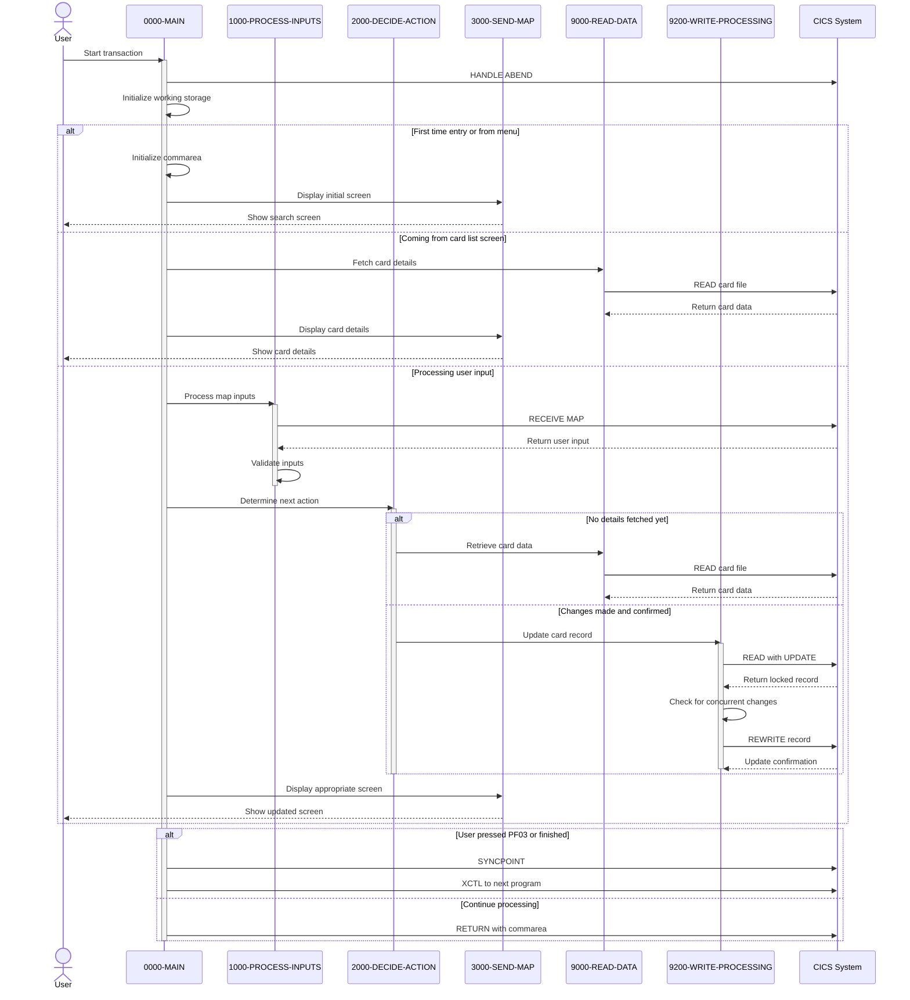

# COCRDUPC

## Overview
This program, COCRDUPC, is a business logic component of the CardDemo application that handles credit card detail updates. It provides a CICS transaction interface for users to modify credit card information such as the embossed name, expiration date, and active status. The program follows a structured workflow where it first retrieves card details based on account and card number inputs, displays them to the user, validates any changes made, and then updates the card record in the database after confirmation. It includes comprehensive input validation for all fields, handles various error conditions (such as record locking issues or concurrent updates), and provides appropriate user feedback through status messages. The program integrates with other components of the CardDemo system through a shared communication area and maintains proper transaction integrity using CICS commands for reading, updating, and synchronizing data operations.

## Metadata
**Program ID**: `COCRDUPC`

## Sequence Diagram


## Referenced Copybooks
- [`CSDAT01Y`](copybooks/CSDAT01Y.md)
- `DFHAID`
- [`CVCUS01Y`](copybooks/CVCUS01Y.md)
- [`CVACT01Y`](copybooks/CVACT01Y.md)
- [`CSUSR01Y`](copybooks/CSUSR01Y.md)
- [`COCOM01Y`](copybooks/COCOM01Y.md)
- [`CVCRD01Y`](copybooks/CVCRD01Y.md)
- [`CSSTRPFY`](copybooks/CSSTRPFY.md)
- `DFHBMSCA`
- [`CVACT03Y`](copybooks/CVACT03Y.md)
- [`CVACT02Y`](copybooks/CVACT02Y.md)
- [`COTTL01Y`](copybooks/COTTL01Y.md)
- [`CSMSG02Y`](copybooks/CSMSG02Y.md)
- [`CSMSG01Y`](copybooks/CSMSG01Y.md)
- `COCRDUP`

## Environment Division

### INPUT-OUTPUT SECTION
This section would typically contain the INPUT-OUTPUT SECTION of the COCRDUPC program, which would define file assignments and external resources used by the program. However, the provided snippet is empty, suggesting that this program likely doesn't directly interact with physical files but instead relies on CICS commands for data access and manipulation. This is consistent with the program's role as a CICS transaction interface for credit card updates, where data access would be handled through CICS services rather than direct file operations.
<details><summary>Code</summary>
```cobol

```
</details>


## Data Division

### WORKING-STORAGE SECTION
This working storage section defines the data structures used in the COCRDUPC program for credit card detail updates. It contains several key components:

1. CICS processing variables for handling responses and transaction IDs
2. Extensive input validation flags and fields for each card attribute (account number, card number, embossed name, status, expiration date)
3. Data conversion fields for numeric/alphanumeric transformations
4. File handling structures including record identifiers and error message formatting
5. Message construction areas for user feedback, including predefined status messages for various scenarios (success, validation errors, record locking)
6. Program constants and literals defining transaction IDs, program names, mapsets, and valid character sets
7. A program-specific communication area (WS-THIS-PROGCOMMAREA) that maintains both old and new card details to track changes
8. References to numerous copybooks for common structures including card record layouts, screen definitions, date handling, and user information

The section is particularly focused on supporting the validation and update workflow, with comprehensive error handling for all possible input conditions and database operations.
<details><summary>Code</summary>
```cobol
01  WS-MISC-STORAGE.                                                     
      ******************************************************************        
      * General CICS related                                                    
      ******************************************************************        
         05 WS-CICS-PROCESSNG-VARS.                                             
            07 WS-RESP-CD                          PIC S9(09) COMP              
                                                   VALUE ZEROS.                 
            07 WS-REAS-CD                          PIC S9(09) COMP              
                                                   VALUE ZEROS.                 
            07 WS-TRANID                           PIC X(4)                     
                                                   VALUE SPACES.                
            07 WS-UCTRANS                          PIC X(4)                     
                                                   VALUE SPACES.                
      ******************************************************************        
      *      Input edits                                                        
      ******************************************************************        
                                                                                
         05  WS-INPUT-FLAG                         PIC X(1).                    
           88  INPUT-OK                            VALUE '0'.                   
           88  INPUT-ERROR                         VALUE '1'.                   
           88  INPUT-PENDING                       VALUE LOW-VALUES.            
         05  WS-EDIT-ACCT-FLAG                     PIC X(1).                    
           88  FLG-ACCTFILTER-NOT-OK               VALUE '0'.                   
           88  FLG-ACCTFILTER-ISVALID              VALUE '1'.                   
           88  FLG-ACCTFILTER-BLANK                VALUE ' '.                   
         05  WS-EDIT-CARD-FLAG                     PIC X(1).                    
           88  FLG-CARDFILTER-NOT-OK               VALUE '0'.                   
           88  FLG-CARDFILTER-ISVALID             VALUE '1'.                    
           88  FLG-CARDFILTER-BLANK                VALUE ' '.                   
         05  WS-EDIT-CARDNAME-FLAG                 PIC X(1).                    
           88  FLG-CARDNAME-NOT-OK                 VALUE '0'.                   
           88  FLG-CARDNAME-ISVALID                VALUE '1'.                   
           88  FLG-CARDNAME-BLANK                  VALUE ' '.                   
         05  WS-EDIT-CARDSTATUS-FLAG              PIC X(1).                     
           88  FLG-CARDSTATUS-NOT-OK               VALUE '0'.                   
           88  FLG-CARDSTATUS-ISVALID              VALUE '1'.                   
           88  FLG-CARDSTATUS-BLANK                VALUE ' '.                   
         05  WS-EDIT-CARDEXPMON-FLAG              PIC X(1).                     
           88  FLG-CARDEXPMON-NOT-OK               VALUE '0'.                   
           88  FLG-CARDEXPMON-ISVALID              VALUE '1'.                   
           88  FLG-CARDEXPMON-BLANK                VALUE ' '.                   
         05  WS-EDIT-CARDEXPYEAR-FLAG             PIC X(1).                     
           88  FLG-CARDEXPYEAR-NOT-OK              VALUE '0'.                   
           88  FLG-CARDEXPYEAR-ISVALID             VALUE '1'.                   
           88  FLG-CARDEXPYEAR-BLANK               VALUE ' '.                   
         05  WS-RETURN-FLAG                        PIC X(1).                    
           88  WS-RETURN-FLAG-OFF                  VALUE LOW-VALUES.            
           88  WS-RETURN-FLAG-ON                   VALUE '1'.                   
         05  WS-PFK-FLAG                           PIC X(1).                    
           88  PFK-VALID                           VALUE '0'.                   
           88  PFK-INVALID                         VALUE '1'.                   
         05  CARD-NAME-CHECK                       PIC X(50)                    
                                                   VALUE LOW-VALUES.            
         05  FLG-YES-NO-CHECK                      PIC X(1)                     
                                                   VALUE 'N'.                   
           88 FLG-YES-NO-VALID                     VALUES 'Y', 'N'.             
         05  CARD-MONTH-CHECK                      PIC X(2).                    
         05  CARD-MONTH-CHECK-N REDEFINES                                       
             CARD-MONTH-CHECK                      PIC 9(2).                    
             88 VALID-MONTH                        VALUES 1 THRU 12.            
         05  CARD-YEAR-CHECK                      PIC X(4).                     
         05  CARD-YEAR-CHECK-N REDEFINES                                        
             CARD-YEAR-CHECK                      PIC 9(4).                     
             88 VALID-YEAR                        VALUES 1950 THRU 2099.        
      ******************************************************************        
      * Output edits                                                            
      ******************************************************************        
         05 CICS-OUTPUT-EDIT-VARS.                                              
           10  CARD-ACCT-ID-X                      PIC X(11).                   
           10  CARD-ACCT-ID-N REDEFINES CARD-ACCT-ID-X                          
                                                   PIC 9(11).                   
           10  CARD-CVV-CD-X                       PIC X(03).                   
           10  CARD-CVV-CD-N REDEFINES  CARD-CVV-CD-X                           
                                                   PIC 9(03).                   
           10  CARD-CARD-NUM-X                     PIC X(16).                   
           10  CARD-CARD-NUM-N REDEFINES  CARD-CARD-NUM-X                       
                                                   PIC 9(16).                   
           10  CARD-NAME-EMBOSSED-X                PIC X(50).                   
           10  CARD-STATUS-X                       PIC X.                       
           10  CARD-EXPIRAION-DATE-X               PIC X(10).                   
           10  FILLER REDEFINES CARD-EXPIRAION-DATE-X.                          
               20 CARD-EXPIRY-YEAR                 PIC X(4).                    
               20 FILLER                           PIC X(1).                    
               20 CARD-EXPIRY-MONTH                PIC X(2).                    
               20 FILLER                           PIC X(1).                    
               20 CARD-EXPIRY-DAY                  PIC X(2).                    
           10  CARD-EXPIRAION-DATE-N REDEFINES                                  
               CARD-EXPIRAION-DATE-X               PIC 9(10).                   
                                                                                
      ******************************************************************        
      *      File and data Handling                                             
      ******************************************************************        
         05  WS-CARD-RID.                                                       
           10  WS-CARD-RID-CARDNUM                 PIC X(16).                   
           10  WS-CARD-RID-ACCT-ID                 PIC 9(11).                   
           10  WS-CARD-RID-ACCT-ID-X REDEFINES                                  
                  WS-CARD-RID-ACCT-ID              PIC X(11).                   
         05  WS-FILE-ERROR-MESSAGE.                                             
           10  FILLER                              PIC X(12)                    
                                                   VALUE 'File Error: '.        
           10  ERROR-OPNAME                        PIC X(8)                     
                                                   VALUE SPACES.                
           10  FILLER                              PIC X(4)                     
                                                   VALUE ' on '.                
           10  ERROR-FILE                          PIC X(9)                     
                                                   VALUE SPACES.                
           10  FILLER                              PIC X(15)                    
                                                   VALUE                        
                                                   ' returned RESP '.           
           10  ERROR-RESP                          PIC X(10)                    
                                                   VALUE SPACES.                
           10  FILLER                              PIC X(7)                     
                                                   VALUE ',RESP2 '.             
           10  ERROR-RESP2                         PIC X(10)                    
                                                   VALUE SPACES.                
          10  FILLER                               PIC X(5)                     
                                                   VALUE SPACES.                
      ******************************************************************        
      *      Output Message Construction                                        
      ******************************************************************        
         05  WS-LONG-MSG                           PIC X(500).                  
         05  WS-INFO-MSG                           PIC X(40).                   
           88  WS-NO-INFO-MESSAGE                 VALUES                        
                                                  SPACES LOW-VALUES.            
           88  FOUND-CARDS-FOR-ACCOUNT             VALUE                        
               'Details of selected card shown above'.                          
           88  PROMPT-FOR-SEARCH-KEYS              VALUE                        
               'Please enter Account and Card Number'.                          
           88  PROMPT-FOR-CHANGES                  VALUE                        
               'Update card details presented above.'.                          
           88  PROMPT-FOR-CONFIRMATION             VALUE                        
               'Changes validated.Press F5 to save'.                            
           88  CONFIRM-UPDATE-SUCCESS              VALUE                        
               'Changes committed to database'.                                 
           88  INFORM-FAILURE                      VALUE                        
               'Changes unsuccessful. Please try again'.                        
                                                                                
         05  WS-RETURN-MSG                         PIC X(75).                   
           88  WS-RETURN-MSG-OFF                   VALUE SPACES.                
           88  WS-EXIT-MESSAGE                     VALUE                        
               'PF03 pressed.Exiting              '.                            
           88  WS-PROMPT-FOR-ACCT                  VALUE                        
               'Account number not provided'.                                   
           88  WS-PROMPT-FOR-CARD                  VALUE                        
               'Card number not provided'.                                      
           88  WS-PROMPT-FOR-NAME                  VALUE                        
               'Card name not provided'.                                        
           88  WS-NAME-MUST-BE-ALPHA               VALUE                        
               'Card name can only contain alphabets and spaces'.               
           88  NO-SEARCH-CRITERIA-RECEIVED         VALUE                        
               'No input received'.                                             
           88  NO-CHANGES-DETECTED                 VALUE                        
               'No change detected with respect to values fetched.'.            
           88  SEARCHED-ACCT-ZEROES                VALUE                        
               'Account number must be a non zero 11 digit number'.             
           88  SEARCHED-ACCT-NOT-NUMERIC           VALUE                        
               'Account number must be a non zero 11 digit number'.             
           88  SEARCHED-CARD-NOT-NUMERIC           VALUE                        
               'Card number if supplied must be a 16 digit number'.             
           88  CARD-STATUS-MUST-BE-YES-NO          VALUE                        
               'Card Active Status must be Y or N'.                             
           88  CARD-EXPIRY-MONTH-NOT-VALID          VALUE                       
               'Card expiry month must be between 1 and 12'.                    
           88  CARD-EXPIRY-YEAR-NOT-VALID          VALUE                        
               'Invalid card expiry year'.                                      
           88  DID-NOT-FIND-ACCT-IN-CARDXREF       VALUE                        
               'Did not find this account in cards database'.                   
           88  DID-NOT-FIND-ACCTCARD-COMBO         VALUE                        
               'Did not find cards for this search condition'.                  
           88  COULD-NOT-LOCK-FOR-UPDATE           VALUE                        
               'Could not lock record for update'.                              
           88  DATA-WAS-CHANGED-BEFORE-UPDATE      VALUE                        
               'Record changed by some one else. Please review'.                
           88  LOCKED-BUT-UPDATE-FAILED            VALUE                        
               'Update of record failed'.                                       
           88  XREF-READ-ERROR                     VALUE                        
               'Error reading Card Data File'.                                  
           88  CODING-TO-BE-DONE                   VALUE                        
               'Looks Good.... so far'.                                         
      ******************************************************************        
      *      Literals and Constants                                             
      ******************************************************************        
       01 WS-LITERALS.                                                          
          05 LIT-THISPGM                           PIC X(8)                     
                                                   VALUE 'COCRDUPC'.            
          05 LIT-THISTRANID                        PIC X(4)                     
                                                   VALUE 'CCUP'.                
          05 LIT-THISMAPSET                        PIC X(8)                     
                                                   VALUE 'COCRDUP '.            
          05 LIT-THISMAP                           PIC X(7)                     
                                                   VALUE 'CCRDUPA'.             
          05 LIT-CCLISTPGM                         PIC X(8)                     
                                                   VALUE 'COCRDLIC'.            
          05 LIT-CCLISTTRANID                      PIC X(4)                     
                                                   VALUE 'CCLI'.                
          05 LIT-CCLISTMAPSET                      PIC X(7)                     
                                                   VALUE 'COCRDLI'.             
          05 LIT-CCLISTMAP                         PIC X(7)                     
                                                   VALUE 'CCRDSLA'.             
          05 LIT-MENUPGM                           PIC X(8)                     
                                                   VALUE 'COMEN01C'.            
          05 LIT-MENUTRANID                        PIC X(4)                     
                                                   VALUE 'CM00'.                
          05 LIT-MENUMAPSET                        PIC X(7)                     
                                                   VALUE 'COMEN01'.             
          05 LIT-MENUMAP                           PIC X(7)                     
                                                   VALUE 'COMEN1A'.             
          05  LIT-CARDDTLPGM                       PIC X(8)                     
                                                   VALUE 'COCRDSLC'.            
          05  LIT-CARDDTLTRANID                    PIC X(4)                     
                                                   VALUE 'CCDL'.                
          05  LIT-CARDDTLMAPSET                    PIC X(7)                     
                                                   VALUE 'COCRDSL'.             
          05  LIT-CARDDTLMAP                       PIC X(7)                     
                                                   VALUE 'CCRDSLA'.             
          05 LIT-CARDFILENAME                      PIC X(8)                     
                                                   VALUE 'CARDDAT '.            
          05 LIT-CARDFILENAME-ACCT-PATH            PIC X(8)                     
                                                   VALUE 'CARDAIX '.            
          05 LIT-ALL-ALPHA-FROM                    PIC X(52)                    
             VALUE                                                              
             'ABCDEFGHIJKLMNOPQRSTUVWXYZabcdefghijklmnopqrstuvwxyz'.            
          05 LIT-ALL-SPACES-TO                     PIC X(52)                    
                                                   VALUE SPACES.                
          05 LIT-UPPER                             PIC X(26)                    
                                 VALUE 'ABCDEFGHIJKLMNOPQRSTUVWXYZ'.            
          05 LIT-LOWER                             PIC X(26)                    
                                 VALUE 'abcdefghijklmnopqrstuvwxyz'.            
                                                                                
      ******************************************************************        
      *Other common working storage Variables                                   
      ******************************************************************        
       COPY CVCRD01Y.                                                           
                                                                                
      ******************************************************************        
      *Application Commmarea Copybook                                           
       COPY COCOM01Y.                                                           
                                                                                
       01 WS-THIS-PROGCOMMAREA.                                                 
          05 CARD-UPDATE-SCREEN-DATA.                                           
             10 CCUP-CHANGE-ACTION                 PIC X(1)                     
                                                   VALUE LOW-VALUES.            
                88 CCUP-DETAILS-NOT-FETCHED        VALUES                       
                                                   LOW-VALUES,                  
                                                   SPACES.                      
                88 CCUP-SHOW-DETAILS               VALUE 'S'.                   
                88 CCUP-CHANGES-MADE               VALUES 'E', 'N'              
                                                        , 'C', 'L'              
                                                        , 'F'.                  
                88 CCUP-CHANGES-NOT-OK             VALUE 'E'.                   
                88 CCUP-CHANGES-OK-NOT-CONFIRMED   VALUE 'N'.                   
                88 CCUP-CHANGES-OKAYED-AND-DONE    VALUE 'C'.                   
                88 CCUP-CHANGES-FAILED             VALUES 'L', 'F'.             
                88 CCUP-CHANGES-OKAYED-LOCK-ERROR  VALUE 'L'.                   
                88 CCUP-CHANGES-OKAYED-BUT-FAILED  VALUE 'F'.                   
          05 CCUP-OLD-DETAILS.                                                  
             10 CCUP-OLD-ACCTID                    PIC X(11).                   
             10 CCUP-OLD-CARDID                    PIC X(16).                   
             10 CCUP-OLD-CVV-CD                    PIC X(3).                    
             10 CCUP-OLD-CARDDATA.                                              
                20 CCUP-OLD-CRDNAME                PIC X(50).                   
                20 CCUP-OLD-EXPIRAION-DATE.                                     
                   25 CCUP-OLD-EXPYEAR             PIC X(4).                    
                   25 CCUP-OLD-EXPMON              PIC X(2).                    
                   25 CCUP-OLD-EXPDAY              PIC X(2).                    
                20 CCUP-OLD-CRDSTCD                PIC X(1).                    
                                                                                
          05 CCUP-NEW-DETAILS.                                                  
             10 CCUP-NEW-ACCTID                    PIC X(11).                   
             10 CCUP-NEW-CARDID                    PIC X(16).                   
             10 CCUP-NEW-CVV-CD                    PIC X(3).                    
             10 CCUP-NEW-CARDDATA.                                              
                20 CCUP-NEW-CRDNAME                PIC X(50).                   
                20 CCUP-NEW-EXPIRAION-DATE.                                     
                   25 CCUP-NEW-EXPYEAR             PIC X(4).                    
                   25 CCUP-NEW-EXPMON              PIC X(2).                    
                   25 CCUP-NEW-EXPDAY              PIC X(2).                    
                20 CCUP-NEW-CRDSTCD                PIC X(1).                    
          05 CARD-UPDATE-RECORD.                                                
             10 CARD-UPDATE-NUM                   PIC X(16).                    
             10 CARD-UPDATE-ACCT-ID               PIC 9(11).                    
             10 CARD-UPDATE-CVV-CD                PIC 9(03).                    
             10 CARD-UPDATE-EMBOSSED-NAME         PIC X(50).                    
             10 CARD-UPDATE-EXPIRAION-DATE        PIC X(10).                    
             10 CARD-UPDATE-ACTIVE-STATUS         PIC X(01).                    
             10 FILLER                            PIC X(59).                    
                                                                                
                                                                                
       01  WS-COMMAREA                             PIC X(2000).                 
                                                                                
      *IBM SUPPLIED COPYBOOKS                                                   
       COPY DFHBMSCA.                                                           
       COPY DFHAID.                                                             
                                                                                
      *COMMON COPYBOOKS                                                         
      *Screen Titles                                                            
       COPY COTTL01Y.                                                           
      *Credit Card Update Screen Layout                                         
       COPY COCRDUP.                                                            
                                                                                
      *Current Date                                                             
       COPY CSDAT01Y.                                                           
                                                                                
      *Common Messages                                                          
       COPY CSMSG01Y.                                                           
                                                                                
      *Abend Variables                                                          
       COPY CSMSG02Y.                                                           
                                                                                
      *Signed on user data                                                      
       COPY CSUSR01Y.                                                           
                                                                                
      *Dataset layouts                                                          
      *ACCOUNT RECORD LAYOUT                                                    
      *COPY CVACT01Y.                                                           
                                                                                
      *CARD RECORD LAYOUT                                                       
       COPY CVACT02Y.                                                           
                                                                                
      *CARD XREF LAYOUT                                                         
      *COPY CVACT03Y.                                                           
                                                                                
      *CUSTOMER LAYOUT                                                          
       COPY CVCUS01Y.
```
</details>


### LINKAGE SECTION
This linkage section defines the DFHCOMMAREA structure used for communication between CICS programs. It contains a single field defined as a variable-length array of 1-byte elements that can expand from 1 to 32,767 bytes depending on the actual length passed in EIBCALEN (CICS Executive Interface Block Communication Area Length). This flexible structure allows the program to receive and process communication areas of different sizes from calling programs within the CardDemo credit card update functionality.
<details><summary>Code</summary>
```cobol
01  DFHCOMMAREA.                                                         
         05  FILLER                                PIC X(1)                     
             OCCURS 1 TO 32767 TIMES DEPENDING ON EIBCALEN.
```
</details>


## Procedure Division

### 0000-MAIN
This paragraph serves as the main control flow for the COCRDUPC program, handling the credit card update functionality. It initializes working storage, establishes error handling, and manages program state through a commarea. The paragraph processes user navigation through various program states by evaluating PF keys and program conditions. Key functions include: handling program exit (PF03), retrieving card details when coming from the card list screen (PF12), presenting initial entry screens, processing user inputs after card details are displayed, and managing the workflow between data entry, validation, and confirmation states. The code maintains context between screens by preserving program state in the commarea and handles transaction integrity with CICS SYNCPOINT commands when exiting to other programs.
<details><summary>Code</summary>
```cobol
EXEC CICS HANDLE ABEND                                               
                     LABEL(ABEND-ROUTINE)                                       
           END-EXEC                                                             
                                                                                
           INITIALIZE CC-WORK-AREA                                              
                      WS-MISC-STORAGE                                           
                      WS-COMMAREA                                               
      *****************************************************************         
      * Store our context                                                       
      *****************************************************************         
           MOVE LIT-THISTRANID       TO WS-TRANID                               
      *****************************************************************         
      * Ensure error message is cleared                               *         
      *****************************************************************         
           SET WS-RETURN-MSG-OFF  TO TRUE                                       
      *****************************************************************         
      * Store passed data if  any                *                              
      *****************************************************************         
           IF EIBCALEN IS EQUAL TO 0                                            
               OR (CDEMO-FROM-PROGRAM = LIT-MENUPGM                             
               AND NOT CDEMO-PGM-REENTER)                                       
              INITIALIZE CARDDEMO-COMMAREA                                      
                         WS-THIS-PROGCOMMAREA                                   
              SET CDEMO-PGM-ENTER TO TRUE                                       
              SET CCUP-DETAILS-NOT-FETCHED TO TRUE                              
           ELSE                                                                 
              MOVE DFHCOMMAREA (1:LENGTH OF CARDDEMO-COMMAREA)  TO              
                                CARDDEMO-COMMAREA                               
              MOVE DFHCOMMAREA(LENGTH OF CARDDEMO-COMMAREA + 1:                 
                               LENGTH OF WS-THIS-PROGCOMMAREA ) TO              
                                WS-THIS-PROGCOMMAREA                            
           END-IF                                                               
      *****************************************************************         
      * Remap PFkeys as needed.                                                 
      * Store the Mapped PF Key                                                 
      *****************************************************************         
           PERFORM YYYY-STORE-PFKEY                                             
              THRU YYYY-STORE-PFKEY-EXIT                                        
      *****************************************************************         
      * Check the AID to see if its valid at this point               *         
      * F3 - Exit                                                               
      * Enter show screen again                                                 
      *****************************************************************         
           SET PFK-INVALID TO TRUE                                              
           IF CCARD-AID-ENTER OR                                                
              CCARD-AID-PFK03 OR                                                
              (CCARD-AID-PFK05 AND CCUP-CHANGES-OK-NOT-CONFIRMED)               
                              OR                                                
              (CCARD-AID-PFK12 AND NOT CCUP-DETAILS-NOT-FETCHED)                
              SET PFK-VALID TO TRUE                                             
           END-IF                                                               
                                                                                
           IF PFK-INVALID                                                       
              SET CCARD-AID-ENTER TO TRUE                                       
           END-IF                                                               
                                                                                
      *****************************************************************         
      * Decide what to do based on inputs received                              
      *****************************************************************         
           EVALUATE TRUE                                                        
      ******************************************************************        
      *       USER PRESSES PF03 TO EXIT                                         
      *  OR   USER IS DONE WITH UPDATE                                          
      *            XCTL TO CALLING PROGRAM OR MAIN MENU                         
      ******************************************************************        
              WHEN CCARD-AID-PFK03                                              
              WHEN (CCUP-CHANGES-OKAYED-AND-DONE                                
               AND  CDEMO-LAST-MAPSET   EQUAL LIT-CCLISTMAPSET)                 
              WHEN (CCUP-CHANGES-FAILED                                         
               AND  CDEMO-LAST-MAPSET   EQUAL LIT-CCLISTMAPSET)                 
                   SET CCARD-AID-PFK03     TO TRUE                              
                                                                                
                   IF CDEMO-FROM-TRANID    EQUAL LOW-VALUES                     
                   OR CDEMO-FROM-TRANID    EQUAL SPACES                         
                      MOVE LIT-MENUTRANID  TO CDEMO-TO-TRANID                   
                   ELSE                                                         
                      MOVE CDEMO-FROM-TRANID  TO CDEMO-TO-TRANID                
                   END-IF                                                       
                                                                                
                   IF CDEMO-FROM-PROGRAM   EQUAL LOW-VALUES                     
                   OR CDEMO-FROM-PROGRAM   EQUAL SPACES                         
                      MOVE LIT-MENUPGM     TO CDEMO-TO-PROGRAM                  
                   ELSE                                                         
                      MOVE CDEMO-FROM-PROGRAM TO CDEMO-TO-PROGRAM               
                   END-IF                                                       
                                                                                
                   MOVE LIT-THISTRANID     TO CDEMO-FROM-TRANID                 
                   MOVE LIT-THISPGM        TO CDEMO-FROM-PROGRAM                
                                                                                
                   IF CDEMO-LAST-MAPSET    EQUAL LIT-CCLISTMAPSET               
                       MOVE ZEROS          TO CDEMO-ACCT-ID                     
                                              CDEMO-CARD-NUM                    
                   END-IF                                                       
                                                                                
                   SET  CDEMO-USRTYP-USER  TO TRUE                              
                   SET  CDEMO-PGM-ENTER    TO TRUE                              
                   MOVE LIT-THISMAPSET     TO CDEMO-LAST-MAPSET                 
                   MOVE LIT-THISMAP        TO CDEMO-LAST-MAP                    
                                                                                
                   EXEC CICS                                                    
                        SYNCPOINT                                               
                   END-EXEC                                                     
      *                                                                         
                   EXEC CICS XCTL                                               
                        PROGRAM (CDEMO-TO-PROGRAM)                              
                        COMMAREA(CARDDEMO-COMMAREA)                             
                   END-EXEC                                                     
      ******************************************************************        
      *       USER CAME FROM CREDIT CARD LIST SCREEN                            
      *            SO WE ALREADY HAVE THE FILTER KEYS                           
      *            FETCH THE ASSSOCIATED CARD DETAILS FOR UPDATE                
      ******************************************************************        
              WHEN CDEMO-PGM-ENTER                                              
               AND CDEMO-FROM-PROGRAM  EQUAL LIT-CCLISTPGM                      
              WHEN CCARD-AID-PFK12                                              
               AND CDEMO-FROM-PROGRAM  EQUAL LIT-CCLISTPGM                      
                   SET CDEMO-PGM-REENTER    TO TRUE                             
                   SET INPUT-OK             TO TRUE                             
                   SET FLG-ACCTFILTER-ISVALID  TO TRUE                          
                   SET FLG-CARDFILTER-ISVALID  TO TRUE                          
                   MOVE CDEMO-ACCT-ID       TO CC-ACCT-ID-N                     
                   MOVE CDEMO-CARD-NUM      TO CC-CARD-NUM-N                    
                   PERFORM 9000-READ-DATA                                       
                      THRU 9000-READ-DATA-EXIT                                  
                   SET CCUP-SHOW-DETAILS TO TRUE                                
                   PERFORM 3000-SEND-MAP                                        
                      THRU 3000-SEND-MAP-EXIT                                   
                   GO TO COMMON-RETURN                                          
      ******************************************************************        
      *       FRESH ENTRY INTO PROGRAM                                          
      *            ASK THE USER FOR THE KEYS TO FETCH CARD TO BE UPDATED        
      ******************************************************************        
              WHEN CCUP-DETAILS-NOT-FETCHED                                     
               AND CDEMO-PGM-ENTER                                              
              WHEN CDEMO-FROM-PROGRAM   EQUAL LIT-MENUPGM                       
               AND NOT CDEMO-PGM-REENTER                                        
                   INITIALIZE WS-THIS-PROGCOMMAREA                              
                   PERFORM 3000-SEND-MAP THRU                                   
                           3000-SEND-MAP-EXIT                                   
                   SET CDEMO-PGM-REENTER        TO TRUE                         
                   SET CCUP-DETAILS-NOT-FETCHED TO TRUE                         
                   GO TO COMMON-RETURN                                          
      ******************************************************************        
      *       CARD DATA CHANGES REVIEWED, OKAYED AND DONE SUCESSFULLY           
      *            RESET THE SEARCH KEYS                                        
      *            ASK THE USER FOR FRESH SEARCH CRITERIA                       
      ******************************************************************        
              WHEN CCUP-CHANGES-OKAYED-AND-DONE                                 
              WHEN CCUP-CHANGES-FAILED                                          
                   INITIALIZE WS-THIS-PROGCOMMAREA                              
                              WS-MISC-STORAGE                                   
                              CDEMO-ACCT-ID                                     
                              CDEMO-CARD-NUM                                    
                   SET CDEMO-PGM-ENTER            TO TRUE                       
                   PERFORM 3000-SEND-MAP THRU                                   
                           3000-SEND-MAP-EXIT                                   
                   SET CDEMO-PGM-REENTER          TO TRUE                       
                   SET CCUP-DETAILS-NOT-FETCHED   TO TRUE                       
                   GO TO COMMON-RETURN                                          
      ******************************************************************        
      *      CARD DATA HAS BEEN PRESENTED TO USER                               
      *            CHECK THE USER INPUTS                                        
      *            DECIDE WHAT TO DO                                            
      *            PRESENT NEXT STEPS TO USER                                   
      ******************************************************************        
              WHEN OTHER                                                        
                   PERFORM 1000-PROCESS-INPUTS                                  
                      THRU 1000-PROCESS-INPUTS-EXIT                             
                   PERFORM 2000-DECIDE-ACTION                                   
                      THRU 2000-DECIDE-ACTION-EXIT                              
                   PERFORM 3000-SEND-MAP                                        
                      THRU 3000-SEND-MAP-EXIT                                   
                   GO TO COMMON-RETURN                                          
           END-EVALUATE                                                         
           .
```
</details>


### COMMON-RETURN
This paragraph handles the program's return logic by first copying the return message to the error message field in the communication area. It then preserves both the common CardDemo communication area and this program's specific communication area by concatenating them together into a combined working storage area. Finally, it executes a CICS RETURN command that maintains the same transaction ID and passes back the combined communication area, ensuring that both shared and program-specific data are preserved for the next program invocation.
<details><summary>Code</summary>
```cobol
MOVE WS-RETURN-MSG     TO CCARD-ERROR-MSG                            
                                                                                
           MOVE  CARDDEMO-COMMAREA    TO WS-COMMAREA                            
           MOVE  WS-THIS-PROGCOMMAREA TO                                        
                  WS-COMMAREA(LENGTH OF CARDDEMO-COMMAREA + 1:                  
                               LENGTH OF WS-THIS-PROGCOMMAREA )                 
                                                                                
           EXEC CICS RETURN                                                     
                TRANSID (LIT-THISTRANID)                                        
                COMMAREA (WS-COMMAREA)                                          
                LENGTH(LENGTH OF WS-COMMAREA)                                   
           END-EXEC                                                             
           .
```
</details>


### 0000-MAIN-EXIT
This paragraph serves as the exit point for the program. It's a simple termination point that marks the end of a processing section, allowing control to return to the calling routine. This is a standard COBOL structural element used to properly end program flow in the credit card update process.
<details><summary>Code</summary>
```cobol
EXIT                                                                 
           .
```
</details>


### 1000-PROCESS-INPUTS
This paragraph orchestrates the initial input processing workflow for the credit card update transaction. It first calls the 1100-RECEIVE-MAP paragraph to retrieve user input from the screen, then performs validation of the input data through the 1200-EDIT-MAP-INPUTS paragraph. After validation, it captures any error messages in the communication area and sets up the program flow to return to the same screen by configuring the next program, mapset, and map names to the current ones. This ensures proper handling of input errors by returning the user to the same screen with appropriate feedback.
<details><summary>Code</summary>
```cobol
PERFORM 1100-RECEIVE-MAP                                             
              THRU 1100-RECEIVE-MAP-EXIT                                        
           PERFORM 1200-EDIT-MAP-INPUTS                                         
              THRU 1200-EDIT-MAP-INPUTS-EXIT                                    
           MOVE WS-RETURN-MSG  TO CCARD-ERROR-MSG                               
           MOVE LIT-THISPGM    TO CCARD-NEXT-PROG                               
           MOVE LIT-THISMAPSET TO CCARD-NEXT-MAPSET                             
           MOVE LIT-THISMAP    TO CCARD-NEXT-MAP                                
           .
```
</details>


### 1000-PROCESS-INPUTS-EXIT
This paragraph serves as an exit point for the 1000-PROCESS-INPUTS section of the COCRDUPC program. It marks the end of the input processing logic for credit card detail updates, allowing the program flow to return to the calling section after input validation and processing has been completed.
<details><summary>Code</summary>
```cobol
EXIT                                                                 
           .
```
</details>


### 1100-RECEIVE-MAP
This paragraph receives user input from a CICS map and processes it for credit card updates. It first executes a CICS RECEIVE command to capture the data entered by the user into the CCRDUPAI structure. The paragraph then initializes the CCUP-NEW-DETAILS structure and processes each input field from the map. For each field (account ID, card number, card name, status code, and expiration date components), it applies consistent validation logic - if the field contains an asterisk or spaces, it's replaced with LOW-VALUES; otherwise, the entered value is stored. The paragraph handles both identification fields (account and card numbers) by storing them in both the CC fields (likely for record lookup) and the CCUP-NEW fields (for update processing). This ensures proper handling of user inputs before validation and database update operations occur in subsequent paragraphs.
<details><summary>Code</summary>
```cobol
EXEC CICS RECEIVE MAP(LIT-THISMAP)                                   
                     MAPSET(LIT-THISMAPSET)                                     
                     INTO(CCRDUPAI)                                             
                     RESP(WS-RESP-CD)                                           
                     RESP2(WS-REAS-CD)                                          
           END-EXEC                                                             
                                                                                
           INITIALIZE CCUP-NEW-DETAILS                                          
                                                                                
      *    REPLACE * WITH LOW-VALUES                                            
           IF  ACCTSIDI OF CCRDUPAI = '*'                                       
           OR  ACCTSIDI OF CCRDUPAI = SPACES                                    
               MOVE LOW-VALUES           TO  CC-ACCT-ID                         
                                             CCUP-NEW-ACCTID                    
           ELSE                                                                 
               MOVE ACCTSIDI OF CCRDUPAI TO  CC-ACCT-ID                         
                                             CCUP-NEW-ACCTID                    
           END-IF                                                               
                                                                                
           IF  CARDSIDI OF CCRDUPAI = '*'                                       
           OR  CARDSIDI OF CCRDUPAI = SPACES                                    
               MOVE LOW-VALUES           TO  CC-CARD-NUM                        
                                             CCUP-NEW-CARDID                    
           ELSE                                                                 
               MOVE CARDSIDI OF CCRDUPAI TO  CC-CARD-NUM                        
                                             CCUP-NEW-CARDID                    
           END-IF                                                               
                                                                                
           IF  CRDNAMEI OF CCRDUPAI = '*'                                       
           OR  CRDNAMEI OF CCRDUPAI = SPACES                                    
               MOVE LOW-VALUES           TO  CCUP-NEW-CRDNAME                   
           ELSE                                                                 
               MOVE CRDNAMEI OF CCRDUPAI TO  CCUP-NEW-CRDNAME                   
           END-IF                                                               
                                                                                
           IF  CRDSTCDI OF CCRDUPAI = '*'                                       
           OR  CRDSTCDI OF CCRDUPAI = SPACES                                    
               MOVE LOW-VALUES           TO  CCUP-NEW-CRDSTCD                   
           ELSE                                                                 
               MOVE CRDSTCDI OF CCRDUPAI TO  CCUP-NEW-CRDSTCD                   
           END-IF                                                               
                                                                                
           MOVE EXPDAYI     OF CCRDUPAI  TO  CCUP-NEW-EXPDAY                    
                                                                                
           IF  EXPMONI OF CCRDUPAI = '*'                                        
           OR  EXPMONI OF CCRDUPAI = SPACES                                     
               MOVE LOW-VALUES           TO  CCUP-NEW-EXPMON                    
           ELSE                                                                 
               MOVE EXPMONI OF CCRDUPAI  TO  CCUP-NEW-EXPMON                    
           END-IF                                                               
                                                                                
           IF  EXPYEARI OF CCRDUPAI = '*'                                       
           OR  EXPYEARI OF CCRDUPAI = SPACES                                    
               MOVE LOW-VALUES           TO  CCUP-NEW-EXPYEAR                   
           ELSE                                                                 
               MOVE EXPYEARI OF CCRDUPAI TO  CCUP-NEW-EXPYEAR                   
           END-IF                                                               
           .
```
</details>


### 1100-RECEIVE-MAP-EXIT
This paragraph serves as an exit point for the 1100-RECEIVE-MAP section of the COCRDUPC program. It marks the end of the map receiving process where user input from the CICS screen is captured for credit card update operations. The paragraph contains only the EXIT statement followed by a period, indicating a clean termination point for this processing section before control is passed to the next logical section in the program flow.
<details><summary>Code</summary>
```cobol
EXIT                                                                 
           .
```
</details>


### 1200-EDIT-MAP-INPUTS
This paragraph handles the validation of user inputs when updating credit card details. It first checks if card details have been fetched yet. If not, it validates only the search criteria (account and card numbers) and exits. If card details have already been fetched, it copies the existing card data to working fields and checks if any changes were made by comparing the new data with the original data. When changes are detected and not yet confirmed or processed, it performs validation on each editable field: embossed name, card status, expiration month, and expiration year through separate validation routines. Based on validation results, it either marks the input as having errors or sets a flag indicating changes are valid but not yet confirmed. The paragraph maintains the state of the update process through various status flags to ensure proper workflow progression.
<details><summary>Code</summary>
```cobol
SET INPUT-OK                  TO TRUE                                
                                                                                
           IF  CCUP-DETAILS-NOT-FETCHED                                         
      *        VALIDATE THE SEARCH KEYS                                         
               PERFORM 1210-EDIT-ACCOUNT                                        
                  THRU 1210-EDIT-ACCOUNT-EXIT                                   
                                                                                
               PERFORM 1220-EDIT-CARD                                           
                  THRU 1220-EDIT-CARD-EXIT                                      
                                                                                
               MOVE LOW-VALUES                 TO CCUP-NEW-CARDDATA             
                                                                                
      *       IF THE SEARCH CONDITIONS HAVE PROBLEMS SKIP OTHER EDITS           
               IF  FLG-ACCTFILTER-BLANK                                         
               AND FLG-CARDFILTER-BLANK                                         
                   SET NO-SEARCH-CRITERIA-RECEIVED TO TRUE                      
               END-IF                                                           
                                                                                
               GO TO 1200-EDIT-MAP-INPUTS-EXIT                                  
                                                                                
           ELSE                                                                 
               CONTINUE                                                         
           END-IF                                                               
                                                                                
      *    SEARCH KEYS ALREADY VALIDATED AND DATA FETCHED                       
           SET FOUND-CARDS-FOR-ACCOUNT TO TRUE                                  
           SET FLG-ACCTFILTER-ISVALID  TO TRUE                                  
           SET FLG-CARDFILTER-ISVALID  TO TRUE                                  
           MOVE CCUP-OLD-ACCTID     TO CDEMO-ACCT-ID                            
           MOVE CCUP-OLD-CARDID     TO CDEMO-CARD-NUM                           
           MOVE CCUP-OLD-CRDNAME    TO CARD-EMBOSSED-NAME                       
           MOVE CCUP-OLD-CRDSTCD    TO CARD-ACTIVE-STATUS                       
           MOVE CCUP-OLD-EXPDAY     TO CARD-EXPIRY-DAY                          
           MOVE CCUP-OLD-EXPMON     TO CARD-EXPIRY-MONTH                        
           MOVE CCUP-OLD-EXPYEAR    TO CARD-EXPIRY-YEAR                         
                                                                                
      *    NEW DATA IS SAME AS OLD DATA                                         
           IF  (FUNCTION UPPER-CASE(CCUP-NEW-CARDDATA) EQUAL                    
                FUNCTION UPPER-CASE(CCUP-OLD-CARDDATA))                         
               SET NO-CHANGES-DETECTED TO TRUE                                  
           END-IF                                                               
                                                                                
           IF  NO-CHANGES-DETECTED                                              
           OR  CCUP-CHANGES-OK-NOT-CONFIRMED                                    
           OR  CCUP-CHANGES-OKAYED-AND-DONE                                     
               SET FLG-CARDNAME-ISVALID    TO TRUE                              
               SET FLG-CARDSTATUS-ISVALID  TO TRUE                              
               SET FLG-CARDEXPMON-ISVALID  TO TRUE                              
               SET FLG-CARDEXPYEAR-ISVALID TO TRUE                              
               GO TO 1200-EDIT-MAP-INPUTS-EXIT                                  
           END-IF                                                               
                                                                                
                                                                                
           SET CCUP-CHANGES-NOT-OK    TO TRUE                                   
                                                                                
           PERFORM 1230-EDIT-NAME                                               
              THRU 1230-EDIT-NAME-EXIT                                          
                                                                                
           PERFORM 1240-EDIT-CARDSTATUS                                         
              THRU 1240-EDIT-CARDSTATUS-EXIT                                    
                                                                                
           PERFORM 1250-EDIT-EXPIRY-MON                                         
              THRU 1250-EDIT-EXPIRY-MON-EXIT                                    
                                                                                
           PERFORM 1260-EDIT-EXPIRY-YEAR                                        
              THRU 1260-EDIT-EXPIRY-YEAR-EXIT                                   
                                                                                
           IF INPUT-ERROR                                                       
              CONTINUE                                                          
           ELSE                                                                 
              SET CCUP-CHANGES-OK-NOT-CONFIRMED TO TRUE                         
           END-IF                                                               
           .
```
</details>


### 1200-EDIT-MAP-INPUTS-EXIT
This paragraph serves as an exit point for the 1200-EDIT-MAP-INPUTS routine. It provides a clean termination point for the input validation logic, allowing the program to return control to the calling section after completing the validation of user inputs from the map.
<details><summary>Code</summary>
```cobol
EXIT                                                                 
           .
```
</details>


### 1210-EDIT-ACCOUNT
This paragraph validates the account ID input field for credit card updates. It first checks if the account ID is empty (spaces, low-values, or zeros) and sets appropriate error flags while prompting the user for an account if necessary. If an account ID is provided, it verifies that the value is numeric and 11 digits long. When validation fails, it clears the account ID fields and sets error indicators. Upon successful validation, it copies the account ID to the required program variables and marks the account filter as valid. The paragraph maintains error status flags and conditional messaging to guide the user through proper account ID entry.
<details><summary>Code</summary>
```cobol
SET FLG-ACCTFILTER-NOT-OK TO TRUE                                    
                                                                                
      *    Not supplied                                                         
           IF CC-ACCT-ID   EQUAL LOW-VALUES                                     
           OR CC-ACCT-ID   EQUAL SPACES                                         
           OR CC-ACCT-ID-N EQUAL ZEROS                                          
              SET INPUT-ERROR           TO TRUE                                 
              SET FLG-ACCTFILTER-BLANK  TO TRUE                                 
              IF WS-RETURN-MSG-OFF                                              
                 SET WS-PROMPT-FOR-ACCT TO TRUE                                 
              END-IF                                                            
              MOVE ZEROES       TO CDEMO-ACCT-ID                                
              MOVE LOW-VALUES   TO CCUP-NEW-ACCTID                              
              GO TO  1210-EDIT-ACCOUNT-EXIT                                     
           END-IF                                                               
      *                                                                         
      *    Not numeric                                                          
      *    Not 11 characters                                                    
           IF CC-ACCT-ID  IS NOT NUMERIC                                        
              SET INPUT-ERROR TO TRUE                                           
              SET FLG-ACCTFILTER-NOT-OK TO TRUE                                 
              IF WS-RETURN-MSG-OFF                                              
                MOVE                                                            
              'ACCOUNT FILTER,IF SUPPLIED MUST BE A 11 DIGIT NUMBER'            
                              TO WS-RETURN-MSG                                  
              END-IF                                                            
              MOVE ZERO       TO CDEMO-ACCT-ID                                  
              MOVE LOW-VALUES TO CCUP-NEW-ACCTID                                
              GO TO 1210-EDIT-ACCOUNT-EXIT                                      
           ELSE                                                                 
              MOVE CC-ACCT-ID TO CDEMO-ACCT-ID                                  
                                 CCUP-NEW-ACCTID                                
              SET FLG-ACCTFILTER-ISVALID TO TRUE                                
           END-IF                                                               
           .
```
</details>


### 1210-EDIT-ACCOUNT-EXIT
This paragraph serves as an exit point for the account editing process. It's a simple paragraph marker that allows the program to return control to the calling routine after completing the account validation logic.
<details><summary>Code</summary>
```cobol
EXIT                                                                 
           .
```
</details>


### 1220-EDIT-CARD
This paragraph validates the credit card number input during the card update process. It performs several checks: first, it verifies if the card number was provided at all (checking for spaces, low-values, or zeros). If the card number is missing, it sets appropriate error flags, clears the card number fields, and prompts the user for input if messaging is enabled. If a card number is provided, it validates that the input is numeric and 16 digits long. When validation fails, it sets error flags, displays an error message if messaging is enabled, and clears the card number fields. When validation succeeds, it moves the card number to the appropriate program variables and sets a flag indicating the card number is valid. The paragraph is part of the input validation workflow that ensures data integrity before proceeding with card updates.
<details><summary>Code</summary>
```cobol
*    Not numeric                                                          
      *    Not 16 characters                                                    
           SET FLG-CARDFILTER-NOT-OK TO TRUE                                    
                                                                                
      *    Not supplied                                                         
           IF CC-CARD-NUM   EQUAL LOW-VALUES                                    
           OR CC-CARD-NUM   EQUAL SPACES                                        
           OR CC-CARD-NUM-N EQUAL ZEROS                                         
              SET INPUT-ERROR           TO TRUE                                 
              SET FLG-CARDFILTER-BLANK  TO TRUE                                 
              IF WS-RETURN-MSG-OFF                                              
                 SET WS-PROMPT-FOR-CARD TO TRUE                                 
              END-IF                                                            
                                                                                
              MOVE ZEROES        TO CDEMO-CARD-NUM                              
                                   CCUP-NEW-CARDID                              
              GO TO  1220-EDIT-CARD-EXIT                                        
           END-IF                                                               
      *                                                                         
      *    Not numeric                                                          
      *    Not 16 characters                                                    
           IF CC-CARD-NUM  IS NOT NUMERIC                                       
              SET INPUT-ERROR TO TRUE                                           
              SET FLG-CARDFILTER-NOT-OK TO TRUE                                 
              IF WS-RETURN-MSG-OFF                                              
                 MOVE                                                           
              'CARD ID FILTER,IF SUPPLIED MUST BE A 16 DIGIT NUMBER'            
                                 TO WS-RETURN-MSG                               
              END-IF                                                            
              MOVE ZERO          TO CDEMO-CARD-NUM                              
              MOVE LOW-VALUES    TO CCUP-NEW-CARDID                             
              GO TO 1220-EDIT-CARD-EXIT                                         
           ELSE                                                                 
              MOVE CC-CARD-NUM-N TO CDEMO-CARD-NUM                              
              MOVE CC-CARD-NUM   TO CCUP-NEW-CARDID                             
              SET FLG-CARDFILTER-ISVALID TO TRUE                                
           END-IF                                                               
           .
```
</details>


### 1220-EDIT-CARD-EXIT
This paragraph serves as an exit point for the card editing process in the COCRDUPC program. It marks the end of the card validation and editing logic, allowing the program flow to return to the calling section after completing the validation of credit card details.
<details><summary>Code</summary>
```cobol
EXIT                                                                 
           .
```
</details>


### 1230-EDIT-NAME
This paragraph validates the credit card embossed name input. It first checks if the name field is empty (blank, zeros, or low-values), setting appropriate error flags and prompting the user to enter a name if needed. Then it performs character validation by converting all alphabetic characters to spaces and checking if anything remains - ensuring only alphabetic characters and spaces are allowed in the name field. If non-alphabetic characters are found, it sets error flags and provides a specific error message. When validation passes, it sets a flag indicating the card name is valid. The paragraph includes conditional error message handling based on the current message display settings.
<details><summary>Code</summary>
```cobol
*    Not BLANK                                                            
           SET FLG-CARDNAME-NOT-OK      TO TRUE                                 
                                                                                
      *    Not supplied                                                         
           IF CCUP-NEW-CRDNAME   EQUAL LOW-VALUES                               
           OR CCUP-NEW-CRDNAME   EQUAL SPACES                                   
           OR CCUP-NEW-CRDNAME   EQUAL ZEROS                                    
              SET INPUT-ERROR           TO TRUE                                 
              SET FLG-CARDNAME-BLANK  TO TRUE                                   
              IF WS-RETURN-MSG-OFF                                              
                 SET WS-PROMPT-FOR-NAME TO TRUE                                 
              END-IF                                                            
              GO TO  1230-EDIT-NAME-EXIT                                        
           END-IF                                                               
                                                                                
      *    Only Alphabets and space allowed                                     
           MOVE CCUP-NEW-CRDNAME        TO CARD-NAME-CHECK                      
           INSPECT CARD-NAME-CHECK                                              
             CONVERTING LIT-ALL-ALPHA-FROM                                      
                     TO LIT-ALL-SPACES-TO                                       
                                                                                
           IF FUNCTION LENGTH(FUNCTION TRIM(CARD-NAME-CHECK)) = 0               
              CONTINUE                                                          
           ELSE                                                                 
              SET INPUT-ERROR           TO TRUE                                 
              SET FLG-CARDNAME-NOT-OK   TO TRUE                                 
              IF WS-RETURN-MSG-OFF                                              
                 SET WS-NAME-MUST-BE-ALPHA  TO TRUE                             
              END-IF                                                            
              GO TO  1230-EDIT-NAME-EXIT                                        
           END-IF                                                               
                                                                                
           SET FLG-CARDNAME-ISVALID     TO TRUE                                 
           .
```
</details>


### 1230-EDIT-NAME-EXIT
This paragraph serves as an exit point for the name editing routine in the credit card update process. It marks the end of the name validation logic, allowing the program to continue with the next step in the card update workflow after name field processing is complete.
<details><summary>Code</summary>
```cobol
EXIT                                                                 
           .
```
</details>


### 1240-EDIT-CARDSTATUS
This paragraph validates the card status input field in the credit card update process. It first checks if the card status value is provided, setting an error flag and appropriate message if the field is blank, spaces, or zeros. If a value is provided, it validates that the input is either 'Y' or 'N' by moving the input to a flag field and checking if it's valid. When validation fails, it sets error flags and a message indicating that card status must be either Yes or No. The paragraph includes conditional message handling based on the WS-RETURN-MSG-OFF flag, which controls whether error messages are displayed to the user. Valid inputs result in setting the FLG-CARDSTATUS-ISVALID flag before exiting the paragraph.
<details><summary>Code</summary>
```cobol
*    Must be Y or N                                                       
           SET FLG-CARDSTATUS-NOT-OK      TO TRUE                               
                                                                                
      *    Not supplied                                                         
           IF CCUP-NEW-CRDSTCD   EQUAL LOW-VALUES                               
           OR CCUP-NEW-CRDSTCD   EQUAL SPACES                                   
           OR CCUP-NEW-CRDSTCD   EQUAL ZEROS                                    
              SET INPUT-ERROR           TO TRUE                                 
              SET FLG-CARDSTATUS-BLANK  TO TRUE                                 
              IF WS-RETURN-MSG-OFF                                              
                 SET CARD-STATUS-MUST-BE-YES-NO TO TRUE                         
              END-IF                                                            
              GO TO  1240-EDIT-CARDSTATUS-EXIT                                  
           END-IF                                                               
                                                                                
           MOVE CCUP-NEW-CRDSTCD          TO FLG-YES-NO-CHECK                   
                                                                                
           IF FLG-YES-NO-VALID                                                  
              SET FLG-CARDSTATUS-ISVALID  TO TRUE                               
           ELSE                                                                 
              SET INPUT-ERROR             TO TRUE                               
              SET FLG-CARDSTATUS-NOT-OK   TO TRUE                               
              IF WS-RETURN-MSG-OFF                                              
                 SET CARD-STATUS-MUST-BE-YES-NO  TO TRUE                        
              END-IF                                                            
              GO TO  1240-EDIT-CARDSTATUS-EXIT                                  
           END-IF                                                               
           .
```
</details>


### 1240-EDIT-CARDSTATUS-EXIT
This paragraph serves as an exit point for the CARDSTATUS field validation routine. It marks the end of the validation logic for the card status field, allowing the program flow to return to the calling section after the validation checks have been completed.
<details><summary>Code</summary>
```cobol
EXIT                                                                 
           .
```
</details>


### 1250-EDIT-EXPIRY-MON
This paragraph validates the credit card expiration month entered by the user. It first sets a flag indicating the month is invalid by default. The validation checks if the month is blank or not supplied (spaces, zeros, or low-values), in which case it sets appropriate error flags and exits. If a value is provided, it moves the input to a check field and verifies it's a valid month (1-12) using a predefined condition. When validation fails, it sets error flags and, if message display is enabled, sets a specific error message flag for invalid expiration month. The paragraph maintains validation state through multiple flags that can be used by the calling routine to determine appropriate action.
<details><summary>Code</summary>
```cobol
SET FLG-CARDEXPMON-NOT-OK      TO TRUE                               
                                                                                
      *    Not supplied                                                         
           IF CCUP-NEW-EXPMON   EQUAL LOW-VALUES                                
           OR CCUP-NEW-EXPMON   EQUAL SPACES                                    
           OR CCUP-NEW-EXPMON   EQUAL ZEROS                                     
              SET INPUT-ERROR           TO TRUE                                 
              SET FLG-CARDEXPMON-BLANK  TO TRUE                                 
              IF WS-RETURN-MSG-OFF                                              
                 SET CARD-EXPIRY-MONTH-NOT-VALID TO TRUE                        
              END-IF                                                            
              GO TO  1250-EDIT-EXPIRY-MON-EXIT                                  
           END-IF                                                               
                                                                                
      *    Must be numeric                                                      
      *    Must be 1 to 12                                                      
           MOVE CCUP-NEW-EXPMON           TO CARD-MONTH-CHECK                   
                                                                                
           IF VALID-MONTH                                                       
              SET FLG-CARDEXPMON-ISVALID  TO TRUE                               
           ELSE                                                                 
              SET INPUT-ERROR             TO TRUE                               
              SET FLG-CARDEXPMON-NOT-OK   TO TRUE                               
              IF WS-RETURN-MSG-OFF                                              
                 SET CARD-EXPIRY-MONTH-NOT-VALID  TO TRUE                       
              END-IF                                                            
              GO TO  1250-EDIT-EXPIRY-MON-EXIT                                  
           END-IF                                                               
           .
```
</details>


### 1250-EDIT-EXPIRY-MON-EXIT
This paragraph serves as an exit point for the expiration month validation routine. It marks the end of the validation logic for the credit card expiration month field, allowing the program to continue with the next processing step after validation is complete.
<details><summary>Code</summary>
```cobol
EXIT                                                                 
           .
```
</details>


### 1260-EDIT-EXPIRY-YEAR
This paragraph validates the expiration year field during credit card updates. It performs two key validation checks: first ensuring the field is not empty (not spaces, zeros, or low-values), and then verifying the year is numeric and within a valid range. If validation fails, it sets appropriate error flags (INPUT-ERROR and specific field error flags) and conditionally sets a user-friendly error message (CARD-EXPIRY-YEAR-NOT-VALID) if message display is enabled. The validation logic uses a VALID-YEAR condition, likely defined elsewhere, to determine if the supplied year meets business requirements. The paragraph exits immediately upon detecting any validation error, preventing further processing with invalid data.
<details><summary>Code</summary>
```cobol
*    Not supplied                                                         
           IF CCUP-NEW-EXPYEAR   EQUAL LOW-VALUES                               
           OR CCUP-NEW-EXPYEAR   EQUAL SPACES                                   
           OR CCUP-NEW-EXPYEAR   EQUAL ZEROS                                    
              SET INPUT-ERROR           TO TRUE                                 
              SET FLG-CARDEXPYEAR-BLANK  TO TRUE                                
              IF WS-RETURN-MSG-OFF                                              
                 SET CARD-EXPIRY-YEAR-NOT-VALID TO TRUE                         
              END-IF                                                            
              GO TO  1260-EDIT-EXPIRY-YEAR-EXIT                                 
           END-IF                                                               
                                                                                
      *    Must be numeric                                                      
      *    Must be 1 to 12                                                      
                                                                                
           SET FLG-CARDEXPYEAR-NOT-OK      TO TRUE                              
                                                                                
           MOVE CCUP-NEW-EXPYEAR           TO CARD-YEAR-CHECK                   
                                                                                
           IF VALID-YEAR                                                        
              SET FLG-CARDEXPYEAR-ISVALID  TO TRUE                              
           ELSE                                                                 
              SET INPUT-ERROR              TO TRUE                              
              SET FLG-CARDEXPYEAR-NOT-OK   TO TRUE                              
              IF WS-RETURN-MSG-OFF                                              
                 SET CARD-EXPIRY-YEAR-NOT-VALID  TO TRUE                        
              END-IF                                                            
              GO TO  1260-EDIT-EXPIRY-YEAR-EXIT                                 
           END-IF                                                               
           .
```
</details>


### 1260-EDIT-EXPIRY-YEAR-EXIT
This paragraph serves as an exit point for the expiration year validation routine. It marks the end of the validation logic for the credit card expiration year field, allowing the program to return control to the calling section after completing the validation checks.
<details><summary>Code</summary>
```cobol
EXIT                                                                 
           .
```
</details>


### 2000-DECIDE-ACTION
This paragraph implements the core decision logic for the credit card update process based on the current state of the transaction and user actions. It uses an EVALUATE statement to handle multiple workflow scenarios: initial data retrieval, handling user cancellations, validating changes, confirming updates, processing update confirmations, and handling update outcomes (including lock errors, update failures, and concurrent update conflicts). When updates are successfully completed, it resets account information if not called from another transaction. The paragraph maintains transaction state through status flags and includes error handling that will trigger an abend routine if an unexpected scenario is encountered. This logic ensures the update process follows a controlled path with appropriate validation and confirmation steps before committing changes to the database.
<details><summary>Code</summary>
```cobol
EVALUATE TRUE                                                        
      ******************************************************************        
      *       NO DETAILS SHOWN.                                                 
      *       SO GET THEM AND SETUP DETAIL EDIT SCREEN                          
      ******************************************************************        
              WHEN CCUP-DETAILS-NOT-FETCHED                                     
      ******************************************************************        
      *       CHANGES MADE. BUT USER CANCELS                                    
      ******************************************************************        
              WHEN CCARD-AID-PFK12                                              
                 IF  FLG-ACCTFILTER-ISVALID                                     
                 AND FLG-CARDFILTER-ISVALID                                     
                     PERFORM 9000-READ-DATA                                     
                        THRU 9000-READ-DATA-EXIT                                
                     IF FOUND-CARDS-FOR-ACCOUNT                                 
                        SET CCUP-SHOW-DETAILS    TO TRUE                        
                     END-IF                                                     
                 END-IF                                                         
      ******************************************************************        
      *       DETAILS SHOWN                                                     
      *       CHECK CHANGES AND ASK CONFIRMATION IF GOOD                        
      ******************************************************************        
              WHEN CCUP-SHOW-DETAILS                                            
                 IF INPUT-ERROR                                                 
                 OR NO-CHANGES-DETECTED                                         
                    CONTINUE                                                    
                 ELSE                                                           
                    SET CCUP-CHANGES-OK-NOT-CONFIRMED TO TRUE                   
                 END-IF                                                         
      ******************************************************************        
      *       DETAILS SHOWN                                                     
      *       BUT INPUT EDIT ERRORS FOUND                                       
      ******************************************************************        
              WHEN CCUP-CHANGES-NOT-OK                                          
                  CONTINUE                                                      
      ******************************************************************        
      *       DETAILS EDITED , FOUND OK, CONFIRM SAVE REQUESTED                 
      *       CONFIRMATION GIVEN.SO SAVE THE CHANGES                            
      ******************************************************************        
              WHEN CCUP-CHANGES-OK-NOT-CONFIRMED                                
               AND CCARD-AID-PFK05                                              
                 PERFORM 9200-WRITE-PROCESSING                                  
                    THRU 9200-WRITE-PROCESSING-EXIT                             
                 EVALUATE TRUE                                                  
                    WHEN COULD-NOT-LOCK-FOR-UPDATE                              
                         SET CCUP-CHANGES-OKAYED-LOCK-ERROR TO TRUE             
                    WHEN LOCKED-BUT-UPDATE-FAILED                               
                       SET CCUP-CHANGES-OKAYED-BUT-FAILED TO TRUE               
                    WHEN DATA-WAS-CHANGED-BEFORE-UPDATE                         
                        SET CCUP-SHOW-DETAILS            TO TRUE                
                    WHEN OTHER                                                  
                       SET CCUP-CHANGES-OKAYED-AND-DONE   TO TRUE               
                 END-EVALUATE                                                   
      ******************************************************************        
      *       DETAILS EDITED , FOUND OK, CONFIRM SAVE REQUESTED                 
      *       CONFIRMATION NOT GIVEN. SO SHOW DETAILS AGAIN                     
      ******************************************************************        
              WHEN CCUP-CHANGES-OK-NOT-CONFIRMED                                
                  CONTINUE                                                      
      ******************************************************************        
      *       SHOW CONFIRMATION. GO BACK TO SQUARE 1                            
      ******************************************************************        
              WHEN CCUP-CHANGES-OKAYED-AND-DONE                                 
                  SET CCUP-SHOW-DETAILS TO TRUE                                 
                  IF CDEMO-FROM-TRANID    EQUAL LOW-VALUES                      
                  OR CDEMO-FROM-TRANID    EQUAL SPACES                          
                     MOVE ZEROES       TO CDEMO-ACCT-ID                         
                                          CDEMO-CARD-NUM                        
                     MOVE LOW-VALUES   TO CDEMO-ACCT-STATUS                     
                  END-IF                                                        
              WHEN OTHER                                                        
                   MOVE LIT-THISPGM    TO ABEND-CULPRIT                         
                   MOVE '0001'         TO ABEND-CODE                            
                   MOVE SPACES         TO ABEND-REASON                          
                   MOVE 'UNEXPECTED DATA SCENARIO'                              
                                       TO ABEND-MSG                             
                   PERFORM ABEND-ROUTINE                                        
                      THRU ABEND-ROUTINE-EXIT                                   
           END-EVALUATE                                                         
           .
```
</details>


### 2000-DECIDE-ACTION-EXIT
This paragraph serves as an exit point for the 2000-DECIDE-ACTION section of the COCRDUPC program. It provides a clean termination point for the logic that determines what action to take based on user input when updating credit card details.
<details><summary>Code</summary>
```cobol
EXIT                                                                 
           .
```
</details>


### 3000-SEND-MAP
This paragraph orchestrates the preparation and display of the user interface for the credit card update transaction. It follows a structured sequence by first initializing the screen (3100-SCREEN-INIT), then setting up the screen variables with appropriate data values (3200-SETUP-SCREEN-VARS), preparing any informational messages for the user (3250-SETUP-INFOMSG), configuring the screen attributes for proper field display and interaction (3300-SETUP-SCREEN-ATTRS), and finally sending the completed screen to the terminal (3400-SEND-SCREEN). This modular approach separates the different aspects of screen preparation and display, making the code more maintainable and easier to troubleshoot.
<details><summary>Code</summary>
```cobol
PERFORM 3100-SCREEN-INIT                                             
              THRU 3100-SCREEN-INIT-EXIT                                        
           PERFORM 3200-SETUP-SCREEN-VARS                                       
              THRU 3200-SETUP-SCREEN-VARS-EXIT                                  
           PERFORM 3250-SETUP-INFOMSG                                           
              THRU 3250-SETUP-INFOMSG-EXIT                                      
           PERFORM 3300-SETUP-SCREEN-ATTRS                                      
              THRU 3300-SETUP-SCREEN-ATTRS-EXIT                                 
           PERFORM 3400-SEND-SCREEN                                             
              THRU 3400-SEND-SCREEN-EXIT                                        
           .
```
</details>


### 3000-SEND-MAP-EXIT
This paragraph serves as an exit point for the SEND-MAP routine in the credit card update program. It provides a clean termination point for the routine that handles displaying information to the user interface, allowing the program to return control to its calling section after map display operations are complete.
<details><summary>Code</summary>
```cobol
EXIT                                                                 
           .
```
</details>


### 3100-SCREEN-INIT
This paragraph initializes the screen display for the credit card update transaction. It clears the output area (CCRDUPAO) by setting it to LOW-VALUES, then retrieves the current system date and time. The paragraph populates the screen header with application titles from the communication area, transaction ID, and program name. It formats the current date as MM/DD/YY and the current time as HH:MM:SS, then places these values in their respective screen fields. This initialization ensures the screen displays up-to-date information and proper identification headers before presenting card data to the user.
<details><summary>Code</summary>
```cobol
MOVE LOW-VALUES TO CCRDUPAO                                          
                                                                                
           MOVE FUNCTION CURRENT-DATE     TO WS-CURDATE-DATA                    
                                                                                
           MOVE CCDA-TITLE01              TO TITLE01O OF CCRDUPAO               
           MOVE CCDA-TITLE02              TO TITLE02O OF CCRDUPAO               
           MOVE LIT-THISTRANID            TO TRNNAMEO OF CCRDUPAO               
           MOVE LIT-THISPGM               TO PGMNAMEO OF CCRDUPAO               
                                                                                
           MOVE FUNCTION CURRENT-DATE     TO WS-CURDATE-DATA                    
                                                                                
           MOVE WS-CURDATE-MONTH          TO WS-CURDATE-MM                      
           MOVE WS-CURDATE-DAY            TO WS-CURDATE-DD                      
           MOVE WS-CURDATE-YEAR(3:2)      TO WS-CURDATE-YY                      
                                                                                
           MOVE WS-CURDATE-MM-DD-YY       TO CURDATEO OF CCRDUPAO               
                                                                                
           MOVE WS-CURTIME-HOURS          TO WS-CURTIME-HH                      
           MOVE WS-CURTIME-MINUTE         TO WS-CURTIME-MM                      
           MOVE WS-CURTIME-SECOND         TO WS-CURTIME-SS                      
                                                                                
           MOVE WS-CURTIME-HH-MM-SS       TO CURTIMEO OF CCRDUPAO               
                                                                                
           .
```
</details>


### 3100-SCREEN-INIT-EXIT
This paragraph serves as an exit point for the screen initialization process in the COCRDUPC program. It provides a clean termination point for the 3100-SCREEN-INIT section, allowing the program flow to return to the calling routine after screen initialization tasks are completed.
<details><summary>Code</summary>
```cobol
EXIT                                                                 
           .
```
</details>


### 3200-SETUP-SCREEN-VARS
This paragraph initializes the screen variables for the credit card update interface based on the current program state. If the program is being entered for the first time, it continues without initialization. Otherwise, it populates the account ID and card number fields with either existing values or LOW-VALUES if they haven't been provided. The paragraph then uses an EVALUATE statement to handle different display scenarios: when card details haven't been fetched yet (clearing all fields), when showing existing details (displaying the original card information), when changes have been made (showing the updated values), or other cases (reverting to original values). Notably, there's a commented section indicating that the expiration day field is not editable by users, so the original value is always used regardless of any changes made to other fields.
<details><summary>Code</summary>
```cobol
*    INITIALIZE SEARCH CRITERIA                                           
           IF CDEMO-PGM-ENTER                                                   
              CONTINUE                                                          
           ELSE                                                                 
              IF CC-ACCT-ID-N = 0                                               
                 MOVE LOW-VALUES          TO ACCTSIDO OF CCRDUPAO               
              ELSE                                                              
                 MOVE CC-ACCT-ID          TO ACCTSIDO OF CCRDUPAO               
              END-IF                                                            
                                                                                
              IF CC-CARD-NUM-N = 0                                              
                MOVE LOW-VALUES           TO CARDSIDO OF CCRDUPAO               
              ELSE                                                              
                MOVE CC-CARD-NUM          TO CARDSIDO OF CCRDUPAO               
              END-IF                                                            
                                                                                
              EVALUATE TRUE                                                     
                  WHEN CCUP-DETAILS-NOT-FETCHED                                 
                       MOVE LOW-VALUES         TO CRDNAMEO OF CCRDUPAO          
                                                  CRDNAMEO OF CCRDUPAO          
                                                  CRDSTCDO OF CCRDUPAO          
                                                  EXPDAYO  OF CCRDUPAO          
                                                  EXPMONO  OF CCRDUPAO          
                                                  EXPYEARO OF CCRDUPAO          
                  WHEN CCUP-SHOW-DETAILS                                        
                      MOVE CCUP-OLD-CRDNAME    TO CRDNAMEO OF CCRDUPAO          
                      MOVE CCUP-OLD-CRDSTCD    TO CRDSTCDO OF CCRDUPAO          
                      MOVE CCUP-OLD-EXPDAY     TO EXPDAYO  OF CCRDUPAO          
                      MOVE CCUP-OLD-EXPMON     TO EXPMONO  OF CCRDUPAO          
                      MOVE CCUP-OLD-EXPYEAR    TO EXPYEARO OF CCRDUPAO          
                  WHEN CCUP-CHANGES-MADE                                        
                      MOVE CCUP-NEW-CRDNAME    TO CRDNAMEO OF CCRDUPAO          
                      MOVE CCUP-NEW-CRDSTCD    TO CRDSTCDO OF CCRDUPAO          
                      MOVE CCUP-NEW-EXPMON     TO EXPMONO  OF CCRDUPAO          
                      MOVE CCUP-NEW-EXPYEAR    TO EXPYEARO OF CCRDUPAO          
      ******************************************************************        
      *               MOVE OLD VALUES TO NON-DISPLAY FIELDS                     
      *               THAT WE ARE NOT ALLOWING USER TO CHANGE(FOR NOW)          
      *****************************************************************         
      *               MOVE CCUP-NEW-EXPDAY     TO EXPDAYO  OF CCRDUPAO          
                      MOVE CCUP-OLD-EXPDAY     TO EXPDAYO  OF CCRDUPAO          
                  WHEN OTHER                                                    
                      MOVE CCUP-OLD-CRDNAME    TO CRDNAMEO OF CCRDUPAO          
                      MOVE CCUP-OLD-CRDSTCD    TO CRDSTCDO OF CCRDUPAO          
                      MOVE CCUP-OLD-EXPDAY     TO EXPDAYO  OF CCRDUPAO          
                      MOVE CCUP-OLD-EXPMON     TO EXPMONO  OF CCRDUPAO          
                      MOVE CCUP-OLD-EXPYEAR    TO EXPYEARO OF CCRDUPAO          
              END-EVALUATE                                                      
                                                                                
                                                                                
            END-IF                                                              
           .
```
</details>


### 3200-SETUP-SCREEN-VARS-EXIT
This paragraph serves as an exit point for the 3200-SETUP-SCREEN-VARS routine. It provides a clean termination point for the screen variable setup process, allowing the program to return control to the calling routine after completing the screen preparation tasks.
<details><summary>Code</summary>
```cobol
EXIT                                                                 
           .
```
</details>


### 3250-SETUP-INFOMSG
This paragraph handles the setup of information messages for the user interface based on the current state of the credit card update process. It evaluates various program states (such as initial entry, search results display, validation failures, confirmation requests, or update outcomes) and sets the appropriate message flag. Based on the program state, it determines what guidance or feedback should be displayed to the user - whether prompting for search criteria, requesting confirmation of changes, or reporting success/failure of update operations. The paragraph concludes by moving the selected information message and any error message to the output screen fields. This provides contextual feedback to users as they navigate through the card update workflow.
<details><summary>Code</summary>
```cobol
*    SETUP INFORMATION MESSAGE                                            
           EVALUATE TRUE                                                        
               WHEN CDEMO-PGM-ENTER                                             
                    SET  PROMPT-FOR-SEARCH-KEYS TO TRUE                         
               WHEN CCUP-DETAILS-NOT-FETCHED                                    
                   SET PROMPT-FOR-SEARCH-KEYS      TO TRUE                      
               WHEN CCUP-SHOW-DETAILS                                           
                    SET FOUND-CARDS-FOR-ACCOUNT    TO TRUE                      
               WHEN CCUP-CHANGES-NOT-OK                                         
                    SET PROMPT-FOR-CHANGES         TO TRUE                      
               WHEN CCUP-CHANGES-OK-NOT-CONFIRMED                               
                    SET PROMPT-FOR-CONFIRMATION    TO TRUE                      
               WHEN CCUP-CHANGES-OKAYED-AND-DONE                                
                    SET CONFIRM-UPDATE-SUCCESS     TO TRUE                      
               WHEN CCUP-CHANGES-OKAYED-LOCK-ERROR                              
                    SET INFORM-FAILURE             TO TRUE                      
               WHEN CCUP-CHANGES-OKAYED-BUT-FAILED                              
                    SET INFORM-FAILURE             TO TRUE                      
               WHEN WS-NO-INFO-MESSAGE                                          
                   SET PROMPT-FOR-SEARCH-KEYS      TO TRUE                      
           END-EVALUATE                                                         
                                                                                
           MOVE WS-INFO-MSG                    TO INFOMSGO OF CCRDUPAO          
                                                                                
           MOVE WS-RETURN-MSG                  TO ERRMSGO OF CCRDUPAO           
           .
```
</details>


### 3250-SETUP-INFOMSG-EXIT
This paragraph serves as an exit point for the SETUP-INFOMSG routine at line 3250. It provides a simple termination point for the routine without performing any additional processing, allowing the program to return control to the calling section after information messages have been configured.
<details><summary>Code</summary>
```cobol
EXIT                                                                 
           .
```
</details>


### 3300-SETUP-SCREEN-ATTRS
This paragraph manages the screen attributes for the credit card update interface based on the current processing state. It dynamically controls field protection status (protected or unprotected), cursor positioning, and visual formatting (colors and highlighting) to guide user interaction. The code uses EVALUATE statements to determine appropriate field attributes based on the transaction's current state - whether initial data entry, displaying fetched details, showing validation errors, or confirming changes. It positions the cursor intelligently on fields requiring attention, particularly on error fields when validation fails. The paragraph implements visual feedback by highlighting error fields in red and marking missing required fields with asterisks. It also handles special display conditions like darkening unavailable fields and brightening information messages when present. This logic ensures the user interface remains context-appropriate throughout the card update workflow.
<details><summary>Code</summary>
```cobol
*    PROTECT OR UNPROTECT BASED ON CONTEXT                                
           EVALUATE TRUE                                                        
              WHEN CCUP-DETAILS-NOT-FETCHED                                     
                   MOVE DFHBMFSE      TO ACCTSIDA OF CCRDUPAI                   
                                         CARDSIDA OF CCRDUPAI                   
                   MOVE DFHBMPRF      TO CRDNAMEA OF CCRDUPAI                   
                                         CRDSTCDA OF CCRDUPAI                   
      *                                  EXPDAYA  OF CCRDUPAI                   
                                         EXPMONA  OF CCRDUPAI                   
                                         EXPYEARA OF CCRDUPAI                   
              WHEN  CCUP-SHOW-DETAILS                                           
              WHEN  CCUP-CHANGES-NOT-OK                                         
                   MOVE DFHBMPRF      TO ACCTSIDA OF CCRDUPAI                   
                                         CARDSIDA OF CCRDUPAI                   
      *                                  EXPDAYA  OF CCRDUPAI                   
                   MOVE DFHBMFSE      TO CRDNAMEA OF CCRDUPAI                   
                                         CRDSTCDA OF CCRDUPAI                   
                                                                                
                                         EXPMONA  OF CCRDUPAI                   
                                         EXPYEARA OF CCRDUPAI                   
              WHEN CCUP-CHANGES-OK-NOT-CONFIRMED                                
              WHEN CCUP-CHANGES-OKAYED-AND-DONE                                 
                   MOVE DFHBMPRF      TO ACCTSIDA OF CCRDUPAI                   
                                         CARDSIDA OF CCRDUPAI                   
                                         CRDNAMEA OF CCRDUPAI                   
                                         CRDSTCDA OF CCRDUPAI                   
      *                                  EXPDAYA  OF CCRDUPAI                   
                                         EXPMONA  OF CCRDUPAI                   
                                         EXPYEARA OF CCRDUPAI                   
              WHEN OTHER                                                        
                   MOVE DFHBMFSE      TO ACCTSIDA OF CCRDUPAI                   
                                         CARDSIDA OF CCRDUPAI                   
                   MOVE DFHBMPRF      TO CRDNAMEA OF CCRDUPAI                   
                                         CRDSTCDA OF CCRDUPAI                   
      *                                  EXPDAYA  OF CCRDUPAI                   
                                         EXPMONA  OF CCRDUPAI                   
                                         EXPYEARA OF CCRDUPAI                   
           END-EVALUATE                                                         
                                                                                
      *    POSITION CURSOR                                                      
           EVALUATE TRUE                                                        
              WHEN FOUND-CARDS-FOR-ACCOUNT                                      
              WHEN NO-CHANGES-DETECTED                                          
                  MOVE -1              TO CRDNAMEL OF CCRDUPAI                  
              WHEN FLG-ACCTFILTER-NOT-OK                                        
              WHEN FLG-ACCTFILTER-BLANK                                         
                   MOVE -1             TO ACCTSIDL OF CCRDUPAI                  
              WHEN FLG-CARDFILTER-NOT-OK                                        
              WHEN FLG-CARDFILTER-BLANK                                         
                   MOVE -1             TO CARDSIDL OF CCRDUPAI                  
              WHEN FLG-CARDNAME-NOT-OK                                          
              WHEN FLG-CARDNAME-BLANK                                           
                  MOVE -1              TO CRDNAMEL OF  CCRDUPAI                 
              WHEN FLG-CARDSTATUS-NOT-OK                                        
              WHEN FLG-CARDSTATUS-BLANK                                         
                  MOVE -1              TO CRDSTCDL OF  CCRDUPAI                 
              WHEN FLG-CARDEXPMON-NOT-OK                                        
              WHEN FLG-CARDEXPMON-BLANK                                         
                  MOVE -1              TO EXPMONL  OF  CCRDUPAI                 
              WHEN FLG-CARDEXPYEAR-NOT-OK                                       
              WHEN FLG-CARDEXPYEAR-BLANK                                        
                  MOVE -1              TO EXPYEARL OF  CCRDUPAI                 
              WHEN OTHER                                                        
                  MOVE -1              TO ACCTSIDL OF CCRDUPAI                  
           END-EVALUATE                                                         
                                                                                
      *    SETUP COLOR                                                          
           IF CDEMO-LAST-MAPSET   EQUAL LIT-CCLISTMAPSET                        
              MOVE DFHDFCOL            TO ACCTSIDC OF CCRDUPAO                  
              MOVE DFHDFCOL            TO CARDSIDC OF CCRDUPAO                  
           END-IF                                                               
                                                                                
           IF FLG-ACCTFILTER-NOT-OK                                             
              MOVE DFHRED              TO ACCTSIDC OF CCRDUPAO                  
           END-IF                                                               
                                                                                
           IF  FLG-ACCTFILTER-BLANK                                             
           AND CDEMO-PGM-REENTER                                                
               MOVE '*'                TO ACCTSIDO OF CCRDUPAO                  
               MOVE DFHRED             TO ACCTSIDC OF CCRDUPAO                  
           END-IF                                                               
                                                                                
           IF FLG-CARDFILTER-NOT-OK                                             
              MOVE DFHRED              TO CARDSIDC OF CCRDUPAO                  
           END-IF                                                               
                                                                                
           IF  FLG-CARDFILTER-BLANK                                             
           AND CDEMO-PGM-REENTER                                                
               MOVE '*'                TO CARDSIDO OF CCRDUPAO                  
               MOVE DFHRED             TO CARDSIDC OF CCRDUPAO                  
           END-IF                                                               
                                                                                
           IF FLG-CARDNAME-NOT-OK                                               
           AND CCUP-CHANGES-NOT-OK                                              
              MOVE DFHRED              TO CRDNAMEC OF CCRDUPAO                  
           END-IF                                                               
                                                                                
           IF  FLG-CARDNAME-BLANK                                               
           AND CCUP-CHANGES-NOT-OK                                              
               MOVE '*'                TO CRDNAMEO OF CCRDUPAO                  
               MOVE DFHRED             TO CRDNAMEC OF CCRDUPAO                  
           END-IF                                                               
                                                                                
           IF FLG-CARDSTATUS-NOT-OK                                             
           AND CCUP-CHANGES-NOT-OK                                              
              MOVE DFHRED              TO CRDSTCDC OF CCRDUPAO                  
           END-IF                                                               
                                                                                
           IF  FLG-CARDSTATUS-BLANK                                             
           AND CCUP-CHANGES-NOT-OK                                              
               MOVE '*'                TO CRDSTCDO OF CCRDUPAO                  
               MOVE DFHRED             TO CRDSTCDC OF CCRDUPAO                  
           END-IF                                                               
                                                                                
           MOVE DFHBMDAR               TO EXPDAYC  OF CCRDUPAO                  
                                                                                
           IF FLG-CARDEXPMON-NOT-OK                                             
           AND CCUP-CHANGES-NOT-OK                                              
              MOVE DFHRED              TO EXPMONC  OF CCRDUPAO                  
           END-IF                                                               
                                                                                
           IF  FLG-CARDEXPMON-BLANK                                             
           AND CCUP-CHANGES-NOT-OK                                              
               MOVE '*'                TO EXPMONO  OF CCRDUPAO                  
               MOVE DFHRED             TO EXPMONC  OF CCRDUPAO                  
           END-IF                                                               
                                                                                
           IF  FLG-CARDEXPYEAR-NOT-OK                                           
           AND CCUP-CHANGES-NOT-OK                                              
              MOVE DFHRED              TO EXPYEARC OF CCRDUPAO                  
           END-IF                                                               
                                                                                
           IF  FLG-CARDEXPYEAR-BLANK                                            
           AND CCUP-CHANGES-NOT-OK                                              
               MOVE '*'                TO EXPYEARO OF CCRDUPAO                  
               MOVE DFHRED             TO EXPYEARC OF CCRDUPAO                  
           END-IF                                                               
                                                                                
           IF  WS-NO-INFO-MESSAGE                                               
               MOVE DFHBMDAR           TO INFOMSGA OF CCRDUPAI                  
           ELSE                                                                 
               MOVE DFHBMBRY           TO INFOMSGA OF CCRDUPAI                  
           END-IF                                                               
                                                                                
           IF PROMPT-FOR-CONFIRMATION                                           
              MOVE DFHBMBRY            TO FKEYSCA  OF CCRDUPAI                  
           END-IF                                                               
           .
```
</details>


### 3300-SETUP-SCREEN-ATTRS-EXIT
This paragraph serves as an exit point for the screen attributes setup routine in the credit card update program. It marks the end of the process that configures display attributes for the user interface elements, allowing the program to return control to the calling section after screen formatting is complete.
<details><summary>Code</summary>
```cobol
EXIT                                                                 
           .
```
</details>


### 3400-SEND-SCREEN
This paragraph handles the display of the credit card update screen to the user. It first sets the next map and mapset values in the communication area, then uses a CICS SEND MAP command to display the screen. The command sends the map defined in CCARD-NEXT-MAP from the CCRDUPAO data structure, positions the cursor appropriately, clears the screen (ERASE), and enables keyboard input (FREEKB). The response code from this operation is captured in WS-RESP-CD for error handling purposes.
<details><summary>Code</summary>
```cobol
MOVE LIT-THISMAPSET         TO CCARD-NEXT-MAPSET                     
           MOVE LIT-THISMAP            TO CCARD-NEXT-MAP                        
                                                                                
           EXEC CICS SEND MAP(CCARD-NEXT-MAP)                                   
                          MAPSET(CCARD-NEXT-MAPSET)                             
                          FROM(CCRDUPAO)                                        
                          CURSOR                                                
                          ERASE                                                 
                          FREEKB                                                
                          RESP(WS-RESP-CD)                                      
           END-EXEC                                                             
           .
```
</details>


### 3400-SEND-SCREEN-EXIT
This paragraph serves as an exit point for the screen sending process in the credit card update program. It marks the end of the screen display routine, allowing the program to return control to the calling section after the user interface has been presented. This is a simple control flow marker that helps maintain the structured programming approach used throughout the COCRDUPC program.
<details><summary>Code</summary>
```cobol
EXIT                                                                 
           .
```
</details>


### 9000-READ-DATA
This paragraph initializes and populates the CCUP-OLD-DETAILS structure with credit card information retrieved from the database. It first clears the structure, then sets the account ID and card number from the communication area. The paragraph calls the 9100-GETCARD-BYACCTCARD routine to fetch the card record, and if found, extracts key card details including the CVV code, embossed name (converting lowercase to uppercase), expiration date (parsed into separate year, month, and day components), and active status. These values are stored in the "OLD" fields, establishing a baseline of the current card data before any updates are made, which will likely be used later for comparison or display purposes.
<details><summary>Code</summary>
```cobol
INITIALIZE CCUP-OLD-DETAILS                                          
           MOVE CC-ACCT-ID              TO CCUP-OLD-ACCTID                      
           MOVE CC-CARD-NUM             TO CCUP-OLD-CARDID                      
                                                                                
           PERFORM 9100-GETCARD-BYACCTCARD                                      
              THRU 9100-GETCARD-BYACCTCARD-EXIT                                 
                                                                                
           IF FOUND-CARDS-FOR-ACCOUNT                                           
                                                                                
              MOVE CARD-CVV-CD          TO CCUP-OLD-CVV-CD                      
                                                                                
              INSPECT CARD-EMBOSSED-NAME                                        
              CONVERTING LIT-LOWER                                              
                      TO LIT-UPPER                                              
                                                                                
              MOVE CARD-EMBOSSED-NAME   TO CCUP-OLD-CRDNAME                     
              MOVE CARD-EXPIRAION-DATE(1:4)                                     
                                        TO CCUP-OLD-EXPYEAR                     
              MOVE CARD-EXPIRAION-DATE(6:2)                                     
                                        TO CCUP-OLD-EXPMON                      
              MOVE CARD-EXPIRAION-DATE(9:2)                                     
                                        TO CCUP-OLD-EXPDAY                      
              MOVE CARD-ACTIVE-STATUS   TO CCUP-OLD-CRDSTCD                     
                                                                                
           END-IF                                                               
           .
```
</details>


### 9000-READ-DATA-EXIT
This paragraph serves as an exit point for the data reading process in the credit card update program. It marks the end of the read operation logic, allowing the program to return control to the calling section after retrieving card details from the database.
<details><summary>Code</summary>
```cobol
EXIT                                                                 
           .
```
</details>


### 9100-GETCARD-BYACCTCARD
This paragraph retrieves a credit card record from the card file using the card number as the key. It performs a CICS READ operation on the CARDFILENAME file using the card number stored in WS-CARD-RID-CARDNUM. The paragraph handles three possible outcomes: if the read is successful, it sets a flag indicating the card was found; if the record is not found, it sets error flags for both account and card filters and potentially sets a message indicating the account/card combination doesn't exist; for any other response code, it sets an input error flag, captures the error details (operation, file name, response codes), and prepares an error message. This paragraph is a critical validation step in the card update process, ensuring the requested card exists before allowing modifications.
<details><summary>Code</summary>
```cobol
*    Read the Card file                                                   
      *                                                                         
      *    MOVE CC-ACCT-ID-N            TO WS-CARD-RID-ACCT-ID                  
           MOVE CC-CARD-NUM             TO WS-CARD-RID-CARDNUM                  
                                                                                
           EXEC CICS READ                                                       
                FILE      (LIT-CARDFILENAME)                                    
                RIDFLD    (WS-CARD-RID-CARDNUM)                                 
                KEYLENGTH (LENGTH OF WS-CARD-RID-CARDNUM)                       
                INTO      (CARD-RECORD)                                         
                LENGTH    (LENGTH OF CARD-RECORD)                               
                RESP      (WS-RESP-CD)                                          
                RESP2     (WS-REAS-CD)                                          
           END-EXEC                                                             
                                                                                
           EVALUATE WS-RESP-CD                                                  
               WHEN DFHRESP(NORMAL)                                             
                  SET FOUND-CARDS-FOR-ACCOUNT TO TRUE                           
               WHEN DFHRESP(NOTFND)                                             
                  SET INPUT-ERROR                    TO TRUE                    
                  SET FLG-ACCTFILTER-NOT-OK          TO TRUE                    
                  SET FLG-CARDFILTER-NOT-OK          TO TRUE                    
                  IF  WS-RETURN-MSG-OFF                                         
                     SET DID-NOT-FIND-ACCTCARD-COMBO TO TRUE                    
                  END-IF                                                        
               WHEN OTHER                                                       
                  SET INPUT-ERROR                    TO TRUE                    
                  IF  WS-RETURN-MSG-OFF                                         
                      SET FLG-ACCTFILTER-NOT-OK      TO TRUE                    
                  END-IF                                                        
                  MOVE 'READ'                        TO ERROR-OPNAME            
                  MOVE LIT-CARDFILENAME              TO ERROR-FILE              
                  MOVE WS-RESP-CD                    TO ERROR-RESP              
                  MOVE WS-REAS-CD                    TO ERROR-RESP2             
                  MOVE WS-FILE-ERROR-MESSAGE         TO WS-RETURN-MSG           
           END-EVALUATE                                                         
           .
```
</details>


### 9100-GETCARD-BYACCTCARD-EXIT
This paragraph serves as an exit point for the GETCARD-BYACCTCARD routine. It provides a clean termination point for the process that retrieves card details using account and card number as search criteria. The paragraph contains only the EXIT statement followed by a period, indicating the end of the logical processing block with no additional actions performed.
<details><summary>Code</summary>
```cobol
EXIT                                                                 
           .
```
</details>


### 9200-WRITE-PROCESSING
This paragraph handles the critical update process for credit card records. It first attempts to read and lock the card record using the card number as the key. If the lock is successful, it checks if the record has been modified by another user since it was initially retrieved (via the 9300-CHECK-CHANGE-IN-REC paragraph). If no concurrent modification is detected, it prepares the update by initializing a CARD-UPDATE-RECORD structure and populating it with the new values from the user input, including card ID, CVV code, embossed name, expiration date, and active status. The paragraph then attempts to rewrite the record to the card file and checks if the update was successful. Error handling is implemented for lock failures and update failures, with appropriate status flags set to communicate the outcome back to the calling process.
<details><summary>Code</summary>
```cobol
*    Read the Card file                                                   
      *                                                                         
      *    MOVE CC-ACCT-ID-N            TO WS-CARD-RID-ACCT-ID                  
           MOVE CC-CARD-NUM             TO WS-CARD-RID-CARDNUM                  
                                                                                
           EXEC CICS READ                                                       
                FILE      (LIT-CARDFILENAME)                                    
                UPDATE                                                          
                RIDFLD    (WS-CARD-RID-CARDNUM)                                 
                KEYLENGTH (LENGTH OF WS-CARD-RID-CARDNUM)                       
                INTO      (CARD-RECORD)                                         
                LENGTH    (LENGTH OF CARD-RECORD)                               
                RESP      (WS-RESP-CD)                                          
                RESP2     (WS-REAS-CD)                                          
           END-EXEC                                                             
                                                                                
      *****************************************************************         
      *    Could we lock the record ?                                           
      *****************************************************************         
           IF WS-RESP-CD EQUAL TO DFHRESP(NORMAL)                               
              CONTINUE                                                          
           ELSE                                                                 
              SET INPUT-ERROR                    TO TRUE                        
              IF  WS-RETURN-MSG-OFF                                             
                  SET COULD-NOT-LOCK-FOR-UPDATE  TO TRUE                        
              END-IF                                                            
              GO TO 9200-WRITE-PROCESSING-EXIT                                  
           END-IF                                                               
      *****************************************************************         
      *    Did someone change the record while we were out ?                    
      *****************************************************************         
           PERFORM 9300-CHECK-CHANGE-IN-REC                                     
              THRU 9300-CHECK-CHANGE-IN-REC-EXIT                                
           IF DATA-WAS-CHANGED-BEFORE-UPDATE                                    
              GO TO 9200-WRITE-PROCESSING-EXIT                                  
           END-IF                                                               
      *****************************************************************         
      * Prepare the update                                                      
      *****************************************************************         
           INITIALIZE CARD-UPDATE-RECORD                                        
           MOVE CCUP-NEW-CARDID             TO CARD-UPDATE-NUM                  
           MOVE CC-ACCT-ID-N                TO CARD-UPDATE-ACCT-ID              
           MOVE CCUP-NEW-CVV-CD             TO CARD-CVV-CD-X                    
           MOVE CARD-CVV-CD-N               TO CARD-UPDATE-CVV-CD               
           MOVE CCUP-NEW-CRDNAME            TO CARD-UPDATE-EMBOSSED-NAME        
           STRING  CCUP-NEW-EXPYEAR                                             
                   '-'                                                          
                   CCUP-NEW-EXPMON                                              
                   '-'                                                          
                   CCUP-NEW-EXPDAY                                              
                   DELIMITED BY SIZE                                            
              INTO CARD-UPDATE-EXPIRAION-DATE                                   
           END-STRING                                                           
           MOVE CCUP-NEW-CRDSTCD            TO CARD-UPDATE-ACTIVE-STATUS        
                                                                                
           EXEC CICS                                                            
                REWRITE FILE(LIT-CARDFILENAME)                                  
                        FROM(CARD-UPDATE-RECORD)                                
                        LENGTH(LENGTH OF CARD-UPDATE-RECORD)                    
                        RESP      (WS-RESP-CD)                                  
                        RESP2     (WS-REAS-CD)                                  
           END-EXEC.                                                            
                                                                                
      *****************************************************************         
      * Did the update succeed ?  *                                             
      *****************************************************************         
           IF WS-RESP-CD EQUAL TO DFHRESP(NORMAL)                               
             CONTINUE                                                           
           ELSE                                                                 
             SET LOCKED-BUT-UPDATE-FAILED    TO TRUE                            
           END-IF                                                               
           .
```
</details>


### 9200-WRITE-PROCESSING-EXIT
This paragraph serves as an exit point for the write processing routine in the COCRDUPC program. It provides a clean termination point for the write processing logic, allowing the program flow to return to the calling section after database update operations are completed.
<details><summary>Code</summary>
```cobol
EXIT                                                                 
           .
```
</details>


### 9300-CHECK-CHANGE-IN-REC
This paragraph checks if the card record has been modified by another user since it was initially retrieved. It first converts the embossed name to uppercase for consistent comparison. Then it compares all current card details (CVV code, embossed name, expiration date components, and active status) with the values that were originally read. If all fields match, processing continues normally. If any field has changed, indicating concurrent modification by another user, it sets a flag indicating data was changed before update, updates the stored "old" values with the current values from the database, and exits the current processing flow by branching to the write processing exit paragraph. This prevents overwriting changes made by other users and maintains data integrity in a multi-user environment.
<details><summary>Code</summary>
```cobol
INSPECT CARD-EMBOSSED-NAME                                           
           CONVERTING LIT-LOWER                                                 
                   TO LIT-UPPER                                                 
                                                                                
           IF  CARD-CVV-CD              EQUAL  TO CCUP-OLD-CVV-CD               
           AND CARD-EMBOSSED-NAME       EQUAL  TO CCUP-OLD-CRDNAME              
           AND CARD-EXPIRAION-DATE(1:4) EQUAL  TO CCUP-OLD-EXPYEAR              
           AND CARD-EXPIRAION-DATE(6:2) EQUAL  TO CCUP-OLD-EXPMON               
           AND CARD-EXPIRAION-DATE(9:2) EQUAL  TO CCUP-OLD-EXPDAY               
           AND CARD-ACTIVE-STATUS       EQUAL  TO CCUP-OLD-CRDSTCD              
               CONTINUE                                                         
           ELSE                                                                 
              SET DATA-WAS-CHANGED-BEFORE-UPDATE TO TRUE                        
              MOVE CARD-CVV-CD                 TO CCUP-OLD-CVV-CD               
              MOVE CARD-EMBOSSED-NAME          TO CCUP-OLD-CRDNAME              
              MOVE CARD-EXPIRAION-DATE(1:4)    TO CCUP-OLD-EXPYEAR              
              MOVE CARD-EXPIRAION-DATE(6:2)    TO CCUP-OLD-EXPMON               
              MOVE CARD-EXPIRAION-DATE(9:2)    TO CCUP-OLD-EXPDAY               
              MOVE CARD-ACTIVE-STATUS          TO CCUP-OLD-CRDSTCD              
              GO TO 9200-WRITE-PROCESSING-EXIT                                  
           END-IF EXIT                                                          
           .
```
</details>


### 9300-CHECK-CHANGE-IN-REC-EXIT
This paragraph serves as an exit point for the record change verification process in the credit card update functionality. It includes a call to the 'CSSTRPFY' copybook, which contains common code for storing PF key information. This structure helps maintain consistent handling of function key inputs across the application while properly terminating the current processing logic.
<details><summary>Code</summary>
```cobol
EXIT                                                                 
           .                                                                    
                                                                                
      ******************************************************************        
      *Common code to store PFKey
      ******************************************************************
       COPY 'CSSTRPFY'
           .                                                           
                                                                        340000
```
</details>


### ABEND-ROUTINE
This paragraph handles abnormal termination (abend) processing in the credit card update program. It first checks if an error message has been set, and if not, assigns a default "unexpected abend" message. It then identifies the current program as the source of the error, displays the abend information to the user with a screen clear, cancels any existing abend handlers to prevent recursive error handling, and finally forces a controlled termination with abend code '9999'. This ensures that when unexpected errors occur during card update operations, the system fails gracefully with appropriate user notification rather than continuing with potentially corrupted data.
<details><summary>Code</summary>
```cobol
IF ABEND-MSG EQUAL LOW-VALUES                                        
              MOVE 'UNEXPECTED ABEND OCCURRED.' TO ABEND-MSG                    
           END-IF                                                               
                                                                                
           MOVE LIT-THISPGM       TO ABEND-CULPRIT                              
                                                                                
           EXEC CICS SEND                                                       
                            FROM (ABEND-DATA)                                   
                            LENGTH(LENGTH OF ABEND-DATA)                        
                            NOHANDLE                                            
                            ERASE                                               
           END-EXEC                                                             
                                                                                
           EXEC CICS HANDLE ABEND                                               
                CANCEL                                                          
           END-EXEC                                                             
                                                                                
           EXEC CICS ABEND                                                      
                ABCODE('9999')                                                  
           END-EXEC                                                             
           .
```
</details>


### ABEND-ROUTINE-EXIT
This paragraph serves as the exit point for the ABEND-ROUTINE section in the COCRDUPC program. It marks the end of the abend handling logic with a simple EXIT statement. The paragraph includes version control information showing this code is part of CardDemo version 1.0-15-g27d6c6f-68, dated July 19, 2022.
<details><summary>Code</summary>
```cobol
EXIT                                                                 
           .                                                                    
                                                                                
      *
      * Ver: CardDemo_v1.0-15-g27d6c6f-68 Date: 2022-07-19 23:12:33 CDT
      *
```
</details>
