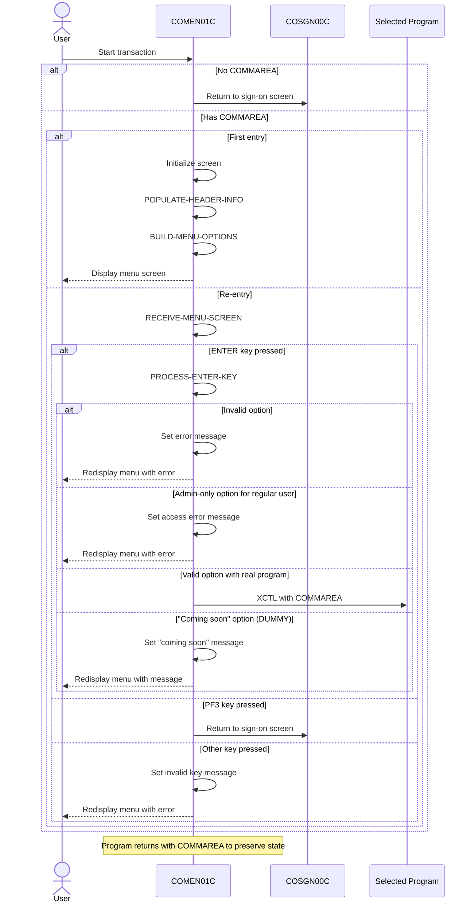

# COMEN01C

## Overview
This program serves as the main menu interface for regular users in the CardDemo application. It displays a list of available menu options based on the user's access level, processes user selections, and routes to the appropriate program when a valid option is chosen. The program prevents regular users from accessing admin-only options, displays appropriate error messages for invalid inputs, and includes functionality to return to the sign-on screen. It maintains session state through a commarea and includes standard header information with current date and time. The menu is dynamically built based on predefined options, with different display logic for regular users versus administrators.

## Metadata
**Program ID**: `COMEN01C`

**Author**: `AWS`

## Sequence Diagram


## Referenced Copybooks
- [`CSDAT01Y`](copybooks/CSDAT01Y.md)
- `DFHAID`
- [`CSUSR01Y`](copybooks/CSUSR01Y.md)
- [`COCOM01Y`](copybooks/COCOM01Y.md)
- [`COMEN02Y`](copybooks/COMEN02Y.md)
- `DFHBMSCA`
- `COMEN01`
- [`COTTL01Y`](copybooks/COTTL01Y.md)
- [`CSMSG01Y`](copybooks/CSMSG01Y.md)

## Environment Division

### CONFIGURATION SECTION
This section would typically contain configuration settings for the COMEN01C program, which is the main menu interface for regular users in the CardDemo application. The configuration section would define special names, file assignments, and system dependencies required for the program's operation. However, the provided snippet is empty, suggesting that this program may not require specific configuration settings beyond what might be defined elsewhere in the program or in shared configuration files. This aligns with the program's primary function as a menu interface that focuses on displaying options and routing user selections rather than performing complex file operations or system interactions.
<details><summary>Code</summary>
```cobol

```
</details>


## Data Division

### WORKING-STORAGE SECTION
This Working-Storage section defines the main variables and data structures used by the COMEN01C program (the CardDemo main menu interface). It includes program identifiers, error handling flags, response codes, and variables for processing menu options. The section incorporates several copybooks that likely contain menu definitions (COMEN01, COMEN02Y), common data structures (COCOM01Y), title formatting (COTTL01Y), date handling (CSDAT01Y), messaging (CSMSG01Y), and user information (CSUSR01Y). It also includes standard CICS copybooks for AID keys and BMS attributes. The variables support the program's core functionality of displaying menu options, processing user selections, and handling navigation between different parts of the CardDemo application.
<details><summary>Code</summary>
```cobol
01 WS-VARIABLES.
         05 WS-PGMNAME                 PIC X(08) VALUE 'COMEN01C'.
         05 WS-TRANID                  PIC X(04) VALUE 'CM00'.
         05 WS-MESSAGE                 PIC X(80) VALUE SPACES.
         05 WS-USRSEC-FILE             PIC X(08) VALUE 'USRSEC  '.
         05 WS-ERR-FLG                 PIC X(01) VALUE 'N'.
           88 ERR-FLG-ON                         VALUE 'Y'.
           88 ERR-FLG-OFF                        VALUE 'N'.
         05 WS-RESP-CD                 PIC S9(09) COMP VALUE ZEROS.
         05 WS-REAS-CD                 PIC S9(09) COMP VALUE ZEROS.
         05 WS-OPTION-X                PIC X(02) JUST RIGHT.
         05 WS-OPTION                  PIC 9(02) VALUE 0.
         05 WS-IDX                     PIC S9(04) COMP VALUE ZEROS.
         05 WS-MENU-OPT-TXT            PIC X(40) VALUE SPACES.

       COPY COCOM01Y.
       COPY COMEN02Y.

       COPY COMEN01.

       COPY COTTL01Y.
       COPY CSDAT01Y.
       COPY CSMSG01Y.
       COPY CSUSR01Y.

       COPY DFHAID.
       COPY DFHBMSCA.

      *----------------------------------------------------------------*
      *                        LINKAGE SECTION
      *----------------------------------------------------------------*
```
</details>


### LINKAGE SECTION
This linkage section defines the communication area (DFHCOMMAREA) used to pass data between programs in the CardDemo menu interface. It contains a single field, LK-COMMAREA, which is defined as a variable-length array of characters that can expand from 1 to 32,767 bytes depending on the actual length of the communication area (EIBCALEN). This flexible structure allows the program to receive and process communication data of different sizes from calling programs within the application.
<details><summary>Code</summary>
```cobol
01  DFHCOMMAREA.
         05  LK-COMMAREA                           PIC X(01)
             OCCURS 1 TO 32767 TIMES DEPENDING ON EIBCALEN.

      *----------------------------------------------------------------*
      *
```
</details>


## Procedure Division

### MAIN-PARA
This paragraph handles the main control flow of the menu interface program. It first clears any error flags and message fields, then checks if the program was called with a communication area. If no commarea exists, it returns to the sign-on screen. Otherwise, it retrieves the commarea data and determines if this is the first entry to the program or a re-entry. On first entry, it initializes the screen and displays the menu. On re-entry, it processes user input based on the key pressed: ENTER key triggers option processing, PF3 returns to the sign-on screen, and any other key generates an invalid key error message. The paragraph maintains session state by returning with the updated commarea and transaction ID to preserve context between interactions.
<details><summary>Code</summary>
```cobol
SET ERR-FLG-OFF TO TRUE

           MOVE SPACES TO WS-MESSAGE
                          ERRMSGO OF COMEN1AO

           IF EIBCALEN = 0
               MOVE 'COSGN00C' TO CDEMO-FROM-PROGRAM
               PERFORM RETURN-TO-SIGNON-SCREEN
           ELSE
               MOVE DFHCOMMAREA(1:EIBCALEN) TO CARDDEMO-COMMAREA
               IF NOT CDEMO-PGM-REENTER
                   SET CDEMO-PGM-REENTER    TO TRUE
                   MOVE LOW-VALUES          TO COMEN1AO
                   PERFORM SEND-MENU-SCREEN
               ELSE
                   PERFORM RECEIVE-MENU-SCREEN
                   EVALUATE EIBAID
                       WHEN DFHENTER
                           PERFORM PROCESS-ENTER-KEY
                       WHEN DFHPF3
                           MOVE 'COSGN00C' TO CDEMO-TO-PROGRAM
                           PERFORM RETURN-TO-SIGNON-SCREEN
                       WHEN OTHER
                           MOVE 'Y'                       TO WS-ERR-FLG
                           MOVE CCDA-MSG-INVALID-KEY      TO WS-MESSAGE
                           PERFORM SEND-MENU-SCREEN
                   END-EVALUATE
               END-IF
           END-IF

           EXEC CICS RETURN
                     TRANSID (WS-TRANID)
                     COMMAREA (CARDDEMO-COMMAREA)
           END-EXEC.

      *----------------------------------------------------------------*
      *                      PROCESS-ENTER-KEY
      *----------------------------------------------------------------*
```
</details>


### PROCESS-ENTER-KEY
This paragraph processes user menu selections when the Enter key is pressed. It first extracts and validates the option number entered by the user, removing trailing spaces and converting any remaining spaces to zeros. The code then performs several validation checks: ensuring the option is numeric, within the valid range of menu options, and not zero. If the user is a regular user attempting to access an admin-only option (designated by 'A'), an error message is displayed. For valid selections, the program transfers control to the appropriate program using CICS XCTL, passing the commarea to maintain session state. If the target program name begins with "DUMMY", the system displays a "coming soon" message instead of transferring control. Error conditions trigger appropriate error messages and redisplay of the menu screen.
<details><summary>Code</summary>
```cobol
PERFORM VARYING WS-IDX
                   FROM LENGTH OF OPTIONI OF COMEN1AI BY -1 UNTIL
                   OPTIONI OF COMEN1AI(WS-IDX:1) NOT = SPACES OR
                   WS-IDX = 1
           END-PERFORM
           MOVE OPTIONI OF COMEN1AI(1:WS-IDX) TO WS-OPTION-X
           INSPECT WS-OPTION-X REPLACING ALL ' ' BY '0'
           MOVE WS-OPTION-X              TO WS-OPTION
           MOVE WS-OPTION                TO OPTIONO OF COMEN1AO

           IF WS-OPTION IS NOT NUMERIC OR
              WS-OPTION > CDEMO-MENU-OPT-COUNT OR
              WS-OPTION = ZEROS
               MOVE 'Y'     TO WS-ERR-FLG
               MOVE 'Please enter a valid option number...' TO
                               WS-MESSAGE
               PERFORM SEND-MENU-SCREEN
           END-IF

           IF CDEMO-USRTYP-USER AND
              CDEMO-MENU-OPT-USRTYPE(WS-OPTION) = 'A'
               SET ERR-FLG-ON          TO TRUE
               MOVE SPACES             TO WS-MESSAGE
               MOVE 'No access - Admin Only option... ' TO
                                       WS-MESSAGE
               PERFORM SEND-MENU-SCREEN
           END-IF

           IF NOT ERR-FLG-ON
               IF CDEMO-MENU-OPT-PGMNAME(WS-OPTION)(1:5) NOT = 'DUMMY'
                   MOVE WS-TRANID    TO CDEMO-FROM-TRANID
                   MOVE WS-PGMNAME   TO CDEMO-FROM-PROGRAM
      *            MOVE WS-USER-ID   TO CDEMO-USER-ID
      *            MOVE SEC-USR-TYPE TO CDEMO-USER-TYPE
                   MOVE ZEROS        TO CDEMO-PGM-CONTEXT
                   EXEC CICS
                       XCTL PROGRAM(CDEMO-MENU-OPT-PGMNAME(WS-OPTION))
                       COMMAREA(CARDDEMO-COMMAREA)
                   END-EXEC
               END-IF
               MOVE SPACES             TO WS-MESSAGE
               MOVE DFHGREEN           TO ERRMSGC  OF COMEN1AO
               STRING 'This option '       DELIMITED BY SIZE
                       CDEMO-MENU-OPT-NAME(WS-OPTION)
                                       DELIMITED BY SPACE
                       'is coming soon ...'   DELIMITED BY SIZE
                  INTO WS-MESSAGE
               PERFORM SEND-MENU-SCREEN
           END-IF.

      *----------------------------------------------------------------*
      *                      RETURN-TO-SIGNON-SCREEN
      *----------------------------------------------------------------*
```
</details>


### RETURN-TO-SIGNON-SCREEN
This paragraph handles the return to the sign-on screen functionality. It checks if the target program (CDEMO-TO-PROGRAM) is empty or contains spaces, and if so, sets it to 'COSGN00C' which is the sign-on program. It then uses the CICS XCTL command to transfer control to the specified program without returning to the calling program. This ensures users are properly redirected to the sign-on screen when logging out or when session navigation requires returning to the authentication interface.
<details><summary>Code</summary>
```cobol
IF CDEMO-TO-PROGRAM = LOW-VALUES OR SPACES
               MOVE 'COSGN00C' TO CDEMO-TO-PROGRAM
           END-IF
           EXEC CICS
               XCTL PROGRAM(CDEMO-TO-PROGRAM)
           END-EXEC.

      *----------------------------------------------------------------*
      *                      SEND-MENU-SCREEN
      *----------------------------------------------------------------*
```
</details>


### SEND-MENU-SCREEN
This paragraph handles the display of the menu screen to the user. It first calls POPULATE-HEADER-INFO to set up standard header information (likely date, time, and user details) and then calls BUILD-MENU-OPTIONS to generate the appropriate menu items based on the user's access level. Any system messages or error notifications stored in WS-MESSAGE are transferred to the output map's error message field. Finally, it uses the CICS SEND command to display the COMEN1A map from the COMEN01 mapset to the user, clearing the previous screen content with the ERASE option.
<details><summary>Code</summary>
```cobol
PERFORM POPULATE-HEADER-INFO
           PERFORM BUILD-MENU-OPTIONS

           MOVE WS-MESSAGE TO ERRMSGO OF COMEN1AO

           EXEC CICS SEND
                     MAP('COMEN1A')
                     MAPSET('COMEN01')
                     FROM(COMEN1AO)
                     ERASE
           END-EXEC.

      *----------------------------------------------------------------*
      *                      RECEIVE-MENU-SCREEN
      *----------------------------------------------------------------*
```
</details>


### RECEIVE-MENU-SCREEN
This paragraph handles the reception of user input from the menu screen. It uses the CICS RECEIVE command to capture data entered on the 'COMEN1A' map within the 'COMEN01' mapset, storing the received data in the COMEN1AI structure. The response codes from this operation are captured in WS-RESP-CD and WS-REAS-CD variables for subsequent error handling. This is a standard CICS interaction pattern for accepting user input before processing menu selections.
<details><summary>Code</summary>
```cobol
EXEC CICS RECEIVE
                     MAP('COMEN1A')
                     MAPSET('COMEN01')
                     INTO(COMEN1AI)
                     RESP(WS-RESP-CD)
                     RESP2(WS-REAS-CD)
           END-EXEC.

      *----------------------------------------------------------------*
      *                      POPULATE-HEADER-INFO
      *----------------------------------------------------------------*
```
</details>


### POPULATE-HEADER-INFO
This paragraph populates the header information for the CardDemo main menu screen. It retrieves the current system date and time using the CURRENT-DATE function, then formats and displays this information on the screen. The paragraph sets the application title fields from predefined constants, displays the transaction ID and program name, and formats the current date in MM/DD/YY format and the current time in HH:MM:SS format. This creates a consistent header that provides context to users about which application they're using and when they're using it.
<details><summary>Code</summary>
```cobol
MOVE FUNCTION CURRENT-DATE  TO WS-CURDATE-DATA

           MOVE CCDA-TITLE01           TO TITLE01O OF COMEN1AO
           MOVE CCDA-TITLE02           TO TITLE02O OF COMEN1AO
           MOVE WS-TRANID              TO TRNNAMEO OF COMEN1AO
           MOVE WS-PGMNAME             TO PGMNAMEO OF COMEN1AO

           MOVE WS-CURDATE-MONTH       TO WS-CURDATE-MM
           MOVE WS-CURDATE-DAY         TO WS-CURDATE-DD
           MOVE WS-CURDATE-YEAR(3:2)   TO WS-CURDATE-YY

           MOVE WS-CURDATE-MM-DD-YY    TO CURDATEO OF COMEN1AO

           MOVE WS-CURTIME-HOURS       TO WS-CURTIME-HH
           MOVE WS-CURTIME-MINUTE      TO WS-CURTIME-MM
           MOVE WS-CURTIME-SECOND      TO WS-CURTIME-SS

           MOVE WS-CURTIME-HH-MM-SS    TO CURTIMEO OF COMEN1AO.

      *----------------------------------------------------------------*
      *                      BUILD-MENU-OPTIONS
      *----------------------------------------------------------------*
```
</details>


### BUILD-MENU-OPTIONS
This paragraph dynamically constructs and populates the menu options displayed to users in the CardDemo application's main menu interface. It iterates through the available menu options (stored in the CDEMO-MENU-OPT arrays) up to the total count of options. For each option, it formats a display string by combining the option number, a period and space, and the option name. Based on the current index position, it then assigns this formatted text to the appropriate screen field (OPTN001O through OPTN012O), supporting up to 12 menu options. This approach allows the menu to be built dynamically based on the user's access level, with different options potentially available to regular users versus administrators.
<details><summary>Code</summary>
```cobol
PERFORM VARYING WS-IDX FROM 1 BY 1 UNTIL
                           WS-IDX > CDEMO-MENU-OPT-COUNT

               MOVE SPACES             TO WS-MENU-OPT-TXT

               STRING CDEMO-MENU-OPT-NUM(WS-IDX)  DELIMITED BY SIZE
                      '. '                         DELIMITED BY SIZE
                      CDEMO-MENU-OPT-NAME(WS-IDX) DELIMITED BY SIZE
                 INTO WS-MENU-OPT-TXT

               EVALUATE WS-IDX
                   WHEN 1
                       MOVE WS-MENU-OPT-TXT TO OPTN001O
                   WHEN 2
                       MOVE WS-MENU-OPT-TXT TO OPTN002O
                   WHEN 3
                       MOVE WS-MENU-OPT-TXT TO OPTN003O
                   WHEN 4
                       MOVE WS-MENU-OPT-TXT TO OPTN004O
                   WHEN 5
                       MOVE WS-MENU-OPT-TXT TO OPTN005O
                   WHEN 6
                       MOVE WS-MENU-OPT-TXT TO OPTN006O
                   WHEN 7
                       MOVE WS-MENU-OPT-TXT TO OPTN007O
                   WHEN 8
                       MOVE WS-MENU-OPT-TXT TO OPTN008O
                   WHEN 9
                       MOVE WS-MENU-OPT-TXT TO OPTN009O
                   WHEN 10
                       MOVE WS-MENU-OPT-TXT TO OPTN010O
                   WHEN 11
                       MOVE WS-MENU-OPT-TXT TO OPTN011O
                   WHEN 12
                       MOVE WS-MENU-OPT-TXT TO OPTN012O
                   WHEN OTHER
                       CONTINUE
               END-EVALUATE

           END-PERFORM.


      *
      * Ver: CardDemo_v1.0-15-g27d6c6f-68 Date: 2022-07-19 23:12:33 CDT
      *
```
</details>
