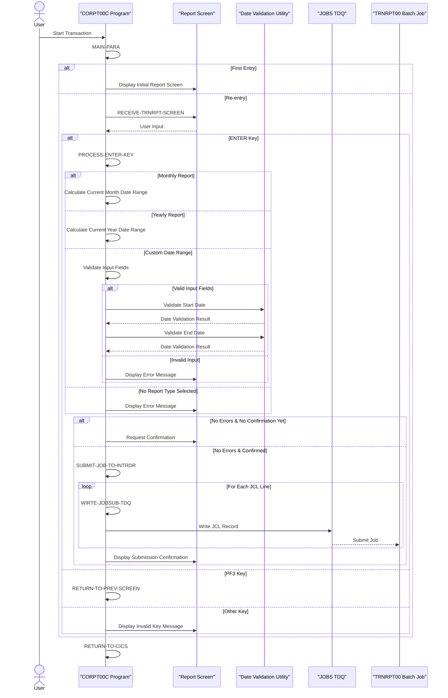

# CORPT00C

## Overview
This program (CORPT00C) is a CICS COBOL application that allows users to generate transaction reports by submitting batch jobs from an online interface using an extra partition transient data queue (TDQ). The program provides three report options: monthly, yearly, and custom date range reports. 

When executed, the program displays a screen where users can select a report type and specify date parameters for custom reports. After validation of user inputs (including date format validation using the CSUTLDTC utility), the program constructs a JCL job with the appropriate parameters and submits it to the internal reader via the "JOBS" TDQ. The batch job (TRNRPT00) will then execute the transaction report generation process based on the specified date range.

The program includes comprehensive error handling for input validation, ensuring dates are properly formatted and valid before job submission. It also requires user confirmation before submitting the report job. The interface provides navigation options, including the ability to return to a previous menu screen.

## Metadata
**Program ID**: `CORPT00C`

**Author**: `AWS`

## Sequence Diagram


## Referenced Copybooks
- [`CSDAT01Y`](copybooks/CSDAT01Y.md)
- `DFHAID`
- [`CVTRA05Y`](copybooks/CVTRA05Y.md)
- `CORPT00`
- [`COCOM01Y`](copybooks/COCOM01Y.md)
- `DFHBMSCA`
- [`COTTL01Y`](copybooks/COTTL01Y.md)
- [`CSMSG01Y`](copybooks/CSMSG01Y.md)

## Environment Division

### CONFIGURATION SECTION
This section would typically contain configuration details for the CORPT00C program, including file assignments, special names, and system dependencies. In this CICS COBOL application, the Configuration Section would define resources needed for the transaction report generation functionality, such as the "JOBS" TDQ used for job submission to the internal reader, any file definitions required for processing, and possibly special names for date handling with the CSUTLDTC utility. However, the specific configuration details are not provided in the snippet.
<details><summary>Code</summary>
```cobol

```
</details>


## Data Division

### WORKING-STORAGE SECTION
This Working Storage Section defines the data structures used in the CORPT00C program for transaction report generation. It includes variables for program control, error handling, and date processing. Key elements include flags for error handling and processing control, date fields structured in YYYY-MM-DD format for report date ranges, and an extensive JCL job template structure (JOB-DATA) that will be populated and submitted to the internal reader. The section also contains parameters for date validation using the CSUTLDTC utility. The program incorporates several copybooks for common functionality, including screen layouts (CORPT00), title components (COTTL01Y), date handling (CSDAT01Y), messaging (CSMSG01Y), transaction processing (CVTRA05Y), and standard CICS definitions (DFHAID, DFHBMSCA).
<details><summary>Code</summary>
```cobol
01 WS-VARIABLES.
         05 WS-PGMNAME                 PIC X(08) VALUE 'CORPT00C'.
         05 WS-TRANID                  PIC X(04) VALUE 'CR00'.
         05 WS-MESSAGE                 PIC X(80) VALUE SPACES.
         05 WS-TRANSACT-FILE             PIC X(08) VALUE 'TRANSACT'.
         05 WS-ERR-FLG                 PIC X(01) VALUE 'N'.
           88 ERR-FLG-ON                         VALUE 'Y'.
           88 ERR-FLG-OFF                        VALUE 'N'.
         05 WS-TRANSACT-EOF            PIC X(01) VALUE 'N'.
           88 TRANSACT-EOF                       VALUE 'Y'.
           88 TRANSACT-NOT-EOF                   VALUE 'N'.
         05 WS-SEND-ERASE-FLG          PIC X(01) VALUE 'Y'.
           88 SEND-ERASE-YES                     VALUE 'Y'.
           88 SEND-ERASE-NO                      VALUE 'N'.
         05 WS-END-LOOP                PIC X(01) VALUE 'N'.
           88 END-LOOP-YES                       VALUE 'Y'.
           88 END-LOOP-NO                        VALUE 'N'.

         05 WS-RESP-CD                 PIC S9(09) COMP VALUE ZEROS.
         05 WS-REAS-CD                 PIC S9(09) COMP VALUE ZEROS.
         05 WS-REC-COUNT               PIC S9(04) COMP VALUE ZEROS.
         05 WS-IDX                     PIC S9(04) COMP VALUE ZEROS.
         05 WS-REPORT-NAME             PIC X(10) VALUE SPACES.

         05 WS-START-DATE.
            10 WS-START-DATE-YYYY      PIC X(04) VALUE SPACES.
            10 FILLER                  PIC X(01) VALUE '-'.
            10 WS-START-DATE-MM        PIC X(02) VALUE SPACES.
            10 FILLER                  PIC X(01) VALUE '-'.
            10 WS-START-DATE-DD        PIC X(02) VALUE SPACES.
         05 WS-END-DATE.
            10 WS-END-DATE-YYYY        PIC X(04) VALUE SPACES.
            10 FILLER                  PIC X(01) VALUE '-'.
            10 WS-END-DATE-MM          PIC X(02) VALUE SPACES.
            10 FILLER                  PIC X(01) VALUE '-'.
            10 WS-END-DATE-DD          PIC X(02) VALUE SPACES.
         05 WS-DATE-FORMAT             PIC X(10) VALUE 'YYYY-MM-DD'.

         05 WS-NUM-99                  PIC 99   VALUE 0.
         05 WS-NUM-9999                PIC 9999 VALUE 0.

         05 WS-TRAN-AMT                PIC +99999999.99.
         05 WS-TRAN-DATE               PIC X(08) VALUE '00/00/00'.
         05 JCL-RECORD                 PIC X(80) VALUE ' '.

       01 JOB-DATA.
        02 JOB-DATA-1.
         05 FILLER                     PIC X(80) VALUE
         "//TRNRPT00 JOB 'TRAN REPORT',CLASS=A,MSGCLASS=0,".
         05 FILLER                     PIC X(80) VALUE
         "// NOTIFY=&SYSUID".
         05 FILLER                     PIC X(80) VALUE
         "//*".
         05 FILLER                     PIC X(80) VALUE
         "//JOBLIB JCLLIB ORDER=('AWS.M2.CARDDEMO.PROC')".
         05 FILLER                     PIC X(80) VALUE
         "//*".
         05 FILLER                     PIC X(80) VALUE
         "//STEP10 EXEC PROC=TRANREPT".
         05 FILLER                     PIC X(80) VALUE
         "//*".
         05 FILLER                     PIC X(80) VALUE
         "//STEP05R.SYMNAMES DD *".
         05 FILLER                     PIC X(80) VALUE
         "TRAN-CARD-NUM,263,16,ZD".
         05 FILLER                     PIC X(80) VALUE
         "TRAN-PROC-DT,305,10,CH".
         05 FILLER-1.
            10 FILLER                  PIC X(18) VALUE
         "PARM-START-DATE,C'".
            10 PARM-START-DATE-1       PIC X(10) VALUE SPACES.
            10 FILLER                  PIC X(52) VALUE "'".
         05 FILLER-2.
            10 FILLER                  PIC X(16) VALUE
         "PARM-END-DATE,C'".
            10 PARM-END-DATE-1         PIC X(10) VALUE SPACES.
            10 FILLER                  PIC X(54) VALUE "'".
         05 FILLER                     PIC X(80) VALUE
         "/*".
         05 FILLER                     PIC X(80) VALUE
         "//STEP10R.DATEPARM DD *".
         05 FILLER-3.
            10 PARM-START-DATE-2       PIC X(10) VALUE SPACES.
            10 FILLER                  PIC X VALUE SPACE.
            10 PARM-END-DATE-2         PIC X(10) VALUE SPACES.
            10 FILLER                  PIC X(59) VALUE SPACES.
         05 FILLER                     PIC X(80) VALUE
         "/*".
         05 FILLER                     PIC X(80) VALUE
         "/*EOF".
        02 JOB-DATA-2 REDEFINES JOB-DATA-1.
         05 JOB-LINES OCCURS 1000 TIMES PIC X(80).

       01 CSUTLDTC-PARM.
          05 CSUTLDTC-DATE                   PIC X(10).
          05 CSUTLDTC-DATE-FORMAT            PIC X(10).
          05 CSUTLDTC-RESULT.
             10 CSUTLDTC-RESULT-SEV-CD       PIC X(04).
             10 FILLER                       PIC X(11).
             10 CSUTLDTC-RESULT-MSG-NUM      PIC X(04).
             10 CSUTLDTC-RESULT-MSG          PIC X(61).

       COPY COCOM01Y.

       COPY CORPT00.

       COPY COTTL01Y.
       COPY CSDAT01Y.
       COPY CSMSG01Y.

       COPY CVTRA05Y.

       COPY DFHAID.
       COPY DFHBMSCA.

      *----------------------------------------------------------------*
      *                        LINKAGE SECTION
      *----------------------------------------------------------------*
```
</details>


### LINKAGE SECTION
This section defines the DFHCOMMAREA in the Linkage Section, which is used to receive and pass data between CICS transactions. It contains a single field, LK-COMMAREA, defined as a variable-length array of characters that can expand from 1 to 32,767 bytes depending on the actual length passed in EIBCALEN (CICS Executive Interface Block Communication Area Length). This structure allows the program to handle communication areas of different sizes when the program is invoked from other CICS programs or when control returns to this program after a transfer.
<details><summary>Code</summary>
```cobol
01  DFHCOMMAREA.
         05  LK-COMMAREA                           PIC X(01)
             OCCURS 1 TO 32767 TIMES DEPENDING ON EIBCALEN.

      *----------------------------------------------------------------*
      *
```
</details>


## Procedure Division

### MAIN-PARA
This paragraph serves as the main control flow for the transaction report generation program. It initializes error flags, handles first-time entry versus re-entry to the program, and processes user interactions.

When first entered, the code checks if a communication area exists. If not, it returns to the sign-on program (COSGN00C). For valid entries, it either displays the initial report selection screen or processes user input from a previously displayed screen.

The paragraph implements navigation logic through function key handling - specifically processing ENTER key actions through a separate paragraph and allowing users to return to the menu screen (COMEN01C) via PF3. Any other key inputs trigger an error message.

The code maintains program state between interactions by returning with the transaction ID and communication area, enabling the conversation to continue when the user responds.
<details><summary>Code</summary>
```cobol
SET ERR-FLG-OFF TO TRUE
           SET TRANSACT-NOT-EOF TO TRUE
           SET SEND-ERASE-YES TO TRUE

           MOVE SPACES TO WS-MESSAGE
                          ERRMSGO OF CORPT0AO

           IF EIBCALEN = 0
               MOVE 'COSGN00C' TO CDEMO-TO-PROGRAM
               PERFORM RETURN-TO-PREV-SCREEN
           ELSE
               MOVE DFHCOMMAREA(1:EIBCALEN) TO CARDDEMO-COMMAREA
               IF NOT CDEMO-PGM-REENTER
                   SET CDEMO-PGM-REENTER    TO TRUE
                   MOVE LOW-VALUES          TO CORPT0AO
                   MOVE -1       TO MONTHLYL OF CORPT0AI
                   PERFORM SEND-TRNRPT-SCREEN
               ELSE
                   PERFORM RECEIVE-TRNRPT-SCREEN
                   EVALUATE EIBAID
                       WHEN DFHENTER
                           PERFORM PROCESS-ENTER-KEY
                       WHEN DFHPF3
                           MOVE 'COMEN01C' TO CDEMO-TO-PROGRAM
                           PERFORM RETURN-TO-PREV-SCREEN
                       WHEN OTHER
                           MOVE 'Y'                       TO WS-ERR-FLG
                           MOVE -1       TO MONTHLYL OF CORPT0AI
                           MOVE CCDA-MSG-INVALID-KEY      TO WS-MESSAGE
                           PERFORM SEND-TRNRPT-SCREEN
                   END-EVALUATE
               END-IF
           END-IF

           EXEC CICS RETURN
                     TRANSID (WS-TRANID)
                     COMMAREA (CARDDEMO-COMMAREA)
           END-EXEC.


      *----------------------------------------------------------------*
      *                      PROCESS-ENTER-KEY
      *----------------------------------------------------------------*
```
</details>


### PROCESS-ENTER-KEY
This paragraph processes the Enter key action in the transaction report generation interface, handling three report types: monthly, yearly, and custom date range. For monthly and yearly reports, it automatically calculates appropriate date ranges (current month or current year respectively). For custom reports, it performs extensive validation of user-entered dates, checking for empty fields, numeric values, valid ranges (months 1-12, days 1-31), and valid calendar dates using the CSUTLDTC utility. After validation, it prepares the report parameters and calls the SUBMIT-JOB-TO-INTRDR paragraph to submit the batch job. The code includes comprehensive error handling with specific error messages for each validation failure, positioning the cursor at the problematic field. Upon successful submission, it displays a confirmation message indicating which report type was submitted.
<details><summary>Code</summary>
```cobol
DISPLAY 'PROCESS ENTER KEY'

           EVALUATE TRUE
               WHEN MONTHLYI OF CORPT0AI NOT = SPACES AND LOW-VALUES
                   MOVE 'Monthly'   TO WS-REPORT-NAME
                   MOVE FUNCTION CURRENT-DATE  TO WS-CURDATE-DATA

                   MOVE WS-CURDATE-YEAR     TO WS-START-DATE-YYYY
                   MOVE WS-CURDATE-MONTH    TO WS-START-DATE-MM
                   MOVE '01'                TO WS-START-DATE-DD
                   MOVE WS-START-DATE       TO PARM-START-DATE-1
                                               PARM-START-DATE-2

                   MOVE 1              TO WS-CURDATE-DAY
                   ADD 1               TO WS-CURDATE-MONTH
                   IF WS-CURDATE-MONTH > 12
                       ADD 1           TO WS-CURDATE-YEAR
                       MOVE 1          TO WS-CURDATE-MONTH
                   END-IF
                   COMPUTE WS-CURDATE-N = FUNCTION DATE-OF-INTEGER(
                           FUNCTION INTEGER-OF-DATE(WS-CURDATE-N) - 1)

                   MOVE WS-CURDATE-YEAR     TO WS-END-DATE-YYYY
                   MOVE WS-CURDATE-MONTH    TO WS-END-DATE-MM
                   MOVE WS-CURDATE-DAY      TO WS-END-DATE-DD
                   MOVE WS-END-DATE         TO PARM-END-DATE-1
                                               PARM-END-DATE-2

                   PERFORM SUBMIT-JOB-TO-INTRDR
               WHEN YEARLYI OF CORPT0AI NOT = SPACES AND LOW-VALUES
                   MOVE 'Yearly'   TO WS-REPORT-NAME
                   MOVE FUNCTION CURRENT-DATE  TO WS-CURDATE-DATA

                   MOVE WS-CURDATE-YEAR     TO WS-START-DATE-YYYY
                                               WS-END-DATE-YYYY
                   MOVE '01'                TO WS-START-DATE-MM
                                               WS-START-DATE-DD
                   MOVE WS-START-DATE       TO PARM-START-DATE-1
                                               PARM-START-DATE-2

                   MOVE '12'                TO WS-END-DATE-MM
                   MOVE '31'                TO WS-END-DATE-DD
                   MOVE WS-END-DATE         TO PARM-END-DATE-1
                                               PARM-END-DATE-2

                   PERFORM SUBMIT-JOB-TO-INTRDR
               WHEN CUSTOMI OF CORPT0AI NOT = SPACES AND LOW-VALUES

                   EVALUATE TRUE
                       WHEN SDTMMI OF CORPT0AI = SPACES OR
                                                   LOW-VALUES
                           MOVE 'Start Date - Month can NOT be empty...'
                             TO WS-MESSAGE
                           MOVE 'Y'     TO WS-ERR-FLG
                           MOVE -1       TO SDTMML OF CORPT0AI
                           PERFORM SEND-TRNRPT-SCREEN
                       WHEN SDTDDI OF CORPT0AI = SPACES OR
                                                   LOW-VALUES
                           MOVE 'Start Date - Day can NOT be empty...'
                             TO WS-MESSAGE
                           MOVE 'Y'     TO WS-ERR-FLG
                           MOVE -1       TO SDTDDL OF CORPT0AI
                           PERFORM SEND-TRNRPT-SCREEN
                       WHEN SDTYYYYI OF CORPT0AI = SPACES OR
                                                   LOW-VALUES
                           MOVE 'Start Date - Year can NOT be empty...'
                             TO WS-MESSAGE
                           MOVE 'Y'     TO WS-ERR-FLG
                           MOVE -1       TO SDTYYYYL OF CORPT0AI
                           PERFORM SEND-TRNRPT-SCREEN
                       WHEN EDTMMI OF CORPT0AI = SPACES OR
                                                   LOW-VALUES
                           MOVE 'End Date - Month can NOT be empty...'
                             TO WS-MESSAGE
                           MOVE 'Y'     TO WS-ERR-FLG
                           MOVE -1       TO EDTMML OF CORPT0AI
                           PERFORM SEND-TRNRPT-SCREEN
                       WHEN EDTDDI OF CORPT0AI = SPACES OR
                                                   LOW-VALUES
                           MOVE 'End Date - Day can NOT be empty...'
                             TO WS-MESSAGE
                           MOVE 'Y'     TO WS-ERR-FLG
                           MOVE -1       TO EDTDDL OF CORPT0AI
                           PERFORM SEND-TRNRPT-SCREEN
                       WHEN EDTYYYYI OF CORPT0AI = SPACES OR
                                                   LOW-VALUES
                           MOVE 'End Date - Year can NOT be empty...'
                             TO WS-MESSAGE
                           MOVE 'Y'     TO WS-ERR-FLG
                           MOVE -1       TO EDTYYYYL OF CORPT0AI
                           PERFORM SEND-TRNRPT-SCREEN
                       WHEN OTHER
                           CONTINUE
                   END-EVALUATE

                   COMPUTE WS-NUM-99 = FUNCTION NUMVAL-C
                                         (SDTMMI OF CORPT0AI)
                   MOVE WS-NUM-99      TO SDTMMI OF CORPT0AI

                   COMPUTE WS-NUM-99 = FUNCTION NUMVAL-C
                                         (SDTDDI OF CORPT0AI)
                   MOVE WS-NUM-99      TO SDTDDI OF CORPT0AI

                   COMPUTE WS-NUM-9999 = FUNCTION NUMVAL-C
                                           (SDTYYYYI OF CORPT0AI)
                   MOVE WS-NUM-9999      TO SDTYYYYI OF CORPT0AI

                   COMPUTE WS-NUM-99 = FUNCTION NUMVAL-C
                                         (EDTMMI OF CORPT0AI)
                   MOVE WS-NUM-99      TO EDTMMI OF CORPT0AI

                   COMPUTE WS-NUM-99 = FUNCTION NUMVAL-C
                                         (EDTDDI OF CORPT0AI)
                   MOVE WS-NUM-99      TO EDTDDI OF CORPT0AI

                   COMPUTE WS-NUM-9999 = FUNCTION NUMVAL-C
                                           (EDTYYYYI OF CORPT0AI)
                   MOVE WS-NUM-9999      TO EDTYYYYI OF CORPT0AI

                   IF SDTMMI OF CORPT0AI IS NOT NUMERIC OR
                      SDTMMI OF CORPT0AI > '12'
                       MOVE 'Start Date - Not a valid Month...'
                         TO WS-MESSAGE
                       MOVE 'Y'     TO WS-ERR-FLG
                       MOVE -1       TO SDTMML OF CORPT0AI
                       PERFORM SEND-TRNRPT-SCREEN
                   END-IF

                   IF SDTDDI OF CORPT0AI IS NOT NUMERIC OR
                      SDTDDI OF CORPT0AI > '31'
                       MOVE 'Start Date - Not a valid Day...'
                         TO WS-MESSAGE
                       MOVE 'Y'     TO WS-ERR-FLG
                       MOVE -1       TO SDTDDL OF CORPT0AI
                       PERFORM SEND-TRNRPT-SCREEN
                   END-IF

                   IF SDTYYYYI OF CORPT0AI IS NOT NUMERIC
                       MOVE 'Start Date - Not a valid Year...'
                         TO WS-MESSAGE
                       MOVE 'Y'     TO WS-ERR-FLG
                       MOVE -1       TO SDTYYYYL OF CORPT0AI
                       PERFORM SEND-TRNRPT-SCREEN
                   END-IF

                   IF EDTMMI OF CORPT0AI IS NOT NUMERIC OR
                      EDTMMI OF CORPT0AI > '12'
                       MOVE 'End Date - Not a valid Month...'
                         TO WS-MESSAGE
                       MOVE 'Y'     TO WS-ERR-FLG
                       MOVE -1       TO EDTMML OF CORPT0AI
                       PERFORM SEND-TRNRPT-SCREEN
                   END-IF

                   IF EDTDDI OF CORPT0AI IS NOT NUMERIC OR
                      EDTDDI OF CORPT0AI > '31'
                       MOVE 'End Date - Not a valid Day...'
                         TO WS-MESSAGE
                       MOVE 'Y'     TO WS-ERR-FLG
                       MOVE -1       TO EDTDDL OF CORPT0AI
                       PERFORM SEND-TRNRPT-SCREEN
                   END-IF

                   IF EDTYYYYI OF CORPT0AI IS NOT NUMERIC
                       MOVE 'End Date - Not a valid Year...'
                         TO WS-MESSAGE
                       MOVE 'Y'     TO WS-ERR-FLG
                       MOVE -1       TO EDTYYYYL OF CORPT0AI
                       PERFORM SEND-TRNRPT-SCREEN
                   END-IF

                   MOVE SDTYYYYI OF CORPT0AI TO WS-START-DATE-YYYY
                   MOVE SDTMMI   OF CORPT0AI TO WS-START-DATE-MM
                   MOVE SDTDDI   OF CORPT0AI TO WS-START-DATE-DD
                   MOVE EDTYYYYI OF CORPT0AI TO WS-END-DATE-YYYY
                   MOVE EDTMMI   OF CORPT0AI TO WS-END-DATE-MM
                   MOVE EDTDDI   OF CORPT0AI TO WS-END-DATE-DD

                   MOVE WS-START-DATE        TO CSUTLDTC-DATE
                   MOVE WS-DATE-FORMAT       TO CSUTLDTC-DATE-FORMAT
                   MOVE SPACES               TO CSUTLDTC-RESULT

                   CALL 'CSUTLDTC' USING   CSUTLDTC-DATE
                                           CSUTLDTC-DATE-FORMAT
                                           CSUTLDTC-RESULT

                   IF CSUTLDTC-RESULT-SEV-CD = '0000'
                       CONTINUE
                   ELSE
                       IF CSUTLDTC-RESULT-MSG-NUM NOT = '2513'
                           MOVE 'Start Date - Not a valid date...'
                             TO WS-MESSAGE
                           MOVE 'Y'     TO WS-ERR-FLG
                           MOVE -1       TO SDTMML OF CORPT0AI
                           PERFORM SEND-TRNRPT-SCREEN
                       END-IF
                   END-IF

                   MOVE WS-END-DATE          TO CSUTLDTC-DATE
                   MOVE WS-DATE-FORMAT       TO CSUTLDTC-DATE-FORMAT
                   MOVE SPACES               TO CSUTLDTC-RESULT

                   CALL 'CSUTLDTC' USING   CSUTLDTC-DATE
                                           CSUTLDTC-DATE-FORMAT
                                           CSUTLDTC-RESULT

                   IF CSUTLDTC-RESULT-SEV-CD = '0000'
                       CONTINUE
                   ELSE
                       IF CSUTLDTC-RESULT-MSG-NUM NOT = '2513'
                           MOVE 'End Date - Not a valid date...'
                             TO WS-MESSAGE
                           MOVE 'Y'     TO WS-ERR-FLG
                           MOVE -1       TO EDTMML OF CORPT0AI
                           PERFORM SEND-TRNRPT-SCREEN
                       END-IF
                   END-IF


                   MOVE WS-START-DATE       TO PARM-START-DATE-1
                                               PARM-START-DATE-2
                   MOVE WS-END-DATE         TO PARM-END-DATE-1
                                               PARM-END-DATE-2
                   MOVE 'Custom'   TO WS-REPORT-NAME
                   IF NOT ERR-FLG-ON
                       PERFORM SUBMIT-JOB-TO-INTRDR
                   END-IF
               WHEN OTHER
                   MOVE 'Select a report type to print report...' TO
                                   WS-MESSAGE
                   MOVE 'Y'     TO WS-ERR-FLG
                   MOVE -1       TO MONTHLYL OF CORPT0AI
                   PERFORM SEND-TRNRPT-SCREEN
           END-EVALUATE

           IF NOT ERR-FLG-ON

               PERFORM INITIALIZE-ALL-FIELDS
               MOVE DFHGREEN           TO ERRMSGC  OF CORPT0AO
               STRING WS-REPORT-NAME   DELIMITED BY SPACE
                 ' report submitted for printing ...'
                                       DELIMITED BY SIZE
                 INTO WS-MESSAGE
               MOVE -1       TO MONTHLYL OF CORPT0AI
               PERFORM SEND-TRNRPT-SCREEN

           END-IF.


      *----------------------------------------------------------------*
      *                      SUBMIT-JOB-TO-INTRDR
      *----------------------------------------------------------------*
```
</details>


### SUBMIT-JOB-TO-INTRDR
This paragraph handles the job submission confirmation process and writes the JCL to the transient data queue. It first checks if the user has provided confirmation input. If not, it prompts the user to confirm the report generation. When confirmation is provided, it validates the response ('Y' or 'N'), either continuing with job submission for 'Y' or reinitializing the screen for 'N'. For invalid confirmation values, it displays an error message. Once confirmed, the paragraph iterates through the pre-constructed JCL statements in the JOB-LINES array, writing each line to the JOBS transient data queue until it encounters an end marker ('/*EOF') or empty line. This effectively submits the batch job to the internal reader for execution.
<details><summary>Code</summary>
```cobol
IF CONFIRMI OF CORPT0AI = SPACES OR LOW-VALUES
               STRING
                 'Please confirm to print the '
                                   DELIMITED BY SIZE
                 WS-REPORT-NAME    DELIMITED BY SPACE
                 ' report...'      DELIMITED BY SIZE
                 INTO WS-MESSAGE
               MOVE 'Y'     TO WS-ERR-FLG
               MOVE -1       TO CONFIRML OF CORPT0AI
               PERFORM SEND-TRNRPT-SCREEN
           END-IF

           IF NOT ERR-FLG-ON
               EVALUATE TRUE
                   WHEN CONFIRMI OF CORPT0AI = 'Y' OR 'y'
                       CONTINUE
                   WHEN CONFIRMI OF CORPT0AI = 'N' OR 'n'
                       PERFORM INITIALIZE-ALL-FIELDS
                       MOVE 'Y'     TO WS-ERR-FLG
                       PERFORM SEND-TRNRPT-SCREEN
                   WHEN OTHER
                       STRING
                         '"'               DELIMITED BY SIZE
                         CONFIRMI OF CORPT0AI    DELIMITED BY SPACE
                         '" is not a valid value to confirm...'
                                           DELIMITED BY SIZE
                         INTO WS-MESSAGE
                       MOVE 'Y'     TO WS-ERR-FLG
                       MOVE -1       TO CONFIRML OF CORPT0AI
                       PERFORM SEND-TRNRPT-SCREEN
               END-EVALUATE

               SET END-LOOP-NO TO TRUE

               PERFORM VARYING WS-IDX FROM 1 BY 1 UNTIL WS-IDX > 1000 OR
                                      END-LOOP-YES  OR ERR-FLG-ON

                   MOVE JOB-LINES(WS-IDX) TO JCL-RECORD
                   IF JCL-RECORD = '/*EOF' OR
                      JCL-RECORD = SPACES OR LOW-VALUES
                       SET END-LOOP-YES TO TRUE
                   END-IF

                   PERFORM WIRTE-JOBSUB-TDQ
               END-PERFORM

           END-IF.

      *----------------------------------------------------------------*
      *                      WIRTE-JOBSUB-TDQ
      *----------------------------------------------------------------*
```
</details>


### WIRTE-JOBSUB-TDQ
This paragraph handles the submission of JCL job records to the "JOBS" transient data queue (TDQ) which serves as an interface to the internal reader. It writes the constructed JCL record to the queue and implements error handling logic. If the operation completes normally, processing continues. For any other response code, the paragraph displays diagnostic information (response and reason codes), sets an error flag, prepares an error message for the user, positions the cursor at the MONTHLY field on the input screen, and then calls the SEND-TRNRPT-SCREEN paragraph to display the error to the user. This is a critical component of the job submission process that ensures proper feedback when the TDQ write operation fails.
<details><summary>Code</summary>
```cobol
EXEC CICS WRITEQ TD
             QUEUE ('JOBS')
             FROM (JCL-RECORD)
             LENGTH (LENGTH OF JCL-RECORD)
             RESP(WS-RESP-CD)
             RESP2(WS-REAS-CD)
           END-EXEC.

           EVALUATE WS-RESP-CD
               WHEN DFHRESP(NORMAL)
                   CONTINUE
               WHEN OTHER
                   DISPLAY 'RESP:' WS-RESP-CD 'REAS:' WS-REAS-CD
                   MOVE 'Y'     TO WS-ERR-FLG
                   MOVE 'Unable to Write TDQ (JOBS)...' TO
                                   WS-MESSAGE
                   MOVE -1       TO MONTHLYL OF CORPT0AI
                   PERFORM SEND-TRNRPT-SCREEN
           END-EVALUATE.

      *----------------------------------------------------------------*
      *                      RETURN-TO-PREV-SCREEN
      *----------------------------------------------------------------*
```
</details>


### RETURN-TO-PREV-SCREEN
This paragraph handles the navigation back to a previous screen in the CardDemo application. It first checks if the target program is specified in the communication area, and if not, defaults to 'COSGN00C' (likely the main menu or sign-on screen). It then sets up the communication area with the current transaction ID and program name as the source of the transfer, resets the program context to zeros, and uses the CICS XCTL command to transfer control to the target program while passing the communication area. This provides a consistent navigation mechanism throughout the application.
<details><summary>Code</summary>
```cobol
IF CDEMO-TO-PROGRAM = LOW-VALUES OR SPACES
               MOVE 'COSGN00C' TO CDEMO-TO-PROGRAM
           END-IF
           MOVE WS-TRANID    TO CDEMO-FROM-TRANID
           MOVE WS-PGMNAME   TO CDEMO-FROM-PROGRAM
           MOVE ZEROS        TO CDEMO-PGM-CONTEXT
           EXEC CICS
               XCTL PROGRAM(CDEMO-TO-PROGRAM)
               COMMAREA(CARDDEMO-COMMAREA)
           END-EXEC.

      *----------------------------------------------------------------*
      *                      SEND-TRNRPT-SCREEN
      *----------------------------------------------------------------*
```
</details>


### SEND-TRNRPT-SCREEN
This paragraph handles the display of the transaction report screen to the user. It first calls the POPULATE-HEADER-INFO paragraph to set up common header information, then displays any system messages stored in WS-MESSAGE to the user. The paragraph uses conditional logic to determine whether to send the screen with the ERASE option (which clears the screen before displaying) or without it, based on the SEND-ERASE-YES flag. In both cases, it sends the CORPT0A map from the CORPT00 mapset with cursor positioning. After sending the screen, it transfers control to the RETURN-TO-CICS paragraph to return control to CICS.
<details><summary>Code</summary>
```cobol
PERFORM POPULATE-HEADER-INFO

           MOVE WS-MESSAGE TO ERRMSGO OF CORPT0AO

           IF SEND-ERASE-YES
               EXEC CICS SEND
                         MAP('CORPT0A')
                         MAPSET('CORPT00')
                         FROM(CORPT0AO)
                         ERASE
                         CURSOR
               END-EXEC
           ELSE
               EXEC CICS SEND
                         MAP('CORPT0A')
                         MAPSET('CORPT00')
                         FROM(CORPT0AO)
      *                  ERASE
                         CURSOR
               END-EXEC
           END-IF.

           GO TO RETURN-TO-CICS.

      *----------------------------------------------------------------*
      *                         RETURN-TO-CICS
      *----------------------------------------------------------------*
```
</details>


### RETURN-TO-CICS
This paragraph handles the return to CICS control after processing is complete. It executes a CICS RETURN command that specifies the transaction ID stored in WS-TRANID and passes the CARDDEMO-COMMAREA as the communication area for the next transaction. The LENGTH parameter is commented out, which means the system will use the default length of the COMMAREA. This is typically used at the end of processing to either terminate the transaction or to pass control back to CICS for the next transaction execution.
<details><summary>Code</summary>
```cobol
EXEC CICS RETURN
                     TRANSID (WS-TRANID)
                     COMMAREA (CARDDEMO-COMMAREA)
      *              LENGTH(LENGTH OF CARDDEMO-COMMAREA)
           END-EXEC.

      *----------------------------------------------------------------*
      *                      RECEIVE-TRNRPT-SCREEN
      *----------------------------------------------------------------*
```
</details>


### RECEIVE-TRNRPT-SCREEN
This paragraph receives user input from the transaction report selection screen (CORPT0A) into the input map area (CORPT0AI). It captures the user's report type selection and date parameters entered on the screen. The CICS RECEIVE command stores response codes in WS-RESP-CD and WS-REAS-CD variables for error handling. After receiving the screen data, control will flow to the POPULATE-HEADER-INFO paragraph which likely prepares common header information for the interface.
<details><summary>Code</summary>
```cobol
EXEC CICS RECEIVE
                     MAP('CORPT0A')
                     MAPSET('CORPT00')
                     INTO(CORPT0AI)
                     RESP(WS-RESP-CD)
                     RESP2(WS-REAS-CD)
           END-EXEC.

      *----------------------------------------------------------------*
      *                      POPULATE-HEADER-INFO
      *----------------------------------------------------------------*
```
</details>


### POPULATE-HEADER-INFO
This paragraph populates the header information for the transaction report screen. It retrieves the current system date and time using the CURRENT-DATE function, then formats and displays this information on the screen. The paragraph sets the screen title fields from constants, displays the transaction ID and program name, and formats the current date in MM/DD/YY format and the current time in HH:MM:SS format for display. This ensures the user interface shows accurate identifying information and timestamps when generating transaction reports.
<details><summary>Code</summary>
```cobol
MOVE FUNCTION CURRENT-DATE  TO WS-CURDATE-DATA

           MOVE CCDA-TITLE01           TO TITLE01O OF CORPT0AO
           MOVE CCDA-TITLE02           TO TITLE02O OF CORPT0AO
           MOVE WS-TRANID              TO TRNNAMEO OF CORPT0AO
           MOVE WS-PGMNAME             TO PGMNAMEO OF CORPT0AO

           MOVE WS-CURDATE-MONTH       TO WS-CURDATE-MM
           MOVE WS-CURDATE-DAY         TO WS-CURDATE-DD
           MOVE WS-CURDATE-YEAR(3:2)   TO WS-CURDATE-YY

           MOVE WS-CURDATE-MM-DD-YY    TO CURDATEO OF CORPT0AO

           MOVE WS-CURTIME-HOURS       TO WS-CURTIME-HH
           MOVE WS-CURTIME-MINUTE      TO WS-CURTIME-MM
           MOVE WS-CURTIME-SECOND      TO WS-CURTIME-SS

           MOVE WS-CURTIME-HH-MM-SS    TO CURTIMEO OF CORPT0AO.

      *----------------------------------------------------------------*
      *                      INITIALIZE-ALL-FIELDS
      *----------------------------------------------------------------*
```
</details>


### INITIALIZE-ALL-FIELDS
This paragraph initializes the input fields on the transaction report generation screen. It first positions the cursor at the MONTHLY field by setting its length attribute to -1, then clears all input fields including report type selection options (MONTHLY, YEARLY, CUSTOM), start date components (month, day, year), end date components (month, day, year), and the confirmation field. This ensures the screen is reset to a clean state when the user first accesses the report generation interface or when fields need to be cleared during processing.
<details><summary>Code</summary>
```cobol
MOVE -1              TO MONTHLYL OF CORPT0AI
           INITIALIZE              MONTHLYI OF CORPT0AI
                                   YEARLYI  OF CORPT0AI
                                   CUSTOMI  OF CORPT0AI
                                   SDTMMI   OF CORPT0AI
                                   SDTDDI   OF CORPT0AI
                                   SDTYYYYI OF CORPT0AI
                                   EDTMMI   OF CORPT0AI
                                   EDTDDI   OF CORPT0AI
                                   EDTYYYYI OF CORPT0AI
                                   CONFIRMI OF CORPT0AI
```
</details>


### WS-MESSAGE
This paragraph contains version control information for the CORPT00C program, showing it's part of the CardDemo application version 1.0-15-g27d6c6f-68, with a timestamp of July 19, 2022, at 23:12:33 CDT. This helps track which version of the code is deployed and when it was last updated.
<details><summary>Code</summary>
```cobol
*
      * Ver: CardDemo_v1.0-15-g27d6c6f-68 Date: 2022-07-19 23:12:33 CDT
      *
```
</details>
