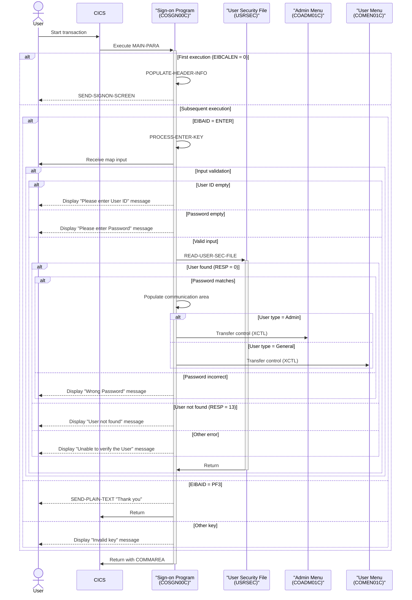

# COSGN00C

## Overview
This program serves as the sign-on screen handler for the CardDemo application in a CICS environment. It manages user authentication by displaying a login form, validating user credentials against a security file (USRSEC), and routing authenticated users to appropriate programs based on their user type. The program handles various function keys, performs input validation to ensure user ID and password fields are not empty, and displays appropriate error messages when validation fails. Upon successful authentication, it transfers control to either the admin menu (COADM01C) or the general user menu (COMEN01C) based on the user's security profile, passing user context information through a communication area.

## Metadata
**Program ID**: `COSGN00C`

**Author**: `AWS`

## Sequence Diagram


## Referenced Copybooks
- [`CSDAT01Y`](copybooks/CSDAT01Y.md)
- `DFHAID`
- [`CSUSR01Y`](copybooks/CSUSR01Y.md)
- [`COCOM01Y`](copybooks/COCOM01Y.md)
- `DFHBMSCA`
- `DFHATTR`
- [`COTTL01Y`](copybooks/COTTL01Y.md)
- `COSGN00`
- [`CSMSG01Y`](copybooks/CSMSG01Y.md)

## Environment Division

### CONFIGURATION SECTION
This environment section is empty, indicating that the COSGN00C program does not define any special configuration settings, file assignments, or system dependencies in its CONFIGURATION SECTION. The program likely relies on standard CICS environment settings or defines its configuration needs elsewhere in the program.
<details><summary>Code</summary>
```cobol

```
</details>


## Data Division

### WORKING-STORAGE SECTION
This Working-Storage Section defines the key variables and data structures used by the sign-on program COSGN00C. It includes program-specific variables for tracking the program name, transaction ID, error messages, and user credentials. The section defines the USRSEC file name for user authentication, error flags with condition names for easier status checking, and response/reason codes for error handling. Several copybooks are included to incorporate common data structures: COCOM01Y (likely communication area), COSGN00 (sign-on screen layout), COTTL01Y (title information), CSDAT01Y (date handling), CSMSG01Y (message handling), and CSUSR01Y (user information). Standard CICS copybooks DFHAID and DFHBMSCA are included for function key definitions and BMS screen control attributes. This section establishes the foundation for the program's user authentication and screen handling functionality.
<details><summary>Code</summary>
```cobol
01 WS-VARIABLES.
         05 WS-PGMNAME                 PIC X(08) VALUE 'COSGN00C'.
         05 WS-TRANID                  PIC X(04) VALUE 'CC00'.
         05 WS-MESSAGE                 PIC X(80) VALUE SPACES.
         05 WS-USRSEC-FILE             PIC X(08) VALUE 'USRSEC  '.
         05 WS-ERR-FLG                 PIC X(01) VALUE 'N'.
           88 ERR-FLG-ON                         VALUE 'Y'.
           88 ERR-FLG-OFF                        VALUE 'N'.
         05 WS-RESP-CD                 PIC S9(09) COMP VALUE ZEROS.
         05 WS-REAS-CD                 PIC S9(09) COMP VALUE ZEROS.
         05 WS-USER-ID                 PIC X(08).
         05 WS-USER-PWD                PIC X(08).

       COPY COCOM01Y.

       COPY COSGN00.

       COPY COTTL01Y.
       COPY CSDAT01Y.
       COPY CSMSG01Y.
       COPY CSUSR01Y.

       COPY DFHAID.
       COPY DFHBMSCA.
      *COPY DFHATTR.

      *----------------------------------------------------------------*
      *                        LINKAGE SECTION
      *----------------------------------------------------------------*
```
</details>


### LINKAGE SECTION
This section defines the linkage area for communication with other programs. It contains a DFHCOMMAREA structure with a single field LK-COMMAREA, which is a variable-length array of characters that can hold between 1 and 32,767 bytes depending on the value of EIBCALEN (the CICS-provided length of the communication area). This structure allows the sign-on program to receive and pass data to other programs in the CardDemo application.
<details><summary>Code</summary>
```cobol
01  DFHCOMMAREA.
         05  LK-COMMAREA                           PIC X(01)
             OCCURS 1 TO 32767 TIMES DEPENDING ON EIBCALEN.

      *----------------------------------------------------------------*
      *
```
</details>


## Procedure Division

### MAIN-PARA
This paragraph serves as the main control flow for the sign-on screen handler. It first clears any error flags and message fields, then determines the appropriate action based on the program's execution context. If no communication area exists (EIBCALEN = 0), it initializes the screen with empty fields and positions the cursor at the user ID field. Otherwise, it processes user input based on the function key pressed: for Enter key, it calls the credential validation routine; for PF3, it displays a thank you message and exits; for any other key, it displays an invalid key error message. After processing, it returns control to CICS while preserving the transaction ID and communication area data for maintaining session state between interactions.
<details><summary>Code</summary>
```cobol
SET ERR-FLG-OFF TO TRUE

           MOVE SPACES TO WS-MESSAGE
                          ERRMSGO OF COSGN0AO

           IF EIBCALEN = 0
               MOVE LOW-VALUES TO COSGN0AO
               MOVE -1       TO USERIDL OF COSGN0AI
               PERFORM SEND-SIGNON-SCREEN
           ELSE
               EVALUATE EIBAID
                   WHEN DFHENTER
                       PERFORM PROCESS-ENTER-KEY
                   WHEN DFHPF3
                       MOVE CCDA-MSG-THANK-YOU        TO WS-MESSAGE
                       PERFORM SEND-PLAIN-TEXT
                   WHEN OTHER
                       MOVE 'Y'                       TO WS-ERR-FLG
                       MOVE CCDA-MSG-INVALID-KEY      TO WS-MESSAGE
                       PERFORM SEND-SIGNON-SCREEN
               END-EVALUATE
           END-IF.

           EXEC CICS RETURN
                     TRANSID (WS-TRANID)
                     COMMAREA (CARDDEMO-COMMAREA)
                     LENGTH(LENGTH OF CARDDEMO-COMMAREA)
           END-EXEC.


      *----------------------------------------------------------------*
      *                      PROCESS-ENTER-KEY
      *----------------------------------------------------------------*
```
</details>


### PROCESS-ENTER-KEY
This paragraph handles the processing of the Enter key in the sign-on screen. It first receives input from the COSGN0A map and then validates the user input. It checks if the User ID or Password fields are empty or contain low-values, displaying appropriate error messages and repositioning the cursor when validation fails. If both fields contain data, it converts the User ID and Password to uppercase and stores them in working storage variables. When no validation errors are detected, it proceeds to read the user security file to authenticate the credentials. This paragraph is a critical part of the application's authentication flow, ensuring that users provide the necessary credentials before proceeding.
<details><summary>Code</summary>
```cobol
EXEC CICS RECEIVE
                     MAP('COSGN0A')
                     MAPSET('COSGN00')
                     RESP(WS-RESP-CD)
                     RESP2(WS-REAS-CD)
           END-EXEC.

           EVALUATE TRUE
               WHEN USERIDI OF COSGN0AI = SPACES OR LOW-VALUES
                   MOVE 'Y'      TO WS-ERR-FLG
                   MOVE 'Please enter User ID ...' TO WS-MESSAGE
                   MOVE -1       TO USERIDL OF COSGN0AI
                   PERFORM SEND-SIGNON-SCREEN
               WHEN PASSWDI OF COSGN0AI = SPACES OR LOW-VALUES
                   MOVE 'Y'      TO WS-ERR-FLG
                   MOVE 'Please enter Password ...' TO WS-MESSAGE
                   MOVE -1       TO PASSWDL OF COSGN0AI
                   PERFORM SEND-SIGNON-SCREEN
               WHEN OTHER
                   CONTINUE
           END-EVALUATE.

           MOVE FUNCTION UPPER-CASE(USERIDI OF COSGN0AI) TO
                           WS-USER-ID
                           CDEMO-USER-ID
           MOVE FUNCTION UPPER-CASE(PASSWDI OF COSGN0AI) TO
                           WS-USER-PWD

           IF NOT ERR-FLG-ON
               PERFORM READ-USER-SEC-FILE
           END-IF.

      *----------------------------------------------------------------*
      *                      SEND-SIGNON-SCREEN
      *----------------------------------------------------------------*
```
</details>


### SEND-SIGNON-SCREEN
This paragraph displays the sign-on screen for the CardDemo application. It first calls the POPULATE-HEADER-INFO paragraph to set up header information, then moves any system message to the error message field on the screen. It then uses a CICS SEND command to display the COSGN0A map from the COSGN00 mapset, clearing the screen (ERASE) and positioning the cursor at the default input field. This is a key user interface component that presents the authentication form to users attempting to access the system.
<details><summary>Code</summary>
```cobol
PERFORM POPULATE-HEADER-INFO

           MOVE WS-MESSAGE TO ERRMSGO OF COSGN0AO

           EXEC CICS SEND
                     MAP('COSGN0A')
                     MAPSET('COSGN00')
                     FROM(COSGN0AO)
                     ERASE
                     CURSOR
           END-EXEC.

      *----------------------------------------------------------------*
      *                      SEND-PLAIN-TEXT
      *----------------------------------------------------------------*
```
</details>


### SEND-PLAIN-TEXT
This paragraph sends a plain text message to the terminal screen, displaying the content stored in WS-MESSAGE field. It erases the current screen content, frees the keyboard for user input, and then terminates the program execution by returning control to CICS. This functionality is likely used for displaying error messages or notifications to users during the sign-on process.
<details><summary>Code</summary>
```cobol
EXEC CICS SEND TEXT
                     FROM(WS-MESSAGE)
                     LENGTH(LENGTH OF WS-MESSAGE)
                     ERASE
                     FREEKB
           END-EXEC.

           EXEC CICS RETURN
           END-EXEC.

      *----------------------------------------------------------------*
      *                      POPULATE-HEADER-INFO
      *----------------------------------------------------------------*
```
</details>


### POPULATE-HEADER-INFO
This paragraph populates the header information for the sign-on screen. It retrieves the current date and time using the CURRENT-DATE function, formats them appropriately (MM/DD/YY for date and HH:MM:SS for time), and places them in the output screen fields. It also sets the application title fields from communication area values, displays the transaction ID and program name, and uses CICS ASSIGN commands to retrieve and display the APPLID (application identifier) and SYSID (system identifier) in the screen header. This provides users with contextual information about when and where they are accessing the system.
<details><summary>Code</summary>
```cobol
MOVE FUNCTION CURRENT-DATE  TO WS-CURDATE-DATA

           MOVE CCDA-TITLE01           TO TITLE01O OF COSGN0AO
           MOVE CCDA-TITLE02           TO TITLE02O OF COSGN0AO
           MOVE WS-TRANID              TO TRNNAMEO OF COSGN0AO
           MOVE WS-PGMNAME             TO PGMNAMEO OF COSGN0AO

           MOVE WS-CURDATE-MONTH       TO WS-CURDATE-MM
           MOVE WS-CURDATE-DAY         TO WS-CURDATE-DD
           MOVE WS-CURDATE-YEAR(3:2)   TO WS-CURDATE-YY

           MOVE WS-CURDATE-MM-DD-YY    TO CURDATEO OF COSGN0AO

           MOVE WS-CURTIME-HOURS       TO WS-CURTIME-HH
           MOVE WS-CURTIME-MINUTE      TO WS-CURTIME-MM
           MOVE WS-CURTIME-SECOND      TO WS-CURTIME-SS

           MOVE WS-CURTIME-HH-MM-SS    TO CURTIMEO OF COSGN0AO

           EXEC CICS ASSIGN
               APPLID(APPLIDO OF COSGN0AO)
           END-EXEC

           EXEC CICS ASSIGN
               SYSID(SYSIDO OF COSGN0AO)
           END-EXEC.

      *----------------------------------------------------------------*
      *                      READ-USER-SEC-FILE
      *----------------------------------------------------------------*
```
</details>


### READ-USER-SEC-FILE
This paragraph handles user authentication by reading the user security file (USRSEC) using the entered user ID as the key. It validates the password against the stored credentials and processes the authentication result. On successful authentication, it populates the communication area with user context information (transaction ID, program name, user ID, and user type) and transfers control to either the admin menu (COADM01C) or general user menu (COMEN01C) based on the user's security profile. If the password is incorrect, it displays an error message and returns to the sign-on screen with the cursor positioned at the password field. If the user ID is not found (response code 13) or another error occurs, it sets an error flag, displays an appropriate message, and returns to the sign-on screen with the cursor positioned at the user ID field.
<details><summary>Code</summary>
```cobol
EXEC CICS READ
                DATASET   (WS-USRSEC-FILE)
                INTO      (SEC-USER-DATA)
                LENGTH    (LENGTH OF SEC-USER-DATA)
                RIDFLD    (WS-USER-ID)
                KEYLENGTH (LENGTH OF WS-USER-ID)
                RESP      (WS-RESP-CD)
                RESP2     (WS-REAS-CD)
           END-EXEC.

           EVALUATE WS-RESP-CD
               WHEN 0
                   IF SEC-USR-PWD = WS-USER-PWD
                       MOVE WS-TRANID    TO CDEMO-FROM-TRANID
                       MOVE WS-PGMNAME   TO CDEMO-FROM-PROGRAM
                       MOVE WS-USER-ID   TO CDEMO-USER-ID
                       MOVE SEC-USR-TYPE TO CDEMO-USER-TYPE
                       MOVE ZEROS        TO CDEMO-PGM-CONTEXT

                       IF CDEMO-USRTYP-ADMIN
                            EXEC CICS XCTL
                              PROGRAM ('COADM01C')
                              COMMAREA(CARDDEMO-COMMAREA)
                            END-EXEC
                       ELSE
                            EXEC CICS XCTL
                              PROGRAM ('COMEN01C')
                              COMMAREA(CARDDEMO-COMMAREA)
                            END-EXEC
                       END-IF
                   ELSE
                       MOVE 'Wrong Password. Try again ...' TO
                                                          WS-MESSAGE
                       MOVE -1       TO PASSWDL OF COSGN0AI
                       PERFORM SEND-SIGNON-SCREEN
                   END-IF
               WHEN 13
                   MOVE 'Y'      TO WS-ERR-FLG
                   MOVE 'User not found. Try again ...' TO WS-MESSAGE
                   MOVE -1       TO USERIDL OF COSGN0AI
                   PERFORM SEND-SIGNON-SCREEN
               WHEN OTHER
                   MOVE 'Y'      TO WS-ERR-FLG
                   MOVE 'Unable to verify the User ...' TO WS-MESSAGE
                   MOVE -1       TO USERIDL OF COSGN0AI
                   PERFORM SEND-SIGNON-SCREEN
           END-EVALUATE.
      *
      * Ver: CardDemo_v1.0-15-g27d6c6f-68 Date: 2022-07-19 23:12:33 CDT
      *
```
</details>
