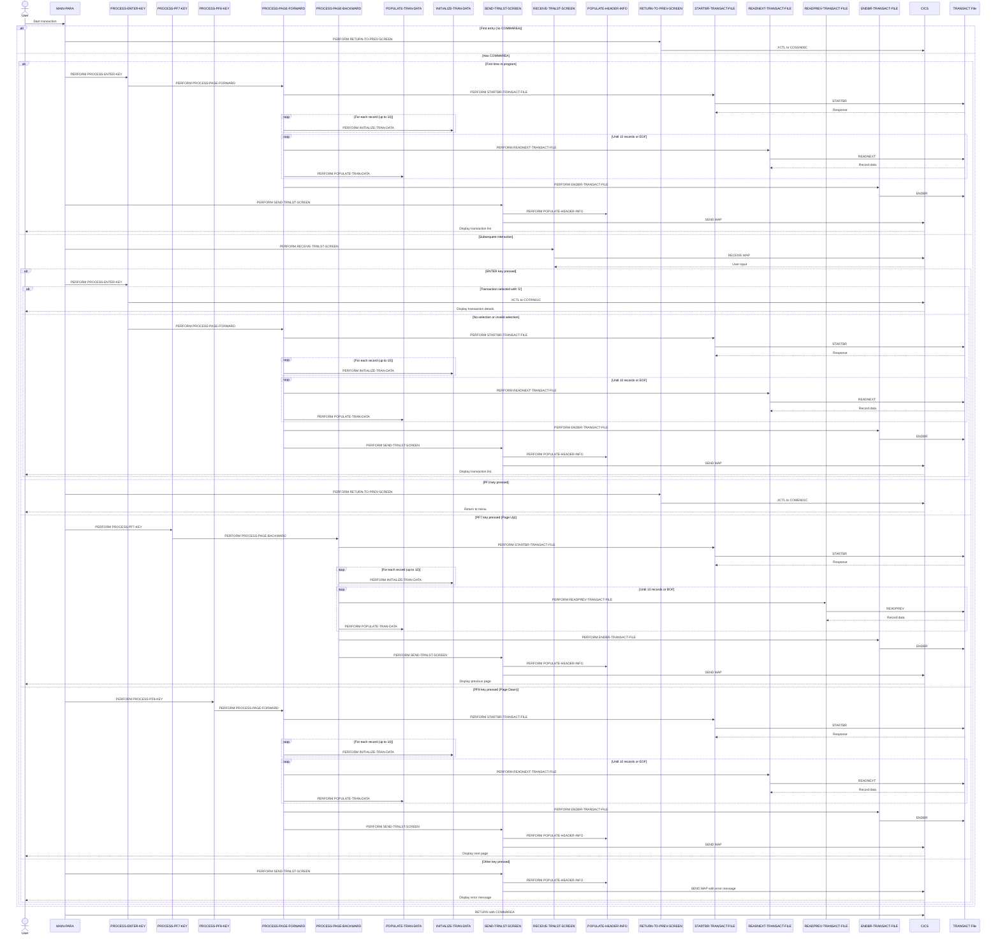

# COTRN00C

## Overview
This program, COTRN00C, is a CICS COBOL application that displays and manages a paginated list of transactions from the TRANSACT file. It provides a user interface for viewing transaction records with functionality for pagination, searching, and selecting individual transactions for detailed viewing.

The program allows users to navigate through transaction records using PF7 (page up) and PF8 (page down) keys, displaying 10 transactions per page. Users can enter a transaction ID to start browsing from a specific point or select a transaction with an 'S' command to view its details. When a transaction is selected, the program transfers control to COTRN01C for detailed transaction information.

The application handles various user interactions including input validation, error handling, and navigation between screens. It maintains context between screens through a shared communication area and provides clear feedback messages to guide the user. The program is part of the CardDemo application suite, which demonstrates AWS mainframe migration capabilities.

## Metadata
**Program ID**: `COTRN00C`

**Author**: `AWS`

## Sequence Diagram


## Referenced Copybooks
- [`CSDAT01Y`](copybooks/CSDAT01Y.md)
- `DFHAID`
- [`CVTRA05Y`](copybooks/CVTRA05Y.md)
- `COTRN00`
- [`COCOM01Y`](copybooks/COCOM01Y.md)
- `DFHBMSCA`
- [`COTTL01Y`](copybooks/COTTL01Y.md)
- [`CSMSG01Y`](copybooks/CSMSG01Y.md)

## Environment Division

### CONFIGURATION SECTION
This section would typically contain configuration details for the COTRN00C program, including file assignments, special names, and system dependencies. However, the provided snippet is empty, indicating that this program either doesn't require specific configuration settings in its CONFIGURATION SECTION or these settings might be defined elsewhere in the program structure. In CICS applications like this transaction management program, many configuration details are often handled through CICS resource definitions rather than within the COBOL code itself.
<details><summary>Code</summary>
```cobol

```
</details>


## Data Division

### WORKING-STORAGE SECTION
This Working Storage Section defines the key variables and data structures used in the COTRN00C transaction listing program. It includes program identifiers, status flags for error handling and file processing, counters for pagination, and work fields for transaction data manipulation. The section incorporates several copybooks: COCOM01Y (containing communication area fields for maintaining state between screens, including transaction selection tracking and pagination information), COTRN00 (likely the screen map definition), and various utility copybooks for titles, dates, messages, and transaction record structure (CVTRA05Y). Standard CICS copybooks for AID keys and BMS attributes are also included. The structure supports the program's core functionality of browsing, displaying, and selecting transaction records with pagination capabilities.
<details><summary>Code</summary>
```cobol
01 WS-VARIABLES.
         05 WS-PGMNAME                 PIC X(08) VALUE 'COTRN00C'.
         05 WS-TRANID                  PIC X(04) VALUE 'CT00'.
         05 WS-MESSAGE                 PIC X(80) VALUE SPACES.
         05 WS-TRANSACT-FILE             PIC X(08) VALUE 'TRANSACT'.
         05 WS-ERR-FLG                 PIC X(01) VALUE 'N'.
           88 ERR-FLG-ON                         VALUE 'Y'.
           88 ERR-FLG-OFF                        VALUE 'N'.
         05 WS-TRANSACT-EOF            PIC X(01) VALUE 'N'.
           88 TRANSACT-EOF                       VALUE 'Y'.
           88 TRANSACT-NOT-EOF                   VALUE 'N'.
         05 WS-SEND-ERASE-FLG          PIC X(01) VALUE 'Y'.
           88 SEND-ERASE-YES                     VALUE 'Y'.
           88 SEND-ERASE-NO                      VALUE 'N'.

         05 WS-RESP-CD                 PIC S9(09) COMP VALUE ZEROS.
         05 WS-REAS-CD                 PIC S9(09) COMP VALUE ZEROS.
         05 WS-REC-COUNT               PIC S9(04) COMP VALUE ZEROS.
         05 WS-IDX                     PIC S9(04) COMP VALUE ZEROS.
         05 WS-PAGE-NUM                PIC S9(04) COMP VALUE ZEROS.

         05 WS-TRAN-AMT                PIC +99999999.99.
         05 WS-TRAN-DATE               PIC X(08) VALUE '00/00/00'.


       COPY COCOM01Y.
          05 CDEMO-CT00-INFO.
             10 CDEMO-CT00-TRNID-FIRST     PIC X(16).
             10 CDEMO-CT00-TRNID-LAST      PIC X(16).
             10 CDEMO-CT00-PAGE-NUM        PIC 9(08).
             10 CDEMO-CT00-NEXT-PAGE-FLG   PIC X(01) VALUE 'N'.
                88 NEXT-PAGE-YES                     VALUE 'Y'.
                88 NEXT-PAGE-NO                      VALUE 'N'.
             10 CDEMO-CT00-TRN-SEL-FLG     PIC X(01).
             10 CDEMO-CT00-TRN-SELECTED    PIC X(16).

       COPY COTRN00.

       COPY COTTL01Y.
       COPY CSDAT01Y.
       COPY CSMSG01Y.

       COPY CVTRA05Y.

       COPY DFHAID.
       COPY DFHBMSCA.

      *----------------------------------------------------------------*
      *                        LINKAGE SECTION
      *----------------------------------------------------------------*
```
</details>


### LINKAGE SECTION
This section defines the linkage area used for communication with other programs. It contains a DFHCOMMAREA with a single field LK-COMMAREA, which is defined as a variable-length array of characters. The array can hold between 1 and 32,767 characters, with the actual length determined by the EIBCALEN value (CICS Execute Interface Block Communication Area Length). This structure allows the program to receive and pass data of varying sizes when called by or calling other programs within the CICS environment.
<details><summary>Code</summary>
```cobol
01  DFHCOMMAREA.
         05  LK-COMMAREA                           PIC X(01)
             OCCURS 1 TO 32767 TIMES DEPENDING ON EIBCALEN.

      *----------------------------------------------------------------*
      *
```
</details>


## Procedure Division

### MAIN-PARA
This paragraph serves as the main control flow for the COTRN00C transaction list program. It initializes key flags, handles the program's entry point logic, and processes user interactions. The paragraph first sets up error flags, pagination controls, and screen attributes before checking if the program was called with a communication area. If no communication area exists, it returns to the sign-on program (COSGN00C). 

For normal operation, it either initializes the screen on first entry or processes user input on subsequent entries. The paragraph implements a command dispatcher pattern that evaluates function key inputs and routes to appropriate processing routines: ENTER key for standard processing, PF3 to return to the menu program (COMEN01C), PF7/PF8 for pagination, with error handling for invalid keys. After processing, it returns control to CICS while preserving the program state in the communication area for the next interaction. This paragraph effectively manages the program's event-driven workflow and maintains user session context.
<details><summary>Code</summary>
```cobol
SET ERR-FLG-OFF TO TRUE
           SET TRANSACT-NOT-EOF TO TRUE
           SET NEXT-PAGE-NO TO TRUE
           SET SEND-ERASE-YES TO TRUE

           MOVE SPACES TO WS-MESSAGE
                          ERRMSGO OF COTRN0AO

           MOVE -1       TO TRNIDINL OF COTRN0AI

           IF EIBCALEN = 0
               MOVE 'COSGN00C' TO CDEMO-TO-PROGRAM
               PERFORM RETURN-TO-PREV-SCREEN
           ELSE
               MOVE DFHCOMMAREA(1:EIBCALEN) TO CARDDEMO-COMMAREA
               IF NOT CDEMO-PGM-REENTER
                   SET CDEMO-PGM-REENTER    TO TRUE
                   MOVE LOW-VALUES          TO COTRN0AO
                   PERFORM PROCESS-ENTER-KEY
                   PERFORM SEND-TRNLST-SCREEN
               ELSE
                   PERFORM RECEIVE-TRNLST-SCREEN
                   EVALUATE EIBAID
                       WHEN DFHENTER
                           PERFORM PROCESS-ENTER-KEY
                       WHEN DFHPF3
                           MOVE 'COMEN01C' TO CDEMO-TO-PROGRAM
                           PERFORM RETURN-TO-PREV-SCREEN
                       WHEN DFHPF7
                           PERFORM PROCESS-PF7-KEY
                       WHEN DFHPF8
                           PERFORM PROCESS-PF8-KEY
                       WHEN OTHER
                           MOVE 'Y'                       TO WS-ERR-FLG
                           MOVE -1       TO TRNIDINL OF COTRN0AI
                           MOVE CCDA-MSG-INVALID-KEY      TO WS-MESSAGE
                           PERFORM SEND-TRNLST-SCREEN
                   END-EVALUATE
               END-IF
           END-IF

           EXEC CICS RETURN
                     TRANSID (WS-TRANID)
                     COMMAREA (CARDDEMO-COMMAREA)
           END-EXEC.

      *----------------------------------------------------------------*
      *                      PROCESS-ENTER-KEY
      *----------------------------------------------------------------*
```
</details>


### PROCESS-ENTER-KEY
This paragraph handles the processing of the Enter key in the transaction list screen. It evaluates which transaction row has been selected by checking each selection field (SEL0001I through SEL0010I) and captures both the selection flag and the corresponding transaction ID. When a valid selection is made with an 'S' or 's' flag, the program transfers control to COTRN01C for detailed transaction viewing, passing context through the communication area. For invalid selection values, it displays an error message. The paragraph also processes the transaction ID input field, validating that it contains numeric data when provided, and displays appropriate error messages for invalid input. After processing the input, it resets the page number to 0 and calls the PROCESS-PAGE-FORWARD paragraph to display the appropriate transaction records. The cursor is positioned at the transaction ID input field for the next user interaction.
<details><summary>Code</summary>
```cobol
EVALUATE TRUE
               WHEN SEL0001I OF COTRN0AI NOT = SPACES AND LOW-VALUES
                   MOVE SEL0001I OF COTRN0AI TO CDEMO-CT00-TRN-SEL-FLG
                   MOVE TRNID01I OF COTRN0AI TO CDEMO-CT00-TRN-SELECTED
               WHEN SEL0002I OF COTRN0AI NOT = SPACES AND LOW-VALUES
                   MOVE SEL0002I OF COTRN0AI TO CDEMO-CT00-TRN-SEL-FLG
                   MOVE TRNID02I OF COTRN0AI TO CDEMO-CT00-TRN-SELECTED
               WHEN SEL0003I OF COTRN0AI NOT = SPACES AND LOW-VALUES
                   MOVE SEL0003I OF COTRN0AI TO CDEMO-CT00-TRN-SEL-FLG
                   MOVE TRNID03I OF COTRN0AI TO CDEMO-CT00-TRN-SELECTED
               WHEN SEL0004I OF COTRN0AI NOT = SPACES AND LOW-VALUES
                   MOVE SEL0004I OF COTRN0AI TO CDEMO-CT00-TRN-SEL-FLG
                   MOVE TRNID04I OF COTRN0AI TO CDEMO-CT00-TRN-SELECTED
               WHEN SEL0005I OF COTRN0AI NOT = SPACES AND LOW-VALUES
                   MOVE SEL0005I OF COTRN0AI TO CDEMO-CT00-TRN-SEL-FLG
                   MOVE TRNID05I OF COTRN0AI TO CDEMO-CT00-TRN-SELECTED
               WHEN SEL0006I OF COTRN0AI NOT = SPACES AND LOW-VALUES
                   MOVE SEL0006I OF COTRN0AI TO CDEMO-CT00-TRN-SEL-FLG
                   MOVE TRNID06I OF COTRN0AI TO CDEMO-CT00-TRN-SELECTED
               WHEN SEL0007I OF COTRN0AI NOT = SPACES AND LOW-VALUES
                   MOVE SEL0007I OF COTRN0AI TO CDEMO-CT00-TRN-SEL-FLG
                   MOVE TRNID07I OF COTRN0AI TO CDEMO-CT00-TRN-SELECTED
               WHEN SEL0008I OF COTRN0AI NOT = SPACES AND LOW-VALUES
                   MOVE SEL0008I OF COTRN0AI TO CDEMO-CT00-TRN-SEL-FLG
                   MOVE TRNID08I OF COTRN0AI TO CDEMO-CT00-TRN-SELECTED
               WHEN SEL0009I OF COTRN0AI NOT = SPACES AND LOW-VALUES
                   MOVE SEL0009I OF COTRN0AI TO CDEMO-CT00-TRN-SEL-FLG
                   MOVE TRNID09I OF COTRN0AI TO CDEMO-CT00-TRN-SELECTED
               WHEN SEL0010I OF COTRN0AI NOT = SPACES AND LOW-VALUES
                   MOVE SEL0010I OF COTRN0AI TO CDEMO-CT00-TRN-SEL-FLG
                   MOVE TRNID10I OF COTRN0AI TO CDEMO-CT00-TRN-SELECTED
               WHEN OTHER
                   MOVE SPACES   TO CDEMO-CT00-TRN-SEL-FLG
                   MOVE SPACES   TO CDEMO-CT00-TRN-SELECTED
           END-EVALUATE
           IF (CDEMO-CT00-TRN-SEL-FLG NOT = SPACES AND LOW-VALUES) AND
              (CDEMO-CT00-TRN-SELECTED NOT = SPACES AND LOW-VALUES)
               EVALUATE CDEMO-CT00-TRN-SEL-FLG
                   WHEN 'S'
                   WHEN 's'
                        MOVE 'COTRN01C'   TO CDEMO-TO-PROGRAM
                        MOVE WS-TRANID    TO CDEMO-FROM-TRANID
                        MOVE WS-PGMNAME   TO CDEMO-FROM-PROGRAM
                        MOVE 0        TO CDEMO-PGM-CONTEXT
                        EXEC CICS
                            XCTL PROGRAM(CDEMO-TO-PROGRAM)
                            COMMAREA(CARDDEMO-COMMAREA)
                        END-EXEC
                   WHEN OTHER
      *                SET TRANSACT-EOF TO TRUE
                       MOVE
                       'Invalid selection. Valid value is S' TO
                                       WS-MESSAGE
                       MOVE -1       TO TRNIDINL OF COTRN0AI
      *                PERFORM SEND-TRNLST-SCREEN
               END-EVALUATE
           END-IF

           IF TRNIDINI OF COTRN0AI = SPACES OR LOW-VALUES
               MOVE LOW-VALUES TO TRAN-ID
           ELSE
               IF TRNIDINI  OF COTRN0AI IS NUMERIC
                   MOVE TRNIDINI  OF COTRN0AI    TO TRAN-ID
               ELSE
                   MOVE 'Y'                       TO WS-ERR-FLG
                   MOVE
                   'Tran ID must be Numeric ...' TO
                                   WS-MESSAGE
                   MOVE -1                 TO TRNIDINL OF COTRN0AI
                   PERFORM SEND-TRNLST-SCREEN
               END-IF
           END-IF

           MOVE -1       TO TRNIDINL OF COTRN0AI


           MOVE 0       TO CDEMO-CT00-PAGE-NUM
           PERFORM PROCESS-PAGE-FORWARD

           IF NOT ERR-FLG-ON
               MOVE SPACE   TO TRNIDINO  OF COTRN0AO
           END-IF.

      *----------------------------------------------------------------*
      *                      PROCESS-PF7-KEY
      *----------------------------------------------------------------*
```
</details>


### PROCESS-PF7-KEY
This paragraph handles the Page Up (PF7) key functionality in the transaction list screen. It first determines the starting point for retrieving the previous page of transactions by checking if the first transaction ID is empty (in which case it uses LOW-VALUES) or using the stored first transaction ID. It sets a flag indicating a page navigation request and positions the cursor at the transaction ID input field. If the user is not already on the first page, it calls the PROCESS-PAGE-BACKWARD paragraph to retrieve and display the previous page of transactions. Otherwise, it displays a message informing the user they are already at the top of the page and redisplays the current screen without clearing it.
<details><summary>Code</summary>
```cobol
IF CDEMO-CT00-TRNID-FIRST = SPACES OR LOW-VALUES
               MOVE LOW-VALUES TO TRAN-ID
           ELSE
               MOVE CDEMO-CT00-TRNID-FIRST TO TRAN-ID
           END-IF

           SET NEXT-PAGE-YES TO TRUE
           MOVE -1       TO TRNIDINL OF COTRN0AI

           IF CDEMO-CT00-PAGE-NUM > 1
               PERFORM PROCESS-PAGE-BACKWARD
           ELSE
               MOVE 'You are already at the top of the page...' TO
                               WS-MESSAGE
               SET SEND-ERASE-NO TO TRUE
               PERFORM SEND-TRNLST-SCREEN
           END-IF.

      *----------------------------------------------------------------*
      *                      PROCESS-PF8-KEY
      *----------------------------------------------------------------*
```
</details>


### PROCESS-PF8-KEY
This paragraph handles the Page Down (PF8) key functionality in the transaction list screen. It determines the starting point for retrieving the next set of transaction records by checking if the last transaction ID is empty (indicating first use) or using the last displayed transaction ID as the starting point. The cursor is positioned at the transaction ID input field. If there are more records available (NEXT-PAGE-YES is true), it calls the PROCESS-PAGE-FORWARD paragraph to retrieve and display the next page of transactions. If the user is already at the bottom of the available records, it displays an informative message and refreshes the screen without clearing it.
<details><summary>Code</summary>
```cobol
IF CDEMO-CT00-TRNID-LAST = SPACES OR LOW-VALUES
               MOVE HIGH-VALUES TO TRAN-ID
           ELSE
               MOVE CDEMO-CT00-TRNID-LAST TO TRAN-ID
           END-IF

           MOVE -1       TO TRNIDINL OF COTRN0AI

           IF NEXT-PAGE-YES
               PERFORM PROCESS-PAGE-FORWARD
           ELSE
               MOVE 'You are already at the bottom of the page...' TO
                               WS-MESSAGE
               SET SEND-ERASE-NO TO TRUE
               PERFORM SEND-TRNLST-SCREEN
           END-IF.

      *----------------------------------------------------------------*
      *                      PROCESS-PAGE-FORWARD
      *----------------------------------------------------------------*
```
</details>


### PROCESS-PAGE-FORWARD
This paragraph handles the forward pagination functionality for the transaction list display. It starts by positioning the file pointer at the beginning of the transaction file and then reads through records to populate the current page of data. The process initializes all transaction data fields before populating them with actual values from the file.

The code reads up to 10 transaction records, populating screen fields for each record found. After loading the current page, it checks if more records exist beyond the current page to determine if a "next page" option should be available. If additional records exist, the page counter is incremented and the "next page" indicator is set to true.

The paragraph manages pagination state by updating the page number and clearing the transaction ID input field before redisplaying the screen with the newly loaded transaction data. Error conditions are handled throughout the process to ensure the program responds appropriately if file access issues occur.
<details><summary>Code</summary>
```cobol
PERFORM STARTBR-TRANSACT-FILE

           IF NOT ERR-FLG-ON

               IF EIBAID NOT = DFHENTER AND DFHPF7 AND DFHPF3
                   PERFORM READNEXT-TRANSACT-FILE
               END-IF

               IF TRANSACT-NOT-EOF AND ERR-FLG-OFF
                  PERFORM VARYING WS-IDX FROM 1 BY 1 UNTIL WS-IDX > 10
                      PERFORM INITIALIZE-TRAN-DATA
                  END-PERFORM
               END-IF

               MOVE 1             TO  WS-IDX

               PERFORM UNTIL WS-IDX >= 11 OR TRANSACT-EOF OR ERR-FLG-ON
                   PERFORM READNEXT-TRANSACT-FILE
                   IF TRANSACT-NOT-EOF AND ERR-FLG-OFF
                       PERFORM POPULATE-TRAN-DATA
                       COMPUTE WS-IDX = WS-IDX + 1
                   END-IF
               END-PERFORM

               IF TRANSACT-NOT-EOF AND ERR-FLG-OFF
                   COMPUTE CDEMO-CT00-PAGE-NUM =
                           CDEMO-CT00-PAGE-NUM + 1
                   PERFORM READNEXT-TRANSACT-FILE
                   IF TRANSACT-NOT-EOF AND ERR-FLG-OFF
                       SET NEXT-PAGE-YES TO TRUE
                   ELSE
                       SET NEXT-PAGE-NO TO TRUE
                   END-IF
               ELSE
                   SET NEXT-PAGE-NO TO TRUE
                   IF WS-IDX > 1
                       COMPUTE CDEMO-CT00-PAGE-NUM = CDEMO-CT00-PAGE-NUM
                        + 1
                   END-IF
               END-IF

               PERFORM ENDBR-TRANSACT-FILE

               MOVE CDEMO-CT00-PAGE-NUM TO PAGENUMI  OF COTRN0AI
               MOVE SPACE   TO TRNIDINO  OF COTRN0AO
               PERFORM SEND-TRNLST-SCREEN

           END-IF.

      *----------------------------------------------------------------*
      *                      PROCESS-PAGE-BACKWARD
      *----------------------------------------------------------------*
```
</details>


### PROCESS-PAGE-BACKWARD
This paragraph handles the backward pagination functionality when a user presses PF7 to view previous transaction records. It starts by establishing a browse session on the TRANSACT file, then initializes the display fields for up to 10 transaction records. The core logic reads transaction records in reverse order (using READPREV), populating the screen data fields until either 10 records are processed, the beginning of the file is reached, or an error occurs. After retrieving the records, it decrements the page number if appropriate and not already at page 1, ends the browse session, and displays the updated transaction list screen. The paragraph maintains proper pagination context while ensuring the user interface accurately reflects the available transaction data.
<details><summary>Code</summary>
```cobol
PERFORM STARTBR-TRANSACT-FILE

           IF NOT ERR-FLG-ON

               IF EIBAID NOT = DFHENTER AND DFHPF8
                   PERFORM READPREV-TRANSACT-FILE
               END-IF

               IF TRANSACT-NOT-EOF AND ERR-FLG-OFF
                  PERFORM VARYING WS-IDX FROM 1 BY 1 UNTIL WS-IDX > 10
                     PERFORM INITIALIZE-TRAN-DATA
                  END-PERFORM
               END-IF

               MOVE 10          TO  WS-IDX

               PERFORM UNTIL WS-IDX <= 0 OR TRANSACT-EOF OR ERR-FLG-ON
                   PERFORM READPREV-TRANSACT-FILE
                   IF TRANSACT-NOT-EOF AND ERR-FLG-OFF
                       PERFORM POPULATE-TRAN-DATA
                       COMPUTE WS-IDX = WS-IDX - 1
                   END-IF
               END-PERFORM

               IF TRANSACT-NOT-EOF AND ERR-FLG-OFF
                  PERFORM READPREV-TRANSACT-FILE
                  IF NEXT-PAGE-YES
                     IF TRANSACT-NOT-EOF AND ERR-FLG-OFF AND
                        CDEMO-CT00-PAGE-NUM > 1
                        SUBTRACT 1 FROM CDEMO-CT00-PAGE-NUM
                     ELSE
                        MOVE 1 TO CDEMO-CT00-PAGE-NUM
                     END-IF
                  END-IF
               END-IF

               PERFORM ENDBR-TRANSACT-FILE

               MOVE CDEMO-CT00-PAGE-NUM TO PAGENUMI  OF COTRN0AI
               PERFORM SEND-TRNLST-SCREEN

           END-IF.

      *----------------------------------------------------------------*
      *                      POPULATE-TRAN-DATA
      *----------------------------------------------------------------*
```
</details>


### POPULATE-TRAN-DATA
This paragraph formats and populates transaction data into the appropriate screen fields for display. It first processes the transaction amount and timestamp, extracting and reformatting the date components into a user-friendly format. Then, using an EVALUATE statement based on the current index (WS-IDX), it populates the corresponding row on the screen with transaction details including ID, date, description, and amount. For the first and last transactions displayed, it also stores the transaction IDs in communication area fields to track pagination boundaries. The paragraph handles up to 10 transactions, which corresponds to the maximum number of transactions displayed on a single page of the transaction list screen.
<details><summary>Code</summary>
```cobol
MOVE TRAN-AMT                  TO WS-TRAN-AMT
           MOVE TRAN-ORIG-TS              TO WS-TIMESTAMP
           MOVE WS-TIMESTAMP-DT-YYYY(3:2) TO WS-CURDATE-YY
           MOVE WS-TIMESTAMP-DT-MM        TO WS-CURDATE-MM
           MOVE WS-TIMESTAMP-DT-DD        TO WS-CURDATE-DD
           MOVE WS-CURDATE-MM-DD-YY       TO WS-TRAN-DATE

           EVALUATE WS-IDX
               WHEN 1
                   MOVE TRAN-ID    TO TRNID01I OF COTRN0AI
                                         CDEMO-CT00-TRNID-FIRST
                   MOVE WS-TRAN-DATE TO TDATE01I OF COTRN0AI
                   MOVE TRAN-DESC TO TDESC01I OF COTRN0AI
                   MOVE WS-TRAN-AMT  TO TAMT001I OF COTRN0AI
               WHEN 2
                   MOVE TRAN-ID    TO TRNID02I OF COTRN0AI
                   MOVE WS-TRAN-DATE TO TDATE02I OF COTRN0AI
                   MOVE TRAN-DESC TO TDESC02I OF COTRN0AI
                   MOVE WS-TRAN-AMT  TO TAMT002I OF COTRN0AI
               WHEN 3
                   MOVE TRAN-ID    TO TRNID03I OF COTRN0AI
                   MOVE WS-TRAN-DATE TO TDATE03I OF COTRN0AI
                   MOVE TRAN-DESC TO TDESC03I OF COTRN0AI
                   MOVE WS-TRAN-AMT  TO TAMT003I OF COTRN0AI
               WHEN 4
                   MOVE TRAN-ID    TO TRNID04I OF COTRN0AI
                   MOVE WS-TRAN-DATE TO TDATE04I OF COTRN0AI
                   MOVE TRAN-DESC TO TDESC04I OF COTRN0AI
                   MOVE WS-TRAN-AMT  TO TAMT004I OF COTRN0AI
               WHEN 5
                   MOVE TRAN-ID    TO TRNID05I OF COTRN0AI
                   MOVE WS-TRAN-DATE TO TDATE05I OF COTRN0AI
                   MOVE TRAN-DESC TO TDESC05I OF COTRN0AI
                   MOVE WS-TRAN-AMT  TO TAMT005I OF COTRN0AI
               WHEN 6
                   MOVE TRAN-ID    TO TRNID06I OF COTRN0AI
                   MOVE WS-TRAN-DATE TO TDATE06I OF COTRN0AI
                   MOVE TRAN-DESC TO TDESC06I OF COTRN0AI
                   MOVE WS-TRAN-AMT  TO TAMT006I OF COTRN0AI
               WHEN 7
                   MOVE TRAN-ID    TO TRNID07I OF COTRN0AI
                   MOVE WS-TRAN-DATE TO TDATE07I OF COTRN0AI
                   MOVE TRAN-DESC TO TDESC07I OF COTRN0AI
                   MOVE WS-TRAN-AMT  TO TAMT007I OF COTRN0AI
               WHEN 8
                   MOVE TRAN-ID    TO TRNID08I OF COTRN0AI
                   MOVE WS-TRAN-DATE TO TDATE08I OF COTRN0AI
                   MOVE TRAN-DESC TO TDESC08I OF COTRN0AI
                   MOVE WS-TRAN-AMT  TO TAMT008I OF COTRN0AI
               WHEN 9
                   MOVE TRAN-ID    TO TRNID09I OF COTRN0AI
                   MOVE WS-TRAN-DATE TO TDATE09I OF COTRN0AI
                   MOVE TRAN-DESC TO TDESC09I OF COTRN0AI
                   MOVE WS-TRAN-AMT  TO TAMT009I OF COTRN0AI
               WHEN 10
                   MOVE TRAN-ID    TO TRNID10I OF COTRN0AI
                                         CDEMO-CT00-TRNID-LAST
                   MOVE WS-TRAN-DATE TO TDATE10I OF COTRN0AI
                   MOVE TRAN-DESC TO TDESC10I OF COTRN0AI
                   MOVE WS-TRAN-AMT  TO TAMT010I OF COTRN0AI
               WHEN OTHER
                   CONTINUE
           END-EVALUATE.

      *----------------------------------------------------------------*
      *                      INITIALIZE-TRAN-DATA
      *----------------------------------------------------------------*
```
</details>


### INITIALIZE-TRAN-DATA
This paragraph clears the transaction data fields on the screen based on a specific row index (WS-IDX). Using an EVALUATE statement, it systematically blanks out the transaction ID, date, description, and amount fields for a particular row position (1-10) on the COTRN0AI screen. Each WHEN clause handles a specific row number, clearing all four fields associated with that row. If the index value is outside the range of 1-10, the WHEN OTHER clause simply continues execution without any action. This routine is used to initialize or reset transaction display data for specific rows in the transaction listing screen.
<details><summary>Code</summary>
```cobol
EVALUATE WS-IDX
               WHEN 1
                   MOVE SPACES TO TRNID01I OF COTRN0AI
                   MOVE SPACES TO TDATE01I OF COTRN0AI
                   MOVE SPACES TO TDESC01I OF COTRN0AI
                   MOVE SPACES TO TAMT001I OF COTRN0AI
               WHEN 2
                   MOVE SPACES TO TRNID02I OF COTRN0AI
                   MOVE SPACES TO TDATE02I OF COTRN0AI
                   MOVE SPACES TO TDESC02I OF COTRN0AI
                   MOVE SPACES TO TAMT002I OF COTRN0AI
               WHEN 3
                   MOVE SPACES TO TRNID03I OF COTRN0AI
                   MOVE SPACES TO TDATE03I OF COTRN0AI
                   MOVE SPACES TO TDESC03I OF COTRN0AI
                   MOVE SPACES TO TAMT003I OF COTRN0AI
               WHEN 4
                   MOVE SPACES TO TRNID04I OF COTRN0AI
                   MOVE SPACES TO TDATE04I OF COTRN0AI
                   MOVE SPACES TO TDESC04I OF COTRN0AI
                   MOVE SPACES TO TAMT004I OF COTRN0AI
               WHEN 5
                   MOVE SPACES TO TRNID05I OF COTRN0AI
                   MOVE SPACES TO TDATE05I OF COTRN0AI
                   MOVE SPACES TO TDESC05I OF COTRN0AI
                   MOVE SPACES TO TAMT005I OF COTRN0AI
               WHEN 6
                   MOVE SPACES TO TRNID06I OF COTRN0AI
                   MOVE SPACES TO TDATE06I OF COTRN0AI
                   MOVE SPACES TO TDESC06I OF COTRN0AI
                   MOVE SPACES TO TAMT006I OF COTRN0AI
               WHEN 7
                   MOVE SPACES TO TRNID07I OF COTRN0AI
                   MOVE SPACES TO TDATE07I OF COTRN0AI
                   MOVE SPACES TO TDESC07I OF COTRN0AI
                   MOVE SPACES TO TAMT007I OF COTRN0AI
               WHEN 8
                   MOVE SPACES TO TRNID08I OF COTRN0AI
                   MOVE SPACES TO TDATE08I OF COTRN0AI
                   MOVE SPACES TO TDESC08I OF COTRN0AI
                   MOVE SPACES TO TAMT008I OF COTRN0AI
               WHEN 9
                   MOVE SPACES TO TRNID09I OF COTRN0AI
                   MOVE SPACES TO TDATE09I OF COTRN0AI
                   MOVE SPACES TO TDESC09I OF COTRN0AI
                   MOVE SPACES TO TAMT009I OF COTRN0AI
               WHEN 10
                   MOVE SPACES TO TRNID10I OF COTRN0AI
                   MOVE SPACES TO TDATE10I OF COTRN0AI
                   MOVE SPACES TO TDESC10I OF COTRN0AI
                   MOVE SPACES TO TAMT010I OF COTRN0AI
               WHEN OTHER
                   CONTINUE
           END-EVALUATE.

      *----------------------------------------------------------------*
      *                      RETURN-TO-PREV-SCREEN
      *----------------------------------------------------------------*
```
</details>


### RETURN-TO-PREV-SCREEN
This paragraph handles the return navigation to a previous screen in the CardDemo application. It first checks if the target program is specified in the communication area, defaulting to 'COSGN00C' if not provided. It then updates the communication area with the current transaction ID and program name as the source of the transfer, and resets the program context to zeros. Finally, it executes a CICS XCTL command to transfer control to the target program, passing the updated communication area. This ensures proper navigation flow between screens while maintaining transaction context.
<details><summary>Code</summary>
```cobol
IF CDEMO-TO-PROGRAM = LOW-VALUES OR SPACES
               MOVE 'COSGN00C' TO CDEMO-TO-PROGRAM
           END-IF
           MOVE WS-TRANID    TO CDEMO-FROM-TRANID
           MOVE WS-PGMNAME   TO CDEMO-FROM-PROGRAM
           MOVE ZEROS        TO CDEMO-PGM-CONTEXT
           EXEC CICS
               XCTL PROGRAM(CDEMO-TO-PROGRAM)
               COMMAREA(CARDDEMO-COMMAREA)
           END-EXEC.


      *----------------------------------------------------------------*
      *                      SEND-TRNLST-SCREEN
      *----------------------------------------------------------------*
```
</details>


### SEND-TRNLST-SCREEN
This paragraph handles the display of the transaction list screen (COTRN0A) to the user. It first calls the POPULATE-HEADER-INFO paragraph to set up the screen header information, then displays any system messages stored in WS-MESSAGE to the error message field. The paragraph implements conditional screen sending logic based on the SEND-ERASE-YES flag - if set, it sends the screen with the ERASE option to clear the entire screen; otherwise, it sends the screen without erasing, which preserves background content. In both cases, the cursor is positioned according to previously set cursor positioning logic. This is a standard CICS screen output routine that forms part of the transaction list display functionality.
<details><summary>Code</summary>
```cobol
PERFORM POPULATE-HEADER-INFO

           MOVE WS-MESSAGE TO ERRMSGO OF COTRN0AO

           IF SEND-ERASE-YES
               EXEC CICS SEND
                         MAP('COTRN0A')
                         MAPSET('COTRN00')
                         FROM(COTRN0AO)
                         ERASE
                         CURSOR
               END-EXEC
           ELSE
               EXEC CICS SEND
                         MAP('COTRN0A')
                         MAPSET('COTRN00')
                         FROM(COTRN0AO)
      *                  ERASE
                         CURSOR
               END-EXEC
           END-IF.

      *----------------------------------------------------------------*
      *                      RECEIVE-TRNLST-SCREEN
      *----------------------------------------------------------------*
```
</details>


### RECEIVE-TRNLST-SCREEN
This paragraph receives user input from the transaction list screen (COTRN0A) into the input map area (COTRN0AI). It uses the CICS RECEIVE command to capture data entered by the user on the transaction listing screen, storing response codes in WS-RESP-CD and WS-REAS-CD for subsequent error handling. This is a standard CICS interaction pattern for capturing user input before processing it in the transaction listing functionality.
<details><summary>Code</summary>
```cobol
EXEC CICS RECEIVE
                     MAP('COTRN0A')
                     MAPSET('COTRN00')
                     INTO(COTRN0AI)
                     RESP(WS-RESP-CD)
                     RESP2(WS-REAS-CD)
           END-EXEC.

      *----------------------------------------------------------------*
      *                      POPULATE-HEADER-INFO
      *----------------------------------------------------------------*
```
</details>


### POPULATE-HEADER-INFO
This paragraph populates the header information for the transaction list screen. It retrieves the current system date and time using the CURRENT-DATE function, then formats and displays this information in the screen header. The paragraph sets the application title fields from the communication area (CCDA), displays the transaction ID and program name, and formats the current date as MM/DD/YY and time as HH:MM:SS for display. This creates a consistent header with identifying information and timestamp that appears at the top of the transaction list screen.
<details><summary>Code</summary>
```cobol
MOVE FUNCTION CURRENT-DATE  TO WS-CURDATE-DATA

           MOVE CCDA-TITLE01           TO TITLE01O OF COTRN0AO
           MOVE CCDA-TITLE02           TO TITLE02O OF COTRN0AO
           MOVE WS-TRANID              TO TRNNAMEO OF COTRN0AO
           MOVE WS-PGMNAME             TO PGMNAMEO OF COTRN0AO

           MOVE WS-CURDATE-MONTH       TO WS-CURDATE-MM
           MOVE WS-CURDATE-DAY         TO WS-CURDATE-DD
           MOVE WS-CURDATE-YEAR(3:2)   TO WS-CURDATE-YY

           MOVE WS-CURDATE-MM-DD-YY    TO CURDATEO OF COTRN0AO

           MOVE WS-CURTIME-HOURS       TO WS-CURTIME-HH
           MOVE WS-CURTIME-MINUTE      TO WS-CURTIME-MM
           MOVE WS-CURTIME-SECOND      TO WS-CURTIME-SS

           MOVE WS-CURTIME-HH-MM-SS    TO CURTIMEO OF COTRN0AO.

      *----------------------------------------------------------------*
      *                      STARTBR-TRANSACT-FILE
      *----------------------------------------------------------------*
```
</details>


### STARTBR-TRANSACT-FILE
This paragraph initiates a browse operation on the TRANSACT file using the CICS STARTBR command. It positions the browse cursor at the record matching the transaction ID specified in TRAN-ID. The paragraph handles three possible outcomes: successful positioning (NORMAL response), record not found (NOTFND), or other errors. When successful, processing continues to the next step. When the record is not found, it sets the end-of-file flag, displays a message indicating the user is at the top of the page, and redisplays the transaction list screen. For any other errors, it logs the response and reason codes, sets an error flag, displays an error message, and redisplays the screen. This paragraph is a key component of the pagination functionality, establishing the starting point for browsing transaction records.
<details><summary>Code</summary>
```cobol
EXEC CICS STARTBR
                DATASET   (WS-TRANSACT-FILE)
                RIDFLD    (TRAN-ID)
                KEYLENGTH (LENGTH OF TRAN-ID)
      *         GTEQ
                RESP      (WS-RESP-CD)
                RESP2     (WS-REAS-CD)
           END-EXEC.

           EVALUATE WS-RESP-CD
               WHEN DFHRESP(NORMAL)
                   CONTINUE
               WHEN DFHRESP(NOTFND)
                   CONTINUE
                   SET TRANSACT-EOF TO TRUE
                   MOVE 'You are at the top of the page...' TO
                                   WS-MESSAGE
                   MOVE -1       TO TRNIDINL OF COTRN0AI
                   PERFORM SEND-TRNLST-SCREEN
               WHEN OTHER
                   DISPLAY 'RESP:' WS-RESP-CD 'REAS:' WS-REAS-CD
                   MOVE 'Y'     TO WS-ERR-FLG
                   MOVE 'Unable to lookup transaction...' TO
                                   WS-MESSAGE
                   MOVE -1       TO TRNIDINL OF COTRN0AI
                   PERFORM SEND-TRNLST-SCREEN
           END-EVALUATE.

      *----------------------------------------------------------------*
      *                      READNEXT-TRANSACT-FILE
      *----------------------------------------------------------------*
```
</details>


### READNEXT-TRANSACT-FILE
This paragraph performs a sequential read operation on the TRANSACT file to retrieve the next transaction record. It uses the CICS READNEXT command to fetch the next record based on the current key position stored in TRAN-ID. The paragraph handles three possible outcomes: successful read (NORMAL response), reaching the end of file, or encountering an error. When the end of file is reached, it sets the TRANSACT-EOF flag, displays a message informing the user they've reached the bottom of the page, and redisplays the transaction list screen. For other errors, it logs the response and reason codes, sets an error flag, displays an error message, and redisplays the screen. This paragraph is a key component of the pagination functionality, allowing users to navigate forward through the transaction records.
<details><summary>Code</summary>
```cobol
EXEC CICS READNEXT
                DATASET   (WS-TRANSACT-FILE)
                INTO      (TRAN-RECORD)
                LENGTH    (LENGTH OF TRAN-RECORD)
                RIDFLD    (TRAN-ID)
                KEYLENGTH (LENGTH OF TRAN-ID)
                RESP      (WS-RESP-CD)
                RESP2     (WS-REAS-CD)
           END-EXEC.

           EVALUATE WS-RESP-CD
               WHEN DFHRESP(NORMAL)
                   CONTINUE
               WHEN DFHRESP(ENDFILE)
                   CONTINUE
                   SET TRANSACT-EOF TO TRUE
                   MOVE 'You have reached the bottom of the page...' TO
                                   WS-MESSAGE
                   MOVE -1       TO TRNIDINL OF COTRN0AI
                   PERFORM SEND-TRNLST-SCREEN
               WHEN OTHER
                   DISPLAY 'RESP:' WS-RESP-CD 'REAS:' WS-REAS-CD
                   MOVE 'Y'     TO WS-ERR-FLG
                   MOVE 'Unable to lookup transaction...' TO
                                   WS-MESSAGE
                   MOVE -1       TO TRNIDINL OF COTRN0AI
                   PERFORM SEND-TRNLST-SCREEN
           END-EVALUATE.

      *----------------------------------------------------------------*
      *                      READPREV-TRANSACT-FILE
      *----------------------------------------------------------------*
```
</details>


### READPREV-TRANSACT-FILE
This paragraph handles reading the previous record from the TRANSACT file during backward pagination. It uses the CICS READPREV command to retrieve the previous transaction record based on the current key position. The paragraph evaluates the response code from the operation and handles three scenarios: successful read (continues processing), reaching the beginning of the file (displays a message indicating the user is at the top of the page), or encountering an error (displays diagnostic information and an error message). When the beginning of the file is reached or an error occurs, the paragraph sets appropriate flags and messages before redisplaying the transaction list screen. This functionality supports the program's pagination capability, specifically the "page up" functionality.
<details><summary>Code</summary>
```cobol
EXEC CICS READPREV
                DATASET   (WS-TRANSACT-FILE)
                INTO      (TRAN-RECORD)
                LENGTH    (LENGTH OF TRAN-RECORD)
                RIDFLD    (TRAN-ID)
                KEYLENGTH (LENGTH OF TRAN-ID)
                RESP      (WS-RESP-CD)
                RESP2     (WS-REAS-CD)
           END-EXEC.

           EVALUATE WS-RESP-CD
               WHEN DFHRESP(NORMAL)
                   CONTINUE
               WHEN DFHRESP(ENDFILE)
                   CONTINUE
                   SET TRANSACT-EOF TO TRUE
                   MOVE 'You have reached the top of the page...' TO
                                   WS-MESSAGE
                   MOVE -1       TO TRNIDINL OF COTRN0AI
                   PERFORM SEND-TRNLST-SCREEN
               WHEN OTHER
                   DISPLAY 'RESP:' WS-RESP-CD 'REAS:' WS-REAS-CD
                   MOVE 'Y'     TO WS-ERR-FLG
                   MOVE 'Unable to lookup transaction...' TO
                                   WS-MESSAGE
                   MOVE -1       TO TRNIDINL OF COTRN0AI
                   PERFORM SEND-TRNLST-SCREEN
           END-EVALUATE.

      *----------------------------------------------------------------*
      *                      ENDBR-TRANSACT-FILE
      *----------------------------------------------------------------*
```
</details>


### ENDBR-TRANSACT-FILE
This paragraph terminates a browse operation on the TRANSACT file using the CICS ENDBR command. It ends the sequential reading of transaction records that was previously initiated with a STARTBR command. The WS-TRANSACT-FILE variable contains the name of the dataset being accessed. This operation is necessary to properly release resources after completing pagination or search operations on the transaction list.
<details><summary>Code</summary>
```cobol
EXEC CICS ENDBR
                DATASET   (WS-TRANSACT-FILE)
           END-EXEC.
      *
      * Ver: CardDemo_v1.0-15-g27d6c6f-68 Date: 2022-07-19 23:12:34 CDT
      *
```
</details>
