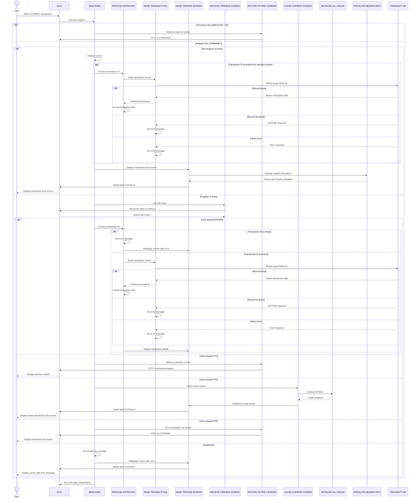

# COTRN01C

## Overview
This program is part of the CardDemo application and serves as a transaction viewer for the TRANSACT file in a CICS environment. It allows users to view detailed transaction information by entering a transaction ID. The program retrieves the corresponding transaction record from the TRANSACT file and displays various transaction details including card number, transaction type, category, amount, description, timestamps, and merchant information. The interface provides navigation options to return to previous screens (PF3), clear the current screen (PF4), or access the transaction list screen (PF5). Error handling is implemented for cases such as empty transaction ID input or when a transaction record cannot be found.

## Metadata
**Program ID**: `COTRN01C`

**Author**: `AWS`

## Sequence Diagram


## Referenced Copybooks
- [`CSDAT01Y`](copybooks/CSDAT01Y.md)
- `DFHAID`
- [`CVTRA05Y`](copybooks/CVTRA05Y.md)
- [`COCOM01Y`](copybooks/COCOM01Y.md)
- `COTRN01`
- `DFHBMSCA`
- [`COTTL01Y`](copybooks/COTTL01Y.md)
- [`CSMSG01Y`](copybooks/CSMSG01Y.md)

## Environment Division

### CONFIGURATION SECTION
This section would typically contain configuration settings for the COTRN01C transaction viewer program, including file assignments, special names, and system dependencies. In the CardDemo application context, it would define how the program interfaces with the TRANSACT file and CICS environment resources. The configuration section would establish the necessary parameters for the program to properly access and display transaction records within the AWS-showcased mainframe environment.
<details><summary>Code</summary>
```cobol

```
</details>


## Data Division

### WORKING-STORAGE SECTION
This Working Storage Section defines the key variables and data structures used in the transaction viewer program. It includes program identifiers, error handling flags, and transaction-specific fields like amount and date. The section incorporates several copybooks that likely contain shared data definitions for transaction records (COTRN01), common application data (COCOM01Y), screen layouts (CVTRA05Y), and utility functions for titles (COTTL01Y), dates (CSDAT01Y), and messages (CSMSG01Y). Notable elements include transaction tracking variables in CDEMO-CT01-INFO for managing navigation between multiple transaction records, and standard CICS copybooks (DFHAID, DFHBMSCA) for handling attention identifiers and BMS screen attributes. The structure supports the program's core functionality of retrieving and displaying transaction details in the CICS environment.
<details><summary>Code</summary>
```cobol
01 WS-VARIABLES.
         05 WS-PGMNAME                 PIC X(08) VALUE 'COTRN01C'.
         05 WS-TRANID                  PIC X(04) VALUE 'CT01'.
         05 WS-MESSAGE                 PIC X(80) VALUE SPACES.
         05 WS-TRANSACT-FILE             PIC X(08) VALUE 'TRANSACT'.
         05 WS-ERR-FLG                 PIC X(01) VALUE 'N'.
           88 ERR-FLG-ON                         VALUE 'Y'.
           88 ERR-FLG-OFF                        VALUE 'N'.
         05 WS-RESP-CD                 PIC S9(09) COMP VALUE ZEROS.
         05 WS-REAS-CD                 PIC S9(09) COMP VALUE ZEROS.
         05 WS-USR-MODIFIED            PIC X(01) VALUE 'N'.
           88 USR-MODIFIED-YES                   VALUE 'Y'.
           88 USR-MODIFIED-NO                    VALUE 'N'.

         05 WS-TRAN-AMT                PIC +99999999.99.
         05 WS-TRAN-DATE               PIC X(08) VALUE '00/00/00'.

       COPY COCOM01Y.
          05 CDEMO-CT01-INFO.
             10 CDEMO-CT01-TRNID-FIRST     PIC X(16).
             10 CDEMO-CT01-TRNID-LAST      PIC X(16).
             10 CDEMO-CT01-PAGE-NUM        PIC 9(08).
             10 CDEMO-CT01-NEXT-PAGE-FLG   PIC X(01) VALUE 'N'.
                88 NEXT-PAGE-YES                     VALUE 'Y'.
                88 NEXT-PAGE-NO                      VALUE 'N'.
             10 CDEMO-CT01-TRN-SEL-FLG     PIC X(01).
             10 CDEMO-CT01-TRN-SELECTED    PIC X(16).

       COPY COTRN01.

       COPY COTTL01Y.
       COPY CSDAT01Y.
       COPY CSMSG01Y.

       COPY CVTRA05Y.

       COPY DFHAID.
       COPY DFHBMSCA.

      *----------------------------------------------------------------*
      *                        LINKAGE SECTION
      *----------------------------------------------------------------*
```
</details>


### LINKAGE SECTION
This section defines the DFHCOMMAREA structure in the Linkage Section, which is used to receive and pass data between CICS programs. It contains a single field LK-COMMAREA that is defined as a variable-length array of characters with a size that depends on the EIBCALEN value (the length of the passed communication area). This flexible structure allows the program to handle communication areas of different sizes when called by other programs in the CardDemo transaction viewing system.
<details><summary>Code</summary>
```cobol
01  DFHCOMMAREA.
         05  LK-COMMAREA                           PIC X(01)
             OCCURS 1 TO 32767 TIMES DEPENDING ON EIBCALEN.

      *----------------------------------------------------------------*
      *
```
</details>


## Procedure Division

### MAIN-PARA
This paragraph serves as the main control flow for the transaction viewer screen. It initializes error flags, processes the COMMAREA data, and handles different user interactions. When first entered, it prepares the screen for display, potentially pre-populating the transaction ID field if one was selected from a previous screen. For subsequent interactions, it evaluates function key inputs to either process an entered transaction ID (Enter key), return to the previous screen (PF3), clear the current screen (PF4), or navigate to the transaction list screen (PF5). The paragraph includes error handling for invalid key presses and ensures proper screen navigation within the application flow. After processing, it returns control to CICS while preserving the application state in the COMMAREA.
<details><summary>Code</summary>
```cobol
SET ERR-FLG-OFF     TO TRUE
           SET USR-MODIFIED-NO TO TRUE

           MOVE SPACES TO WS-MESSAGE
                          ERRMSGO OF COTRN1AO

           IF EIBCALEN = 0
               MOVE 'COSGN00C' TO CDEMO-TO-PROGRAM
               PERFORM RETURN-TO-PREV-SCREEN
           ELSE
               MOVE DFHCOMMAREA(1:EIBCALEN) TO CARDDEMO-COMMAREA
               IF NOT CDEMO-PGM-REENTER
                   SET CDEMO-PGM-REENTER    TO TRUE
                   MOVE LOW-VALUES          TO COTRN1AO
                   MOVE -1       TO TRNIDINL OF COTRN1AI
                   IF CDEMO-CT01-TRN-SELECTED NOT =
                                              SPACES AND LOW-VALUES
                       MOVE CDEMO-CT01-TRN-SELECTED TO
                            TRNIDINI OF COTRN1AI
                       PERFORM PROCESS-ENTER-KEY
                   END-IF
                   PERFORM SEND-TRNVIEW-SCREEN
               ELSE
                   PERFORM RECEIVE-TRNVIEW-SCREEN
                   EVALUATE EIBAID
                       WHEN DFHENTER
                           PERFORM PROCESS-ENTER-KEY
                       WHEN DFHPF3
                           IF CDEMO-FROM-PROGRAM = SPACES OR LOW-VALUES
                               MOVE 'COMEN01C' TO CDEMO-TO-PROGRAM
                           ELSE
                               MOVE CDEMO-FROM-PROGRAM TO
                               CDEMO-TO-PROGRAM
                           END-IF
                           PERFORM RETURN-TO-PREV-SCREEN
                       WHEN DFHPF4
                           PERFORM CLEAR-CURRENT-SCREEN
                       WHEN DFHPF5
                           MOVE 'COTRN00C' TO CDEMO-TO-PROGRAM
                           PERFORM RETURN-TO-PREV-SCREEN
                       WHEN OTHER
                           MOVE 'Y'                       TO WS-ERR-FLG
                           MOVE CCDA-MSG-INVALID-KEY      TO WS-MESSAGE
                           PERFORM SEND-TRNVIEW-SCREEN
                   END-EVALUATE
               END-IF
           END-IF

           EXEC CICS RETURN
                     TRANSID (WS-TRANID)
                     COMMAREA (CARDDEMO-COMMAREA)
           END-EXEC.

      *----------------------------------------------------------------*
      *                      PROCESS-ENTER-KEY
      *----------------------------------------------------------------*
```
</details>


### PROCESS-ENTER-KEY
This paragraph handles the processing logic when a user presses the Enter key in the transaction viewer screen. It first validates if the transaction ID input field is empty, displaying an error message if so. If the input is valid, it clears all display fields, reads the transaction record using the entered ID, and then populates the screen with the retrieved transaction details including card number, transaction type, category, amount, description, timestamps, and merchant information. The paragraph formats the transaction amount for display and ensures the updated screen is sent back to the user. If any errors occur during processing (such as record not found), the error flag would prevent the display fields from being populated.
<details><summary>Code</summary>
```cobol
EVALUATE TRUE
               WHEN TRNIDINI OF COTRN1AI = SPACES OR LOW-VALUES
                   MOVE 'Y'     TO WS-ERR-FLG
                   MOVE 'Tran ID can NOT be empty...' TO
                                   WS-MESSAGE
                   MOVE -1       TO TRNIDINL OF COTRN1AI
                   PERFORM SEND-TRNVIEW-SCREEN
               WHEN OTHER
                   MOVE -1       TO TRNIDINL OF COTRN1AI
                   CONTINUE
           END-EVALUATE

           IF NOT ERR-FLG-ON
               MOVE SPACES      TO TRNIDI   OF COTRN1AI
                                   CARDNUMI OF COTRN1AI
                                   TTYPCDI  OF COTRN1AI
                                   TCATCDI  OF COTRN1AI
                                   TRNSRCI  OF COTRN1AI
                                   TRNAMTI  OF COTRN1AI
                                   TDESCI   OF COTRN1AI
                                   TORIGDTI OF COTRN1AI
                                   TPROCDTI OF COTRN1AI
                                   MIDI     OF COTRN1AI
                                   MNAMEI   OF COTRN1AI
                                   MCITYI   OF COTRN1AI
                                   MZIPI    OF COTRN1AI
               MOVE TRNIDINI  OF COTRN1AI TO TRAN-ID
               PERFORM READ-TRANSACT-FILE
           END-IF.

           IF NOT ERR-FLG-ON
               MOVE TRAN-AMT TO WS-TRAN-AMT
               MOVE TRAN-ID      TO TRNIDI    OF COTRN1AI
               MOVE TRAN-CARD-NUM      TO CARDNUMI    OF COTRN1AI
               MOVE TRAN-TYPE-CD        TO TTYPCDI   OF COTRN1AI
               MOVE TRAN-CAT-CD        TO TCATCDI   OF COTRN1AI
               MOVE TRAN-SOURCE       TO TRNSRCI  OF COTRN1AI
               MOVE WS-TRAN-AMT      TO TRNAMTI    OF COTRN1AI
               MOVE TRAN-DESC      TO TDESCI    OF COTRN1AI
               MOVE TRAN-ORIG-TS        TO TORIGDTI   OF COTRN1AI
               MOVE TRAN-PROC-TS       TO TPROCDTI  OF COTRN1AI
               MOVE TRAN-MERCHANT-ID       TO MIDI  OF COTRN1AI
               MOVE TRAN-MERCHANT-NAME       TO MNAMEI  OF COTRN1AI
               MOVE TRAN-MERCHANT-CITY       TO MCITYI  OF COTRN1AI
               MOVE TRAN-MERCHANT-ZIP       TO MZIPI  OF COTRN1AI
               PERFORM SEND-TRNVIEW-SCREEN
           END-IF.

      *----------------------------------------------------------------*
      *                      RETURN-TO-PREV-SCREEN
      *----------------------------------------------------------------*
```
</details>


### RETURN-TO-PREV-SCREEN
This paragraph handles the return navigation functionality when a user wants to exit the current transaction viewer screen. It first checks if the target program is specified in the communication area, and if not, defaults to 'COSGN00C' (likely the main menu or sign-on screen). It then prepares the communication area by setting the originating transaction ID and program name, and resets the program context to zeros. Finally, it transfers control to the target program using the CICS XCTL command, passing the communication area to maintain session context. This ensures proper navigation flow within the CardDemo application.
<details><summary>Code</summary>
```cobol
IF CDEMO-TO-PROGRAM = LOW-VALUES OR SPACES
               MOVE 'COSGN00C' TO CDEMO-TO-PROGRAM
           END-IF
           MOVE WS-TRANID    TO CDEMO-FROM-TRANID
           MOVE WS-PGMNAME   TO CDEMO-FROM-PROGRAM
           MOVE ZEROS        TO CDEMO-PGM-CONTEXT
           EXEC CICS
               XCTL PROGRAM(CDEMO-TO-PROGRAM)
               COMMAREA(CARDDEMO-COMMAREA)
           END-EXEC.

      *----------------------------------------------------------------*
      *                      SEND-TRNVIEW-SCREEN
      *----------------------------------------------------------------*
```
</details>


### SEND-TRNVIEW-SCREEN
This paragraph handles the display of the transaction viewer screen. It first calls the POPULATE-HEADER-INFO paragraph to set up the header information, then moves any system message to the error message field on the screen. It then uses the CICS SEND command to display the COTRN1A map from the COTRN01 mapset, clearing the screen (ERASE) and positioning the cursor. This is a standard screen display routine that presents the transaction details to the user after the data has been retrieved and formatted.
<details><summary>Code</summary>
```cobol
PERFORM POPULATE-HEADER-INFO

           MOVE WS-MESSAGE TO ERRMSGO OF COTRN1AO

           EXEC CICS SEND
                     MAP('COTRN1A')
                     MAPSET('COTRN01')
                     FROM(COTRN1AO)
                     ERASE
                     CURSOR
           END-EXEC.

      *----------------------------------------------------------------*
      *                      RECEIVE-TRNVIEW-SCREEN
      *----------------------------------------------------------------*
```
</details>


### RECEIVE-TRNVIEW-SCREEN
This paragraph handles the reception of user input from the COTRN1A map within the COTRN01 mapset in the transaction viewer. It uses the CICS RECEIVE command to capture data entered by the user on the transaction view screen, storing the input in the COTRN1AI structure. The paragraph also captures response codes in WS-RESP-CD and WS-REAS-CD variables for subsequent error handling. This is a standard CICS input processing step that occurs before the application processes the user's transaction viewing request.
<details><summary>Code</summary>
```cobol
EXEC CICS RECEIVE
                     MAP('COTRN1A')
                     MAPSET('COTRN01')
                     INTO(COTRN1AI)
                     RESP(WS-RESP-CD)
                     RESP2(WS-REAS-CD)
           END-EXEC.

      *----------------------------------------------------------------*
      *                      POPULATE-HEADER-INFO
      *----------------------------------------------------------------*
```
</details>


### POPULATE-HEADER-INFO
This paragraph populates the header information for the transaction viewer screen. It retrieves the current system date and time using the CURRENT-DATE function, then formats and displays this information along with application titles, transaction ID, and program name on the screen. The date is formatted as MM/DD/YY and the time as HH:MM:SS before being moved to their respective output fields on the COTRN1AO screen.
<details><summary>Code</summary>
```cobol
MOVE FUNCTION CURRENT-DATE  TO WS-CURDATE-DATA

           MOVE CCDA-TITLE01           TO TITLE01O OF COTRN1AO
           MOVE CCDA-TITLE02           TO TITLE02O OF COTRN1AO
           MOVE WS-TRANID              TO TRNNAMEO OF COTRN1AO
           MOVE WS-PGMNAME             TO PGMNAMEO OF COTRN1AO

           MOVE WS-CURDATE-MONTH       TO WS-CURDATE-MM
           MOVE WS-CURDATE-DAY         TO WS-CURDATE-DD
           MOVE WS-CURDATE-YEAR(3:2)   TO WS-CURDATE-YY

           MOVE WS-CURDATE-MM-DD-YY    TO CURDATEO OF COTRN1AO

           MOVE WS-CURTIME-HOURS       TO WS-CURTIME-HH
           MOVE WS-CURTIME-MINUTE      TO WS-CURTIME-MM
           MOVE WS-CURTIME-SECOND      TO WS-CURTIME-SS

           MOVE WS-CURTIME-HH-MM-SS    TO CURTIMEO OF COTRN1AO.

      *----------------------------------------------------------------*
      *                      READ-TRANSACT-FILE
      *----------------------------------------------------------------*
```
</details>


### READ-TRANSACT-FILE
This paragraph performs a CICS READ operation to retrieve a transaction record from the TRANSACT file using the transaction ID as the key. It handles three possible response scenarios: 1) When the read is successful (NORMAL), processing continues to the next step; 2) When the transaction ID is not found (NOTFND), it sets an error flag, displays a "Transaction ID NOT found" message, positions the cursor at the transaction ID input field, and redisplays the transaction view screen; 3) For any other response code, it logs the response and reason codes, sets an error flag, displays an "Unable to lookup Transaction" message, positions the cursor at the transaction ID input field, and redisplays the screen. The paragraph is essential for retrieving transaction details requested by the user in the CardDemo transaction viewer application.
<details><summary>Code</summary>
```cobol
EXEC CICS READ
                DATASET   (WS-TRANSACT-FILE)
                INTO      (TRAN-RECORD)
                LENGTH    (LENGTH OF TRAN-RECORD)
                RIDFLD    (TRAN-ID)
                KEYLENGTH (LENGTH OF TRAN-ID)
                UPDATE
                RESP      (WS-RESP-CD)
                RESP2     (WS-REAS-CD)
           END-EXEC.

           EVALUATE WS-RESP-CD
               WHEN DFHRESP(NORMAL)
                   CONTINUE
               WHEN DFHRESP(NOTFND)
                   MOVE 'Y'     TO WS-ERR-FLG
                   MOVE 'Transaction ID NOT found...' TO
                                   WS-MESSAGE
                   MOVE -1       TO TRNIDINL OF COTRN1AI
                   PERFORM SEND-TRNVIEW-SCREEN
               WHEN OTHER
                   DISPLAY 'RESP:' WS-RESP-CD 'REAS:' WS-REAS-CD
                   MOVE 'Y'     TO WS-ERR-FLG
                   MOVE 'Unable to lookup Transaction...' TO
                                   WS-MESSAGE
                   MOVE -1       TO TRNIDINL OF COTRN1AI
                   PERFORM SEND-TRNVIEW-SCREEN
           END-EVALUATE.

      *----------------------------------------------------------------*
      *                      CLEAR-CURRENT-SCREEN
      *----------------------------------------------------------------*
```
</details>


### CLEAR-CURRENT-SCREEN
This paragraph clears the current screen by first initializing all fields to their default values and then redisplaying the transaction viewer screen. It provides a way for users to reset the form when they press the designated clear key (PF4).
<details><summary>Code</summary>
```cobol
PERFORM INITIALIZE-ALL-FIELDS.
           PERFORM SEND-TRNVIEW-SCREEN.

      *----------------------------------------------------------------*
      *                      INITIALIZE-ALL-FIELDS
      *----------------------------------------------------------------*
```
</details>


### INITIALIZE-ALL-FIELDS
This paragraph initializes all fields in the transaction viewer screen. It sets the cursor position to the transaction ID input field by setting its length attribute to -1, and then clears all display fields by moving spaces to them. The fields being cleared include transaction details (ID, card number, type code, category code, source, amount, description, original date, processing date) and merchant information (ID, name, city, ZIP code). This initialization is typically performed when the screen is first displayed or when preparing for new input.
<details><summary>Code</summary>
```cobol
MOVE -1              TO TRNIDINL OF COTRN1AI
           MOVE SPACES          TO TRNIDINI OF COTRN1AI
                                   TRNIDI   OF COTRN1AI
                                   CARDNUMI OF COTRN1AI
                                   TTYPCDI  OF COTRN1AI
                                   TCATCDI  OF COTRN1AI
                                   TRNSRCI  OF COTRN1AI
                                   TRNAMTI  OF COTRN1AI
                                   TDESCI   OF COTRN1AI
                                   TORIGDTI OF COTRN1AI
                                   TPROCDTI OF COTRN1AI
                                   MIDI     OF COTRN1AI
                                   MNAMEI   OF COTRN1AI
                                   MCITYI   OF COTRN1AI
                                   MZIPI    OF COTRN1AI
```
</details>


### WS-MESSAGE
This paragraph contains version control information for the CardDemo application, showing the specific version (v1.0-15-g27d6c6f-68) and the timestamp when this code was last updated (July 19, 2022 at 23:12:34 CDT). This information helps track which version of the code is deployed and when changes were made.
<details><summary>Code</summary>
```cobol
*
      * Ver: CardDemo_v1.0-15-g27d6c6f-68 Date: 2022-07-19 23:12:34 CDT
      *
```
</details>
