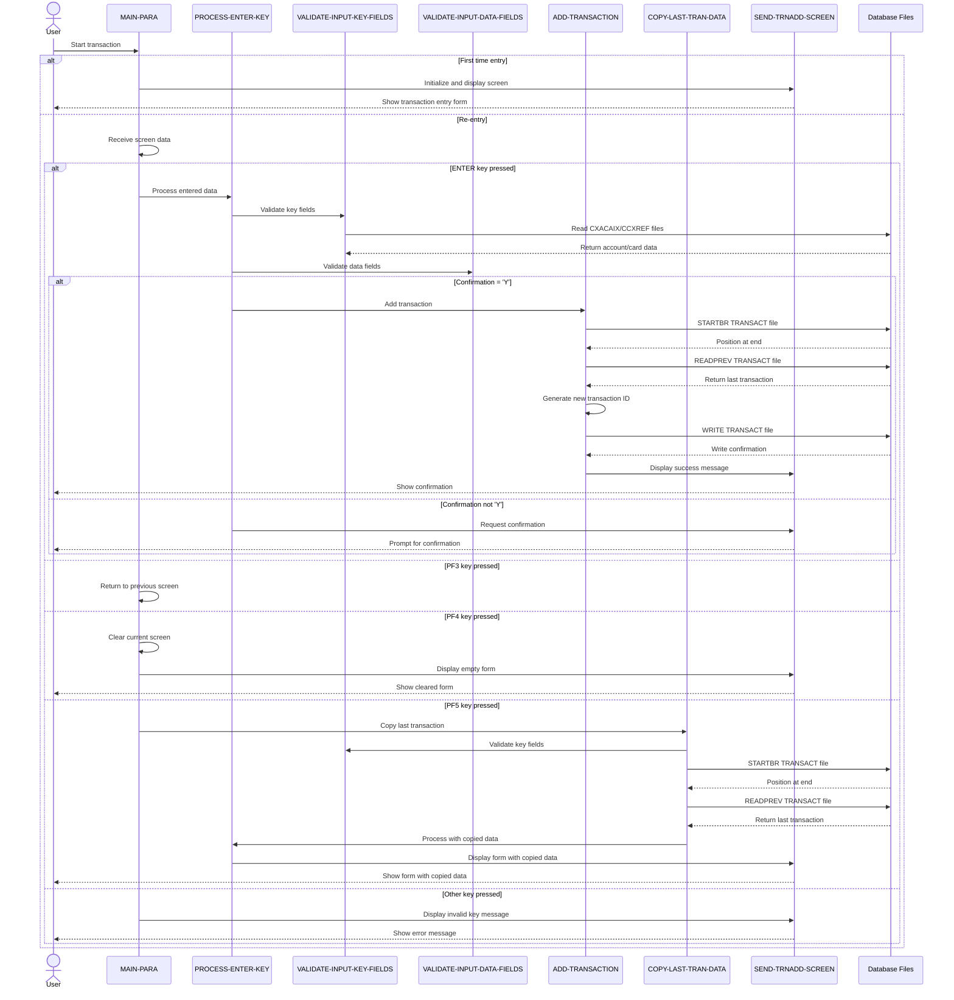

# COTRN02C

## Overview
This program (COTRN02C) is a CICS COBOL application that adds new transactions to the TRANSACT file in the CardDemo system. It provides a user interface for entering transaction details and performs comprehensive validation before writing records to the database.

The program handles the creation of credit card transactions by allowing users to enter either an account ID or card number, along with transaction details such as type code, category code, amount, description, dates, and merchant information. It performs extensive validation on all input fields, ensuring data integrity before adding records to the transaction file.

Key functionality includes:
- Validating account IDs and card numbers against cross-reference files
- Performing format validation on transaction amounts and dates
- Auto-generating sequential transaction IDs
- Providing a "copy last transaction" feature to streamline data entry
- Supporting navigation between screens in the CardDemo application

The program incorporates error handling for database operations and provides clear error messages to guide users through the data entry process. It demonstrates typical mainframe transaction processing patterns with field validation, file I/O operations, and screen management.

## Metadata
**Program ID**: `COTRN02C`

**Author**: `AWS`

## Sequence Diagram


## Referenced Copybooks
- [`CSDAT01Y`](copybooks/CSDAT01Y.md)
- `DFHAID`
- [`CVACT01Y`](copybooks/CVACT01Y.md)
- [`CVTRA05Y`](copybooks/CVTRA05Y.md)
- [`COCOM01Y`](copybooks/COCOM01Y.md)
- `COTRN02`
- `DFHBMSCA`
- [`CVACT03Y`](copybooks/CVACT03Y.md)
- [`COTTL01Y`](copybooks/COTTL01Y.md)
- [`CSMSG01Y`](copybooks/CSMSG01Y.md)

## Environment Division

### CONFIGURATION SECTION
This section would typically contain configuration settings for the COTRN02C program, including file assignments, special names, and system dependencies. However, the provided snippet is empty, indicating that the Configuration Section in this program doesn't contain any explicit configuration settings. This suggests that the program likely relies on standard CICS environment configurations or that the configuration details are defined elsewhere in the system, possibly in the CICS Resource Definition Online (RDO) or in JCL that executes this program.
<details><summary>Code</summary>
```cobol

```
</details>


## Data Division

### WORKING-STORAGE SECTION
This Working Storage section defines the key variables and data structures used in the COTRN02C transaction processing program. It contains program identifiers, file names for transaction and account data, status flags for error handling and user modifications, and various numeric fields for processing transaction amounts and IDs. The section includes specialized fields for data conversion and validation, particularly for handling transaction amounts and dates. It incorporates several copybooks that likely contain screen layouts, common data structures, and message definitions needed for the transaction entry interface. The CSUTLDTC-PARM structure suggests integration with a date validation utility. The section also defines program control variables to track transaction navigation and selection, supporting the program's ability to manage transaction entry across multiple screens.
<details><summary>Code</summary>
```cobol
01 WS-VARIABLES.
         05 WS-PGMNAME                 PIC X(08) VALUE 'COTRN02C'.
         05 WS-TRANID                  PIC X(04) VALUE 'CT02'.
         05 WS-MESSAGE                 PIC X(80) VALUE SPACES.
         05 WS-TRANSACT-FILE           PIC X(08) VALUE 'TRANSACT'.
         05 WS-ACCTDAT-FILE            PIC X(08) VALUE 'ACCTDAT '.
         05 WS-CCXREF-FILE             PIC X(08) VALUE 'CCXREF  '.
         05 WS-CXACAIX-FILE            PIC X(08) VALUE 'CXACAIX '.

         05 WS-ERR-FLG                 PIC X(01) VALUE 'N'.
           88 ERR-FLG-ON                         VALUE 'Y'.
           88 ERR-FLG-OFF                        VALUE 'N'.
         05 WS-RESP-CD                 PIC S9(09) COMP VALUE ZEROS.
         05 WS-REAS-CD                 PIC S9(09) COMP VALUE ZEROS.
         05 WS-USR-MODIFIED            PIC X(01) VALUE 'N'.
           88 USR-MODIFIED-YES                   VALUE 'Y'.
           88 USR-MODIFIED-NO                    VALUE 'N'.

         05 WS-TRAN-AMT                PIC +99999999.99.
         05 WS-TRAN-DATE               PIC X(08) VALUE '00/00/00'.
         05 WS-ACCT-ID-N               PIC 9(11) VALUE 0.
         05 WS-CARD-NUM-N              PIC 9(16) VALUE 0.
         05 WS-TRAN-ID-N               PIC 9(16) VALUE ZEROS.
         05 WS-TRAN-AMT-N              PIC S9(9)V99 VALUE ZERO.
         05 WS-TRAN-AMT-E              PIC +99999999.99 VALUE ZEROS.
         05 WS-DATE-FORMAT             PIC X(10) VALUE 'YYYY-MM-DD'.

       01 CSUTLDTC-PARM.
          05 CSUTLDTC-DATE                   PIC X(10).
          05 CSUTLDTC-DATE-FORMAT            PIC X(10).
          05 CSUTLDTC-RESULT.
             10 CSUTLDTC-RESULT-SEV-CD       PIC X(04).
             10 FILLER                       PIC X(11).
             10 CSUTLDTC-RESULT-MSG-NUM      PIC X(04).
             10 CSUTLDTC-RESULT-MSG          PIC X(61).

       COPY COCOM01Y.
          05 CDEMO-CT02-INFO.
             10 CDEMO-CT02-TRNID-FIRST     PIC X(16).
             10 CDEMO-CT02-TRNID-LAST      PIC X(16).
             10 CDEMO-CT02-PAGE-NUM        PIC 9(08).
             10 CDEMO-CT02-NEXT-PAGE-FLG   PIC X(01) VALUE 'N'.
                88 NEXT-PAGE-YES                     VALUE 'Y'.
                88 NEXT-PAGE-NO                      VALUE 'N'.
             10 CDEMO-CT02-TRN-SEL-FLG     PIC X(01).
             10 CDEMO-CT02-TRN-SELECTED    PIC X(16).

       COPY COTRN02.

       COPY COTTL01Y.
       COPY CSDAT01Y.
       COPY CSMSG01Y.

       COPY CVTRA05Y.
       COPY CVACT01Y.
       COPY CVACT03Y.

       COPY DFHAID.
       COPY DFHBMSCA.

      *----------------------------------------------------------------*
      *                        LINKAGE SECTION
      *----------------------------------------------------------------*
```
</details>


### LINKAGE SECTION
This section defines the linkage area used for communication between programs in the CICS environment. It contains a single field, LK-COMMAREA, which is defined as a variable-length array of characters that can expand from 1 to 32,767 bytes depending on the length passed in EIBCALEN (CICS Executive Interface Block Communication Area Length). This flexible structure allows the program to receive and process communication data of varying sizes from other programs in the CardDemo transaction processing system.
<details><summary>Code</summary>
```cobol
01  DFHCOMMAREA.
         05  LK-COMMAREA                           PIC X(01)
             OCCURS 1 TO 32767 TIMES DEPENDING ON EIBCALEN.

      *----------------------------------------------------------------*
      *
```
</details>


## Procedure Division

### MAIN-PARA
This paragraph serves as the main control flow for the transaction addition screen. It initializes error flags, handles first-time entry versus re-entry to the program, and processes user input based on function keys. When first entered, it sets up the screen and positions the cursor at the account ID field. On re-entry, it evaluates the user's action based on the function key pressed: ENTER processes the transaction data, PF3 returns to the previous screen, PF4 clears the current screen, and PF5 copies data from the last transaction. The paragraph includes special handling for when a transaction is pre-selected from another screen. It concludes by returning control to CICS with the transaction ID and communication area preserved for the next interaction.
<details><summary>Code</summary>
```cobol
SET ERR-FLG-OFF     TO TRUE
           SET USR-MODIFIED-NO TO TRUE

           MOVE SPACES TO WS-MESSAGE
                          ERRMSGO OF COTRN2AO

           IF EIBCALEN = 0
               MOVE 'COSGN00C' TO CDEMO-TO-PROGRAM
               PERFORM RETURN-TO-PREV-SCREEN
           ELSE
               MOVE DFHCOMMAREA(1:EIBCALEN) TO CARDDEMO-COMMAREA
               IF NOT CDEMO-PGM-REENTER
                   SET CDEMO-PGM-REENTER    TO TRUE
                   MOVE LOW-VALUES          TO COTRN2AO
                   MOVE -1       TO ACTIDINL OF COTRN2AI
                   IF CDEMO-CT02-TRN-SELECTED NOT =
                                              SPACES AND LOW-VALUES
                       MOVE CDEMO-CT02-TRN-SELECTED TO
                            CARDNINI OF COTRN2AI
                       PERFORM PROCESS-ENTER-KEY
                   END-IF
                   PERFORM SEND-TRNADD-SCREEN
               ELSE
                   PERFORM RECEIVE-TRNADD-SCREEN
                   EVALUATE EIBAID
                       WHEN DFHENTER
                           PERFORM PROCESS-ENTER-KEY
                       WHEN DFHPF3
                           IF CDEMO-FROM-PROGRAM = SPACES OR LOW-VALUES
                               MOVE 'COMEN01C' TO CDEMO-TO-PROGRAM
                           ELSE
                               MOVE CDEMO-FROM-PROGRAM TO
                               CDEMO-TO-PROGRAM
                           END-IF
                           PERFORM RETURN-TO-PREV-SCREEN
                       WHEN DFHPF4
                           PERFORM CLEAR-CURRENT-SCREEN
                       WHEN DFHPF5
                           PERFORM COPY-LAST-TRAN-DATA
                       WHEN OTHER
                           MOVE 'Y'                       TO WS-ERR-FLG
                           MOVE CCDA-MSG-INVALID-KEY      TO WS-MESSAGE
                           PERFORM SEND-TRNADD-SCREEN
                   END-EVALUATE
               END-IF
           END-IF

           EXEC CICS RETURN
                     TRANSID (WS-TRANID)
                     COMMAREA (CARDDEMO-COMMAREA)
           END-EXEC.

      *----------------------------------------------------------------*
      *                      PROCESS-ENTER-KEY
      *----------------------------------------------------------------*
```
</details>


### PROCESS-ENTER-KEY
This paragraph processes the user's action when the Enter key is pressed during transaction entry. It first validates both key fields and data fields by calling their respective validation routines. Then it evaluates the confirmation input field ('CONFIRMI') to determine the next action. If the user confirms with 'Y' or 'y', it proceeds to add the transaction to the database. If the confirmation field is blank, contains 'N', 'n', or low-values, it prompts the user to confirm the transaction by setting an error flag and displaying a message. For any other input value, it displays an error message indicating that only 'Y' or 'N' are valid responses. In both error cases, it positions the cursor at the confirmation field and redisplays the transaction entry screen.
<details><summary>Code</summary>
```cobol
PERFORM VALIDATE-INPUT-KEY-FIELDS
           PERFORM VALIDATE-INPUT-DATA-FIELDS.

           EVALUATE CONFIRMI OF COTRN2AI
               WHEN 'Y'
               WHEN 'y'
                   PERFORM ADD-TRANSACTION
               WHEN 'N'
               WHEN 'n'
               WHEN SPACES
               WHEN LOW-VALUES
                   MOVE 'Y'     TO WS-ERR-FLG
                   MOVE 'Confirm to add this transaction...'
                                TO WS-MESSAGE
                   MOVE -1      TO CONFIRML OF COTRN2AI
                   PERFORM SEND-TRNADD-SCREEN
               WHEN OTHER
                   MOVE 'Y'     TO WS-ERR-FLG
                   MOVE 'Invalid value. Valid values are (Y/N)...'
                                TO WS-MESSAGE
                   MOVE -1      TO CONFIRML OF COTRN2AI
                   PERFORM SEND-TRNADD-SCREEN
           END-EVALUATE.

      *----------------------------------------------------------------*
      *                      VALIDATE-INPUT-KEY-FIELDS
      *----------------------------------------------------------------*
```
</details>


### VALIDATE-INPUT-KEY-FIELDS
This paragraph validates the key input fields (Account ID or Card Number) required for transaction creation. It uses an EVALUATE statement to handle three scenarios: when an Account ID is provided, when a Card Number is provided, or when neither is provided. For Account ID validation, it checks that the value is numeric, converts it to a numeric format, and then retrieves the corresponding Card Number by reading the CXACAIX cross-reference file. Similarly, for Card Number validation, it verifies the numeric format, converts it to a numeric value, and retrieves the associated Account ID from the CCXREF file. If neither field is provided, it displays an error message requiring one of these fields to be entered. The paragraph ensures data integrity by validating input format and establishing the relationship between account IDs and card numbers before proceeding with transaction creation.
<details><summary>Code</summary>
```cobol
EVALUATE TRUE
               WHEN ACTIDINI OF COTRN2AI NOT = SPACES AND LOW-VALUES
                   IF ACTIDINI OF COTRN2AI IS NOT NUMERIC
                       MOVE 'Y'     TO WS-ERR-FLG
                       MOVE 'Account ID must be Numeric...' TO
                                       WS-MESSAGE
                       MOVE -1       TO ACTIDINL OF COTRN2AI
                       PERFORM SEND-TRNADD-SCREEN
                   END-IF
                   COMPUTE WS-ACCT-ID-N = FUNCTION NUMVAL(ACTIDINI OF
                   COTRN2AI)
                   MOVE WS-ACCT-ID-N            TO XREF-ACCT-ID
                                                ACTIDINI OF COTRN2AI
                   PERFORM READ-CXACAIX-FILE
                   MOVE XREF-CARD-NUM         TO CARDNINI OF COTRN2AI
               WHEN CARDNINI OF COTRN2AI NOT = SPACES AND LOW-VALUES
                   IF CARDNINI OF COTRN2AI IS NOT NUMERIC
                       MOVE 'Y'     TO WS-ERR-FLG
                       MOVE 'Card Number must be Numeric...' TO
                                       WS-MESSAGE
                       MOVE -1       TO CARDNINL OF COTRN2AI
                       PERFORM SEND-TRNADD-SCREEN
                   END-IF
                   COMPUTE WS-CARD-NUM-N = FUNCTION NUMVAL(CARDNINI OF
                   COTRN2AI)
                   MOVE WS-CARD-NUM-N        TO XREF-CARD-NUM
                                                CARDNINI OF COTRN2AI
                   PERFORM READ-CCXREF-FILE
                   MOVE XREF-ACCT-ID         TO ACTIDINI OF COTRN2AI
               WHEN OTHER
                   MOVE 'Y'     TO WS-ERR-FLG
                   MOVE 'Account or Card Number must be entered...' TO
                                   WS-MESSAGE
                   MOVE -1       TO ACTIDINL OF COTRN2AI
                   PERFORM SEND-TRNADD-SCREEN
           END-EVALUATE.

      *----------------------------------------------------------------*
      *                 VALIDATE-INPUT-DATA-FIELDS
      *----------------------------------------------------------------*
```
</details>


### VALIDATE-INPUT-DATA-FIELDS
This paragraph performs comprehensive validation of transaction input data fields before allowing a new transaction to be added. It first checks if an error flag is set, in which case it clears all input fields. Then it systematically validates each required field, ensuring none are empty or contain invalid values. The validation includes checking that type and category codes are numeric, transaction amount follows the format "-99999999.99", and dates conform to "YYYY-MM-DD" format. The code also performs advanced date validation by calling the CSUTLDTC utility to verify that dates are valid calendar dates. For each validation failure, it sets an error flag, positions the cursor at the problematic field, displays an appropriate error message, and redisplays the transaction entry screen. The paragraph also formats the transaction amount using NUMVAL-C function to ensure proper numeric representation.
<details><summary>Code</summary>
```cobol
IF ERR-FLG-ON
               MOVE SPACES      TO TTYPCDI  OF COTRN2AI
                                   TCATCDI  OF COTRN2AI
                                   TRNSRCI  OF COTRN2AI
                                   TRNAMTI  OF COTRN2AI
                                   TDESCI   OF COTRN2AI
                                   TORIGDTI OF COTRN2AI
                                   TPROCDTI OF COTRN2AI
                                   MIDI     OF COTRN2AI
                                   MNAMEI   OF COTRN2AI
                                   MCITYI   OF COTRN2AI
                                   MZIPI    OF COTRN2AI
           END-IF.

           EVALUATE TRUE
               WHEN TTYPCDI OF COTRN2AI = SPACES OR LOW-VALUES
                   MOVE 'Y'     TO WS-ERR-FLG
                   MOVE 'Type CD can NOT be empty...' TO
                                   WS-MESSAGE
                   MOVE -1       TO TTYPCDL OF COTRN2AI
                   PERFORM SEND-TRNADD-SCREEN
               WHEN TCATCDI OF COTRN2AI = SPACES OR LOW-VALUES
                   MOVE 'Y'     TO WS-ERR-FLG
                   MOVE 'Category CD can NOT be empty...' TO
                                   WS-MESSAGE
                   MOVE -1       TO TCATCDL OF COTRN2AI
                   PERFORM SEND-TRNADD-SCREEN
               WHEN TRNSRCI OF COTRN2AI = SPACES OR LOW-VALUES
                   MOVE 'Y'     TO WS-ERR-FLG
                   MOVE 'Source can NOT be empty...' TO
                                   WS-MESSAGE
                   MOVE -1       TO TRNSRCL OF COTRN2AI
                   PERFORM SEND-TRNADD-SCREEN
               WHEN TDESCI OF COTRN2AI = SPACES OR LOW-VALUES
                   MOVE 'Y'     TO WS-ERR-FLG
                   MOVE 'Description can NOT be empty...' TO
                                   WS-MESSAGE
                   MOVE -1       TO TDESCL OF COTRN2AI
                   PERFORM SEND-TRNADD-SCREEN
               WHEN TRNAMTI OF COTRN2AI = SPACES OR LOW-VALUES
                   MOVE 'Y'     TO WS-ERR-FLG
                   MOVE 'Amount can NOT be empty...' TO
                                   WS-MESSAGE
                   MOVE -1       TO TRNAMTL OF COTRN2AI
                   PERFORM SEND-TRNADD-SCREEN
               WHEN TORIGDTI OF COTRN2AI = SPACES OR LOW-VALUES
                   MOVE 'Y'     TO WS-ERR-FLG
                   MOVE 'Orig Date can NOT be empty...' TO
                                   WS-MESSAGE
                   MOVE -1       TO TORIGDTL OF COTRN2AI
                   PERFORM SEND-TRNADD-SCREEN
               WHEN TPROCDTI OF COTRN2AI = SPACES OR LOW-VALUES
                   MOVE 'Y'     TO WS-ERR-FLG
                   MOVE 'Proc Date can NOT be empty...' TO
                                   WS-MESSAGE
                   MOVE -1       TO TPROCDTL OF COTRN2AI
                   PERFORM SEND-TRNADD-SCREEN
               WHEN MIDI OF COTRN2AI = SPACES OR LOW-VALUES
                   MOVE 'Y'     TO WS-ERR-FLG
                   MOVE 'Merchant ID can NOT be empty...' TO
                                   WS-MESSAGE
                   MOVE -1       TO MIDL OF COTRN2AI
                   PERFORM SEND-TRNADD-SCREEN
               WHEN MNAMEI OF COTRN2AI = SPACES OR LOW-VALUES
                   MOVE 'Y'     TO WS-ERR-FLG
                   MOVE 'Merchant Name can NOT be empty...' TO
                                   WS-MESSAGE
                   MOVE -1       TO MNAMEL OF COTRN2AI
                   PERFORM SEND-TRNADD-SCREEN
               WHEN MCITYI OF COTRN2AI = SPACES OR LOW-VALUES
                   MOVE 'Y'     TO WS-ERR-FLG
                   MOVE 'Merchant City can NOT be empty...' TO
                                   WS-MESSAGE
                   MOVE -1       TO MCITYL OF COTRN2AI
                   PERFORM SEND-TRNADD-SCREEN
               WHEN MZIPI OF COTRN2AI = SPACES OR LOW-VALUES
                   MOVE 'Y'     TO WS-ERR-FLG
                   MOVE 'Merchant Zip can NOT be empty...' TO
                                   WS-MESSAGE
                   MOVE -1       TO MZIPL OF COTRN2AI
                   PERFORM SEND-TRNADD-SCREEN
               WHEN OTHER
                   CONTINUE
           END-EVALUATE.

           EVALUATE TRUE
               WHEN TTYPCDI OF COTRN2AI NOT NUMERIC
                   MOVE 'Y'     TO WS-ERR-FLG
                   MOVE 'Type CD must be Numeric...' TO
                                   WS-MESSAGE
                   MOVE -1       TO TTYPCDL OF COTRN2AI
                   PERFORM SEND-TRNADD-SCREEN
               WHEN TCATCDI OF COTRN2AI NOT NUMERIC
                   MOVE 'Y'     TO WS-ERR-FLG
                   MOVE 'Category CD must be Numeric...' TO
                                   WS-MESSAGE
                   MOVE -1       TO TCATCDL OF COTRN2AI
                   PERFORM SEND-TRNADD-SCREEN
               WHEN OTHER
                   CONTINUE
           END-EVALUATE

           EVALUATE TRUE
               WHEN TRNAMTI OF COTRN2AI(1:1) NOT EQUAL '-' AND '+'
               WHEN TRNAMTI OF COTRN2AI(2:8) NOT NUMERIC
               WHEN TRNAMTI OF COTRN2AI(10:1) NOT = '.'
               WHEN TRNAMTI OF COTRN2AI(11:2) IS NOT NUMERIC
                   MOVE 'Y'     TO WS-ERR-FLG
                   MOVE 'Amount should be in format -99999999.99' TO
                                   WS-MESSAGE
                   MOVE -1       TO TRNAMTL OF COTRN2AI
                   PERFORM SEND-TRNADD-SCREEN
               WHEN OTHER
                   CONTINUE
           END-EVALUATE

           EVALUATE TRUE
               WHEN TORIGDTI OF COTRN2AI(1:4) IS NOT NUMERIC
               WHEN TORIGDTI OF COTRN2AI(5:1) NOT EQUAL '-'
               WHEN TORIGDTI OF COTRN2AI(6:2) NOT NUMERIC
               WHEN TORIGDTI OF COTRN2AI(8:1) NOT EQUAL '-'
               WHEN TORIGDTI OF COTRN2AI(9:2) NOT NUMERIC
                   MOVE 'Y'     TO WS-ERR-FLG
                   MOVE 'Orig Date should be in format YYYY-MM-DD' TO
                                   WS-MESSAGE
                   MOVE -1       TO TORIGDTL OF COTRN2AI
                   PERFORM SEND-TRNADD-SCREEN
               WHEN OTHER
                   CONTINUE
           END-EVALUATE

           EVALUATE TRUE
               WHEN TPROCDTI OF COTRN2AI(1:4) IS NOT NUMERIC
               WHEN TPROCDTI OF COTRN2AI(5:1) NOT EQUAL '-'
               WHEN TPROCDTI OF COTRN2AI(6:2) NOT NUMERIC
               WHEN TPROCDTI OF COTRN2AI(8:1) NOT EQUAL '-'
               WHEN TPROCDTI OF COTRN2AI(9:2) NOT NUMERIC
                   MOVE 'Y'     TO WS-ERR-FLG
                   MOVE 'Proc Date should be in format YYYY-MM-DD' TO
                                   WS-MESSAGE
                   MOVE -1       TO TPROCDTL OF COTRN2AI
                   PERFORM SEND-TRNADD-SCREEN
               WHEN OTHER
                   CONTINUE
           END-EVALUATE

           COMPUTE WS-TRAN-AMT-N = FUNCTION NUMVAL-C(TRNAMTI OF
           COTRN2AI)
           MOVE WS-TRAN-AMT-N TO WS-TRAN-AMT-E
           MOVE WS-TRAN-AMT-E TO TRNAMTI OF COTRN2AI


           MOVE TORIGDTI OF COTRN2AI TO CSUTLDTC-DATE
           MOVE WS-DATE-FORMAT       TO CSUTLDTC-DATE-FORMAT
           MOVE SPACES               TO CSUTLDTC-RESULT

           CALL 'CSUTLDTC' USING   CSUTLDTC-DATE
                                   CSUTLDTC-DATE-FORMAT
                                   CSUTLDTC-RESULT

           IF CSUTLDTC-RESULT-SEV-CD = '0000'
               CONTINUE
           ELSE
               IF CSUTLDTC-RESULT-MSG-NUM NOT = '2513'
                   MOVE 'Orig Date - Not a valid date...'
                     TO WS-MESSAGE
                   MOVE 'Y'     TO WS-ERR-FLG
                   MOVE -1       TO TORIGDTL OF COTRN2AI
                   PERFORM SEND-TRNADD-SCREEN
               END-IF
           END-IF

           MOVE TPROCDTI OF COTRN2AI TO CSUTLDTC-DATE
           MOVE WS-DATE-FORMAT       TO CSUTLDTC-DATE-FORMAT
           MOVE SPACES               TO CSUTLDTC-RESULT

           CALL 'CSUTLDTC' USING   CSUTLDTC-DATE
                                   CSUTLDTC-DATE-FORMAT
                                   CSUTLDTC-RESULT

           IF CSUTLDTC-RESULT-SEV-CD = '0000'
               CONTINUE
           ELSE
               IF CSUTLDTC-RESULT-MSG-NUM NOT = '2513'
                   MOVE 'Proc Date - Not a valid date...'
                     TO WS-MESSAGE
                   MOVE 'Y'     TO WS-ERR-FLG
                   MOVE -1       TO TPROCDTL OF COTRN2AI
                   PERFORM SEND-TRNADD-SCREEN
               END-IF
           END-IF


           IF MIDI OF COTRN2AI IS NOT NUMERIC
               MOVE 'Y'     TO WS-ERR-FLG
               MOVE 'Merchant ID must be Numeric...' TO
                               WS-MESSAGE
               MOVE -1       TO MIDL OF COTRN2AI
               PERFORM SEND-TRNADD-SCREEN
           END-IF
           .

      *----------------------------------------------------------------*
      *                        ADD-TRANSACTION
      *----------------------------------------------------------------*
```
</details>


### ADD-TRANSACTION
This paragraph handles the creation of a new transaction record in the system. It first determines the next available transaction ID by retrieving the highest existing ID from the TRANSACT file (using STARTBR, READPREV, and ENDBR operations), then incrementing it by one. The paragraph then initializes a new transaction record and populates it with data from the input screen (COTRN2AI), including transaction type, category, source, description, amount, card number, and merchant information. The transaction amount is converted from character format to numeric using the FUNCTION NUMVAL-C. After all fields are populated, the new transaction record is written to the TRANSACT file by calling the WRITE-TRANSACT-FILE paragraph.
<details><summary>Code</summary>
```cobol
MOVE HIGH-VALUES TO TRAN-ID
           PERFORM STARTBR-TRANSACT-FILE
           PERFORM READPREV-TRANSACT-FILE
           PERFORM ENDBR-TRANSACT-FILE
           MOVE TRAN-ID     TO WS-TRAN-ID-N
           ADD 1 TO WS-TRAN-ID-N
           INITIALIZE TRAN-RECORD
           MOVE WS-TRAN-ID-N         TO TRAN-ID
           MOVE TTYPCDI  OF COTRN2AI TO TRAN-TYPE-CD
           MOVE TCATCDI  OF COTRN2AI TO TRAN-CAT-CD
           MOVE TRNSRCI  OF COTRN2AI TO TRAN-SOURCE
           MOVE TDESCI   OF COTRN2AI TO TRAN-DESC
           COMPUTE WS-TRAN-AMT-N = FUNCTION NUMVAL-C(TRNAMTI OF
           COTRN2AI)
           MOVE WS-TRAN-AMT-N TO TRAN-AMT
           MOVE CARDNINI OF COTRN2AI TO TRAN-CARD-NUM
           MOVE MIDI     OF COTRN2AI TO TRAN-MERCHANT-ID
           MOVE MNAMEI   OF COTRN2AI TO TRAN-MERCHANT-NAME
           MOVE MCITYI   OF COTRN2AI TO TRAN-MERCHANT-CITY
           MOVE MZIPI    OF COTRN2AI TO TRAN-MERCHANT-ZIP
           MOVE TORIGDTI OF COTRN2AI TO TRAN-ORIG-TS
           MOVE TPROCDTI OF COTRN2AI TO TRAN-PROC-TS
           PERFORM WRITE-TRANSACT-FILE.

      *----------------------------------------------------------------*
      *                      COPY-LAST-TRAN-DATA
      *----------------------------------------------------------------*
```
</details>


### COPY-LAST-TRAN-DATA
This paragraph implements the "copy last transaction" feature, which retrieves the most recent transaction record and populates the input screen with its data. It first validates the key fields entered by the user, then retrieves the most recent transaction record by positioning to the end of the TRANSACT file (using HIGH-VALUES) and reading the previous record. If the retrieval is successful (no error flag), it transfers the transaction details from the retrieved record to the input screen fields, including transaction type, category, source, amount, description, dates, and merchant information. The paragraph concludes by processing the ENTER key, which likely refreshes the screen with the copied data. This functionality allows users to quickly create new transactions that share many details with previous ones, improving data entry efficiency.
<details><summary>Code</summary>
```cobol
PERFORM VALIDATE-INPUT-KEY-FIELDS

           MOVE HIGH-VALUES TO TRAN-ID
           PERFORM STARTBR-TRANSACT-FILE
           PERFORM READPREV-TRANSACT-FILE
           PERFORM ENDBR-TRANSACT-FILE

           IF NOT ERR-FLG-ON
               MOVE TRAN-AMT TO WS-TRAN-AMT-E
               MOVE TRAN-TYPE-CD        TO TTYPCDI  OF COTRN2AI
               MOVE TRAN-CAT-CD         TO TCATCDI  OF COTRN2AI
               MOVE TRAN-SOURCE         TO TRNSRCI  OF COTRN2AI
               MOVE WS-TRAN-AMT-E       TO TRNAMTI  OF COTRN2AI
               MOVE TRAN-DESC           TO TDESCI   OF COTRN2AI
               MOVE TRAN-ORIG-TS        TO TORIGDTI OF COTRN2AI
               MOVE TRAN-PROC-TS        TO TPROCDTI OF COTRN2AI
               MOVE TRAN-MERCHANT-ID    TO MIDI     OF COTRN2AI
               MOVE TRAN-MERCHANT-NAME  TO MNAMEI   OF COTRN2AI
               MOVE TRAN-MERCHANT-CITY  TO MCITYI   OF COTRN2AI
               MOVE TRAN-MERCHANT-ZIP   TO MZIPI    OF COTRN2AI
           END-IF

           PERFORM PROCESS-ENTER-KEY.

      *----------------------------------------------------------------*
      *                      RETURN-TO-PREV-SCREEN
      *----------------------------------------------------------------*
```
</details>


### RETURN-TO-PREV-SCREEN
This paragraph handles the navigation back to a previous screen in the CardDemo application. It first checks if the target program is specified in the communication area, defaulting to 'COSGN00C' (likely the main menu or sign-on screen) if no value is provided. The paragraph then populates the communication area with the current transaction ID and program name as the "from" information, resets the program context to zeros, and uses the CICS XCTL command to transfer control to the target program while passing the communication area. This provides a standardized way to return to previous screens while maintaining navigation context throughout the application.
<details><summary>Code</summary>
```cobol
IF CDEMO-TO-PROGRAM = LOW-VALUES OR SPACES
               MOVE 'COSGN00C' TO CDEMO-TO-PROGRAM
           END-IF
           MOVE WS-TRANID    TO CDEMO-FROM-TRANID
           MOVE WS-PGMNAME   TO CDEMO-FROM-PROGRAM
           MOVE ZEROS        TO CDEMO-PGM-CONTEXT
           EXEC CICS
               XCTL PROGRAM(CDEMO-TO-PROGRAM)
               COMMAREA(CARDDEMO-COMMAREA)
           END-EXEC.

      *----------------------------------------------------------------*
      *                      SEND-TRNADD-SCREEN
      *----------------------------------------------------------------*
```
</details>


### SEND-TRNADD-SCREEN
This paragraph displays the transaction addition screen to the user. It first calls the POPULATE-HEADER-INFO paragraph to set up common header information, then moves any system message to the error message field on the screen. The paragraph uses CICS SEND to display the COTRN2A map from the COTRN02 mapset, erasing the previous screen content and positioning the cursor appropriately. After sending the screen, it executes a CICS RETURN with the current transaction ID and communication area, which effectively pauses the program and waits for user input. This implements the standard CICS pseudo-conversational programming pattern where the program displays a screen, then terminates until the user submits the screen data.
<details><summary>Code</summary>
```cobol
PERFORM POPULATE-HEADER-INFO

           MOVE WS-MESSAGE TO ERRMSGO OF COTRN2AO

           EXEC CICS SEND
                     MAP('COTRN2A')
                     MAPSET('COTRN02')
                     FROM(COTRN2AO)
                     ERASE
                     CURSOR
           END-EXEC.

           EXEC CICS RETURN
                     TRANSID (WS-TRANID)
                     COMMAREA (CARDDEMO-COMMAREA)
      *              LENGTH(LENGTH OF CARDDEMO-COMMAREA)
           END-EXEC.

      *----------------------------------------------------------------*
      *                      RECEIVE-TRNADD-SCREEN
      *----------------------------------------------------------------*
```
</details>


### RECEIVE-TRNADD-SCREEN
This paragraph receives user input from the COTRN2A map within the COTRN02 mapset, storing the data in the COTRN2AI structure. It captures the response and reason codes from the CICS RECEIVE operation to enable error handling. This is a standard CICS data entry pattern that collects transaction details entered by the user before processing them for validation and database operations.
<details><summary>Code</summary>
```cobol
EXEC CICS RECEIVE
                     MAP('COTRN2A')
                     MAPSET('COTRN02')
                     INTO(COTRN2AI)
                     RESP(WS-RESP-CD)
                     RESP2(WS-REAS-CD)
           END-EXEC.

      *----------------------------------------------------------------*
      *                      POPULATE-HEADER-INFO
      *----------------------------------------------------------------*
```
</details>


### POPULATE-HEADER-INFO
This paragraph populates the header information on the COTRN2A screen. It retrieves the current system date and time, then formats and displays this information along with program identification details. The routine first obtains the current date using the CURRENT-DATE function, then transfers title information and transaction/program identifiers to the screen. It then formats the current date into MM/DD/YY format and the current time into HH:MM:SS format before displaying them in their respective screen fields. This provides users with contextual information about when the transaction is being processed and which program they are currently using.
<details><summary>Code</summary>
```cobol
MOVE FUNCTION CURRENT-DATE  TO WS-CURDATE-DATA

           MOVE CCDA-TITLE01           TO TITLE01O OF COTRN2AO
           MOVE CCDA-TITLE02           TO TITLE02O OF COTRN2AO
           MOVE WS-TRANID              TO TRNNAMEO OF COTRN2AO
           MOVE WS-PGMNAME             TO PGMNAMEO OF COTRN2AO

           MOVE WS-CURDATE-MONTH       TO WS-CURDATE-MM
           MOVE WS-CURDATE-DAY         TO WS-CURDATE-DD
           MOVE WS-CURDATE-YEAR(3:2)   TO WS-CURDATE-YY

           MOVE WS-CURDATE-MM-DD-YY    TO CURDATEO OF COTRN2AO

           MOVE WS-CURTIME-HOURS       TO WS-CURTIME-HH
           MOVE WS-CURTIME-MINUTE      TO WS-CURTIME-MM
           MOVE WS-CURTIME-SECOND      TO WS-CURTIME-SS

           MOVE WS-CURTIME-HH-MM-SS    TO CURTIMEO OF COTRN2AO.

      *----------------------------------------------------------------*
      *                      READ-CXACAIX-FILE
      *----------------------------------------------------------------*
```
</details>


### READ-CXACAIX-FILE
This paragraph performs a lookup in the CXACAIX file (Card Cross-Reference Alternate Index file) using the account ID as the key. It attempts to retrieve the corresponding card cross-reference record to validate that the entered account ID exists in the system. The paragraph handles three possible outcomes: successful retrieval (continues processing), record not found (displays an error message indicating the account ID is invalid), or a file access error (displays a technical error message). When validation fails, the cursor is positioned at the account ID field and the transaction entry screen is redisplayed with the appropriate error message to guide the user.
<details><summary>Code</summary>
```cobol
EXEC CICS READ
                DATASET   (WS-CXACAIX-FILE)
                INTO      (CARD-XREF-RECORD)
                LENGTH    (LENGTH OF CARD-XREF-RECORD)
                RIDFLD    (XREF-ACCT-ID)
                KEYLENGTH (LENGTH OF XREF-ACCT-ID)
                RESP      (WS-RESP-CD)
                RESP2     (WS-REAS-CD)
           END-EXEC

           EVALUATE WS-RESP-CD
               WHEN DFHRESP(NORMAL)
                   CONTINUE
               WHEN DFHRESP(NOTFND)
                   MOVE 'Y'     TO WS-ERR-FLG
                   MOVE 'Account ID NOT found...' TO
                                   WS-MESSAGE
                   MOVE -1       TO ACTIDINL OF COTRN2AI
                   PERFORM SEND-TRNADD-SCREEN
               WHEN OTHER
                   DISPLAY 'RESP:' WS-RESP-CD 'REAS:' WS-REAS-CD
                   MOVE 'Y'     TO WS-ERR-FLG
                   MOVE 'Unable to lookup Acct in XREF AIX file...' TO
                                   WS-MESSAGE
                   MOVE -1       TO ACTIDINL OF COTRN2AI
                   PERFORM SEND-TRNADD-SCREEN
           END-EVALUATE.

      *----------------------------------------------------------------*
      *                      READ-CCXREF-FILE
      *----------------------------------------------------------------*
```
</details>


### READ-CCXREF-FILE
This paragraph performs a CICS READ operation on the card cross-reference file (CCXREF) using the card number as the key. It validates whether the provided card number exists in the system. If the read is successful, processing continues normally. If the card number is not found, the program sets an error flag, displays an appropriate message to the user, positions the cursor at the card number input field, and redisplays the transaction entry screen. For any other database errors, it displays the response and reason codes, sets an error flag with a technical message, and returns to the input screen. This validation ensures that transactions can only be created for valid card numbers that exist in the system.
<details><summary>Code</summary>
```cobol
EXEC CICS READ
                DATASET   (WS-CCXREF-FILE)
                INTO      (CARD-XREF-RECORD)
                LENGTH    (LENGTH OF CARD-XREF-RECORD)
                RIDFLD    (XREF-CARD-NUM)
                KEYLENGTH (LENGTH OF XREF-CARD-NUM)
                RESP      (WS-RESP-CD)
                RESP2     (WS-REAS-CD)
           END-EXEC

           EVALUATE WS-RESP-CD
               WHEN DFHRESP(NORMAL)
                   CONTINUE
               WHEN DFHRESP(NOTFND)
                   MOVE 'Y'     TO WS-ERR-FLG
                   MOVE 'Card Number NOT found...' TO
                                   WS-MESSAGE
                   MOVE -1       TO CARDNINL OF COTRN2AI
                   PERFORM SEND-TRNADD-SCREEN
               WHEN OTHER
                   DISPLAY 'RESP:' WS-RESP-CD 'REAS:' WS-REAS-CD
                   MOVE 'Y'     TO WS-ERR-FLG
                   MOVE 'Unable to lookup Card # in XREF file...' TO
                                   WS-MESSAGE
                   MOVE -1       TO CARDNINL OF COTRN2AI
                   PERFORM SEND-TRNADD-SCREEN
           END-EVALUATE.

      *----------------------------------------------------------------*
      *                    STARTBR-TRANSACT-FILE
      *----------------------------------------------------------------*
```
</details>


### STARTBR-TRANSACT-FILE
This paragraph initiates a browse operation on the transaction file to locate records by transaction ID. It uses the CICS STARTBR command to position the file cursor at the specified transaction ID. The paragraph handles three possible outcomes: successful positioning (NORMAL response), transaction ID not found (NOTFND response), or other errors. For error conditions, it sets an error flag, displays an appropriate message to the user, positions the cursor at the account ID field, and redisplays the transaction entry screen. This functionality is part of the transaction lookup process that likely supports the "copy last transaction" feature mentioned in the program description.
<details><summary>Code</summary>
```cobol
EXEC CICS STARTBR
                DATASET   (WS-TRANSACT-FILE)
                RIDFLD    (TRAN-ID)
                KEYLENGTH (LENGTH OF TRAN-ID)
                RESP      (WS-RESP-CD)
                RESP2     (WS-REAS-CD)
           END-EXEC

           EVALUATE WS-RESP-CD
               WHEN DFHRESP(NORMAL)
                   CONTINUE
               WHEN DFHRESP(NOTFND)
                   MOVE 'Y'     TO WS-ERR-FLG
                   MOVE 'Transaction ID NOT found...' TO
                                   WS-MESSAGE
                   MOVE -1       TO ACTIDINL OF COTRN2AI
                   PERFORM SEND-TRNADD-SCREEN
               WHEN OTHER
                   DISPLAY 'RESP:' WS-RESP-CD 'REAS:' WS-REAS-CD
                   MOVE 'Y'     TO WS-ERR-FLG
                   MOVE 'Unable to lookup Transaction...' TO
                                   WS-MESSAGE
                   MOVE -1       TO ACTIDINL OF COTRN2AI
                   PERFORM SEND-TRNADD-SCREEN
           END-EVALUATE.

      *----------------------------------------------------------------*
      *                    READPREV-TRANSACT-FILE
      *----------------------------------------------------------------*
```
</details>


### READPREV-TRANSACT-FILE
This paragraph performs a backward read operation on the TRANSACT file to retrieve the previous transaction record. It uses the CICS READPREV command with the current transaction ID as the key. The paragraph handles three possible outcomes: successful read (continues processing), reaching the beginning of the file (sets transaction ID to zeros), or encountering an error (displays error codes, sets error flag, displays a user message, and repositions the cursor to the account ID field before redisplaying the transaction entry screen). This functionality is likely part of the "copy last transaction" feature, allowing users to navigate backward through transaction records.
<details><summary>Code</summary>
```cobol
EXEC CICS READPREV
                DATASET   (WS-TRANSACT-FILE)
                INTO      (TRAN-RECORD)
                LENGTH    (LENGTH OF TRAN-RECORD)
                RIDFLD    (TRAN-ID)
                KEYLENGTH (LENGTH OF TRAN-ID)
                RESP      (WS-RESP-CD)
                RESP2     (WS-REAS-CD)
           END-EXEC

           EVALUATE WS-RESP-CD
               WHEN DFHRESP(NORMAL)
                   CONTINUE
               WHEN DFHRESP(ENDFILE)
                   MOVE ZEROS TO TRAN-ID
               WHEN OTHER
                   DISPLAY 'RESP:' WS-RESP-CD 'REAS:' WS-REAS-CD
                   MOVE 'Y'     TO WS-ERR-FLG
                   MOVE 'Unable to lookup Transaction...' TO
                                   WS-MESSAGE
                   MOVE -1       TO ACTIDINL OF COTRN2AI
                   PERFORM SEND-TRNADD-SCREEN
           END-EVALUATE.

      *----------------------------------------------------------------*
      *                    ENDBR-TRANSACT-FILE
      *----------------------------------------------------------------*
```
</details>


### ENDBR-TRANSACT-FILE
This paragraph terminates a browse operation on the TRANSACT file. It issues a CICS ENDBR (End Browse) command for the dataset identified by the working storage variable WS-TRANSACT-FILE. This is typically called after completing sequential processing of transaction records to release resources associated with the browse operation.
<details><summary>Code</summary>
```cobol
EXEC CICS ENDBR
                DATASET   (WS-TRANSACT-FILE)
           END-EXEC.

      *----------------------------------------------------------------*
      *                    WRITE-TRANSACT-FILE
      *----------------------------------------------------------------*
```
</details>


### WRITE-TRANSACT-FILE
This paragraph handles the writing of a new transaction record to the TRANSACT file and processes the response from the CICS operation. After attempting to write the record, it evaluates the response code and takes appropriate action: on successful completion, it initializes fields, displays a success message with the transaction ID in green text, and refreshes the screen; if a duplicate key/record is detected, it sets an error flag and displays an appropriate message; for any other response, it logs the error codes, sets an error flag, and displays a generic error message. In all cases, the paragraph maintains user interaction by sending the transaction addition screen back to the user with appropriate positioning of the cursor.
<details><summary>Code</summary>
```cobol
EXEC CICS WRITE
                DATASET   (WS-TRANSACT-FILE)
                FROM      (TRAN-RECORD)
                LENGTH    (LENGTH OF TRAN-RECORD)
                RIDFLD    (TRAN-ID)
                KEYLENGTH (LENGTH OF TRAN-ID)
                RESP      (WS-RESP-CD)
                RESP2     (WS-REAS-CD)
           END-EXEC

           EVALUATE WS-RESP-CD
               WHEN DFHRESP(NORMAL)
                   PERFORM INITIALIZE-ALL-FIELDS
                   MOVE SPACES             TO WS-MESSAGE
                   MOVE DFHGREEN           TO ERRMSGC  OF COTRN2AO
                   STRING 'Transaction added successfully. '
                                               DELIMITED BY SIZE
                     ' Your Tran ID is ' DELIMITED BY SIZE
                          TRAN-ID  DELIMITED BY SPACE
                          '.' DELIMITED BY SIZE
                     INTO WS-MESSAGE
                   PERFORM SEND-TRNADD-SCREEN
               WHEN DFHRESP(DUPKEY)
               WHEN DFHRESP(DUPREC)
                   MOVE 'Y'     TO WS-ERR-FLG
                   MOVE 'Tran ID already exist...' TO
                                   WS-MESSAGE
                   MOVE -1       TO ACTIDINL OF COTRN2AI
                   PERFORM SEND-TRNADD-SCREEN
               WHEN OTHER
                   DISPLAY 'RESP:' WS-RESP-CD 'REAS:' WS-REAS-CD
                   MOVE 'Y'     TO WS-ERR-FLG
                   MOVE 'Unable to Add Transaction...' TO
                                   WS-MESSAGE
                   MOVE -1       TO ACTIDINL OF COTRN2AI
                   PERFORM SEND-TRNADD-SCREEN
           END-EVALUATE.

      *----------------------------------------------------------------*
      *                    CLEAR-CURRENT-SCREEN
      *----------------------------------------------------------------*
```
</details>


### CLEAR-CURRENT-SCREEN
This paragraph clears the current transaction entry screen by first initializing all fields to their default values and then redisplaying the transaction addition screen to the user. It provides a way to reset the form when users need to start a new transaction entry from scratch.
<details><summary>Code</summary>
```cobol
PERFORM INITIALIZE-ALL-FIELDS.
           PERFORM SEND-TRNADD-SCREEN.

      *----------------------------------------------------------------*
      *                    INITIALIZE-ALL-FIELDS
      *----------------------------------------------------------------*
```
</details>


### INITIALIZE-ALL-FIELDS
This paragraph initializes all input fields on the transaction entry screen (COTRN2AI) by setting them to spaces. It also positions the cursor at the ACTID field by setting its length field to -1, which is a standard CICS technique for cursor positioning. This initialization ensures the screen is cleared of any previous data when the program starts or when a reset operation is performed, providing users with a clean form for entering new transaction details.
<details><summary>Code</summary>
```cobol
MOVE -1              TO ACTIDINL OF COTRN2AI
           MOVE SPACES          TO ACTIDINI OF COTRN2AI
                                   CARDNINI OF COTRN2AI
                                   TTYPCDI  OF COTRN2AI
                                   TCATCDI  OF COTRN2AI
                                   TRNSRCI  OF COTRN2AI
                                   TRNAMTI  OF COTRN2AI
                                   TDESCI   OF COTRN2AI
                                   TORIGDTI OF COTRN2AI
                                   TPROCDTI OF COTRN2AI
                                   MIDI     OF COTRN2AI
                                   MNAMEI   OF COTRN2AI
                                   MCITYI   OF COTRN2AI
                                   MZIPI    OF COTRN2AI
                                   CONFIRMI OF COTRN2AI
```
</details>


### WS-MESSAGE
This paragraph contains version control information for the CardDemo application. It indicates the specific version (CardDemo_v1.0-15-g27d6c6f-68) and the timestamp when this version was created or last modified (July 19, 2022, at 23:12:34 CDT). This information helps track which version of the code is being used and when it was implemented.
<details><summary>Code</summary>
```cobol
*
      * Ver: CardDemo_v1.0-15-g27d6c6f-68 Date: 2022-07-19 23:12:34 CDT
      *
```
</details>
