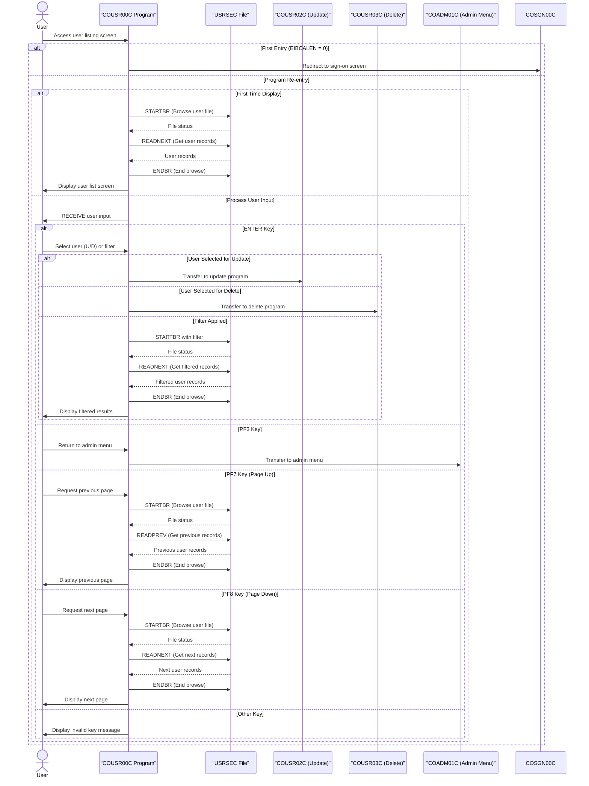

# COUSR00C

## Overview
This program (COUSR00C) is a CICS COBOL application that lists all users from the USRSEC file in the CardDemo system. It provides a paginated user interface that displays up to 10 users per page with their IDs, names, and user types. The program allows administrators to navigate through the user list using PF7 (page up) and PF8 (page down) keys, and supports user selection for update (U) or delete (D) operations. When a user is selected, the program transfers control to either COUSR02C (for updates) or COUSR03C (for deletions). The program handles various error conditions, maintains pagination state between screens, and provides appropriate feedback messages to the user. It's part of the CardDemo application's user administration functionality, allowing system administrators to manage user accounts.

## Metadata
**Program ID**: `COUSR00C`

**Author**: `AWS`

## Sequence Diagram


## Referenced Copybooks
- [`CSDAT01Y`](copybooks/CSDAT01Y.md)
- `DFHAID`
- [`CSUSR01Y`](copybooks/CSUSR01Y.md)
- [`COCOM01Y`](copybooks/COCOM01Y.md)
- `DFHBMSCA`
- `COUSR00`
- [`COTTL01Y`](copybooks/COTTL01Y.md)
- [`CSMSG01Y`](copybooks/CSMSG01Y.md)

## Environment Division

### CONFIGURATION SECTION
This section would typically contain configuration details for the COUSR00C program, including file assignments, special names, and system dependencies. In this CICS COBOL application, the Configuration Section would define how the program interacts with external resources like the USRSEC file that stores user information. It would also specify any special environment settings needed for the program to function properly within the CardDemo system's user administration module.
<details><summary>Code</summary>
```cobol

```
</details>


## Data Division

### WORKING-STORAGE SECTION
This Working Storage section defines the data structures used in the COUSR00C program for managing user listings. It includes program identification variables, status flags for error handling and pagination control, and counters for record processing. The WS-USER-DATA structure provides storage for up to 10 user records displayed on each page, with fields for selection markers, user IDs, names, and types. The section includes several copybooks: COCOM01Y (containing pagination control fields and user selection information), COUSR00 (likely the screen map definition), and various utility copybooks for titles, dates, messages, and user data. Standard CICS copybooks for AID keys and attributes are also included. This data structure supports the program's core functionality of displaying paginated user lists and handling user selection for update or delete operations.
<details><summary>Code</summary>
```cobol
01 WS-VARIABLES.
         05 WS-PGMNAME                 PIC X(08) VALUE 'COUSR00C'.
         05 WS-TRANID                  PIC X(04) VALUE 'CU00'.
         05 WS-MESSAGE                 PIC X(80) VALUE SPACES.
         05 WS-USRSEC-FILE             PIC X(08) VALUE 'USRSEC  '.
         05 WS-ERR-FLG                 PIC X(01) VALUE 'N'.
           88 ERR-FLG-ON                         VALUE 'Y'.
           88 ERR-FLG-OFF                        VALUE 'N'.
         05 WS-USER-SEC-EOF            PIC X(01) VALUE 'N'.
           88 USER-SEC-EOF                       VALUE 'Y'.
           88 USER-SEC-NOT-EOF                   VALUE 'N'.
         05 WS-SEND-ERASE-FLG          PIC X(01) VALUE 'Y'.
           88 SEND-ERASE-YES                     VALUE 'Y'.
           88 SEND-ERASE-NO                      VALUE 'N'.

         05 WS-RESP-CD                 PIC S9(09) COMP VALUE ZEROS.
         05 WS-REAS-CD                 PIC S9(09) COMP VALUE ZEROS.
         05 WS-REC-COUNT               PIC S9(04) COMP VALUE ZEROS.
         05 WS-IDX                     PIC S9(04) COMP VALUE ZEROS.
         05 WS-PAGE-NUM                PIC S9(04) COMP VALUE ZEROS.

       01 WS-USER-DATA.
         02 USER-REC OCCURS 10 TIMES.
           05 USER-SEL                   PIC X(01).
           05 FILLER                     PIC X(02).
           05 USER-ID                    PIC X(08).
           05 FILLER                     PIC X(02).
           05 USER-NAME                  PIC X(25).
           05 FILLER                     PIC X(02).
           05 USER-TYPE                  PIC X(08).

       COPY COCOM01Y.
          05 CDEMO-CU00-INFO.
             10 CDEMO-CU00-USRID-FIRST     PIC X(08).
             10 CDEMO-CU00-USRID-LAST      PIC X(08).
             10 CDEMO-CU00-PAGE-NUM        PIC 9(08).
             10 CDEMO-CU00-NEXT-PAGE-FLG   PIC X(01) VALUE 'N'.
                88 NEXT-PAGE-YES                     VALUE 'Y'.
                88 NEXT-PAGE-NO                      VALUE 'N'.
             10 CDEMO-CU00-USR-SEL-FLG     PIC X(01).
             10 CDEMO-CU00-USR-SELECTED    PIC X(08).
       COPY COUSR00.

       COPY COTTL01Y.
       COPY CSDAT01Y.
       COPY CSMSG01Y.
       COPY CSUSR01Y.

       COPY DFHAID.
       COPY DFHBMSCA.

      *----------------------------------------------------------------*
      *                        LINKAGE SECTION
      *----------------------------------------------------------------*
```
</details>


### LINKAGE SECTION
This section defines the linkage area for communication with other programs. It contains a DFHCOMMAREA with a single field LK-COMMAREA, which is defined as a variable-length array of characters that can expand from 1 to 32,767 bytes depending on the value in EIBCALEN (the CICS-provided length of the communication area). This structure allows the program to receive and pass data of varying sizes when called by or transferring control to other programs in the CardDemo system.
<details><summary>Code</summary>
```cobol
01  DFHCOMMAREA.
         05  LK-COMMAREA                           PIC X(01)
             OCCURS 1 TO 32767 TIMES DEPENDING ON EIBCALEN.

      *----------------------------------------------------------------*
      *
```
</details>


## Procedure Division

### MAIN-PARA
This paragraph serves as the main control flow for the COUSR00C program, handling initial setup and subsequent user interactions. It initializes error flags, pagination settings, and screen display parameters. The paragraph first checks if the program is being called directly (EIBCALEN = 0) and redirects to COSGN00C if so. For normal operation, it processes the communication area and either initializes the screen for first-time entry or handles user input based on the function key pressed. The paragraph supports navigation through PF3 (return to admin menu), PF7 (page up), PF8 (page down), and ENTER keys, with appropriate error handling for invalid key presses. After processing the user's request, it returns control to CICS while preserving the program state in the communication area for subsequent interactions.
<details><summary>Code</summary>
```cobol
SET ERR-FLG-OFF TO TRUE
           SET USER-SEC-NOT-EOF TO TRUE
           SET NEXT-PAGE-NO TO TRUE
           SET SEND-ERASE-YES TO TRUE

           MOVE SPACES TO WS-MESSAGE
                          ERRMSGO OF COUSR0AO

           MOVE -1       TO USRIDINL OF COUSR0AI

           IF EIBCALEN = 0
               MOVE 'COSGN00C' TO CDEMO-TO-PROGRAM
               PERFORM RETURN-TO-PREV-SCREEN
           ELSE
               MOVE DFHCOMMAREA(1:EIBCALEN) TO CARDDEMO-COMMAREA
               IF NOT CDEMO-PGM-REENTER
                   SET CDEMO-PGM-REENTER    TO TRUE
                   MOVE LOW-VALUES          TO COUSR0AO
                   PERFORM PROCESS-ENTER-KEY
                   PERFORM SEND-USRLST-SCREEN
               ELSE
                   PERFORM RECEIVE-USRLST-SCREEN
                   EVALUATE EIBAID
                       WHEN DFHENTER
                           PERFORM PROCESS-ENTER-KEY
                       WHEN DFHPF3
                           MOVE 'COADM01C' TO CDEMO-TO-PROGRAM
                           PERFORM RETURN-TO-PREV-SCREEN
                       WHEN DFHPF7
                           PERFORM PROCESS-PF7-KEY
                       WHEN DFHPF8
                           PERFORM PROCESS-PF8-KEY
                       WHEN OTHER
                           MOVE 'Y'                       TO WS-ERR-FLG
                           MOVE -1       TO USRIDINL OF COUSR0AI
                           MOVE CCDA-MSG-INVALID-KEY      TO WS-MESSAGE
                           PERFORM SEND-USRLST-SCREEN
                   END-EVALUATE
               END-IF
           END-IF

           EXEC CICS RETURN
                     TRANSID (WS-TRANID)
                     COMMAREA (CARDDEMO-COMMAREA)
           END-EXEC.

      *----------------------------------------------------------------*
      *                      PROCESS-ENTER-KEY
      *----------------------------------------------------------------*
```
</details>


### PROCESS-ENTER-KEY
This paragraph handles the processing of the Enter key in the user listing screen. It first evaluates which user row was selected by checking the selection fields (SEL0001I through SEL0010I) and captures both the selection flag (U for update or D for delete) and the corresponding user ID. If a valid selection is made, the program transfers control to either COUSR02C for user updates or COUSR03C for user deletions, passing control information in the CARDDEMO-COMMAREA. If an invalid selection character is entered, it displays an error message. The paragraph also handles any user ID filter entered by the user, resets the page number to 0, and performs a forward page operation to refresh the user list. The cursor is positioned at the user ID input field for the next interaction.
<details><summary>Code</summary>
```cobol
EVALUATE TRUE
               WHEN SEL0001I OF COUSR0AI NOT = SPACES AND LOW-VALUES
                   MOVE SEL0001I OF COUSR0AI TO CDEMO-CU00-USR-SEL-FLG
                   MOVE USRID01I OF COUSR0AI TO CDEMO-CU00-USR-SELECTED
               WHEN SEL0002I OF COUSR0AI NOT = SPACES AND LOW-VALUES
                   MOVE SEL0002I OF COUSR0AI TO CDEMO-CU00-USR-SEL-FLG
                   MOVE USRID02I OF COUSR0AI TO CDEMO-CU00-USR-SELECTED
               WHEN SEL0003I OF COUSR0AI NOT = SPACES AND LOW-VALUES
                   MOVE SEL0003I OF COUSR0AI TO CDEMO-CU00-USR-SEL-FLG
                   MOVE USRID03I OF COUSR0AI TO CDEMO-CU00-USR-SELECTED
               WHEN SEL0004I OF COUSR0AI NOT = SPACES AND LOW-VALUES
                   MOVE SEL0004I OF COUSR0AI TO CDEMO-CU00-USR-SEL-FLG
                   MOVE USRID04I OF COUSR0AI TO CDEMO-CU00-USR-SELECTED
               WHEN SEL0005I OF COUSR0AI NOT = SPACES AND LOW-VALUES
                   MOVE SEL0005I OF COUSR0AI TO CDEMO-CU00-USR-SEL-FLG
                   MOVE USRID05I OF COUSR0AI TO CDEMO-CU00-USR-SELECTED
               WHEN SEL0006I OF COUSR0AI NOT = SPACES AND LOW-VALUES
                   MOVE SEL0006I OF COUSR0AI TO CDEMO-CU00-USR-SEL-FLG
                   MOVE USRID06I OF COUSR0AI TO CDEMO-CU00-USR-SELECTED
               WHEN SEL0007I OF COUSR0AI NOT = SPACES AND LOW-VALUES
                   MOVE SEL0007I OF COUSR0AI TO CDEMO-CU00-USR-SEL-FLG
                   MOVE USRID07I OF COUSR0AI TO CDEMO-CU00-USR-SELECTED
               WHEN SEL0008I OF COUSR0AI NOT = SPACES AND LOW-VALUES
                   MOVE SEL0008I OF COUSR0AI TO CDEMO-CU00-USR-SEL-FLG
                   MOVE USRID08I OF COUSR0AI TO CDEMO-CU00-USR-SELECTED
               WHEN SEL0009I OF COUSR0AI NOT = SPACES AND LOW-VALUES
                   MOVE SEL0009I OF COUSR0AI TO CDEMO-CU00-USR-SEL-FLG
                   MOVE USRID09I OF COUSR0AI TO CDEMO-CU00-USR-SELECTED
               WHEN SEL0010I OF COUSR0AI NOT = SPACES AND LOW-VALUES
                   MOVE SEL0010I OF COUSR0AI TO CDEMO-CU00-USR-SEL-FLG
                   MOVE USRID10I OF COUSR0AI TO CDEMO-CU00-USR-SELECTED
               WHEN OTHER
                   MOVE SPACES   TO CDEMO-CU00-USR-SEL-FLG
                   MOVE SPACES   TO CDEMO-CU00-USR-SELECTED
           END-EVALUATE

           IF (CDEMO-CU00-USR-SEL-FLG NOT = SPACES AND LOW-VALUES) AND
              (CDEMO-CU00-USR-SELECTED NOT = SPACES AND LOW-VALUES)
               EVALUATE CDEMO-CU00-USR-SEL-FLG
                   WHEN 'U'
                   WHEN 'u'
                        MOVE 'COUSR02C'   TO CDEMO-TO-PROGRAM
                        MOVE WS-TRANID    TO CDEMO-FROM-TRANID
                        MOVE WS-PGMNAME   TO CDEMO-FROM-PROGRAM
                        MOVE 0        TO CDEMO-PGM-CONTEXT
                        EXEC CICS
                            XCTL PROGRAM(CDEMO-TO-PROGRAM)
                            COMMAREA(CARDDEMO-COMMAREA)
                        END-EXEC
                   WHEN 'D'
                   WHEN 'd'
                        MOVE 'COUSR03C'   TO CDEMO-TO-PROGRAM
                        MOVE WS-TRANID    TO CDEMO-FROM-TRANID
                        MOVE WS-PGMNAME   TO CDEMO-FROM-PROGRAM
                        MOVE 0        TO CDEMO-PGM-CONTEXT
                        EXEC CICS
                            XCTL PROGRAM(CDEMO-TO-PROGRAM)
                            COMMAREA(CARDDEMO-COMMAREA)
                        END-EXEC
                   WHEN OTHER
                       MOVE
                       'Invalid selection. Valid values are U and D' TO
                                       WS-MESSAGE
                       MOVE -1       TO USRIDINL OF COUSR0AI
               END-EVALUATE
           END-IF

           IF USRIDINI OF COUSR0AI = SPACES OR LOW-VALUES
               MOVE LOW-VALUES TO SEC-USR-ID
           ELSE
               MOVE USRIDINI  OF COUSR0AI TO SEC-USR-ID
           END-IF

           MOVE -1       TO USRIDINL OF COUSR0AI


           MOVE 0       TO CDEMO-CU00-PAGE-NUM
           PERFORM PROCESS-PAGE-FORWARD

           IF NOT ERR-FLG-ON
               MOVE SPACE   TO USRIDINO  OF COUSR0AO
           END-IF.

      *----------------------------------------------------------------*
      *                      PROCESS-PF7-KEY
      *----------------------------------------------------------------*
```
</details>


### PROCESS-PF7-KEY
This paragraph handles the Page Up (PF7) key functionality in the user listing screen. It determines the starting user ID for pagination by checking if the first user ID on the current screen is empty (indicating the beginning of the list) and sets the appropriate search key. The code sets a flag to indicate a page navigation is occurring and positions the cursor at the user ID input field. If the user is not already on the first page, it calls the PROCESS-PAGE-BACKWARD paragraph to display the previous page of users. Otherwise, it displays a message informing the user they are already at the top of the list and refreshes the screen without clearing it.
<details><summary>Code</summary>
```cobol
IF CDEMO-CU00-USRID-FIRST = SPACES OR LOW-VALUES
               MOVE LOW-VALUES TO SEC-USR-ID
           ELSE
               MOVE CDEMO-CU00-USRID-FIRST TO SEC-USR-ID
           END-IF

           SET NEXT-PAGE-YES TO TRUE
           MOVE -1       TO USRIDINL OF COUSR0AI

           IF CDEMO-CU00-PAGE-NUM > 1
               PERFORM PROCESS-PAGE-BACKWARD
           ELSE
               MOVE 'You are already at the top of the page...' TO
                               WS-MESSAGE
               SET SEND-ERASE-NO TO TRUE
               PERFORM SEND-USRLST-SCREEN
           END-IF.

      *----------------------------------------------------------------*
      *                      PROCESS-PF8-KEY
      *----------------------------------------------------------------*
```
</details>


### PROCESS-PF8-KEY
This paragraph handles the Page Down (PF8) key functionality in the user listing screen. It first determines the starting point for the next page of results by checking if the last displayed user ID is empty. If empty, it sets the search key to HIGH-VALUES to retrieve all records; otherwise, it uses the last displayed user ID as the starting point for the next page. The cursor is positioned at the user ID input field. If there are more pages available (NEXT-PAGE-YES flag is set), it calls the PROCESS-PAGE-FORWARD paragraph to load the next page of users. If there are no more pages to display, it shows a message informing the user they've reached the bottom of the list and redisplays the current screen without clearing it.
<details><summary>Code</summary>
```cobol
IF CDEMO-CU00-USRID-LAST = SPACES OR LOW-VALUES
               MOVE HIGH-VALUES TO SEC-USR-ID
           ELSE
               MOVE CDEMO-CU00-USRID-LAST TO SEC-USR-ID
           END-IF

           MOVE -1       TO USRIDINL OF COUSR0AI

           IF NEXT-PAGE-YES
               PERFORM PROCESS-PAGE-FORWARD
           ELSE
               MOVE 'You are already at the bottom of the page...' TO
                               WS-MESSAGE
               SET SEND-ERASE-NO TO TRUE
               PERFORM SEND-USRLST-SCREEN
           END-IF.

      *----------------------------------------------------------------*
      *                      PROCESS-PAGE-FORWARD
      *----------------------------------------------------------------*
```
</details>


### PROCESS-PAGE-FORWARD
This paragraph handles the forward pagination functionality in the user listing screen. It starts by browsing the user security file and then reads through records to populate the next page of user data. The process skips records if necessary when not using the ENTER, PF7, or PF3 keys. It populates up to 10 user records on the screen, incrementing the index for each record processed. After loading the current page, it checks if more records exist to determine if a "next page" option should be available. The page number is incremented accordingly, and the browse operation is ended before sending the updated screen to the user. The paragraph maintains pagination state and ensures proper display of user records when moving forward through the list.
<details><summary>Code</summary>
```cobol
PERFORM STARTBR-USER-SEC-FILE

           IF NOT ERR-FLG-ON

               IF EIBAID NOT = DFHENTER AND DFHPF7 AND DFHPF3
                   PERFORM READNEXT-USER-SEC-FILE
               END-IF

               IF USER-SEC-NOT-EOF AND ERR-FLG-OFF
               PERFORM VARYING WS-IDX FROM 1 BY 1 UNTIL WS-IDX > 10
                   PERFORM INITIALIZE-USER-DATA
               END-PERFORM
               END-IF

               MOVE 1             TO  WS-IDX

               PERFORM UNTIL WS-IDX >= 11 OR USER-SEC-EOF OR ERR-FLG-ON
                   PERFORM READNEXT-USER-SEC-FILE
                   IF USER-SEC-NOT-EOF AND ERR-FLG-OFF
                       PERFORM POPULATE-USER-DATA
                       COMPUTE WS-IDX = WS-IDX + 1
                   END-IF
               END-PERFORM

               IF USER-SEC-NOT-EOF AND ERR-FLG-OFF
                   COMPUTE CDEMO-CU00-PAGE-NUM =
                           CDEMO-CU00-PAGE-NUM + 1
                   PERFORM READNEXT-USER-SEC-FILE
                   IF USER-SEC-NOT-EOF AND ERR-FLG-OFF
                       SET NEXT-PAGE-YES TO TRUE
                   ELSE
                       SET NEXT-PAGE-NO TO TRUE
                   END-IF
               ELSE
                   SET NEXT-PAGE-NO TO TRUE
                   IF WS-IDX > 1
                       COMPUTE CDEMO-CU00-PAGE-NUM = CDEMO-CU00-PAGE-NUM
                        + 1
                   END-IF
               END-IF

               PERFORM ENDBR-USER-SEC-FILE

               MOVE CDEMO-CU00-PAGE-NUM TO PAGENUMI  OF COUSR0AI
               MOVE SPACE   TO USRIDINO  OF COUSR0AO
               PERFORM SEND-USRLST-SCREEN

           END-IF.

      *----------------------------------------------------------------*
      *                      PROCESS-PAGE-BACKWARD
      *----------------------------------------------------------------*
```
</details>


### PROCESS-PAGE-BACKWARD
This paragraph handles the page backward functionality in the user listing screen. When a user presses the page up key (PF7), it starts browsing the user security file, then reads records in reverse order to populate the previous page of user data. The process first initializes all user data fields, then reads up to 10 previous user records to display them on screen. It maintains pagination by decrementing the page number when appropriate, but ensures it never goes below 1. After populating the user data, it ends the browse operation, updates the page number on the screen, and sends the updated user list screen back to the user. The paragraph includes error handling to prevent processing if any errors occur during file operations.
<details><summary>Code</summary>
```cobol
PERFORM STARTBR-USER-SEC-FILE

           IF NOT ERR-FLG-ON

               IF EIBAID NOT = DFHENTER  AND DFHPF8
                   PERFORM READPREV-USER-SEC-FILE
               END-IF

               IF USER-SEC-NOT-EOF AND ERR-FLG-OFF
               PERFORM VARYING WS-IDX FROM 1 BY 1 UNTIL WS-IDX > 10
                   PERFORM INITIALIZE-USER-DATA
               END-PERFORM
               END-IF

               MOVE 10          TO  WS-IDX

               PERFORM UNTIL WS-IDX <= 0 OR USER-SEC-EOF OR ERR-FLG-ON
                   PERFORM READPREV-USER-SEC-FILE
                   IF USER-SEC-NOT-EOF AND ERR-FLG-OFF
                       PERFORM POPULATE-USER-DATA
                       COMPUTE WS-IDX = WS-IDX - 1
                   END-IF
               END-PERFORM

               IF USER-SEC-NOT-EOF AND ERR-FLG-OFF
               PERFORM READPREV-USER-SEC-FILE
               IF NEXT-PAGE-YES
                   IF USER-SEC-NOT-EOF AND ERR-FLG-OFF AND
                       CDEMO-CU00-PAGE-NUM > 1
                       SUBTRACT 1 FROM CDEMO-CU00-PAGE-NUM
                   ELSE
                       MOVE 1 TO CDEMO-CU00-PAGE-NUM
                   END-IF
               END-IF
               END-IF

               PERFORM ENDBR-USER-SEC-FILE

               MOVE CDEMO-CU00-PAGE-NUM TO PAGENUMI  OF COUSR0AI
               PERFORM SEND-USRLST-SCREEN

           END-IF.

      *----------------------------------------------------------------*
      *                      POPULATE-USER-DATA
      *----------------------------------------------------------------*
```
</details>


### POPULATE-USER-DATA
This paragraph populates the user interface screen with user data for display in the paginated user list. Based on the current index value (WS-IDX), it maps user information from the security record (SEC-USR fields) to the corresponding screen fields in the COUSR0AI map. For each of the 10 possible positions on the screen, it copies the user ID, first name, last name, and user type to the appropriate display fields. When populating the first and last positions (index 1 and 10), it also stores the user IDs in special fields (CDEMO-CU00-USRID-FIRST and CDEMO-CU00-USRID-LAST) which are likely used for pagination tracking. This paragraph is essential for rendering the user data in the proper format for the administrator to view and select users for further actions.
<details><summary>Code</summary>
```cobol
EVALUATE WS-IDX
               WHEN 1
                   MOVE SEC-USR-ID    TO USRID01I OF COUSR0AI
                                         CDEMO-CU00-USRID-FIRST
                   MOVE SEC-USR-FNAME TO FNAME01I OF COUSR0AI
                   MOVE SEC-USR-LNAME TO LNAME01I OF COUSR0AI
                   MOVE SEC-USR-TYPE  TO UTYPE01I OF COUSR0AI
               WHEN 2
                   MOVE SEC-USR-ID    TO USRID02I OF COUSR0AI
                   MOVE SEC-USR-FNAME TO FNAME02I OF COUSR0AI
                   MOVE SEC-USR-LNAME TO LNAME02I OF COUSR0AI
                   MOVE SEC-USR-TYPE  TO UTYPE02I OF COUSR0AI
               WHEN 3
                   MOVE SEC-USR-ID    TO USRID03I OF COUSR0AI
                   MOVE SEC-USR-FNAME TO FNAME03I OF COUSR0AI
                   MOVE SEC-USR-LNAME TO LNAME03I OF COUSR0AI
                   MOVE SEC-USR-TYPE  TO UTYPE03I OF COUSR0AI
               WHEN 4
                   MOVE SEC-USR-ID    TO USRID04I OF COUSR0AI
                   MOVE SEC-USR-FNAME TO FNAME04I OF COUSR0AI
                   MOVE SEC-USR-LNAME TO LNAME04I OF COUSR0AI
                   MOVE SEC-USR-TYPE  TO UTYPE04I OF COUSR0AI
               WHEN 5
                   MOVE SEC-USR-ID    TO USRID05I OF COUSR0AI
                   MOVE SEC-USR-FNAME TO FNAME05I OF COUSR0AI
                   MOVE SEC-USR-LNAME TO LNAME05I OF COUSR0AI
                   MOVE SEC-USR-TYPE  TO UTYPE05I OF COUSR0AI
               WHEN 6
                   MOVE SEC-USR-ID    TO USRID06I OF COUSR0AI
                   MOVE SEC-USR-FNAME TO FNAME06I OF COUSR0AI
                   MOVE SEC-USR-LNAME TO LNAME06I OF COUSR0AI
                   MOVE SEC-USR-TYPE  TO UTYPE06I OF COUSR0AI
               WHEN 7
                   MOVE SEC-USR-ID    TO USRID07I OF COUSR0AI
                   MOVE SEC-USR-FNAME TO FNAME07I OF COUSR0AI
                   MOVE SEC-USR-LNAME TO LNAME07I OF COUSR0AI
                   MOVE SEC-USR-TYPE  TO UTYPE07I OF COUSR0AI
               WHEN 8
                   MOVE SEC-USR-ID    TO USRID08I OF COUSR0AI
                   MOVE SEC-USR-FNAME TO FNAME08I OF COUSR0AI
                   MOVE SEC-USR-LNAME TO LNAME08I OF COUSR0AI
                   MOVE SEC-USR-TYPE  TO UTYPE08I OF COUSR0AI
               WHEN 9
                   MOVE SEC-USR-ID    TO USRID09I OF COUSR0AI
                   MOVE SEC-USR-FNAME TO FNAME09I OF COUSR0AI
                   MOVE SEC-USR-LNAME TO LNAME09I OF COUSR0AI
                   MOVE SEC-USR-TYPE  TO UTYPE09I OF COUSR0AI
               WHEN 10
                   MOVE SEC-USR-ID    TO USRID10I OF COUSR0AI
                                         CDEMO-CU00-USRID-LAST
                   MOVE SEC-USR-FNAME TO FNAME10I OF COUSR0AI
                   MOVE SEC-USR-LNAME TO LNAME10I OF COUSR0AI
                   MOVE SEC-USR-TYPE  TO UTYPE10I OF COUSR0AI
               WHEN OTHER
                   CONTINUE
           END-EVALUATE.

      *----------------------------------------------------------------*
      *                      INITIALIZE-USER-DATA
      *----------------------------------------------------------------*
```
</details>


### INITIALIZE-USER-DATA
This paragraph clears the user data fields on the display screen based on the current index value (WS-IDX). It uses an EVALUATE statement to determine which of the 10 possible user entry rows to clear. For each row position (1-10), it sets the user ID, first name, last name, and user type fields to spaces. This routine is likely called when initializing the screen for a new display or when removing user entries that should no longer be displayed, such as when navigating between pages of user records or after a deletion operation.
<details><summary>Code</summary>
```cobol
EVALUATE WS-IDX
               WHEN 1
                   MOVE SPACES TO USRID01I OF COUSR0AI
                   MOVE SPACES TO FNAME01I OF COUSR0AI
                   MOVE SPACES TO LNAME01I OF COUSR0AI
                   MOVE SPACES TO UTYPE01I OF COUSR0AI
               WHEN 2
                   MOVE SPACES TO USRID02I OF COUSR0AI
                   MOVE SPACES TO FNAME02I OF COUSR0AI
                   MOVE SPACES TO LNAME02I OF COUSR0AI
                   MOVE SPACES TO UTYPE02I OF COUSR0AI
               WHEN 3
                   MOVE SPACES TO USRID03I OF COUSR0AI
                   MOVE SPACES TO FNAME03I OF COUSR0AI
                   MOVE SPACES TO LNAME03I OF COUSR0AI
                   MOVE SPACES TO UTYPE03I OF COUSR0AI
               WHEN 4
                   MOVE SPACES TO USRID04I OF COUSR0AI
                   MOVE SPACES TO FNAME04I OF COUSR0AI
                   MOVE SPACES TO LNAME04I OF COUSR0AI
                   MOVE SPACES TO UTYPE04I OF COUSR0AI
               WHEN 5
                   MOVE SPACES TO USRID05I OF COUSR0AI
                   MOVE SPACES TO FNAME05I OF COUSR0AI
                   MOVE SPACES TO LNAME05I OF COUSR0AI
                   MOVE SPACES TO UTYPE05I OF COUSR0AI
               WHEN 6
                   MOVE SPACES TO USRID06I OF COUSR0AI
                   MOVE SPACES TO FNAME06I OF COUSR0AI
                   MOVE SPACES TO LNAME06I OF COUSR0AI
                   MOVE SPACES TO UTYPE06I OF COUSR0AI
               WHEN 7
                   MOVE SPACES TO USRID07I OF COUSR0AI
                   MOVE SPACES TO FNAME07I OF COUSR0AI
                   MOVE SPACES TO LNAME07I OF COUSR0AI
                   MOVE SPACES TO UTYPE07I OF COUSR0AI
               WHEN 8
                   MOVE SPACES TO USRID08I OF COUSR0AI
                   MOVE SPACES TO FNAME08I OF COUSR0AI
                   MOVE SPACES TO LNAME08I OF COUSR0AI
                   MOVE SPACES TO UTYPE08I OF COUSR0AI
               WHEN 9
                   MOVE SPACES TO USRID09I OF COUSR0AI
                   MOVE SPACES TO FNAME09I OF COUSR0AI
                   MOVE SPACES TO LNAME09I OF COUSR0AI
                   MOVE SPACES TO UTYPE09I OF COUSR0AI
               WHEN 10
                   MOVE SPACES TO USRID10I OF COUSR0AI
                   MOVE SPACES TO FNAME10I OF COUSR0AI
                   MOVE SPACES TO LNAME10I OF COUSR0AI
                   MOVE SPACES TO UTYPE10I OF COUSR0AI
               WHEN OTHER
                   CONTINUE
           END-EVALUATE.

      *----------------------------------------------------------------*
      *                      RETURN-TO-PREV-SCREEN
      *----------------------------------------------------------------*
```
</details>


### RETURN-TO-PREV-SCREEN
This paragraph handles the return navigation to a previous screen in the CardDemo application. It first checks if the target program is specified in the communication area, defaulting to 'COSGN00C' (likely the sign-on or main menu program) if no specific program is set. It then populates the communication area with the current transaction ID and program name as the source of the transfer, resets the program context to zeros, and executes a CICS XCTL command to transfer control to the target program while passing the CARDDEMO-COMMAREA. This provides a standardized way to navigate back from the user listing screen to the previous screen in the application flow.
<details><summary>Code</summary>
```cobol
IF CDEMO-TO-PROGRAM = LOW-VALUES OR SPACES
               MOVE 'COSGN00C' TO CDEMO-TO-PROGRAM
           END-IF
           MOVE WS-TRANID    TO CDEMO-FROM-TRANID
           MOVE WS-PGMNAME   TO CDEMO-FROM-PROGRAM
           MOVE ZEROS        TO CDEMO-PGM-CONTEXT
           EXEC CICS
               XCTL PROGRAM(CDEMO-TO-PROGRAM)
               COMMAREA(CARDDEMO-COMMAREA)
           END-EXEC.

      *----------------------------------------------------------------*
      *                      SEND-USRLST-SCREEN
      *----------------------------------------------------------------*
```
</details>


### SEND-USRLST-SCREEN
This paragraph handles the display of the user list screen (COUSR0A) to the user. It first calls the POPULATE-HEADER-INFO paragraph to set up the screen header information, then displays any system messages stored in WS-MESSAGE to the error message field. The paragraph implements conditional screen rendering logic based on the SEND-ERASE-YES flag - if set, it sends the screen with the ERASE option to clear the entire screen; otherwise, it sends the screen without erasing, which preserves background content. In both cases, it positions the cursor at the default location. This paragraph is part of the user interface management functionality that presents the paginated user list to administrators.
<details><summary>Code</summary>
```cobol
PERFORM POPULATE-HEADER-INFO

           MOVE WS-MESSAGE TO ERRMSGO OF COUSR0AO

           IF SEND-ERASE-YES
               EXEC CICS SEND
                         MAP('COUSR0A')
                         MAPSET('COUSR00')
                         FROM(COUSR0AO)
                         ERASE
                         CURSOR
               END-EXEC
           ELSE
               EXEC CICS SEND
                         MAP('COUSR0A')
                         MAPSET('COUSR00')
                         FROM(COUSR0AO)
      *                  ERASE
                         CURSOR
               END-EXEC
           END-IF.

      *----------------------------------------------------------------*
      *                      RECEIVE-USRLST-SCREEN
      *----------------------------------------------------------------*
```
</details>


### RECEIVE-USRLST-SCREEN
This paragraph receives user input from the COUSR0A map within the COUSR00 mapset, storing the data in the COUSR0AI structure. It captures response codes in WS-RESP-CD and WS-REAS-CD variables to handle any communication errors that might occur during the receive operation. This is a standard CICS interaction that retrieves the screen data after a user has entered information or pressed a function key on the user listing screen.
<details><summary>Code</summary>
```cobol
EXEC CICS RECEIVE
                     MAP('COUSR0A')
                     MAPSET('COUSR00')
                     INTO(COUSR0AI)
                     RESP(WS-RESP-CD)
                     RESP2(WS-REAS-CD)
           END-EXEC.

      *----------------------------------------------------------------*
      *                      POPULATE-HEADER-INFO
      *----------------------------------------------------------------*
```
</details>


### POPULATE-HEADER-INFO
This paragraph populates the header information for the user listing screen. It retrieves the current system date and time using the CURRENT-DATE function, then formats and displays this information on the screen. The paragraph sets the application title fields, transaction ID, and program name in the output map. It also formats the current date into MM/DD/YY format and the current time into HH:MM:SS format before moving these values to their respective output fields. This header information provides context to the user about which program they're using and when the screen was generated.
<details><summary>Code</summary>
```cobol
MOVE FUNCTION CURRENT-DATE  TO WS-CURDATE-DATA

           MOVE CCDA-TITLE01           TO TITLE01O OF COUSR0AO
           MOVE CCDA-TITLE02           TO TITLE02O OF COUSR0AO
           MOVE WS-TRANID              TO TRNNAMEO OF COUSR0AO
           MOVE WS-PGMNAME             TO PGMNAMEO OF COUSR0AO

           MOVE WS-CURDATE-MONTH       TO WS-CURDATE-MM
           MOVE WS-CURDATE-DAY         TO WS-CURDATE-DD
           MOVE WS-CURDATE-YEAR(3:2)   TO WS-CURDATE-YY

           MOVE WS-CURDATE-MM-DD-YY    TO CURDATEO OF COUSR0AO

           MOVE WS-CURTIME-HOURS       TO WS-CURTIME-HH
           MOVE WS-CURTIME-MINUTE      TO WS-CURTIME-MM
           MOVE WS-CURTIME-SECOND      TO WS-CURTIME-SS

           MOVE WS-CURTIME-HH-MM-SS    TO CURTIMEO OF COUSR0AO.

      *----------------------------------------------------------------*
      *                      STARTBR-USER-SEC-FILE
      *----------------------------------------------------------------*
```
</details>


### STARTBR-USER-SEC-FILE
This paragraph initiates a browse operation on the USRSEC file to retrieve user records. It uses the CICS STARTBR command with the user ID as the key field. The paragraph handles three possible outcomes: successful browse initiation (continues processing), no records found (sets end-of-file flag and displays a message that the user is at the top of the page), or an error condition (displays response and reason codes, sets an error flag, and shows an error message). In all error cases, the paragraph positions the cursor at the user ID input field and redisplays the user list screen. This is a key part of the pagination functionality that allows administrators to browse through the system's user records.
<details><summary>Code</summary>
```cobol
EXEC CICS STARTBR
                DATASET   (WS-USRSEC-FILE)
                RIDFLD    (SEC-USR-ID)
                KEYLENGTH (LENGTH OF SEC-USR-ID)
      *         GTEQ
                RESP      (WS-RESP-CD)
                RESP2     (WS-REAS-CD)
           END-EXEC.

           EVALUATE WS-RESP-CD
               WHEN DFHRESP(NORMAL)
                   CONTINUE
               WHEN DFHRESP(NOTFND)
                   CONTINUE
                   SET USER-SEC-EOF TO TRUE
                   MOVE 'You are at the top of the page...' TO
                                   WS-MESSAGE
                   MOVE -1       TO USRIDINL OF COUSR0AI
                   PERFORM SEND-USRLST-SCREEN
               WHEN OTHER
                   DISPLAY 'RESP:' WS-RESP-CD 'REAS:' WS-REAS-CD
                   MOVE 'Y'     TO WS-ERR-FLG
                   MOVE 'Unable to lookup User...' TO
                                   WS-MESSAGE
                   MOVE -1       TO USRIDINL OF COUSR0AI
                   PERFORM SEND-USRLST-SCREEN
           END-EVALUATE.

      *----------------------------------------------------------------*
      *                      READNEXT-USER-SEC-FILE
      *----------------------------------------------------------------*
```
</details>


### READNEXT-USER-SEC-FILE
This paragraph performs a sequential read operation on the USRSEC file to retrieve the next user record. It uses the CICS READNEXT command to fetch the next record based on the current key position stored in SEC-USR-ID. The paragraph handles three possible outcomes: successful read (NORMAL), end of file condition (ENDFILE), and errors. When the end of file is reached, it sets a flag, displays a message indicating the user has reached the bottom of the page, and redisplays the user list screen. For other errors, it logs the response and reason codes, sets an error flag, displays an error message, and redisplays the screen. This functionality supports the pagination feature of the user listing interface, allowing administrators to navigate through multiple pages of user records.
<details><summary>Code</summary>
```cobol
EXEC CICS READNEXT
                DATASET   (WS-USRSEC-FILE)
                INTO      (SEC-USER-DATA)
                LENGTH    (LENGTH OF SEC-USER-DATA)
                RIDFLD    (SEC-USR-ID)
                KEYLENGTH (LENGTH OF SEC-USR-ID)
                RESP      (WS-RESP-CD)
                RESP2     (WS-REAS-CD)
           END-EXEC.

           EVALUATE WS-RESP-CD
               WHEN DFHRESP(NORMAL)
                   CONTINUE
               WHEN DFHRESP(ENDFILE)
                   CONTINUE
                   SET USER-SEC-EOF TO TRUE
                   MOVE 'You have reached the bottom of the page...' TO
                                   WS-MESSAGE
                   MOVE -1       TO USRIDINL OF COUSR0AI
                   PERFORM SEND-USRLST-SCREEN
               WHEN OTHER
                   DISPLAY 'RESP:' WS-RESP-CD 'REAS:' WS-REAS-CD
                   MOVE 'Y'     TO WS-ERR-FLG
                   MOVE 'Unable to lookup User...' TO
                                   WS-MESSAGE
                   MOVE -1       TO USRIDINL OF COUSR0AI
                   PERFORM SEND-USRLST-SCREEN
           END-EVALUATE.

      *----------------------------------------------------------------*
      *                      READPREV-USER-SEC-FILE
      *----------------------------------------------------------------*
```
</details>


### READPREV-USER-SEC-FILE
This paragraph performs a backward read operation on the USRSEC file to support pagination when users navigate to previous records. It reads the previous record based on the current key position and handles three possible outcomes: successful read (continues processing), reaching the beginning of the file (displays a message indicating the user has reached the top of the page), or encountering an error (displays an error message). In all cases except a normal read, the paragraph sends the user list screen back to the user with appropriate positioning and messaging. This functionality supports the PF7 (page up) navigation in the user administration interface.
<details><summary>Code</summary>
```cobol
EXEC CICS READPREV
                DATASET   (WS-USRSEC-FILE)
                INTO      (SEC-USER-DATA)
                LENGTH    (LENGTH OF SEC-USER-DATA)
                RIDFLD    (SEC-USR-ID)
                KEYLENGTH (LENGTH OF SEC-USR-ID)
                RESP      (WS-RESP-CD)
                RESP2     (WS-REAS-CD)
           END-EXEC.

           EVALUATE WS-RESP-CD
               WHEN DFHRESP(NORMAL)
                   CONTINUE
               WHEN DFHRESP(ENDFILE)
                   CONTINUE
                   SET USER-SEC-EOF TO TRUE
                   MOVE 'You have reached the top of the page...' TO
                                   WS-MESSAGE
                   MOVE -1       TO USRIDINL OF COUSR0AI
                   PERFORM SEND-USRLST-SCREEN
               WHEN OTHER
                   DISPLAY 'RESP:' WS-RESP-CD 'REAS:' WS-REAS-CD
                   MOVE 'Y'     TO WS-ERR-FLG
                   MOVE 'Unable to lookup User...' TO
                                   WS-MESSAGE
                   MOVE -1       TO USRIDINL OF COUSR0AI
                   PERFORM SEND-USRLST-SCREEN
           END-EVALUATE.

      *----------------------------------------------------------------*
      *                      ENDBR-USER-SEC-FILE
      *----------------------------------------------------------------*
```
</details>


### ENDBR-USER-SEC-FILE
This paragraph terminates a browse operation on the USRSEC file (user security file) using the CICS ENDBR command. It marks the end of sequential record retrieval that was previously initiated with a STARTBR command. The paragraph is called when the program has finished reading through user records during the pagination process. The WS-USRSEC-FILE variable contains the name of the dataset being accessed.
<details><summary>Code</summary>
```cobol
EXEC CICS ENDBR
                DATASET   (WS-USRSEC-FILE)
           END-EXEC.
      
      *
      * Ver: CardDemo_v1.0-15-g27d6c6f-68 Date: 2022-07-19 23:12:34 CDT
      *
```
</details>
