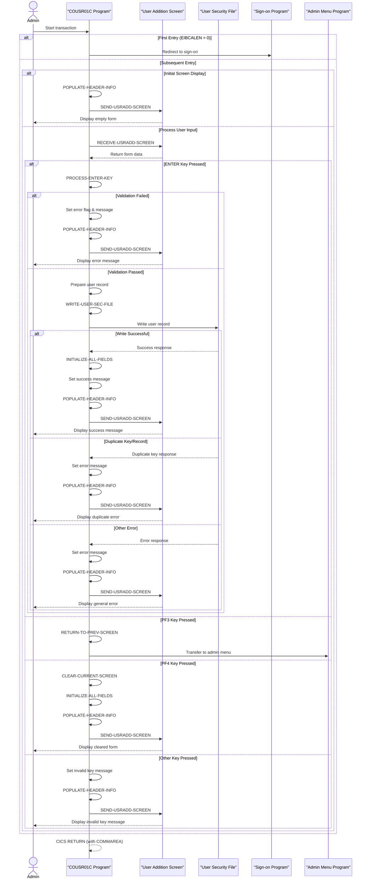

# COUSR01C

## Overview
This CICS COBOL program (COUSR01C) manages the addition of new users to the CardDemo application's security system. It allows administrators to create both regular and admin user accounts by capturing user details through a screen interface and storing them in the USRSEC file. The program validates that all required fields (first name, last name, user ID, password, and user type) are completed before attempting to write the record. It handles various error conditions, including duplicate user IDs, and provides appropriate feedback messages. The program includes navigation capabilities to return to previous screens and supports function keys for cancellation (PF3) and screen clearing (PF4).

## Metadata
**Program ID**: `COUSR01C`

**Author**: `AWS`

## Sequence Diagram


## Referenced Copybooks
- [`CSDAT01Y`](copybooks/CSDAT01Y.md)
- `DFHAID`
- [`CSUSR01Y`](copybooks/CSUSR01Y.md)
- [`COCOM01Y`](copybooks/COCOM01Y.md)
- `DFHBMSCA`
- `DFHATTR`
- `COUSR01`
- [`COTTL01Y`](copybooks/COTTL01Y.md)
- [`CSMSG01Y`](copybooks/CSMSG01Y.md)

## Environment Division

### CONFIGURATION SECTION
This section is empty in the provided COBOL program COUSR01C. The Configuration Section would typically contain SOURCE-COMPUTER and OBJECT-COMPUTER entries, as well as any SPECIAL-NAMES clauses, but none are defined in this program. This suggests that the program relies on default configuration settings or that these configurations are defined elsewhere in the program structure.
<details><summary>Code</summary>
```cobol

```
</details>


## Data Division

### WORKING-STORAGE SECTION
This Working-Storage section defines the key variables and data structures used by the COUSR01C program for managing user additions. It includes program identifiers (program name and transaction ID), a message field for user feedback, and file name reference for the user security file (USRSEC). Error handling is facilitated through a flag variable (WS-ERR-FLG) with condition names for on/off states, along with response and reason code fields for CICS operations. The section incorporates several copybooks that likely contain screen maps (COUSR01), common components (COCOM01Y), title elements (COTTL01Y), date utilities (CSDAT01Y), messaging structures (CSMSG01Y), and user-related data definitions (CSUSR01Y). Standard CICS copybooks for AID keys (DFHAID) and BMS screen attributes (DFHBMSCA) are also included to support the program's interactive functionality.
<details><summary>Code</summary>
```cobol
01 WS-VARIABLES.
         05 WS-PGMNAME                 PIC X(08) VALUE 'COUSR01C'.
         05 WS-TRANID                  PIC X(04) VALUE 'CU01'.
         05 WS-MESSAGE                 PIC X(80) VALUE SPACES.
         05 WS-USRSEC-FILE             PIC X(08) VALUE 'USRSEC  '.
         05 WS-ERR-FLG                 PIC X(01) VALUE 'N'.
           88 ERR-FLG-ON                         VALUE 'Y'.
           88 ERR-FLG-OFF                        VALUE 'N'.
         05 WS-RESP-CD                 PIC S9(09) COMP VALUE ZEROS.
         05 WS-REAS-CD                 PIC S9(09) COMP VALUE ZEROS.

       COPY COCOM01Y.

       COPY COUSR01.

       COPY COTTL01Y.
       COPY CSDAT01Y.
       COPY CSMSG01Y.
       COPY CSUSR01Y.

       COPY DFHAID.
       COPY DFHBMSCA.
      *COPY DFHATTR.

      *----------------------------------------------------------------*
      *                        LINKAGE SECTION
      *----------------------------------------------------------------*
```
</details>


### LINKAGE SECTION
This section defines the DFHCOMMAREA structure in the Linkage Section, which is used to receive data passed to the program from the calling program. It contains a single field, LK-COMMAREA, defined as a variable-length array of characters that can expand from 1 to 32,767 bytes depending on the actual length of data passed (EIBCALEN). This structure allows the user management program to receive and process communication data from other components of the CardDemo application.
<details><summary>Code</summary>
```cobol
01  DFHCOMMAREA.
         05  LK-COMMAREA                           PIC X(01)
             OCCURS 1 TO 32767 TIMES DEPENDING ON EIBCALEN.

      *----------------------------------------------------------------*
      *
```
</details>


## Procedure Division

### MAIN-PARA
This paragraph serves as the main control flow for the COUSR01C program, handling initial entry, screen navigation, and function key processing. When first entered (EIBCALEN = 0), it redirects to the sign-on program (COSGN00C). On subsequent entries, it either initializes and displays the user addition screen or processes user input based on the function key pressed. The paragraph handles three specific actions: ENTER key (triggering form processing), PF3 (returning to the admin menu), and PF4 (clearing the current screen). Any other key inputs trigger an error message. The paragraph maintains program state through the CARDDEMO-COMMAREA and concludes with a CICS RETURN that preserves the transaction context for continued processing.
<details><summary>Code</summary>
```cobol
SET ERR-FLG-OFF TO TRUE

           MOVE SPACES TO WS-MESSAGE
                          ERRMSGO OF COUSR1AO

           IF EIBCALEN = 0
               MOVE 'COSGN00C' TO CDEMO-TO-PROGRAM
               PERFORM RETURN-TO-PREV-SCREEN
           ELSE
               MOVE DFHCOMMAREA(1:EIBCALEN) TO CARDDEMO-COMMAREA
               IF NOT CDEMO-PGM-REENTER
                   SET CDEMO-PGM-REENTER    TO TRUE
                   MOVE LOW-VALUES          TO COUSR1AO
                   MOVE -1       TO FNAMEL OF COUSR1AI
                   PERFORM SEND-USRADD-SCREEN
               ELSE
                   PERFORM RECEIVE-USRADD-SCREEN
                   EVALUATE EIBAID
                       WHEN DFHENTER
                           PERFORM PROCESS-ENTER-KEY
                       WHEN DFHPF3
                           MOVE 'COADM01C' TO CDEMO-TO-PROGRAM
                           PERFORM RETURN-TO-PREV-SCREEN
                       WHEN DFHPF4
                           PERFORM CLEAR-CURRENT-SCREEN
                       WHEN OTHER
                           MOVE 'Y'                       TO WS-ERR-FLG
                           MOVE -1       TO FNAMEL OF COUSR1AI
                           MOVE CCDA-MSG-INVALID-KEY      TO WS-MESSAGE
                           PERFORM SEND-USRADD-SCREEN
                   END-EVALUATE
               END-IF
           END-IF

           EXEC CICS RETURN
                     TRANSID (WS-TRANID)
                     COMMAREA (CARDDEMO-COMMAREA)
           END-EXEC.

      *----------------------------------------------------------------*
      *                      PROCESS-ENTER-KEY
      *----------------------------------------------------------------*
```
</details>


### PROCESS-ENTER-KEY
This paragraph validates user input fields during the user creation process in the CardDemo security system. It checks that all required fields (first name, last name, user ID, password, and user type) are not empty, displaying appropriate error messages and positioning the cursor at the problematic field when validation fails. If all validations pass, it transfers the input data from the screen fields to the security record structure and calls the WRITE-USER-SEC-FILE paragraph to save the new user record. The validation follows a priority sequence, checking fields in a specific order and stopping at the first error encountered.
<details><summary>Code</summary>
```cobol
EVALUATE TRUE
               WHEN FNAMEI OF COUSR1AI = SPACES OR LOW-VALUES
                   MOVE 'Y'     TO WS-ERR-FLG
                   MOVE 'First Name can NOT be empty...' TO
                                   WS-MESSAGE
                   MOVE -1       TO FNAMEL OF COUSR1AI
                   PERFORM SEND-USRADD-SCREEN
               WHEN LNAMEI OF COUSR1AI = SPACES OR LOW-VALUES
                   MOVE 'Y'     TO WS-ERR-FLG
                   MOVE 'Last Name can NOT be empty...' TO
                                   WS-MESSAGE
                   MOVE -1       TO LNAMEL OF COUSR1AI
                   PERFORM SEND-USRADD-SCREEN
               WHEN USERIDI OF COUSR1AI = SPACES OR LOW-VALUES
                   MOVE 'Y'     TO WS-ERR-FLG
                   MOVE 'User ID can NOT be empty...' TO
                                   WS-MESSAGE
                   MOVE -1       TO USERIDL OF COUSR1AI
                   PERFORM SEND-USRADD-SCREEN
               WHEN PASSWDI OF COUSR1AI = SPACES OR LOW-VALUES
                   MOVE 'Y'     TO WS-ERR-FLG
                   MOVE 'Password can NOT be empty...' TO
                                   WS-MESSAGE
                   MOVE -1       TO PASSWDL OF COUSR1AI
                   PERFORM SEND-USRADD-SCREEN
               WHEN USRTYPEI OF COUSR1AI = SPACES OR LOW-VALUES
                   MOVE 'Y'     TO WS-ERR-FLG
                   MOVE 'User Type can NOT be empty...' TO
                                   WS-MESSAGE
                   MOVE -1       TO USRTYPEL OF COUSR1AI
                   PERFORM SEND-USRADD-SCREEN
               WHEN OTHER
                   MOVE -1       TO FNAMEL OF COUSR1AI
                   CONTINUE
           END-EVALUATE

           IF NOT ERR-FLG-ON
               MOVE USERIDI  OF COUSR1AI TO SEC-USR-ID
               MOVE FNAMEI   OF COUSR1AI TO SEC-USR-FNAME
               MOVE LNAMEI   OF COUSR1AI TO SEC-USR-LNAME
               MOVE PASSWDI  OF COUSR1AI TO SEC-USR-PWD
               MOVE USRTYPEI OF COUSR1AI TO SEC-USR-TYPE
               PERFORM WRITE-USER-SEC-FILE
           END-IF.

      *----------------------------------------------------------------*
      *                      RETURN-TO-PREV-SCREEN
      *----------------------------------------------------------------*
```
</details>


### RETURN-TO-PREV-SCREEN
This paragraph handles the navigation back to a previous screen in the CardDemo application. When triggered, it checks if the destination program is specified (CDEMO-TO-PROGRAM), and if not, defaults to the sign-on program 'COSGN00C'. It then prepares the communication area by setting the originating transaction ID and program name before transferring control to the destination program using CICS XCTL command. The commented-out lines suggest that user identification information was previously passed but may no longer be required. The paragraph ensures proper navigation flow within the application while maintaining context between program calls.
<details><summary>Code</summary>
```cobol
IF CDEMO-TO-PROGRAM = LOW-VALUES OR SPACES
               MOVE 'COSGN00C' TO CDEMO-TO-PROGRAM
           END-IF
           MOVE WS-TRANID    TO CDEMO-FROM-TRANID
           MOVE WS-PGMNAME   TO CDEMO-FROM-PROGRAM
      *    MOVE WS-USER-ID   TO CDEMO-USER-ID
      *    MOVE SEC-USR-TYPE TO CDEMO-USER-TYPE
           MOVE ZEROS        TO CDEMO-PGM-CONTEXT
           EXEC CICS
               XCTL PROGRAM(CDEMO-TO-PROGRAM)
               COMMAREA(CARDDEMO-COMMAREA)
           END-EXEC.


      *----------------------------------------------------------------*
      *                      SEND-USRADD-SCREEN
      *----------------------------------------------------------------*
```
</details>


### SEND-USRADD-SCREEN
This paragraph displays the user addition screen to the user. It first calls the POPULATE-HEADER-INFO paragraph to set up standard header information, then moves any system message to the error message field on the screen. It then uses the CICS SEND command to display the COUSR1A map from the COUSR01 mapset, clearing the screen (ERASE) and positioning the cursor at the default position. This is the initial presentation of the form where administrators can enter new user details.
<details><summary>Code</summary>
```cobol
PERFORM POPULATE-HEADER-INFO

           MOVE WS-MESSAGE TO ERRMSGO OF COUSR1AO

           EXEC CICS SEND
                     MAP('COUSR1A')
                     MAPSET('COUSR01')
                     FROM(COUSR1AO)
                     ERASE
                     CURSOR
           END-EXEC.

      *----------------------------------------------------------------*
      *                      RECEIVE-USRADD-SCREEN
      *----------------------------------------------------------------*
```
</details>


### RECEIVE-USRADD-SCREEN
This paragraph receives user input from the COUSR1A map within the COUSR01 mapset, storing the captured data in the COUSR1AI structure. It captures response codes in WS-RESP-CD and WS-REAS-CD variables to handle any potential errors during the receive operation. This is a key step in the user addition process, capturing the form data entered by administrators when creating new user accounts in the CardDemo security system.
<details><summary>Code</summary>
```cobol
EXEC CICS RECEIVE
                     MAP('COUSR1A')
                     MAPSET('COUSR01')
                     INTO(COUSR1AI)
                     RESP(WS-RESP-CD)
                     RESP2(WS-REAS-CD)
           END-EXEC.

      *----------------------------------------------------------------*
      *                      POPULATE-HEADER-INFO
      *----------------------------------------------------------------*
```
</details>


### POPULATE-HEADER-INFO
This paragraph populates the header information on the user management screen (COUSR1A). It retrieves the current date and time using the CURRENT-DATE function, then formats and displays this information along with screen titles, transaction ID, and program name. The date is formatted as MM/DD/YY and the time as HH:MM:SS before being moved to their respective output fields on the screen. This provides users with contextual information about when they're accessing the system and which program they're currently using.
<details><summary>Code</summary>
```cobol
MOVE FUNCTION CURRENT-DATE  TO WS-CURDATE-DATA

           MOVE CCDA-TITLE01           TO TITLE01O OF COUSR1AO
           MOVE CCDA-TITLE02           TO TITLE02O OF COUSR1AO
           MOVE WS-TRANID              TO TRNNAMEO OF COUSR1AO
           MOVE WS-PGMNAME             TO PGMNAMEO OF COUSR1AO

           MOVE WS-CURDATE-MONTH       TO WS-CURDATE-MM
           MOVE WS-CURDATE-DAY         TO WS-CURDATE-DD
           MOVE WS-CURDATE-YEAR(3:2)   TO WS-CURDATE-YY

           MOVE WS-CURDATE-MM-DD-YY    TO CURDATEO OF COUSR1AO

           MOVE WS-CURTIME-HOURS       TO WS-CURTIME-HH
           MOVE WS-CURTIME-MINUTE      TO WS-CURTIME-MM
           MOVE WS-CURTIME-SECOND      TO WS-CURTIME-SS

           MOVE WS-CURTIME-HH-MM-SS    TO CURTIMEO OF COUSR1AO.

      *----------------------------------------------------------------*
      *                      WRITE-USER-SEC-FILE
      *----------------------------------------------------------------*
```
</details>


### WRITE-USER-SEC-FILE
This paragraph handles the writing of a new user record to the USRSEC security file and processes the response. It first attempts to write the user data using CICS WRITE command with the user ID as the key. The paragraph then evaluates the response code and takes appropriate action: if successful, it initializes fields, displays a green success message showing which user was added, and refreshes the screen; if a duplicate key/record is detected (indicating the user ID already exists), it sets an error flag, displays an appropriate error message, and positions the cursor at the user ID field; for any other errors, it sets an error flag, displays a generic error message, and positions the cursor at the first name field. In all cases, it calls the SEND-USRADD-SCREEN paragraph to display the appropriate feedback to the user.
<details><summary>Code</summary>
```cobol
EXEC CICS WRITE
                DATASET   (WS-USRSEC-FILE)
                FROM      (SEC-USER-DATA)
                LENGTH    (LENGTH OF SEC-USER-DATA)
                RIDFLD    (SEC-USR-ID)
                KEYLENGTH (LENGTH OF SEC-USR-ID)
                RESP      (WS-RESP-CD)
                RESP2     (WS-REAS-CD)
           END-EXEC.

           EVALUATE WS-RESP-CD
               WHEN DFHRESP(NORMAL)
                   PERFORM INITIALIZE-ALL-FIELDS
                   MOVE SPACES             TO WS-MESSAGE
                   MOVE DFHGREEN           TO ERRMSGC  OF COUSR1AO
                   STRING 'User '     DELIMITED BY SIZE
                          SEC-USR-ID  DELIMITED BY SPACE
                          ' has been added ...' DELIMITED BY SIZE
                     INTO WS-MESSAGE
                   PERFORM SEND-USRADD-SCREEN
               WHEN DFHRESP(DUPKEY)
               WHEN DFHRESP(DUPREC)
                   MOVE 'Y'     TO WS-ERR-FLG
                   MOVE 'User ID already exist...' TO
                                   WS-MESSAGE
                   MOVE -1       TO USERIDL OF COUSR1AI
                   PERFORM SEND-USRADD-SCREEN
               WHEN OTHER
      *            DISPLAY 'RESP:' WS-RESP-CD 'REAS:' WS-REAS-CD
                   MOVE 'Y'     TO WS-ERR-FLG
                   MOVE 'Unable to Add User...' TO
                                   WS-MESSAGE
                   MOVE -1       TO FNAMEL OF COUSR1AI
                   PERFORM SEND-USRADD-SCREEN
           END-EVALUATE.

      *----------------------------------------------------------------*
      *                      CLEAR-CURRENT-SCREEN
      *----------------------------------------------------------------*
```
</details>


### CLEAR-CURRENT-SCREEN
This paragraph clears the current screen by first initializing all fields to their default values and then redisplaying the user addition screen. It provides a way to reset the form when users want to start over with data entry.
<details><summary>Code</summary>
```cobol
PERFORM INITIALIZE-ALL-FIELDS.
           PERFORM SEND-USRADD-SCREEN.

      *----------------------------------------------------------------*
      *                      INITIALIZE-ALL-FIELDS
      *----------------------------------------------------------------*
```
</details>


### INITIALIZE-ALL-FIELDS
This paragraph initializes the input fields on the user registration screen. It sets the cursor position to the first name field by assigning -1 to FNAMEL, and clears all input fields (user ID, first name, last name, password, and user type) by filling them with spaces. This is typically executed when the screen is first displayed or when a reset operation is performed.
<details><summary>Code</summary>
```cobol
MOVE -1              TO FNAMEL OF COUSR1AI
           MOVE SPACES          TO USERIDI  OF COUSR1AI
                                   FNAMEI   OF COUSR1AI
                                   LNAMEI   OF COUSR1AI
                                   PASSWDI  OF COUSR1AI
                                   USRTYPEI OF COUSR1AI
```
</details>


### WS-MESSAGE
This paragraph contains version control information for the COUSR01C program, indicating it is part of the CardDemo application version 1.0-15-g27d6c6f-68, with a timestamp of July 19, 2022, at 23:12:34 CDT. This helps track which version of the code is deployed and when it was last updated.
<details><summary>Code</summary>
```cobol
*
      * Ver: CardDemo_v1.0-15-g27d6c6f-68 Date: 2022-07-19 23:12:34 CDT
      *
```
</details>
