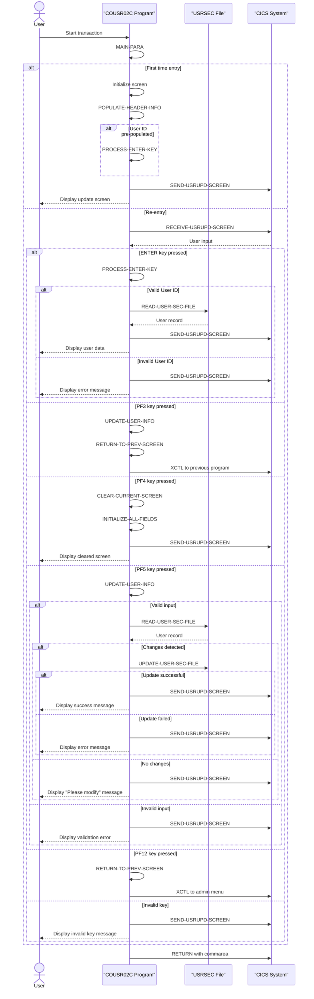

# COUSR02C

## Overview
This CICS COBOL program (COUSR02C) manages user profile updates in the CardDemo application. It allows administrators to modify existing user information in the USRSEC file. The program retrieves user records based on user ID input, displays the current information for editing, validates the modified data, and updates the user record when changes are made. The program includes field validation to ensure required information (user ID, first name, last name, password, and user type) is provided before updates are processed. It features navigation capabilities to return to previous screens and clear functionality to reset input fields. Error handling is implemented for various scenarios including record not found conditions and update failures.

## Metadata
**Program ID**: `COUSR02C`

**Author**: `AWS`

## Sequence Diagram


## Referenced Copybooks
- [`CSDAT01Y`](copybooks/CSDAT01Y.md)
- `DFHAID`
- [`CSUSR01Y`](copybooks/CSUSR01Y.md)
- [`COCOM01Y`](copybooks/COCOM01Y.md)
- `COUSR02`
- `DFHBMSCA`
- [`COTTL01Y`](copybooks/COTTL01Y.md)
- [`CSMSG01Y`](copybooks/CSMSG01Y.md)

## Environment Division

### CONFIGURATION SECTION
This section would typically contain configuration details for the COUSR02C program, including file assignments, special names, and system dependencies. However, the provided snippet is empty, indicating that either the Configuration Section is not used in this program or the configuration details are defined elsewhere, possibly in a separate copybook or through CICS resource definitions. For a user profile management program like COUSR02C, configuration would normally include specifications for the USRSEC file and any other resources needed for user data processing.
<details><summary>Code</summary>
```cobol

```
</details>


## Data Division

### WORKING-STORAGE SECTION
This Working-Storage section defines the key variables and data structures used in the COUSR02C user profile update program. It includes program identifiers, status flags for error handling and modification tracking, and response codes. The section incorporates several copybooks that likely contain screen layouts, common data structures, and message definitions. Notable elements include the user modification flag (WS-USR-MODIFIED) to track when changes have been made to user records, error handling flags (WS-ERR-FLG), and program control information. The CDEMO-CU02-INFO structure appears to store user selection and pagination data for navigating through user records. Standard CICS copybooks (DFHAID and DFHBMSCA) are included to support the program's CICS interface functionality.
<details><summary>Code</summary>
```cobol
01 WS-VARIABLES.
         05 WS-PGMNAME                 PIC X(08) VALUE 'COUSR02C'.
         05 WS-TRANID                  PIC X(04) VALUE 'CU02'.
         05 WS-MESSAGE                 PIC X(80) VALUE SPACES.
         05 WS-USRSEC-FILE             PIC X(08) VALUE 'USRSEC  '.
         05 WS-ERR-FLG                 PIC X(01) VALUE 'N'.
           88 ERR-FLG-ON                         VALUE 'Y'.
           88 ERR-FLG-OFF                        VALUE 'N'.
         05 WS-RESP-CD                 PIC S9(09) COMP VALUE ZEROS.
         05 WS-REAS-CD                 PIC S9(09) COMP VALUE ZEROS.
         05 WS-USR-MODIFIED            PIC X(01) VALUE 'N'.
           88 USR-MODIFIED-YES                   VALUE 'Y'.
           88 USR-MODIFIED-NO                    VALUE 'N'.

       COPY COCOM01Y.
          05 CDEMO-CU02-INFO.
             10 CDEMO-CU02-USRID-FIRST     PIC X(08).
             10 CDEMO-CU02-USRID-LAST      PIC X(08).
             10 CDEMO-CU02-PAGE-NUM        PIC 9(08).
             10 CDEMO-CU02-NEXT-PAGE-FLG   PIC X(01) VALUE 'N'.
                88 NEXT-PAGE-YES                     VALUE 'Y'.
                88 NEXT-PAGE-NO                      VALUE 'N'.
             10 CDEMO-CU02-USR-SEL-FLG     PIC X(01).
             10 CDEMO-CU02-USR-SELECTED    PIC X(08).

       COPY COUSR02.

       COPY COTTL01Y.
       COPY CSDAT01Y.
       COPY CSMSG01Y.
       COPY CSUSR01Y.

       COPY DFHAID.
       COPY DFHBMSCA.

      *----------------------------------------------------------------*
      *                        LINKAGE SECTION
      *----------------------------------------------------------------*
```
</details>


### LINKAGE SECTION
This linkage section defines the communication area (DFHCOMMAREA) used for passing data between CICS programs. It contains a single field, LK-COMMAREA, which is defined as a variable-length array of single-character elements that can expand from 1 to 32,767 bytes depending on the actual length passed in EIBCALEN (CICS Executive Interface Block Communication Area Length). This flexible structure allows the program to receive and process communication data of varying sizes from calling programs within the CardDemo application's user profile management functionality.
<details><summary>Code</summary>
```cobol
01  DFHCOMMAREA.
         05  LK-COMMAREA                           PIC X(01)
             OCCURS 1 TO 32767 TIMES DEPENDING ON EIBCALEN.

      *----------------------------------------------------------------*
      *
```
</details>


## Procedure Division

### MAIN-PARA
This paragraph serves as the main control flow for the user profile update functionality. It initializes error flags, handles first-time entry versus re-entry to the program, and processes different function key inputs. When first entering, it prepares the update screen and can pre-populate the user ID field if a selection was made from a previous screen. On subsequent interactions, it evaluates the user's action based on the function key pressed: Enter to process input, PF3 to update and return to the previous screen, PF4 to clear the current screen, PF5 to update user information, and PF12 to return to the admin menu. The paragraph includes error handling for invalid key presses and manages the program flow through the CICS transaction system using the commarea for data persistence between screen interactions.
<details><summary>Code</summary>
```cobol
SET ERR-FLG-OFF     TO TRUE
           SET USR-MODIFIED-NO TO TRUE

           MOVE SPACES TO WS-MESSAGE
                          ERRMSGO OF COUSR2AO

           IF EIBCALEN = 0
               MOVE 'COSGN00C' TO CDEMO-TO-PROGRAM
               PERFORM RETURN-TO-PREV-SCREEN
           ELSE
               MOVE DFHCOMMAREA(1:EIBCALEN) TO CARDDEMO-COMMAREA
               IF NOT CDEMO-PGM-REENTER
                   SET CDEMO-PGM-REENTER    TO TRUE
                   MOVE LOW-VALUES          TO COUSR2AO
                   MOVE -1       TO USRIDINL OF COUSR2AI
                   IF CDEMO-CU02-USR-SELECTED NOT =
                                              SPACES AND LOW-VALUES
                       MOVE CDEMO-CU02-USR-SELECTED TO
                            USRIDINI OF COUSR2AI
                       PERFORM PROCESS-ENTER-KEY
                   END-IF
                   PERFORM SEND-USRUPD-SCREEN
               ELSE
                   PERFORM RECEIVE-USRUPD-SCREEN
                   EVALUATE EIBAID
                       WHEN DFHENTER
                           PERFORM PROCESS-ENTER-KEY
                       WHEN DFHPF3
                           PERFORM UPDATE-USER-INFO
                           IF CDEMO-FROM-PROGRAM = SPACES OR LOW-VALUES
                               MOVE 'COADM01C' TO CDEMO-TO-PROGRAM
                           ELSE
                               MOVE CDEMO-FROM-PROGRAM TO
                               CDEMO-TO-PROGRAM
                           END-IF
                           PERFORM RETURN-TO-PREV-SCREEN
                       WHEN DFHPF4
                           PERFORM CLEAR-CURRENT-SCREEN
                       WHEN DFHPF5
                           PERFORM UPDATE-USER-INFO
                       WHEN DFHPF12
                           MOVE 'COADM01C' TO CDEMO-TO-PROGRAM
                           PERFORM RETURN-TO-PREV-SCREEN
                       WHEN OTHER
                           MOVE 'Y'                       TO WS-ERR-FLG
                           MOVE CCDA-MSG-INVALID-KEY      TO WS-MESSAGE
                           PERFORM SEND-USRUPD-SCREEN
                   END-EVALUATE
               END-IF
           END-IF

           EXEC CICS RETURN
                     TRANSID (WS-TRANID)
                     COMMAREA (CARDDEMO-COMMAREA)
           END-EXEC.

      *----------------------------------------------------------------*
      *                      PROCESS-ENTER-KEY
      *----------------------------------------------------------------*
```
</details>


### PROCESS-ENTER-KEY
This paragraph handles the processing when the ENTER key is pressed during user profile updates. It first validates that the User ID field is not empty, displaying an error message and repositioning the cursor if validation fails. If the User ID is valid, it clears the other input fields (first name, last name, password, and user type) and attempts to read the corresponding user record from the security file using the provided User ID. When the record is successfully retrieved, the paragraph populates the screen fields with the existing user information and redisplays the screen for editing. This enables administrators to see the current user data before making modifications.
<details><summary>Code</summary>
```cobol
EVALUATE TRUE
               WHEN USRIDINI OF COUSR2AI = SPACES OR LOW-VALUES
                   MOVE 'Y'     TO WS-ERR-FLG
                   MOVE 'User ID can NOT be empty...' TO
                                   WS-MESSAGE
                   MOVE -1       TO USRIDINL OF COUSR2AI
                   PERFORM SEND-USRUPD-SCREEN
               WHEN OTHER
                   MOVE -1       TO USRIDINL OF COUSR2AI
                   CONTINUE
           END-EVALUATE

           IF NOT ERR-FLG-ON
               MOVE SPACES      TO FNAMEI   OF COUSR2AI
                                   LNAMEI   OF COUSR2AI
                                   PASSWDI  OF COUSR2AI
                                   USRTYPEI OF COUSR2AI
               MOVE USRIDINI  OF COUSR2AI TO SEC-USR-ID
               PERFORM READ-USER-SEC-FILE
           END-IF.

           IF NOT ERR-FLG-ON
               MOVE SEC-USR-FNAME      TO FNAMEI    OF COUSR2AI
               MOVE SEC-USR-LNAME      TO LNAMEI    OF COUSR2AI
               MOVE SEC-USR-PWD        TO PASSWDI   OF COUSR2AI
               MOVE SEC-USR-TYPE       TO USRTYPEI  OF COUSR2AI
               PERFORM SEND-USRUPD-SCREEN
           END-IF.

      *----------------------------------------------------------------*
      *                      UPDATE-USER-INFO
      *----------------------------------------------------------------*
```
</details>


### UPDATE-USER-INFO
This paragraph validates and processes user profile updates in the CardDemo application. It first performs a series of validation checks to ensure all required fields (User ID, First Name, Last Name, Password, and User Type) are not empty, displaying appropriate error messages and repositioning the cursor when validation fails. If all validations pass, it reads the existing user record from the security file and compares each field with the input values to identify changes. The code tracks modifications by setting a flag (USR-MODIFIED-YES) whenever a field value differs from the stored record. If any changes are detected, it calls the UPDATE-USER-SEC-FILE paragraph to save the modifications; otherwise, it prompts the user to make changes before updating. The paragraph includes error handling through the WS-ERR-FLG variable and provides clear feedback messages to guide the administrator through the update process.
<details><summary>Code</summary>
```cobol
EVALUATE TRUE
               WHEN USRIDINI OF COUSR2AI = SPACES OR LOW-VALUES
                   MOVE 'Y'     TO WS-ERR-FLG
                   MOVE 'User ID can NOT be empty...' TO
                                   WS-MESSAGE
                   MOVE -1       TO USRIDINL OF COUSR2AI
                   PERFORM SEND-USRUPD-SCREEN
               WHEN FNAMEI OF COUSR2AI = SPACES OR LOW-VALUES
                   MOVE 'Y'     TO WS-ERR-FLG
                   MOVE 'First Name can NOT be empty...' TO
                                   WS-MESSAGE
                   MOVE -1       TO FNAMEL OF COUSR2AI
                   PERFORM SEND-USRUPD-SCREEN
               WHEN LNAMEI OF COUSR2AI = SPACES OR LOW-VALUES
                   MOVE 'Y'     TO WS-ERR-FLG
                   MOVE 'Last Name can NOT be empty...' TO
                                   WS-MESSAGE
                   MOVE -1       TO LNAMEL OF COUSR2AI
                   PERFORM SEND-USRUPD-SCREEN
               WHEN PASSWDI OF COUSR2AI = SPACES OR LOW-VALUES
                   MOVE 'Y'     TO WS-ERR-FLG
                   MOVE 'Password can NOT be empty...' TO
                                   WS-MESSAGE
                   MOVE -1       TO PASSWDL OF COUSR2AI
                   PERFORM SEND-USRUPD-SCREEN
               WHEN USRTYPEI OF COUSR2AI = SPACES OR LOW-VALUES
                   MOVE 'Y'     TO WS-ERR-FLG
                   MOVE 'User Type can NOT be empty...' TO
                                   WS-MESSAGE
                   MOVE -1       TO USRTYPEL OF COUSR2AI
                   PERFORM SEND-USRUPD-SCREEN
               WHEN OTHER
                   MOVE -1       TO FNAMEL OF COUSR2AI
                   CONTINUE
           END-EVALUATE

           IF NOT ERR-FLG-ON
               MOVE USRIDINI  OF COUSR2AI TO SEC-USR-ID
               PERFORM READ-USER-SEC-FILE

               IF FNAMEI  OF COUSR2AI NOT = SEC-USR-FNAME
                   MOVE FNAMEI   OF COUSR2AI TO SEC-USR-FNAME
                   SET USR-MODIFIED-YES TO TRUE
               END-IF
               IF LNAMEI  OF COUSR2AI NOT = SEC-USR-LNAME
                   MOVE LNAMEI   OF COUSR2AI TO SEC-USR-LNAME
                   SET USR-MODIFIED-YES TO TRUE
               END-IF
               IF PASSWDI  OF COUSR2AI NOT = SEC-USR-PWD
                   MOVE PASSWDI  OF COUSR2AI TO SEC-USR-PWD
                   SET USR-MODIFIED-YES TO TRUE
               END-IF
               IF USRTYPEI  OF COUSR2AI NOT = SEC-USR-TYPE
                   MOVE USRTYPEI OF COUSR2AI TO SEC-USR-TYPE
                   SET USR-MODIFIED-YES TO TRUE
               END-IF

               IF USR-MODIFIED-YES
                   PERFORM UPDATE-USER-SEC-FILE
               ELSE
                   MOVE 'Please modify to update ...' TO
                                   WS-MESSAGE
                   MOVE DFHRED       TO ERRMSGC  OF COUSR2AO
                   PERFORM SEND-USRUPD-SCREEN
               END-IF

           END-IF.

      *----------------------------------------------------------------*
      *                      RETURN-TO-PREV-SCREEN
      *----------------------------------------------------------------*
```
</details>


### RETURN-TO-PREV-SCREEN
This paragraph handles the navigation logic for returning to a previous screen in the CardDemo application. It first checks if the target program is specified in the communication area, defaulting to 'COSGN00C' (likely the sign-on screen) if no value is provided. It then populates the communication area with the current transaction ID and program name as the source of the transfer, resets the program context to zeros, and executes a CICS XCTL command to transfer control to the target program while passing the communication area. This provides a consistent navigation mechanism throughout the application.
<details><summary>Code</summary>
```cobol
IF CDEMO-TO-PROGRAM = LOW-VALUES OR SPACES
               MOVE 'COSGN00C' TO CDEMO-TO-PROGRAM
           END-IF
           MOVE WS-TRANID    TO CDEMO-FROM-TRANID
           MOVE WS-PGMNAME   TO CDEMO-FROM-PROGRAM
           MOVE ZEROS        TO CDEMO-PGM-CONTEXT
           EXEC CICS
               XCTL PROGRAM(CDEMO-TO-PROGRAM)
               COMMAREA(CARDDEMO-COMMAREA)
           END-EXEC.

      *----------------------------------------------------------------*
      *                      SEND-USRUPD-SCREEN
      *----------------------------------------------------------------*
```
</details>


### SEND-USRUPD-SCREEN
This paragraph displays the user profile update screen to the user. It first calls the POPULATE-HEADER-INFO paragraph to set up standard header information, then transfers any system messages from the working storage variable WS-MESSAGE to the error message field on the screen. It then uses the CICS SEND command to display the COUSR2A map from the COUSR02 mapset, clearing the screen (ERASE) and positioning the cursor appropriately. This is a standard screen display routine that presents the user interface for updating user profile information.
<details><summary>Code</summary>
```cobol
PERFORM POPULATE-HEADER-INFO

           MOVE WS-MESSAGE TO ERRMSGO OF COUSR2AO

           EXEC CICS SEND
                     MAP('COUSR2A')
                     MAPSET('COUSR02')
                     FROM(COUSR2AO)
                     ERASE
                     CURSOR
           END-EXEC.

      *----------------------------------------------------------------*
      *                      RECEIVE-USRUPD-SCREEN
      *----------------------------------------------------------------*
```
</details>


### RECEIVE-USRUPD-SCREEN
This paragraph receives user input from the COUSR2A map within the COUSR02 mapset, storing the captured data in the COUSR2AI structure. It captures response codes in WS-RESP-CD and WS-REAS-CD variables for error handling. This is a standard CICS RECEIVE operation that collects the data entered by administrators when updating user profile information in the CardDemo application.
<details><summary>Code</summary>
```cobol
EXEC CICS RECEIVE
                     MAP('COUSR2A')
                     MAPSET('COUSR02')
                     INTO(COUSR2AI)
                     RESP(WS-RESP-CD)
                     RESP2(WS-REAS-CD)
           END-EXEC.

      *----------------------------------------------------------------*
      *                      POPULATE-HEADER-INFO
      *----------------------------------------------------------------*
```
</details>


### POPULATE-HEADER-INFO
This paragraph populates the header information on the COUSR2A screen. It retrieves the current date and time using the CURRENT-DATE function, then formats and displays this information along with application titles, transaction ID, and program name in the screen header. The date is formatted as MM/DD/YY and the time as HH:MM:SS for display purposes. This standard header provides users with context about which program they're using and when the transaction is occurring.
<details><summary>Code</summary>
```cobol
MOVE FUNCTION CURRENT-DATE  TO WS-CURDATE-DATA

           MOVE CCDA-TITLE01           TO TITLE01O OF COUSR2AO
           MOVE CCDA-TITLE02           TO TITLE02O OF COUSR2AO
           MOVE WS-TRANID              TO TRNNAMEO OF COUSR2AO
           MOVE WS-PGMNAME             TO PGMNAMEO OF COUSR2AO

           MOVE WS-CURDATE-MONTH       TO WS-CURDATE-MM
           MOVE WS-CURDATE-DAY         TO WS-CURDATE-DD
           MOVE WS-CURDATE-YEAR(3:2)   TO WS-CURDATE-YY

           MOVE WS-CURDATE-MM-DD-YY    TO CURDATEO OF COUSR2AO

           MOVE WS-CURTIME-HOURS       TO WS-CURTIME-HH
           MOVE WS-CURTIME-MINUTE      TO WS-CURTIME-MM
           MOVE WS-CURTIME-SECOND      TO WS-CURTIME-SS

           MOVE WS-CURTIME-HH-MM-SS    TO CURTIMEO OF COUSR2AO.

      *----------------------------------------------------------------*
      *                      READ-USER-SEC-FILE
      *----------------------------------------------------------------*
```
</details>


### READ-USER-SEC-FILE
This paragraph retrieves a user record from the USRSEC file for update purposes. It performs a CICS READ operation with UPDATE option using the user ID as the key. The paragraph handles three possible outcomes: 1) successful retrieval, which displays a prompt to press PF5 to save updates and shows the user data on screen, 2) record not found, which displays an error message and positions the cursor at the user ID field, or 3) other errors, which logs the response/reason codes and displays a generic error message. This is a critical component of the user profile update functionality, as it retrieves the existing user record that will be modified by the administrator.
<details><summary>Code</summary>
```cobol
EXEC CICS READ
                DATASET   (WS-USRSEC-FILE)
                INTO      (SEC-USER-DATA)
                LENGTH    (LENGTH OF SEC-USER-DATA)
                RIDFLD    (SEC-USR-ID)
                KEYLENGTH (LENGTH OF SEC-USR-ID)
                UPDATE
                RESP      (WS-RESP-CD)
                RESP2     (WS-REAS-CD)
           END-EXEC.

           EVALUATE WS-RESP-CD
               WHEN DFHRESP(NORMAL)
                   CONTINUE
                   MOVE 'Press PF5 key to save your updates ...' TO
                                   WS-MESSAGE
                   MOVE DFHNEUTR       TO ERRMSGC  OF COUSR2AO
                   PERFORM SEND-USRUPD-SCREEN
               WHEN DFHRESP(NOTFND)
                   MOVE 'Y'     TO WS-ERR-FLG
                   MOVE 'User ID NOT found...' TO
                                   WS-MESSAGE
                   MOVE -1       TO USRIDINL OF COUSR2AI
                   PERFORM SEND-USRUPD-SCREEN
               WHEN OTHER
                   DISPLAY 'RESP:' WS-RESP-CD 'REAS:' WS-REAS-CD
                   MOVE 'Y'     TO WS-ERR-FLG
                   MOVE 'Unable to lookup User...' TO
                                   WS-MESSAGE
                   MOVE -1       TO FNAMEL OF COUSR2AI
                   PERFORM SEND-USRUPD-SCREEN
           END-EVALUATE.

      *----------------------------------------------------------------*
      *                      UPDATE-USER-SEC-FILE
      *----------------------------------------------------------------*
```
</details>


### UPDATE-USER-SEC-FILE
This paragraph handles the update operation for user security records in the USRSEC file. It attempts to rewrite the modified user record and processes the response from CICS. When successful, it displays a confirmation message with the user ID that was updated. If the user record is not found, it sets an error flag, positions the cursor at the user ID field, and displays an appropriate error message. For any other errors, it logs the response and reason codes, sets an error flag, positions the cursor at the first name field, and displays a generic error message. In all cases, it calls the SEND-USRUPD-SCREEN paragraph to redisplay the screen with the appropriate message.
<details><summary>Code</summary>
```cobol
EXEC CICS REWRITE
                DATASET   (WS-USRSEC-FILE)
                FROM      (SEC-USER-DATA)
                LENGTH    (LENGTH OF SEC-USER-DATA)
                RESP      (WS-RESP-CD)
                RESP2     (WS-REAS-CD)
           END-EXEC.

           EVALUATE WS-RESP-CD
               WHEN DFHRESP(NORMAL)
                   MOVE SPACES             TO WS-MESSAGE
                   MOVE DFHGREEN           TO ERRMSGC  OF COUSR2AO
                   STRING 'User '     DELIMITED BY SIZE
                          SEC-USR-ID  DELIMITED BY SPACE
                          ' has been updated ...' DELIMITED BY SIZE
                     INTO WS-MESSAGE
                   PERFORM SEND-USRUPD-SCREEN
               WHEN DFHRESP(NOTFND)
                   MOVE 'Y'     TO WS-ERR-FLG
                   MOVE 'User ID NOT found...' TO
                                   WS-MESSAGE
                   MOVE -1       TO USRIDINL OF COUSR2AI
                   PERFORM SEND-USRUPD-SCREEN
               WHEN OTHER
                   DISPLAY 'RESP:' WS-RESP-CD 'REAS:' WS-REAS-CD
                   MOVE 'Y'     TO WS-ERR-FLG
                   MOVE 'Unable to Update User...' TO
                                   WS-MESSAGE
                   MOVE -1       TO FNAMEL OF COUSR2AI
                   PERFORM SEND-USRUPD-SCREEN
           END-EVALUATE.

      *----------------------------------------------------------------*
      *                      CLEAR-CURRENT-SCREEN
      *----------------------------------------------------------------*
```
</details>


### CLEAR-CURRENT-SCREEN
This paragraph clears the current user update screen by first initializing all input fields to their default values through the INITIALIZE-ALL-FIELDS paragraph, and then redisplaying the empty user update screen via the SEND-USRUPD-SCREEN paragraph. This functionality allows users to reset the form when editing user profile information.
<details><summary>Code</summary>
```cobol
PERFORM INITIALIZE-ALL-FIELDS.
           PERFORM SEND-USRUPD-SCREEN.

      *----------------------------------------------------------------*
      *                      INITIALIZE-ALL-FIELDS
      *----------------------------------------------------------------*
```
</details>


### INITIALIZE-ALL-FIELDS
This paragraph initializes the input fields on the user profile update screen. It sets the cursor position to the user ID field by assigning -1 to USRIDINL, and clears all data entry fields (user ID, first name, last name, password, and user type) by setting them to spaces. This is typically executed when the screen is first displayed or when the clear function is activated, ensuring the form starts in a clean state for user input.
<details><summary>Code</summary>
```cobol
MOVE -1              TO USRIDINL OF COUSR2AI
           MOVE SPACES          TO USRIDINI OF COUSR2AI
                                   FNAMEI   OF COUSR2AI
                                   LNAMEI   OF COUSR2AI
                                   PASSWDI  OF COUSR2AI
                                   USRTYPEI OF COUSR2AI
```
</details>


### WS-MESSAGE
This paragraph contains version control information for the COUSR02C program, indicating it is part of the CardDemo application version 1.0-15-g27d6c6f-68, with a timestamp of July 19, 2022, at 23:12:34 CDT. This information helps track which version of the code is deployed and when it was last updated.
<details><summary>Code</summary>
```cobol
*
      * Ver: CardDemo_v1.0-15-g27d6c6f-68 Date: 2022-07-19 23:12:34 CDT
      *
```
</details>
