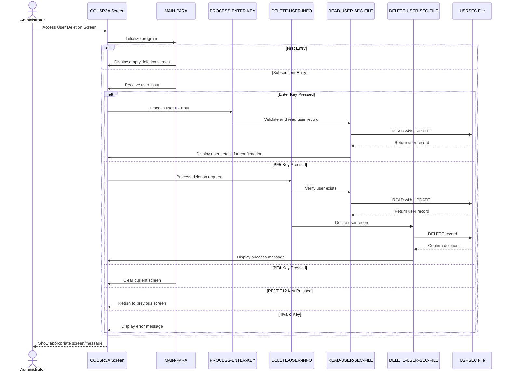

# COUSR03C

## Overview
This program (COUSR03C) is part of the CardDemo application and handles the deletion of user records from the USRSEC file in a CICS environment. The program displays a screen where administrators can enter a user ID, view the associated user details, and then delete the user record if desired. The program includes functionality to validate input, display user information before deletion, and provide appropriate feedback messages. It features navigation capabilities to return to previous screens and integrates with other modules in the CardDemo application through a common communication area. Error handling is implemented for various scenarios such as empty user ID fields, non-existent user records, and file access issues.

## Metadata
**Program ID**: `COUSR03C`

**Author**: `AWS`

## Sequence Diagram


## Referenced Copybooks
- [`CSDAT01Y`](copybooks/CSDAT01Y.md)
- `DFHAID`
- [`CSUSR01Y`](copybooks/CSUSR01Y.md)
- [`COCOM01Y`](copybooks/COCOM01Y.md)
- `COUSR03`
- `DFHBMSCA`
- [`COTTL01Y`](copybooks/COTTL01Y.md)
- [`CSMSG01Y`](copybooks/CSMSG01Y.md)

## Environment Division

### CONFIGURATION SECTION
This environment section is empty, indicating that the program COUSR03C does not define any special configuration settings, file assignments, or system dependencies in its CONFIGURATION SECTION. The program likely relies on standard environment settings or configurations defined elsewhere in the CardDemo application.
<details><summary>Code</summary>
```cobol

```
</details>


## Data Division

### WORKING-STORAGE SECTION
This Working Storage Section defines the key variables and data structures used in the COUSR03C program for user record deletion. It includes program identifiers, status flags, and error handling variables. The section contains a WS-VARIABLES group with fields for program name, transaction ID, message storage, file name reference to USRSEC, error flags with condition names, response codes, and a modification tracking flag. The section incorporates several copybooks: COCOM01Y (with a custom extension for CU03-specific information including user ID ranges and pagination controls), COUSR03 (likely containing the map definition for the user deletion screen), and various utility copybooks for titles (COTTL01Y), dates (CSDAT01Y), messages (CSMSG01Y), and user information (CSUSR01Y). Standard CICS copybooks DFHAID and DFHBMSCA are included for attention identifier and BMS attribute definitions. This structure supports the program's functionality of displaying, validating, and deleting user records.
<details><summary>Code</summary>
```cobol
01 WS-VARIABLES.
         05 WS-PGMNAME                 PIC X(08) VALUE 'COUSR03C'.
         05 WS-TRANID                  PIC X(04) VALUE 'CU03'.
         05 WS-MESSAGE                 PIC X(80) VALUE SPACES.
         05 WS-USRSEC-FILE             PIC X(08) VALUE 'USRSEC  '.
         05 WS-ERR-FLG                 PIC X(01) VALUE 'N'.
           88 ERR-FLG-ON                         VALUE 'Y'.
           88 ERR-FLG-OFF                        VALUE 'N'.
         05 WS-RESP-CD                 PIC S9(09) COMP VALUE ZEROS.
         05 WS-REAS-CD                 PIC S9(09) COMP VALUE ZEROS.
         05 WS-USR-MODIFIED            PIC X(01) VALUE 'N'.
           88 USR-MODIFIED-YES                   VALUE 'Y'.
           88 USR-MODIFIED-NO                    VALUE 'N'.
           
       COPY COCOM01Y.
          05 CDEMO-CU03-INFO.
             10 CDEMO-CU03-USRID-FIRST     PIC X(08).
             10 CDEMO-CU03-USRID-LAST      PIC X(08).
             10 CDEMO-CU03-PAGE-NUM        PIC 9(08).
             10 CDEMO-CU03-NEXT-PAGE-FLG   PIC X(01) VALUE 'N'.
                88 NEXT-PAGE-YES                     VALUE 'Y'.
                88 NEXT-PAGE-NO                      VALUE 'N'.
             10 CDEMO-CU03-USR-SEL-FLG     PIC X(01).
             10 CDEMO-CU03-USR-SELECTED    PIC X(08).

       COPY COUSR03.

       COPY COTTL01Y.
       COPY CSDAT01Y.
       COPY CSMSG01Y.
       COPY CSUSR01Y.

       COPY DFHAID.
       COPY DFHBMSCA.

      *----------------------------------------------------------------*
      *                        LINKAGE SECTION
      *----------------------------------------------------------------*
```
</details>


### LINKAGE SECTION
This section defines the linkage area for CICS communication in the user deletion program. It declares a standard DFHCOMMAREA with a variable-length field (LK-COMMAREA) that can accommodate data of different sizes based on the actual length passed to the program (EIBCALEN). This flexible structure allows the program to receive and process communication data from calling programs within the CardDemo application.
<details><summary>Code</summary>
```cobol
01  DFHCOMMAREA.
         05  LK-COMMAREA                           PIC X(01)
             OCCURS 1 TO 32767 TIMES DEPENDING ON EIBCALEN.

      *----------------------------------------------------------------*
      *
```
</details>


## Procedure Division

### MAIN-PARA
This paragraph serves as the main control flow for the COUSR03C program, handling user interface navigation and function key processing. It first initializes error flags and message fields, then checks if the program was called with a communication area. If not, it returns to the sign-on program. When processing a valid communication area, it either initializes the delete user screen (for first entry) or processes user input based on the function key pressed. The paragraph handles multiple navigation paths: Enter key to process input, PF3/PF12 to return to previous screens, PF4 to clear the screen, and PF5 to delete the user record. It maintains program state through the CARDDEMO-COMMAREA and provides appropriate error messages for invalid key presses. The paragraph concludes by returning control to CICS with the transaction ID and updated communication area.
<details><summary>Code</summary>
```cobol
SET ERR-FLG-OFF     TO TRUE
           SET USR-MODIFIED-NO TO TRUE

           MOVE SPACES TO WS-MESSAGE
                          ERRMSGO OF COUSR3AO

           IF EIBCALEN = 0
               MOVE 'COSGN00C' TO CDEMO-TO-PROGRAM
               PERFORM RETURN-TO-PREV-SCREEN
           ELSE
               MOVE DFHCOMMAREA(1:EIBCALEN) TO CARDDEMO-COMMAREA
               IF NOT CDEMO-PGM-REENTER
                   SET CDEMO-PGM-REENTER    TO TRUE
                   MOVE LOW-VALUES          TO COUSR3AO
                   MOVE -1       TO USRIDINL OF COUSR3AI
                   IF CDEMO-CU03-USR-SELECTED NOT =
                                              SPACES AND LOW-VALUES
                       MOVE CDEMO-CU03-USR-SELECTED TO
                            USRIDINI OF COUSR3AI
                       PERFORM PROCESS-ENTER-KEY
                   END-IF
                   PERFORM SEND-USRDEL-SCREEN
               ELSE
                   PERFORM RECEIVE-USRDEL-SCREEN
                   EVALUATE EIBAID
                       WHEN DFHENTER
                           PERFORM PROCESS-ENTER-KEY
                       WHEN DFHPF3
                           IF CDEMO-FROM-PROGRAM = SPACES OR LOW-VALUES
                               MOVE 'COADM01C' TO CDEMO-TO-PROGRAM
                           ELSE
                               MOVE CDEMO-FROM-PROGRAM TO
                               CDEMO-TO-PROGRAM
                           END-IF
                           PERFORM RETURN-TO-PREV-SCREEN
                       WHEN DFHPF4
                           PERFORM CLEAR-CURRENT-SCREEN
                       WHEN DFHPF5
                           PERFORM DELETE-USER-INFO
                       WHEN DFHPF12
                           MOVE 'COADM01C' TO CDEMO-TO-PROGRAM
                           PERFORM RETURN-TO-PREV-SCREEN
                       WHEN OTHER
                           MOVE 'Y'                       TO WS-ERR-FLG
                           MOVE CCDA-MSG-INVALID-KEY      TO WS-MESSAGE
                           PERFORM SEND-USRDEL-SCREEN
                   END-EVALUATE
               END-IF
           END-IF

           EXEC CICS RETURN
                     TRANSID (WS-TRANID)
                     COMMAREA (CARDDEMO-COMMAREA)
           END-EXEC.

      *----------------------------------------------------------------*
      *                      PROCESS-ENTER-KEY
      *----------------------------------------------------------------*
```
</details>


### PROCESS-ENTER-KEY
This paragraph processes the Enter key action when a user is attempting to delete a user record. It first validates that the user ID field is not empty, displaying an error message and repositioning the cursor if it is. If the user ID is valid, it clears the name and user type fields on the screen, then attempts to read the corresponding user record from the USRSEC file by calling the READ-USER-SEC-FILE paragraph. If the record is found successfully (no error flag set), it populates the screen fields with the user's first name, last name, and user type from the retrieved record, then redisplays the screen with this information so the administrator can confirm the deletion. The paragraph implements a validation-retrieval-display workflow that prepares for the actual deletion operation that would follow.
<details><summary>Code</summary>
```cobol
EVALUATE TRUE
               WHEN USRIDINI OF COUSR3AI = SPACES OR LOW-VALUES
                   MOVE 'Y'     TO WS-ERR-FLG
                   MOVE 'User ID can NOT be empty...' TO
                                   WS-MESSAGE
                   MOVE -1       TO USRIDINL OF COUSR3AI
                   PERFORM SEND-USRDEL-SCREEN
               WHEN OTHER
                   MOVE -1       TO USRIDINL OF COUSR3AI
                   CONTINUE
           END-EVALUATE

           IF NOT ERR-FLG-ON
               MOVE SPACES      TO FNAMEI   OF COUSR3AI
                                   LNAMEI   OF COUSR3AI
                                   USRTYPEI OF COUSR3AI
               MOVE USRIDINI  OF COUSR3AI TO SEC-USR-ID
               PERFORM READ-USER-SEC-FILE
           END-IF.

           IF NOT ERR-FLG-ON
               MOVE SEC-USR-FNAME      TO FNAMEI    OF COUSR3AI
               MOVE SEC-USR-LNAME      TO LNAMEI    OF COUSR3AI
               MOVE SEC-USR-TYPE       TO USRTYPEI  OF COUSR3AI
               PERFORM SEND-USRDEL-SCREEN
           END-IF.

      *----------------------------------------------------------------*
      *                      DELETE-USER-INFO
      *----------------------------------------------------------------*
```
</details>


### DELETE-USER-INFO
This paragraph handles the user deletion process by first validating that the user ID field is not empty. If the field is empty, it sets an error flag, displays an appropriate error message, positions the cursor at the user ID field, and redisplays the user deletion screen. If the user ID is provided, the paragraph positions the cursor at the user ID field and continues processing. When no validation errors are detected, it copies the entered user ID to the security file record key field (SEC-USR-ID), then performs two operations in sequence: first reading the user security file to verify the record exists, and then deleting the user record from the security file. This paragraph implements the core business logic for the user deletion functionality, ensuring proper validation before performing the deletion operation.
<details><summary>Code</summary>
```cobol
EVALUATE TRUE
               WHEN USRIDINI OF COUSR3AI = SPACES OR LOW-VALUES
                   MOVE 'Y'     TO WS-ERR-FLG
                   MOVE 'User ID can NOT be empty...' TO
                                   WS-MESSAGE
                   MOVE -1       TO USRIDINL OF COUSR3AI
                   PERFORM SEND-USRDEL-SCREEN
               WHEN OTHER
                   MOVE -1       TO USRIDINL OF COUSR3AI
                   CONTINUE
           END-EVALUATE

           IF NOT ERR-FLG-ON
               MOVE USRIDINI  OF COUSR3AI TO SEC-USR-ID
               PERFORM READ-USER-SEC-FILE
               PERFORM DELETE-USER-SEC-FILE
           END-IF.

      *----------------------------------------------------------------*
      *                      RETURN-TO-PREV-SCREEN
      *----------------------------------------------------------------*
```
</details>


### RETURN-TO-PREV-SCREEN
This paragraph handles the navigation back to a previous screen in the CardDemo application. It first checks if the target program is specified in the communication area, and if not, defaults to 'COSGN00C' (likely the main menu or sign-on screen). It then updates the communication area with the current transaction ID and program name as the source of the transfer, and resets the program context to zeros. Finally, it executes a CICS XCTL command to transfer control to the target program while passing the updated communication area. This provides a consistent navigation mechanism throughout the application while maintaining context between program calls.
<details><summary>Code</summary>
```cobol
IF CDEMO-TO-PROGRAM = LOW-VALUES OR SPACES
               MOVE 'COSGN00C' TO CDEMO-TO-PROGRAM
           END-IF
           MOVE WS-TRANID    TO CDEMO-FROM-TRANID
           MOVE WS-PGMNAME   TO CDEMO-FROM-PROGRAM
           MOVE ZEROS        TO CDEMO-PGM-CONTEXT
           EXEC CICS
               XCTL PROGRAM(CDEMO-TO-PROGRAM)
               COMMAREA(CARDDEMO-COMMAREA)
           END-EXEC.

      *----------------------------------------------------------------*
      *                      SEND-USRDEL-SCREEN
      *----------------------------------------------------------------*
```
</details>


### SEND-USRDEL-SCREEN
This paragraph displays the user deletion screen to the administrator. It first calls the POPULATE-HEADER-INFO paragraph to set up common header information, then transfers any system messages from the working storage to the output map's error message field. The paragraph then uses the CICS SEND command to display the COUSR3A map (from the COUSR03 mapset) to the user, clearing the screen (ERASE) and positioning the cursor appropriately for input. This is a key interaction point in the user deletion workflow, presenting the interface where administrators can view and confirm user deletion operations.
<details><summary>Code</summary>
```cobol
PERFORM POPULATE-HEADER-INFO

           MOVE WS-MESSAGE TO ERRMSGO OF COUSR3AO

           EXEC CICS SEND
                     MAP('COUSR3A')
                     MAPSET('COUSR03')
                     FROM(COUSR3AO)
                     ERASE
                     CURSOR
           END-EXEC.

      *----------------------------------------------------------------*
      *                      RECEIVE-USRDEL-SCREEN
      *----------------------------------------------------------------*
```
</details>


### RECEIVE-USRDEL-SCREEN
This paragraph receives input data from the COUSR3A map within the COUSR03 mapset in a CICS environment. The received data is stored in the COUSR3AI structure, which likely contains user information for the deletion process. The response and reason codes are captured in WS-RESP-CD and WS-REAS-CD respectively for error handling. This is the initial step in processing the user deletion screen where administrator input is captured before validation and processing.
<details><summary>Code</summary>
```cobol
EXEC CICS RECEIVE
                     MAP('COUSR3A')
                     MAPSET('COUSR03')
                     INTO(COUSR3AI)
                     RESP(WS-RESP-CD)
                     RESP2(WS-REAS-CD)
           END-EXEC.

      *----------------------------------------------------------------*
      *                      POPULATE-HEADER-INFO
      *----------------------------------------------------------------*
```
</details>


### POPULATE-HEADER-INFO
This paragraph populates the header information on the COUSR3A screen. It retrieves the current date and time using the CURRENT-DATE function, then formats and displays this information along with application titles, transaction ID, and program name in the screen header fields. The date is formatted as MM/DD/YY and the time as HH:MM:SS before being moved to their respective output fields on the screen.
<details><summary>Code</summary>
```cobol
MOVE FUNCTION CURRENT-DATE  TO WS-CURDATE-DATA

           MOVE CCDA-TITLE01           TO TITLE01O OF COUSR3AO
           MOVE CCDA-TITLE02           TO TITLE02O OF COUSR3AO
           MOVE WS-TRANID              TO TRNNAMEO OF COUSR3AO
           MOVE WS-PGMNAME             TO PGMNAMEO OF COUSR3AO

           MOVE WS-CURDATE-MONTH       TO WS-CURDATE-MM
           MOVE WS-CURDATE-DAY         TO WS-CURDATE-DD
           MOVE WS-CURDATE-YEAR(3:2)   TO WS-CURDATE-YY

           MOVE WS-CURDATE-MM-DD-YY    TO CURDATEO OF COUSR3AO

           MOVE WS-CURTIME-HOURS       TO WS-CURTIME-HH
           MOVE WS-CURTIME-MINUTE      TO WS-CURTIME-MM
           MOVE WS-CURTIME-SECOND      TO WS-CURTIME-SS

           MOVE WS-CURTIME-HH-MM-SS    TO CURTIMEO OF COUSR3AO.

      *----------------------------------------------------------------*
      *                      READ-USER-SEC-FILE
      *----------------------------------------------------------------*
```
</details>


### READ-USER-SEC-FILE
This paragraph reads a user record from the USRSEC file in preparation for deletion. It performs a CICS READ operation with UPDATE mode to lock the record for subsequent deletion. The paragraph handles three possible outcomes: 1) If the record is found (NORMAL response), it displays a message prompting the user to press PF5 to confirm deletion; 2) If the record is not found (NOTFND response), it sets an error flag, displays a "User ID NOT found" message, and positions the cursor at the user ID input field; 3) For any other response codes, it logs the error details, sets an error flag, displays a generic error message, and positions the cursor at the first name field. In all cases, it calls the SEND-USRDEL-SCREEN paragraph to display the appropriate screen with feedback to the user.
<details><summary>Code</summary>
```cobol
EXEC CICS READ
                DATASET   (WS-USRSEC-FILE)
                INTO      (SEC-USER-DATA)
                LENGTH    (LENGTH OF SEC-USER-DATA)
                RIDFLD    (SEC-USR-ID)
                KEYLENGTH (LENGTH OF SEC-USR-ID)
                UPDATE
                RESP      (WS-RESP-CD)
                RESP2     (WS-REAS-CD)
           END-EXEC.

           EVALUATE WS-RESP-CD
               WHEN DFHRESP(NORMAL)
                   CONTINUE
                   MOVE 'Press PF5 key to delete this user ...' TO
                                   WS-MESSAGE
                   MOVE DFHNEUTR       TO ERRMSGC  OF COUSR3AO
                   PERFORM SEND-USRDEL-SCREEN
               WHEN DFHRESP(NOTFND)
                   MOVE 'Y'     TO WS-ERR-FLG
                   MOVE 'User ID NOT found...' TO
                                   WS-MESSAGE
                   MOVE -1       TO USRIDINL OF COUSR3AI
                   PERFORM SEND-USRDEL-SCREEN
               WHEN OTHER
                   DISPLAY 'RESP:' WS-RESP-CD 'REAS:' WS-REAS-CD
                   MOVE 'Y'     TO WS-ERR-FLG
                   MOVE 'Unable to lookup User...' TO
                                   WS-MESSAGE
                   MOVE -1       TO FNAMEL OF COUSR3AI
                   PERFORM SEND-USRDEL-SCREEN
           END-EVALUATE.

      *----------------------------------------------------------------*
      *                      DELETE-USER-SEC-FILE
      *----------------------------------------------------------------*
```
</details>


### DELETE-USER-SEC-FILE
This paragraph handles the deletion of a user record from the USRSEC file and processes the response. It first executes a CICS DELETE command targeting the user security file. Based on the response code received, it takes one of three actions: 1) If successful, it initializes all fields, constructs a success message including the deleted user ID, and displays the updated screen with green text; 2) If the record is not found, it sets an error flag, displays an appropriate error message, and positions the cursor at the user ID input field; 3) For any other response, it logs the error codes to the console, sets an error flag, displays a generic error message, and positions the cursor at the first name field. In all cases, it calls the SEND-USRDEL-SCREEN paragraph to refresh the display with the appropriate feedback message.
<details><summary>Code</summary>
```cobol
EXEC CICS DELETE
                DATASET   (WS-USRSEC-FILE)
                RESP      (WS-RESP-CD)
                RESP2     (WS-REAS-CD)
           END-EXEC.

           EVALUATE WS-RESP-CD
               WHEN DFHRESP(NORMAL)
                   PERFORM INITIALIZE-ALL-FIELDS
                   MOVE SPACES             TO WS-MESSAGE
                   MOVE DFHGREEN           TO ERRMSGC  OF COUSR3AO
                   STRING 'User '     DELIMITED BY SIZE
                          SEC-USR-ID  DELIMITED BY SPACE
                          ' has been deleted ...' DELIMITED BY SIZE
                     INTO WS-MESSAGE
                   PERFORM SEND-USRDEL-SCREEN
               WHEN DFHRESP(NOTFND)
                   MOVE 'Y'     TO WS-ERR-FLG
                   MOVE 'User ID NOT found...' TO
                                   WS-MESSAGE
                   MOVE -1       TO USRIDINL OF COUSR3AI
                   PERFORM SEND-USRDEL-SCREEN
               WHEN OTHER
                   DISPLAY 'RESP:' WS-RESP-CD 'REAS:' WS-REAS-CD
                   MOVE 'Y'     TO WS-ERR-FLG
                   MOVE 'Unable to Update User...' TO
                                   WS-MESSAGE
                   MOVE -1       TO FNAMEL OF COUSR3AI
                   PERFORM SEND-USRDEL-SCREEN
           END-EVALUATE.

      *----------------------------------------------------------------*
      *                      CLEAR-CURRENT-SCREEN
      *----------------------------------------------------------------*
```
</details>


### CLEAR-CURRENT-SCREEN
This paragraph clears the current screen by first initializing all fields to their default values and then redisplaying the user deletion screen. It provides a way to reset the interface when needed, allowing the user to start fresh with a clean form.
<details><summary>Code</summary>
```cobol
PERFORM INITIALIZE-ALL-FIELDS.
           PERFORM SEND-USRDEL-SCREEN.

      *----------------------------------------------------------------*
      *                      INITIALIZE-ALL-FIELDS
      *----------------------------------------------------------------*
```
</details>


### INITIALIZE-ALL-FIELDS
This paragraph initializes the input fields on the user deletion screen. It sets the cursor position to the user ID input field by moving -1 to USRIDINL, and clears all display fields by setting them to spaces, including the user ID input field, first name, last name, and user type fields. This ensures the screen is properly reset before displaying it to the user, providing a clean interface for the user deletion operation.
<details><summary>Code</summary>
```cobol
MOVE -1              TO USRIDINL OF COUSR3AI
           MOVE SPACES          TO USRIDINI OF COUSR3AI
                                   FNAMEI   OF COUSR3AI
                                   LNAMEI   OF COUSR3AI
                                   USRTYPEI OF COUSR3AI
```
</details>


### WS-MESSAGE
This paragraph contains version control information for the COUSR03C program, showing the specific build version (CardDemo_v1.0-15-g27d6c6f-68) and the build timestamp (July 19, 2022 at 23:12:35 CDT). This information helps track which version of the code is deployed and when it was built.
<details><summary>Code</summary>
```cobol
*
      * Ver: CardDemo_v1.0-15-g27d6c6f-68 Date: 2022-07-19 23:12:35 CDT
      *
```
</details>
