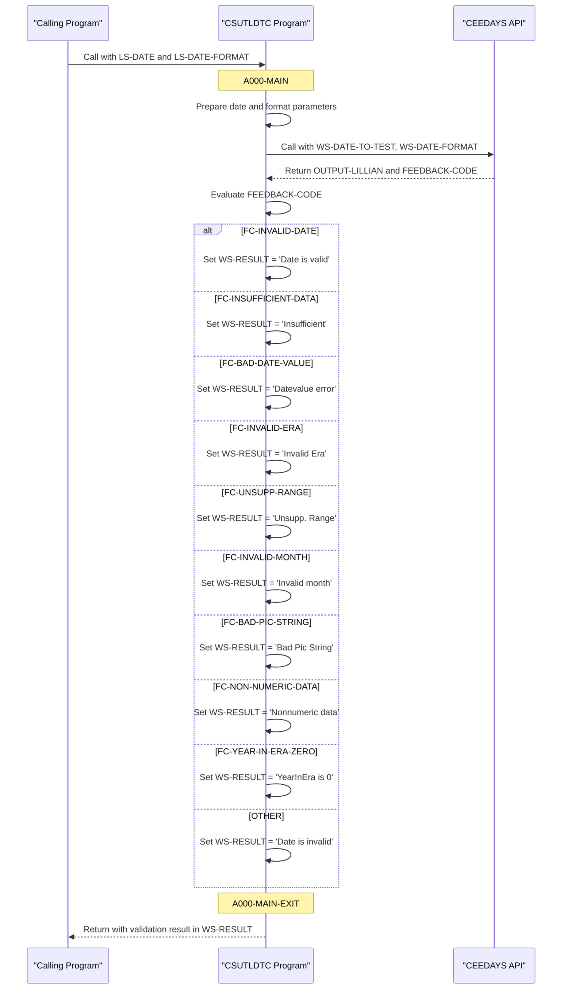

# CSUTLDTC

## Overview
This program serves as a utility for date validation in the CardDemo application. It leverages the IBM Language Environment CEEDAYS API to validate dates against specified formats. The program accepts an input date string and format pattern, then returns a detailed validation result. It handles various date validation errors, including invalid date values, format mismatches, range issues, and non-numeric data. The program communicates results through a structured message that includes severity codes, message numbers, and descriptive text about the validation outcome. This utility is likely used throughout the CardDemo application to ensure date inputs meet required formats before processing transactions or updates.

## Metadata
**Program ID**: `CSUTLDTC`

## Sequence Diagram


## Data Division

### WORKING-STORAGE SECTION
This data section defines the structures used for date validation through the IBM Language Environment CEEDAYS API. It contains three main components: WS-DATE-TO-TEST for storing the input date string, WS-DATE-FORMAT for the format pattern, and OUTPUT-LILLIAN for the converted Lilian date value. The WS-MESSAGE structure stores validation results including severity codes, message numbers, and descriptive text about the validation outcome. The FEEDBACK-CODE structure captures detailed error information from the CEEDAYS API, with condition indicators (88-level items) for specific validation failures such as invalid dates, insufficient data, range issues, and non-numeric data. These structures enable the program to process date inputs and provide meaningful validation results to the calling programs within the CardDemo application.
<details><summary>Code</summary>
```cobol
****  Date passed to CEEDAYS API                                          
         01 WS-DATE-TO-TEST.                                                    
              02  Vstring-length      PIC S9(4) BINARY.                         
              02  Vstring-text.                                                 
                  03  Vstring-char    PIC X                                     
                              OCCURS 0 TO 256 TIMES                             
                              DEPENDING ON Vstring-length                       
                                 of WS-DATE-TO-TEST.                            
      ****  DATE FORMAT PASSED TO CEEDAYS API                                   
         01 WS-DATE-FORMAT.                                                     
              02  Vstring-length      PIC S9(4) BINARY.                         
              02  Vstring-text.                                                 
                  03  Vstring-char    PIC X                                     
                              OCCURS 0 TO 256 TIMES                             
                              DEPENDING ON Vstring-length                       
                                 of WS-DATE-FORMAT.                             
      ****  OUTPUT from CEEDAYS - LILLIAN DATE FORMAT                           
         01 OUTPUT-LILLIAN    PIC S9(9) USAGE IS BINARY.                        
         01 WS-MESSAGE.                                                         
              02 WS-SEVERITY  PIC X(04).                                        
              02 WS-SEVERITY-N REDEFINES WS-SEVERITY PIC 9(4).                  
              02 FILLER       PIC X(11) VALUE 'Mesg Code:'.                     
              02 WS-MSG-NO    PIC X(04).                                        
              02 WS-MSG-NO-N  REDEFINES WS-MSG-NO PIC 9(4).                     
              02 FILLER       PIC X(01) VALUE SPACE.                            
              02 WS-RESULT    PIC X(15).                                        
              02 FILLER       PIC X(01) VALUE SPACE.                            
              02 FILLER       PIC X(09) VALUE 'TstDate:'.                       
              02 WS-DATE      PIC X(10) VALUE SPACES.                           
              02 FILLER       PIC X(01) VALUE SPACE.                            
              02 FILLER       PIC X(10) VALUE 'Mask used:'.                     
              02 WS-DATE-FMT  PIC X(10).                                        
              02 FILLER       PIC X(01) VALUE SPACE.                            
              02 FILLER       PIC X(03) VALUE SPACES.                           
                                                                                
      * CEEDAYS API FEEDBACK CODE                                               
          01 FEEDBACK-CODE.                                                     
           02  FEEDBACK-TOKEN-VALUE. 
             88  FC-INVALID-DATE       VALUE X'0000000000000000'.
             88  FC-INSUFFICIENT-DATA  VALUE X'000309CB59C3C5C5'.
             88  FC-BAD-DATE-VALUE     VALUE X'000309CC59C3C5C5'.
             88  FC-INVALID-ERA        VALUE X'000309CD59C3C5C5'.
             88  FC-UNSUPP-RANGE       VALUE X'000309D159C3C5C5'.
             88  FC-INVALID-MONTH      VALUE X'000309D559C3C5C5'.
             88  FC-BAD-PIC-STRING     VALUE X'000309D659C3C5C5'.
             88  FC-NON-NUMERIC-DATA   VALUE X'000309D859C3C5C5'.
             88  FC-YEAR-IN-ERA-ZERO   VALUE X'000309D959C3C5C5'.
               03  CASE-1-CONDITION-ID.                                         
                   04  SEVERITY        PIC S9(4) BINARY.                        
                   04  MSG-NO          PIC S9(4) BINARY.                        
               03  CASE-2-CONDITION-ID                                          
                         REDEFINES CASE-1-CONDITION-ID.                         
                   04  CLASS-CODE      PIC S9(4) BINARY.                        
                   04  CAUSE-CODE      PIC S9(4) BINARY.                        
               03  CASE-SEV-CTL    PIC X.                                       
               03  FACILITY-ID     PIC XXX.                                     
           02  I-S-INFO        PIC S9(9) BINARY.
```
</details>


### LINKAGE SECTION
This linkage section defines the interface parameters for the date validation utility. It contains three fields: LS-DATE which holds the input date string (up to 10 characters), LS-DATE-FORMAT which specifies the expected format pattern for validation (up to 10 characters), and LS-RESULT which stores the validation outcome message (up to 80 characters) that will be returned to the calling program.
<details><summary>Code</summary>
```cobol
01 LS-DATE         PIC X(10).                                         
          01 LS-DATE-FORMAT  PIC X(10).                                         
          01 LS-RESULT       PIC X(80).
```
</details>


## Procedure Division

### A000-MAIN
This paragraph handles the core date validation logic by preparing input parameters, calling the IBM CEEDAYS API, and interpreting the validation results. It first moves the input date and format pattern into working storage variables with proper length specifications. After calling CEEDAYS with these parameters, it evaluates the returned feedback code to determine the validation status. The paragraph translates technical feedback codes into human-readable messages that describe specific validation issues such as invalid date values, format mismatches, unsupported ranges, or non-numeric data. The result is stored in WS-RESULT, which will be used by the calling program to communicate the validation outcome to users or other processes.
<details><summary>Code</summary>
```cobol
MOVE LENGTH OF LS-DATE                                               
                        TO VSTRING-LENGTH  OF WS-DATE-TO-TEST                   
           MOVE LS-DATE TO VSTRING-TEXT    OF WS-DATE-TO-TEST
                           WS-DATE                  
           MOVE LENGTH OF LS-DATE-FORMAT                                        
                         TO VSTRING-LENGTH OF WS-DATE-FORMAT                    
           MOVE LS-DATE-FORMAT                                                  
                         TO VSTRING-TEXT   OF WS-DATE-FORMAT   
                            WS-DATE-FMT  
           MOVE 0        TO OUTPUT-LILLIAN                              
                                                                        
           CALL "CEEDAYS" USING                                                 
                  WS-DATE-TO-TEST,                                              
                  WS-DATE-FORMAT,                                               
                  OUTPUT-LILLIAN,                                               
                  FEEDBACK-CODE                                                 
                                                                                
           MOVE WS-DATE-TO-TEST            TO WS-DATE                           
           MOVE SEVERITY OF FEEDBACK-CODE  TO WS-SEVERITY-N                     
           MOVE MSG-NO OF FEEDBACK-CODE    TO WS-MSG-NO-N                       
                                                                 
      *    WS-RESULT IS 15 CHARACTERS                                           
      *                123456789012345'                                         
           EVALUATE TRUE                                                        
              WHEN FC-INVALID-DATE                                   
                 MOVE 'Date is valid'      TO WS-RESULT              
              WHEN FC-INSUFFICIENT-DATA                              
                 MOVE 'Insufficient'       TO WS-RESULT              
              WHEN FC-BAD-DATE-VALUE                                 
                 MOVE 'Datevalue error'    TO WS-RESULT              
              WHEN FC-INVALID-ERA                                    
                 MOVE 'Invalid Era    '    TO WS-RESULT              
              WHEN FC-UNSUPP-RANGE                                   
                 MOVE 'Unsupp. Range  '    TO WS-RESULT              
              WHEN FC-INVALID-MONTH                                  
                 MOVE 'Invalid month  '    TO WS-RESULT              
              WHEN FC-BAD-PIC-STRING                                 
                 MOVE 'Bad Pic String '    TO WS-RESULT              
              WHEN FC-NON-NUMERIC-DATA                               
                 MOVE 'Nonnumeric data'    TO WS-RESULT              
              WHEN FC-YEAR-IN-ERA-ZERO                               
                 MOVE 'YearInEra is 0 '    TO WS-RESULT              
              WHEN OTHER                                             
                 MOVE 'Date is invalid'    TO WS-RESULT 
           END-EVALUATE                                                         
                                                                                
           .
```
</details>


### A000-MAIN-EXIT
This paragraph serves as the exit point for the CSUTLDTC program. It marks the end of program execution with a standard EXIT statement. The paragraph includes version control information showing that this code is part of CardDemo version 1.0-15-g27d6c6f-68, with the last update made on July 19, 2022.
<details><summary>Code</summary>
```cobol
EXIT                                                                 
           .                                                                    
      *
      * Ver: CardDemo_v1.0-15-g27d6c6f-68 Date: 2022-07-19 23:12:35 CDT
      *
```
</details>
