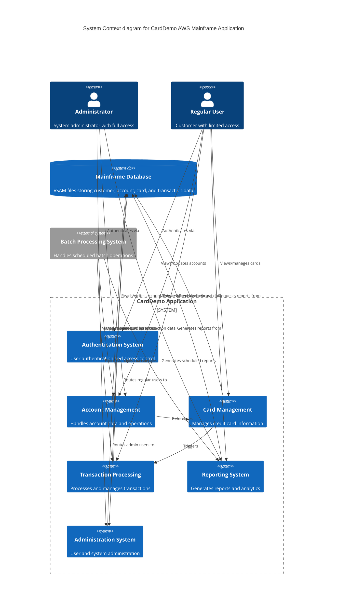

## High-Level Architecture

The CardDemo application is a traditional mainframe application designed to showcase AWS and partner technologies for mainframe migration and modernization. It follows a classic layered architecture typical of mainframe systems, with clear separation between online (CICS) and batch processing components. The system implements a transaction-oriented design pattern with centralized data access through VSAM files.

### Core Components

- **User Interface Layer**: 
  - Sign-on and Menu Systems: COSGN00C (sign-on handler), COMEN01C (regular user menu), COADM01C (admin menu)
  - Screen-based interfaces for various business functions with standardized navigation patterns

- **Business Logic Layer**:
  - Account Management: COACTVWC (view accounts), COACTUPC (update accounts)
  - Card Management: COCRDLIC (list cards), COCRDSLC (view card details), COCRDUPC (update card details)
  - Transaction Management: COTRN00C (list transactions), COTRN01C (view transactions), COTRN02C (add transactions)
  - Bill Payment: COBIL00C (online bill payment)
  - Report Generation: CORPT00C (report submission interface)

- **User Administration Module**:
  - User Management: COUSR00C (list users), COUSR01C (add users), COUSR02C (update users), COUSR03C (delete users)
  - Role-based access control (admin vs. regular users)

- **Batch Processing Layer**:
  - Account Processing: CBACT01C, CBACT02C, CBACT03C, CBACT04C (interest calculation)
  - Transaction Processing: CBTRN01C (transaction validation), CBTRN02C (transaction posting), CBTRN03C (transaction reporting)
  - Customer Data Processing: CBCUS01C

- **Utility Services**:
  - Date Validation: CSUTLDTC (leverages IBM Language Environment for date validation)

### Component Relationships

- **Data Flow**:
  1. Users authenticate through COSGN00C
  2. Based on user type, they are directed to either COMEN01C (regular) or COADM01C (admin)
  3. Users navigate to specific business functions through menu options
  4. Business logic components interact with data files and return results to the user interface
  5. Batch processes run independently to process transactions, calculate interest, and generate reports

- **Communication Patterns**:
  - Online components use CICS COMMAREA for state management between screens
  - Programs transfer control to each other using CICS XCTL commands
  - Batch job submission from online components via transient data queues (TDQ)
  - Standardized error handling and status code processing across components

- **Dependencies**:
  - Menu systems (COMEN01C, COADM01C) depend on authentication from COSGN00C
  - Transaction viewing (COTRN01C) depends on transaction listing (COTRN00C)
  - Card detail screens (COCRDSLC, COCRDUPC) depend on card listing (COCRDLIC)
  - User management functions (COUSR02C, COUSR03C) depend on user listing (COUSR00C)
  - Report generation (CORPT00C) submits batch jobs that depend on transaction data

### External Dependencies

- **Data Storage**:
  - VSAM Files:
    - CUSTDAT/CUSTFILE: Customer information
    - ACCTDAT/ACCTFILE: Account information
    - CARDDAT/CARDFILE: Credit card information
    - TRANSACT: Transaction records
    - USRSEC: User security profiles
    - CXACAIX/XREFFILE: Cross-reference data for accounts and cards
    - Transaction type and category reference files

- **Runtime Environment**:
  - CICS Transaction Server for online components
  - Batch processing environment for scheduled and on-demand jobs
  - IBM Language Environment (for date validation via CEEDAYS API)

- **Integration Points**:
  - Internal reader for job submission (via "JOBS" TDQ)
  - Potential integration with external payment systems (implied by COBIL00C)

### Technical Constraints

- **Platform Requirements**:
  - Traditional mainframe environment (likely z/OS)
  - COBOL programming language
  - CICS for online transaction processing
  - VSAM for data storage
  - JCL for batch job control

- **Performance Considerations**:
  - Pagination implemented for large data sets (COTRN00C, COUSR00C, COCRDLIC)
  - Optimized file access patterns with indexed VSAM files
  - Batch processing for resource-intensive operations

- **Security Requirements**:
  - Role-based access control (admin vs. regular users)
  - User authentication through sign-on process
  - Function-level authorization (preventing regular users from accessing admin functions)

- **Scalability Considerations**:
  - Batch processing for high-volume operations
  - Separation of online and batch components to manage system load
  - Transaction-oriented design for consistent processing

The CardDemo application represents a comprehensive demonstration of typical mainframe financial application patterns, with clear separation of concerns between user interface, business logic, and data access components. Its modular design facilitates the showcasing of various migration and modernization approaches when moving to AWS environments.

## Architecture Diagram

