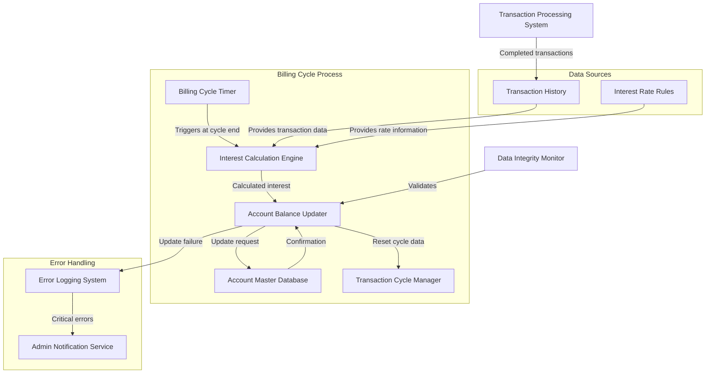

# Account Balance Update with Interest Charges

## User Story
_As a credit card account manager, I want the system to automatically update account balances with calculated interest charges at the end of each billing cycle, so that customers are billed accurately for their outstanding balances and interest._

## Acceptance Criteria
1. GIVEN an account with calculated interest charges WHEN the billing cycle ends THEN the system should add the total interest to the current balance and update the account master record
2. GIVEN an account with transactions in the current cycle WHEN the balance update process completes THEN the cycle credits and debits should be reset to zero for the next billing cycle
3. GIVEN an account master record update WHEN a file operation failure occurs THEN the system should log the error and notify administrators without corrupting the account data
4. System should maintain data integrity by ensuring all interest calculations are completed before updating account balances
5. Feature must only update accounts after all transaction categories have been processed for accurate balance calculation

## Test Scenarios
1. Verify that an account's balance correctly reflects the addition of calculated interest charges after the update process runs
2. Confirm that cycle credits and debits are reset to zero after a successful account balance update
3. Validate that the account master file contains the updated balance information after the process completes
4. Verify that appropriate error messages are generated when file operations fail during the account update process
5. Confirm the system handles accounts with zero interest charges correctly
6. Validate that the process correctly handles accounts with maximum allowed balance values without overflow errors
7. Verify that the account update process maintains data consistency when interrupted and restarted

## Diagram

## Subtasks
### Account Balance Update
This subtask updates account master records with new balances that include the calculated interest charges. After processing all transaction categories for an account, the program adds the total calculated interest to the account's current balance and resets the cycle credits and debits to zero. The updated account record is then written back to the account master file. This ensures that account balances accurately reflect all interest charges before the next billing cycle. Error handling includes specific checks for file operation failures during the rewrite operation. This subtask depends on the successful completion of the interest calculation process and requires access to the account master file with update privileges.
#### References
- [CBACT04C](/CBACT04C.md)