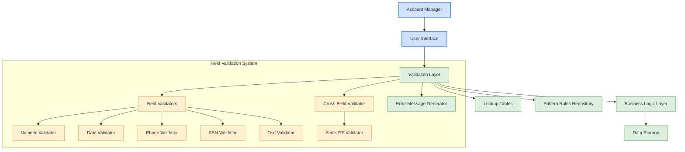

# Account Data Field-Level Validation

## User Story
_As an account manager, I want comprehensive field-level validation for all account and customer data elements, so that I can ensure data quality and prevent errors before they enter the system._

## Acceptance Criteria
1. GIVEN I am entering account or customer data WHEN I input an invalid value for any field THEN I should receive an immediate specific error message for that field
2. GIVEN I am entering currency amounts WHEN I input values THEN they must be validated as numeric with proper decimal places
3. GIVEN I am entering dates WHEN I input values THEN they must be validated in CCYYMMDD format with appropriate range checks (months 1-12, etc.)
4. GIVEN I am entering phone numbers WHEN I input values THEN they must be validated against North American format with valid area codes
5. GIVEN I am entering SSNs WHEN I input values THEN they must follow proper format and reject invalid patterns (000, 666, 900-999)
6. GIVEN I am entering names and addresses WHEN I input values THEN they must be validated to contain appropriate character types
7. GIVEN I am entering state and ZIP code information WHEN I input values THEN cross-field validation must ensure the combination is valid
8. System should provide specific error messages that clearly identify the validation issue for each field
9. Feature must implement validation using pattern matching, range checking, and lookup tables as appropriate for each field type

## Test Scenarios
1. Verify that currency validation rejects non-numeric values, values with incorrect decimal places, and extremely large values
2. Verify that date validation rejects dates with invalid months (e.g., 13), invalid days (e.g., February 30), and dates outside of acceptable ranges
3. Verify that phone number validation rejects numbers with invalid area codes, incorrect length, and non-numeric characters
4. Verify that SSN validation rejects numbers starting with 000, 666, or in the range 900-999, as well as invalid formats
5. Verify that name fields reject inappropriate special characters while allowing valid characters like hyphens and apostrophes
6. Verify that address validation allows appropriate special characters and rejects inappropriate ones
7. Verify that ZIP codes are validated against the corresponding state to ensure they are valid combinations
8. Confirm validation provides specific error messages that clearly identify the exact validation issue for each field type
9. Validate that all validation errors are displayed immediately after field entry or form submission as appropriate
10. Verify that valid data in all fields allows successful form submission without validation errors

## Diagram

## Subtasks
### Field-Level Validation
This subtask implements comprehensive field-level validation for all account and customer data elements. It includes validation for different data types: Currency amounts must be valid numeric values with proper decimal places; Dates must be in valid CCYYMMDD format with appropriate range checks (e.g., months 1-12); Phone numbers must follow North American format with valid area codes; SSNs must follow proper format and avoid invalid patterns (000, 666, 900-999); Names and addresses must contain appropriate character types. The component provides immediate feedback on validation errors with specific error messages for each field. For example, if a user enters an invalid credit limit, the message 'Credit Limit is not valid' is displayed. The validation includes cross-field validation, such as ensuring state and ZIP code combinations are valid. The component uses a combination of pattern matching, range checking, and lookup tables to implement these validations.
#### References
- [COACTUPC](/COACTUPC.md)