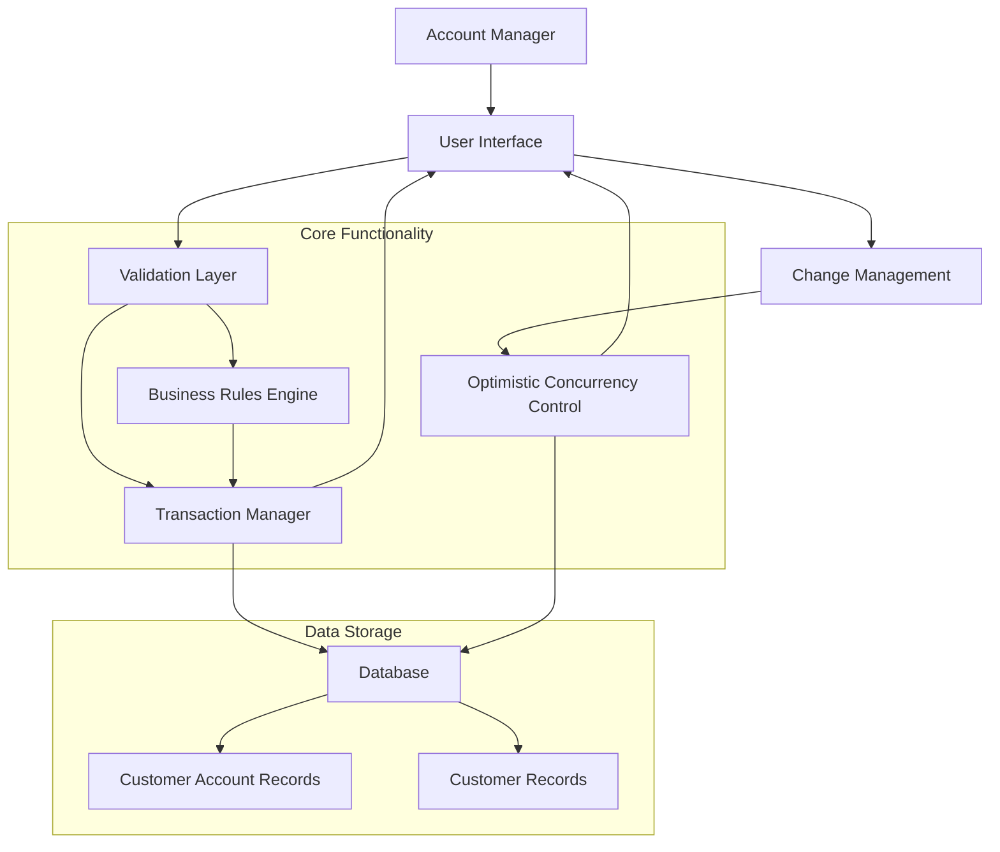

# Account Information Management

## User Story
_As an account manager, I want to update customer account information with proper validation and transaction management, so that I can maintain accurate and consistent account records while avoiding data conflicts._

## Acceptance Criteria
1. GIVEN I have accessed an existing customer account WHEN I modify account details (credit limits, balances, status) THEN the system should validate my inputs according to business rules before saving
2. GIVEN I have made changes to account information WHEN I submit the update THEN the system should detect if no actual changes were made and inform me without performing database operations
3. GIVEN I am updating account information WHEN another user has modified the same record before I submit my changes THEN the system should notify me of the conflict and prevent overwriting their changes
4. GIVEN I am updating account information WHEN I submit valid changes THEN both account and customer records should be updated together or neither should be updated if an error occurs
5. GIVEN I enter invalid data (incorrect credit limit format, invalid account status, invalid date format) WHEN I attempt to save THEN the system should display specific validation error messages
6. GIVEN I have successfully updated account information WHEN the transaction completes THEN I should receive confirmation that the update was successful

## Test Scenarios
1. Verify that credit limit validation accepts valid numeric values with 2 decimal places but rejects invalid formats
2. Verify that account status validation accepts only 'Y' or 'N' values
3. Verify that date fields accept only valid CCYYMMDD format
4. Confirm the system detects when no changes have been made and displays the appropriate message without updating the database
5. Validate that concurrent updates are handled correctly by detecting when another user has modified the record
6. Verify that both account and customer records are updated together in a single transaction
7. Confirm that if either account or customer update fails, both updates are rolled back
8. Test case-insensitive matching and trimming of spaces when detecting data changes
9. Verify appropriate error messages are displayed for different validation and database operation failures
10. Test the complete workflow from data retrieval, modification, validation, to final database update

## Diagram

## Subtasks
### Account Information Update
This subtask handles the updating of account information in the CardDemo system. It allows users to modify account details such as credit limits, balances, and status. The process follows a structured workflow: (1) Retrieve existing account data, (2) Present data to user for modification, (3) Validate user inputs, (4) Confirm changes, and (5) Update database records. Key business rules include: Credit limits must be valid numeric values with 2 decimal places; Account status must be 'Y' or 'N'; Dates must be in valid CCYYMMDD format; Current balance and cycle credits/debits must be valid currency amounts. The component implements optimistic locking by checking if data was changed by another user before committing updates. Error handling includes specific messages for validation failures (e.g., 'Credit Limit must be supplied', 'Account Active Status must be Y or N') and database operation failures (e.g., 'Could not lock account record for update'). The component depends on ACCTDAT (account data file), CUSTDAT (customer data file), and card cross-reference files.
#### References
- [COACTUPC](/COACTUPC.md)
### Data Change Detection
This subtask handles the detection of changes between original and modified account/customer data. It compares all fields between the original data fetched from the database and the user-modified data to determine if any changes have occurred. The component uses string manipulation functions like FUNCTION UPPER-CASE and FUNCTION TRIM to normalize data for comparison, ensuring case-insensitive matching and ignoring leading/trailing spaces. If no changes are detected, it prevents unnecessary database updates by displaying a message 'No change detected with respect to values fetched.' This subtask is critical for optimizing database operations and providing appropriate user feedback. It also supports the optimistic concurrency control by detecting if another user has modified the data before the current update is committed.
#### References
- [COACTUPC](/COACTUPC.md)
### Database Transaction Management
This subtask handles the database operations required for updating account and customer information. It implements a two-phase update process: (1) Lock and read both account and customer records, (2) Verify no concurrent modifications, (3) Update both records, and (4) Handle any errors with appropriate rollback. The component uses CICS READ with UPDATE option to lock records, and REWRITE to commit changes. If either update fails, it performs a SYNCPOINT ROLLBACK to ensure data consistency. Error handling includes specific messages for database operation failures such as 'Could not lock account record for update', 'Could not lock customer record for update', or 'Record changed by some one else. Please review'. The component depends on the ACCTDAT and CUSTDAT files and ensures that both updates succeed or both fail to maintain referential integrity between account and customer data.
#### References
- [COACTUPC](/COACTUPC.md)