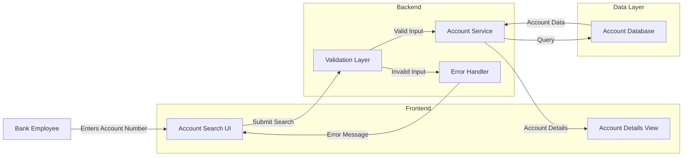

# Account Search Validation and Processing

## User Story
_As a bank employee, I want to search for customer accounts by entering an account number, so that I can quickly access account details and provide customer service._

## Acceptance Criteria
1. GIVEN I am on the account search screen WHEN I enter a valid 11-digit account number THEN the system should retrieve and display the matching account details
2. GIVEN I am on the account search screen WHEN I enter an empty account number THEN the system should display 'Account number not provided' error message
3. GIVEN I am on the account search screen WHEN I enter a non-numeric account number THEN the system should display an appropriate error message and highlight the field in red
4. GIVEN I am on the account search screen WHEN I enter a zero account number THEN the system should display an error message and highlight the field in red
5. GIVEN I am on the account search screen WHEN I enter '*' as the account number THEN the system should treat it as a special case and convert it to LOW-VALUES for processing
6. System should validate that account numbers are exactly 11 digits in length before processing the search
7. Feature must provide clear visual feedback for validation errors by highlighting problematic fields in red

## Test Scenarios
1. Verify that a valid 11-digit account number successfully retrieves the correct account details
2. Verify that submitting an empty account number field displays 'Account number not provided' error message
3. Verify that entering letters or special characters (except '*') in the account number field displays the appropriate error message
4. Verify that entering all zeros in the account number field displays an error message
5. Verify that entering an account number with less than 11 digits displays an error message
6. Verify that entering an account number with more than 11 digits displays an error message
7. Confirm that entering '*' as an account number is processed correctly as a special case
8. Validate that error messages are displayed in the correct location on the screen
9. Validate that fields with validation errors are highlighted in red
10. Verify that after correcting an invalid input, the error message disappears and the field is no longer highlighted in red

## Diagram

## Subtasks
### Account Search Processing
This subtask handles the validation and processing of account search criteria entered by users. It ensures that only valid search requests are processed and provides appropriate feedback for invalid inputs.

1. Business Rules:
   - Users can search for accounts by entering a valid account number
   - The system validates input before attempting database access
   - Invalid or missing inputs result in error messages

2. Validation Rules:
   - Account ID must be provided (cannot be blank)
   - Account ID must be numeric
   - Account ID must be non-zero
   - Account ID must be 11 digits in length

3. Error Handling:
   - Empty account number: Sets FLG-ACCTFILTER-BLANK flag and displays 'Account number not provided'
   - Non-numeric account number: Sets FLG-ACCTFILTER-NOT-OK flag and displays error message
   - Zero account number: Sets FLG-ACCTFILTER-NOT-OK flag and displays error message

4. Input Processing:
   - Handles special input case where '*' is entered (converts to LOW-VALUES)
   - Converts input to numeric format for database lookup
   - Sets appropriate flags for screen attribute control (highlighting errors in red)

5. Dependencies:
   - Relies on screen input map CACTVWAI
   - Uses common validation routines
   - Feeds validated input to the Account Detail Retrieval subtask
#### References
- [COACTVWC](/COACTVWC.md)