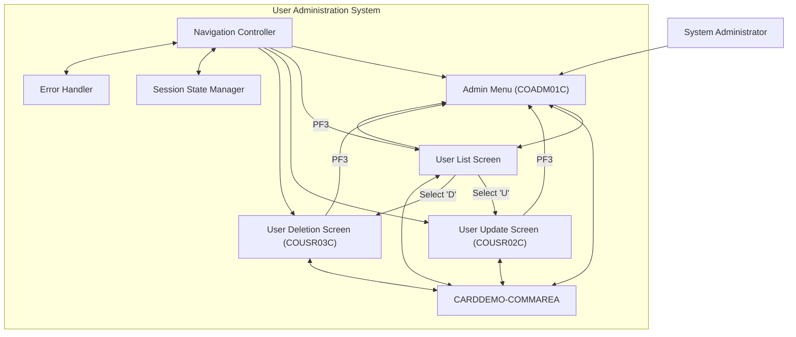

# Administrative Interface Navigation

## User Story
_As a system administrator, I want to efficiently navigate between different user administration screens, so that I can manage user accounts without losing context or having to restart workflows._

## Acceptance Criteria
1. GIVEN I am on a user administration screen WHEN I press PF3 THEN the system returns me to the admin menu (COADM01C)
2. GIVEN I am on the user list screen WHEN I select a user with 'U' THEN the system transfers me to the user update screen (COUSR02C) with the selected user's information
3. GIVEN I am on the user list screen WHEN I select a user with 'D' THEN the system transfers me to the user deletion screen (COUSR03C) with the selected user's information
4. GIVEN I am on any user administration screen WHEN I press Enter THEN the system processes my selection and navigates to the appropriate screen
5. GIVEN I press an invalid function key WHEN on any user administration screen THEN the system displays an appropriate error message without losing my current context
6. System should maintain session state and user context when navigating between different administration screens
7. Feature must use the CARDDEMO-COMMAREA to pass data between programs and preserve navigation history

## Test Scenarios
1. Verify that pressing PF3 from any user administration screen returns to the admin menu (COADM01C)
2. Verify that selecting a user with 'U' transfers to the user update screen (COUSR02C) with the correct user information loaded
3. Verify that selecting a user with 'D' transfers to the user deletion screen (COUSR03C) with the correct user information loaded
4. Verify that pressing Enter processes the current selection and navigates to the appropriate screen
5. Confirm navigation handles invalid key presses by displaying appropriate error messages while maintaining the current screen context
6. Validate that user context is preserved when navigating between screens (e.g., selected user information remains available)
7. Confirm that after completing an operation (update or delete), returning to the user list shows the updated information
8. Verify that the CARDDEMO-COMMAREA correctly maintains all necessary data between program transitions

## Diagram

## Subtasks
### User Administration Navigation
This subtask manages navigation between different user administration screens in the CardDemo system. It handles PF key processing to navigate between screens: PF3 returns to the admin menu (COADM01C), while Enter processes user selections. When a user is selected with 'U' or 'D', the system transfers control to the appropriate program (COUSR02C for updates or COUSR03C for deletions) while maintaining context through the CARDDEMO-COMMAREA. The subtask includes error handling for invalid key presses and maintains session state between screens. It depends on the common communication area (COCOM01Y) to pass data between programs and preserve navigation history.
#### References
- [COUSR00C](/COUSR00C.md)