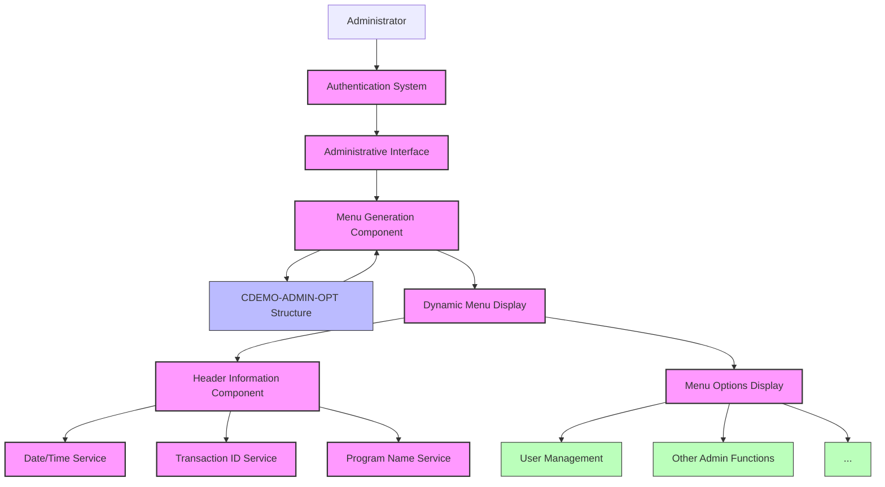

# Administrative Menu Display

## User Story
_As an administrator, I want to see a well-organized menu of administrative options when I access the administrative interface, so that I can easily navigate to the specific administrative function I need to perform._

## Acceptance Criteria
1. GIVEN I am logged in as an administrator WHEN I access the administrative interface THEN I should see a numbered menu of available administrative options
2. GIVEN the administrative menu is displayed WHEN I view the screen THEN I should see standard header information including current date (MM/DD/YY), time (HH:MM:SS), transaction ID ('CA00'), and program name ('COADM01C')
3. GIVEN there are administrative options available WHEN the menu is displayed THEN up to 10 options should be shown with sequential numbers and descriptions (e.g., '1. User Management')
4. GIVEN the system has administrative options stored in the CDEMO-ADMIN-OPT structure WHEN the menu is displayed THEN it should dynamically build the menu by iterating through these available options

## Test Scenarios
1. Verify that all available administrative options stored in CDEMO-ADMIN-OPT are displayed correctly with sequential numbering
2. Confirm the menu displays correctly when there are exactly 10 administrative options available
3. Confirm the menu displays correctly when there are fewer than 10 administrative options available
4. Verify that the date is displayed in MM/DD/YY format and time in HH:MM:SS format in the header
5. Validate that the transaction ID 'CA00' and program name 'COADM01C' appear correctly in the header
6. Verify the menu is displayed immediately when a user first accesses the administrative interface

## Diagram

## Subtasks
### Administrative Menu Display
Displays a menu of administrative options available to admin users. The program dynamically builds the menu by iterating through available options (up to 10) stored in the CDEMO-ADMIN-OPT structure. Each option is displayed with a number and description (e.g., '1. User Management'). The menu includes standard header information such as current date (MM/DD/YY format) and time (HH:MM:SS format), transaction ID ('CA00'), and program name ('COADM01C'). This subtask handles the initial display of the menu when a user first accesses the administrative interface.
#### References
- [COADM01C](/COADM01C.md)