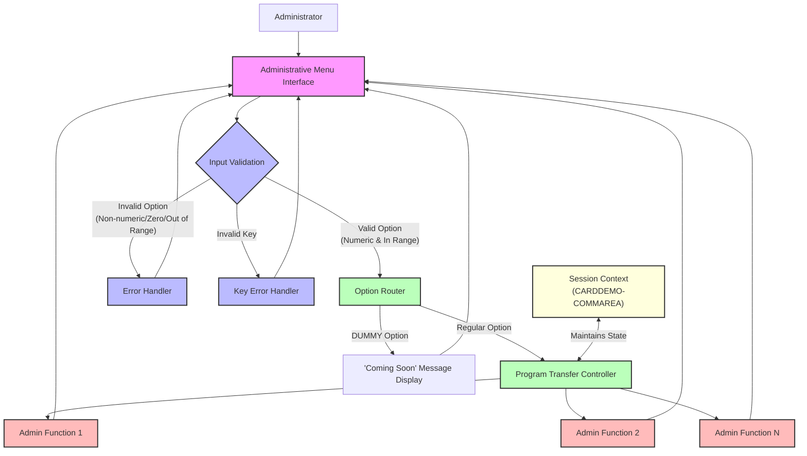

# Administrative Menu Navigation

## User Story
_As an administrator, I want to navigate through a menu of administrative functions, so that I can efficiently access and perform system management tasks._

## Acceptance Criteria
1. GIVEN I am on the administrative menu WHEN I enter a valid numeric option THEN the system should route me to the corresponding administrative function
2. GIVEN I am on the administrative menu WHEN I select an option marked as 'DUMMY' THEN the system should display a 'coming soon' message instead of transferring control
3. GIVEN I am on the administrative menu WHEN I enter an invalid option (non-numeric, zero, or outside the available range) THEN the system should display an error message 'Please enter a valid option number...'
4. GIVEN I am on the administrative menu WHEN I press an invalid key THEN the system should display an error message 'Invalid key pressed'
5. GIVEN I navigate from one administrative function to another WHEN moving between functions THEN my session context should be maintained through the CARDDEMO-COMMAREA
6. System should validate that input is numeric, not zero, and within the range of available options (1 to CDEMO-ADMIN-OPT-COUNT)
7. System should transfer control to the selected program using CDEMO-ADMIN-OPT-PGMNAME(WS-OPTION) for valid selections

## Test Scenarios
1. Verify that the system correctly routes to the appropriate program when a valid option number is entered
2. Verify that the system displays a 'coming soon' message when a 'DUMMY' option is selected
3. Verify that the system displays the appropriate error message when a non-numeric value is entered
4. Verify that the system displays the appropriate error message when zero is entered
5. Verify that the system displays the appropriate error message when a number outside the valid range is entered
6. Verify that the system displays the appropriate error message when an invalid key is pressed
7. Confirm that session context (user information, previous selections, etc.) is preserved when navigating between administrative functions
8. Validate that all available administrative options are displayed correctly in the menu
9. Verify that after displaying an error message, the system allows the user to try again with a valid selection

## Diagram

## Subtasks
### Administrative Option Selection Processing
Processes user input for menu option selection and routes to the appropriate administrative function. The program validates that the input is numeric, not zero, and within the range of available options (1 to CDEMO-ADMIN-OPT-COUNT). If valid, it transfers control to the selected program using CDEMO-ADMIN-OPT-PGMNAME(WS-OPTION). For options marked as 'DUMMY', it displays a 'coming soon' message instead of transferring control. Error handling includes displaying appropriate messages for invalid selections ('Please enter a valid option number...') or invalid key presses ('Invalid key pressed'). The program maintains session context by passing the CARDDEMO-COMMAREA to the target program, ensuring continuity of the user session across administrative functions.
#### References
- [COADM01C](/COADM01C.md)