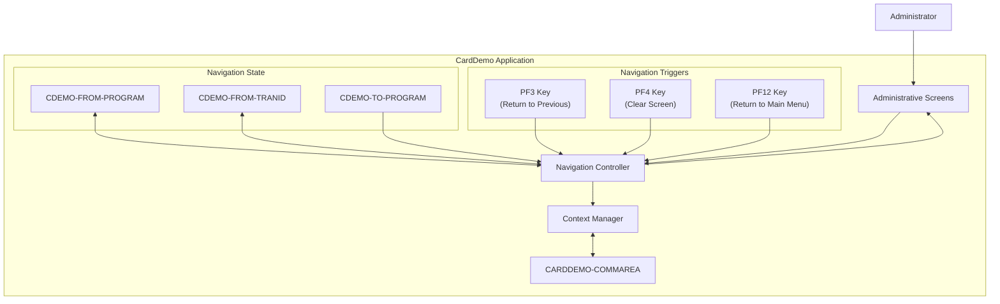

# Administrative Screen Navigation

## User Story
_As an administrator, I want to navigate efficiently between different administrative screens in the CardDemo application, so that I can perform my administrative tasks without losing context or having to restart workflows._

## Acceptance Criteria
1. GIVEN I am on any administrative screen WHEN I press PF3 THEN the system should return me to the previous screen while preserving my context
2. GIVEN I am on any administrative screen WHEN I press PF4 THEN the system should clear the current screen while maintaining my session
3. GIVEN I am on any administrative screen WHEN I press PF12 THEN the system should return me to the main administration menu
4. GIVEN I navigate between screens WHEN context information is available in CARDDEMO-COMMAREA THEN this information should be preserved during navigation
5. GIVEN I am returning to a previous screen WHEN CDEMO-TO-PROGRAM is specified THEN the system should navigate to that program ELSE it should default to COSGN00C
6. System should track navigation origin using CDEMO-FROM-PROGRAM and CDEMO-FROM-TRANID fields to enable proper return navigation

## Test Scenarios
1. Verify that pressing PF3 from a secondary administrative screen returns the user to the previous screen with all context data preserved
2. Verify that pressing PF4 clears the current screen's input fields while maintaining the user's session and position in the application
3. Verify that pressing PF12 from any depth in the administrative screens returns the user directly to the main administration menu
4. Confirm navigation correctly handles the CDEMO-TO-PROGRAM field by navigating to the specified program when provided
5. Confirm navigation defaults to COSGN00C when CDEMO-TO-PROGRAM is not specified
6. Validate that CDEMO-FROM-PROGRAM and CDEMO-FROM-TRANID are correctly updated during each navigation action
7. Verify that a complete navigation path (going through multiple screens and returning) maintains proper context throughout the journey

## Diagram

## Subtasks
### Administrative Navigation
This subtask manages navigation between different administrative screens in the CardDemo application. It provides functionality to return to previous screens (PF3), clear the current screen (PF4), and return to the main administration menu (PF12). The navigation logic preserves context between screens by maintaining information in the communication area (CARDDEMO-COMMAREA). When returning to a previous screen, the system passes control to the appropriate program stored in CDEMO-TO-PROGRAM (defaulting to COSGN00C if not specified). The component tracks the origin of navigation using CDEMO-FROM-PROGRAM and CDEMO-FROM-TRANID fields to enable proper return navigation. This creates a consistent navigation experience throughout the administrative interface of the application.
#### References
- [COUSR03C](/COUSR03C.md)