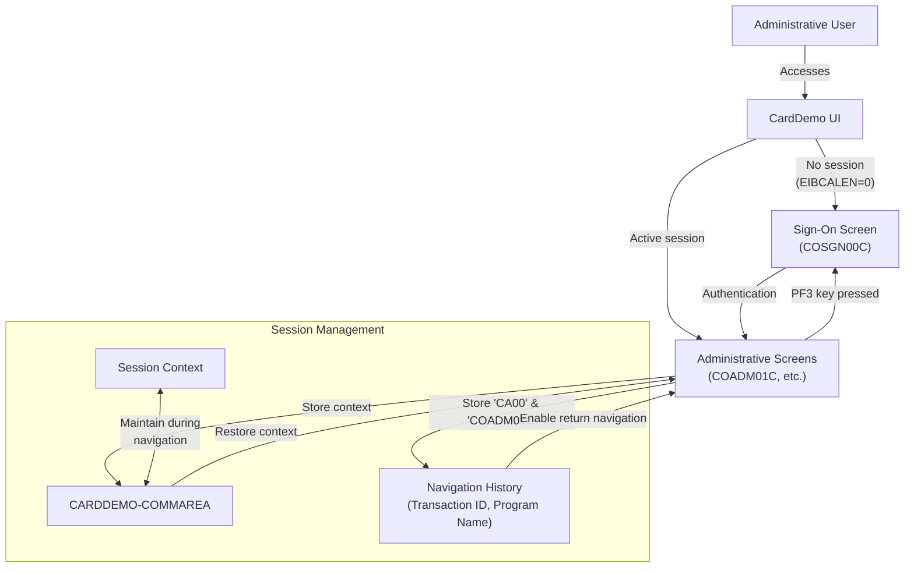

# Administrative Session Management

## User Story
_As an administrative user, I want my session context to be maintained throughout my navigation of the CardDemo system, so that I can efficiently perform administrative tasks without losing my work context._

## Acceptance Criteria
1. GIVEN a new user accessing the administrative system WHEN the system detects no existing session (EIBCALEN=0) THEN the user should be redirected to the sign-on screen (COSGN00C)
2. GIVEN a user with an active administrative session WHEN navigating between different screens THEN the system should maintain their session context through the CARDDEMO-COMMAREA
3. GIVEN a user in any administrative screen WHEN pressing the PF3 key THEN the system should return the user to the sign-on screen
4. GIVEN a user navigating from one program to another WHEN the transition occurs THEN the system should store the current transaction ID ('CA00') and program name ('COADM01C') in the commarea to enable proper return navigation
5. System should provide consistent navigation patterns across all administrative screens
6. Feature must ensure session state is preserved during all supported navigation flows

## Test Scenarios
1. Verify that a new user with no existing session is automatically redirected to the sign-on screen
2. Verify that user context information is properly stored in and retrieved from the CARDDEMO-COMMAREA during navigation
3. Confirm PF3 key functionality correctly returns users to the sign-on screen from any administrative screen
4. Validate that when transferring between programs, the transaction ID and program name are correctly stored in the commarea
5. Verify that after completing a transaction and returning to a previous screen, all relevant context information is preserved
6. Confirm the system handles session timeout scenarios appropriately by redirecting to the sign-on screen
7. Test navigation flow through multiple screens to ensure consistent behavior and context preservation

## Diagram

## Subtasks
### Administrative Session Management
Manages the administrative user session context and navigation flow. The program maintains session state through the CARDDEMO-COMMAREA, which tracks program flow and user context. It handles session initialization (when EIBCALEN=0) by redirecting to the sign-on screen (COSGN00C). The program supports navigation between screens with PF3 key functionality to return to the sign-on screen. When transferring to another program, it stores the current transaction ID ('CA00') and program name ('COADM01C') in the commarea to enable proper return navigation. This ensures users can navigate through the administrative interface while maintaining their session context and provides a consistent way to exit back to the sign-on screen.
#### References
- [COADM01C](/COADM01C.md)