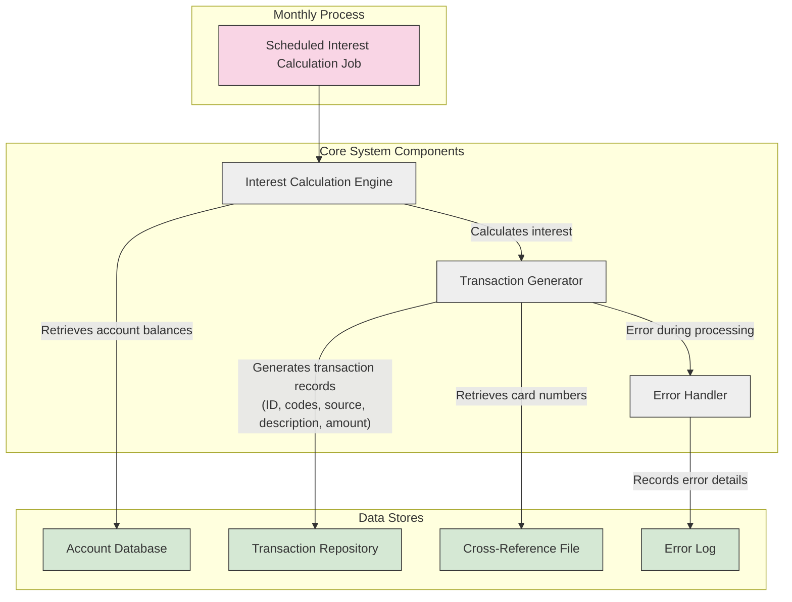

# Automated Interest Transaction Recording

## User Story
_As an account manager, I want the system to automatically generate and record interest transactions, so that there is a complete and transparent audit trail of all interest charges applied to customer accounts._

## Acceptance Criteria
1. GIVEN an account has accrued interest charges WHEN the monthly interest calculation process runs THEN transaction records should be created for each interest charge
2. GIVEN an interest transaction is being created WHEN the system generates the transaction ID THEN it should follow the format of current date plus sequential suffix
3. GIVEN an interest transaction is being created WHEN the system assigns transaction codes THEN it should use type code '01' and category code '05'
4. GIVEN an interest transaction is being created WHEN the system sets the transaction source THEN it should be marked as 'System'
5. GIVEN an interest transaction is being created WHEN the system generates the description THEN it should include 'Int. for a/c' followed by the account ID
6. GIVEN an interest transaction is being created WHEN the system sets the transaction amount THEN it should equal the calculated monthly interest
7. GIVEN an interest transaction is being created WHEN the system associates a card number THEN it should retrieve it from the cross-reference file
8. GIVEN an interest transaction is being created WHEN the system sets timestamps THEN both original and processing timestamps should be set to the current time
9. GIVEN an error occurs during transaction writing WHEN the system handles the error THEN it should record specific status codes and error messages

## Test Scenarios
1. Verify that transaction records are created with unique IDs when interest is calculated for multiple accounts
2. Confirm that transaction descriptions correctly include the account ID in the format 'Int. for a/c [account ID]'
3. Validate that transaction amounts match the calculated interest amounts from the interest calculation process
4. Verify that all required transaction fields (ID, type, category, source, description, amount, card number, timestamps) are populated correctly
5. Test error handling by simulating file access errors during transaction writing
6. Verify that transactions appear in the transaction output file after successful processing
7. Confirm that the card number in the transaction record matches the one in the cross-reference file for the given account
8. Test boundary conditions such as zero interest amounts and maximum possible interest amounts
9. Validate that timestamps are recorded in the correct format and reflect the actual processing time

## Diagram

## Subtasks
### Interest Transaction Generation
This subtask creates transaction records for all calculated interest charges, providing an audit trail of interest applied to accounts. For each interest charge calculated, the program generates a transaction record with:

1. A unique transaction ID composed of the current date and a sequential suffix
2. Transaction type code '01' and category code '05' indicating an interest charge
3. Source set to 'System'
4. Description that includes 'Int. for a/c' followed by the account ID
5. Transaction amount equal to the calculated monthly interest
6. The associated card number from the cross-reference file
7. Current timestamp for both original and processing timestamps

The transaction records are written to the transaction output file and serve as an audit trail for all interest charges. This provides transparency for both internal accounting and customer-facing statements. The subtask handles errors during transaction writing with specific status codes and error messages.
#### References
- [CBACT04C](/CBACT04C.md)