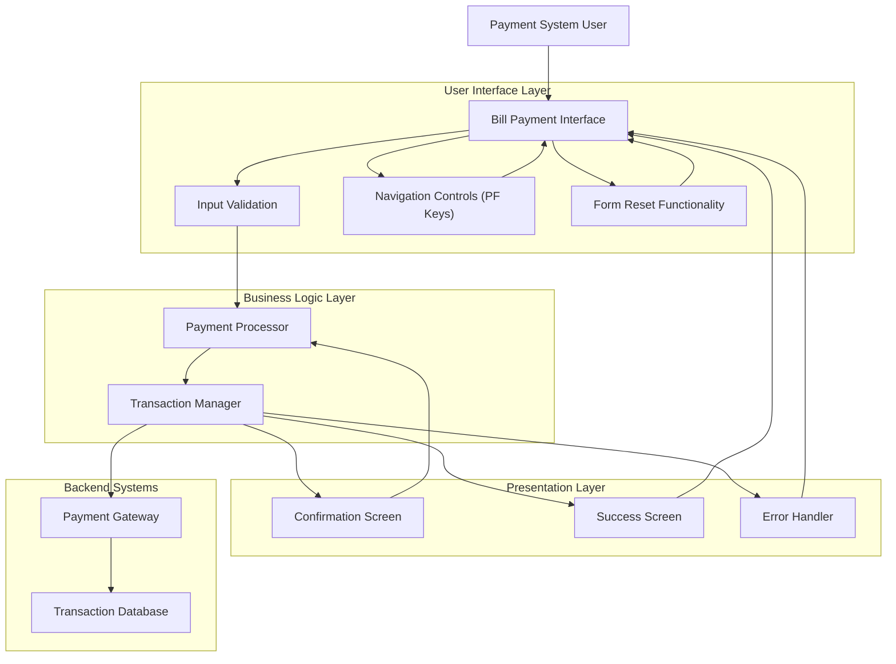

# Bill Payment Screen Interface Management

## User Story
_As a payment system user, I want an intuitive bill payment interface that guides me through the payment process, so that I can complete bill payments accurately and efficiently._

## Acceptance Criteria
1. GIVEN I access the bill payment screen WHEN the screen initializes THEN all fields should be cleared and the cursor positioned at the first input field
2. GIVEN I am on the bill payment screen WHEN I enter payment information and submit THEN the system should validate all required fields contain valid values
3. GIVEN I have entered valid payment information WHEN I submit the payment THEN I should see a confirmation screen showing the payment amount and requesting confirmation
4. GIVEN I confirm a payment WHEN the transaction completes successfully THEN I should see a success message with the transaction ID displayed in green
5. GIVEN I am on the bill payment screen WHEN I press PF3 THEN the system should return me to the previous screen
6. GIVEN I am on the bill payment screen WHEN I press PF4 THEN all input fields should be reset
7. GIVEN I am on the bill payment screen WHEN I press an invalid function key THEN an 'Invalid key pressed' error message should display
8. GIVEN I submit a payment with invalid data WHEN validation occurs THEN the cursor should position at the error field with a contextual error message
9. GIVEN I attempt a payment WHEN a system-level error occurs THEN an appropriate technical error message should display

## Test Scenarios
1. Verify that all fields are cleared and cursor is positioned correctly when the bill payment screen is first accessed
2. Verify that validation occurs for all required fields and appropriate error messages display for invalid data
3. Confirm the confirmation screen displays the correct payment amount and requires explicit confirmation
4. Validate that a successful payment displays a transaction ID in green color
5. Verify that pressing PF3 returns the user to the previous screen with no changes processed
6. Confirm that pressing PF4 clears all input fields on the bill payment screen
7. Verify that pressing an undefined function key displays the 'Invalid key pressed' message
8. Test field-level error handling by entering invalid data in each field and confirming appropriate cursor positioning and error messages
9. Simulate system-level errors (e.g., file operation failures) and verify appropriate error messages are displayed
10. Verify the integration with the common header information and application navigation framework

## Diagram

## Subtasks
### Bill Payment Screen Management
This subtask manages the bill payment screen interface, handling display and user interaction. Key functionality includes:

1. Business Rules:
   - Screen initialization: Clears fields and sets initial cursor position when first accessed
   - Field validation: Ensures required fields are populated and contain valid values
   - Confirmation display: Shows payment amount and requires confirmation before processing
   - Success messaging: Displays transaction ID upon successful payment

2. Edge Cases:
   - Screen navigation: Handles PF3 to return to previous screen
   - Screen clearing: Handles PF4 to reset all input fields
   - Invalid function keys: Shows error message 'Invalid key pressed'

3. Error Handling:
   - Field-level errors: Positions cursor at error field and displays contextual message
   - System-level errors: Displays technical error messages when file operations fail
   - Visual indicators: Uses color coding (DFHGREEN) for success messages

4. Dependencies:
   - Uses standard CICS screen handling mechanisms (SEND/RECEIVE MAP)
   - Relies on common header information (POPULATE-HEADER-INFO)
   - Integrates with application navigation framework through RETURN-TO-PREV-SCREEN
#### References
- [COBIL00C](/COBIL00C.md)