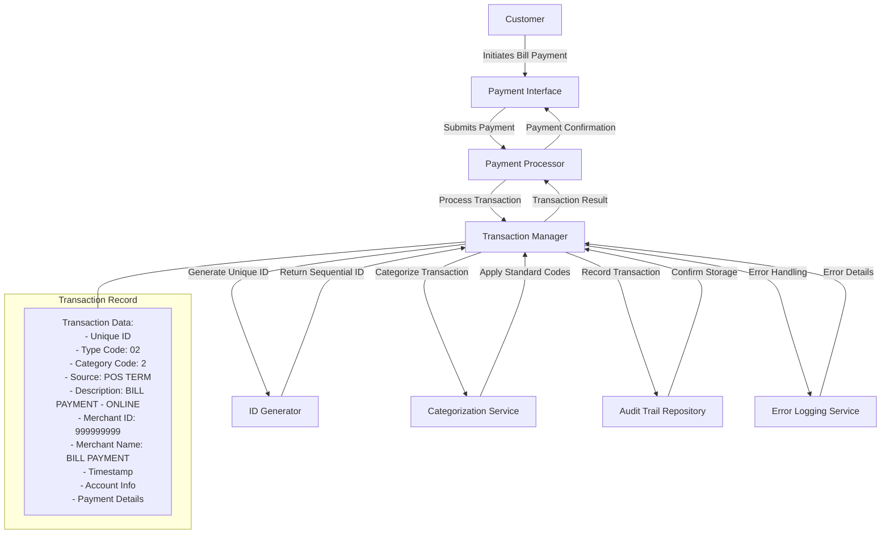

# Bill Payment Transaction Recording

## User Story
_As a payment system operator, I want all bill payment transactions to be automatically recorded with unique identifiers and standardized categorization, so that we maintain a complete and consistent audit trail of all customer bill payments._

## Acceptance Criteria
1. GIVEN a customer completes a bill payment WHEN the transaction is processed THEN a permanent transaction record is created with a unique sequential ID
2. GIVEN a bill payment transaction WHEN the record is created THEN it must be categorized with type code '02', category code 2, source 'POS TERM', and description 'BILL PAYMENT - ONLINE'
3. GIVEN a bill payment transaction WHEN the record is created THEN it must include standard merchant information (ID: 999999999, Name: 'BILL PAYMENT')
4. GIVEN a bill payment transaction WHEN the record is created THEN it must include the current timestamp, account information, and payment details
5. GIVEN no previous transactions exist WHEN a new bill payment transaction is processed THEN the system should handle it as the first transaction and assign the initial ID correctly
6. GIVEN a file access error occurs WHEN attempting to read or write transaction records THEN specific error messages must be provided to identify the failure point

## Test Scenarios
1. Verify that a unique sequential transaction ID is generated when processing a bill payment transaction
2. Confirm transaction records contain all required fields: transaction type '02', category code 2, source 'POS TERM', description 'BILL PAYMENT - ONLINE', merchant ID 999999999, and merchant name 'BILL PAYMENT'
3. Validate that transaction timestamps accurately reflect the actual transaction time
4. Verify that the system correctly handles the first transaction scenario when no previous transaction records exist
5. Confirm the system detects and handles potential duplicate transaction IDs
6. Test error handling by simulating file access errors and verifying appropriate error messages are displayed
7. Validate that account and card information is correctly retrieved from ACCTDAT and CXACAIX files and included in the transaction record
8. Verify that multiple concurrent transactions are processed correctly with unique IDs

## Diagram

## Subtasks
### Transaction Record Creation
This subtask creates a permanent record of bill payment transactions in the system. Key functionality includes:

1. Business Rules:
   - Transaction ID generation: Creates unique sequential transaction IDs
   - Transaction categorization: Sets transaction type code '02' and category code 2
   - Transaction source tracking: Records source as 'POS TERM'
   - Transaction description: Sets description as 'BILL PAYMENT - ONLINE'
   - Merchant information: Sets standard values for bill payments (ID: 999999999, Name: 'BILL PAYMENT')

2. Process Flow:
   - Retrieves highest existing transaction ID by reading the last record
   - Increments ID by 1 to create new unique ID
   - Populates transaction record with payment details and account information
   - Captures current timestamp for transaction dating
   - Writes new record to transaction file

3. Edge Cases:
   - First transaction: Handles case where no previous transactions exist
   - Duplicate ID: Detects and handles duplicate transaction IDs

4. Error Handling:
   - File access errors: Provides specific error messages for read/write failures
   - Record creation failures: Reports specific error with 'Unable to Add Bill pay Transaction...'

5. Dependencies:
   - Requires access to TRANSACT file for reading highest ID and writing new record
   - Needs account and card information from ACCTDAT and CXACAIX files
   - Uses system timestamp functions for transaction dating
#### References
- [COBIL00C](/COBIL00C.md)