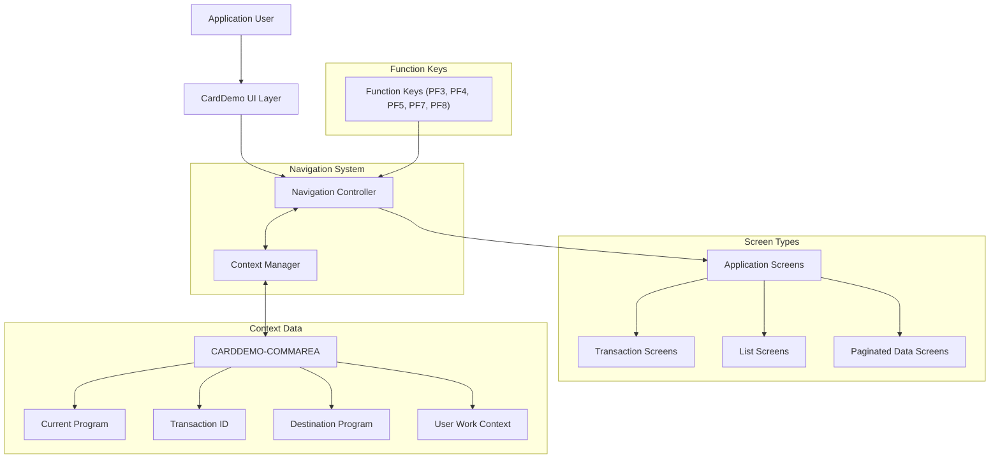

# Consistent Application Navigation Framework

## User Story
_As a CardDemo application user, I want a consistent navigation system across all screens, so that I can efficiently move between different functions while maintaining my work context._

## Acceptance Criteria
1. GIVEN I am on any application screen WHEN I press PF3 THEN I should be returned to the previous screen or main menu if previous screen is not specified
2. GIVEN I am on a transaction screen WHEN I press PF4 THEN all input fields should be cleared while maintaining the screen context
3. GIVEN I am on a transaction-related screen WHEN I press PF5 THEN I should be navigated to the transaction list screen
4. GIVEN I am on a screen WHEN I press PF7 THEN I should navigate to the previous page of data if available
5. GIVEN I am on a screen WHEN I press PF8 THEN I should navigate to the next page of data if available
6. GIVEN I press an invalid function key WHEN on any screen THEN an appropriate error message should be displayed without changing screens
7. System should maintain navigation context in the CARDDEMO-COMMAREA including current program, transaction ID, and destination program
8. System should handle first-time entry to screens (when EIBCALEN = 0) by redirecting to appropriate screens as needed
9. Feature must pass relevant data between screens to maintain user context throughout the navigation flow

## Test Scenarios
1. Verify that pressing PF3 from the transaction detail screen returns to the transaction list screen
2. Verify that pressing PF3 from the transaction list screen returns to the main menu
3. Verify that pressing PF4 on a transaction screen with populated fields clears all input fields
4. Verify that pressing PF5 from any transaction-related screen navigates to the transaction list screen
5. Verify that pressing PF7 on a multi-page list navigates to the previous page
6. Verify that pressing PF8 on a multi-page list navigates to the next page
7. Verify that pressing an undefined function key displays 'Invalid key' message
8. Confirm navigation maintains selected transaction IDs and other context when moving between screens
9. Validate first-time entry to the application properly redirects to the sign-on screen
10. Validate that the COMMAREA correctly stores and retrieves navigation context between screen transitions

## Diagram

## Subtasks
### Screen Navigation Control
This subtask manages navigation between different screens in the CardDemo application. It handles function key processing for PF3 (return to previous screen), PF7 (page up), and PF8 (page down). When PF3 is pressed, the system transfers control to COMEN01C (main menu). The subtask maintains navigation context in the CARDDEMO-COMMAREA, storing information about the current program (WS-PGMNAME = 'COTRN00C'), transaction ID (WS-TRANID = 'CT00'), and destination program (CDEMO-TO-PROGRAM). For invalid key presses, it displays an error message ('Invalid key') and maintains the current screen. The subtask also handles the initial entry to the screen, checking if EIBCALEN = 0 (first entry) and redirecting to COSGN00C if needed. This ensures proper flow between application screens and maintains user session state throughout the navigation process.
#### References
- [COTRN00C](/COTRN00C.md)
### Transaction Screen Navigation
This subtask manages navigation between transaction-related screens in the CardDemo application. It implements a consistent navigation framework that allows users to move between transaction detail view, transaction list, and main menu screens. Business rules include: 1) PF3 key returns to the previous screen based on the stored 'from program' value, defaulting to COMEN01C if not specified; 2) PF4 key clears the current screen by initializing all input fields while maintaining the screen context; 3) PF5 key navigates specifically to the transaction list screen (COTRN00C); 4) The system maintains context between screens by passing relevant data in the COMMAREA, including selected transaction IDs and pagination information; 5) Invalid key presses are handled with an appropriate error message. This navigation framework ensures users can efficiently move between different transaction-related functions while maintaining their work context. The component depends on the COMMAREA structure for passing data between programs and integrates with COTRN00C, COMEN01C, and potentially other screens in the application flow.
#### References
- [COTRN01C](/COTRN01C.md)