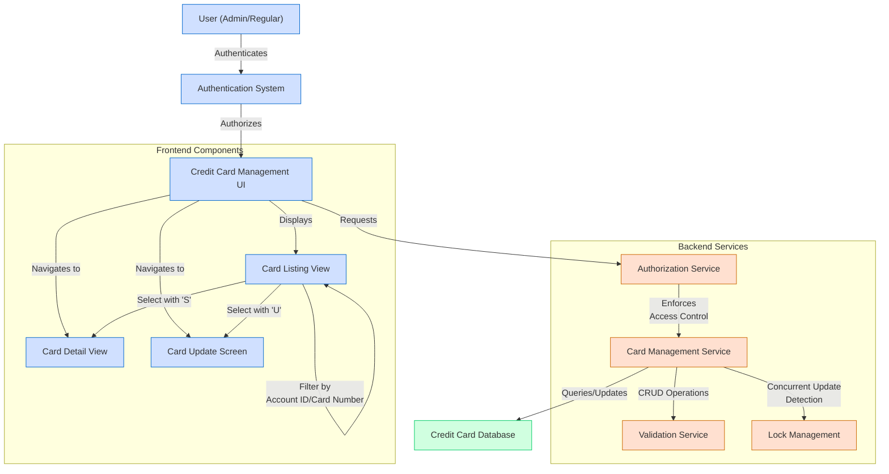

# Credit Card Portfolio Management

## User Story
_As a credit card manager, I want to view, navigate through, and update credit card information in a secure and controlled manner, so that I can efficiently manage the credit card portfolio while maintaining data integrity._

## Acceptance Criteria
1. GIVEN I am logged in as an admin user WHEN I access the credit card listing THEN I should see all cards in the system with pagination (7 cards per page)
2. GIVEN I am logged in as a regular user WHEN I access the credit card listing THEN I should only see cards associated with my account
3. GIVEN I am viewing the card listing WHEN I enter an 11-digit account ID and/or 16-digit card number in the filter fields THEN the system should display only matching cards
4. GIVEN I am viewing the card listing WHEN I select a card with 'S' THEN I should be taken to the card detail view
5. GIVEN I am viewing the card listing WHEN I select a card with 'U' THEN I should be taken to the card update screen
6. GIVEN I am on any page of the card listing WHEN I press PF7/PF8 THEN I should navigate to previous/next pages respectively if available
7. GIVEN I am updating a card WHEN I modify the embossed name, expiration date, or status THEN the system should validate my inputs according to business rules
8. GIVEN I am updating a card WHEN another user has modified the same record THEN I should be notified and shown the updated data before proceeding
9. GIVEN I am updating a card WHEN I submit valid changes THEN the system should successfully update the card record in the database

## Test Scenarios
1. Verify that admin users can view all cards while regular users can only view cards associated with their account
2. Verify that filtering by account ID (11-digit) and/or card number (16-digit) displays only matching records
3. Verify that pagination works correctly, showing 7 cards per page with proper navigation between pages
4. Verify that selecting a card with 'S' navigates to the card detail view and 'U' navigates to the update screen
5. Verify that appropriate error messages are displayed when invalid filter criteria are entered
6. Verify that card embossed name validation rejects non-alphabetic characters (except spaces)
7. Verify that card status can only be set to 'Y' or 'N'
8. Verify that expiration month must be between 1-12 and year between 1950-2099
9. Verify that attempting to update a record that has been modified by another user shows the updated data and requires review
10. Verify that the system properly locks records during updates to prevent concurrent modifications
11. Verify that all error messages are displayed correctly and the cursor is positioned at the field requiring correction
12. Verify that navigation using function keys (PF3, PF7, PF8) works as expected across all screens

## Diagram

## Subtasks
### Credit Card Listing
This subtask provides a paginated list view of credit cards with filtering capabilities. It implements role-based access control where admin users can view all cards while regular users can only view cards associated with their account. The component displays up to 7 card records per screen with pagination controls (PF7/PF8 keys for backward/forward navigation). Users can filter cards by account ID (11-digit number) and/or card number (16-digit number). Each displayed card shows the account number, card number, and card status. The component validates input filters, ensuring account IDs are 11-digit numeric values and card numbers are 16-digit numeric values. Error messages are displayed for invalid inputs. Users can select individual cards with 'S' to view details or 'U' to update card information, but only one card can be selected at a time. The component maintains pagination context between screens, tracking the first and last card on each page to enable proper navigation.
#### References
- [COCRDLIC](/COCRDLIC.md)
### Credit Card Navigation
This subtask manages navigation between different screens in the credit card management workflow. It handles user actions through function keys and selection inputs: PF3 returns to the main menu, PF7 navigates to the previous page of cards (if not on the first page), PF8 navigates to the next page (if more cards exist), and Enter processes card selections. When a user selects a card with 'S', they are transferred to the card detail view program (COCRDSLC). When a user selects a card with 'U', they are transferred to the card update program (COCRDUPC). The component maintains context between screens by storing the current page number, first and last card keys on the current page, and whether more pages exist. It provides appropriate feedback messages for navigation actions, such as 'NO PREVIOUS PAGES TO DISPLAY' when attempting to go back from the first page or 'NO MORE PAGES TO DISPLAY' when reaching the end of the record set.
#### References
- [COCRDLIC](/COCRDLIC.md)
### Credit Card Detail Update
This subtask allows users to update specific details of an existing credit card through a CICS transaction interface. Users can modify the embossed name on the card, the card's expiration date (month and year), and the card's active status (Y/N). The process follows a structured workflow: (1) The user provides account and card number to retrieve the existing card details; (2) The system displays the current card information; (3) The user makes desired changes; (4) The system validates the changes; (5) Upon confirmation, the system updates the card record in the database. Business rules include: embossed name must contain only alphabetic characters and spaces; card status must be either 'Y' or 'N'; expiration month must be between 1-12; expiration year must be between 1950-2099. The system implements optimistic concurrency control by checking if the record was modified by another user before committing changes. If another user has modified the record, the system retrieves the updated data and asks the user to review before making changes again. Error handling includes specific messages for validation failures (e.g., 'Card name can only contain alphabets and spaces'), record locking issues ('Could not lock record for update'), and concurrent update conflicts ('Record changed by someone else. Please review'). The component depends on the CARDDAT file for persistent storage and integrates with other components through a shared communication area.
#### References
- [COCRDUPC](/COCRDUPC.md)
### Credit Card Data Validation
This subtask handles the validation of credit card data before allowing updates to be committed to the database. It enforces business rules for each editable field: (1) Card embossed name validation - must be provided and can only contain alphabetic characters and spaces, with validation performed by converting all non-alphabetic characters to spaces and checking if any remain; (2) Card status validation - must be either 'Y' (active) or 'N' (inactive) with no other values permitted; (3) Expiration date validation - month must be numeric and between 1-12, year must be numeric and between 1950-2099. The system provides specific error messages for each validation failure and positions the cursor at the field requiring correction. The validation process is comprehensive, checking both for missing required fields and invalid data formats or values. Edge cases handled include empty fields (marked with asterisks on the screen) and non-numeric values in numeric fields. The component uses visual indicators (red highlighting) to draw attention to fields with validation errors.
#### References
- [COCRDUPC](/COCRDUPC.md)
### Credit Card Record Locking
This subtask manages the concurrency control mechanism for updating credit card records, ensuring data integrity when multiple users might be accessing the same record. It implements a pessimistic locking strategy during the update process by: (1) Reading the card record with UPDATE option to obtain a lock; (2) Verifying the record hasn't been changed since it was initially displayed to the user by comparing all field values; (3) If the record was changed, retrieving the updated values and notifying the user to review before proceeding; (4) If unchanged, applying the user's modifications and committing the update. The system handles several error scenarios: inability to obtain a lock ('Could not lock record for update'), detection of concurrent modifications ('Record changed by someone else. Please review'), and update failures after obtaining a lock ('Update of record failed'). This mechanism prevents data corruption from simultaneous updates and ensures users are working with the most current data before making changes.
#### References
- [COCRDUPC](/COCRDUPC.md)