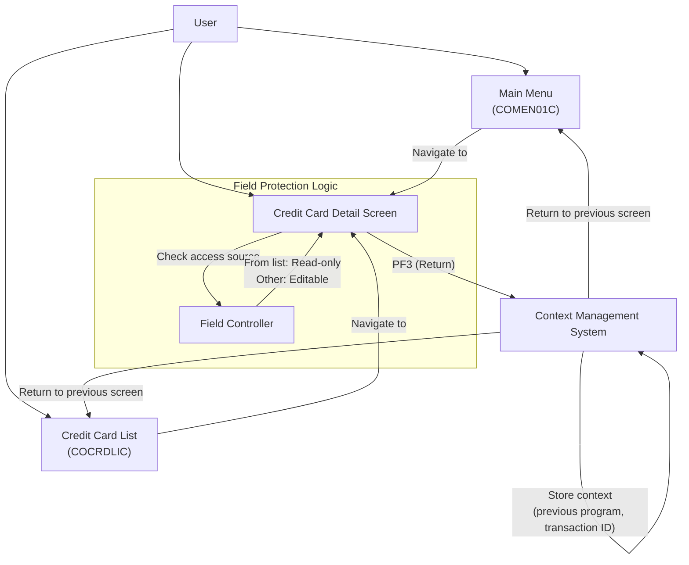

# Credit Card Screen Navigation

## User Story
_As a credit card system user, I want to navigate efficiently between the credit card detail screen and other application screens, so that I can manage credit card information without losing context or having to re-enter data._

## Acceptance Criteria
1. GIVEN I am on the credit card detail screen WHEN I press PF3 THEN I should be returned to the previous screen (either credit card list or main menu)
2. GIVEN I accessed the credit card detail screen from the credit card list screen WHEN I view the detail screen THEN the account and card number fields should be protected (read-only)
3. GIVEN I accessed the credit card detail screen from a screen other than the list screen WHEN I view the detail screen THEN the account and card number fields should be unprotected (editable)
4. GIVEN I navigate between screens WHEN I move through the application THEN the system should maintain context information (previous program, previous transaction ID)
5. GIVEN I press PF3 to return to a previous screen WHEN the system processes my request THEN control should be passed to the appropriate program (COCRDLIC for card list or COMEN01C for main menu)

## Test Scenarios
1. Verify that pressing PF3 on the credit card detail screen returns the user to the credit card list when that was the previous screen
2. Verify that pressing PF3 on the credit card detail screen returns the user to the main menu when that was the previous screen
3. Confirm account and card number fields are read-only when accessing the detail screen from the credit card list screen
4. Confirm account and card number fields are editable when accessing the detail screen from screens other than the list screen
5. Validate that context information is preserved when navigating from the credit card list to the detail screen and back
6. Validate that context information is preserved when navigating from the main menu to the detail screen and back
7. Verify that all navigation paths maintain proper state and don't result in system errors or data loss

## Diagram

## Subtasks
### Credit Card Screen Navigation
This subtask manages navigation between the credit card detail screen and other screens in the CardDemo application. It handles PF key processing to enable users to navigate through the application. Navigation rules include: (1) PF3 key returns to the previous screen (either the credit card list screen or the main menu). (2) When coming from the credit card list screen (COCRDLIC), the account and card number fields are protected (read-only) as they are passed from the list screen. (3) When coming from other contexts, the account and card number fields are unprotected (editable) to allow user input. (4) The system maintains context information (previous program, previous transaction ID) to enable proper navigation flow. (5) When returning to a previous screen, the system passes control to the appropriate program (COCRDLIC for the card list or COMEN01C for the main menu). This subtask depends on the common communication area structure (CARDDEMO-COMMAREA) to maintain context information across screen transitions.
#### References
- [COCRDSLC](/COCRDSLC.md)