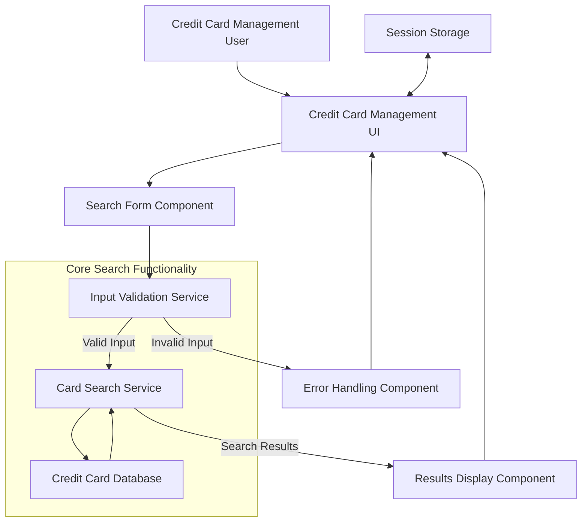

# Credit Card Search Functionality

## User Story
_As a credit card management user, I want to search for specific credit cards using account ID and/or card number filters, so that I can quickly locate and manage relevant card records._

## Acceptance Criteria
1. GIVEN I am on the credit card management screen WHEN I enter a valid 11-digit account ID THEN the system displays only cards matching that account ID
2. GIVEN I am on the credit card management screen WHEN I enter a valid 16-digit card number THEN the system displays only the card matching that number
3. GIVEN I am on the credit card management screen WHEN I enter both a valid account ID and card number THEN the system displays only cards matching both criteria
4. GIVEN I am on the credit card management screen WHEN I enter an invalid account ID (non-numeric or not 11 digits) THEN the system displays an error message 'ACCOUNT FILTER, IF SUPPLIED MUST BE A 11 DIGIT NUMBER'
5. GIVEN I am on the credit card management screen WHEN I enter an invalid card number (non-numeric or not 16 digits) THEN the system displays an appropriate error message
6. GIVEN I have entered search criteria WHEN no records match my search THEN the system displays 'NO RECORDS FOUND FOR THIS SEARCH CONDITION'
7. GIVEN I have performed a search WHEN I navigate away from the page and return THEN my previous search criteria and results are maintained

## Test Scenarios
1. Verify that entering a valid 11-digit account ID returns only matching cards
2. Verify that entering a valid 16-digit card number returns only the matching card
3. Verify that entering both valid account ID and card number returns cards matching both criteria
4. Verify that entering a 10-digit account ID displays the appropriate error message
5. Verify that entering non-numeric characters in the account ID field displays the appropriate error message
6. Verify that entering a 15-digit card number displays the appropriate error message
7. Verify that entering non-numeric characters in the card number field displays the appropriate error message
8. Verify that searching with criteria that match no records displays the 'NO RECORDS FOUND' message
9. Verify that search criteria persist when navigating between pages
10. Verify that pressing Enter after entering search criteria triggers the search function
11. Verify that clearing search fields and pressing Enter resets the search and shows all available cards

## Diagram

## Subtasks
### Credit Card Search
This subtask enables users to search for specific credit cards using filtering criteria. Users can enter an account ID (11-digit number) and/or a card number (16-digit number) to narrow down the list of displayed cards. The search functionality validates inputs, ensuring account IDs are 11-digit numeric values and card numbers are 16-digit numeric values. If invalid data is entered, appropriate error messages are displayed (e.g., 'ACCOUNT FILTER, IF SUPPLIED MUST BE A 11 DIGIT NUMBER'). The search is applied when the user presses Enter, and the results are displayed in the card listing. If no records match the search criteria, a 'NO RECORDS FOUND FOR THIS SEARCH CONDITION' message is displayed. The component maintains the search criteria between page navigations to ensure consistent results.
#### References
- [COCRDLIC](/COCRDLIC.md)