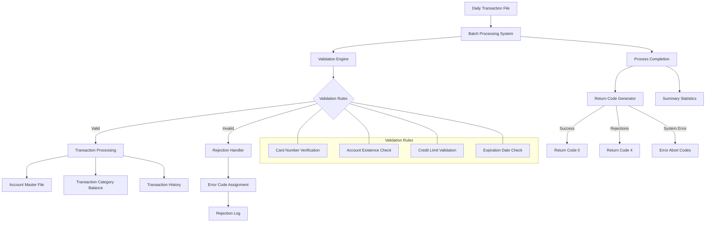

# Credit Card Transaction Batch Processing

## User Story
_As a financial operations manager, I want to process daily credit card transactions in batch mode, so that all valid transactions are posted to customer accounts while invalid transactions are identified and rejected according to business rules._

## Acceptance Criteria
1. GIVEN a daily transaction file WHEN the batch process runs THEN all transactions should be validated against card numbers, account existence, credit limits, and expiration dates
2. GIVEN a valid credit card transaction WHEN the system processes it THEN the transaction should be posted to the account master, transaction category balance, and transaction history files
3. GIVEN an invalid card number WHEN validating a transaction THEN the system should reject it with code 100 and message 'CARD NUMBER [number] COULD NOT BE VERIFIED'
4. GIVEN a valid card number but non-existent account WHEN validating a transaction THEN the system should reject it with code 101 and message 'ACCOUNT [id] NOT FOUND'
5. GIVEN a transaction that would exceed the credit limit WHEN validating a transaction THEN the system should reject it with code 102
6. GIVEN a transaction with an expired account WHEN validating a transaction THEN the system should reject it with code 103
7. GIVEN any rejected transactions WHEN the batch process completes THEN the system should set a non-zero return code (4) for downstream processes
8. GIVEN any file operation error WHEN processing transactions THEN the system should display appropriate error messages and abort with relevant error codes
9. GIVEN a completed batch process WHEN all transactions are processed THEN the system should display summary statistics showing processed and rejected transaction counts

## Test Scenarios
1. Verify that a transaction with a valid card number, existing account, within credit limit, and before expiration date is successfully posted to all relevant files
2. Confirm the system correctly updates account balances by adding transaction amounts to current balances and either current cycle credit or debit based on whether the amount is positive or negative
3. Validate that transactions with invalid card numbers are rejected with code 100 and proper error message
4. Verify that transactions with valid card numbers but non-existent accounts are rejected with code 101 and proper error message
5. Confirm that transactions that would exceed the credit limit are rejected with code 102
6. Test that transactions occurring after account expiration are rejected with code 103
7. Verify that new transaction category balance records are created when processing a transaction for a new account/transaction type/category combination
8. Validate that the batch process sets return code 4 when at least one transaction is rejected
9. Test the system's handling of file operation errors (open, read, close) with appropriate error messages
10. Confirm the summary statistics accurately reflect the number of processed and rejected transactions
11. Verify the cross-reference lookup correctly maps card numbers to account and customer IDs
12. Test the batch process with an empty transaction file to ensure proper handling
13. Validate the batch process with a large volume of transactions to ensure performance and accuracy

## Diagram

## Subtasks
### Daily Transaction Validation
This subtask validates daily credit card transactions by reading records from a daily transaction file and verifying them against reference data. The process includes: (1) Reading each transaction record from the daily transaction file, (2) Looking up the card number in a cross-reference file to obtain the associated account ID and customer ID, (3) Verifying the account exists by reading the account record. Business rules include: transactions with invalid card numbers are rejected with a message 'CARD NUMBER [number] COULD NOT BE VERIFIED', transactions with valid card numbers but non-existent accounts are flagged with 'ACCOUNT [id] NOT FOUND'. The validation process is critical for ensuring only legitimate transactions are processed. The component handles file operation errors comprehensively, with specific error codes and messages for each possible file operation failure (open, read, close). For example, if the cross-reference lookup fails (status code 4), the transaction is skipped with appropriate messaging.
#### References
- [CBTRN01C](/CBTRN01C.md)
### Card-to-Account Resolution
This subtask resolves credit card numbers to their corresponding account and customer IDs using a cross-reference file. For each transaction, the card number is extracted and used as a key to look up the corresponding record in the cross-reference file. If found, the system retrieves the account ID and customer ID associated with the card. This mapping is essential for transaction processing as it connects the physical card used for a transaction with the financial account that should be debited. The lookup uses an indexed file with the card number as the key for efficient retrieval. If the card number is not found in the cross-reference file (indicated by status code 4), the transaction cannot be processed further. The system displays the card number, account ID, and customer ID when a successful lookup occurs, providing an audit trail of the resolution process.
#### References
- [CBTRN01C](/CBTRN01C.md)
### Credit Card Transaction Validation
Validates incoming credit card transactions against multiple business rules before posting. The validation process includes: (1) Verifying card numbers against a cross-reference file - if the card number doesn't exist in the XREF file, the transaction is rejected with code 100; (2) Confirming the account exists - if the account ID from the cross-reference doesn't exist in the account master file, the transaction is rejected with code 101; (3) Checking if the transaction would exceed the credit limit - the system calculates a temporary balance by adding the transaction amount to the difference between current cycle credits and debits (WS-TEMP-BAL = ACCT-CURR-CYC-CREDIT - ACCT-CURR-CYC-DEBIT + DALYTRAN-AMT) and rejects with code 102 if this exceeds the account's credit limit; (4) Verifying the account hasn't expired - compares the account expiration date against the transaction date and rejects with code 103 if the transaction occurred after expiration. All rejected transactions are written to a rejection file with appropriate reason codes.
#### References
- [CBTRN02C](/CBTRN02C.md)
### Credit Card Transaction Posting
Posts valid credit card transactions to the system by updating multiple files to reflect the transaction. The process includes: (1) Updating the transaction category balance file (TCATBAL-FILE) - either creating a new record if one doesn't exist for the account/transaction type/category combination or updating an existing record by adding the transaction amount to the current balance; (2) Updating the account master record - adding the transaction amount to the current balance (ACCT-CURR-BAL) and updating either the current cycle credit (ACCT-CURR-CYC-CREDIT) or debit (ACCT-CURR-CYC-DEBIT) based on whether the transaction amount is positive or negative; (3) Writing the transaction to the transaction file for record-keeping. The system handles the creation of new category balance records when needed and maintains accurate account balances by properly categorizing credits and debits.
#### References
- [CBTRN02C](/CBTRN02C.md)
### Batch Transaction Processing
Processes daily credit card transactions in batch mode from a sequential input file. The program reads each transaction record from the daily transaction file (DALYTRAN-FILE), processes it through validation and posting routines, and maintains counters for processed and rejected transactions. The system sets a non-zero return code (4) if any transactions are rejected, allowing downstream processes to identify when manual intervention may be needed. The program displays summary statistics at completion, showing the total number of transactions processed and rejected. The batch process handles file operations with comprehensive error checking, displaying detailed status information when errors occur and aborting the program with appropriate error codes when critical file operations fail.
#### References
- [CBTRN02C](/CBTRN02C.md)