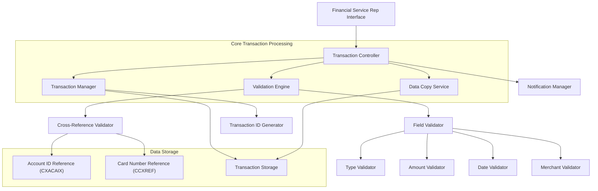

# Credit Card Transaction Entry

## User Story
_As a financial service representative, I want to create and manage credit card transactions with validation and data copy capabilities, so that I can efficiently process customer transactions while maintaining data integrity._

## Acceptance Criteria
1. GIVEN I have a valid account ID or card number WHEN I enter transaction details THEN the system should validate all inputs and create a new transaction record with an auto-generated ID
2. GIVEN I am entering multiple similar transactions WHEN I press PF5 THEN the system should copy data from the most recent transaction for the specified account/card
3. GIVEN I enter transaction data WHEN any validation rule is violated THEN the system should display a specific error message and position the cursor at the problematic field
4. GIVEN I successfully enter all required transaction data WHEN I submit the form THEN the system should save the transaction and display a confirmation message with the new transaction ID
5. System should validate that either account ID or card number exists in the cross-reference files (CXACAIX for account IDs, CCXREF for card numbers)
6. System should require all mandatory fields: type code, category code, source, description, amount, dates, and merchant information
7. System should validate transaction amounts follow the format -99999999.99 (for debits) or +99999999.99 (for credits)
8. System should validate dates follow YYYY-MM-DD format and represent valid calendar dates
9. System should auto-generate transaction IDs sequentially by retrieving the highest existing ID and adding 1
10. System should validate that merchant IDs are numeric

## Test Scenarios
1. Verify that a new transaction can be created when all required fields are properly populated with valid data
2. Verify that the system correctly validates and rejects transactions with invalid account IDs or card numbers
3. Verify that the system correctly validates and rejects transactions with invalid amounts, dates, or merchant IDs
4. Verify that the system correctly auto-generates sequential transaction IDs
5. Verify that pressing PF5 correctly copies data from the most recent transaction for the specified account/card
6. Confirm data copy functionality handles the case when no previous transactions exist for an account/card
7. Confirm validation provides specific error messages for each type of validation failure
8. Validate that the cursor is positioned at the field requiring correction when validation fails
9. Verify that a confirmation message with the new transaction ID is displayed upon successful transaction creation
10. Validate cross-reference validation works correctly by testing with both valid and invalid account IDs and card numbers
11. Verify that the system handles database errors appropriately when writing new transaction records

## Diagram

## Subtasks
### Transaction Creation
This subtask allows users to create new credit card transactions in the system. Users can enter either an account ID or card number, and the system will automatically retrieve the corresponding cross-reference information. The subtask includes comprehensive validation of all input fields before writing to the transaction database. Key business rules include: (1) Either account ID or card number must be provided and must exist in the system; (2) All required fields must be populated including type code, category code, source, description, amount, dates, and merchant information; (3) Transaction amounts must follow the format -99999999.99; (4) Dates must follow the format YYYY-MM-DD and be valid calendar dates; (5) Transaction IDs are auto-generated sequentially by retrieving the highest existing ID and adding 1; (6) Merchant IDs must be numeric. The system performs cross-reference validation by checking account IDs against the CXACAIX file and card numbers against the CCXREF file. Error handling includes specific error messages for each validation failure and proper cursor positioning to the field requiring correction.
#### References
- [COTRN02C](/COTRN02C.md)
### Transaction Data Copy
This subtask provides a convenience function that allows users to copy data from the most recently created transaction to streamline repetitive data entry. When the user presses PF5, the system retrieves the most recent transaction for the specified account/card and populates all transaction fields including type code, category code, source, amount, description, dates, and merchant information. This feature is particularly useful when entering multiple similar transactions for the same merchant or category. The system still requires user confirmation before saving the new transaction record. The copy function depends on successful account/card validation and the existence of at least one previous transaction in the system.
#### References
- [COTRN02C](/COTRN02C.md)
### Transaction Input Validation
This subtask performs comprehensive validation of all transaction input fields to ensure data integrity. Validation rules include: (1) Account ID and card number must be numeric and exist in the cross-reference files; (2) Type code and category code must be numeric; (3) Transaction amount must follow the format -99999999.99 (for debits) or +99999999.99 (for credits); (4) Transaction dates must follow YYYY-MM-DD format and be valid calendar dates as verified by the CSUTLDTC utility; (5) Merchant ID must be numeric; (6) All required fields (type code, category code, source, description, amount, dates, merchant details) cannot be empty. The system provides specific error messages for each validation failure and positions the cursor at the field requiring correction. This ensures that only valid, well-formed transaction data is stored in the database.
#### References
- [COTRN02C](/COTRN02C.md)
### Transaction Database Management
This subtask handles the database operations required to store new transaction records in the TRANSACT file. It includes: (1) Auto-generation of sequential transaction IDs by retrieving the highest existing ID and incrementing by 1; (2) Formatting and conversion of input data to appropriate database formats (e.g., converting display amount format to packed decimal); (3) Writing new transaction records to the database with proper error handling for duplicate keys or other database errors; (4) Providing confirmation messages with the newly assigned transaction ID upon successful creation. The subtask uses CICS file control commands (STARTBR, READPREV, ENDBR, WRITE) to interact with the database. Error handling includes specific messages for database access failures and duplicate transaction IDs.
#### References
- [COTRN02C](/COTRN02C.md)