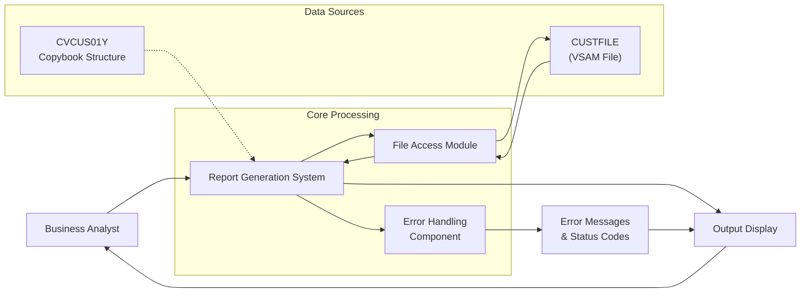

# Customer Data Report Generation

## User Story
_As a business analyst, I want to retrieve and display all customer records from the system, so that I can review customer data for reporting and analysis purposes._

## Acceptance Criteria
1. GIVEN the CUSTFILE VSAM file contains customer records WHEN the report is generated THEN all customer records should be displayed sequentially in the output
2. GIVEN a customer record exists in the CUSTFILE WHEN the system processes that record THEN all fields defined in the CVCUS01Y copybook structure should be correctly displayed
3. GIVEN an error occurs during file operations (opening, reading, or closing) WHEN the system encounters the error THEN appropriate error messages with status codes should be displayed
4. GIVEN a file operation fails WHEN the system detects the failure THEN the program should terminate with abend code 999 after displaying detailed error information
5. GIVEN all records have been processed WHEN the end-of-file condition is reached THEN the system should gracefully complete the operation with status code 10

## Test Scenarios
1. Verify that all customer records are retrieved and displayed when the CUSTFILE contains multiple valid records
2. Confirm the system correctly handles the end-of-file condition when all records have been processed
3. Validate that appropriate error messages are displayed when the CUSTFILE cannot be opened
4. Verify that the system terminates with abend code 999 when a file read operation fails
5. Confirm that customer data is displayed according to the structure defined in the CVCUS01Y copybook
6. Validate that the system correctly processes a large volume of customer records without performance degradation
7. Verify that the system handles empty CUSTFILE scenarios appropriately

## Diagram

## Subtasks
### Customer Data Retrieval and Display
This subtask retrieves and displays customer records from the CUSTFILE indexed VSAM file. It sequentially reads each customer record and displays it to the output. The process continues until all records have been read (end-of-file condition). The subtask implements comprehensive error handling for file operations with specific routines for opening, reading, and closing the customer file. Business rules include: 1) Sequential processing of all customer records without filtering, 2) Detailed error handling with specific status codes (00 for success, 10 for end-of-file, others for errors), 3) Program termination with abend code 999 if any file operation fails. The component depends on the CUSTFILE VSAM dataset and the CVCUS01Y copybook which contains the customer record structure. Error handling includes displaying detailed file status information in a formatted way (e.g., 'FILE STATUS IS: NNNN0023' for a specific error) before terminating the program.
#### References
- [CBCUS01C](/CBCUS01C.md)