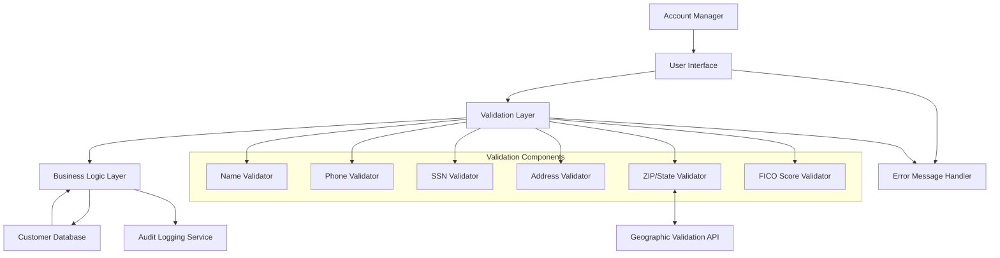

# Customer Information Update

## User Story
_As an account manager, I want to update customer profile information with proper validation, so that customer records remain accurate and compliant with data quality standards._

## Acceptance Criteria
1. GIVEN a customer record exists WHEN I modify personal details, contact information, or identification data THEN the system saves only the changed fields
2. GIVEN I enter customer name fields WHEN I submit the form THEN the system validates that names contain only alphabetic characters
3. GIVEN I enter a phone number WHEN I submit the form THEN the system validates it follows North American format (###)###-#### with valid area codes
4. GIVEN I enter a Social Security Number WHEN I submit the form THEN the system validates it is not using invalid patterns (000, 666, or 900-999 for first segment)
5. GIVEN I enter address information WHEN I submit the form THEN the system validates that address line 1, city, state, and ZIP are provided
6. GIVEN I enter a ZIP code and state WHEN I submit the form THEN the system validates they are a valid combination
7. GIVEN I enter a FICO score WHEN I submit the form THEN the system validates it is between 300-850
8. GIVEN I enter invalid data WHEN I submit the form THEN the system displays field-specific error messages that guide me to correct the input

## Test Scenarios
1. Verify that only modified fields are updated when submitting a partial update to a customer profile
2. Verify that names with non-alphabetic characters are rejected with appropriate error messages
3. Verify that phone numbers not matching North American format are rejected with appropriate error messages
4. Verify that phone numbers with invalid area codes are rejected based on the area code lookup table
5. Verify that SSNs with invalid patterns (000-xx-xxxx, 666-xx-xxxx, 9xx-xx-xxxx) are rejected
6. Verify that submissions with missing required address fields (address line 1, city, state, ZIP) are rejected
7. Verify that ZIP codes not matching the selected state are rejected
8. Verify that FICO scores outside the range 300-850 are rejected
9. Confirm the system correctly handles edge cases like hyphenated names, apartment numbers in addresses, and international phone numbers
10. Validate that cross-field validation rules are properly enforced for related fields like state and ZIP code

## Diagram

## Subtasks
### Customer Information Update
This subtask manages the updating of customer information associated with an account. It allows users to modify personal details, contact information, and identification data. The component validates various customer data elements with specific rules: Names must contain only alphabetic characters; Phone numbers must follow North American format (###)###-####, with area codes validated against a lookup table; SSN must be valid (not 000, 666, or 900-999 for first segment); ZIP codes must match state codes; FICO scores must be between 300-850. Address validation includes required fields for address line 1, city, state, and ZIP. The component handles partial updates by detecting which fields have been changed from their original values. Error messages are field-specific and guide the user to correct input problems. The component depends on the customer master file (CUSTDAT) and implements cross-field validation between related fields (e.g., state and ZIP code must be a valid combination).
#### References
- [COACTUPC](/COACTUPC.md)