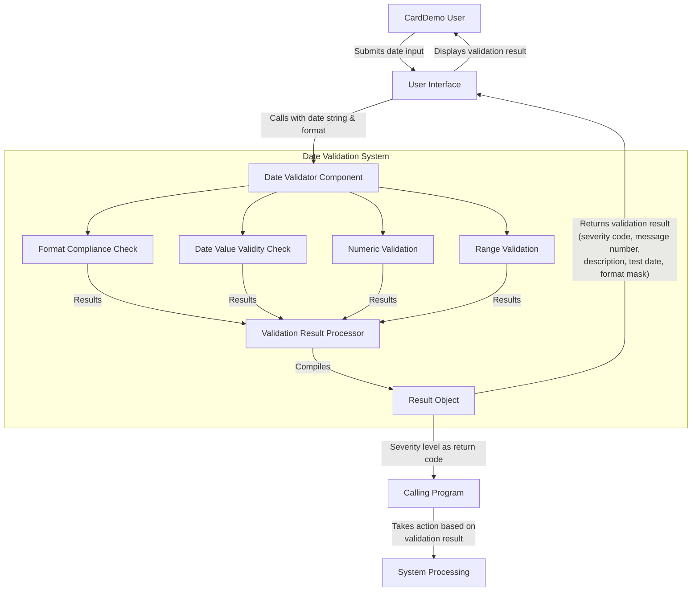

# Date Format Validation for Data Quality Management

## User Story
_As a CardDemo application user, I want to validate date inputs against specified formats, so that I can ensure data integrity and prevent invalid dates from being processed in the system._

## Acceptance Criteria
1. GIVEN a date string and a format pattern WHEN the validation function is called THEN the system should verify the date matches the specified format and return appropriate validation results
2. GIVEN a date string WHEN validated THEN the system should check format compliance, date value validity, numeric validation, and range validation
3. GIVEN an invalid date input WHEN validation occurs THEN the system should return specific error codes and descriptive messages based on the type of validation failure
4. GIVEN a validation result WHEN returned to the calling program THEN it should include severity code, message number, result description, test date, and format mask used
5. GIVEN any validation process WHEN completed THEN the return code should be set to the severity level to allow calling programs to determine success or failure

## Test Scenarios
1. Verify that a valid date in the correct format returns a successful validation result
2. Confirm the system correctly identifies and reports when a date string is too short for the specified format (code 2507)
3. Validate that out-of-range date components (e.g., month > 12) are detected and reported with error code 2508
4. Verify that non-numeric characters in date fields that require numeric values are properly detected and reported
5. Confirm the system correctly validates dates against various format patterns (MM/DD/YYYY, YYYY-MM-DD, etc.)
6. Test that invalid era components in date formats are properly identified
7. Verify that dates outside supported date ranges are rejected with appropriate error messages
8. Test that a zero year value in era format is properly identified as invalid
9. Confirm that invalid format patterns are detected and reported as 'Bad picture string'
10. Verify that the complete validation result structure is returned with all required components (severity code, message number, description, test date, format mask)

## Diagram

## Subtasks
### Date Format Validation
This subtask validates date inputs against specified formats to ensure data integrity across the CardDemo application. It leverages the IBM Language Environment CEEDAYS API to perform comprehensive date validation.

Business rules:
- Accepts an input date string (up to 10 characters) and a format pattern
- Validates the date against the specified format
- Returns detailed validation results with severity codes and descriptive messages

Validation checks include:
- Format compliance: Verifies the date matches the specified format pattern (e.g., MM/DD/YYYY)
- Date value validity: Ensures the date represents a valid calendar date
- Numeric validation: Confirms date components contain only numeric data where required
- Range validation: Checks if date values fall within supported ranges

Error handling:
- Returns specific error codes and messages for different validation failures:
  * Insufficient data (code 2507): Date string is too short for the specified format
  * Bad date value (code 2508): Date components are out of range (e.g., month > 12)
  * Invalid era: Era component in the date format is invalid
  * Unsupported range: Date falls outside supported date ranges
  * Invalid month: Month value is not valid (e.g., 13)
  * Bad picture string: Format pattern is invalid
  * Non-numeric data: Date contains non-numeric characters where numbers are expected
  * Year in era is zero: Invalid year value of zero in era format

The validation result is returned in a structured message that includes:
- Severity code (numeric indicator of error severity)
- Message number (specific error code)
- Result description (human-readable explanation)
- Test date (the date that was validated)
- Format mask used (the pattern against which validation occurred)

The return code is set to the severity level, allowing calling programs to determine if validation succeeded or failed.
#### References
- [CSUTLDTC](/CSUTLDTC.md)