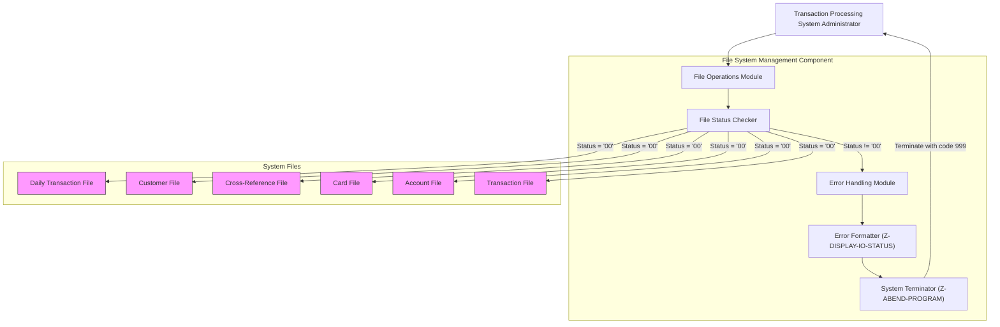

# Implement Robust File System Management for Transaction Processing

## User Story
_As a transaction processing system administrator, I want a reliable file system management component with comprehensive error handling, so that all critical file operations are performed securely with clear error reporting when issues occur._

## Acceptance Criteria
1. GIVEN the transaction processing system WHEN it needs to access any of the six required files (daily transaction, customer, cross-reference, card, account, and transaction files) THEN the system should properly open, read, and close these files
2. GIVEN any file operation WHEN the operation fails THEN the system should display a specific error message including the file name and status code
3. GIVEN a file status code WHEN it is not '00' (success) THEN the system should call Z-DISPLAY-IO-STATUS to format the error and Z-ABEND-PROGRAM to terminate with error code 999
4. System should implement standardized file status checking across all file operations
5. System should maintain data integrity by properly handling all file operation failures
6. Feature must support both sequential and indexed file types as required by the different system files

## Test Scenarios
1. Verify that all six files (daily transaction, customer, cross-reference, card, account, and transaction) can be successfully opened, read, and closed
2. Verify that appropriate error messages are displayed when attempting to open a non-existent file
3. Confirm error handling correctly formats and displays the file status code when a read operation fails
4. Validate that the system terminates with error code 999 when encountering a critical file operation failure
5. Verify that different file types (sequential and indexed) are handled correctly by the file system management component
6. Confirm the Z-DISPLAY-IO-STATUS routine correctly formats different file status codes into user-friendly messages
7. Test error scenarios for each file type to ensure consistent error handling across all file operations

## Diagram

## Subtasks
### File System Management
This subtask handles all file operations required for transaction processing, including opening, reading, and closing six different files: daily transaction file (sequential), customer file (indexed), cross-reference file (indexed), card file (indexed), account file (indexed), and transaction file (indexed). The component implements comprehensive error handling for all file operations with specific error messages and status codes. For example, if a file open operation fails, the system displays an error message like 'ERROR OPENING [FILE NAME]' along with the specific file status code. The component uses a standardized approach to file status checking, where '00' indicates success and other codes indicate various error conditions. When errors occur, the component calls the Z-DISPLAY-IO-STATUS routine to format and display the file status code in a user-friendly format, then calls Z-ABEND-PROGRAM to terminate execution with error code 999. This robust error handling ensures data integrity and provides clear diagnostic information when file operations fail.
#### References
- [CBTRN01C](/CBTRN01C.md)