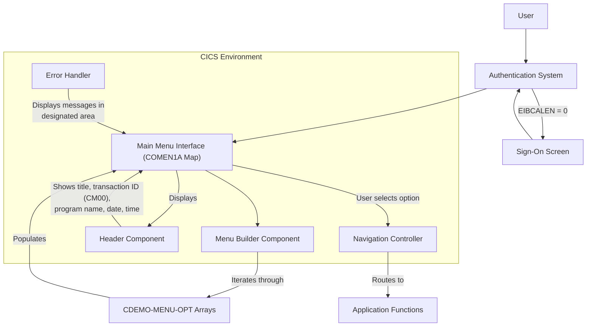

# Main Menu Interface Display

## User Story
_As a CardDemo application user, I want to view a well-organized main menu interface, so that I can easily navigate to different functions of the application._

## Acceptance Criteria
1. GIVEN I have successfully authenticated WHEN I access the main menu THEN I should see a properly formatted menu with numbered options (up to 12 items)
2. GIVEN I am on the main menu WHEN I view the header THEN I should see the application title, transaction ID (CM00), program name, current date (MM/DD/YY), and time (HH:MM:SS)
3. GIVEN an error occurs WHEN I am using the application THEN error messages should be displayed in the designated area of the screen
4. GIVEN I attempt to access the menu WHEN I am not authenticated (EIBCALEN = 0) THEN I should be automatically redirected to the sign-on screen
5. System should dynamically build the menu by iterating through predefined options stored in the CDEMO-MENU-OPT arrays
6. Feature must use CICS SEND/RECEIVE commands with the COMEN1A map from the COMEN01 mapset for screen rendering

## Test Scenarios
1. Verify that all menu options (1-12) are correctly displayed with proper numbering and descriptions
2. Confirm the header displays accurate information including current date and time in the required format
3. Validate that error messages appear in the designated area when triggered
4. Verify that unauthenticated users are properly redirected to the sign-on screen
5. Test the menu display with varying numbers of menu options (minimum, maximum, and intermediate values)
6. Confirm the menu interface renders correctly across different terminal types
7. Validate that the menu display updates correctly when menu options are changed in the CDEMO-MENU-OPT arrays

## Diagram

## Subtasks
### Menu Display Management
Handles the presentation layer of the main menu interface, including dynamic menu building, header information display, and error message presentation. The component builds the menu by iterating through predefined options (up to 12 menu items) stored in the CDEMO-MENU-OPT arrays and formats them with numbering (e.g., '1. Option Name'). It populates header information including application title, transaction ID (CM00), program name, current date (MM/DD/YY format), and time (HH:MM:SS format). Error messages are displayed in a designated area of the screen. The component handles screen rendering through CICS SEND/RECEIVE commands using the COMEN1A map from the COMEN01 mapset. If a user attempts to access the menu without proper authentication (EIBCALEN = 0), they are automatically redirected to the sign-on screen.
#### References
- [COMEN01C](/COMEN01C.md)