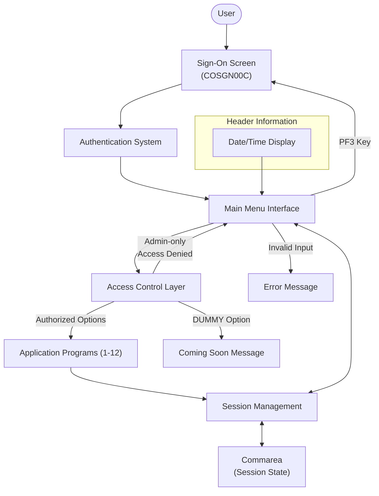

# Main Menu Navigation for Regular Users

## User Story
_As a CardDemo application user, I want to navigate through a personalized main menu interface, so that I can access the functions I'm authorized to use efficiently._

## Acceptance Criteria
1. GIVEN I am logged in as a regular user WHEN I view the main menu THEN I should see only the options available to my access level
2. GIVEN I am on the main menu WHEN I enter a valid numeric option (1-12) THEN the system should route me to the corresponding program
3. GIVEN I am a regular user WHEN I attempt to access an admin-only option THEN I should see an error message 'No access - Admin Only option...'
4. GIVEN I am on the main menu WHEN I enter an invalid or out-of-range value THEN I should see an error message 'Please enter a valid option number...'
5. GIVEN I select an option marked as 'DUMMY' WHEN the system processes my selection THEN I should see a 'coming soon' message instead of navigation to another program
6. GIVEN I am on any menu screen WHEN I press PF3 THEN I should be returned to the sign-on screen (COSGN00C)
7. System should display standard header information including current date (MM/DD/YY) and time (HH:MM:SS)
8. System should maintain session state through a commarea between navigation actions

## Test Scenarios
1. Verify that only authorized menu options are displayed when logged in as a regular user
2. Verify that selecting a valid menu option (e.g., option 1) navigates to the correct program
3. Confirm error handling displays appropriate message when attempting to access admin-only options
4. Validate that entering non-numeric values in the option field triggers the invalid option error message
5. Validate that entering out-of-range values (e.g., 13) triggers the invalid option error message
6. Verify that selecting a 'DUMMY' option displays the 'coming soon' message
7. Confirm that pressing PF3 from the main menu returns to the sign-on screen
8. Verify that the header displays the correct date and time in the specified format
9. Confirm session state is maintained when navigating between different screens

## Diagram

## Subtasks
### Main Menu Navigation
Manages the main menu interface for regular users in the CardDemo application. The component displays a dynamic menu with options based on the user's access level (regular user vs. administrator). It processes user selections (numeric values 1-12) and routes to the appropriate program when a valid option is chosen. Business rules include: (1) Regular users cannot access admin-only options (marked with 'A' in CDEMO-MENU-OPT-USRTYPE), receiving an error message 'No access - Admin Only option...' if attempted; (2) Invalid numeric entries or out-of-range values trigger the error message 'Please enter a valid option number...'; (3) Options marked as 'DUMMY' in CDEMO-MENU-OPT-PGMNAME display a 'coming soon' message rather than navigating to another program. The component maintains session state through a commarea and includes standard header information with current date and time formatted as MM/DD/YY and HH:MM:SS. Users can press PF3 to return to the sign-on screen (COSGN00C).
#### References
- [COMEN01C](/COMEN01C.md)